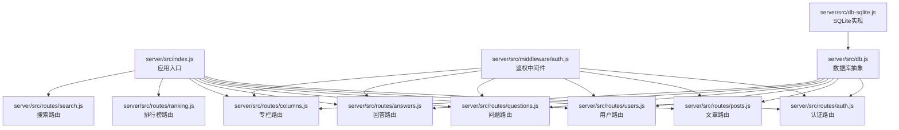
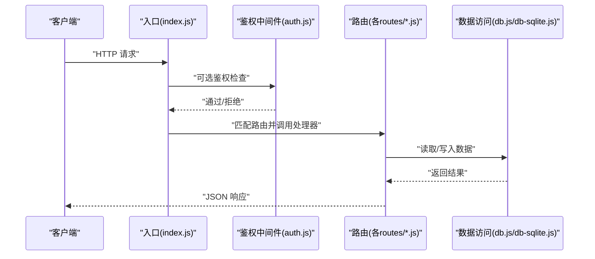
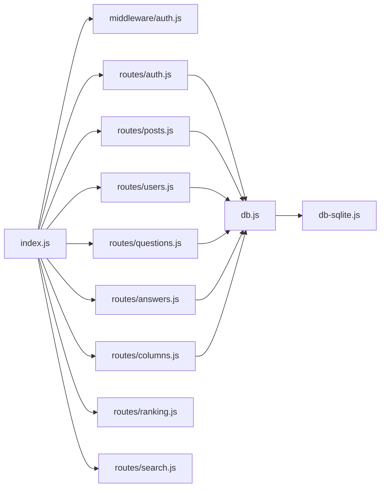

# API接口文档

<cite>
**本文引用的文件**   
- [server/src/index.js](file://server/src/index.js)
- [server/src/middleware/auth.js](file://server/src/middleware/auth.js)
- [server/src/routes/auth.js](file://server/src/routes/auth.js)
- [server/src/routes/posts.js](file://server/src/routes/posts.js)
- [server/src/routes/users.js](file://server/src/routes/users.js)
- [server/src/routes/questions.js](file://server/src/routes/questions.js)
- [server/src/routes/answers.js](file://server/src/routes/answers.js)
- [server/src/routes/columns.js](file://server/src/routes/columns.js)
- [server/src/routes/ranking.js](file://server/src/routes/ranking.js)
- [server/src/routes/search.js](file://server/src/routes/search.js)
- [server/src/db.js](file://server/src/db.js)
- [server/src/db-sqlite.js](file://server/src/db-sqlite.js)
- [API.md](file://API.md)
</cite>

## 目录
1. [简介](#简介)
2. [项目结构](#项目结构)
3. [核心组件](#核心组件)
4. [架构总览](#架构总览)
5. [详细接口说明](#详细接口说明)
6. [依赖分析](#依赖分析)
7. [性能考虑](#性能考虑)
8. [故障排查指南](#故障排查指南)
9. [结论](#结论)
10. [附录](#附录)

## 简介
本文件为后端服务暴露的RESTful API完整接口文档，覆盖认证、文章管理、用户管理、问答系统、专栏、排行榜与搜索等模块。文档包含HTTP方法、URL路径、请求参数、响应格式、状态码、错误处理、鉴权机制、版本管理与兼容性策略、客户端集成示例与最佳实践、限流与安全建议等内容。

## 项目结构
后端采用Express风格路由组织，入口文件挂载各功能模块路由，中间件统一处理鉴权与错误。数据访问层通过db.js或db-sqlite.js抽象数据库操作。

图表来源
- [server/src/index.js](file://server/src/index.js)
- [server/src/middleware/auth.js](file://server/src/middleware/auth.js)
- [server/src/routes/auth.js](file://server/src/routes/auth.js)
- [server/src/routes/posts.js](file://server/src/routes/posts.js)
- [server/src/routes/users.js](file://server/src/routes/users.js)
- [server/src/routes/questions.js](file://server/src/routes/questions.js)
- [server/src/routes/answers.js](file://server/src/routes/answers.js)
- [server/src/routes/columns.js](file://server/src/routes/columns.js)
- [server/src/routes/ranking.js](file://server/src/routes/ranking.js)
- [server/src/routes/search.js](file://server/src/routes/search.js)
- [server/src/db.js](file://server/src/db.js)
- [server/src/db-sqlite.js](file://server/src/db-sqlite.js)

章节来源
- [server/src/index.js](file://server/src/index.js)
- [server/src/middleware/auth.js](file://server/src/middleware/auth.js)
- [server/src/db.js](file://server/src/db.js)
- [server/src/db-sqlite.js](file://server/src/db-sqlite.js)

## 核心组件
- 应用入口：负责初始化服务、注册全局中间件（如鉴权）、挂载各模块路由。
- 鉴权中间件：校验请求头中的令牌，注入当前用户上下文，用于受保护资源访问控制。
- 路由模块：按功能划分，分别处理认证、文章、用户、问答、专栏、排行榜、搜索等业务逻辑。
- 数据访问层：提供统一的数据库查询与写入接口，支持不同存储实现（如SQLite）。

章节来源
- [server/src/index.js](file://server/src/index.js)
- [server/src/middleware/auth.js](file://server/src/middleware/auth.js)
- [server/src/db.js](file://server/src/db.js)
- [server/src/db-sqlite.js](file://server/src/db-sqlite.js)

## 架构总览
整体架构遵循“入口-中间件-路由-数据访问”的分层模式。所有API均通过入口统一暴露；鉴权中间件在需要时拦截并验证权限；路由将请求分发到具体业务处理器；数据访问层屏蔽底层存储差异。

图表来源
- [server/src/index.js](file://server/src/index.js)
- [server/src/middleware/auth.js](file://server/src/middleware/auth.js)
- [server/src/routes/auth.js](file://server/src/routes/auth.js)
- [server/src/routes/posts.js](file://server/src/routes/posts.js)
- [server/src/routes/users.js](file://server/src/routes/users.js)
- [server/src/routes/questions.js](file://server/src/routes/questions.js)
- [server/src/routes/answers.js](file://server/src/routes/answers.js)
- [server/src/routes/columns.js](file://server/src/routes/columns.js)
- [server/src/routes/ranking.js](file://server/src/routes/ranking.js)
- [server/src/routes/search.js](file://server/src/routes/search.js)
- [server/src/db.js](file://server/src/db.js)
- [server/src/db-sqlite.js](file://server/src/db-sqlite.js)

## 详细接口说明

### 通用约定
- 基础路径：根据部署环境确定，例如 /api/v1。
- 内容类型：默认使用 application/json。
- 认证方式：Bearer Token（JWT），需在请求头携带 Authorization: Bearer <token>。
- 分页参数：page（页码，默认1）、pageSize（每页数量，默认20）。
- 排序参数：sort（字段名）、order（asc/desc）。
- 时间戳：ISO 8601字符串。
- 统一响应体：
  - 成功：{ code, message, data }
  - 失败：{ code, message, errors? }
- 状态码：
  - 200 成功
  - 201 创建成功
  - 400 请求参数错误
  - 401 未认证
  - 403 无权限
  - 404 资源不存在
  - 409 冲突（如重复）
  - 422 语义错误（如校验失败）
  - 429 请求过多（限流）
  - 500 服务器内部错误

章节来源
- [server/src/middleware/auth.js](file://server/src/middleware/auth.js)
- [server/src/db.js](file://server/src/db.js)

### 认证接口
- 注册
  - 方法：POST
  - 路径：/auth/register
  - 请求体：用户名、邮箱、密码（最小长度要求）
  - 响应：返回用户基本信息与令牌
  - 状态码：201/409/422
- 登录
  - 方法：POST
  - 路径：/auth/login
  - 请求体：邮箱或用户名、密码
  - 响应：返回令牌与用户信息
  - 状态码：200/401/422
- 登出
  - 方法：POST
  - 路径：/auth/logout
  - 认证：需要
  - 响应：确认登出
  - 状态码：200/401
- 刷新令牌
  - 方法：POST
  - 路径：/auth/refresh
  - 认证：需要
  - 响应：返回新令牌
  - 状态码：200/401
- 获取当前用户信息
  - 方法：GET
  - 路径：/auth/me
  - 认证：需要
  - 响应：用户详情
  - 状态码：200/401

章节来源
- [server/src/routes/auth.js](file://server/src/routes/auth.js)
- [server/src/middleware/auth.js](file://server/src/middleware/auth.js)

### 文章管理接口
- 列表
  - 方法：GET
  - 路径：/posts
  - 查询参数：category、tag、author、keyword、page、pageSize、sort、order
  - 响应：文章列表与分页信息
  - 状态码：200
- 详情
  - 方法：GET
  - 路径：/posts/:id
  - 响应：文章详情
  - 状态码：200/404
- 创建
  - 方法：POST
  - 路径：/posts
  - 认证：需要
  - 请求体：标题、正文、分类、标签、封面图URL等
  - 响应：新建文章ID与元信息
  - 状态码：201/400/401/422
- 更新
  - 方法：PUT
  - 路径：/posts/:id
  - 认证：需要（作者或管理员）
  - 请求体：可更新的字段
  - 响应：更新后的文章
  - 状态码：200/403/404/422
- 删除
  - 方法：DELETE
  - 路径：/posts/:id
  - 认证：需要（作者或管理员）
  - 响应：确认删除
  - 状态码：200/403/404
- 收藏
  - 方法：POST
  - 路径：/posts/:id/favorite
  - 认证：需要
  - 响应：收藏状态
  - 状态码：200/401/404
- 取消收藏
  - 方法：DELETE
  - 路径：/posts/:id/favorite
  - 认证：需要
  - 响应：收藏状态
  - 状态码：200/401/404
- 点赞
  - 方法：POST
  - 路径：/posts/:id/like
  - 认证：需要
  - 响应：点赞状态
  - 状态码：200/401/404
- 取消点赞
  - 方法：DELETE
  - 路径：/posts/:id/like
  - 认证：需要
  - 响应：点赞状态
  - 状态码：200/401/404

章节来源
- [server/src/routes/posts.js](file://server/src/routes/posts.js)
- [server/src/middleware/auth.js](file://server/src/middleware/auth.js)

### 用户管理接口
- 获取用户资料
  - 方法：GET
  - 路径：/users/:username
  - 响应：公开资料（头像、简介、统计）
  - 状态码：200/404
- 更新个人资料
  - 方法：PUT
  - 路径：/users/profile
  - 认证：需要
  - 请求体：昵称、头像、简介等
  - 响应：更新后的资料
  - 状态码：200/401/422
- 关注/取关
  - 方法：POST/DELETE
  - 路径：/users/:username/follow
  - 认证：需要
  - 响应：关注状态
  - 状态码：200/401/404
- 粉丝列表
  - 方法：GET
  - 路径：/users/:username/followers
  - 查询参数：page、pageSize
  - 响应：粉丝列表
  - 状态码：200/404
- 关注列表
  - 方法：GET
  - 路径：/users/:username/following
  - 查询参数：page、pageSize
  - 响应：关注列表
  - 状态码：200/404

章节来源
- [server/src/routes/users.js](file://server/src/routes/users.js)
- [server/src/middleware/auth.js](file://server/src/middleware/auth.js)

### 问答系统接口
- 提问列表
  - 方法：GET
  - 路径：/questions
  - 查询参数：status、tag、author、keyword、page、pageSize、sort、order
  - 响应：问题列表与分页
  - 状态码：200
- 提问详情
  - 方法：GET
  - 路径：/questions/:id
  - 响应：问题详情与回答数
  - 状态码：200/404
- 创建问题
  - 方法：POST
  - 路径：/questions
  - 认证：需要
  - 请求体：标题、正文、标签
  - 响应：问题ID与元信息
  - 状态码：201/400/401/422
- 更新问题
  - 方法：PUT
  - 路径：/questions/:id
  - 认证：需要（作者或管理员）
  - 请求体：可更新字段
  - 响应：更新后问题
  - 状态码：200/403/404/422
- 删除问题
  - 方法：DELETE
  - 路径：/questions/:id
  - 认证：需要（作者或管理员）
  - 响应：确认删除
  - 状态码：200/403/404
- 回答列表
  - 方法：GET
  - 路径：/questions/:id/answers
  - 查询参数：page、pageSize、sort
  - 响应：回答列表
  - 状态码：200/404
- 创建回答
  - 方法：POST
  - 路径：/questions/:id/answers
  - 认证：需要
  - 请求体：正文
  - 响应：回答ID与元信息
  - 状态码：201/400/401/404
- 更新回答
  - 方法：PUT
  - 路径：/questions/:id/answers/:answerId
  - 认证：需要（作者或管理员）
  - 请求体：可更新字段
  - 响应：更新后回答
  - 状态码：200/403/404/422
- 删除回答
  - 方法：DELETE
  - 路径：/questions/:id/answers/:answerId
  - 认证：需要（作者或管理员）
  - 响应：确认删除
  - 状态码：200/403/404
- 采纳答案
  - 方法：POST
  - 路径：/questions/:id/answers/:answerId/accept
  - 认证：需要（问题作者）
  - 响应：采纳状态
  - 状态码：200/401/403/404

章节来源
- [server/src/routes/questions.js](file://server/src/routes/questions.js)
- [server/src/routes/answers.js](file://server/src/routes/answers.js)
- [server/src/middleware/auth.js](file://server/src/middleware/auth.js)

### 专栏接口
- 专栏列表
  - 方法：GET
  - 路径：/columns
  - 查询参数：keyword、page、pageSize
  - 响应：专栏列表
  - 状态码：200
- 专栏详情
  - 方法：GET
  - 路径：/columns/:slug
  - 响应：专栏信息与文章列表
  - 状态码：200/404
- 创建专栏
  - 方法：POST
  - 路径：/columns
  - 认证：需要
  - 请求体：名称、描述、封面
  - 响应：专栏ID
  - 状态码：201/400/401/409
- 更新专栏
  - 方法：PUT
  - 路径：/columns/:slug
  - 认证：需要（作者或管理员）
  - 请求体：可更新字段
  - 响应：更新后专栏
  - 状态码：200/403/404/422
- 删除专栏
  - 方法：DELETE
  - 路径：/columns/:slug
  - 认证：需要（作者或管理员）
  - 响应：确认删除
  - 状态码：200/403/404

章节来源
- [server/src/routes/columns.js](file://server/src/routes/columns.js)
- [server/src/middleware/auth.js](file://server/src/middleware/auth.js)

### 排行榜接口
- 热门排行
  - 方法：GET
  - 路径：/ranking/hot
  - 查询参数：type（post/question/user）、limit
  - 响应：排行列表
  - 状态码：200
- 最新排行
  - 方法：GET
  - 路径：/ranking/latest
  - 查询参数：type、limit
  - 响应：排行列表
  - 状态码：200

章节来源
- [server/src/routes/ranking.js](file://server/src/routes/ranking.js)

### 搜索接口
- 全文搜索
  - 方法：GET
  - 路径：/search
  - 查询参数：q、type（post/question/user/column）、page、pageSize
  - 响应：搜索结果与分页
  - 状态码：200/400

章节来源
- [server/src/routes/search.js](file://server/src/routes/search.js)

### 错误处理与常见错误码
- 错误响应体：{ code, message, errors? }
- 常见错误码：
  - 400 请求参数缺失或格式错误
  - 401 未认证或令牌无效
  - 403 无权限执行该操作
  - 404 资源不存在
  - 409 资源冲突（如重复注册）
  - 422 业务校验失败（如密码强度不足）
  - 429 请求过于频繁（限流）
  - 500 服务器内部错误

章节来源
- [server/src/middleware/auth.js](file://server/src/middleware/auth.js)

### 认证机制与权限控制
- 认证方式：JWT Bearer Token
- 令牌获取：登录成功后返回
- 令牌传递：Authorization: Bearer <token>
- 权限模型：
  - 普通用户：仅能操作自身资源
  - 作者：可编辑/删除自己创建的资源
  - 管理员：可管理全站资源
- 鉴权中间件：对受保护路由进行令牌校验与角色判断

章节来源
- [server/src/middleware/auth.js](file://server/src/middleware/auth.js)

### API版本管理与向后兼容
- 版本前缀：/api/v1
- 版本策略：
  - 新增字段保持向后兼容
  - 废弃字段保留一段时间并记录弃用通知
  - 破坏性变更需升级版本号（如v2）
- 兼容性建议：
  - 客户端忽略未知字段
  - 服务端对旧版请求做兼容处理

章节来源
- [server/src/index.js](file://server/src/index.js)

### 客户端集成示例与最佳实践
- 示例语言：JavaScript（浏览器/Node）
- 步骤：
  - 初始化基础URL与超时配置
  - 设置请求拦截器附加Authorization头
  - 处理401自动刷新令牌并重试一次
  - 统一解析响应体，抛出业务错误
  - 分页与排序参数标准化
- 最佳实践：
  - 缓存热点数据（如排行榜）
  - 重试策略与退避算法
  - 敏感信息不记录日志
  - 前端表单与服务端双重校验

章节来源
- [server/src/middleware/auth.js](file://server/src/middleware/auth.js)

### 限流策略与安全考虑
- 限流建议：
  - 基于IP与用户ID的组合限流
  - 关键接口（登录、注册、发帖）更严格限制
  - 返回429时附带Retry-After秒数
- 安全建议：
  - 强制HTTPS
  - 输入校验与输出编码
  - 防CSRF（同站场景）
  - 防XSS（富文本过滤）
  - 速率限制与异常告警

章节来源
- [server/src/middleware/auth.js](file://server/src/middleware/auth.js)

## 依赖分析
- 入口依赖鉴权中间件与各路由模块
- 路由模块依赖数据访问层
- 数据访问层可选择SQLite实现

图表来源
- [server/src/index.js](file://server/src/index.js)
- [server/src/middleware/auth.js](file://server/src/middleware/auth.js)
- [server/src/routes/auth.js](file://server/src/routes/auth.js)
- [server/src/routes/posts.js](file://server/src/routes/posts.js)
- [server/src/routes/users.js](file://server/src/routes/users.js)
- [server/src/routes/questions.js](file://server/src/routes/questions.js)
- [server/src/routes/answers.js](file://server/src/routes/answers.js)
- [server/src/routes/columns.js](file://server/src/routes/columns.js)
- [server/src/routes/ranking.js](file://server/src/routes/ranking.js)
- [server/src/routes/search.js](file://server/src/routes/search.js)
- [server/src/db.js](file://server/src/db.js)
- [server/src/db-sqlite.js](file://server/src/db-sqlite.js)

章节来源
- [server/src/index.js](file://server/src/index.js)
- [server/src/db.js](file://server/src/db.js)
- [server/src/db-sqlite.js](file://server/src/db-sqlite.js)

## 性能考虑
- 数据库索引：对常用查询字段建立索引（如author、category、tag、created_at）
- 分页与游标：避免深分页，必要时使用游标
- 缓存：热点数据（排行榜、热门文章）使用内存或外部缓存
- 连接池：合理配置数据库连接池大小
- 压缩：启用Gzip/Br压缩
- 静态资源：CDN加速图片与媒体

[本节为通用指导，无需代码来源]

## 故障排查指南
- 常见问题：
  - 401未认证：检查Authorization头与令牌有效期
  - 403无权限：确认当前用户角色与资源归属
  - 404资源不存在：核对ID或slug是否正确
  - 422校验失败：检查必填字段与格式约束
  - 429限流：降低请求频率或等待Retry-After
- 调试建议：
  - 开启详细日志（脱敏）
  - 复现最小用例
  - 检查数据库连接与事务
  - 使用Postman/curl构造请求对比

章节来源
- [server/src/middleware/auth.js](file://server/src/middleware/auth.js)

## 结论
本文档系统化梳理了后端服务的RESTful API，涵盖认证、文章、用户、问答、专栏、排行榜与搜索等模块，并提供鉴权、错误处理、版本管理、限流与安全建议。建议客户端遵循最佳实践以提升稳定性与安全性。

[本节为总结，无需代码来源]

## 附录
- 参考文档：API.md（项目内API说明）
- 数据模型：db.js/db-sqlite.js（数据库抽象与实现）

章节来源
- [API.md](file://API.md)
- [server/src/db.js](file://server/src/db.js)
- [server/src/db-sqlite.js](file://server/src/db-sqlite.js)