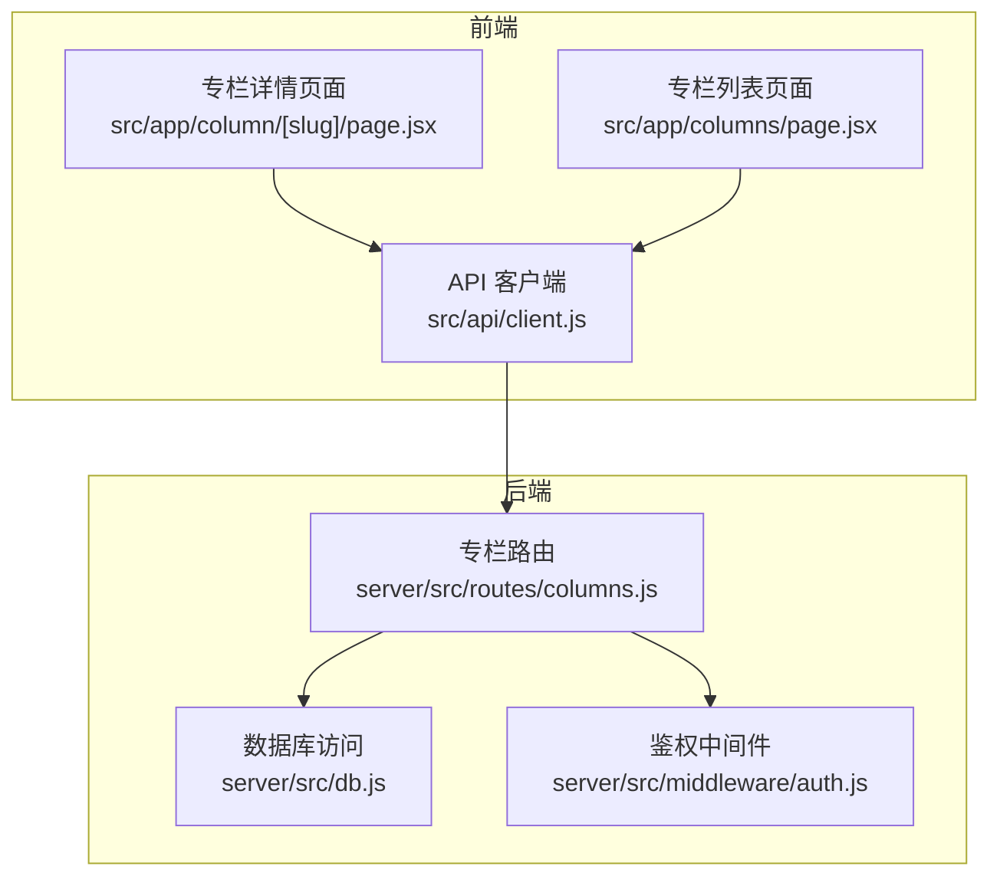
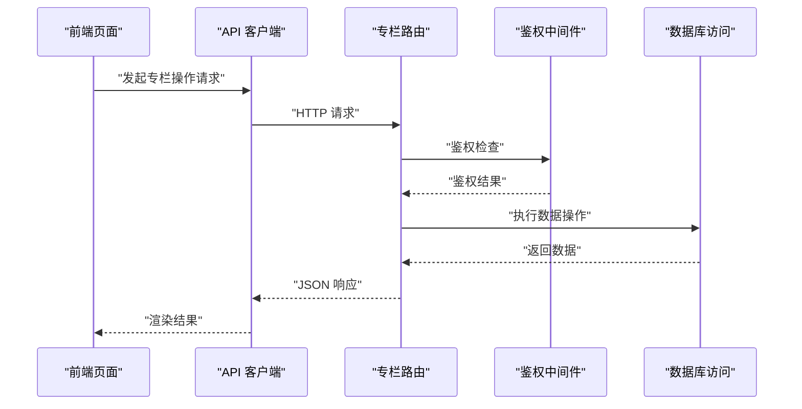
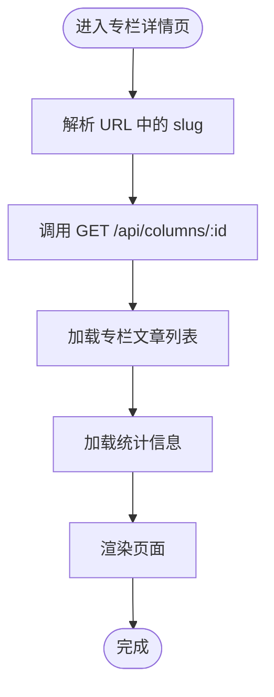
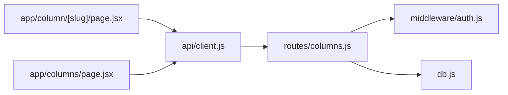

# 专栏管理接口

<cite>
**本文引用的文件**   
- [server/src/routes/columns.js](file://server/src/routes/columns.js)
- [server/src/db.js](file://server/src/db.js)
- [server/src/middleware/auth.js](file://server/src/middleware/auth.js)
- [src/app/column/[slug]/page.jsx](file://src/app/column/[slug]/page.jsx)
- [src/app/columns/page.jsx](file://src/app/columns/page.jsx)
- [src/api/client.js](file://src/api/client.js)
- [docs/05api接口文档.md](file://docs/05api接口文档.md)
</cite>

## 目录
1. [简介](#简介)
2. [项目结构](#项目结构)
3. [核心组件](#核心组件)
4. [架构总览](#架构总览)
5. [详细组件分析](#详细组件分析)
6. [依赖关系分析](#依赖关系分析)
7. [性能考虑](#性能考虑)
8. [故障排查指南](#故障排查指南)
9. [结论](#结论)
10. [附录](#附录)

## 简介
本文件面向“专栏”模块的后端与前端集成，提供完整的专栏管理接口说明。内容覆盖：
- 基础管理：创建、编辑、删除、获取专栏
- 高级功能：文章排序、订阅、统计
- 内容管理：分类、标签、封面图片
- 权限控制：公开设置、作者管理
- 数据模型与组织方式、展示逻辑
- 完整操作示例与集成指南

## 项目结构
后端采用 Node.js + Express 路由分层，数据库访问集中在 db 层；前端 Next.js 页面通过 API Client 调用后端接口。

图表来源
- [server/src/routes/columns.js](file://server/src/routes/columns.js)
- [server/src/db.js](file://server/src/db.js)
- [server/src/middleware/auth.js](file://server/src/middleware/auth.js)
- [src/app/column/[slug]/page.jsx](file://src/app/column/[slug]/page.jsx)
- [src/app/columns/page.jsx](file://src/app/columns/page.jsx)
- [src/api/client.js](file://src/api/client.js)

章节来源
- [server/src/routes/columns.js](file://server/src/routes/columns.js)
- [server/src/db.js](file://server/src/db.js)
- [server/src/middleware/auth.js](file://server/src/middleware/auth.js)
- [src/app/column/[slug]/page.jsx](file://src/app/column/[slug]/page.jsx)
- [src/app/columns/page.jsx](file://src/app/columns/page.jsx)
- [src/api/client.js](file://src/api/client.js)

## 核心组件
- 专栏路由（columns.js）：定义所有专栏相关 HTTP 接口，包含基础 CRUD、排序、订阅、统计、分类/标签/封面等扩展能力。
- 数据库访问（db.js）：封装 SQL 执行与事务，为路由层提供统一的数据读写能力。
- 鉴权中间件（auth.js）：校验登录态与角色，用于受保护接口的权限控制。
- 前端页面与客户端：Next.js 页面负责渲染与交互，API 客户端统一发起请求并处理响应。

章节来源
- [server/src/routes/columns.js](file://server/src/routes/columns.js)
- [server/src/db.js](file://server/src/db.js)
- [server/src/middleware/auth.js](file://server/src/middleware/auth.js)
- [src/app/column/[slug]/page.jsx](file://src/app/column/[slug]/page.jsx)
- [src/app/columns/page.jsx](file://src/app/columns/page.jsx)
- [src/api/client.js](file://src/api/client.js)

## 架构总览
整体采用前后端分离架构。前端通过 API 客户端调用后端路由，路由层进行参数校验、鉴权后调用数据库层完成持久化。

图表来源
- [server/src/routes/columns.js](file://server/src/routes/columns.js)
- [server/src/middleware/auth.js](file://server/src/middleware/auth.js)
- [server/src/db.js](file://server/src/db.js)
- [src/api/client.js](file://src/api/client.js)
- [src/app/column/[slug]/page.jsx](file://src/app/column/[slug]/page.jsx)

## 详细组件分析

### 专栏基础管理接口
- 创建专栏
  - 方法路径：POST /api/columns
  - 鉴权：需要登录
  - 请求体字段：名称、描述、封面图片 URL、是否公开、作者 ID 等
  - 响应：返回新建专栏的详细信息
- 更新专栏
  - 方法路径：PUT /api/columns/:id
  - 鉴权：需要登录且具备编辑权限
  - 请求体字段：可更新的任意字段（名称、描述、封面、公开状态等）
  - 响应：返回更新后的专栏信息
- 删除专栏
  - 方法路径：DELETE /api/columns/:id
  - 鉴权：需要登录且具备删除权限
  - 响应：返回删除成功或错误信息
- 获取专栏详情
  - 方法路径：GET /api/columns/:id
  - 鉴权：公开专栏无需鉴权，私有专栏需登录
  - 响应：返回专栏详情及关联元数据

章节来源
- [server/src/routes/columns.js](file://server/src/routes/columns.js)
- [server/src/middleware/auth.js](file://server/src/middleware/auth.js)

### 专栏文章排序接口
- 批量排序
  - 方法路径：PUT /api/columns/:id/posts/sort
  - 鉴权：需要登录且具备编辑权限
  - 请求体：文章 ID 顺序数组
  - 行为：按顺序更新文章在专栏中的显示次序
- 单条移动
  - 方法路径：PUT /api/columns/:id/posts/:postId/move
  - 鉴权：需要登录且具备编辑权限
  - 请求体：目标位置索引或相对移动方向
  - 行为：将指定文章移动到目标位置

章节来源
- [server/src/routes/columns.js](file://server/src/routes/columns.js)

### 专栏订阅接口
- 订阅专栏
  - 方法路径：POST /api/columns/:id/subscribe
  - 鉴权：需要登录
  - 行为：当前用户订阅该专栏
- 取消订阅
  - 方法路径：DELETE /api/columns/:id/subscribe
  - 鉴权：需要登录
  - 行为：当前用户取消订阅
- 查询订阅状态
  - 方法路径：GET /api/columns/:id/subscribe/status
  - 鉴权：可选（匿名可查看公开订阅数）
  - 响应：返回是否已订阅、订阅总数等

章节来源
- [server/src/routes/columns.js](file://server/src/routes/columns.js)

### 专栏统计接口
- 基础统计
  - 方法路径：GET /api/columns/:id/stats
  - 鉴权：公开专栏无需鉴权
  - 指标：文章数量、订阅人数、浏览量、点赞数等
- 时间维度统计
  - 方法路径：GET /api/columns/:id/stats/trend
  - 鉴权：可选
  - 指标：按日/周/月聚合的访问量、新增订阅等

章节来源
- [server/src/routes/columns.js](file://server/src/routes/columns.js)

### 内容管理接口（分类、标签、封面）
- 分类管理
  - 添加分类：POST /api/columns/:id/categories
  - 移除分类：DELETE /api/columns/:id/categories/:categoryId
  - 列出分类：GET /api/columns/:id/categories
- 标签管理
  - 添加标签：POST /api/columns/:id/tags
  - 移除标签：DELETE /api/columns/:id/tags/:tagId
  - 列出标签：GET /api/columns/:id/tags
- 封面图片
  - 上传封面：POST /api/columns/:id/cover
  - 更新封面：PUT /api/columns/:id/cover
  - 删除封面：DELETE /api/columns/:id/cover
  - 鉴权：需要登录且具备编辑权限

章节来源
- [server/src/routes/columns.js](file://server/src/routes/columns.js)

### 权限控制与作者管理接口
- 公开设置
  - 方法路径：PATCH /api/columns/:id/public
  - 鉴权：需要登录且具备管理员或作者权限
  - 行为：切换专栏公开/私有状态
- 作者管理
  - 添加作者：POST /api/columns/:id/authors
  - 移除作者：DELETE /api/columns/:id/authors/:authorId
  - 列出作者：GET /api/columns/:id/authors
  - 变更角色：PUT /api/columns/:id/authors/:authorId/role
  - 鉴权：需要登录且具备管理员权限

章节来源
- [server/src/routes/columns.js](file://server/src/routes/columns.js)
- [server/src/middleware/auth.js](file://server/src/middleware/auth.js)

### 数据模型与组织方式
- 专栏实体
  - 标识：唯一 ID
  - 属性：名称、描述、封面 URL、是否公开、创建者、更新时间等
- 专栏-文章关系
  - 有序集合：支持排序字段或位置索引
  - 约束：同一专栏内文章不重复
- 订阅关系
  - 多对多：用户与专栏的订阅记录
  - 去重：同一用户对同一专栏仅允许一条订阅
- 分类与标签
  - 分类：专栏维度的分类集合
  - 标签：专栏维度的标签集合，支持多标签
- 作者与角色
  - 角色：作者、编辑、管理员等
  - 权限：基于角色的访问控制（RBAC）

章节来源
- [server/src/db.js](file://server/src/db.js)
- [server/src/routes/columns.js](file://server/src/routes/columns.js)

### 展示逻辑与前端集成
- 专栏详情页
  - 根据 slug 解析专栏 ID，调用详情接口
  - 加载文章列表、订阅状态、统计信息
- 专栏列表页
  - 分页加载专栏列表，支持筛选与排序
- API 客户端
  - 统一封装请求头、鉴权令牌、错误处理
  - 提供类型化的方法映射到各接口

图表来源
- [src/app/column/[slug]/page.jsx](file://src/app/column/[slug]/page.jsx)
- [src/api/client.js](file://src/api/client.js)
- [server/src/routes/columns.js](file://server/src/routes/columns.js)

章节来源
- [src/app/column/[slug]/page.jsx](file://src/app/column/[slug]/page.jsx)
- [src/app/columns/page.jsx](file://src/app/columns/page.jsx)
- [src/api/client.js](file://src/api/client.js)

## 依赖关系分析
- 路由层依赖鉴权中间件与数据库访问层
- 前端页面依赖 API 客户端
- 数据库层对外暴露统一的执行接口

图表来源
- [server/src/routes/columns.js](file://server/src/routes/columns.js)
- [server/src/middleware/auth.js](file://server/src/middleware/auth.js)
- [server/src/db.js](file://server/src/db.js)
- [src/app/column/[slug]/page.jsx](file://src/app/column/[slug]/page.jsx)
- [src/app/columns/page.jsx](file://src/app/columns/page.jsx)
- [src/api/client.js](file://src/api/client.js)

章节来源
- [server/src/routes/columns.js](file://server/src/routes/columns.js)
- [server/src/middleware/auth.js](file://server/src/middleware/auth.js)
- [server/src/db.js](file://server/src/db.js)
- [src/app/column/[slug]/page.jsx](file://src/app/column/[slug]/page.jsx)
- [src/app/columns/page.jsx](file://src/app/columns/page.jsx)
- [src/api/client.js](file://src/api/client.js)

## 性能考虑
- 分页与限流：列表与统计接口应支持分页与速率限制，避免大结果集与高频请求导致性能问题
- 缓存策略：对热点专栏的详情与统计信息进行缓存，降低数据库压力
- 索引优化：为专栏 ID、文章顺序、订阅关系建立合适索引，提升查询效率
- 并发安全：排序与订阅操作使用事务保证一致性，避免竞态条件

[本节为通用指导，不涉及具体文件分析]

## 故障排查指南
- 鉴权失败
  - 现象：返回未授权或无权限错误
  - 排查：确认请求头携带有效令牌，检查中间件配置与角色权限
- 数据不一致
  - 现象：排序或订阅状态异常
  - 排查：检查事务是否正确提交，是否存在并发写入冲突
- 资源不存在
  - 现象：404 错误
  - 排查：确认 ID 或 slug 正确，检查路由匹配与数据存在性

章节来源
- [server/src/middleware/auth.js](file://server/src/middleware/auth.js)
- [server/src/routes/columns.js](file://server/src/routes/columns.js)

## 结论
本专栏管理接口体系覆盖了从基础 CRUD 到高级功能的完整场景，并通过鉴权中间件与数据库层保障安全性与一致性。前端通过统一的 API 客户端实现良好的解耦与可维护性。建议在生产环境完善缓存、索引与监控，以提升稳定性与性能。

[本节为总结性内容，不涉及具体文件分析]

## 附录

### 接口清单速查
- 基础管理
  - POST /api/columns
  - PUT /api/columns/:id
  - DELETE /api/columns/:id
  - GET /api/columns/:id
- 文章排序
  - PUT /api/columns/:id/posts/sort
  - PUT /api/columns/:id/posts/:postId/move
- 订阅
  - POST /api/columns/:id/subscribe
  - DELETE /api/columns/:id/subscribe
  - GET /api/columns/:id/subscribe/status
- 统计
  - GET /api/columns/:id/stats
  - GET /api/columns/:id/stats/trend
- 内容管理
  - POST /api/columns/:id/categories
  - DELETE /api/columns/:id/categories/:categoryId
  - GET /api/columns/:id/categories
  - POST /api/columns/:id/tags
  - DELETE /api/columns/:id/tags/:tagId
  - GET /api/columns/:id/tags
  - POST /api/columns/:id/cover
  - PUT /api/columns/:id/cover
  - DELETE /api/columns/:id/cover
- 权限与作者
  - PATCH /api/columns/:id/public
  - POST /api/columns/:id/authors
  - DELETE /api/columns/:id/authors/:authorId
  - GET /api/columns/:id/authors
  - PUT /api/columns/:id/authors/:authorId/role

章节来源
- [server/src/routes/columns.js](file://server/src/routes/columns.js)
- [docs/05api接口文档.md](file://docs/05api接口文档.md)