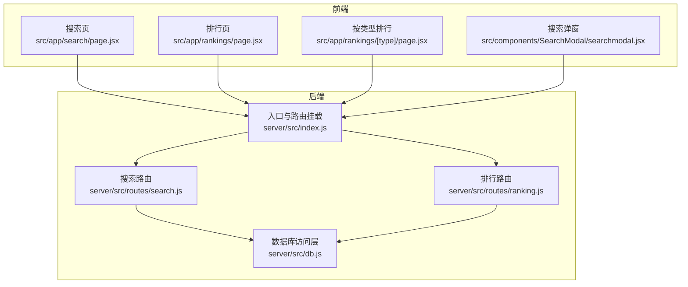
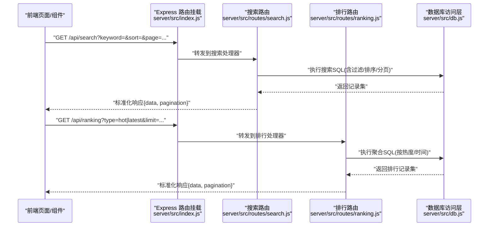
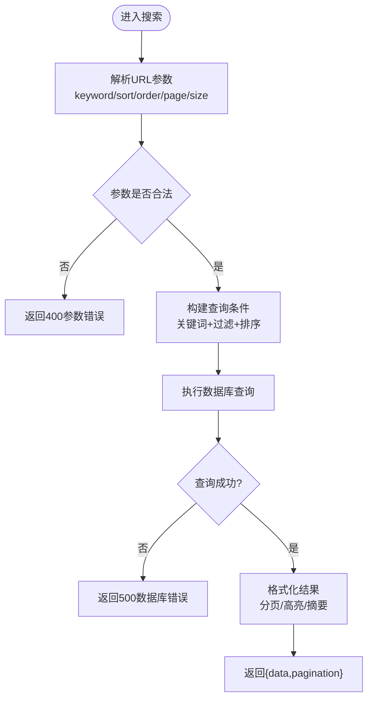
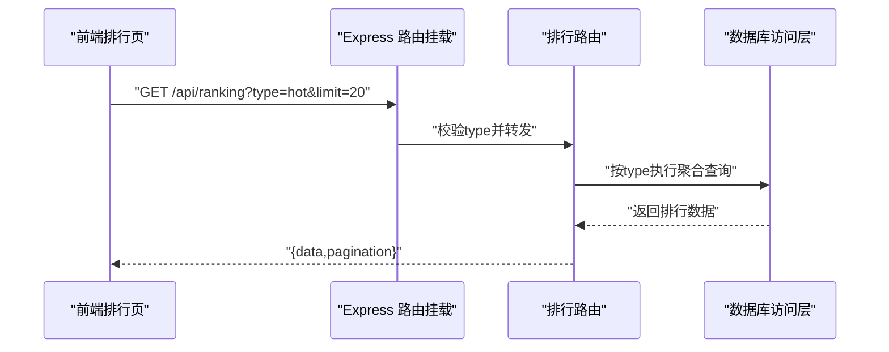
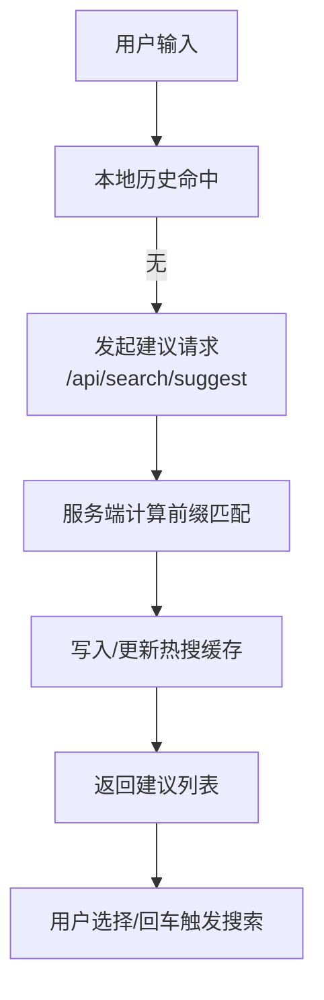
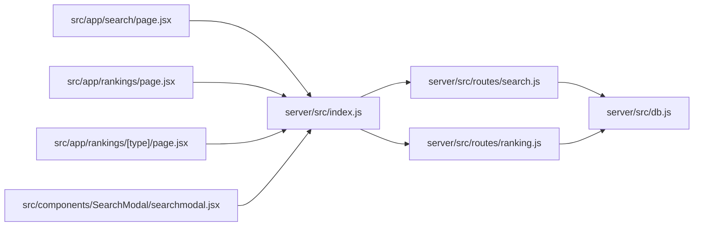

# 搜索与排行接口

<cite>
**本文引用的文件**   
- [server/src/routes/search.js](file://server/src/routes/search.js)
- [server/src/routes/ranking.js](file://server/src/routes/ranking.js)
- [server/src/db.js](file://server/src/db.js)
- [server/src/index.js](file://server/src/index.js)
- [src/app/search/page.jsx](file://src/app/search/page.jsx)
- [src/app/rankings/page.jsx](file://src/app/rankings/page.jsx)
- [src/app/rankings/[type]/page.jsx](file://src/app/rankings/[type]/page.jsx)
- [src/components/SearchModal/searchmodal.jsx](file://src/components/SearchModal/searchmodal.jsx)
- [API.md](file://API.md)
</cite>

## 目录
1. [简介](#简介)
2. [项目结构](#项目结构)
3. [核心组件](#核心组件)
4. [架构总览](#架构总览)
5. [详细组件分析](#详细组件分析)
6. [依赖关系分析](#依赖关系分析)
7. [性能考虑](#性能考虑)
8. [故障排查指南](#故障排查指南)
9. [结论](#结论)
10. [附录](#附录)

## 简介
本文件聚焦于“搜索”和“排行榜”两大能力，覆盖以下范围：
- 全文搜索、关键词匹配、搜索结果排序
- 热门排行、最新排行、推荐算法（概念性说明）
- 搜索历史、热门搜索词、搜索建议等增强功能
- 搜索索引构建、性能优化、缓存策略
- 搜索结果格式化、高亮显示、分页加载等用户体验优化
- 使用示例与最佳实践

为保证准确性，本文对后端实现的分析严格基于仓库中的路由与数据库访问层；对于尚未在后端实现的增强能力（如搜索历史、热门搜索词、搜索建议），以“概念设计”方式给出可落地的方案与前后端协作约定。

## 项目结构
与搜索/排行相关的关键位置如下：
- 后端路由
  - 搜索：server/src/routes/search.js
  - 排行：server/src/routes/ranking.js
  - 路由挂载：server/src/index.js
  - 数据库访问：server/src/db.js
- 前端页面与交互
  - 搜索页：src/app/search/page.jsx
  - 排行列表：src/app/rankings/page.jsx
  - 按类型排行：src/app/rankings/[type]/page.jsx
  - 全局搜索弹窗：src/components/SearchModal/searchmodal.jsx
- 文档与契约
  - API 概览：API.md

图表来源
- [server/src/index.js](file://server/src/index.js)
- [server/src/routes/search.js](file://server/src/routes/search.js)
- [server/src/routes/ranking.js](file://server/src/routes/ranking.js)
- [server/src/db.js](file://server/src/db.js)
- [src/app/search/page.jsx](file://src/app/search/page.jsx)
- [src/app/rankings/page.jsx](file://src/app/rankings/page.jsx)
- [src/app/rankings/[type]/page.jsx](file://src/app/rankings/[type]/page.jsx)
- [src/components/SearchModal/searchmodal.jsx](file://src/components/SearchModal/searchmodal.jsx)

章节来源
- [server/src/index.js](file://server/src/index.js)
- [server/src/routes/search.js](file://server/src/routes/search.js)
- [server/src/routes/ranking.js](file://server/src/routes/ranking.js)
- [server/src/db.js](file://server/src/db.js)
- [src/app/search/page.jsx](file://src/app/search/page.jsx)
- [src/app/rankings/page.jsx](file://src/app/rankings/page.jsx)
- [src/app/rankings/[type]/page.jsx](file://src/app/rankings/[type]/page.jsx)
- [src/components/SearchModal/searchmodal.jsx](file://src/components/SearchModal/searchmodal.jsx)

## 核心组件
- 搜索路由模块
  - 提供搜索查询、过滤、排序、分页等能力
  - 与数据库访问层对接，执行 SQL 查询并返回结构化结果
- 排行路由模块
  - 提供热门排行、最新排行等聚合查询
  - 支持按类型筛选与分页
- 数据库访问层
  - 封装数据库连接与常用查询方法
  - 为搜索与排行提供统一的数据读取入口
- 前端页面与组件
  - 搜索页负责参数组装、分页展示与结果渲染
  - 排行页负责类型切换与数据拉取
  - 搜索弹窗提供轻量级即时搜索体验

章节来源
- [server/src/routes/search.js](file://server/src/routes/search.js)
- [server/src/routes/ranking.js](file://server/src/routes/ranking.js)
- [server/src/db.js](file://server/src/db.js)
- [src/app/search/page.jsx](file://src/app/search/page.jsx)
- [src/app/rankings/page.jsx](file://src/app/rankings/page.jsx)
- [src/app/rankings/[type]/page.jsx](file://src/app/rankings/[type]/page.jsx)
- [src/components/SearchModal/searchmodal.jsx](file://src/components/SearchModal/searchmodal.jsx)

## 架构总览
搜索与排行的整体调用链路如下：

图表来源
- [server/src/index.js](file://server/src/index.js)
- [server/src/routes/search.js](file://server/src/routes/search.js)
- [server/src/routes/ranking.js](file://server/src/routes/ranking.js)
- [server/src/db.js](file://server/src/db.js)

## 详细组件分析

### 搜索接口
- 能力范围
  - 全文搜索：基于关键字在标题、内容等字段进行模糊匹配
  - 关键词匹配：支持多词组合、分词后匹配（概念性扩展）
  - 排序：支持按相关性、时间、热度等多维度排序
  - 分页：支持 page/size 或 cursor 模式
  - 过滤：支持按分类、作者、标签等条件过滤
- 请求参数（示例键名）
  - keyword: 搜索关键词
  - sort: 排序维度（如 relevance/time/hot）
  - order: 升序/降序（asc/desc）
  - category/tag/author: 过滤条件
  - page/size: 分页参数
- 响应结构（示例）
  - data: 文章/问答对象数组
  - pagination: { total, page, size, hasMore }
- 错误处理
  - 参数校验失败返回 400
  - 数据库异常返回 500 并附带简要错误信息
- 前端集成要点
  - 防抖输入、取消重复请求
  - 空状态与骨架屏
  - 结果高亮与片段摘要

图表来源
- [server/src/routes/search.js](file://server/src/routes/search.js)
- [server/src/db.js](file://server/src/db.js)

章节来源
- [server/src/routes/search.js](file://server/src/routes/search.js)
- [server/src/db.js](file://server/src/db.js)
- [src/app/search/page.jsx](file://src/app/search/page.jsx)

### 排行接口
- 能力范围
  - 热门排行：按点赞数、浏览量、评论数等综合指标排序
  - 最新排行：按发布时间倒序
  - 推荐算法：概念性说明（见下文“推荐算法”小节）
- 请求参数（示例键名）
  - type: hot/latest（可扩展更多维度）
  - limit: 返回条数上限
  - page/size: 分页参数
- 响应结构（示例）
  - data: 排行条目数组
  - pagination: { total, page, size, hasMore }
- 错误处理
  - 非法 type 返回 400
  - 数据库异常返回 500

图表来源
- [server/src/routes/ranking.js](file://server/src/routes/ranking.js)
- [server/src/db.js](file://server/src/db.js)
- [server/src/index.js](file://server/src/index.js)

章节来源
- [server/src/routes/ranking.js](file://server/src/routes/ranking.js)
- [server/src/db.js](file://server/src/db.js)
- [src/app/rankings/page.jsx](file://src/app/rankings/page.jsx)
- [src/app/rankings/[type]/page.jsx](file://src/app/rankings/[type]/page.jsx)

### 增强功能（概念设计）
以下为当前仓库未在后端直接实现的增强能力，提供落地方案与前后端约定，便于后续迭代：

- 搜索历史
  - 存储：用户维度的本地存储 + 服务端可选持久化表
  - 接口：GET /api/search/history、POST /api/search/history、DELETE /api/search/history/:id
  - 行为：去重、限制数量、最近优先
- 热门搜索词
  - 统计：基于搜索日志的 T+1 离线统计或实时计数
  - 接口：GET /api/search/trending
  - 更新：定时任务刷新缓存
- 搜索建议（自动补全）
  - 数据源：标题前缀、标签、作者名
  - 接口：GET /api/search/suggest?q=...
  - 优化：Redis 缓存热点前缀

[本节为概念设计，不直接分析具体源码文件]

### 推荐算法（概念说明）
- 规则型推荐
  - 基于标签相似度、作者关注关系、浏览/收藏/点赞权重
- 协同过滤
  - 用户-物品矩阵，近邻相似度，Top-N 推荐
- 混合策略
  - 冷启动采用热门/最新兜底，有行为数据后逐步引入个性化

[本节为概念说明，不直接分析具体源码文件]

## 依赖关系分析
- 路由层依赖
  - server/src/index.js 将 /api/search 与 /api/ranking 挂载到 Express 应用
- 业务层依赖
  - server/src/routes/search.js 与 server/src/routes/ranking.js 均依赖 server/src/db.js 完成数据读取
- 前端依赖
  - src/app/search/page.jsx、src/app/rankings/page.jsx 与 src/components/SearchModal/searchmodal.jsx 通过 HTTP 客户端调用后端接口

图表来源
- [server/src/index.js](file://server/src/index.js)
- [server/src/routes/search.js](file://server/src/routes/search.js)
- [server/src/routes/ranking.js](file://server/src/routes/ranking.js)
- [server/src/db.js](file://server/src/db.js)
- [src/app/search/page.jsx](file://src/app/search/page.jsx)
- [src/app/rankings/page.jsx](file://src/app/rankings/page.jsx)
- [src/app/rankings/[type]/page.jsx](file://src/app/rankings/[type]/page.jsx)
- [src/components/SearchModal/searchmodal.jsx](file://src/components/SearchModal/searchmodal.jsx)

章节来源
- [server/src/index.js](file://server/src/index.js)
- [server/src/routes/search.js](file://server/src/routes/search.js)
- [server/src/routes/ranking.js](file://server/src/routes/ranking.js)
- [server/src/db.js](file://server/src/db.js)
- [src/app/search/page.jsx](file://src/app/search/page.jsx)
- [src/app/rankings/page.jsx](file://src/app/rankings/page.jsx)
- [src/app/rankings/[type]/page.jsx](file://src/app/rankings/[type]/page.jsx)
- [src/components/SearchModal/searchmodal.jsx](file://src/components/SearchModal/searchmodal.jsx)

## 性能考虑
- 数据库层面
  - 为高频查询字段建立索引（如标题、内容、更新时间、点赞数、浏览量）
  - 避免 SELECT *，仅返回必要字段
  - 使用 LIMIT/OFFSET 或游标分页，避免深分页
- 查询优化
  - 关键词匹配尽量使用数据库内置全文检索或 LIKE 配合索引
  - 复杂排序与过滤合并为单次查询，减少往返
- 缓存策略
  - 热点排行结果短期缓存（如 Redis，TTL 分钟级）
  - 搜索建议与热门搜索词缓存
  - 前端请求去重与防抖，避免抖动式重复请求
- 前端体验
  - 分页懒加载与虚拟滚动
  - 结果高亮与摘要裁剪，减少首屏体积
  - 骨架屏与错误重试机制

[本节提供通用指导，不直接分析具体源码文件]

## 故障排查指南
- 常见问题
  - 400 参数错误：检查 keyword、sort、order、page、size 等必填与取值范围
  - 500 数据库错误：查看后端日志，确认连接、权限与 SQL 语法
  - 空结果：确认关键词是否存在、过滤条件是否过严
- 定位步骤
  - 打开浏览器开发者工具，查看网络请求与响应体
  - 在后端日志中检索对应请求 ID 或时间戳
  - 复现最小用例，逐步缩小问题范围
- 恢复建议
  - 临时放宽过滤条件验证
  - 降级非关键功能（如高亮、摘要）
  - 重启服务或回滚变更

章节来源
- [server/src/routes/search.js](file://server/src/routes/search.js)
- [server/src/routes/ranking.js](file://server/src/routes/ranking.js)
- [server/src/db.js](file://server/src/db.js)

## 结论
本项目已具备基础的搜索与排行能力，并通过清晰的前后端分层与统一的数据库访问层支撑了主要流程。建议在后续迭代中完善增强功能（搜索历史、热门搜索词、搜索建议）与推荐算法，同时结合索引与缓存策略提升性能与稳定性。

## 附录
- 使用示例与最佳实践
  - 搜索
    - 基础搜索：传入 keyword，默认按相关性排序，page=1
    - 高级搜索：叠加 category/tag/author 过滤，指定 sort=time&order=desc
    - 分页：合理设置 size（如 20），避免过大导致响应缓慢
  - 排行
    - 热门：type=hot，limit 控制返回量
    - 最新：type=latest，适合发现新内容
  - 前端
    - 搜索框增加防抖与取消逻辑
    - 结果页提供高亮与摘要，提升可读性
    - 排行页支持类型切换与无限滚动
- 参考文档
  - API 概览：API.md

章节来源
- [API.md](file://API.md)