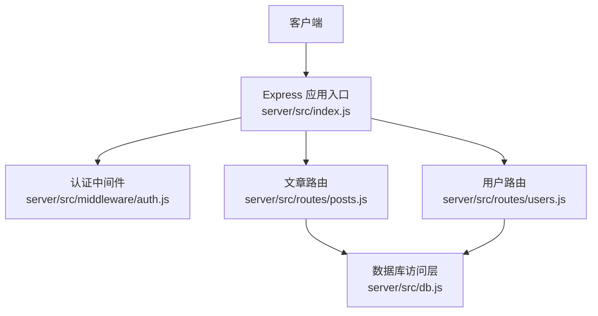
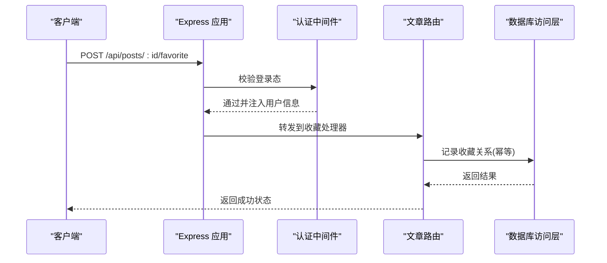
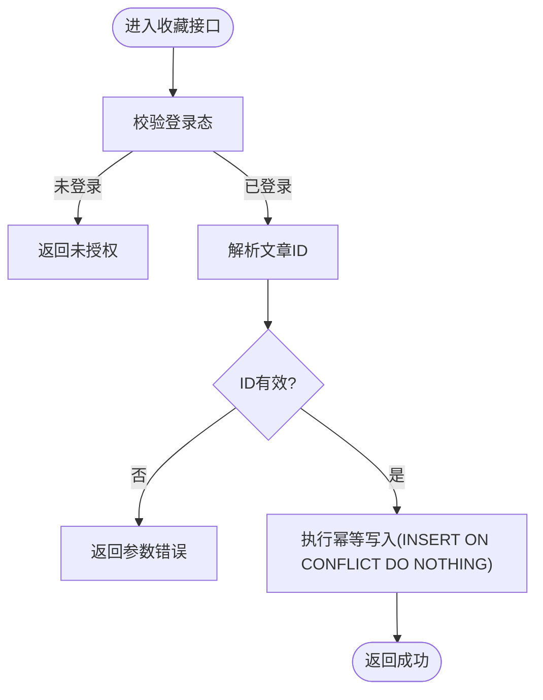
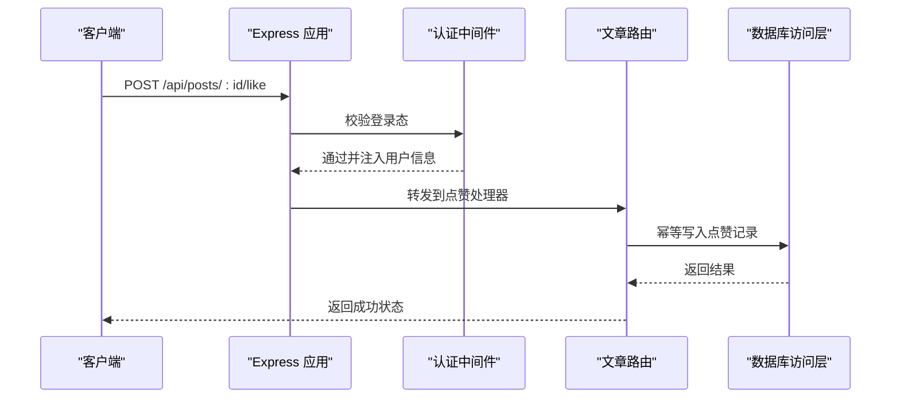
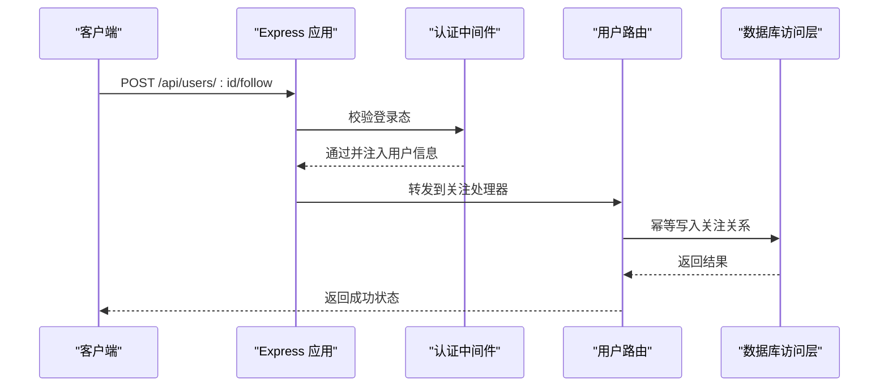
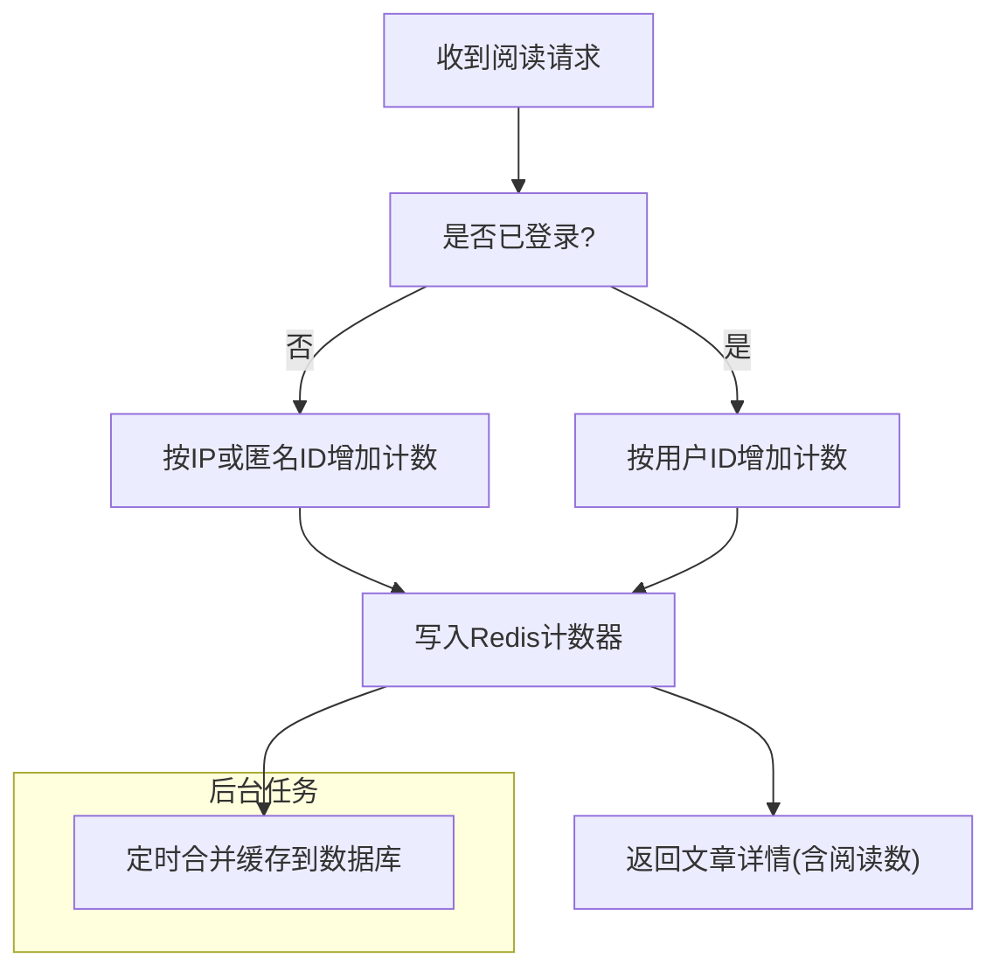
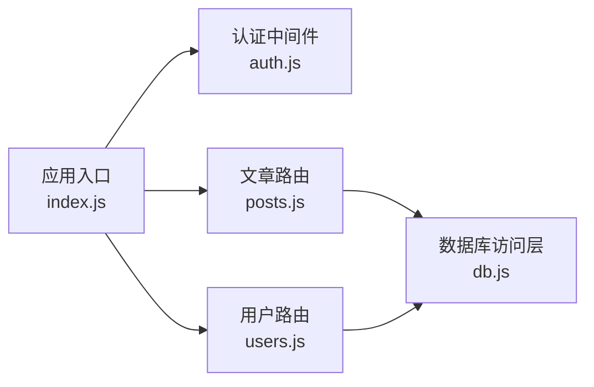

# 文章互动功能

<cite>
**本文引用的文件**   
- [server/src/routes/posts.js](file://server/src/routes/posts.js)
- [server/src/routes/users.js](file://server/src/routes/users.js)
- [server/src/middleware/auth.js](file://server/src/middleware/auth.js)
- [server/src/db.js](file://server/src/db.js)
- [server/src/index.js](file://server/src/index.js)
- [src/components/ShareButtons/ShareButtons.jsx](file://src/components/ShareButtons/ShareButtons.jsx)
- [src/components/FollowButton/followbutton.jsx](file://src/components/FollowButton/followbutton.jsx)
- [src/components/CommentSection/CommentSection.jsx](file://src/components/CommentSection/CommentSection.jsx)
</cite>

## 目录
1. [简介](#简介)
2. [项目结构](#项目结构)
3. [核心组件](#核心组件)
4. [架构总览](#架构总览)
5. [详细组件分析](#详细组件分析)
6. [依赖分析](#依赖分析)
7. [性能考虑](#性能考虑)
8. [故障排查指南](#故障排查指南)
9. [结论](#结论)
10. [附录](#附录)

## 简介
本文档聚焦“文章互动”相关API，覆盖收藏、取消收藏、点赞、取消点赞、关注作者、取消关注、分享、评论关联与阅读量统计等社交能力。文档同时给出缓存策略、防刷机制与并发处理方案建议，帮助读者在现有后端基础上扩展或优化互动功能。

## 项目结构
后端采用Express路由组织业务接口，认证中间件统一鉴权，数据访问通过数据库模块封装；前端提供分享按钮、关注按钮与评论区组件，便于调用相应API。

图表来源
- [server/src/index.js](file://server/src/index.js)
- [server/src/middleware/auth.js](file://server/src/middleware/auth.js)
- [server/src/routes/posts.js](file://server/src/routes/posts.js)
- [server/src/routes/users.js](file://server/src/routes/users.js)
- [server/src/db.js](file://server/src/db.js)

章节来源
- [server/src/index.js](file://server/src/index.js)
- [server/src/middleware/auth.js](file://server/src/middleware/auth.js)
- [server/src/routes/posts.js](file://server/src/routes/posts.js)
- [server/src/routes/users.js](file://server/src/routes/users.js)
- [server/src/db.js](file://server/src/db.js)

## 核心组件
- 认证中间件：校验登录态（如JWT），为受保护接口提供鉴权上下文。
- 文章路由：承载文章相关的互动接口（收藏、点赞、阅读计数等）。
- 用户路由：承载用户关系管理接口（关注、取消关注）。
- 数据库访问层：封装SQL/ORM操作，保证事务与一致性。

章节来源
- [server/src/middleware/auth.js](file://server/src/middleware/auth.js)
- [server/src/routes/posts.js](file://server/src/routes/posts.js)
- [server/src/routes/users.js](file://server/src/routes/users.js)
- [server/src/db.js](file://server/src/db.js)

## 架构总览
下图展示一次典型“收藏文章”请求的端到端流程，包括鉴权、路由分发、业务逻辑与持久化。

图表来源
- [server/src/index.js](file://server/src/index.js)
- [server/src/middleware/auth.js](file://server/src/middleware/auth.js)
- [server/src/routes/posts.js](file://server/src/routes/posts.js)
- [server/src/db.js](file://server/src/db.js)

## 详细组件分析

### 文章收藏与取消收藏
- 接口定义
  - 收藏文章：POST /api/posts/:id/favorite
  - 取消收藏：DELETE /api/posts/:id/favorite
- 鉴权要求
  - 需要已登录用户身份（由认证中间件校验）
- 行为说明
  - 收藏：若已收藏则幂等返回成功；未收藏则插入收藏记录
  - 取消收藏：若存在收藏记录则删除；不存在则幂等返回成功
- 响应约定
  - 成功：返回通用成功状态码与消息
  - 失败：返回错误码与提示信息（如未登录、参数非法、服务器错误）
- 数据模型建议
  - 收藏表包含字段：用户ID、文章ID、创建时间；唯一约束(user_id, post_id)保障幂等
- 并发与一致性
  - 使用唯一约束或UPSERT语义避免重复插入
  - 高并发场景可引入分布式锁或队列落库，降低热点行竞争

图表来源
- [server/src/middleware/auth.js](file://server/src/middleware/auth.js)
- [server/src/routes/posts.js](file://server/src/routes/posts.js)
- [server/src/db.js](file://server/src/db.js)

章节来源
- [server/src/routes/posts.js](file://server/src/routes/posts.js)
- [server/src/middleware/auth.js](file://server/src/middleware/auth.js)
- [server/src/db.js](file://server/src/db.js)

### 文章点赞与取消点赞
- 接口定义
  - 点赞文章：POST /api/posts/:id/like
  - 取消点赞：DELETE /api/posts/:id/like
- 鉴权要求
  - 需要已登录用户身份
- 行为说明
  - 点赞：若已点赞则幂等返回成功；未点赞则插入点赞记录
  - 取消点赞：若存在点赞记录则删除；不存在则幂等返回成功
- 数据模型建议
  - 点赞表包含字段：用户ID、文章ID、创建时间；唯一约束(user_id, post_id)
- 并发与一致性
  - 同收藏，使用唯一约束或UPSERT保障幂等
  - 热点文章可采用异步聚合更新“文章点赞数”，读路径走缓存

图表来源
- [server/src/index.js](file://server/src/index.js)
- [server/src/middleware/auth.js](file://server/src/middleware/auth.js)
- [server/src/routes/posts.js](file://server/src/routes/posts.js)
- [server/src/db.js](file://server/src/db.js)

章节来源
- [server/src/routes/posts.js](file://server/src/routes/posts.js)
- [server/src/middleware/auth.js](file://server/src/middleware/auth.js)
- [server/src/db.js](file://server/src/db.js)

### 关注作者与取消关注
- 接口定义
  - 关注作者：POST /api/users/:id/follow
  - 取消关注：DELETE /api/users/:id/follow
- 鉴权要求
  - 需要已登录用户身份
- 行为说明
  - 关注：若已关注则幂等返回成功；未关注则插入关注关系
  - 取消关注：若存在关注关系则删除；不存在则幂等返回成功
- 数据模型建议
  - 关注表包含字段：关注者ID、被关注者ID、创建时间；唯一约束(follower_id, followee_id)
- 并发与一致性
  - 使用唯一约束或UPSERT保障幂等
  - 关注列表查询可结合Redis集合缓存，减少热点用户读取压力

图表来源
- [server/src/index.js](file://server/src/index.js)
- [server/src/middleware/auth.js](file://server/src/middleware/auth.js)
- [server/src/routes/users.js](file://server/src/routes/users.js)
- [server/src/db.js](file://server/src/db.js)

章节来源
- [server/src/routes/users.js](file://server/src/routes/users.js)
- [server/src/middleware/auth.js](file://server/src/middleware/auth.js)
- [server/src/db.js](file://server/src/db.js)

### 文章分享
- 前端实现
  - 分享按钮组件负责触发系统分享或复制链接，不强制依赖后端接口
- 可选后端支持
  - 如需统计分享次数，可提供接口记录分享事件（用户ID、文章ID、渠道、时间戳）
- 前端组件参考
  - [src/components/ShareButtons/ShareButtons.jsx](file://src/components/ShareButtons/ShareButtons.jsx)

章节来源
- [src/components/ShareButtons/ShareButtons.jsx](file://src/components/ShareButtons/ShareButtons.jsx)

### 评论关联
- 前端实现
  - 评论区组件用于渲染评论列表与提交评论，通常需配合评论相关接口
- 后端建议
  - 评论接口应绑定文章ID与作者ID，支持分页与排序
  - 评论计数可与文章详情聚合返回
- 前端组件参考
  - [src/components/CommentSection/CommentSection.jsx](file://src/components/CommentSection/CommentSection.jsx)

章节来源
- [src/components/CommentSection/CommentSection.jsx](file://src/components/CommentSection/CommentSection.jsx)

### 阅读量统计
- 设计要点
  - 读多写少，建议使用计数器+缓存：每次阅读先写缓存，定时批量落库
  - 去重策略：基于用户ID+文章ID+时间窗口（如5分钟内）去重
- 接口建议
  - 获取文章详情时附带阅读数（从缓存或数据库读取）
  - 后台任务定期将缓存中的增量计数合并至数据库

[本图为概念流程图，无需图表来源]

## 依赖分析
- 路由与中间件耦合
  - 文章路由与用户路由均依赖认证中间件进行鉴权
- 数据访问解耦
  - 路由层仅调用数据库访问层，便于替换存储或引入缓存
- 外部依赖
  - 数据库驱动与连接池配置位于数据库模块中

图表来源
- [server/src/index.js](file://server/src/index.js)
- [server/src/middleware/auth.js](file://server/src/middleware/auth.js)
- [server/src/routes/posts.js](file://server/src/routes/posts.js)
- [server/src/routes/users.js](file://server/src/routes/users.js)
- [server/src/db.js](file://server/src/db.js)

章节来源
- [server/src/index.js](file://server/src/index.js)
- [server/src/middleware/auth.js](file://server/src/middleware/auth.js)
- [server/src/routes/posts.js](file://server/src/routes/posts.js)
- [server/src/routes/users.js](file://server/src/routes/users.js)
- [server/src/db.js](file://server/src/db.js)

## 性能考虑
- 缓存策略
  - 点赞/收藏/关注状态：使用Redis集合或哈希缓存用户-对象关系，TTL按需设置
  - 阅读计数：使用Redis计数器，后台任务批量落库
  - 文章详情：聚合阅读数、点赞数、收藏数后缓存短TTL
- 防刷机制
  - 接口级限流：基于用户ID/IP的滑动窗口限流
  - 幂等性：所有写操作必须幂等（唯一约束/UPSERT）
  - 验证码/挑战：对高频敏感接口启用验证码或令牌校验
- 并发处理
  - 数据库层使用事务与唯一约束保证一致性
  - 热点行竞争：引入分布式锁或队列串行化写操作
  - 读写分离：读路径优先走缓存，写路径落库后失效缓存

[本节为通用指导，无需章节来源]

## 故障排查指南
- 常见问题
  - 未登录或Token过期：检查认证中间件与前端携带的凭证
  - 参数非法：确认URL参数与请求体格式
  - 重复操作：确认幂等逻辑与唯一约束生效
  - 缓存不一致：核对缓存失效策略与后台合并任务
- 定位步骤
  - 查看接口日志与错误码
  - 检查数据库唯一约束冲突日志
  - 验证Redis键空间与TTL
  - 复现并发场景，观察锁与队列执行情况

[本节为通用指导，无需章节来源]

## 结论
本文档梳理了文章互动相关API的设计与实现要点，涵盖收藏、点赞、关注及其取消操作，并补充了分享、评论关联与阅读计数的建议方案。通过幂等设计、缓存与限流策略，可在保证一致性的前提下提升系统吞吐与稳定性。

## 附录
- 前端交互组件参考
  - 分享按钮：[src/components/ShareButtons/ShareButtons.jsx](file://src/components/ShareButtons/ShareButtons.jsx)
  - 关注按钮：[src/components/FollowButton/followbutton.jsx](file://src/components/FollowButton/followbutton.jsx)
  - 评论区：[src/components/CommentSection/CommentSection.jsx](file://src/components/CommentSection/CommentSection.jsx)

章节来源
- [src/components/ShareButtons/ShareButtons.jsx](file://src/components/ShareButtons/ShareButtons.jsx)
- [src/components/FollowButton/followbutton.jsx](file://src/components/FollowButton/followbutton.jsx)
- [src/components/CommentSection/CommentSection.jsx](file://src/components/CommentSection/CommentSection.jsx)