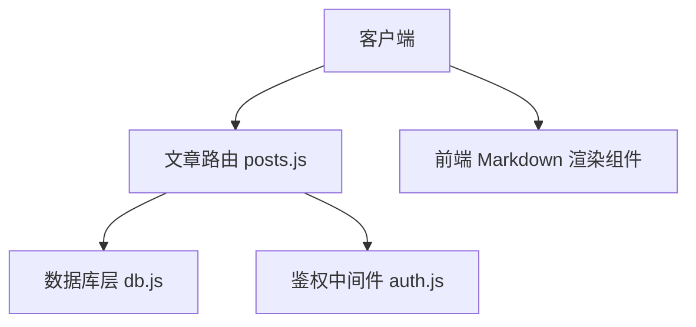
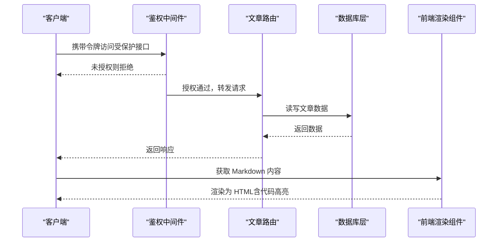
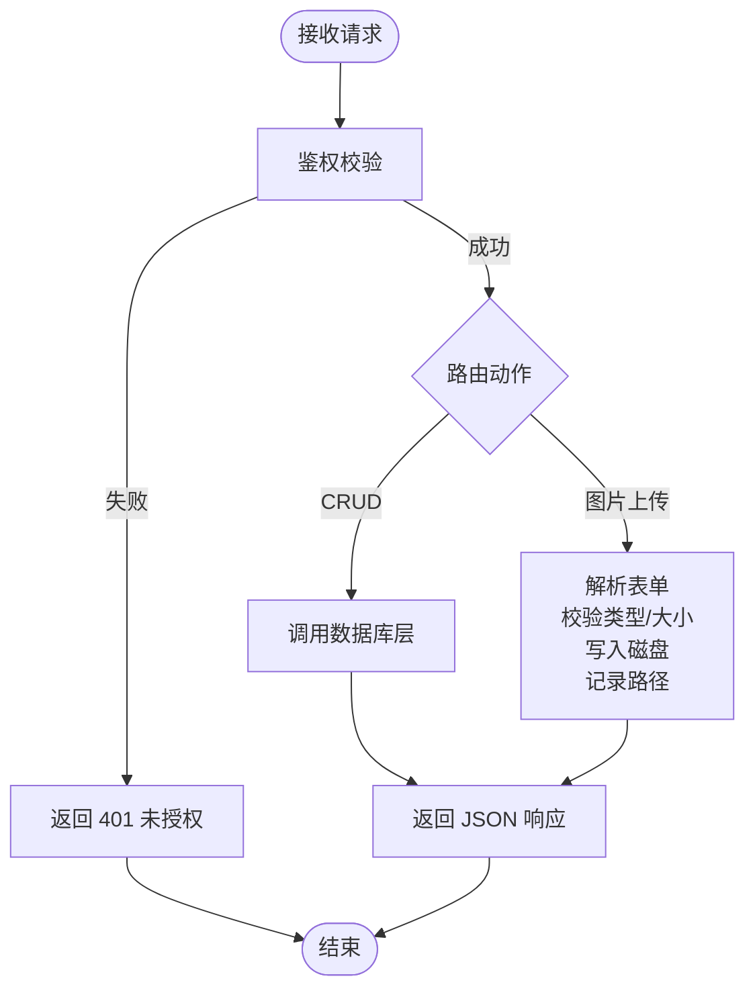
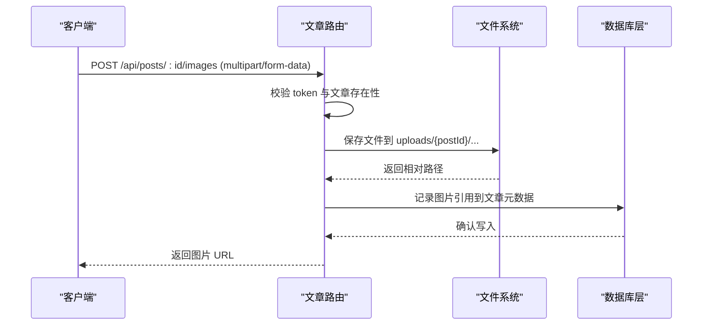
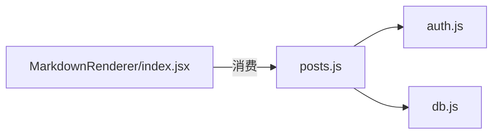

# 文章内容管理

<cite>
**本文引用的文件**   
- [server/src/routes/posts.js](file://server/src/routes/posts.js)
- [server/src/db.js](file://server/src/db.js)
- [server/src/middleware/auth.js](file://server/src/middleware/auth.js)
- [src/components/MarkdownRenderer/index.jsx](file://src/components/MarkdownRenderer/index.jsx)
- [API.md](file://API.md)
- [docs/05api接口文档.md](file://docs/05api接口文档.md)
</cite>

## 目录
1. [简介](#简介)
2. [项目结构](#项目结构)
3. [核心组件](#核心组件)
4. [架构总览](#架构总览)
5. [详细组件分析](#详细组件分析)
6. [依赖分析](#依赖分析)
7. [性能考虑](#性能考虑)
8. [故障排查指南](#故障排查指南)
9. [结论](#结论)
10. [附录](#附录)

## 简介
本文件面向“文章内容管理”的 API 设计与实现，覆盖 Markdown 内容处理、HTML 渲染、代码高亮、图片上传（POST /api/posts/:id/images）、附件管理、富文本编辑支持、版本控制、草稿自动保存、内容预览以及安全过滤（XSS 防护、敏感词检测）等能力。文档以现有后端路由与数据库层为基础，结合前端渲染组件进行说明，并提供可落地的扩展建议与最佳实践。

## 项目结构
- 后端服务位于 server 目录，文章相关路由集中在 routes/posts.js，数据访问通过 db.js 封装，鉴权中间件在 middleware/auth.js。
- 前端 Markdown 渲染组件位于 src/components/MarkdownRenderer/index.jsx，用于将 Markdown 转换为 HTML 并支持代码高亮等特性。
- API 文档参考：根目录 API.md 与 docs/05api接口文档.md。

图表来源
- [server/src/routes/posts.js](file://server/src/routes/posts.js)
- [server/src/db.js](file://server/src/db.js)
- [server/src/middleware/auth.js](file://server/src/middleware/auth.js)
- [src/components/MarkdownRenderer/index.jsx](file://src/components/MarkdownRenderer/index.jsx)

章节来源
- [server/src/routes/posts.js](file://server/src/routes/posts.js)
- [server/src/db.js](file://server/src/db.js)
- [server/src/middleware/auth.js](file://server/src/middleware/auth.js)
- [src/components/MarkdownRenderer/index.jsx](file://src/components/MarkdownRenderer/index.jsx)
- [API.md](file://API.md)
- [docs/05api接口文档.md](file://docs/05api接口文档.md)

## 核心组件
- 文章路由层（posts.js）
  - 提供文章的增删改查、发布状态切换、评论关联、收藏/点赞等接口。
  - 包含图片上传端点 POST /api/posts/:id/images。
  - 集成鉴权中间件，对写操作进行权限校验。
- 数据库层（db.js）
  - 封装 SQLite 连接与常用查询方法，供路由层调用。
- 鉴权中间件（auth.js）
  - 校验登录态与角色，保护需要管理员或作者权限的接口。
- 前端渲染组件（MarkdownRenderer/index.jsx）
  - 负责将 Markdown 渲染为 HTML，支持代码高亮与安全过滤策略。

章节来源
- [server/src/routes/posts.js](file://server/src/routes/posts.js)
- [server/src/db.js](file://server/src/db.js)
- [server/src/middleware/auth.js](file://server/src/middleware/auth.js)
- [src/components/MarkdownRenderer/index.jsx](file://src/components/MarkdownRenderer/index.jsx)

## 架构总览
文章管理的整体流程如下：客户端发起请求，经鉴权中间件校验后进入文章路由；路由根据业务逻辑调用数据库层完成持久化；返回结果给客户端；前端使用 Markdown 渲染组件展示内容。

图表来源
- [server/src/routes/posts.js](file://server/src/routes/posts.js)
- [server/src/db.js](file://server/src/db.js)
- [server/src/middleware/auth.js](file://server/src/middleware/auth.js)
- [src/components/MarkdownRenderer/index.jsx](file://src/components/MarkdownRenderer/index.jsx)

## 详细组件分析

### 文章路由（posts.js）
- 功能范围
  - 文章列表、详情、创建、更新、删除、发布状态切换。
  - 评论与收藏/点赞关联。
  - 图片上传：POST /api/posts/:id/images。
  - 鉴权保护：写操作需登录，部分操作需管理员或作者权限。
- 关键设计
  - 统一错误处理与状态码返回。
  - 文件上传采用 multipart/form-data，服务端存储到 uploads 目录，并在数据库中记录引用路径。
  - 与数据库层解耦，便于替换存储后端。

图表来源
- [server/src/routes/posts.js](file://server/src/routes/posts.js)
- [server/src/middleware/auth.js](file://server/src/middleware/auth.js)

章节来源
- [server/src/routes/posts.js](file://server/src/routes/posts.js)
- [server/src/middleware/auth.js](file://server/src/middleware/auth.js)

### 数据库层（db.js）
- 职责
  - 初始化数据库连接。
  - 提供统一的查询、插入、更新、删除方法。
- 设计要点
  - 错误捕获与日志输出。
  - 参数化查询防止 SQL 注入。
  - 事务支持（如需要）。

章节来源
- [server/src/db.js](file://server/src/db.js)

### 鉴权中间件（auth.js）
- 职责
  - 校验请求头中的认证信息。
  - 基于用户角色决定放行或拒绝。
- 适用场景
  - 文章创建、更新、删除、发布、图片上传等写操作。

章节来源
- [server/src/middleware/auth.js](file://server/src/middleware/auth.js)

### 前端 Markdown 渲染（MarkdownRenderer/index.jsx）
- 功能
  - 将 Markdown 转换为 HTML。
  - 支持代码块高亮。
  - 可选的安全过滤策略（白名单标签/属性）。
- 注意事项
  - 避免直接渲染不可信 HTML，优先使用 Markdown 输入 + 安全转换。
  - 对图片链接做域名白名单校验。

章节来源
- [src/components/MarkdownRenderer/index.jsx](file://src/components/MarkdownRenderer/index.jsx)

### 图片上传接口（POST /api/posts/:id/images）
- 请求
  - 方法：POST
  - 路径：/api/posts/:id/images
  - 头部：Content-Type: multipart/form-data；Authorization: Bearer <token>
  - 表单字段：image（文件）
- 响应
  - 成功：返回图片 URL 或资源标识
  - 失败：返回错误码与消息（如格式不支持、大小超限、未授权）
- 约束
  - 仅允许指定图片格式（如 jpg/png/gif/webp）。
  - 限制单文件大小（例如不超过 5MB）。
  - 文件名去重与防覆盖策略。
  - 存储路径按文章 ID 隔离。

图表来源
- [server/src/routes/posts.js](file://server/src/routes/posts.js)
- [server/src/db.js](file://server/src/db.js)

章节来源
- [server/src/routes/posts.js](file://server/src/routes/posts.js)
- [server/src/db.js](file://server/src/db.js)

### 附件管理
- 目标
  - 统一管理非图片类附件（PDF、DOCX、ZIP 等）。
- 建议接口
  - POST /api/posts/:id/attachments：上传附件，返回附件 URL 与元信息。
  - GET /api/posts/:id/attachments：列出文章附件。
  - DELETE /api/posts/:id/attachments/:aid：删除附件。
- 约束
  - 白名单后缀与大小限制。
  - 病毒扫描（可选）。
  - 访问控制：仅作者/管理员可管理。

章节来源
- [server/src/routes/posts.js](file://server/src/routes/posts.js)

### 富文本编辑支持
- 输入形式
  - 推荐以 Markdown 作为唯一权威源，编辑器输出 Markdown。
  - 如需纯 HTML 富文本，需在服务端进行严格白名单过滤。
- 渲染
  - 前端使用 MarkdownRenderer 组件进行转换与高亮。
- 版本与草稿
  - 见下一节。

章节来源
- [src/components/MarkdownRenderer/index.jsx](file://src/components/MarkdownRenderer/index.jsx)

### 内容版本控制
- 目标
  - 保留文章历史版本，支持回滚与对比。
- 建议设计
  - 新增表 posts_versions：version_id, post_id, content_snapshot, meta, created_at。
  - 发布时自动生成版本快照。
  - 提供接口：
    - GET /api/posts/:id/versions：列出版本。
    - GET /api/posts/:id/versions/:vid：获取版本详情。
    - POST /api/posts/:id/restore?version=:vid：恢复到指定版本。
- 一致性
  - 版本快照与主内容变更在同一事务中提交。

章节来源
- [server/src/db.js](file://server/src/db.js)

### 草稿自动保存
- 目标
  - 实时保存草稿，避免丢失。
- 建议接口
  - POST /api/drafts：创建草稿。
  - PUT /api/drafts/:draftId：增量更新草稿。
  - GET /api/drafts/:draftId：获取草稿。
  - DELETE /api/drafts/:draftId：删除草稿。
- 策略
  - 合并冲突：以时间戳为准，或提示用户选择。
  - 发布后清理草稿。

章节来源
- [server/src/routes/posts.js](file://server/src/routes/posts.js)
- [server/src/db.js](file://server/src/db.js)

### 内容预览
- 目标
  - 在不发布的情况下预览最终渲染效果。
- 建议接口
  - POST /api/posts/preview：传入 Markdown 或富文本，返回渲染后的 HTML。
- 安全
  - 预览不持久化，仅内存计算。
  - 复用生产环境相同的渲染与过滤策略。

章节来源
- [server/src/routes/posts.js](file://server/src/routes/posts.js)

### 内容安全过滤与 XSS 防护
- 原则
  - 输入侧：严格校验与白名单过滤。
  - 输出侧：转义与最小权限渲染。
- 措施
  - 对富文本输入执行白名单过滤（仅允许必要标签与属性）。
  - 对图片链接进行域名白名单校验。
  - 禁止内联脚本与危险协议（javascript:、data: 等）。
  - 对 Markdown 渲染启用安全模式。
- 敏感词检测
  - 建议在入库前进行敏感词匹配，命中则标记或拒绝。
  - 提供配置项与规则热更新。

章节来源
- [server/src/routes/posts.js](file://server/src/routes/posts.js)
- [src/components/MarkdownRenderer/index.jsx](file://src/components/MarkdownRenderer/index.jsx)

## 依赖分析
- 模块耦合
  - 路由层依赖鉴权中间件与数据库层，保持低耦合。
  - 前端渲染组件独立于后端，仅消费 Markdown 内容。
- 外部依赖
  - 文件存储（本地 uploads 目录），可扩展至对象存储。
  - 第三方库（如 Markdown 解析器、代码高亮库）由前端组件引入。

图表来源
- [server/src/routes/posts.js](file://server/src/routes/posts.js)
- [server/src/middleware/auth.js](file://server/src/middleware/auth.js)
- [server/src/db.js](file://server/src/db.js)
- [src/components/MarkdownRenderer/index.jsx](file://src/components/MarkdownRenderer/index.jsx)

章节来源
- [server/src/routes/posts.js](file://server/src/routes/posts.js)
- [server/src/middleware/auth.js](file://server/src/middleware/auth.js)
- [server/src/db.js](file://server/src/db.js)
- [src/components/MarkdownRenderer/index.jsx](file://src/components/MarkdownRenderer/index.jsx)

## 性能考虑
- 图片与附件
  - 压缩与缩略图生成。
  - CDN 加速与缓存策略。
- 渲染
  - 前端按需加载高亮库，减少首屏体积。
  - 服务端预览接口增加缓存（相同内容短 TTL）。
- 数据库
  - 合理索引（post_id、created_at 等）。
  - 分页与字段裁剪。

## 故障排查指南
- 常见问题
  - 401 未授权：检查 Authorization 头与 token 有效性。
  - 403 无权限：检查用户角色是否为作者或管理员。
  - 413 请求体过大：调整服务器与客户端上传大小限制。
  - 415 不支持的媒体类型：确保 Content-Type 正确。
  - 500 内部错误：查看服务端日志与数据库错误。
- 定位步骤
  - 核对路由路径与方法。
  - 检查表单字段与文件命名。
  - 验证数据库记录是否写入成功。
  - 审查安全过滤规则是否误拦截。

章节来源
- [server/src/routes/posts.js](file://server/src/routes/posts.js)
- [server/src/middleware/auth.js](file://server/src/middleware/auth.js)
- [server/src/db.js](file://server/src/db.js)

## 结论
本文围绕文章内容管理，系统梳理了从路由、数据库、鉴权到前端渲染的关键环节，给出了图片上传、附件管理、版本控制、草稿自动保存、内容预览与安全过滤的实现建议。遵循上述规范与最佳实践，可在保证安全与性能的前提下，构建稳定可靠的内容管理系统。

## 附录
- 参考文档
  - [API.md](file://API.md)
  - [docs/05api接口文档.md](file://docs/05api接口文档.md)