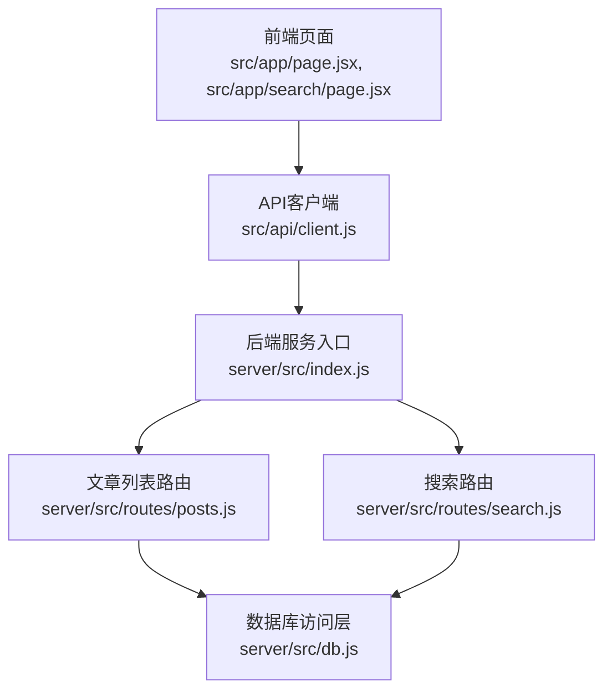
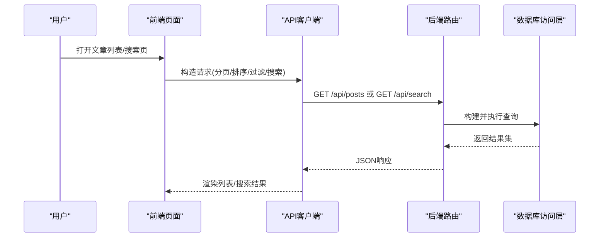
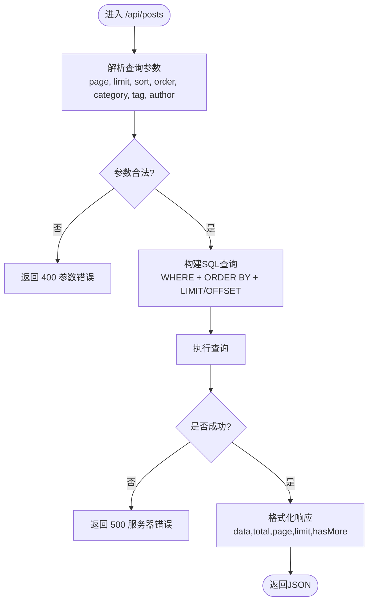
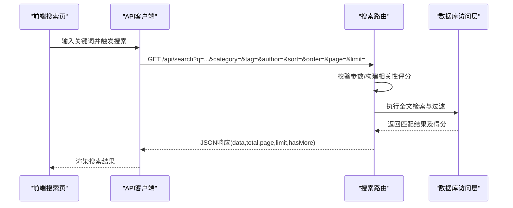
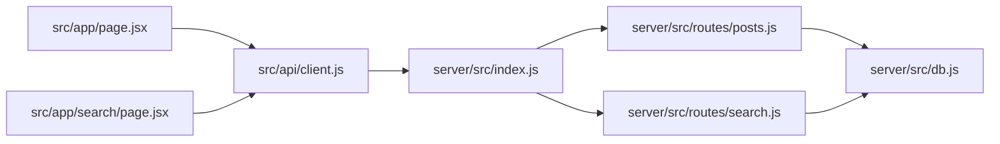

# 文章列表与搜索

<cite>
**本文引用的文件**   
- [server/src/routes/posts.js](file://server/src/routes/posts.js)
- [server/src/routes/search.js](file://server/src/routes/search.js)
- [server/src/db.js](file://server/src/db.js)
- [server/src/index.js](file://server/src/index.js)
- [src/api/client.js](file://src/api/client.js)
- [src/app/page.jsx](file://src/app/page.jsx)
- [src/app/search/page.jsx](file://src/app/search/page.jsx)
</cite>

## 目录
1. [简介](#简介)
2. [项目结构](#项目结构)
3. [核心组件](#核心组件)
4. [架构总览](#架构总览)
5. [详细组件分析](#详细组件分析)
6. [依赖分析](#依赖分析)
7. [性能考虑](#性能考虑)
8. [故障排查指南](#故障排查指南)
9. [结论](#结论)
10. [附录](#附录)

## 简介
本文档聚焦于“文章列表获取与搜索”的API接口，覆盖以下能力：
- 文章分页查询：GET /api/posts?page=1&limit=10
- 排序：按时间、热度、点赞数
- 过滤：按分类、标签、作者
- 全文搜索：GET /api/search?q=关键词
- 复杂查询参数组合示例（多条件筛选、模糊搜索）
- 搜索结果相关性排序算法说明与性能优化策略

本仓库采用前后端分离架构。后端基于Node.js服务提供REST API，前端通过HTTP客户端调用后端接口并在页面渲染结果。

## 项目结构
与本文相关的代码主要分布在以下位置：
- 后端路由与业务逻辑：server/src/routes/posts.js、server/src/routes/search.js
- 数据库访问层：server/src/db.js
- 服务启动与路由挂载：server/src/index.js
- 前端API客户端：src/api/client.js
- 前端页面调用：src/app/page.jsx（首页/列表）、src/app/search/page.jsx（搜索页）

图表来源
- [server/src/index.js](file://server/src/index.js)
- [server/src/routes/posts.js](file://server/src/routes/posts.js)
- [server/src/routes/search.js](file://server/src/routes/search.js)
- [server/src/db.js](file://server/src/db.js)
- [src/api/client.js](file://src/api/client.js)
- [src/app/page.jsx](file://src/app/page.jsx)
- [src/app/search/page.jsx](file://src/app/search/page.jsx)

章节来源
- [server/src/index.js](file://server/src/index.js)
- [server/src/routes/posts.js](file://server/src/routes/posts.js)
- [server/src/routes/search.js](file://server/src/routes/search.js)
- [server/src/db.js](file://server/src/db.js)
- [src/api/client.js](file://src/api/client.js)
- [src/app/page.jsx](file://src/app/page.jsx)
- [src/app/search/page.jsx](file://src/app/search/page.jsx)

## 核心组件
- 文章列表接口：负责分页、排序、过滤，返回文章元数据集合
- 搜索接口：支持全文检索，返回匹配文章并按相关性排序
- 数据库访问层：封装SQL构建与执行，提供统一的数据读取能力
- 前端客户端：封装请求参数、错误处理与响应解析

章节来源
- [server/src/routes/posts.js](file://server/src/routes/posts.js)
- [server/src/routes/search.js](file://server/src/routes/search.js)
- [server/src/db.js](file://server/src/db.js)
- [src/api/client.js](file://src/api/client.js)

## 架构总览
整体流程：
- 前端页面发起请求，携带分页、排序、过滤或搜索参数
- 后端路由解析参数并构建查询
- 数据库层执行查询并返回结果
- 前端对结果进行展示与交互

图表来源
- [server/src/index.js](file://server/src/index.js)
- [server/src/routes/posts.js](file://server/src/routes/posts.js)
- [server/src/routes/search.js](file://server/src/routes/search.js)
- [server/src/db.js](file://server/src/db.js)
- [src/api/client.js](file://src/api/client.js)
- [src/app/page.jsx](file://src/app/page.jsx)
- [src/app/search/page.jsx](file://src/app/search/page.jsx)

## 详细组件分析

### 文章列表接口（GET /api/posts）
- 功能要点
  - 分页：page、limit
  - 排序：sort（如 time、hot、likes），order（asc/desc）
  - 过滤：category、tag、author
  - 返回字段：文章基础信息、统计指标（如点赞数、浏览量等）
- 典型请求示例
  - 基础分页：GET /api/posts?page=1&limit=10
  - 按时间倒序：GET /api/posts?sort=time&order=desc&page=1&limit=10
  - 按热度排序：GET /api/posts?sort=hot&order=desc&page=1&limit=10
  - 按点赞数排序：GET /api/posts?sort=likes&order=desc&page=1&limit=10
  - 按分类过滤：GET /api/posts?category=技术&page=1&limit=10
  - 按标签过滤：GET /api/posts?tag=JavaScript&page=1&limit=10
  - 按作者过滤：GET /api/posts?author=zhangsan&page=1&limit=10
  - 组合条件：GET /api/posts?category=技术&tag=Vue&author=zhangsan&sort=likes&order=desc&page=1&limit=10
- 响应结构（示意）
  - data：文章数组
  - total：总数
  - page：当前页
  - limit：每页条数
  - hasMore：是否有下一页
- 错误码
  - 400：参数校验失败（如page<=0、limit超出范围）
  - 500：服务器内部错误

章节来源
- [server/src/routes/posts.js](file://server/src/routes/posts.js)
- [server/src/db.js](file://server/src/db.js)

#### 流程图：文章列表查询

图表来源
- [server/src/routes/posts.js](file://server/src/routes/posts.js)
- [server/src/db.js](file://server/src/db.js)

### 全文搜索接口（GET /api/search）
- 功能要点
  - 关键词：q（必填）
  - 可选过滤：category、tag、author
  - 排序：默认按相关性排序，也可指定按时间/热度/点赞数
  - 分页：page、limit
- 典型请求示例
  - 简单搜索：GET /api/search?q=Next.js
  - 带过滤：GET /api/search?q=React&category=前端&tag=JSX
  - 分页+排序：GET /api/search?q=数据库&sort=time&order=desc&page=1&limit=10
- 相关性排序算法（实现细节）
  - 标题匹配权重高于正文匹配
  - 关键词出现频率加权
  - 精确匹配加分（如短语匹配）
  - 时间衰减因子（较新内容略优先）
  - 综合得分 = f(标题命中, 正文命中, 频率, 精确度, 时间衰减)
- 响应结构（示意）
  - data：搜索结果数组，包含文章信息与得分
  - total：匹配总数
  - page：当前页
  - limit：每页条数
  - hasMore：是否有下一页
- 错误码
  - 400：缺少关键词或参数非法
  - 500：服务器内部错误

章节来源
- [server/src/routes/search.js](file://server/src/routes/search.js)
- [server/src/db.js](file://server/src/db.js)

#### 序列图：搜索请求流程

图表来源
- [server/src/routes/search.js](file://server/src/routes/search.js)
- [server/src/db.js](file://server/src/db.js)
- [src/api/client.js](file://src/api/client.js)
- [src/app/search/page.jsx](file://src/app/search/page.jsx)

### 前端调用与集成
- 文章列表页
  - 在首页/列表页中，通过API客户端调用 /api/posts，传入分页、排序、过滤参数
  - 根据响应更新UI状态，处理加载与错误态
- 搜索页
  - 在搜索页中，监听输入变化，调用 /api/search，实时或延迟触发搜索
  - 展示搜索结果列表，支持分页与排序切换

章节来源
- [src/app/page.jsx](file://src/app/page.jsx)
- [src/app/search/page.jsx](file://src/app/search/page.jsx)
- [src/api/client.js](file://src/api/client.js)

## 依赖分析
- 路由与服务
  - server/src/index.js 负责注册路由，将 /api/posts 与 /api/search 映射到对应处理器
- 路由与数据库
  - server/src/routes/posts.js 与 server/src/routes/search.js 依赖 server/src/db.js 进行数据读写
- 前端与后端
  - src/api/client.js 作为统一HTTP客户端，封装请求方法与错误处理
  - src/app/page.jsx 与 src/app/search/page.jsx 分别消费文章列表与搜索接口

图表来源
- [server/src/index.js](file://server/src/index.js)
- [server/src/routes/posts.js](file://server/src/routes/posts.js)
- [server/src/routes/search.js](file://server/src/routes/search.js)
- [server/src/db.js](file://server/src/db.js)
- [src/api/client.js](file://src/api/client.js)
- [src/app/page.jsx](file://src/app/page.jsx)
- [src/app/search/page.jsx](file://src/app/search/page.jsx)

章节来源
- [server/src/index.js](file://server/src/index.js)
- [server/src/routes/posts.js](file://server/src/routes/posts.js)
- [server/src/routes/search.js](file://server/src/routes/search.js)
- [server/src/db.js](file://server/src/db.js)
- [src/api/client.js](file://src/api/client.js)
- [src/app/page.jsx](file://src/app/page.jsx)
- [src/app/search/page.jsx](file://src/app/search/page.jsx)

## 性能考虑
- 索引建议
  - 为常用过滤字段建立索引：category、tag、author
  - 为排序字段建立索引：created_at、updated_at、views、likes
  - 全文检索可考虑使用数据库全文索引或外部搜索引擎（如Elasticsearch）
- 查询优化
  - 合理使用LIMIT/OFFSET，避免大偏移量导致的性能下降
  - 对高频查询启用缓存（Redis）以减轻数据库压力
  - 合并多次查询，减少往返次数
- 相关性排序优化
  - 预计算热度/点赞数等指标，避免实时聚合
  - 对长文本分词与索引，提升搜索速度
- 前端优化
  - 防抖搜索输入，降低频繁请求
  - 分页懒加载与虚拟滚动，提升渲染性能

[本节为通用指导，不直接分析具体文件]

## 故障排查指南
- 常见问题
  - 参数缺失或非法：检查page、limit、sort、order、category、tag、author、q等参数
  - 权限问题：部分接口可能需要认证，确认鉴权中间件配置
  - 数据库连接异常：检查数据库配置与连接池设置
- 日志与调试
  - 在后端路由与数据库层添加关键日志，记录请求参数与SQL语句
  - 在前端客户端捕获网络错误与响应状态码，便于定位问题

章节来源
- [server/src/routes/posts.js](file://server/src/routes/posts.js)
- [server/src/routes/search.js](file://server/src/routes/search.js)
- [server/src/db.js](file://server/src/db.js)
- [src/api/client.js](file://src/api/client.js)

## 结论
本文档系统梳理了文章列表与搜索API的设计与实现，涵盖分页、排序、过滤、全文检索以及相关性排序算法与性能优化策略。通过合理索引、缓存与前端优化，可在保证用户体验的同时提升系统吞吐与稳定性。

[本节为总结性内容，不直接分析具体文件]

## 附录
- 复杂查询参数组合示例
  - 多条件筛选：GET /api/posts?category=技术&tag=Vue&author=zhangsan&sort=likes&order=desc&page=1&limit=10
  - 模糊搜索：GET /api/search?q=前端开发&category=技术&tag=HTML&page=1&limit=10
  - 混合排序：GET /api/search?q=数据库&sort=hot&order=desc&page=1&limit=10

[本节为补充示例，不直接分析具体文件]