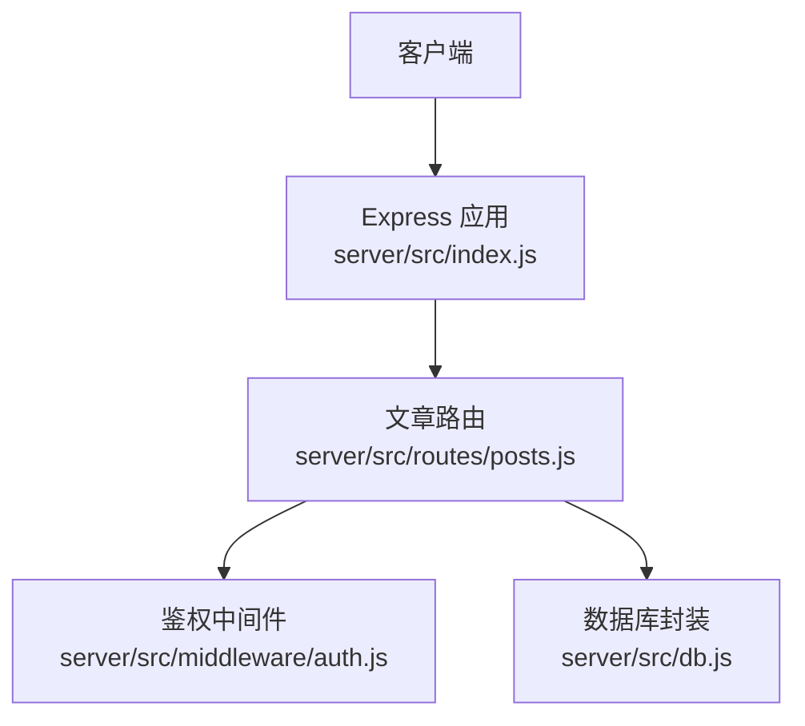
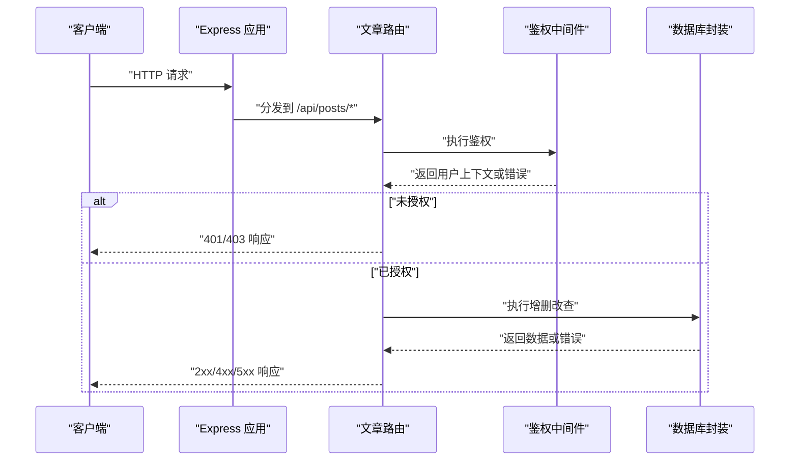
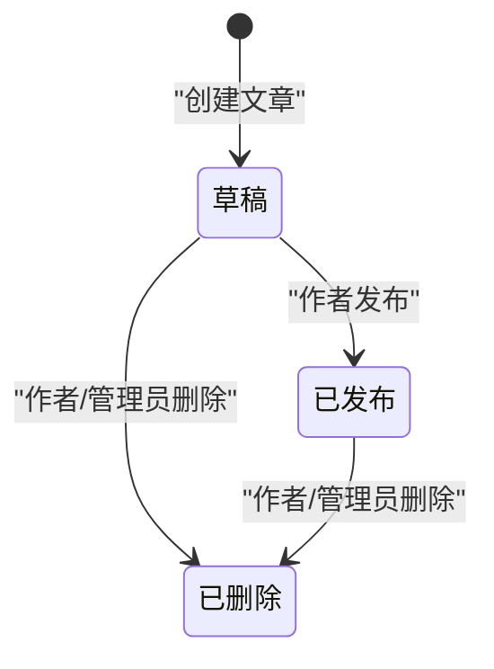
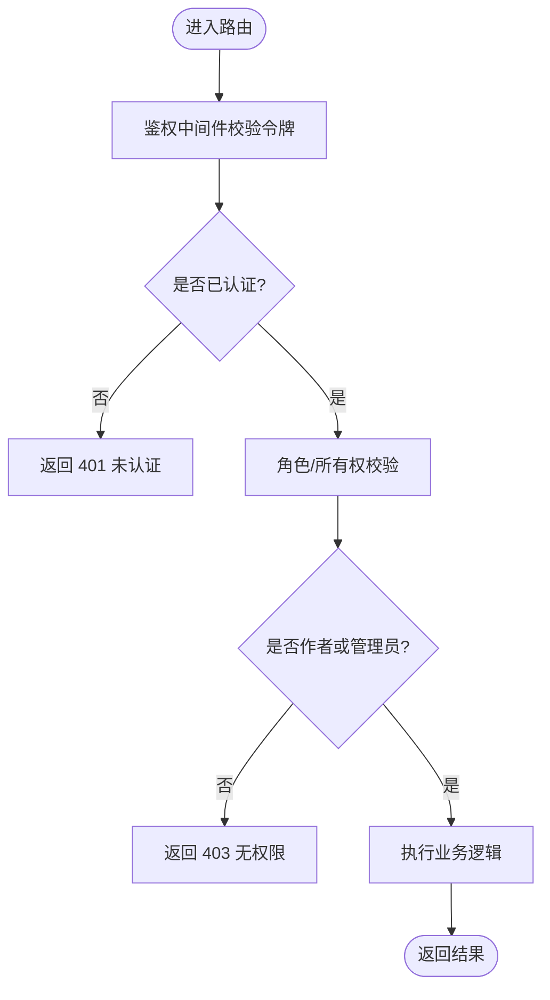
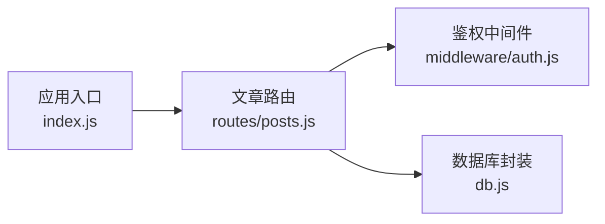

# 文章基础CRUD操作

<cite>
**本文引用的文件**   
- [server/src/routes/posts.js](file://server/src/routes/posts.js)
- [server/src/middleware/auth.js](file://server/src/middleware/auth.js)
- [server/src/db.js](file://server/src/db.js)
- [server/src/index.js](file://server/src/index.js)
- [docs/05api接口文档.md](file://docs/05api接口文档.md)
</cite>

## 目录
1. [简介](#简介)
2. [项目结构](#项目结构)
3. [核心组件](#核心组件)
4. [架构总览](#架构总览)
5. [详细组件分析](#详细组件分析)
6. [依赖分析](#依赖分析)
7. [性能考虑](#性能考虑)
8. [故障排查指南](#故障排查指南)
9. [结论](#结论)
10. [附录](#附录)

## 简介
本文档面向后端开发者与前端集成人员，详细说明“文章”模块的基础CRUD接口：创建、读取、更新、删除。内容涵盖请求参数格式、响应数据结构、错误码说明、完整示例（成功与失败）、文章状态管理（草稿、已发布、已删除）以及权限控制机制。

## 项目结构
本项目的后端位于 server 目录，采用 Express 风格的路由组织方式。文章相关路由定义在 routes/posts.js，鉴权中间件在 middleware/auth.js，数据库连接与查询封装在 db.js，应用入口在 index.js。

图表来源
- [server/src/index.js](file://server/src/index.js)
- [server/src/routes/posts.js](file://server/src/routes/posts.js)
- [server/src/middleware/auth.js](file://server/src/middleware/auth.js)
- [server/src/db.js](file://server/src/db.js)

章节来源
- [server/src/index.js](file://server/src/index.js)
- [server/src/routes/posts.js](file://server/src/routes/posts.js)
- [server/src/middleware/auth.js](file://server/src/middleware/auth.js)
- [server/src/db.js](file://server/src/db.js)

## 核心组件
- 文章路由层：提供 /api/posts 的 CRUD 端点，负责参数校验、权限检查、调用数据层并返回统一响应。
- 鉴权中间件：解析认证信息（如JWT），注入当前用户上下文，用于权限判定。
- 数据访问层：封装 SQLite 连接与常用SQL操作，提供事务与错误处理。

章节来源
- [server/src/routes/posts.js](file://server/src/routes/posts.js)
- [server/src/middleware/auth.js](file://server/src/middleware/auth.js)
- [server/src/db.js](file://server/src/db.js)

## 架构总览
下图展示了从客户端到数据库的端到端调用链，包括鉴权与错误处理路径。

图表来源
- [server/src/index.js](file://server/src/index.js)
- [server/src/routes/posts.js](file://server/src/routes/posts.js)
- [server/src/middleware/auth.js](file://server/src/middleware/auth.js)
- [server/src/db.js](file://server/src/db.js)

## 详细组件分析

### 通用约定
- 基础路径：/api/posts
- 认证方式：请求头携带令牌（例如 Authorization: Bearer <token>），由鉴权中间件解析并注入当前用户。
- 统一响应体：
  - 成功：{ code, message, data }
  - 失败：{ code, message }
- 常见状态码：
  - 200：成功
  - 201：创建成功
  - 400：请求参数错误
  - 401：未认证
  - 403：无权限
  - 404：资源不存在
  - 500：服务器内部错误

章节来源
- [server/src/routes/posts.js](file://server/src/routes/posts.js)
- [server/src/middleware/auth.js](file://server/src/middleware/auth.js)

### 创建文章 POST /api/posts
- 功能：根据请求体创建一篇新文章，默认状态为“草稿”。
- 认证：需要登录态。
- 请求体字段（JSON）：
  - title：字符串，必填
  - content：字符串，必填
  - category_id：数字，可选
  - column_id：数字，可选
  - tags：字符串数组，可选
  - status：枚举，可选；默认“draft”；允许值：draft、published
- 成功响应（201）：
  - data：包含文章主键 id、title、content、status、author_id、created_at、updated_at 等字段
- 失败场景：
  - 400：缺少必填字段或字段类型不合法
  - 401：未登录
  - 403：非作者本人不可写（若存在作者绑定校验）
  - 500：数据库异常

请求示例
- 请求
  - 方法：POST
  - 路径：/api/posts
  - 头部：Authorization: Bearer <token>
  - 主体：
    {
      "title": "示例标题",
      "content": "正文内容",
      "category_id": 1,
      "tags": ["技术","教程"],
      "status": "draft"
    }
- 响应（201）
  {
    "code": 201,
    "message": "创建成功",
    "data": {
      "id": 1,
      "title": "示例标题",
      "content": "正文内容",
      "status": "draft",
      "author_id": 1001,
      "created_at": "2025-01-01T00:00:00Z",
      "updated_at": "2025-01-01T00:00:00Z"
    }
  }
- 响应（400）
  {
    "code": 400,
    "message": "缺少必填字段"
  }
- 响应（401）
  {
    "code": 401,
    "message": "未认证"
  }

章节来源
- [server/src/routes/posts.js](file://server/src/routes/posts.js)

### 获取文章 GET /api/posts/:id
- 功能：根据文章ID获取文章详情。
- 认证：公开可访问（无需登录）。
- 路径参数：
  - id：数字，必填
- 成功响应（200）：
  - data：文章详情对象，包含 id、title、content、status、author_id、category_id、column_id、tags、created_at、updated_at 等
- 失败场景：
  - 404：文章不存在
  - 500：数据库异常

请求示例
- 请求
  - 方法：GET
  - 路径：/api/posts/1
- 响应（200）
  {
    "code": 200,
    "message": "获取成功",
    "data": {
      "id": 1,
      "title": "示例标题",
      "content": "正文内容",
      "status": "published",
      "author_id": 1001,
      "category_id": 1,
      "column_id": null,
      "tags": ["技术","教程"],
      "created_at": "2025-01-01T00:00:00Z",
      "updated_at": "2025-01-01T00:00:00Z"
    }
  }
- 响应（404）
  {
    "code": 404,
    "message": "文章不存在"
  }

章节来源
- [server/src/routes/posts.js](file://server/src/routes/posts.js)

### 更新文章 PUT /api/posts/:id
- 功能：更新指定文章的元信息与内容。仅作者或管理员可修改。
- 认证：需要登录态，且具备相应权限。
- 路径参数：
  - id：数字，必填
- 请求体字段（JSON，均为可选）：
  - title：字符串
  - content：字符串
  - category_id：数字
  - column_id：数字
  - tags：字符串数组
  - status：枚举；允许值：draft、published
- 成功响应（200）：
  - data：更新后的文章对象
- 失败场景：
  - 400：字段类型不合法
  - 401：未认证
  - 403：非作者本人或无管理员权限
  - 404：文章不存在
  - 500：数据库异常

请求示例
- 请求
  - 方法：PUT
  - 路径：/api/posts/1
  - 头部：Authorization: Bearer <token>
  - 主体：
    {
      "title": "更新后的标题",
      "status": "published"
    }
- 响应（200）
  {
    "code": 200,
    "message": "更新成功",
    "data": {
      "id": 1,
      "title": "更新后的标题",
      "content": "正文内容",
      "status": "published",
      "author_id": 1001,
      "updated_at": "2025-01-01T00:00:00Z"
    }
  }
- 响应（403）
  {
    "code": 403,
    "message": "无权限"
  }

章节来源
- [server/src/routes/posts.js](file://server/src/routes/posts.js)
- [server/src/middleware/auth.js](file://server/src/middleware/auth.js)

### 删除文章 DELETE /api/posts/:id
- 功能：删除指定文章。仅作者或管理员可删除。
- 认证：需要登录态，且具备相应权限。
- 路径参数：
  - id：数字，必填
- 成功响应（200）：
  - data：被删除的文章主键 id
- 失败场景：
  - 401：未认证
  - 403：非作者本人或无管理员权限
  - 404：文章不存在
  - 500：数据库异常

请求示例
- 请求
  - 方法：DELETE
  - 路径：/api/posts/1
  - 头部：Authorization: Bearer <token>
- 响应（200）
  {
    "code": 200,
    "message": "删除成功",
    "data": {
      "id": 1
    }
  }
- 响应（404）
  {
    "code": 404,
    "message": "文章不存在"
  }

章节来源
- [server/src/routes/posts.js](file://server/src/routes/posts.js)
- [server/src/middleware/auth.js](file://server/src/middleware/auth.js)

### 文章状态管理与权限控制

#### 状态模型
- 状态枚举：
  - draft：草稿
  - published：已发布
  - deleted：已删除（逻辑删除）
- 状态流转建议：
  - 新建文章默认为 draft
  - 作者可将 draft 改为 published
  - 作者或管理员可将任意状态标记为 deleted（逻辑删除）

图表来源
- [server/src/routes/posts.js](file://server/src/routes/posts.js)

#### 权限控制
- 鉴权流程：
  - 请求进入路由前，先经过鉴权中间件
  - 中间件解析令牌并注入当前用户上下文
  - 路由根据上下文判断是否为作者或管理员
- 规则摘要：
  - 创建：需登录
  - 读取：公开
  - 更新：需登录且为作者或管理员
  - 删除：需登录且为作者或管理员

图表来源
- [server/src/middleware/auth.js](file://server/src/middleware/auth.js)
- [server/src/routes/posts.js](file://server/src/routes/posts.js)

章节来源
- [server/src/middleware/auth.js](file://server/src/middleware/auth.js)
- [server/src/routes/posts.js](file://server/src/routes/posts.js)

## 依赖分析
- 路由层依赖鉴权中间件进行身份与权限校验。
- 路由层依赖数据库封装进行持久化操作。
- 应用入口将路由挂载至 Express 实例，形成完整的请求链路。

图表来源
- [server/src/index.js](file://server/src/index.js)
- [server/src/routes/posts.js](file://server/src/routes/posts.js)
- [server/src/middleware/auth.js](file://server/src/middleware/auth.js)
- [server/src/db.js](file://server/src/db.js)

章节来源
- [server/src/index.js](file://server/src/index.js)
- [server/src/routes/posts.js](file://server/src/routes/posts.js)
- [server/src/middleware/auth.js](file://server/src/middleware/auth.js)
- [server/src/db.js](file://server/src/db.js)

## 性能考虑
- 索引优化：对 articles.id、articles.author_id、articles.status 建立合适索引以提升查询与过滤性能。
- 分页与限流：列表接口应支持分页与排序；对外暴露的写入接口建议增加速率限制。
- 缓存策略：对高频读取的已发布文章可采用缓存层（如内存缓存或CDN）降低数据库压力。
- 批量操作：避免在单请求中执行过多子查询，必要时使用事务保证一致性。

[本节为通用指导，不涉及具体文件分析]

## 故障排查指南
- 401 未认证：检查请求头是否携带正确的 Authorization 令牌，确认令牌未过期。
- 403 无权限：确认当前用户是否为文章作者或管理员；检查中间件是否正确注入用户上下文。
- 404 资源不存在：确认路径参数 id 是否存在；检查是否已被逻辑删除。
- 400 参数错误：核对请求体字段类型与必填项；确保 JSON 格式正确。
- 500 服务器错误：查看服务端日志，定位数据库连接或SQL执行异常。

章节来源
- [server/src/routes/posts.js](file://server/src/routes/posts.js)
- [server/src/middleware/auth.js](file://server/src/middleware/auth.js)

## 结论
本文档给出了文章模块的完整CRUD接口规范，包括参数、响应、错误码、示例与权限控制。通过统一的鉴权与状态管理，系统可在保障安全性的同时提供稳定高效的读写能力。

[本节为总结性内容，不涉及具体文件分析]

## 附录
- 参考文档：项目内已有API文档可作为补充参考。
  - [docs/05api接口文档.md](file://docs/05api接口文档.md)

章节来源
- [docs/05api接口文档.md](file://docs/05api接口文档.md)