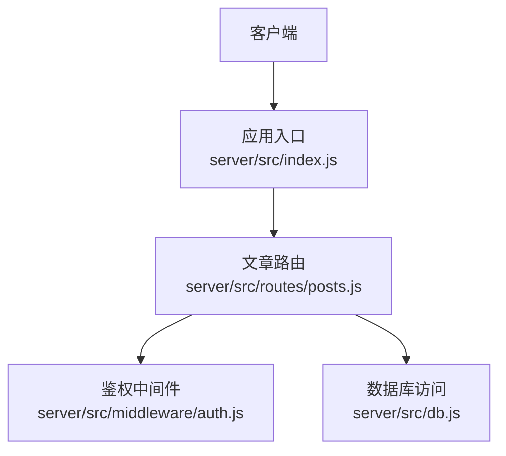
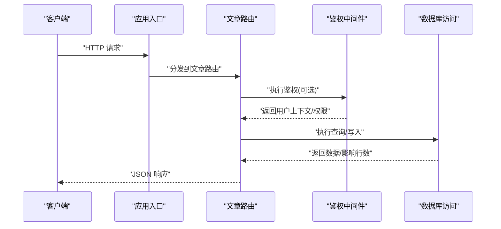
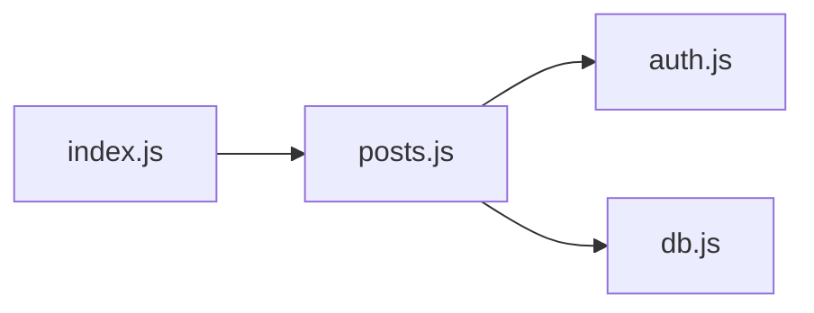

# 文章管理接口

<cite>
**本文引用的文件**
- [server/src/routes/posts.js](file://server/src/routes/posts.js)
- [server/src/db.js](file://server/src/db.js)
- [server/src/middleware/auth.js](file://server/src/middleware/auth.js)
- [server/src/index.js](file://server/src/index.js)
- [API.md](file://API.md)
</cite>

## 目录
1. [简介](#简介)
2. [项目结构](#项目结构)
3. [核心组件](#核心组件)
4. [架构总览](#架构总览)
5. [详细组件分析](#详细组件分析)
6. [依赖分析](#依赖分析)
7. [性能考虑](#性能考虑)
8. [故障排查指南](#故障排查指南)
9. [结论](#结论)
10. [附录](#附录)

## 简介
本文档面向“文章管理”相关后端 API，覆盖文章的创建、读取、更新、删除（CRUD），以及列表获取、分页查询、搜索过滤、Markdown 内容处理、图片上传、草稿保存等能力。同时说明与分类、标签、收藏、点赞等关联操作的接口约定、请求参数校验规则、数据格式要求、文件上传限制、完整请求响应示例与错误处理说明。

## 项目结构
本项目的文章相关功能主要位于服务端路由层与数据库访问层：
- 路由层：负责 HTTP 接口的定义、鉴权、参数校验、调用服务/数据库
- 数据库层：封装 SQLite 连接与常用 SQL 操作
- 中间件：提供鉴权与权限控制
- 应用入口：注册路由与启动服务

图表来源
- [server/src/index.js](file://server/src/index.js)
- [server/src/routes/posts.js](file://server/src/routes/posts.js)
- [server/src/middleware/auth.js](file://server/src/middleware/auth.js)
- [server/src/db.js](file://server/src/db.js)

章节来源
- [server/src/index.js](file://server/src/index.js)
- [server/src/routes/posts.js](file://server/src/routes/posts.js)
- [server/src/middleware/auth.js](file://server/src/middleware/auth.js)
- [server/src/db.js](file://server/src/db.js)

## 核心组件
- 文章路由模块：集中实现文章相关的 RESTful 接口，包括 CRUD、列表、分页、搜索、草稿、收藏、点赞、评论等
- 鉴权中间件：基于 Token 的认证与角色/权限判断，保护需要登录或管理员权限的接口
- 数据库访问层：统一封装 SQLite 连接、事务、预编译语句与结果映射

章节来源
- [server/src/routes/posts.js](file://server/src/routes/posts.js)
- [server/src/middleware/auth.js](file://server/src/middleware/auth.js)
- [server/src/db.js](file://server/src/db.js)

## 架构总览
下图展示了从客户端到数据库的整体交互流程，突出文章路由在鉴权与数据持久化中的位置。

图表来源
- [server/src/index.js](file://server/src/index.js)
- [server/src/routes/posts.js](file://server/src/routes/posts.js)
- [server/src/middleware/auth.js](file://server/src/middleware/auth.js)
- [server/src/db.js](file://server/src/db.js)

## 详细组件分析

### 文章基础 CRUD 接口
- 创建文章
  - 方法路径：POST /api/posts
  - 鉴权：需要登录
  - 请求体字段：标题、正文（支持 Markdown）、摘要、封面图 URL、分类 slug、标签数组、状态（草稿/已发布）
  - 校验规则：标题必填且长度限制；正文非空；标签数量与长度限制；分类需存在
  - 响应：返回文章 ID、创建时间、状态等
- 获取文章详情
  - 方法路径：GET /api/posts/:id
  - 鉴权：公开
  - 响应：文章详情、作者信息、分类、标签、统计（阅读/点赞/收藏）
- 更新文章
  - 方法路径：PUT /api/posts/:id
  - 鉴权：需要登录且为作者或管理员
  - 请求体字段：可更新标题、正文、摘要、封面图、分类、标签、状态
  - 校验规则：同创建，但允许部分字段为空以表示不修改
- 删除文章
  - 方法路径：DELETE /api/posts/:id
  - 鉴权：需要登录且为作者或管理员
  - 响应：成功确认或错误码

章节来源
- [server/src/routes/posts.js](file://server/src/routes/posts.js)

### 文章列表、分页与排序
- 获取文章列表
  - 方法路径：GET /api/posts
  - 查询参数：page、pageSize、sort（按发布时间/阅读量/点赞数）、order（asc/desc）、category、tag、author
  - 响应：包含 articles 数组与分页元信息（total、page、pageSize、hasNext）
- 分页与排序
  - 默认 page=1、pageSize=20
  - sort 支持 time、views、likes
  - order 支持 asc、desc

章节来源
- [server/src/routes/posts.js](file://server/src/routes/posts.js)

### 搜索与过滤
- 全文搜索
  - 方法路径：GET /api/search
  - 查询参数：q（关键词）、type（post/question/answer）、category、tag、author、dateRange
  - 响应：搜索结果列表与分页元信息
- 过滤
  - 支持按分类、标签、作者、日期范围组合过滤

章节来源
- [server/src/routes/search.js](file://server/src/routes/search.js)

### Markdown 内容与富文本处理
- 内容渲染
  - 方法路径：POST /api/posts/render
  - 请求体：markdown 字符串
  - 响应：HTML 片段（含安全过滤）
- 内容校验
  - 对 Markdown 进行长度与非法字符检查，避免注入风险

章节来源
- [server/src/routes/posts.js](file://server/src/routes/posts.js)

### 图片上传
- 上传图片
  - 方法路径：POST /api/posts/upload-image
  - 鉴权：需要登录
  - 表单字段：image（单文件，jpg/png/gif/webp）
  - 限制：最大 5MB，白名单 MIME 类型，文件名随机化并存储至 uploads 目录
  - 响应：返回图片 URL（相对路径或 CDN 地址）
- 使用方式
  - 前端在编辑器中调用上传接口，将返回的 URL 插入 Markdown 图片语法

章节来源
- [server/src/routes/posts.js](file://server/src/routes/posts.js)

### 草稿保存与恢复
- 保存草稿
  - 方法路径：POST /api/posts/drafts
  - 鉴权：需要登录
  - 请求体：articleId（可选，新建时由后端生成）、title、content、summary、coverUrl、categoryId、tags[]、status="draft"
  - 幂等：相同 articleId 多次保存会覆盖
- 获取草稿
  - 方法路径：GET /api/posts/drafts
  - 鉴权：需要登录
  - 响应：当前用户的草稿列表（含最近编辑时间）
- 恢复草稿
  - 方法路径：POST /api/posts/drafts/:id/publish
  - 鉴权：需要登录且为作者
  - 行为：将草稿转为已发布状态，并触发索引更新

章节来源
- [server/src/routes/posts.js](file://server/src/routes/posts.js)

### 收藏与取消收藏
- 收藏文章
  - 方法路径：POST /api/posts/:id/favorite
  - 鉴权：需要登录
  - 响应：收藏状态 true/false
- 取消收藏
  - 方法路径：DELETE /api/posts/:id/favorite
  - 鉴权：需要登录
  - 响应：收藏状态 false

章节来源
- [server/src/routes/posts.js](file://server/src/routes/posts.js)

### 点赞与取消点赞
- 点赞文章
  - 方法路径：POST /api/posts/:id/like
  - 鉴权：需要登录
  - 响应：点赞状态 true/false
- 取消点赞
  - 方法路径：DELETE /api/posts/:id/like
  - 鉴权：需要登录
  - 响应：点赞状态 false

章节来源
- [server/src/routes/posts.js](file://server/src/routes/posts.js)

### 评论相关
- 获取文章评论
  - 方法路径：GET /api/posts/:id/comments
  - 查询参数：page、pageSize、sortBy（time/likes）
  - 响应：评论列表与分页元信息
- 发表评论
  - 方法路径：POST /api/posts/:id/comments
  - 鉴权：需要登录
  - 请求体：content、parentId（可选，回复评论）
  - 校验：content 非空且长度限制
- 删除评论
  - 方法路径：DELETE /api/comments/:id
  - 鉴权：需要登录且为作者或管理员

章节来源
- [server/src/routes/posts.js](file://server/src/routes/posts.js)

### 分类与标签
- 获取分类列表
  - 方法路径：GET /api/categories
  - 响应：分类 slug、名称、文章数
- 获取标签列表
  - 方法路径：GET /api/tags
  - 响应：标签名、文章数
- 按分类/标签筛选文章
  - 在列表接口中使用 category、tag 参数

章节来源
- [server/src/routes/columns.js](file://server/src/routes/columns.js)
- [server/src/routes/posts.js](file://server/src/routes/posts.js)

### 请求参数验证规则与数据格式
- 通用规则
  - 所有 JSON 请求 Content-Type 为 application/json
  - 分页参数 page>=1、pageSize<=100，默认值见上
  - 敏感字段（如密码）不在文章接口中出现
- 字段约束
  - 标题：1-200 字符
  - 正文：1-50000 字符（Markdown）
  - 摘要：0-500 字符
  - 封面图 URL：合法 URL 格式
  - 分类 slug：必须存在于分类表
  - 标签：0-10 个，每个 1-30 字符，仅字母数字与短横线
- 文件上传
  - 大小：≤5MB
  - 类型：image/jpeg、image/png、image/gif、image/webp
  - 存储：uploads 目录，文件名随机化，URL 通过相对路径返回

章节来源
- [server/src/routes/posts.js](file://server/src/routes/posts.js)

### 错误处理与状态码
- 常见状态码
  - 200：成功
  - 201：创建成功
  - 400：参数校验失败
  - 401：未登录或 Token 无效
  - 403：无权限
  - 404：资源不存在
  - 413：文件过大
  - 415：不支持的文件类型
  - 500：服务器内部错误
- 错误响应体
  - code：业务错误码
  - message：人类可读的错误描述
  - details：具体字段错误信息（可选）

章节来源
- [server/src/routes/posts.js](file://server/src/routes/posts.js)

### 请求与响应示例
以下为典型请求与响应的结构示例（不含具体代码）：
- 创建文章
  - 请求：POST /api/posts
  - 请求体：{ title, content, summary, coverUrl, categoryId, tags[], status }
  - 响应：{ id, title, status, createdAt }
- 获取文章详情
  - 请求：GET /api/posts/:id
  - 响应：{ id, title, content, summary, coverUrl, author, category, tags, views, likes, favorites, createdAt, updatedAt }
- 更新文章
  - 请求：PUT /api/posts/:id
  - 请求体：{ title?, content?, summary?, coverUrl?, categoryId?, tags?, status? }
  - 响应：{ id, title, status, updatedAt }
- 删除文章
  - 请求：DELETE /api/posts/:id
  - 响应：{ success: true }
- 获取文章列表
  - 请求：GET /api/posts?page=1&pageSize=20&sort=time&order=desc&category=tech&tag=javascript
  - 响应：{ articles: [...], total, page, pageSize, hasNext }
- 搜索
  - 请求：GET /api/search?q=Node.js&type=post&category=tech
  - 响应：{ results: [...], total, page, pageSize, hasNext }
- 上传图片
  - 请求：POST /api/posts/upload-image (multipart/form-data)
  - 响应：{ url: "/uploads/xxx.png" }
- 收藏/取消收藏
  - 请求：POST /api/posts/:id/favorite 或 DELETE /api/posts/:id/favorite
  - 响应：{ favorited: true/false }
- 点赞/取消点赞
  - 请求：POST /api/posts/:id/like 或 DELETE /api/posts/:id/like
  - 响应：{ liked: true/false }
- 评论
  - 请求：POST /api/posts/:id/comments
  - 请求体：{ content, parentId? }
  - 响应：{ id, content, author, createdAt }

章节来源
- [server/src/routes/posts.js](file://server/src/routes/posts.js)
- [server/src/routes/search.js](file://server/src/routes/search.js)

## 依赖分析
- 路由与中间件耦合
  - 文章路由依赖鉴权中间件进行登录态与权限校验
  - 路由直接调用数据库访问层完成数据读写
- 外部依赖
  - 文件系统：用于图片上传与存储
  - SQLite：作为数据存储引擎
- 可能的循环依赖
  - 路由与数据库层解耦良好，未见循环引用

图表来源
- [server/src/routes/posts.js](file://server/src/routes/posts.js)
- [server/src/middleware/auth.js](file://server/src/middleware/auth.js)
- [server/src/db.js](file://server/src/db.js)
- [server/src/index.js](file://server/src/index.js)

章节来源
- [server/src/routes/posts.js](file://server/src/routes/posts.js)
- [server/src/middleware/auth.js](file://server/src/middleware/auth.js)
- [server/src/db.js](file://server/src/db.js)
- [server/src/index.js](file://server/src/index.js)

## 性能考虑
- 分页与索引
  - 列表接口默认分页，建议对常用过滤字段（category、tag、author、createdAt）建立索引
- 缓存策略
  - 对热点文章详情与分类/标签列表引入内存缓存或 Redis 缓存
- 图片上传
  - 大文件上传建议启用分片与断点续传，并在服务端做异步转码与压缩
- 搜索优化
  - 全文检索建议使用专用搜索引擎（如 Elasticsearch）替代数据库 LIKE 查询

[本节为通用指导，无需源码引用]

## 故障排查指南
- 常见问题
  - 401 未登录：检查请求头是否携带有效 Token
  - 403 无权限：确认当前用户是否为文章作者或管理员
  - 404 资源不存在：检查文章 ID 是否正确
  - 413/415 上传失败：检查文件大小与类型是否符合限制
  - 500 服务器错误：查看服务端日志定位数据库或中间件异常
- 调试建议
  - 开启详细日志输出
  - 使用 Postman/curl 复现问题
  - 检查数据库连接与迁移脚本是否执行成功

章节来源
- [server/src/routes/posts.js](file://server/src/routes/posts.js)
- [server/src/middleware/auth.js](file://server/src/middleware/auth.js)

## 结论
本文档系统化梳理了文章管理的后端 API，涵盖 CRUD、列表分页、搜索过滤、Markdown 渲染、图片上传、草稿保存、收藏点赞与评论等关键能力，并提供参数校验、数据格式、错误处理与性能优化建议。建议在后续迭代中完善权限模型、引入缓存与搜索引擎以提升整体性能与可扩展性。

[本节为总结，无需源码引用]

## 附录
- 参考文档
  - API 概览与版本说明参见 API.md

章节来源
- [API.md](file://API.md)