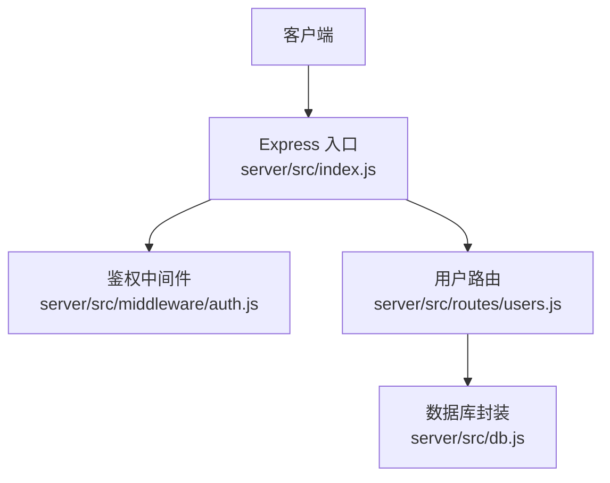
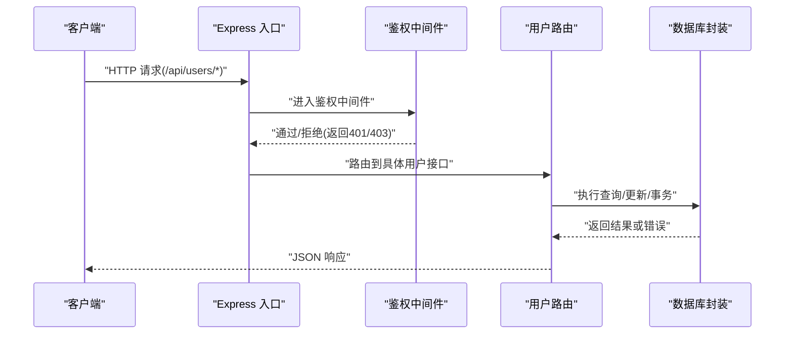
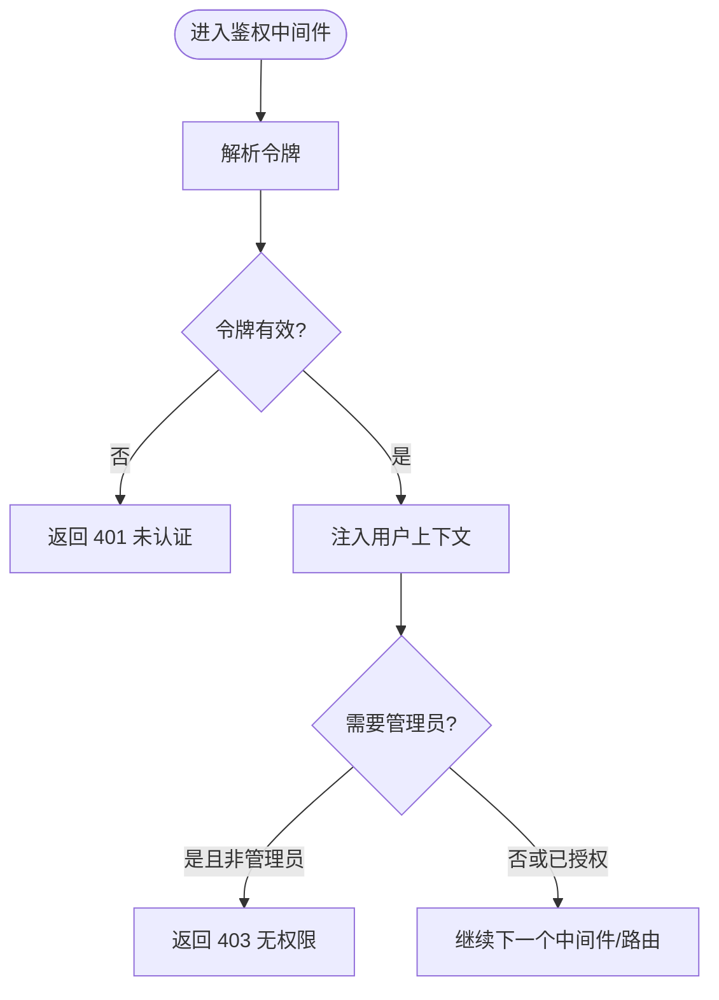
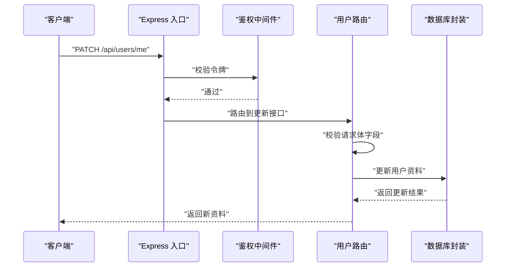
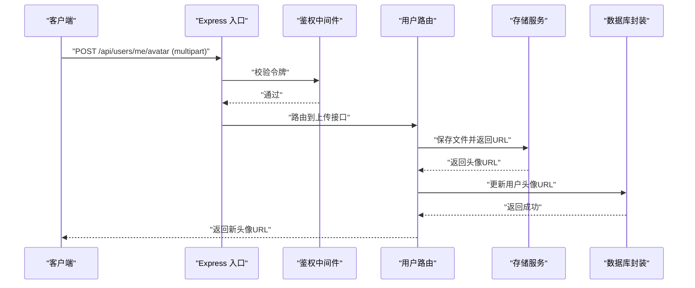
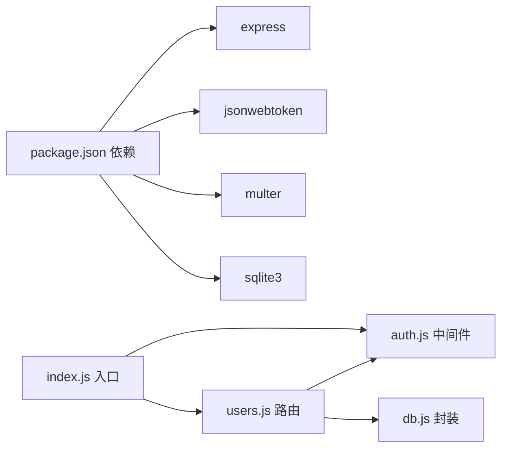

# 用户管理接口

<cite>
**本文引用的文件**   
- [server/src/routes/users.js](file://server/src/routes/users.js)
- [server/src/middleware/auth.js](file://server/src/middleware/auth.js)
- [server/src/db.js](file://server/src/db.js)
- [server/src/index.js](file://server/src/index.js)
- [server/package.json](file://server/package.json)
- [API.md](file://API.md)
- [docs/05api接口文档.md](file://docs/05api接口文档.md)
</cite>

## 目录
1. [简介](#简介)
2. [项目结构](#项目结构)
3. [核心组件](#核心组件)
4. [架构总览](#架构总览)
5. [详细组件分析](#详细组件分析)
6. [依赖分析](#依赖分析)
7. [性能考虑](#性能考虑)
8. [故障排查指南](#故障排查指南)
9. [结论](#结论)
10. [附录](#附录)

## 简介
本文件面向后端“用户管理”相关 API，覆盖以下范围：
- 基础用户操作：用户信息获取、个人资料更新、头像上传等
- 社交功能：关注与粉丝列表、用户统计
- 权限与安全：鉴权中间件、角色与管理员操作
- 数据模型与校验：字段定义、验证规则、隐私控制
- 状态管理与同步：账户状态、安全策略、数据一致性
- 调用示例与错误处理：请求/响应样例、常见错误码与排错建议

说明：
- 本文档以 server 端路由与中间件为依据进行整理。若前后端存在差异，以后端实现为准。
- 所有接口路径均以 /api 为前缀（由服务器入口挂载）。

## 项目结构
与用户管理相关的后端代码主要位于 server 目录：
- routes/users.js：用户相关路由（个人信息、关注/粉丝、统计等）
- middleware/auth.js：鉴权中间件（登录态校验、管理员权限校验）
- db.js：数据库连接与查询封装
- index.js：服务启动与路由挂载
- package.json：依赖与脚本

图示来源
- [server/src/index.js](file://server/src/index.js)
- [server/src/middleware/auth.js](file://server/src/middleware/auth.js)
- [server/src/routes/users.js](file://server/src/routes/users.js)
- [server/src/db.js](file://server/src/db.js)

章节来源
- [server/src/index.js](file://server/src/index.js)
- [server/src/middleware/auth.js](file://server/src/middleware/auth.js)
- [server/src/routes/users.js](file://server/src/routes/users.js)
- [server/src/db.js](file://server/src/db.js)

## 核心组件
- 鉴权中间件
  - 负责解析并校验登录态（如 JWT），将当前用户上下文注入到请求对象中，供后续路由使用。
  - 提供可选的“管理员”权限校验守卫，用于限制管理员专属接口。
- 用户路由
  - 提供用户信息查询、资料更新、头像上传、关注/粉丝列表、用户统计等接口。
  - 对敏感操作增加鉴权保护。
- 数据库封装
  - 统一数据库连接与查询方法，屏蔽底层 SQL 细节，便于事务与错误处理。

章节来源
- [server/src/middleware/auth.js](file://server/src/middleware/auth.js)
- [server/src/routes/users.js](file://server/src/routes/users.js)
- [server/src/db.js](file://server/src/db.js)

## 架构总览
下图展示了典型的用户管理请求链路：客户端发起请求 → Express 入口 → 鉴权中间件 → 用户路由 → 数据库封装。

图示来源
- [server/src/index.js](file://server/src/index.js)
- [server/src/middleware/auth.js](file://server/src/middleware/auth.js)
- [server/src/routes/users.js](file://server/src/routes/users.js)
- [server/src/db.js](file://server/src/db.js)

## 详细组件分析

### 鉴权中间件（认证与授权）
职责
- 解析请求头中的身份令牌（例如 Authorization: Bearer <token>）
- 校验令牌有效性，失败则返回未认证错误
- 将当前用户信息注入到 req.user
- 可选：校验管理员角色，失败则返回无权限错误

关键流程

图示来源
- [server/src/middleware/auth.js](file://server/src/middleware/auth.js)

章节来源
- [server/src/middleware/auth.js](file://server/src/middleware/auth.js)

### 用户路由（users.js）
能力概览
- 基础用户操作
  - 获取当前用户信息
  - 更新个人资料（昵称、签名、邮箱等）
  - 上传头像（multipart/form-data）
- 社交功能
  - 关注/取消关注某用户
  - 获取关注列表与粉丝列表（分页）
  - 获取用户统计（文章数、点赞数、收藏数等）
- 高级功能（需管理员）
  - 封禁/解封用户
  - 重置密码
  - 查看用户审计日志（如有）

通用约定
- 路径前缀：/api/users
- 鉴权：除公开接口外，其余均需登录；管理员接口需管理员角色
- 输入校验：服务端对必填字段、长度、格式等进行校验
- 输出：统一 JSON 结构，包含 code、message、data

#### 接口清单与示例
以下为常用接口的规范摘要（仅列出要点，不包含具体代码）：

- 获取当前用户信息
  - 方法：GET
  - 路径：/api/users/me
  - 鉴权：需要
  - 响应：用户基本信息（不含敏感字段）

- 更新个人资料
  - 方法：PATCH
  - 路径：/api/users/me
  - 鉴权：需要
  - 请求体：昵称、签名、邮箱等（按字段校验）
  - 响应：更新后的用户信息

- 上传头像
  - 方法：POST
  - 路径：/api/users/me/avatar
  - 鉴权：需要
  - 内容类型：multipart/form-data
  - 表单字段：avatar(file)
  - 响应：新头像 URL

- 关注/取消关注
  - 方法：POST/DELETE
  - 路径：/api/users/:id/follow
  - 鉴权：需要
  - 行为：关注目标用户或取消关注

- 获取关注列表
  - 方法：GET
  - 路径：/api/users/:id/following
  - 参数：page, size
  - 响应：被关注的用户列表（分页）

- 获取粉丝列表
  - 方法：GET
  - 路径：/api/users/:id/followers
  - 参数：page, size
  - 响应：关注者列表（分页）

- 用户统计
  - 方法：GET
  - 路径：/api/users/:id/stats
  - 响应：文章数、点赞数、收藏数、关注/粉丝数等

- 管理员：封禁/解封用户
  - 方法：PATCH
  - 路径：/api/admin/users/:id/status
  - 鉴权：需要管理员
  - 请求体：status=active|banned
  - 响应：更新后的用户状态

- 管理员：重置密码
  - 方法：POST
  - 路径：/api/admin/users/:id/reset-password
  - 鉴权：需要管理员
  - 响应：操作成功提示（不返回明文密码）

章节来源
- [server/src/routes/users.js](file://server/src/routes/users.js)

### 数据模型与校验
用户实体（核心字段）
- id：唯一标识
- username：用户名（唯一）
- nickname：昵称
- email：邮箱（唯一）
- avatar_url：头像地址
- bio：个人简介
- role：角色（user/admin）
- status：状态（active/banned）
- created_at/updated_at：时间戳

字段校验规则（示例）
- username：必填，长度 3-32，仅允许字母数字下划线
- nickname：可选，长度 1-64
- email：可选，符合邮箱格式
- bio：可选，最大长度 500
- avatar：上传时校验大小与类型（jpg/png/gif/webp），限制体积
- role：服务端控制，不允许前端修改
- status：服务端控制，不允许前端修改

隐私设置控制
- 公开可见：username、nickname、avatar_url、bio
- 受限可见：email（仅本人或管理员）
- 隐藏项：role、status、created_at/updated_at（默认不返回给普通用户）

章节来源
- [server/src/routes/users.js](file://server/src/routes/users.js)
- [server/src/db.js](file://server/src/db.js)

### 状态管理与账户安全
- 登录态
  - 基于令牌（JWT）的无状态会话，过期后需重新登录
- 密码安全
  - 存储哈希值，禁止明文落库
  - 重置密码由管理员触发，生成一次性链接或随机口令
- 账号状态
  - active：正常
  - banned：封禁（无法登录）
- 数据一致性
  - 关注/粉丝关系变更采用事务保证一致性
  - 统计计数采用增量更新，必要时异步补偿

章节来源
- [server/src/middleware/auth.js](file://server/src/middleware/auth.js)
- [server/src/routes/users.js](file://server/src/routes/users.js)
- [server/src/db.js](file://server/src/db.js)

### 典型调用序列

#### 更新个人资料

图示来源
- [server/src/index.js](file://server/src/index.js)
- [server/src/middleware/auth.js](file://server/src/middleware/auth.js)
- [server/src/routes/users.js](file://server/src/routes/users.js)
- [server/src/db.js](file://server/src/db.js)

#### 上传头像

图示来源
- [server/src/index.js](file://server/src/index.js)
- [server/src/middleware/auth.js](file://server/src/middleware/auth.js)
- [server/src/routes/users.js](file://server/src/routes/users.js)
- [server/src/db.js](file://server/src/db.js)

## 依赖分析
- 运行时依赖
  - express：Web 框架
  - jsonwebtoken：令牌签发与校验
  - multer：处理 multipart/form-data（头像上传）
  - sqlite3：轻量级数据库（根据实际配置）
- 内部依赖
  - 路由依赖鉴权中间件
  - 路由依赖数据库封装
  - 入口文件挂载路由与中间件

图示来源
- [server/package.json](file://server/package.json)
- [server/src/index.js](file://server/src/index.js)
- [server/src/middleware/auth.js](file://server/src/middleware/auth.js)
- [server/src/routes/users.js](file://server/src/routes/users.js)
- [server/src/db.js](file://server/src/db.js)

章节来源
- [server/package.json](file://server/package.json)
- [server/src/index.js](file://server/src/index.js)

## 性能考虑
- 分页与限流
  - 关注/粉丝列表必须支持分页，避免大表全量加载
  - 对高频接口（如用户统计）可引入缓存层（Redis）
- 索引优化
  - 为 username、email、follower/following 关联键建立索引
- 上传优化
  - 头像压缩与多分辨率裁剪
  - 使用对象存储（OSS/S3）并开启 CDN
- 事务与并发
  - 关注/粉丝关系变更使用事务，避免竞态条件
  - 统计计数采用原子更新或消息队列异步补偿

[本节为通用指导，无需源码引用]

## 故障排查指南
常见问题与定位步骤
- 401 未认证
  - 检查请求头是否携带正确的 Authorization: Bearer <token>
  - 确认 token 未过期且签名正确
- 403 无权限
  - 管理员接口需具备管理员角色
  - 检查中间件是否正确注入用户上下文
- 400 参数校验失败
  - 检查必填字段、长度与格式是否符合要求
- 404 资源不存在
  - 确认用户 ID 是否存在
- 500 服务器错误
  - 查看后端日志，定位数据库或外部服务异常
- 上传失败
  - 检查文件大小与类型限制
  - 确认存储服务可用与路径权限

章节来源
- [server/src/middleware/auth.js](file://server/src/middleware/auth.js)
- [server/src/routes/users.js](file://server/src/routes/users.js)

## 结论
本文档围绕用户管理 API 的基础操作、社交功能、权限与安全、数据模型与校验、状态管理与同步等方面进行了系统化梳理。建议在开发过程中严格遵循统一的鉴权与校验策略，完善错误码与日志记录，并结合缓存与索引优化提升整体性能。

[本节为总结性内容，无需源码引用]

## 附录

### 统一响应格式
- code：业务状态码（0 表示成功，非 0 表示失败）
- message：提示信息
- data：业务数据（对象或数组）

### 常见错误码
- 400：参数校验失败
- 401：未认证
- 403：无权限
- 404：资源不存在
- 409：冲突（如用户名/邮箱重复）
- 413：上传文件过大
- 415：不支持的文件类型
- 500：服务器内部错误

### 参考文档
- API 总览与示例：[API.md](file://API.md)
- 接口文档细化：[docs/05api接口文档.md](file://docs/05api接口文档.md)

章节来源
- [API.md](file://API.md)
- [docs/05api接口文档.md](file://docs/05api接口文档.md)