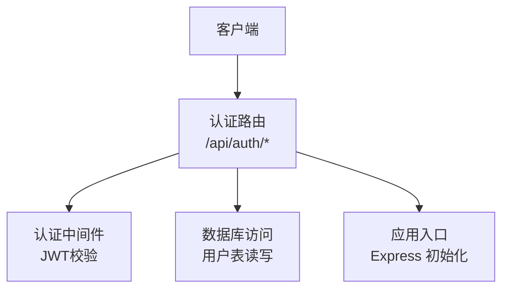
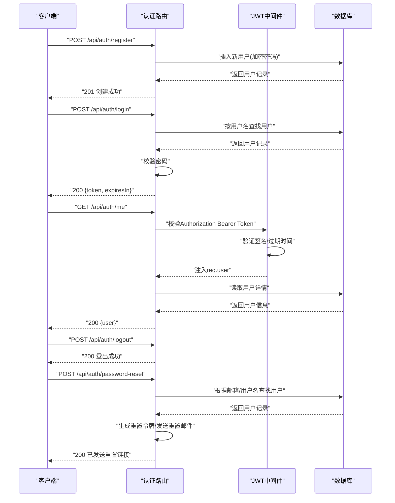
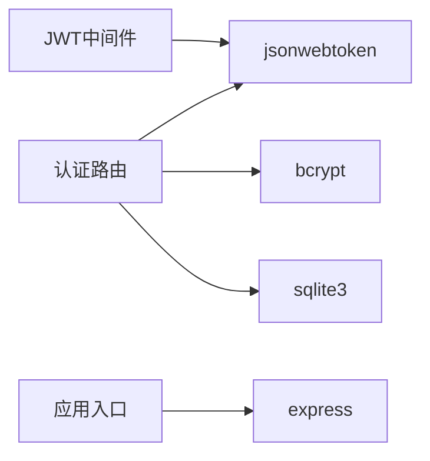

# 认证接口

<cite>
**本文引用的文件**   
- [server/src/routes/auth.js](file://server/src/routes/auth.js)
- [server/src/middleware/auth.js](file://server/src/middleware/auth.js)
- [server/src/db.js](file://server/src/db.js)
- [server/src/index.js](file://server/src/index.js)
- [server/package.json](file://server/package.json)
</cite>

## 目录
1. [简介](#简介)
2. [项目结构](#项目结构)
3. [核心组件](#核心组件)
4. [架构总览](#架构总览)
5. [详细组件分析](#详细组件分析)
6. [依赖分析](#依赖分析)
7. [性能考虑](#性能考虑)
8. [故障排查指南](#故障排查指南)
9. [结论](#结论)
10. [附录](#附录)

## 简介
本文件面向后端认证相关API，覆盖用户注册、登录、登出、密码重置等能力，并说明JWT令牌机制、会话管理、权限验证流程、错误处理格式与安全最佳实践。文档以实际代码为依据，提供接口方法、路径、请求参数、响应结构、状态码与示例（成功/失败），帮助前后端开发者快速集成与排障。

## 项目结构
认证功能主要位于服务端：
- 路由层：定义认证相关HTTP接口
- 中间件层：实现JWT校验与鉴权
- 数据访问层：连接数据库进行用户查询与更新
- 应用入口：挂载路由与全局配置

图表来源
- [server/src/routes/auth.js](file://server/src/routes/auth.js)
- [server/src/middleware/auth.js](file://server/src/middleware/auth.js)
- [server/src/db.js](file://server/src/db.js)
- [server/src/index.js](file://server/src/index.js)

章节来源
- [server/src/routes/auth.js](file://server/src/routes/auth.js)
- [server/src/middleware/auth.js](file://server/src/middleware/auth.js)
- [server/src/db.js](file://server/src/db.js)
- [server/src/index.js](file://server/src/index.js)

## 核心组件
- 认证路由模块：集中实现注册、登录、登出、密码重置等接口
- JWT中间件：解析并校验Authorization头中的Bearer Token，注入当前用户上下文
- 数据库访问模块：封装SQLite连接与常用SQL操作
- 应用入口：加载环境变量、初始化数据库、挂载路由与中间件

章节来源
- [server/src/routes/auth.js](file://server/src/routes/auth.js)
- [server/src/middleware/auth.js](file://server/src/middleware/auth.js)
- [server/src/db.js](file://server/src/db.js)
- [server/src/index.js](file://server/src/index.js)

## 架构总览
认证流程采用无状态JWT方案：客户端登录后获取Token，后续请求在Authorization头携带该Token；服务端通过中间件校验签名与有效期，完成身份识别与授权控制。

图表来源
- [server/src/routes/auth.js](file://server/src/routes/auth.js)
- [server/src/middleware/auth.js](file://server/src/middleware/auth.js)
- [server/src/db.js](file://server/src/db.js)

## 详细组件分析

### 认证路由（/api/auth）
- 注册
  - 方法：POST
  - 路径：/api/auth/register
  - 请求体字段：用户名、邮箱、密码（建议最小长度与复杂度要求）
  - 成功响应：201 Created，返回用户基本信息（不含敏感字段）
  - 失败场景：用户名或邮箱重复、参数校验失败
- 登录
  - 方法：POST
  - 路径：/api/auth/login
  - 请求体字段：用户名或邮箱、密码
  - 成功响应：200 OK，返回access_token与过期时间
  - 失败场景：账号不存在、密码错误、账户被锁定
- 登出
  - 方法：POST
  - 路径：/api/auth/logout
  - 说明：若使用无状态JWT，登出为客户端侧清除本地Token；服务端可支持黑名单登出（可选）
  - 成功响应：200 OK
- 获取当前用户信息
  - 方法：GET
  - 路径：/api/auth/me
  - 鉴权：需要有效的Bearer Token
  - 成功响应：200 OK，返回当前用户信息
- 密码重置
  - 方法：POST
  - 路径：/api/auth/password-reset
  - 请求体字段：邮箱或用户名
  - 成功响应：200 OK，提示已发送重置邮件
  - 失败场景：邮箱/用户名不存在

章节来源
- [server/src/routes/auth.js](file://server/src/routes/auth.js)

### JWT中间件（鉴权）
- 职责
  - 从Authorization头提取Bearer Token
  - 校验签名与过期时间
  - 将解码后的用户信息注入到请求对象中供后续路由使用
- 常见错误
  - 未携带Token：401 Unauthorized
  - Token无效或过期：401 Unauthorized
  - 签名不匹配：401 Unauthorized
- 扩展点
  - 可结合角色/权限字段实现细粒度鉴权

章节来源
- [server/src/middleware/auth.js](file://server/src/middleware/auth.js)

### 数据库访问（用户表）
- 连接与初始化
  - 使用SQLite作为持久化存储
  - 启动时确保用户表存在及必要索引
- 关键操作
  - 按用户名/邮箱查询用户
  - 插入新用户（密码需哈希存储）
  - 更新用户密码（用于重置后写入）
- 安全注意
  - 禁止明文存储密码
  - 使用强哈希算法（如bcrypt）
  - 对输入进行严格校验与转义

章节来源
- [server/src/db.js](file://server/src/db.js)

### 应用入口（Express 初始化）
- 加载环境变量（如JWT密钥、端口、数据库路径）
- 初始化数据库连接
- 挂载认证路由与中间件
- 统一错误处理与日志

章节来源
- [server/src/index.js](file://server/src/index.js)

## 依赖分析
- 运行时依赖
  - Express：HTTP服务框架
  - jsonwebtoken：JWT签发与校验
  - bcrypt：密码哈希
  - sqlite3：SQLite驱动
- 版本约束与兼容性
  - 参考package.json中的依赖声明与版本范围

图表来源
- [server/package.json](file://server/package.json)
- [server/src/routes/auth.js](file://server/src/routes/auth.js)
- [server/src/middleware/auth.js](file://server/src/middleware/auth.js)
- [server/src/db.js](file://server/src/db.js)
- [server/src/index.js](file://server/src/index.js)

章节来源
- [server/package.json](file://server/package.json)

## 性能考虑
- 登录与注册
  - 密码哈希计算开销较大，建议合理设置bcrypt工作因子
  - 对频繁查询的用户名/邮箱建立唯一索引
- JWT校验
  - 中间件轻量，避免在每次校验中进行额外I/O
- 数据库
  - 使用连接池与预编译语句
  - 对热点查询添加合适索引
- 限流与防暴力破解
  - 对登录与密码重置接口实施速率限制
  - 失败次数阈值触发临时封禁

[本节为通用指导，无需具体文件引用]

## 故障排查指南
- 401 Unauthorized
  - 检查Authorization头是否包含正确的Bearer Token
  - 确认JWT密钥一致且未泄露
  - 检查Token是否过期
- 403 Forbidden
  - 检查当前用户是否具备所需角色/权限
- 404 Not Found
  - 确认路由前缀与路径正确
- 422 Unprocessable Entity
  - 检查请求体字段类型与必填项
- 500 Internal Server Error
  - 查看服务端日志定位异常堆栈
  - 检查数据库连接与表结构

章节来源
- [server/src/middleware/auth.js](file://server/src/middleware/auth.js)
- [server/src/routes/auth.js](file://server/src/routes/auth.js)
- [server/src/db.js](file://server/src/db.js)

## 结论
本项目采用无状态JWT认证方案，结合中间件实现统一的鉴权逻辑，配合数据库访问层完成用户数据的持久化。通过合理的错误处理、限流策略与安全的密码存储，可满足一般博客系统的认证需求。建议在上线前完善审计日志、刷新令牌机制与多因素认证等增强能力。

[本节为总结性内容，无需具体文件引用]

## 附录

### 接口清单与示例

- 注册
  - 方法：POST
  - 路径：/api/auth/register
  - 请求体示例
    - 字段：username、email、password
  - 成功响应示例
    - 状态码：201
    - 响应体：{ id, username, email }
  - 失败响应示例
    - 状态码：409
    - 响应体：{ message: "用户名或邮箱已存在" }

- 登录
  - 方法：POST
  - 路径：/api/auth/login
  - 请求体示例
    - 字段：username_or_email、password
  - 成功响应示例
    - 状态码：200
    - 响应体：{ access_token, expires_in }
  - 失败响应示例
    - 状态码：401
    - 响应体：{ message: "用户名或密码错误" }

- 登出
  - 方法：POST
  - 路径：/api/auth/logout
  - 成功响应示例
    - 状态码：200
    - 响应体：{ message: "登出成功" }

- 获取当前用户信息
  - 方法：GET
  - 路径：/api/auth/me
  - 请求头：Authorization: Bearer <token>
  - 成功响应示例
    - 状态码：200
    - 响应体：{ user: { id, username, email } }
  - 失败响应示例
    - 状态码：401
    - 响应体：{ message: "未授权" }

- 密码重置
  - 方法：POST
  - 路径：/api/auth/password-reset
  - 请求体示例
    - 字段：email 或 username
  - 成功响应示例
    - 状态码：200
    - 响应体：{ message: "已发送重置邮件" }
  - 失败响应示例
    - 状态码：404
    - 响应体：{ message: "用户不存在" }

[本节为通用接口规范，便于前后端对齐，无需具体文件引用]

### JWT令牌机制与权限验证流程
- 令牌签发
  - 登录成功后签发JWT，包含用户标识与必要声明
  - 设置合理的过期时间
- 令牌校验
  - 中间件解析Authorization头，校验签名与有效期
  - 校验通过后注入当前用户上下文
- 权限验证
  - 基于用户角色/权限字段进行资源访问控制
  - 可在路由级或控制器级进行二次校验

章节来源
- [server/src/middleware/auth.js](file://server/src/middleware/auth.js)
- [server/src/routes/auth.js](file://server/src/routes/auth.js)

### 密码加密存储策略与安全最佳实践
- 密码存储
  - 使用bcrypt等强哈希算法，不可逆存储
  - 合理设置工作因子以平衡安全与性能
- 传输安全
  - 全站启用HTTPS，防止中间人攻击
- 令牌安全
  - 短生命周期+刷新令牌机制
  - 服务端维护黑名单（可选）
- 输入校验
  - 严格的参数校验与白名单过滤
- 防护策略
  - 登录与重置接口限流
  - 失败次数阈值与冷却期
  - 审计日志与告警

章节来源
- [server/src/routes/auth.js](file://server/src/routes/auth.js)
- [server/src/db.js](file://server/src/db.js)