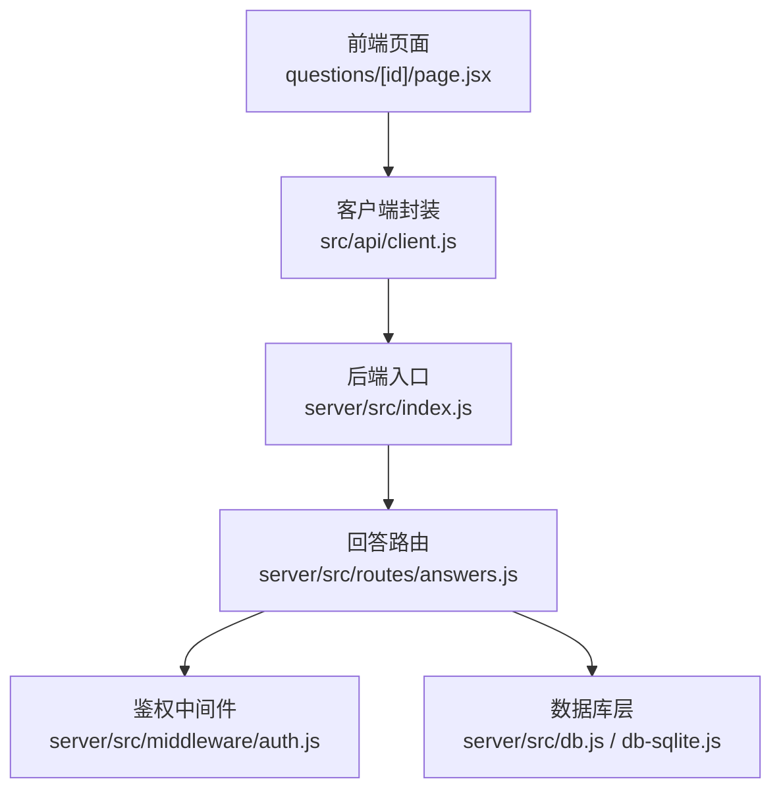
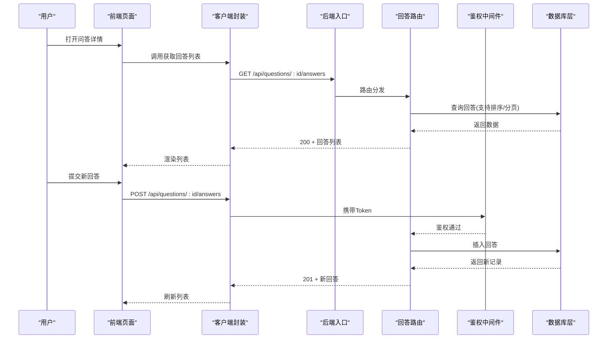
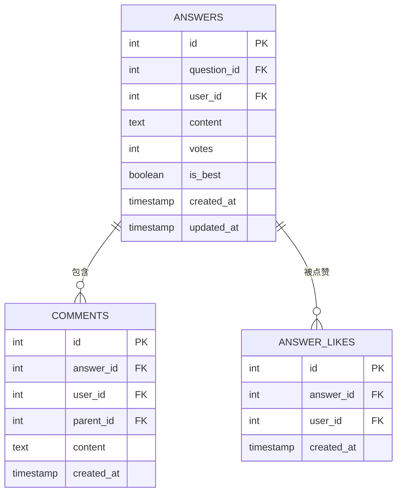
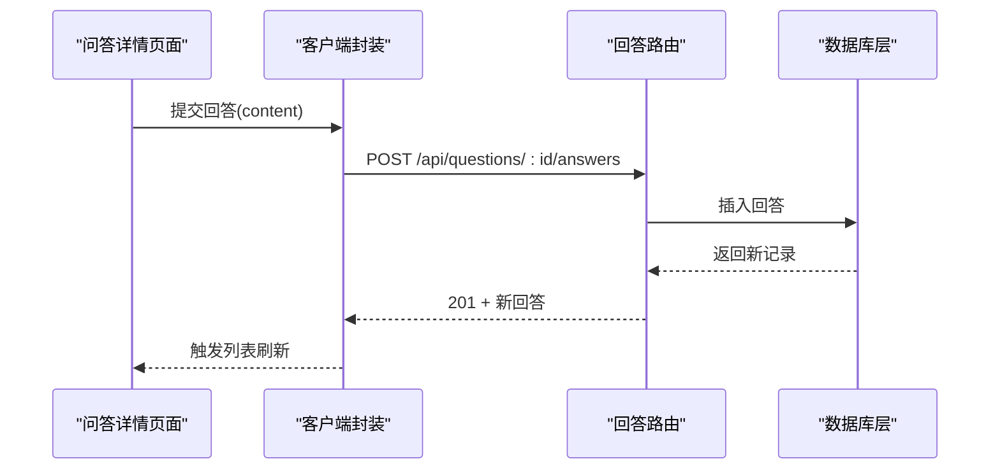
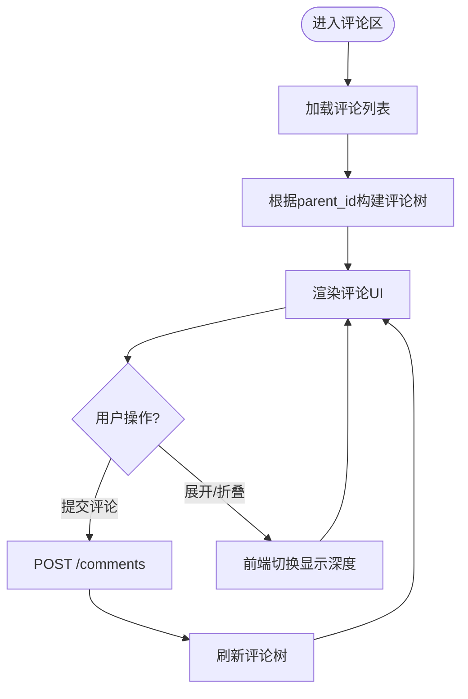
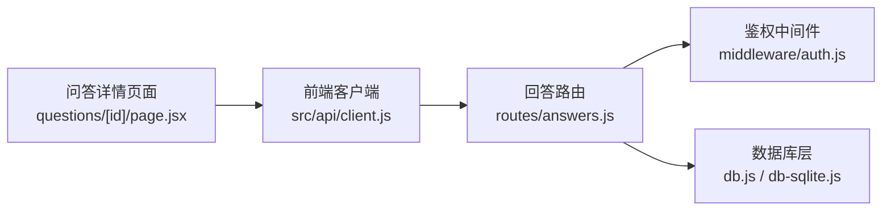

# 回答管理接口

<cite>
**本文引用的文件**   
- [server/src/routes/answers.js](file://server/src/routes/answers.js)
- [server/src/middleware/auth.js](file://server/src/middleware/auth.js)
- [server/src/db.js](file://server/src/db.js)
- [server/src/db-sqlite.js](file://server/src/db-sqlite.js)
- [server/src/index.js](file://server/src/index.js)
- [src/api/client.js](file://src/api/client.js)
- [src/app/questions/[id]/page.jsx](file://src/app/questions/[id]/page.jsx)
- [src/components/CommentSection/CommentSection.jsx](file://src/components/CommentSection/CommentSection.jsx)
</cite>

## 目录
1. [简介](#简介)
2. [项目结构](#项目结构)
3. [核心组件](#核心组件)
4. [架构总览](#架构总览)
5. [详细组件分析](#详细组件分析)
6. [依赖分析](#依赖分析)
7. [性能考虑](#性能考虑)
8. [故障排查指南](#故障排查指南)
9. [结论](#结论)
10. [附录](#附录)

## 简介
本文件面向“回答”模块的API文档，覆盖以下能力：
- 基础操作：提交、编辑、删除回答
- 查询能力：按问题获取回答列表、支持按时间或投票数排序、分页与过滤
- 互动功能：最佳答案标记、回答点赞、评论回复（含嵌套）
- 安全控制：权限验证、内容审核、防刷机制
- 数据模型：回答及相关实体的字段定义
- 调用示例：请求/响应结构与错误码说明
- 进阶实现：嵌套回答的数据组织与实时更新策略

## 项目结构
回答相关后端路由位于 server/src/routes/answers.js，鉴权中间件在 server/src/middleware/auth.js，数据库连接与SQL封装在 server/src/db.js 与 server/src/db-sqlite.js。前端通过 src/api/client.js 发起HTTP请求，并在问答详情页中集成回答与评论交互。

图表来源
- [server/src/index.js](file://server/src/index.js)
- [server/src/routes/answers.js](file://server/src/routes/answers.js)
- [server/src/middleware/auth.js](file://server/src/middleware/auth.js)
- [server/src/db.js](file://server/src/db.js)
- [server/src/db-sqlite.js](file://server/src/db-sqlite.js)
- [src/api/client.js](file://src/api/client.js)
- [src/app/questions/[id]/page.jsx](file://src/app/questions/[id]/page.jsx)

章节来源
- [server/src/index.js](file://server/src/index.js)
- [server/src/routes/answers.js](file://server/src/routes/answers.js)
- [server/src/middleware/auth.js](file://server/src/middleware/auth.js)
- [server/src/db.js](file://server/src/db.js)
- [server/src/db-sqlite.js](file://server/src/db-sqlite.js)
- [src/api/client.js](file://src/api/client.js)
- [src/app/questions/[id]/page.jsx](file://src/app/questions/[id]/page.jsx)

## 核心组件
- 回答路由模块：提供回答CRUD、排序、分页、最佳答案标记、点赞等接口
- 鉴权中间件：校验登录态与角色（普通用户/管理员），用于写操作与敏感操作保护
- 数据库层：统一SQLite访问封装，提供事务、预编译语句、错误处理
- 前端客户端：统一的HTTP请求封装，负责鉴权头注入、错误提示与重试
- 问答详情页面：聚合回答列表、提交表单、点赞与评论交互

章节来源
- [server/src/routes/answers.js](file://server/src/routes/answers.js)
- [server/src/middleware/auth.js](file://server/src/middleware/auth.js)
- [server/src/db.js](file://server/src/db.js)
- [server/src/db-sqlite.js](file://server/src/db-sqlite.js)
- [src/api/client.js](file://src/api/client.js)
- [src/app/questions/[id]/page.jsx](file://src/app/questions/[id]/page.jsx)

## 架构总览
回答模块采用前后端分离架构，前端通过RESTful API与后端交互；后端基于Express路由分发，使用SQLite持久化数据。鉴权中间件对写接口进行保护，数据库层统一封装SQL执行与错误处理。

图表来源
- [server/src/index.js](file://server/src/index.js)
- [server/src/routes/answers.js](file://server/src/routes/answers.js)
- [server/src/middleware/auth.js](file://server/src/middleware/auth.js)
- [server/src/db.js](file://server/src/db.js)
- [server/src/db-sqlite.js](file://server/src/db-sqlite.js)
- [src/api/client.js](file://src/api/client.js)
- [src/app/questions/[id]/page.jsx](file://src/app/questions/[id]/page.jsx)

## 详细组件分析

### 数据模型
- 回答表 answers
  - id: 主键
  - question_id: 外键，关联问题
  - user_id: 作者ID
  - content: 文本内容
  - votes: 票数
  - is_best: 是否最佳答案
  - created_at: 创建时间
  - updated_at: 更新时间
- 评论表 comments
  - id: 主键
  - answer_id: 所属回答ID
  - user_id: 作者ID
  - parent_id: 父评论ID（为NULL表示顶级评论）
  - content: 文本内容
  - created_at: 创建时间
- 点赞表 answer_likes
  - id: 主键
  - answer_id: 被点赞回答ID
  - user_id: 点赞用户ID
  - created_at: 点赞时间
  - 约束：同一用户对同一回答仅能点赞一次

图表来源
- [server/src/db.js](file://server/src/db.js)
- [server/src/db-sqlite.js](file://server/src/db-sqlite.js)

章节来源
- [server/src/db.js](file://server/src/db.js)
- [server/src/db-sqlite.js](file://server/src/db-sqlite.js)

### 接口清单与行为说明
以下为回答相关接口的规范说明（以路径与方法为准，参数与返回结构见各小节）。所有写接口均需携带鉴权Token，读接口可匿名访问。

- 获取回答列表
  - 方法: GET
  - 路径: /api/questions/:id/answers
  - 查询参数:
    - sort: time | votes（默认time）
    - page: 页码（默认1）
    - per_page: 每页数量（默认20）
  - 返回: 分页后的回答数组及元信息（总数、页码等）
  - 行为: 按问题ID筛选，支持按时间或票数排序，支持分页

- 提交回答
  - 方法: POST
  - 路径: /api/questions/:id/answers
  - 请求体: { content }
  - 返回: 新建的回答对象
  - 行为: 校验内容与长度，写入answers表，votes初始为0，is_best为false

- 更新回答
  - 方法: PUT
  - 路径: /api/answers/:answerId
  - 请求体: { content }
  - 返回: 更新后的回答对象
  - 行为: 仅作者或管理员可编辑，更新updated_at

- 删除回答
  - 方法: DELETE
  - 路径: /api/answers/:answerId
  - 返回: 成功状态
  - 行为: 仅作者或管理员可删除，级联清理评论与点赞记录

- 标记最佳答案
  - 方法: PATCH
  - 路径: /api/answers/:answerId/best
  - 返回: 更新后的回答对象
  - 行为: 仅问题作者或管理员可设置，同问题下其他回答is_best置为false

- 点赞回答
  - 方法: POST
  - 路径: /api/answers/:answerId/like
  - 返回: 当前点赞状态与最新票数
  - 行为: 幂等，重复点赞无效，votes+1

- 取消点赞
  - 方法: DELETE
  - 路径: /api/answers/:answerId/like
  - 返回: 当前点赞状态与最新票数
  - 行为: 幂等，重复取消无效，votes-1

- 获取回答评论
  - 方法: GET
  - 路径: /api/answers/:answerId/comments
  - 查询参数:
    - depth: 最大嵌套深度（默认2）
    - sort: time（默认）
  - 返回: 树形结构的评论列表
  - 行为: 根据parent_id构建层级，支持限制深度

- 提交评论
  - 方法: POST
  - 路径: /api/answers/:answerId/comments
  - 请求体: { content, parent_id? }
  - 返回: 新建的评论对象
  - 行为: 支持嵌套评论，parent_id为空时为顶级评论

- 更新评论
  - 方法: PUT
  - 路径: /api/comments/:commentId
  - 请求体: { content }
  - 返回: 更新后的评论对象
  - 行为: 仅作者或管理员可编辑

- 删除评论
  - 方法: DELETE
  - 路径: /api/comments/:commentId
  - 返回: 成功状态
  - 行为: 仅作者或管理员可删除

章节来源
- [server/src/routes/answers.js](file://server/src/routes/answers.js)
- [server/src/middleware/auth.js](file://server/src/middleware/auth.js)
- [server/src/db.js](file://server/src/db.js)
- [server/src/db-sqlite.js](file://server/src/db-sqlite.js)

### 权限与安全控制
- 鉴权
  - 所有写接口需携带Authorization: Bearer <token>
  - 中间件校验token有效性并解析user_id与role
- 授权规则
  - 编辑/删除回答或评论：仅作者或管理员
  - 标记最佳答案：仅问题作者或管理员
- 内容审核
  - 建议接入内容审核服务，对content字段进行敏感词检测与风险拦截
  - 审核未通过的内容应拒绝写入或标记为待审
- 防刷机制
  - 速率限制：对点赞、提交回答/评论接口实施IP与用户维度的限流
  - 幂等性：点赞接口设计为幂等，避免重复计数
  - 输入校验：严格校验content长度、格式与非法字符
  - 审计日志：记录关键操作的user_id、ip、时间戳

章节来源
- [server/src/middleware/auth.js](file://server/src/middleware/auth.js)
- [server/src/routes/answers.js](file://server/src/routes/answers.js)

### 前端集成与调用示例
- 客户端封装
  - 统一请求封装，自动注入鉴权头
  - 错误处理：网络异常、业务错误码提示
- 问答详情页面
  - 加载回答列表，支持切换排序方式
  - 提交回答表单，成功后刷新列表
  - 点赞按钮联动，实时显示票数变化
  - 评论区域支持展开/折叠与嵌套展示

图表来源
- [src/api/client.js](file://src/api/client.js)
- [src/app/questions/[id]/page.jsx](file://src/app/questions/[id]/page.jsx)
- [server/src/routes/answers.js](file://server/src/routes/answers.js)
- [server/src/db.js](file://server/src/db.js)

章节来源
- [src/api/client.js](file://src/api/client.js)
- [src/app/questions/[id]/page.jsx](file://src/app/questions/[id]/page.jsx)

### 评论与嵌套实现
- 数据结构
  - 评论表包含parent_id字段，用于表达父子关系
- 读取策略
  - 一次性拉取某回答下的评论，前端根据parent_id构建树
  - 支持depth参数限制最大嵌套深度，避免过深树导致渲染卡顿
- 交互流程
  - 提交评论时指定parent_id可实现回复
  - 更新/删除评论遵循与回答相同的权限规则

图表来源
- [server/src/routes/answers.js](file://server/src/routes/answers.js)
- [server/src/db.js](file://server/src/db.js)
- [src/components/CommentSection/CommentSection.jsx](file://src/components/CommentSection/CommentSection.jsx)

章节来源
- [server/src/routes/answers.js](file://server/src/routes/answers.js)
- [server/src/db.js](file://server/src/db.js)
- [src/components/CommentSection/CommentSection.jsx](file://src/components/CommentSection/CommentSection.jsx)

### 实时更新方案
- 短轮询
  - 前端定时拉取回答列表与评论，适用于低并发场景
- WebSocket
  - 服务端维护连接，推送新增回答、评论与点赞变更
  - 客户端订阅特定问题或回答频道，减少不必要请求
- 选择建议
  - 初期可采用短轮询，逐步引入WebSocket提升体验

[本节为通用实现建议，不直接分析具体文件]

## 依赖分析
- 路由依赖鉴权中间件与数据库层
- 前端客户端依赖后端路由与鉴权头注入
- 数据库层依赖SQLite驱动与连接配置

图表来源
- [server/src/routes/answers.js](file://server/src/routes/answers.js)
- [server/src/middleware/auth.js](file://server/src/middleware/auth.js)
- [server/src/db.js](file://server/src/db.js)
- [server/src/db-sqlite.js](file://server/src/db-sqlite.js)
- [src/api/client.js](file://src/api/client.js)
- [src/app/questions/[id]/page.jsx](file://src/app/questions/[id]/page.jsx)

章节来源
- [server/src/routes/answers.js](file://server/src/routes/answers.js)
- [server/src/middleware/auth.js](file://server/src/middleware/auth.js)
- [server/src/db.js](file://server/src/db.js)
- [server/src/db-sqlite.js](file://server/src/db-sqlite.js)
- [src/api/client.js](file://src/api/client.js)
- [src/app/questions/[id]/page.jsx](file://src/app/questions/[id]/page.jsx)

## 性能考虑
- 索引优化
  - 在answers(question_id, created_at)、answers(question_id, votes)建立复合索引以提升排序与筛选性能
  - 在comments(answer_id, parent_id)建立索引以加速评论树构建
- 分页与懒加载
  - 默认分页大小适中，避免单次返回过多数据
  - 评论支持深度限制与按需展开
- 缓存策略
  - 热点问题的回答列表可短期缓存，结合版本号或时间戳失效
- 去重与幂等
  - 点赞接口幂等，避免重复计数与额外开销

[本节为通用性能建议，不直接分析具体文件]

## 故障排查指南
- 常见错误码
  - 401 未授权：缺少或无效Token
  - 403 禁止访问：无权限执行该操作
  - 400 参数错误：请求体缺失或格式不正确
  - 404 资源不存在：回答/评论ID无效
  - 429 请求过于频繁：触发限流
  - 500 服务器内部错误：数据库或系统异常
- 排查步骤
  - 检查鉴权头是否正确注入
  - 核对请求参数与必填字段
  - 查看后端日志中的SQL执行与错误堆栈
  - 确认数据库连接与表结构是否一致
  - 针对限流问题，调整阈值或增加退避重试

章节来源
- [server/src/middleware/auth.js](file://server/src/middleware/auth.js)
- [server/src/routes/answers.js](file://server/src/routes/answers.js)
- [server/src/db.js](file://server/src/db.js)

## 结论
回答管理接口围绕CRUD、排序分页、互动与权限控制展开，配合数据库层与鉴权中间件形成完整闭环。建议在后续迭代中引入内容审核与WebSocket实时更新，进一步提升安全性与用户体验。

[本节为总结性内容，不直接分析具体文件]

## 附录
- 接口调用示例（以路径与参数为主）
  - 获取回答列表: GET /api/questions/:id/answers?sort=votes&page=1&per_page=20
  - 提交回答: POST /api/questions/:id/answers { "content": "..." }
  - 更新回答: PUT /api/answers/:answerId { "content": "..." }
  - 删除回答: DELETE /api/answers/:answerId
  - 标记最佳答案: PATCH /api/answers/:answerId/best
  - 点赞回答: POST /api/answers/:answerId/like
  - 取消点赞: DELETE /api/answers/:answerId/like
  - 获取评论: GET /api/answers/:answerId/comments?depth=2&sort=time
  - 提交评论: POST /api/answers/:answerId/comments { "content": "...", "parent_id": null }
  - 更新评论: PUT /api/comments/:commentId { "content": "..." }
  - 删除评论: DELETE /api/comments/:commentId

[本节为接口清单汇总，不直接分析具体文件]