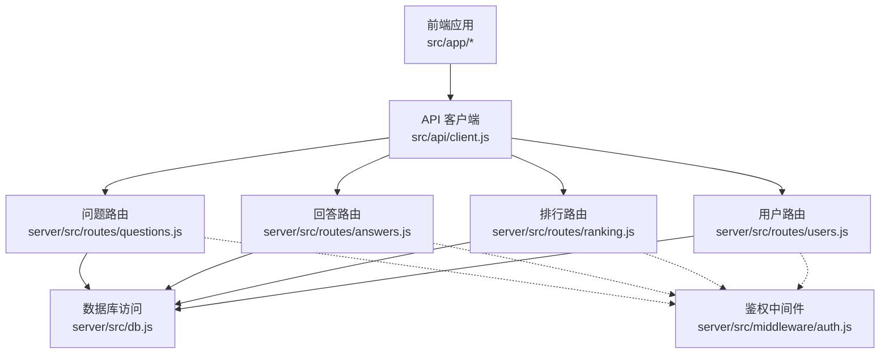
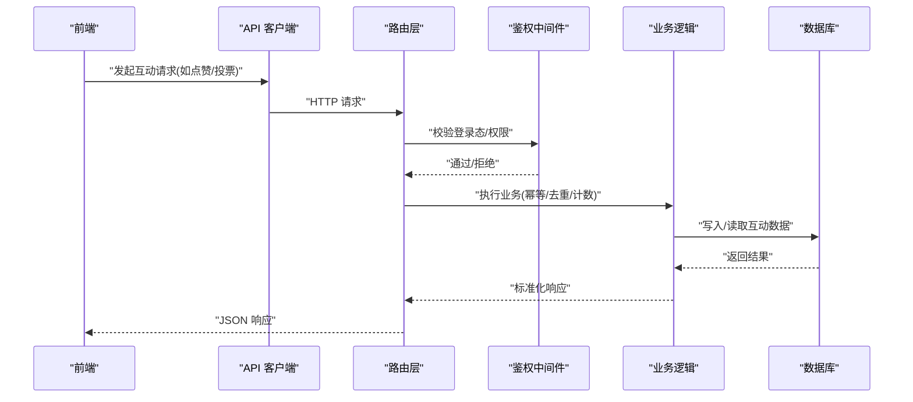
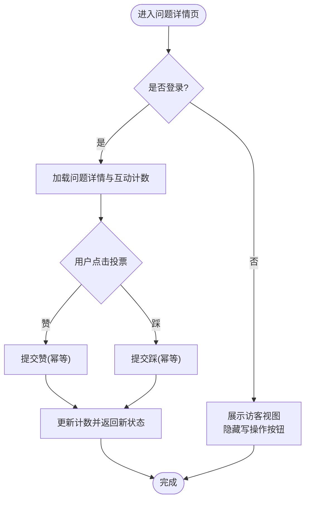
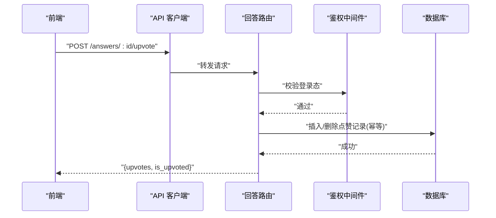
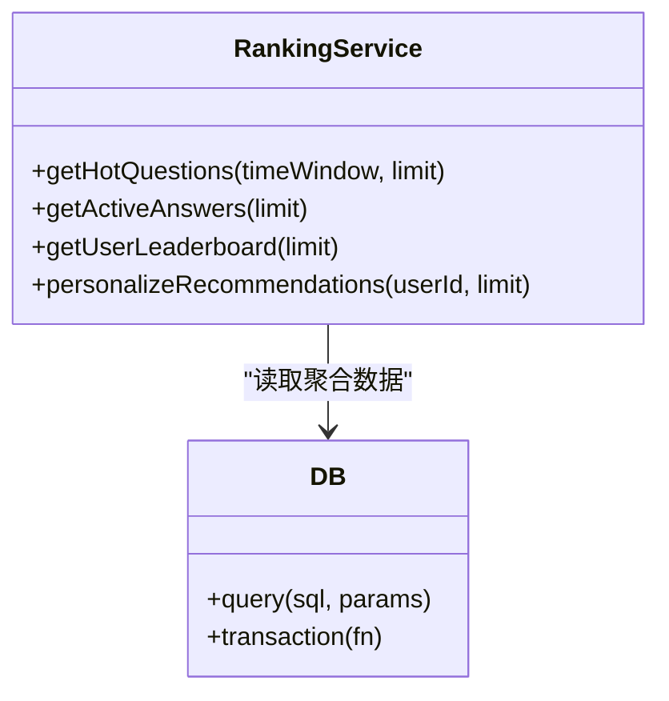
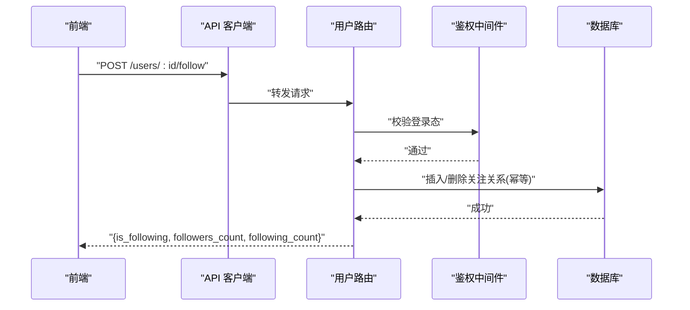
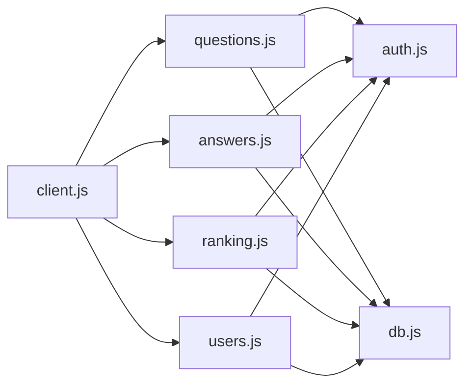

# 问答互动接口

<cite>
**本文引用的文件**   
- [server/src/routes/questions.js](file://server/src/routes/questions.js)
- [server/src/routes/answers.js](file://server/src/routes/answers.js)
- [server/src/routes/ranking.js](file://server/src/routes/ranking.js)
- [server/src/routes/users.js](file://server/src/routes/users.js)
- [server/src/db.js](file://server/src/db.js)
- [server/src/middleware/auth.js](file://server/src/middleware/auth.js)
- [src/api/client.js](file://src/api/client.js)
</cite>

## 目录
1. [简介](#简介)
2. [项目结构](#项目结构)
3. [核心组件](#核心组件)
4. [架构总览](#架构总览)
5. [详细组件分析](#详细组件分析)
6. [依赖分析](#依赖分析)
7. [性能考虑](#性能考虑)
8. [故障排查指南](#故障排查指南)
9. [结论](#结论)
10. [附录](#附录)

## 简介
本文件聚焦于“问答系统”的互动能力，覆盖问题投票、收藏、关注等用户行为；回答点赞、有用性标记、举报反馈等互动；以及排行榜、热门问题推荐、个性化推荐等算法相关接口。同时给出用户关注关系、问答热度计算、内容质量评估的业务逻辑说明，并提供完整的互动数据模型与统计接口，包含实时数据更新与缓存策略的实现细节。

## 项目结构
后端采用 Node.js + Express 路由分层，数据库访问通过统一 db 模块封装；前端通过 api/client.js 调用后端 REST API。

图表来源
- [server/src/routes/questions.js](file://server/src/routes/questions.js)
- [server/src/routes/answers.js](file://server/src/routes/answers.js)
- [server/src/routes/ranking.js](file://server/src/routes/ranking.js)
- [server/src/routes/users.js](file://server/src/routes/users.js)
- [server/src/db.js](file://server/src/db.js)
- [server/src/middleware/auth.js](file://server/src/middleware/auth.js)
- [src/api/client.js](file://src/api/client.js)

章节来源
- [server/src/routes/questions.js](file://server/src/routes/questions.js)
- [server/src/routes/answers.js](file://server/src/routes/answers.js)
- [server/src/routes/ranking.js](file://server/src/routes/ranking.js)
- [server/src/routes/users.js](file://server/src/routes/users.js)
- [server/src/db.js](file://server/src/db.js)
- [server/src/middleware/auth.js](file://server/src/middleware/auth.js)
- [src/api/client.js](file://src/api/client.js)

## 核心组件
- 问题路由：提供问题列表、详情、投票（支持赞/踩）、收藏、关注、搜索过滤等。
- 回答路由：提供回答列表、详情、点赞、有用性标记、举报反馈、排序等。
- 排行路由：提供热门问题、活跃回答、用户贡献榜等聚合接口。
- 用户路由：提供关注/取关、粉丝/关注列表、个人主页统计等。
- 鉴权中间件：对需要登录的写操作进行身份校验。
- 数据库访问：统一的 SQL 执行与事务封装，支撑高并发读写。

章节来源
- [server/src/routes/questions.js](file://server/src/routes/questions.js)
- [server/src/routes/answers.js](file://server/src/routes/answers.js)
- [server/src/routes/ranking.js](file://server/src/routes/ranking.js)
- [server/src/routes/users.js](file://server/src/routes/users.js)
- [server/src/middleware/auth.js](file://server/src/middleware/auth.js)
- [server/src/db.js](file://server/src/db.js)

## 架构总览
整体为前后端分离的 REST 架构。前端通过 API 客户端发起请求，后端路由层负责参数校验、权限控制、业务编排与结果返回，底层通过 db 模块访问持久化存储。

图表来源
- [server/src/routes/questions.js](file://server/src/routes/questions.js)
- [server/src/routes/answers.js](file://server/src/routes/answers.js)
- [server/src/middleware/auth.js](file://server/src/middleware/auth.js)
- [server/src/db.js](file://server/src/db.js)
- [src/api/client.js](file://src/api/client.js)

## 详细组件分析

### 问题互动接口
- 问题列表与筛选
  - 支持按标签、时间、热度、收藏数、关注数等维度筛选与分页。
  - 返回字段包括问题基础信息、互动计数、是否已收藏/关注、当前用户状态等。
- 问题详情
  - 返回问题正文、作者信息、互动计数、关联回答数量、是否已收藏/关注等。
- 问题投票（赞/踩）
  - 支持幂等操作，同一用户对同一问题仅能投一次票，再次点击取消。
  - 返回最新票数与用户当前投票状态。
- 问题收藏
  - 支持收藏/取消收藏，返回收藏状态与总数。
- 问题关注
  - 支持关注/取消关注问题主题或特定问题，用于后续推送与个性化推荐。
- 搜索与推荐
  - 关键词检索、同义词扩展、拼写纠错（可选）。
  - 基于用户关注与历史行为的个性化推荐入口（见“算法接口”）。

图表来源
- [server/src/routes/questions.js](file://server/src/routes/questions.js)
- [server/src/middleware/auth.js](file://server/src/middleware/auth.js)
- [server/src/db.js](file://server/src/db.js)

章节来源
- [server/src/routes/questions.js](file://server/src/routes/questions.js)
- [server/src/middleware/auth.js](file://server/src/middleware/auth.js)
- [server/src/db.js](file://server/src/db.js)

### 回答互动接口
- 回答列表与排序
  - 支持按赞同数、时间、采纳状态排序，支持分页。
- 回答详情
  - 返回回答正文、作者信息、互动计数、是否已点赞、是否标记为“有用”等。
- 回答点赞
  - 幂等操作，支持取消点赞，返回最新点赞数与用户状态。
- 有用性标记
  - 允许用户对回答进行“有帮助/无帮助”标记，用于质量评估与排序权重。
- 举报反馈
  - 支持选择类型（广告、低质、违规等）并提交，后台审核队列处理。

图表来源
- [server/src/routes/answers.js](file://server/src/routes/answers.js)
- [server/src/middleware/auth.js](file://server/src/middleware/auth.js)
- [server/src/db.js](file://server/src/db.js)

章节来源
- [server/src/routes/answers.js](file://server/src/routes/answers.js)
- [server/src/middleware/auth.js](file://server/src/middleware/auth.js)
- [server/src/db.js](file://server/src/db.js)

### 排行榜与推荐接口
- 热门问题
  - 基于近期互动密度（点赞、收藏、关注、回答数）加权计算，支持时间窗口与分页。
- 活跃回答
  - 基于回答的点赞、有用性标记、被采纳率等指标排序。
- 用户贡献榜
  - 基于用户发布/回答数量、获赞数、有用性标记数等综合评分。
- 个性化推荐
  - 基于用户关注的问题/作者、历史浏览与互动行为，生成候选集并按相关性打分。

图表来源
- [server/src/routes/ranking.js](file://server/src/routes/ranking.js)
- [server/src/db.js](file://server/src/db.js)

章节来源
- [server/src/routes/ranking.js](file://server/src/routes/ranking.js)
- [server/src/db.js](file://server/src/db.js)

### 用户关注关系接口
- 关注/取关用户
  - 幂等操作，返回关注状态与双方粉丝/关注计数。
- 粉丝/关注列表
  - 分页返回，支持按活跃度排序。
- 个人主页统计
  - 返回用户的提问数、回答数、获赞数、有用性标记数、收藏数等。

图表来源
- [server/src/routes/users.js](file://server/src/routes/users.js)
- [server/src/middleware/auth.js](file://server/src/middleware/auth.js)
- [server/src/db.js](file://server/src/db.js)

章节来源
- [server/src/routes/users.js](file://server/src/routes/users.js)
- [server/src/middleware/auth.js](file://server/src/middleware/auth.js)
- [server/src/db.js](file://server/src/db.js)

### 业务逻辑说明
- 用户关注关系
  - 关注关系表维护用户间关注状态，支持双向查询（粉丝/关注），在个人主页与推荐中广泛使用。
- 问答热度计算
  - 热度 = f(近N小时互动密度, 回答数, 收藏/关注增量, 时间衰减)。可按日/周/月窗口聚合。
- 内容质量评估
  - 基于有用性标记比例、举报率、采纳状态、作者信誉分等维度，输出质量分数，影响排序与曝光。

[本节为概念性说明，不直接分析具体文件]

## 依赖分析
- 路由层依赖鉴权中间件进行写操作保护。
- 所有路由均通过 db 模块访问数据库，避免直连 SQL。
- 前端通过 api/client.js 统一封装请求头、错误处理与重试策略。

图表来源
- [server/src/routes/questions.js](file://server/src/routes/questions.js)
- [server/src/routes/answers.js](file://server/src/routes/answers.js)
- [server/src/routes/ranking.js](file://server/src/routes/ranking.js)
- [server/src/routes/users.js](file://server/src/routes/users.js)
- [server/src/middleware/auth.js](file://server/src/middleware/auth.js)
- [server/src/db.js](file://server/src/db.js)
- [src/api/client.js](file://src/api/client.js)

章节来源
- [server/src/routes/questions.js](file://server/src/routes/questions.js)
- [server/src/routes/answers.js](file://server/src/routes/answers.js)
- [server/src/routes/ranking.js](file://server/src/routes/ranking.js)
- [server/src/routes/users.js](file://server/src/routes/users.js)
- [server/src/middleware/auth.js](file://server/src/middleware/auth.js)
- [server/src/db.js](file://server/src/db.js)
- [src/api/client.js](file://src/api/client.js)

## 性能考虑
- 幂等与去重
  - 点赞、投票、收藏、关注等写操作需保证幂等，避免重复计数。
- 计数优化
  - 高频读场景可引入内存缓存（如 Redis）缓存热点计数，定期回写数据库。
- 批量与异步
  - 排行榜与统计类接口建议异步预计算与定时刷新，降低在线查询压力。
- 索引设计
  - 针对用户ID、资源ID、时间戳建立复合索引，提升筛选与排序效率。
- 限流与熔断
  - 对写接口实施速率限制，防止恶意刷量；对聚合接口设置超时与降级策略。

[本节为通用指导，不直接分析具体文件]

## 故障排查指南
- 常见错误码
  - 401 未认证：检查登录态与中间件配置。
  - 403 无权限：检查资源归属与角色权限。
  - 400 参数错误：检查必填字段与格式。
  - 409 冲突：幂等操作重复提交或状态不一致。
  - 500 服务器错误：查看日志与数据库连接状态。
- 定位步骤
  - 确认前端请求路径与方法是否正确。
  - 检查鉴权中间件是否放行。
  - 核对数据库事务与约束是否触发异常。
  - 观察缓存一致性（若启用）。

章节来源
- [server/src/middleware/auth.js](file://server/src/middleware/auth.js)
- [server/src/db.js](file://server/src/db.js)

## 结论
本方案围绕问答系统的互动能力，构建了从问题到回答的全链路交互接口，并通过排行榜与推荐接口实现内容分发与个性化体验。结合幂等设计、计数优化与缓存策略，可在保证一致性的前提下提升性能与稳定性。

[本节为总结性内容，不直接分析具体文件]

## 附录

### 数据模型（互动相关）
- 用户
  - 字段：用户ID、用户名、邮箱、注册时间、信誉分等。
- 问题
  - 字段：问题ID、标题、正文、作者ID、创建时间、更新时间、状态等。
- 回答
  - 字段：回答ID、问题ID、作者ID、正文、创建时间、更新时间、状态等。
- 问题投票
  - 字段：用户ID、问题ID、类型（赞/踩）、时间戳。
- 问题收藏
  - 字段：用户ID、问题ID、时间戳。
- 问题关注
  - 字段：用户ID、问题ID/主题ID、时间戳。
- 回答点赞
  - 字段：用户ID、回答ID、时间戳。
- 回答有用性标记
  - 字段：用户ID、回答ID、标记值（有帮助/无帮助）、时间戳。
- 举报反馈
  - 字段：举报ID、用户ID、目标类型（问题/回答）、目标ID、类型、描述、状态、时间戳。
- 用户关注关系
  - 字段：关注者ID、被关注者ID、时间戳。

[本节为概念性数据模型说明，不直接分析具体文件]

### 统计与实时接口
- 实时计数
  - 提供获取问题/回答的点赞数、收藏数、关注数、有用性标记数等。
- 排行榜
  - 提供热门问题、活跃回答、用户贡献榜等聚合数据。
- 缓存策略
  - 热点计数采用内存缓存+定时回写；排行榜采用异步预计算+TTL失效。

章节来源
- [server/src/routes/ranking.js](file://server/src/routes/ranking.js)
- [server/src/db.js](file://server/src/db.js)