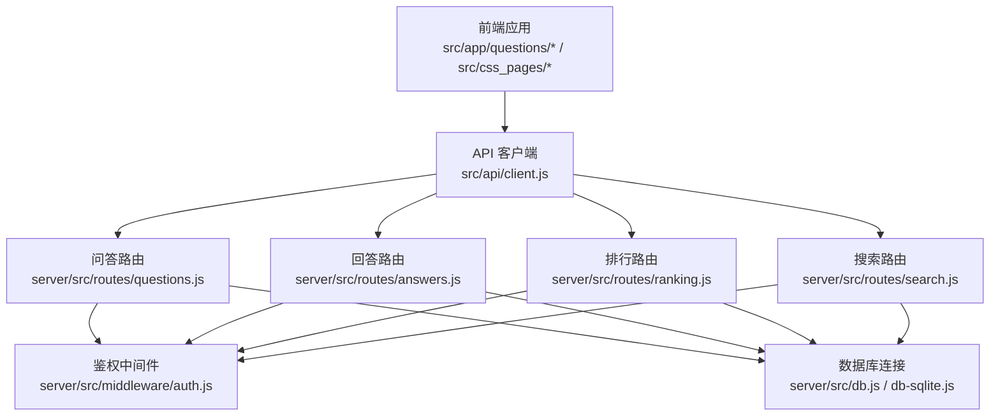
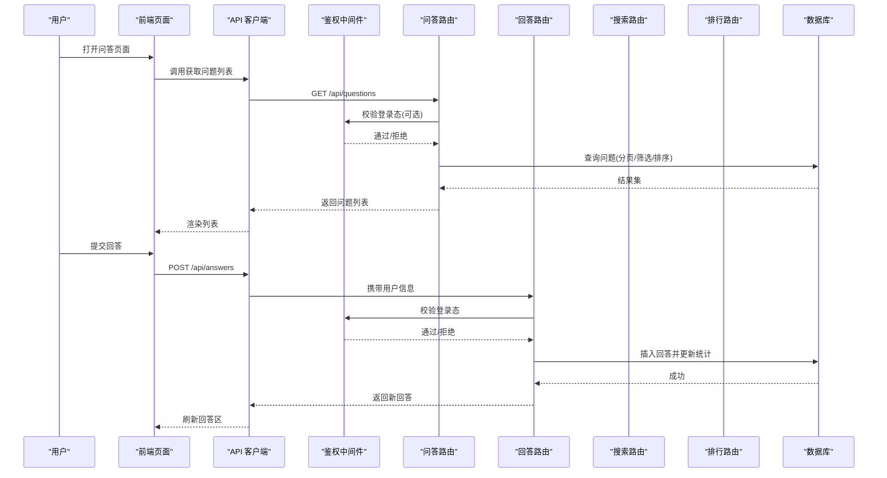
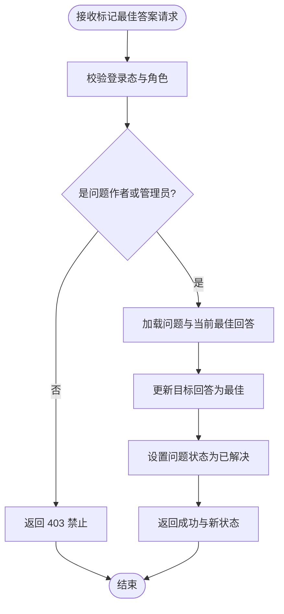
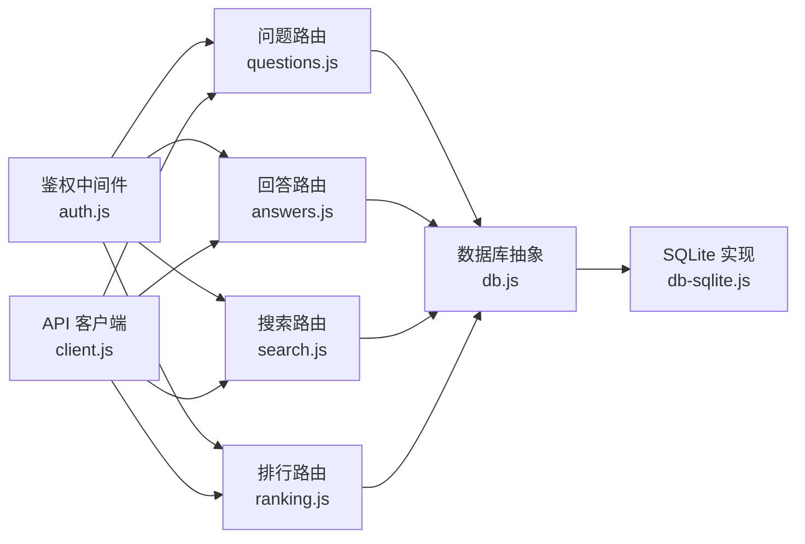
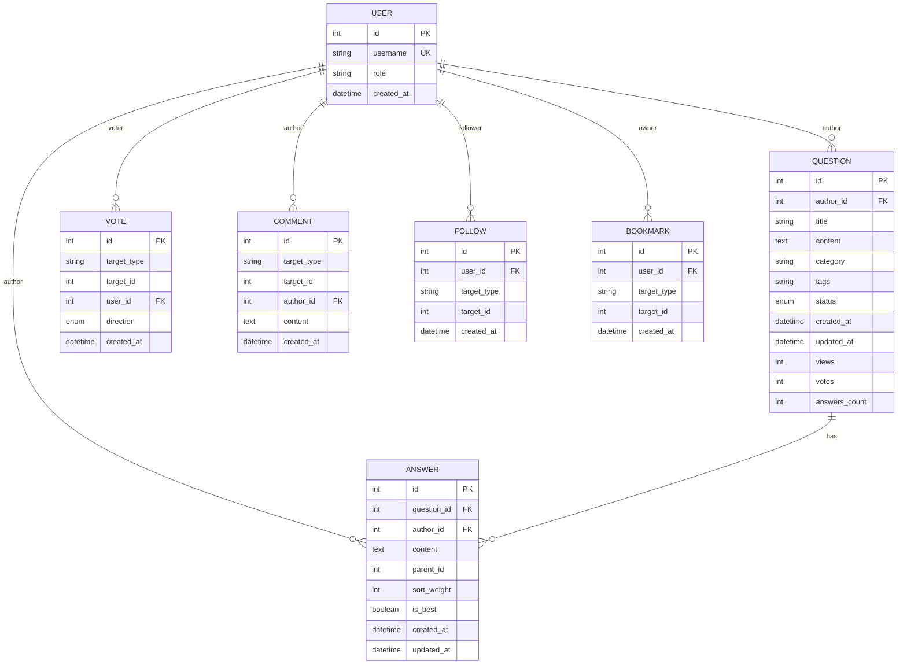

# 问答系统接口

<cite>
**本文引用的文件**   
- [server/src/index.js](file://server/src/index.js)
- [server/src/routes/questions.js](file://server/src/routes/questions.js)
- [server/src/routes/answers.js](file://server/src/routes/answers.js)
- [server/src/routes/ranking.js](file://server/src/routes/ranking.js)
- [server/src/routes/search.js](file://server/src/routes/search.js)
- [server/src/middleware/auth.js](file://server/src/middleware/auth.js)
- [server/src/db.js](file://server/src/db.js)
- [server/src/db-sqlite.js](file://server/src/db-sqlite.js)
- [src/api/client.js](file://src/api/client.js)
- [src/app/questions/page.jsx](file://src/app/questions/page.jsx)
- [src/app/questions/[id]/page.jsx](file://src/app/questions/[id]/page.jsx)
- [src/app/questions/ask/page.jsx](file://src/app/questions/ask/page.jsx)
- [src/css_pages/questiondetail.jsx](file://src/css_pages/questiondetail.jsx)
- [src/css_pages/questions.jsx](file://src/css_pages/questions.jsx)
- [src/css_pages/questionform.jsx](file://src/css_pages/questionform.jsx)
</cite>

## 目录
1. [简介](#简介)
2. [项目结构](#项目结构)
3. [核心组件](#核心组件)
4. [架构总览](#架构总览)
5. [详细组件分析](#详细组件分析)
6. [依赖分析](#依赖分析)
7. [性能考虑](#性能考虑)
8. [故障排查指南](#故障排查指南)
9. [结论](#结论)
10. [附录](#附录)

## 简介
本文件为问答系统的后端 API 文档，覆盖问题发布、问题列表与详情、回答提交与排序、最佳答案标记、投票、评论、关注、收藏、分类与标签筛选、搜索与排序、状态管理与审核流程、权限控制等。同时提供数据模型说明与接口调用示例路径，帮助前后端开发者快速集成与联调。

## 项目结构
问答相关功能主要位于服务端路由与中间件：
- 入口与路由挂载：server/src/index.js
- 问答资源路由：server/src/routes/questions.js、server/src/routes/answers.js
- 排行榜与搜索：server/src/routes/ranking.js、server/src/routes/search.js
- 鉴权中间件：server/src/middleware/auth.js
- 数据库连接与驱动：server/src/db.js、server/src/db-sqlite.js
- 前端客户端封装：src/api/client.js
- 前端页面（用于理解请求来源）：src/app/questions/*、src/css_pages/*

图表来源
- [server/src/index.js](file://server/src/index.js)
- [server/src/routes/questions.js](file://server/src/routes/questions.js)
- [server/src/routes/answers.js](file://server/src/routes/answers.js)
- [server/src/routes/ranking.js](file://server/src/routes/ranking.js)
- [server/src/routes/search.js](file://server/src/routes/search.js)
- [server/src/middleware/auth.js](file://server/src/middleware/auth.js)
- [server/src/db.js](file://server/src/db.js)
- [server/src/db-sqlite.js](file://server/src/db-sqlite.js)
- [src/api/client.js](file://src/api/client.js)

章节来源
- [server/src/index.js](file://server/src/index.js)
- [server/src/routes/questions.js](file://server/src/routes/questions.js)
- [server/src/routes/answers.js](file://server/src/routes/answers.js)
- [server/src/routes/ranking.js](file://server/src/routes/ranking.js)
- [server/src/routes/search.js](file://server/src/routes/search.js)
- [server/src/middleware/auth.js](file://server/src/middleware/auth.js)
- [server/src/db.js](file://server/src/db.js)
- [server/src/db-sqlite.js](file://server/src/db-sqlite.js)
- [src/api/client.js](file://src/api/client.js)

## 核心组件
- 问答路由模块：负责问题的增删改查、状态流转、分类与标签关联、作者与管理员权限校验。
- 回答路由模块：负责回答的创建、编辑、删除、排序、最佳答案标记。
- 排行路由模块：按热度、最新、得分等维度生成排行榜。
- 搜索路由模块：支持关键词检索、分类/标签过滤、排序。
- 鉴权中间件：统一校验登录态与角色（普通用户、作者、管理员）。
- 数据库层：抽象连接与 SQLite 实现，承载问答、回答、投票、评论、关注、收藏等数据。

章节来源
- [server/src/routes/questions.js](file://server/src/routes/questions.js)
- [server/src/routes/answers.js](file://server/src/routes/answers.js)
- [server/src/routes/ranking.js](file://server/src/routes/ranking.js)
- [server/src/routes/search.js](file://server/src/routes/search.js)
- [server/src/middleware/auth.js](file://server/src/middleware/auth.js)
- [server/src/db.js](file://server/src/db.js)
- [server/src/db-sqlite.js](file://server/src/db-sqlite.js)

## 架构总览
问答系统采用前后端分离架构，前端通过统一的 API 客户端发起 HTTP 请求，后端基于 Express 风格的路由分发到具体业务逻辑，并通过中间件完成鉴权与参数校验，最终访问数据库持久化数据。

图表来源
- [server/src/index.js](file://server/src/index.js)
- [server/src/routes/questions.js](file://server/src/routes/questions.js)
- [server/src/routes/answers.js](file://server/src/routes/answers.js)
- [server/src/routes/search.js](file://server/src/routes/search.js)
- [server/src/routes/ranking.js](file://server/src/routes/ranking.js)
- [server/src/middleware/auth.js](file://server/src/middleware/auth.js)
- [server/src/db.js](file://server/src/db.js)
- [server/src/db-sqlite.js](file://server/src/db-sqlite.js)

## 详细组件分析

### 问题管理接口
- 发布问题
  - 方法/路径：POST /api/questions
  - 鉴权：需要登录
  - 请求体字段：标题、内容、分类、标签数组、可见性/草稿状态等
  - 响应：问题对象（含 id、作者、时间戳、状态等）
  - 错误码：400 参数缺失/非法；401 未登录；403 无权限
- 获取问题列表
  - 方法/路径：GET /api/questions
  - 查询参数：页码、每页数量、排序（最新/热门/得分）、分类、标签、状态
  - 响应：分页结果（items、total、page、pageSize）
- 获取问题详情
  - 方法/路径：GET /api/questions/:id
  - 鉴权：公开或根据可见性策略
  - 响应：问题详情（含作者、分类、标签、统计计数）
- 更新/删除问题
  - 方法/路径：PUT /api/questions/:id、DELETE /api/questions/:id
  - 鉴权：作者或管理员
  - 行为：软删除或状态变更（如归档）

章节来源
- [server/src/routes/questions.js](file://server/src/routes/questions.js)
- [server/src/middleware/auth.js](file://server/src/middleware/auth.js)
- [server/src/db.js](file://server/src/db.js)
- [server/src/db-sqlite.js](file://server/src/db-sqlite.js)
- [src/app/questions/page.jsx](file://src/app/questions/page.jsx)
- [src/app/questions/[id]/page.jsx](file://src/app/questions/[id]/page.jsx)
- [src/app/questions/ask/page.jsx](file://src/app/questions/ask/page.jsx)
- [src/css_pages/questions.jsx](file://src/css_pages/questions.jsx)
- [src/css_pages/questiondetail.jsx](file://src/css_pages/questiondetail.jsx)
- [src/css_pages/questionform.jsx](file://src/css_pages/questionform.jsx)

### 回答管理接口
- 提交回答
  - 方法/路径：POST /api/answers
  - 鉴权：需要登录
  - 请求体字段：问题 id、内容、父回答 id（回复场景）
  - 响应：回答对象（含 id、作者、时间戳、排序权重）
- 获取回答列表
  - 方法/路径：GET /api/answers?question_id=...&sort=...
  - 排序选项：按得分、按时间、按采纳优先
  - 响应：分页结果
- 更新/删除回答
  - 方法/路径：PUT /api/answers/:id、DELETE /api/answers/:id
  - 鉴权：作者或管理员
- 标记最佳答案
  - 方法/路径：PATCH /api/answers/:id/best
  - 鉴权：问题作者或管理员
  - 行为：将指定回答设为最佳，并更新问题“已解决”状态

图表来源
- [server/src/routes/answers.js](file://server/src/routes/answers.js)
- [server/src/middleware/auth.js](file://server/src/middleware/auth.js)
- [server/src/db.js](file://server/src/db.js)
- [server/src/db-sqlite.js](file://server/src/db-sqlite.js)

章节来源
- [server/src/routes/answers.js](file://server/src/routes/answers.js)
- [server/src/middleware/auth.js](file://server/src/middleware/auth.js)
- [server/src/db.js](file://server/src/db.js)
- [server/src/db-sqlite.js](file://server/src/db-sqlite.js)

### 互动功能接口（投票、评论、关注、收藏）
- 投票
  - 方法/路径：POST /api/votes（可区分对问题或回答的投票）
  - 鉴权：需要登录
  - 行为：记录用户对目标的投票方向（赞成/反对），幂等处理重复投票
- 评论
  - 方法/路径：POST /api/comments
  - 鉴权：需要登录
  - 行为：在问题或回答下新增评论
- 关注
  - 方法/路径：POST /api/follows?type=question|answer&target_id=...
  - 鉴权：需要登录
  - 行为：订阅目标动态，取消关注使用 DELETE
- 收藏
  - 方法/路径：POST /api/bookmarks
  - 鉴权：需要登录
  - 行为：收藏问题或回答，取消收藏使用 DELETE

章节来源
- [server/src/routes/questions.js](file://server/src/routes/questions.js)
- [server/src/routes/answers.js](file://server/src/routes/answers.js)
- [server/src/middleware/auth.js](file://server/src/middleware/auth.js)
- [server/src/db.js](file://server/src/db.js)
- [server/src/db-sqlite.js](file://server/src/db-sqlite.js)

### 查询优化接口（分类、标签、搜索、排序）
- 分类与标签筛选
  - 方法/路径：GET /api/questions?category=...&tags=...
  - 行为：多标签交集/并集筛选（由后端实现决定）
- 搜索
  - 方法/路径：GET /api/search?q=...&type=question|answer&category=...&tags=...&sort=...
  - 行为：全文检索或模糊匹配，支持类型、分类、标签过滤与排序
- 排序
  - 排序维度：最新、热门、得分、活跃度
  - 适用范围：问题列表、回答列表、搜索结果

章节来源
- [server/src/routes/questions.js](file://server/src/routes/questions.js)
- [server/src/routes/search.js](file://server/src/routes/search.js)
- [server/src/db.js](file://server/src/db.js)
- [server/src/db-sqlite.js](file://server/src/db-sqlite.js)

### 排行榜接口
- 方法/路径：GET /api/rankings?type=hot|new|score
- 行为：按不同维度聚合统计，返回 Top N 问题或用户
- 鉴权：公开

章节来源
- [server/src/routes/ranking.js](file://server/src/routes/ranking.js)
- [server/src/db.js](file://server/src/db.js)
- [server/src/db-sqlite.js](file://server/src/db-sqlite.js)

### 状态管理与审核流程
- 问题状态
  - 常见状态：草稿、待审核、已发布、已关闭、已归档
  - 状态流转：作者可创建草稿并提交审核；管理员可审核通过/驳回；作者可关闭或归档
- 回答状态
  - 常见状态：正常、隐藏、已删除
  - 行为：管理员可隐藏或删除不当回答
- 审核流程
  - 提交后进入待审核队列
  - 管理员审核后变更为已发布或驳回至草稿
  - 审核通过后触发通知与索引更新（搜索/排行）

章节来源
- [server/src/routes/questions.js](file://server/src/routes/questions.js)
- [server/src/routes/answers.js](file://server/src/routes/answers.js)
- [server/src/middleware/auth.js](file://server/src/middleware/auth.js)
- [server/src/db.js](file://server/src/db.js)
- [server/src/db-sqlite.js](file://server/src/db-sqlite.js)

### 权限控制
- 角色定义
  - 普通用户：可提问、回答、投票、评论、关注、收藏
  - 作者：可管理自己的问题与回答
  - 管理员：可审核、置顶、隐藏、删除、修改任意内容
- 鉴权中间件
  - 校验登录态（会话或令牌）
  - 校验角色权限，越权返回 403
- 典型保护点
  - 写操作（发布、编辑、删除、标记最佳）需登录
  - 敏感操作（审核、隐藏、删除）需管理员

章节来源
- [server/src/middleware/auth.js](file://server/src/middleware/auth.js)
- [server/src/routes/questions.js](file://server/src/routes/questions.js)
- [server/src/routes/answers.js](file://server/src/routes/answers.js)

## 依赖分析
- 路由与中间件耦合
  - 所有写操作路由均经过鉴权中间件，确保统一安全策略
- 数据库抽象
  - db.js 提供统一连接与事务能力，db-sqlite.js 提供 SQLite 实现
- 前端调用
  - src/api/client.js 封装基础请求，统一错误处理与重试策略
  - 前端页面通过 client 调用对应路由

图表来源
- [server/src/middleware/auth.js](file://server/src/middleware/auth.js)
- [server/src/routes/questions.js](file://server/src/routes/questions.js)
- [server/src/routes/answers.js](file://server/src/routes/answers.js)
- [server/src/routes/search.js](file://server/src/routes/search.js)
- [server/src/routes/ranking.js](file://server/src/routes/ranking.js)
- [server/src/db.js](file://server/src/db.js)
- [server/src/db-sqlite.js](file://server/src/db-sqlite.js)
- [src/api/client.js](file://src/api/client.js)

章节来源
- [server/src/middleware/auth.js](file://server/src/middleware/auth.js)
- [server/src/routes/questions.js](file://server/src/routes/questions.js)
- [server/src/routes/answers.js](file://server/src/routes/answers.js)
- [server/src/routes/search.js](file://server/src/routes/search.js)
- [server/src/routes/ranking.js](file://server/src/routes/ranking.js)
- [server/src/db.js](file://server/src/db.js)
- [server/src/db-sqlite.js](file://server/src/db-sqlite.js)
- [src/api/client.js](file://src/api/client.js)

## 性能考虑
- 分页与限流
  - 列表接口默认分页，避免一次性返回大量数据
  - 高频接口建议增加速率限制
- 索引与查询优化
  - 对常用筛选字段（分类、标签、状态、时间戳）建立索引
  - 搜索建议使用全文索引或外部搜索引擎
- 缓存策略
  - 排行榜与热门搜索结果可短期缓存
  - 热点问答详情可启用 CDN 或边缘缓存
- 异步任务
  - 审核通过后的索引重建、通知发送应异步执行

[本节为通用指导，不直接分析具体文件]

## 故障排查指南
- 常见问题
  - 401 未登录：检查前端是否携带有效会话/令牌
  - 403 权限不足：确认当前用户角色是否具备所需权限
  - 400 参数错误：核对必填字段与枚举值
  - 500 服务器错误：查看后端日志与数据库连接状态
- 定位步骤
  - 检查路由是否正确注册
  - 验证鉴权中间件是否放行
  - 核对数据库表结构与约束
  - 复现最小用例并抓取请求/响应报文

章节来源
- [server/src/middleware/auth.js](file://server/src/middleware/auth.js)
- [server/src/db.js](file://server/src/db.js)
- [server/src/db-sqlite.js](file://server/src/db-sqlite.js)

## 结论
本问答系统以清晰的分层架构与统一的鉴权机制，提供了完整的问答生命周期管理能力。通过分类、标签、搜索与排行榜等查询优化接口，满足多样化检索需求。建议在后续迭代中引入更完善的审计日志、缓存与搜索引擎，以提升性能与可观测性。

[本节为总结性内容，不直接分析具体文件]

## 附录

### 数据模型概览
- 问题（Question）
  - 字段：id、标题、内容、作者 id、分类、标签集合、状态、创建时间、更新时间、浏览量、投票数、回答数、是否最佳回答存在
- 回答（Answer）
  - 字段：id、问题 id、作者 id、内容、父回答 id、排序权重、是否最佳、创建时间、更新时间
- 投票（Vote）
  - 字段：id、目标类型（问题/回答）、目标 id、用户 id、方向（赞/踩）、时间
- 评论（Comment）
  - 字段：id、目标类型、目标 id、作者 id、内容、时间
- 关注（Follow）
  - 字段：id、用户 id、目标类型、目标 id、时间
- 收藏（Bookmark）
  - 字段：id、用户 id、目标类型、目标 id、时间
- 用户（User）
  - 字段：id、用户名、角色、头像、注册时间

图表来源
- [server/src/db.js](file://server/src/db.js)
- [server/src/db-sqlite.js](file://server/src/db-sqlite.js)

### 接口调用示例（路径参考）
- 获取问题列表
  - 前端调用位置：src/app/questions/page.jsx、src/css_pages/questions.jsx
  - 客户端封装：src/api/client.js
- 发布问题
  - 前端调用位置：src/app/questions/ask/page.jsx、src/css_pages/questionform.jsx
  - 客户端封装：src/api/client.js
- 查看问题详情
  - 前端调用位置：src/app/questions/[id]/page.jsx、src/css_pages/questiondetail.jsx
  - 客户端封装：src/api/client.js
- 提交回答与标记最佳
  - 后端路由：server/src/routes/answers.js
  - 鉴权中间件：server/src/middleware/auth.js

章节来源
- [src/app/questions/page.jsx](file://src/app/questions/page.jsx)
- [src/app/questions/[id]/page.jsx](file://src/app/questions/[id]/page.jsx)
- [src/app/questions/ask/page.jsx](file://src/app/questions/ask/page.jsx)
- [src/css_pages/questions.jsx](file://src/css_pages/questions.jsx)
- [src/css_pages/questiondetail.jsx](file://src/css_pages/questiondetail.jsx)
- [src/css_pages/questionform.jsx](file://src/css_pages/questionform.jsx)
- [src/api/client.js](file://src/api/client.js)
- [server/src/routes/answers.js](file://server/src/routes/answers.js)
- [server/src/middleware/auth.js](file://server/src/middleware/auth.js)