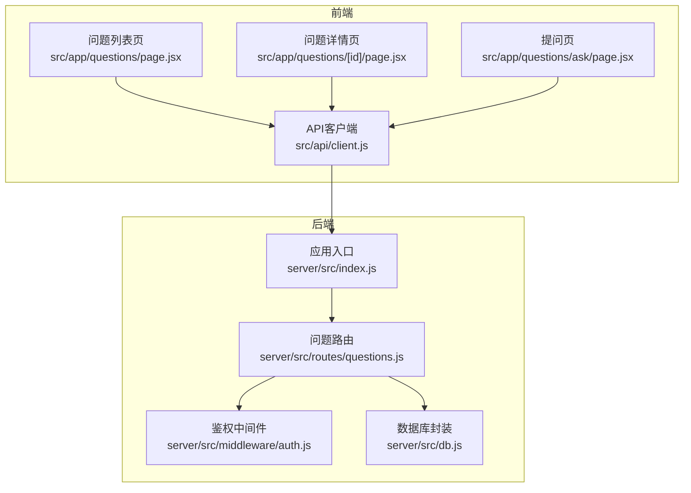
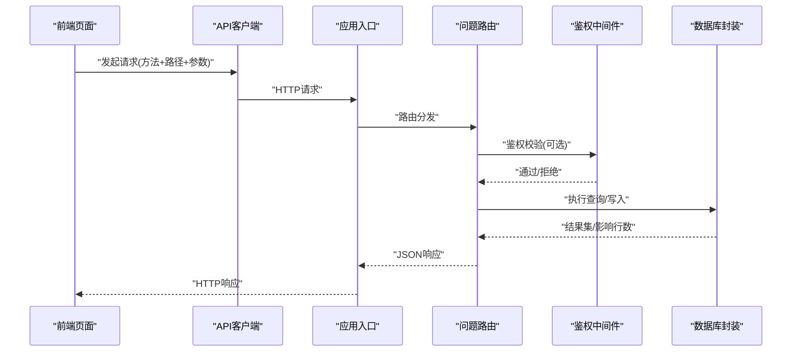
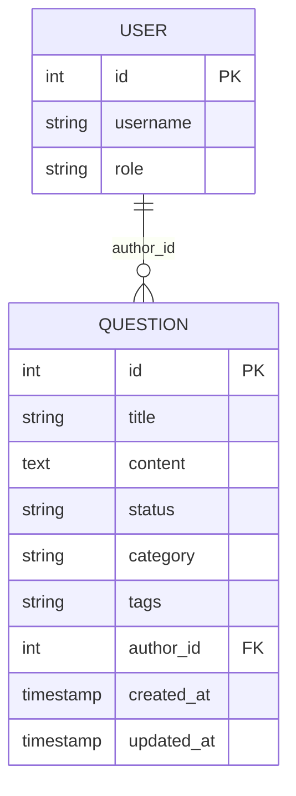
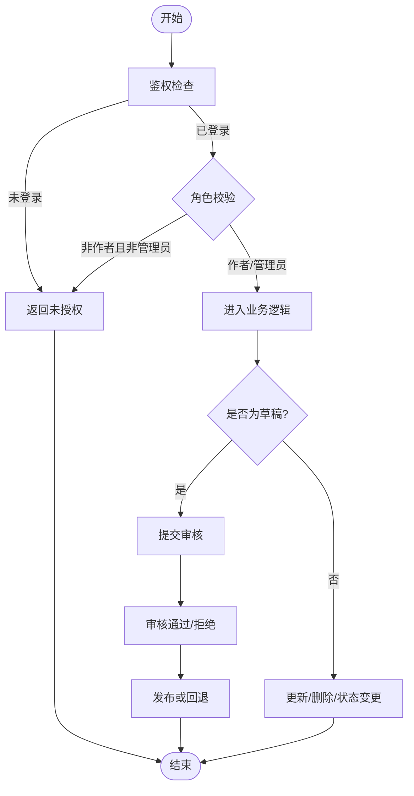
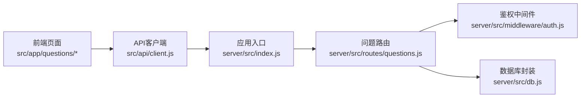

# 问题管理接口

<cite>
**本文引用的文件**   
- [server/src/routes/questions.js](file://server/src/routes/questions.js)
- [server/src/middleware/auth.js](file://server/src/middleware/auth.js)
- [server/src/db.js](file://server/src/db.js)
- [server/src/index.js](file://server/src/index.js)
- [src/app/questions/page.jsx](file://src/app/questions/page.jsx)
- [src/app/questions/[id]/page.jsx](file://src/app/questions/[id]/page.jsx)
- [src/app/questions/ask/page.jsx](file://src/app/questions/ask/page.jsx)
- [src/api/client.js](file://src/api/client.js)
</cite>

## 目录
1. [简介](#简介)
2. [项目结构](#项目结构)
3. [核心组件](#核心组件)
4. [架构总览](#架构总览)
5. [详细组件分析](#详细组件分析)
6. [依赖分析](#依赖分析)
7. [性能考虑](#性能考虑)
8. [故障排查指南](#故障排查指南)
9. [结论](#结论)
10. [附录](#附录)

## 简介
本文件面向“问题管理”相关的前后端接口，覆盖问题的发布、编辑、删除等CRUD操作；问题列表获取、分页查询、筛选排序等查询能力；问题详情查看、状态管理、分类标签等核心功能；以及权限控制、审核流程、草稿保存等业务逻辑。文档同时提供数据模型定义与接口调用示例，并包含错误处理与异常情况的处理方式说明。

## 项目结构
问题管理相关的后端路由位于 server/src/routes/questions.js，鉴权中间件位于 server/src/middleware/auth.js，数据库访问封装在 server/src/db.js，应用入口在 server/src/index.js。前端页面与客户端请求分别位于 src/app/questions/* 与 src/api/client.js。

图表来源
- [server/src/index.js](file://server/src/index.js)
- [server/src/routes/questions.js](file://server/src/routes/questions.js)
- [server/src/middleware/auth.js](file://server/src/middleware/auth.js)
- [server/src/db.js](file://server/src/db.js)
- [src/app/questions/page.jsx](file://src/app/questions/page.jsx)
- [src/app/questions/[id]/page.jsx](file://src/app/questions/[id]/page.jsx)
- [src/app/questions/ask/page.jsx](file://src/app/questions/ask/page.jsx)
- [src/api/client.js](file://src/api/client.js)

章节来源
- [server/src/index.js](file://server/src/index.js)
- [server/src/routes/questions.js](file://server/src/routes/questions.js)
- [server/src/middleware/auth.js](file://server/src/middleware/auth.js)
- [server/src/db.js](file://server/src/db.js)
- [src/app/questions/page.jsx](file://src/app/questions/page.jsx)
- [src/app/questions/[id]/page.jsx](file://src/app/questions/[id]/page.jsx)
- [src/app/questions/ask/page.jsx](file://src/app/questions/ask/page.jsx)
- [src/api/client.js](file://src/api/client.js)

## 核心组件
- 问题路由模块：集中实现问题相关的REST接口，包括列表、详情、创建、更新、删除、状态变更、标签管理等。
- 鉴权中间件：校验登录态与角色（如管理员），用于受保护接口的访问控制。
- 数据库封装：统一数据库连接与查询执行，供路由层调用。
- 前端页面与客户端：负责发起请求、渲染列表/详情、提交表单与草稿。

章节来源
- [server/src/routes/questions.js](file://server/src/routes/questions.js)
- [server/src/middleware/auth.js](file://server/src/middleware/auth.js)
- [server/src/db.js](file://server/src/db.js)
- [src/api/client.js](file://src/api/client.js)

## 架构总览
整体采用前后端分离的REST风格：前端通过统一的API客户端向后端发起HTTP请求，后端路由根据路径与方法分派到具体处理器，处理器经鉴权中间件校验后访问数据库完成业务逻辑，最终返回JSON响应。

图表来源
- [server/src/index.js](file://server/src/index.js)
- [server/src/routes/questions.js](file://server/src/routes/questions.js)
- [server/src/middleware/auth.js](file://server/src/middleware/auth.js)
- [server/src/db.js](file://server/src/db.js)

## 详细组件分析

### 数据模型
以下字段为问题实体的典型结构，实际以数据库表为准。

图表来源
- [server/src/db.js](file://server/src/db.js)

章节来源
- [server/src/db.js](file://server/src/db.js)

### 接口清单与行为说明
以下为问题管理的核心接口集合与行为约定。所有接口均返回标准JSON响应体，包含数据与状态码由HTTP层决定。

- 获取问题列表
  - 方法: GET
  - 路径: /api/questions
  - 查询参数: page, pageSize, keyword, category, tag, status, sortBy, sortOrder
  - 行为: 支持分页、关键词模糊匹配、按分类/标签/状态筛选、按指定字段排序
  - 权限: 公开
  - 成功响应: 包含问题数组、总数、当前页、每页大小
  - 失败响应: 参数非法或查询异常时返回相应错误信息

- 获取问题详情
  - 方法: GET
  - 路径: /api/questions/:id
  - 路径参数: id
  - 行为: 返回单条问题详情，含作者信息与标签解析
  - 权限: 公开
  - 失败响应: 不存在或读取异常

- 创建问题（发布）
  - 方法: POST
  - 路径: /api/questions
  - 请求体: 标题、内容、分类、标签、状态等
  - 行为: 校验必填字段、生成时间戳、落库
  - 权限: 需登录
  - 成功响应: 返回新建问题对象
  - 失败响应: 校验失败或写入异常

- 更新问题（编辑）
  - 方法: PUT
  - 路径: /api/questions/:id
  - 请求体: 可更新的字段
  - 行为: 校验、更新、记录更新时间
  - 权限: 作者或管理员
  - 失败响应: 无权限、不存在或更新异常

- 删除问题
  - 方法: DELETE
  - 路径: /api/questions/:id
  - 行为: 软删除或硬删除（依实现）
  - 权限: 作者或管理员
  - 失败响应: 无权限、不存在或删除异常

- 修改问题状态
  - 方法: PATCH
  - 路径: /api/questions/:id/status
  - 请求体: 目标状态
  - 行为: 状态机校验（如待审核/已解决/已关闭）
  - 权限: 作者或管理员
  - 失败响应: 状态不合法或更新异常

- 管理标签
  - 方法: PATCH
  - 路径: /api/questions/:id/tags
  - 请求体: 标签数组
  - 行为: 替换或追加标签（依实现）
  - 权限: 作者或管理员
  - 失败响应: 标签格式错误或更新异常

- 保存草稿
  - 方法: POST
  - 路径: /api/questions/drafts
  - 请求体: 标题、内容、分类、标签、状态=草稿
  - 行为: 幂等保存，支持后续继续编辑
  - 权限: 需登录
  - 成功响应: 返回草稿ID
  - 失败响应: 保存异常

- 获取草稿
  - 方法: GET
  - 路径: /api/questions/drafts/:id
  - 行为: 仅作者本人可获取
  - 权限: 作者或管理员
  - 失败响应: 无权限或不存在

- 删除草稿
  - 方法: DELETE
  - 路径: /api/questions/drafts/:id
  - 权限: 作者或管理员
  - 失败响应: 无权限或不存在

- 获取我的草稿列表
  - 方法: GET
  - 路径: /api/questions/drafts
  - 查询参数: page, pageSize
  - 权限: 需登录
  - 成功响应: 草稿列表与分页信息

注意：以上接口路径与方法以实际路由实现为准。若存在差异，请以路由文件中的注册为准。

章节来源
- [server/src/routes/questions.js](file://server/src/routes/questions.js)

### 权限控制与审核流程
- 鉴权中间件
  - 作用: 校验请求是否携带有效会话/令牌，解析用户身份与角色
  - 使用位置: 对需要登录或特定角色的接口进行保护
  - 失败处理: 未登录或令牌无效时直接返回401/403

- 角色与资源权限
  - 普通用户: 可创建、编辑自己的问题，查看公开问题
  - 作者: 仅能管理自己创建的问题
  - 管理员: 可管理所有问题，包括状态变更与删除

- 审核流程
  - 默认状态: 草稿或待审核
  - 流转规则: 草稿 -> 待审核 -> 已发布/已解决/已关闭
  - 触发点: 发布、状态变更接口
  - 约束: 非作者或非管理员不得越权变更

图表来源
- [server/src/middleware/auth.js](file://server/src/middleware/auth.js)
- [server/src/routes/questions.js](file://server/src/routes/questions.js)

章节来源
- [server/src/middleware/auth.js](file://server/src/middleware/auth.js)
- [server/src/routes/questions.js](file://server/src/routes/questions.js)

### 分页、筛选与排序
- 分页
  - 参数: page（默认1）、pageSize（默认20）
  - 响应: 包含 items、total、page、pageSize
- 筛选
  - 关键词: 标题/内容模糊匹配
  - 分类: 精确匹配
  - 标签: 多标签任一匹配
  - 状态: 精确匹配
- 排序
  - 字段: 创建时间、更新时间、热度（如有）
  - 方向: asc/desc

章节来源
- [server/src/routes/questions.js](file://server/src/routes/questions.js)

### 错误处理与异常
- 通用错误响应
  - 400: 参数校验失败
  - 401: 未登录或令牌无效
  - 403: 无权限
  - 404: 资源不存在
  - 500: 服务器内部错误
- 常见异常场景
  - 并发更新冲突：重试或提示刷新
  - 数据库不可用：降级与告警
  - 输入超长或非法字符：前端与后端双重校验

章节来源
- [server/src/routes/questions.js](file://server/src/routes/questions.js)

### 前端集成要点
- 列表页
  - 加载策略: 首屏拉取第一页，滚动加载更多
  - 搜索与筛选: 防抖触发查询
- 详情页
  - 懒加载: 按需加载评论与关联问题
- 提问页
  - 草稿自动保存: 定时轮询或失焦保存
  - 富文本/Markdown: 实时预览与校验

章节来源
- [src/app/questions/page.jsx](file://src/app/questions/page.jsx)
- [src/app/questions/[id]/page.jsx](file://src/app/questions/[id]/page.jsx)
- [src/app/questions/ask/page.jsx](file://src/app/questions/ask/page.jsx)
- [src/api/client.js](file://src/api/client.js)

## 依赖分析
- 路由层依赖鉴权中间件与数据库封装
- 前端页面依赖API客户端进行网络请求
- 应用入口负责挂载路由与中间件

图表来源
- [server/src/index.js](file://server/src/index.js)
- [server/src/routes/questions.js](file://server/src/routes/questions.js)
- [server/src/middleware/auth.js](file://server/src/middleware/auth.js)
- [server/src/db.js](file://server/src/db.js)
- [src/app/questions/page.jsx](file://src/app/questions/page.jsx)
- [src/app/questions/[id]/page.jsx](file://src/app/questions/[id]/page.jsx)
- [src/app/questions/ask/page.jsx](file://src/app/questions/ask/page.jsx)
- [src/api/client.js](file://src/api/client.js)

章节来源
- [server/src/index.js](file://server/src/index.js)
- [server/src/routes/questions.js](file://server/src/routes/questions.js)
- [server/src/middleware/auth.js](file://server/src/middleware/auth.js)
- [server/src/db.js](file://server/src/db.js)
- [src/app/questions/page.jsx](file://src/app/questions/page.jsx)
- [src/app/questions/[id]/page.jsx](file://src/app/questions/[id]/page.jsx)
- [src/app/questions/ask/page.jsx](file://src/app/questions/ask/page.jsx)
- [src/api/client.js](file://src/api/client.js)

## 性能考虑
- 数据库层面
  - 为常用查询字段建立索引（如状态、分类、作者ID、创建时间）
  - 分页查询避免深分页，必要时使用游标式分页
- 缓存策略
  - 热点列表与详情可引入短期缓存
  - 标签与分类字典缓存
- 传输优化
  - 压缩响应体
  - 按需加载详情扩展字段

[本节为通用建议，无需代码来源]

## 故障排查指南
- 常见问题定位
  - 401/403: 检查鉴权中间件配置与会话/令牌传递
  - 404: 确认路由注册与路径参数正确性
  - 500: 查看数据库连接与SQL执行日志
- 调试手段
  - 开启详细日志输出
  - 使用浏览器开发者工具检查请求/响应
  - 使用测试脚本模拟边界条件

章节来源
- [server/src/middleware/auth.js](file://server/src/middleware/auth.js)
- [server/src/routes/questions.js](file://server/src/routes/questions.js)
- [server/src/db.js](file://server/src/db.js)

## 结论
本文档系统化梳理了问题管理相关接口的职责、数据模型、权限与审核流程、分页筛选排序、错误处理与前端集成要点。建议在实施中严格遵循鉴权与状态机约束，完善索引与缓存策略，提升系统稳定性与性能。

[本节为总结性内容，无需代码来源]

## 附录

### 接口调用示例（概念性）
- 获取问题列表
  - 请求: GET /api/questions?page=1&pageSize=20&keyword=xxx&category=技术&status=已解决&sortBy=created_at&sortOrder=desc
  - 响应: { items: [...], total: N, page: 1, pageSize: 20 }
- 创建问题
  - 请求: POST /api/questions
  - 请求体: { title, content, category, tags, status }
  - 响应: { id, ... }
- 更新问题
  - 请求: PUT /api/questions/:id
  - 请求体: { title?, content?, category?, tags?, status? }
  - 响应: { id, ... }
- 删除问题
  - 请求: DELETE /api/questions/:id
  - 响应: { success: true }
- 修改状态
  - 请求: PATCH /api/questions/:id/status
  - 请求体: { status }
  - 响应: { id, status }
- 管理标签
  - 请求: PATCH /api/questions/:id/tags
  - 请求体: { tags: ["a","b"] }
  - 响应: { id, tags }
- 保存草稿
  - 请求: POST /api/questions/drafts
  - 请求体: { title, content, category, tags, status:"草稿" }
  - 响应: { id }
- 获取草稿
  - 请求: GET /api/questions/drafts/:id
  - 响应: { id, ... }
- 删除草稿
  - 请求: DELETE /api/questions/drafts/:id
  - 响应: { success: true }
- 我的草稿列表
  - 请求: GET /api/questions/drafts?page=1&pageSize=20
  - 响应: { items: [...], total, page, pageSize }

[本节为概念性示例，便于理解接口用法，无需代码来源]