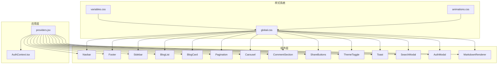
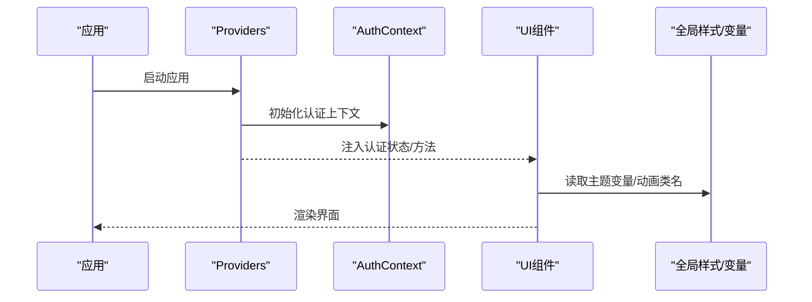
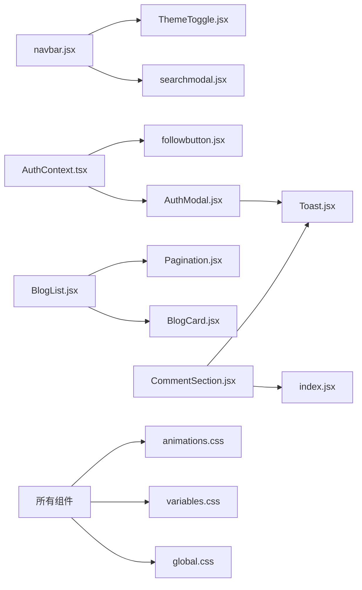

# UI组件库

<cite>
**本文引用的文件**   
- [src/components/AuthModal/AuthModal.jsx](file://src/components/AuthModal/AuthModal.jsx)
- [src/components/AuthModal/AuthModal.module.css](file://src/components/AuthModal/AuthModal.module.css)
- [src/components/BlogCard/BlogCard.jsx](file://src/components/BlogCard/BlogCard.jsx)
- [src/components/BlogCard/BlogCard.module.css](file://src/components/BlogCard/BlogCard.module.css)
- [src/components/BlogList/BlogList.jsx](file://src/components/BlogList/BlogList.jsx)
- [src/components/BlogList/BlogList.module.css](file://src/components/BlogList/BlogList.module.css)
- [src/components/Carousel/Carousel.jsx](file://src/components/Carousel/Carousel.jsx)
- [src/components/Carousel/Carousel.module.css](file://src/components/Carousel/Carousel.module.css)
- [src/components/CommentSection/CommentSection.jsx](file://src/components/CommentSection/CommentSection.jsx)
- [src/components/CommentSection/CommentSection.module.css](file://src/components/CommentSection/CommentSection.module.css)
- [src/components/FollowButton/followbutton.jsx](file://src/components/FollowButton/followbutton.jsx)
- [src/components/FollowButton/FollowButton.module.css](file://src/components/FollowButton/FollowButton.module.css)
- [src/components/Footer/Footer.jsx](file://src/components/Footer/Footer.jsx)
- [src/components/Footer/Footer.module.css](file://src/components/Footer/Footer.module.css)
- [src/components/MarkdownRenderer/index.jsx](file://src/components/MarkdownRenderer/index.jsx)
- [src/components/Navbar/navbar.jsx](file://src/components/Navbar/navbar.jsx)
- [src/components/Navbar/Navbar.module.css](file://src/components/Navbar/Navbar.module.css)
- [src/components/Pagination/Pagination.jsx](file://src/components/Pagination/Pagination.jsx)
- [src/components/Pagination/Pagination.module.css](file://src/components/Pagination/Pagination.module.css)
- [src/components/SearchModal/searchmodal.jsx](file://src/components/SearchModal/searchmodal.jsx)
- [src/components/SearchModal/SearchModal.module.css](file://src/components/SearchModal/SearchModal.module.css)
- [src/components/ShareButtons/ShareButtons.jsx](file://src/components/ShareButtons/ShareButtons.jsx)
- [src/components/ShareButtons/ShareButtons.module.css](file://src/components/ShareButtons/ShareButtons.module.css)
- [src/components/Sidebar/Sidebar.jsx](file://src/components/Sidebar/Sidebar.jsx)
- [src/components/Sidebar/Sidebar.module.css](file://src/components/Sidebar/Sidebar.module.css)
- [src/components/ThemeToggle/ThemeToggle.jsx](file://src/components/ThemeToggle/ThemeToggle.jsx)
- [src/components/ThemeToggle/ThemeToggle.module.css](file://src/components/ThemeToggle/ThemeToggle.module.css)
- [src/components/Toast/Toast.jsx](file://src/components/Toast/Toast.jsx)
- [src/components/Toast/Toast.module.css](file://src/components/Toast/Toast.module.css)
- [src/styles/global.css](file://src/styles/global.css)
- [src/styles/variables.css](file://src/styles/variables.css)
- [src/styles/animations.css](file://src/styles/animations.css)
- [src/app/providers.jsx](file://src/app/providers.jsx)
- [src/context/AuthContext.tsx](file://src/context/AuthContext.tsx)
</cite>

## 目录
1. [简介](#简介)
2. [项目结构](#项目结构)
3. [核心组件](#核心组件)
4. [架构总览](#架构总览)
5. [详细组件分析](#详细组件分析)
6. [依赖关系分析](#依赖关系分析)
7. [性能考虑](#性能考虑)
8. [故障排查指南](#故障排查指南)
9. [结论](#结论)
10. [附录](#附录)

## 简介
本文件为项目的UI组件库文档，聚焦于 src/components 下的可复用React组件。内容涵盖：
- 设计原则与使用规范
- 每个组件的功能特性、属性配置、事件处理、样式定制
- 响应式设计与主题支持
- 组合模式与嵌套关系
- 性能优化策略（懒加载、虚拟滚动等）
- 测试指南与调试技巧
- 贡献规范与最佳实践

## 项目结构
组件采用“按功能域分目录”的组织方式，每个组件包含JSX实现与同名CSS模块样式文件，便于局部样式隔离与按需引入。全局样式与变量位于 src/styles，应用级上下文与提供者位于 src/app 与 src/context。

图表来源
- [src/app/providers.jsx](file://src/app/providers.jsx)
- [src/context/AuthContext.tsx](file://src/context/AuthContext.tsx)
- [src/styles/global.css](file://src/styles/global.css)
- [src/styles/variables.css](file://src/styles/variables.css)
- [src/styles/animations.css](file://src/styles/animations.css)
- [src/components/Navbar/navbar.jsx](file://src/components/Navbar/navbar.jsx)
- [src/components/Footer/Footer.jsx](file://src/components/Footer/Footer.jsx)
- [src/components/Sidebar/Sidebar.jsx](file://src/components/Sidebar/Sidebar.jsx)
- [src/components/BlogList/BlogList.jsx](file://src/components/BlogList/BlogList.jsx)
- [src/components/BlogCard/BlogCard.jsx](file://src/components/BlogCard/BlogCard.jsx)
- [src/components/Pagination/Pagination.jsx](file://src/components/Pagination/Pagination.jsx)
- [src/components/Carousel/Carousel.jsx](file://src/components/Carousel/Carousel.jsx)
- [src/components/CommentSection/CommentSection.jsx](file://src/components/CommentSection/CommentSection.jsx)
- [src/components/ShareButtons/ShareButtons.jsx](file://src/components/ShareButtons/ShareButtons.jsx)
- [src/components/ThemeToggle/ThemeToggle.jsx](file://src/components/ThemeToggle/ThemeToggle.jsx)
- [src/components/Toast/Toast.jsx](file://src/components/Toast/Toast.jsx)
- [src/components/SearchModal/searchmodal.jsx](file://src/components/SearchModal/searchmodal.jsx)
- [src/components/AuthModal/AuthModal.jsx](file://src/components/AuthModal/AuthModal.jsx)
- [src/components/MarkdownRenderer/index.jsx](file://src/components/MarkdownRenderer/index.jsx)

章节来源
- [src/app/providers.jsx](file://src/app/providers.jsx)
- [src/context/AuthContext.tsx](file://src/context/AuthContext.tsx)
- [src/styles/global.css](file://src/styles/global.css)
- [src/styles/variables.css](file://src/styles/variables.css)
- [src/styles/animations.css](file://src/styles/animations.css)

## 核心组件
本节概述各组件的职责边界与协作关系，后续章节将逐一展开。

- 导航与布局
  - Navbar：顶部导航，提供路由跳转、搜索入口、主题切换入口等
  - Footer：底部信息展示
  - Sidebar：侧边栏，用于分类、标签或辅助导航
- 内容与交互
  - BlogList：文章列表容器，负责分页、筛选、数据聚合
  - BlogCard：单篇文章卡片，展示标题、摘要、作者、时间等
  - Carousel：轮播图，支持自动播放、指示器、手势滑动
  - CommentSection：评论区域，支持评论列表、提交评论、点赞等
  - ShareButtons：分享按钮组，支持多平台分享链接生成
  - MarkdownRenderer：Markdown渲染器，将文本转换为HTML并注入页面
- 状态与反馈
  - ThemeToggle：主题切换开关，驱动明暗主题
  - Toast：轻量提示消息，支持成功/错误/警告等类型
  - SearchModal：全局搜索弹窗，支持关键词输入与结果预览
  - AuthModal：认证弹窗，登录/注册流程
  - FollowButton：关注/取消关注按钮，与用户状态联动
- 通用控件
  - Pagination：分页控件，支持页码、跳转、每页条数设置

章节来源
- [src/components/Navbar/navbar.jsx](file://src/components/Navbar/navbar.jsx)
- [src/components/Footer/Footer.jsx](file://src/components/Footer/Footer.jsx)
- [src/components/Sidebar/Sidebar.jsx](file://src/components/Sidebar/Sidebar.jsx)
- [src/components/BlogList/BlogList.jsx](file://src/components/BlogList/BlogList.jsx)
- [src/components/BlogCard/BlogCard.jsx](file://src/components/BlogCard/BlogCard.jsx)
- [src/components/Carousel/Carousel.jsx](file://src/components/Carousel/Carousel.jsx)
- [src/components/CommentSection/CommentSection.jsx](file://src/components/CommentSection/CommentSection.jsx)
- [src/components/ShareButtons/ShareButtons.jsx](file://src/components/ShareButtons/ShareButtons.jsx)
- [src/components/ThemeToggle/ThemeToggle.jsx](file://src/components/ThemeToggle/ThemeToggle.jsx)
- [src/components/Toast/Toast.jsx](file://src/components/Toast/Toast.jsx)
- [src/components/SearchModal/searchmodal.jsx](file://src/components/SearchModal/searchmodal.jsx)
- [src/components/AuthModal/AuthModal.jsx](file://src/components/AuthModal/AuthModal.jsx)
- [src/components/FollowButton/followbutton.jsx](file://src/components/FollowButton/followbutton.jsx)
- [src/components/Pagination/Pagination.jsx](file://src/components/Pagination/Pagination.jsx)
- [src/components/MarkdownRenderer/index.jsx](file://src/components/MarkdownRenderer/index.jsx)

## 架构总览
组件通过应用级Provider进行上下文注入（如认证状态），并通过CSS变量与动画样式实现主题与动效统一。

图表来源
- [src/app/providers.jsx](file://src/app/providers.jsx)
- [src/context/AuthContext.tsx](file://src/context/AuthContext.tsx)
- [src/styles/global.css](file://src/styles/global.css)
- [src/styles/variables.css](file://src/styles/variables.css)
- [src/styles/animations.css](file://src/styles/animations.css)

## 详细组件分析

### 认证弹窗 AuthModal
- 功能特性
  - 登录/注册表单切换
  - 表单校验与错误提示
  - 与认证上下文集成，完成登录后状态更新
- 属性配置
  - visible：控制弹窗显示/隐藏
  - onClose：关闭回调
  - onLogin/onRegister：登录/注册成功回调
- 事件处理
  - 表单提交触发登录/注册流程
  - 外部点击遮罩关闭
- 样式定制
  - 使用CSS模块隔离样式
  - 可通过覆盖CSS变量调整尺寸与配色
- 示例用法
  - 在页面中引入并绑定visible与onClose
  - 在onLogin/onRegister中刷新用户状态或跳转
- 响应式与主题
  - 基于CSS变量适配明暗主题
  - 移动端全屏/半屏弹窗自适应
- 组合与嵌套
  - 可与Toast配合显示操作结果
- 性能优化
  - 仅在需要时挂载DOM，避免常驻渲染
- 测试与调试
  - 模拟表单输入与提交，断言回调是否触发
  - 检查遮罩点击关闭行为
- 贡献规范
  - 新增字段需同步更新props校验与样式变量
  - 保持无障碍语义（aria-*）

章节来源
- [src/components/AuthModal/AuthModal.jsx](file://src/components/AuthModal/AuthModal.jsx)
- [src/components/AuthModal/AuthModal.module.css](file://src/components/AuthModal/AuthModal.module.css)
- [src/context/AuthContext.tsx](file://src/context/AuthContext.tsx)

### 博客卡片 BlogCard
- 功能特性
  - 展示文章封面、标题、摘要、作者、发布时间
  - 支持点击跳转详情
- 属性配置
  - post：文章数据对象
  - onClick：点击回调
  - variant：可选的视觉变体（如紧凑/标准）
- 事件处理
  - 点击卡片触发导航或回调
- 样式定制
  - 通过CSS模块与变量控制排版与间距
- 示例用法
  - 在列表项中传入post数据
- 响应式与主题
  - 图片与文字在多端自适应
  - 跟随主题切换颜色
- 组合与嵌套
  - 常与BlogList组合使用
- 性能优化
  - 仅渲染必要字段，避免深层嵌套
- 测试与调试
  - 验证点击事件与渲染字段
- 贡献规范
  - 新增字段需同步更新样式与占位逻辑

章节来源
- [src/components/BlogCard/BlogCard.jsx](file://src/components/BlogCard/BlogCard.jsx)
- [src/components/BlogCard/BlogCard.module.css](file://src/components/BlogCard/BlogCard.module.css)

### 博客列表 BlogList
- 功能特性
  - 聚合文章数据，渲染BlogCard列表
  - 内置或对接分页控件
- 属性配置
  - posts：文章数组
  - loading：加载态
  - error：错误态
  - onPageChange：分页回调
- 事件处理
  - 分页切换、筛选条件变更
- 样式定制
  - 网格/列表布局切换
- 示例用法
  - 从API获取数据后传入posts
- 响应式与主题
  - 列数随屏幕宽度变化
  - 主题色一致
- 组合与嵌套
  - 内部使用BlogCard与Pagination
- 性能优化
  - 大数据量建议结合虚拟滚动（见“性能考虑”）
- 测试与调试
  - 断言空态/加载态/错误态渲染
- 贡献规范
  - 保持数据契约稳定，新增字段向后兼容

章节来源
- [src/components/BlogList/BlogList.jsx](file://src/components/BlogList/BlogList.jsx)
- [src/components/BlogList/BlogList.module.css](file://src/components/BlogList/BlogList.module.css)
- [src/components/Pagination/Pagination.jsx](file://src/components/Pagination/Pagination.jsx)

### 轮播图 Carousel
- 功能特性
  - 自动播放、手动切换、指示器
  - 支持触摸滑动
- 属性配置
  - slides：幻灯片数据
  - autoplay：是否自动播放
  - interval：切换间隔
  - onChange：切换回调
- 事件处理
  - 点击指示器、前后箭头、滑动
- 样式定制
  - 高度、圆角、过渡动画
- 示例用法
  - 传入图片/内容数组
- 响应式与主题
  - 高度自适应，主题色适配
- 组合与嵌套
  - 可与HeroCarousel组合（若存在）
- 性能优化
  - 预加载相邻幻灯片，减少闪烁
- 测试与调试
  - 断言自动播放与切换回调
- 贡献规范
  - 确保无障碍键盘导航

章节来源
- [src/components/Carousel/Carousel.jsx](file://src/components/Carousel/Carousel.jsx)
- [src/components/Carousel/Carousel.module.css](file://src/components/Carousel/Carousel.module.css)

### 评论区 CommentSection
- 功能特性
  - 评论列表展示、分页加载
  - 发表评论、点赞、回复
- 属性配置
  - comments：评论数据
  - postId：关联文章ID
  - onAddComment：新增评论回调
  - onLike：点赞回调
- 事件处理
  - 提交评论、点赞、翻页
- 样式定制
  - 头像、气泡、间距
- 示例用法
  - 与文章详情页组合
- 响应式与主题
  - 移动端折叠长评论
  - 主题适配
- 组合与嵌套
  - 内部可能使用MarkdownRenderer渲染评论正文
- 性能优化
  - 长列表分页+虚拟滚动
- 测试与调试
  - 断言提交成功后列表更新
- 贡献规范
  - 敏感词过滤与XSS防护

章节来源
- [src/components/CommentSection/CommentSection.jsx](file://src/components/CommentSection/CommentSection.jsx)
- [src/components/CommentSection/CommentSection.module.css](file://src/components/CommentSection/CommentSection.module.css)
- [src/components/MarkdownRenderer/index.jsx](file://src/components/MarkdownRenderer/index.jsx)

### 分享按钮 ShareButtons
- 功能特性
  - 生成多平台分享链接
- 属性配置
  - url：分享链接
  - title：分享标题
  - description：分享描述
  - onShare：自定义分享回调
- 事件处理
  - 点击各平台图标
- 样式定制
  - 图标与间距
- 示例用法
  - 在文章详情页底部展示
- 响应式与主题
  - 图标大小与颜色跟随主题
- 组合与嵌套
  - 无复杂嵌套
- 性能优化
  - 静态计算分享URL，避免重复计算
- 测试与调试
  - 断言链接格式正确
- 贡献规范
  - 新增平台需遵循安全协议

章节来源
- [src/components/ShareButtons/ShareButtons.jsx](file://src/components/ShareButtons/ShareButtons.jsx)
- [src/components/ShareButtons/ShareButtons.module.css](file://src/components/ShareButtons/ShareButtons.module.css)

### 主题切换 ThemeToggle
- 功能特性
  - 切换明暗主题，持久化到本地存储
- 属性配置
  - theme：当前主题（受控模式可选）
  - onChange：主题变更回调
- 事件处理
  - 点击切换
- 样式定制
  - 图标与位置
- 示例用法
  - 置于导航栏右侧
- 响应式与主题
  - 图标在不同主题下对比度良好
- 组合与嵌套
  - 与全局CSS变量联动
- 性能优化
  - 最小重绘，避免整页闪烁
- 测试与调试
  - 断言本地存储与根节点class
- 贡献规范
  - 新增主题需更新变量与默认值

章节来源
- [src/components/ThemeToggle/ThemeToggle.jsx](file://src/components/ThemeToggle/ThemeToggle.jsx)
- [src/components/ThemeToggle/ThemeToggle.module.css](file://src/components/ThemeToggle/ThemeToggle.module.css)
- [src/styles/variables.css](file://src/styles/variables.css)

### 提示消息 Toast
- 功能特性
  - 轻量提示，支持成功/错误/警告/信息
- 属性配置
  - message：提示文案
  - type：类型
  - duration：显示时长
  - onClose：关闭回调
- 事件处理
  - 自动消失、手动关闭
- 样式定制
  - 位置、圆角、阴影
- 示例用法
  - 在操作成功后调用显示
- 响应式与主题
  - 移动端固定底部
  - 主题适配
- 组合与嵌套
  - 常与AuthModal、FollowButton等组合
- 性能优化
  - 使用Portal渲染，避免层级问题
- 测试与调试
  - 断言出现/消失时机
- 贡献规范
  - 限制同时显示数量，避免遮挡

章节来源
- [src/components/Toast/Toast.jsx](file://src/components/Toast/Toast.jsx)
- [src/components/Toast/Toast.module.css](file://src/components/Toast/Toast.module.css)

### 搜索弹窗 SearchModal
- 功能特性
  - 全局搜索入口，支持关键词输入与结果预览
- 属性配置
  - visible：显示控制
  - onClose：关闭回调
  - onSearch：搜索回调
- 事件处理
  - 回车搜索、ESC关闭
- 样式定制
  - 居中弹窗、结果列表样式
- 示例用法
  - 在Navbar中打开
- 响应式与主题
  - 移动端全屏
  - 主题适配
- 组合与嵌套
  - 可返回搜索结果给上层组件
- 性能优化
  - 防抖搜索请求
- 测试与调试
  - 断言输入与回调参数
- 贡献规范
  - 注意输入清洗与长度限制

章节来源
- [src/components/SearchModal/searchmodal.jsx](file://src/components/SearchModal/searchmodal.jsx)
- [src/components/SearchModal/SearchModal.module.css](file://src/components/SearchModal/SearchModal.module.css)

### 认证弹窗 AuthModal（补充）
- 与认证上下文集成
  - 登录成功后更新用户状态
  - 失败时显示错误提示
- 示例用法
  - 在Navbar未登录状态下显示
- 测试与调试
  - 模拟网络失败场景

章节来源
- [src/components/AuthModal/AuthModal.jsx](file://src/components/AuthModal/AuthModal.jsx)
- [src/context/AuthContext.tsx](file://src/context/AuthContext.tsx)

### 关注按钮 FollowButton
- 功能特性
  - 关注/取消关注目标用户或专栏
- 属性配置
  - targetId：目标ID
  - following：是否已关注
  - onToggle：状态切换回调
- 事件处理
  - 点击切换状态
- 样式定制
  - 主/次按钮风格
- 示例用法
  - 在用户主页或文章作者信息处
- 响应式与主题
  - 小屏紧凑布局
- 组合与嵌套
  - 与AuthModal联动（未登录引导登录）
- 性能优化
  - 乐观更新，失败回滚
- 测试与调试
  - 断言状态切换与回调
- 贡献规范
  - 幂等性保证

章节来源
- [src/components/FollowButton/followbutton.jsx](file://src/components/FollowButton/followbutton.jsx)
- [src/components/FollowButton/FollowButton.module.css](file://src/components/FollowButton/FollowButton.module.css)

### 分页 Pagination
- 功能特性
  - 页码、跳转、每页条数
- 属性配置
  - total：总数
  - pageSize：每页条数
  - current：当前页
  - onChange：页码变更回调
- 事件处理
  - 点击页码、改变pageSize
- 样式定制
  - 紧凑/宽松布局
- 示例用法
  - 与BlogList组合
- 响应式与主题
  - 小屏隐藏部分页码
- 组合与嵌套
  - 被列表组件消费
- 性能优化
  - 大总数时使用智能页码范围
- 测试与调试
  - 断言边界页行为
- 贡献规范
  - 保持数值合法性校验

章节来源
- [src/components/Pagination/Pagination.jsx](file://src/components/Pagination/Pagination.jsx)
- [src/components/Pagination/Pagination.module.css](file://src/components/Pagination/Pagination.module.css)

### Markdown渲染器 MarkdownRenderer
- 功能特性
  - 将Markdown文本渲染为HTML
- 属性配置
  - content：Markdown字符串
  - sanitize：是否清理不安全内容
- 事件处理
  - 无
- 样式定制
  - 通过全局样式控制排版
- 示例用法
  - 在文章详情与评论中使用
- 响应式与主题
  - 代码块、表格等适配主题
- 组合与嵌套
  - 被评论与文章详情消费
- 性能优化
  - 大文本分段渲染或懒加载
- 测试与调试
  - 断言输出HTML片段与安全策略
- 贡献规范
  - 严格白名单策略

章节来源
- [src/components/MarkdownRenderer/index.jsx](file://src/components/MarkdownRenderer/index.jsx)
- [src/styles/global.css](file://src/styles/global.css)

### 导航栏 Navbar
- 功能特性
  - 品牌Logo、主要导航、搜索入口、主题切换
- 属性配置
  - brand：品牌信息
  - links：导航链接
  - onSearchOpen：打开搜索弹窗
- 事件处理
  - 点击导航、打开搜索
- 样式定制
  - 吸顶、背景透明/不透明
- 示例用法
  - 作为应用壳组件
- 响应式与主题
  - 移动端汉堡菜单
  - 主题适配
- 组合与嵌套
  - 内嵌ThemeToggle、SearchModal
- 性能优化
  - 路由切换时最小化重排
- 测试与调试
  - 断言导航跳转与弹窗打开
- 贡献规范
  - 新增链接需符合权限控制

章节来源
- [src/components/Navbar/navbar.jsx](file://src/components/Navbar/navbar.jsx)
- [src/components/Navbar/Navbar.module.css](file://src/components/Navbar/Navbar.module.css)
- [src/components/SearchModal/searchmodal.jsx](file://src/components/SearchModal/searchmodal.jsx)
- [src/components/ThemeToggle/ThemeToggle.jsx](file://src/components/ThemeToggle/ThemeToggle.jsx)

### 底部 Footer
- 功能特性
  - 版权信息、快速链接、社交账号
- 属性配置
  - links：链接数组
  - copyright：版权文案
- 事件处理
  - 无
- 样式定制
  - 多列布局
- 示例用法
  - 应用壳底部
- 响应式与主题
  - 移动端堆叠布局
- 组合与嵌套
  - 无
- 性能优化
  - 静态渲染
- 测试与调试
  - 断言链接与文案
- 贡献规范
  - 链接安全性校验

章节来源
- [src/components/Footer/Footer.jsx](file://src/components/Footer/Footer.jsx)
- [src/components/Footer/Footer.module.css](file://src/components/Footer/Footer.module.css)

### 侧边栏 Sidebar
- 功能特性
  - 分类/标签/热门文章等辅助导航
- 属性配置
  - items：数据源
  - onSelect：选中回调
- 事件处理
  - 点击条目
- 样式定制
  - 宽度、分隔线
- 示例用法
  - 与主内容区并列
- 响应式与主题
  - 小屏收起或转为抽屉
- 组合与嵌套
  - 可嵌套子菜单
- 性能优化
  - 大数据量分页或懒加载
- 测试与调试
  - 断言选中态与回调
- 贡献规范
  - 数据结构稳定

章节来源
- [src/components/Sidebar/Sidebar.jsx](file://src/components/Sidebar/Sidebar.jsx)
- [src/components/Sidebar/Sidebar.module.css](file://src/components/Sidebar/Sidebar.module.css)

## 依赖关系分析
组件间通过上下文与事件回调解耦，样式通过CSS变量与模块隔离。

图表来源
- [src/context/AuthContext.tsx](file://src/context/AuthContext.tsx)
- [src/components/AuthModal/AuthModal.jsx](file://src/components/AuthModal/AuthModal.jsx)
- [src/components/FollowButton/followbutton.jsx](file://src/components/FollowButton/followbutton.jsx)
- [src/components/Navbar/navbar.jsx](file://src/components/Navbar/navbar.jsx)
- [src/components/SearchModal/searchmodal.jsx](file://src/components/SearchModal/searchmodal.jsx)
- [src/components/ThemeToggle/ThemeToggle.jsx](file://src/components/ThemeToggle/ThemeToggle.jsx)
- [src/components/BlogList/BlogList.jsx](file://src/components/BlogList/BlogList.jsx)
- [src/components/BlogCard/BlogCard.jsx](file://src/components/BlogCard/BlogCard.jsx)
- [src/components/Pagination/Pagination.jsx](file://src/components/Pagination/Pagination.jsx)
- [src/components/CommentSection/CommentSection.jsx](file://src/components/CommentSection/CommentSection.jsx)
- [src/components/MarkdownRenderer/index.jsx](file://src/components/MarkdownRenderer/index.jsx)
- [src/components/Toast/Toast.jsx](file://src/components/Toast/Toast.jsx)
- [src/styles/global.css](file://src/styles/global.css)
- [src/styles/variables.css](file://src/styles/variables.css)
- [src/styles/animations.css](file://src/styles/animations.css)

章节来源
- [src/context/AuthContext.tsx](file://src/context/AuthContext.tsx)
- [src/components/Navbar/navbar.jsx](file://src/components/Navbar/navbar.jsx)
- [src/components/BlogList/BlogList.jsx](file://src/components/BlogList/BlogList.jsx)
- [src/components/CommentSection/CommentSection.jsx](file://src/components/CommentSection/CommentSection.jsx)
- [src/styles/global.css](file://src/styles/global.css)
- [src/styles/variables.css](file://src/styles/variables.css)
- [src/styles/animations.css](file://src/styles/animations.css)

## 性能考虑
- 懒加载
  - 对非首屏组件（如评论、侧边栏）使用动态导入或IntersectionObserver触发加载
- 虚拟滚动
  - 对长列表（BlogList、CommentSection）采用虚拟滚动方案，仅渲染可视区域
- 图片优化
  - 使用懒加载与合适的尺寸，必要时启用WebP/AVIF
- 缓存与去抖
  - 搜索输入防抖；接口数据短期缓存
- 渲染优化
  - 合理拆分组件，避免不必要的重渲染；对纯展示组件使用记忆化
- 样式与动画
  - 优先使用transform/opacity等合成属性，减少重排重绘

[本节为通用指导，无需源码引用]

## 故障排查指南
- 主题不生效
  - 检查根节点class与CSS变量是否正确注入
  - 确认ThemeToggle与全局样式路径
- 弹窗无法关闭
  - 检查遮罩点击事件与可见性状态绑定
- 评论提交失败
  - 查看网络请求与错误分支，确认后端返回码
- 分享链接异常
  - 校验url/title/description参数编码
- 分页错乱
  - 核对total/pageSize/current三者一致性

章节来源
- [src/components/ThemeToggle/ThemeToggle.jsx](file://src/components/ThemeToggle/ThemeToggle.jsx)
- [src/components/AuthModal/AuthModal.jsx](file://src/components/AuthModal/AuthModal.jsx)
- [src/components/CommentSection/CommentSection.jsx](file://src/components/CommentSection/CommentSection.jsx)
- [src/components/ShareButtons/ShareButtons.jsx](file://src/components/ShareButtons/ShareButtons.jsx)
- [src/components/Pagination/Pagination.jsx](file://src/components/Pagination/Pagination.jsx)

## 结论
本组件库以清晰职责划分、模块化样式与上下文驱动的状态管理为基础，提供了博客站点所需的核心UI能力。通过统一的变量与动画体系，实现了良好的主题与响应式体验。建议在后续迭代中持续完善可访问性、测试覆盖率与性能指标。

[本节为总结，无需源码引用]

## 附录

### 使用示例（路径指引）
- 在页面中引入并使用BlogList与Pagination
  - 参考：[src/components/BlogList/BlogList.jsx](file://src/components/BlogList/BlogList.jsx)、[src/components/Pagination/Pagination.jsx](file://src/components/Pagination/Pagination.jsx)
- 在文章详情页嵌入评论与分享
  - 参考：[src/components/CommentSection/CommentSection.jsx](file://src/components/CommentSection/CommentSection.jsx)、[src/components/ShareButtons/ShareButtons.jsx](file://src/components/ShareButtons/ShareButtons.jsx)
- 在导航栏集成搜索与主题切换
  - 参考：[src/components/Navbar/navbar.jsx](file://src/components/Navbar/navbar.jsx)、[src/components/SearchModal/searchmodal.jsx](file://src/components/SearchModal/searchmodal.jsx)、[src/components/ThemeToggle/ThemeToggle.jsx](file://src/components/ThemeToggle/ThemeToggle.jsx)

### 测试指南
- 单元测试
  - 针对Props校验、事件回调、状态切换编写用例
  - 推荐工具：Jest + React Testing Library
- 端到端测试
  - 关键用户流程（登录、发布、评论）使用Playwright/E2E框架
- 可视化回归
  - 截图对比确保样式稳定

[本节为通用指导，无需源码引用]

### 调试技巧
- 浏览器开发者工具
  - 使用组件树定位渲染问题
  - 检查CSS变量与computed样式
- 日志与埋点
  - 在关键事件添加结构化日志
- 性能面板
  - 观察重排重绘与内存占用

[本节为通用指导，无需源码引用]

### 贡献规范与最佳实践
- 命名与组织
  - 组件目录与文件名保持一致，样式使用CSS模块
- Props设计
  - 明确必填/可选，提供默认值与类型校验
- 样式约定
  - 优先使用CSS变量，避免硬编码颜色与尺寸
- 可访问性
  - 提供aria-label、role、键盘导航支持
- 性能
  - 避免过度渲染，合理使用懒加载与虚拟滚动
- 安全
  - 对用户输入进行清洗与转义，防止XSS
- 文档
  - 每个组件附带README说明用途、属性、示例与注意事项

[本节为通用指导，无需源码引用]