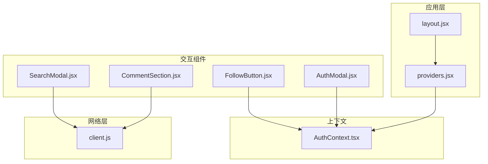
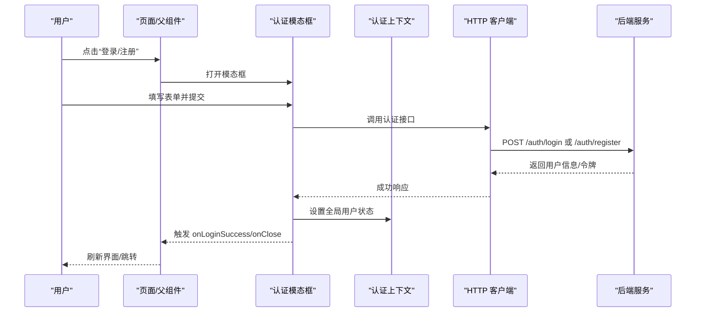
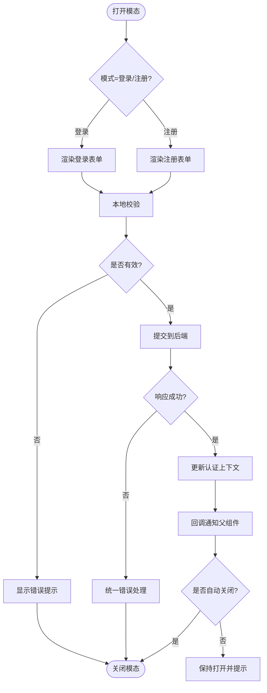
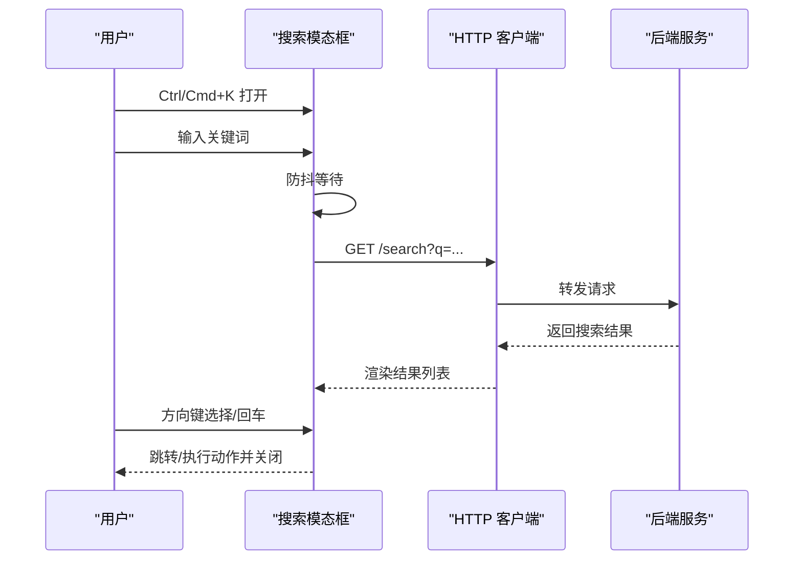
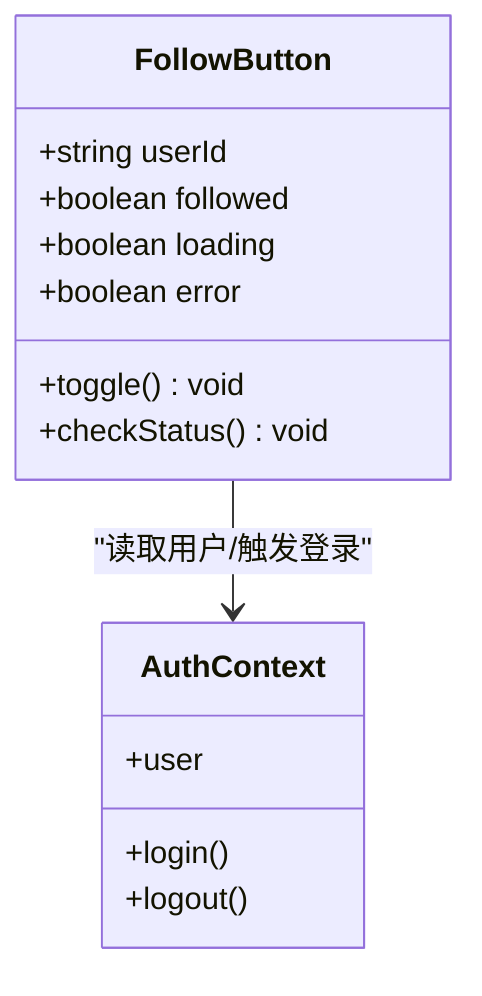
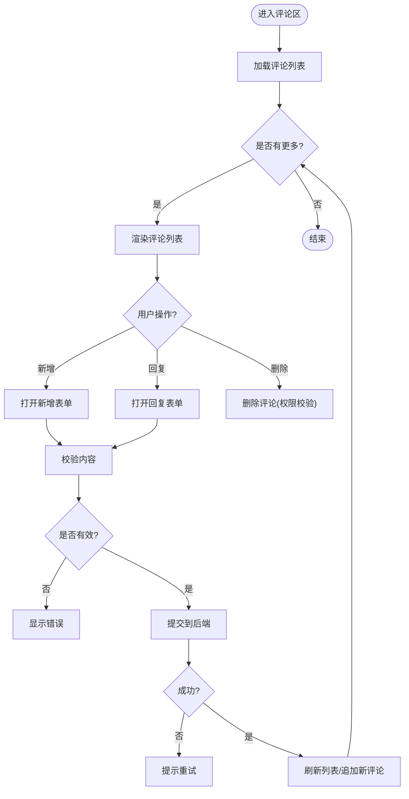
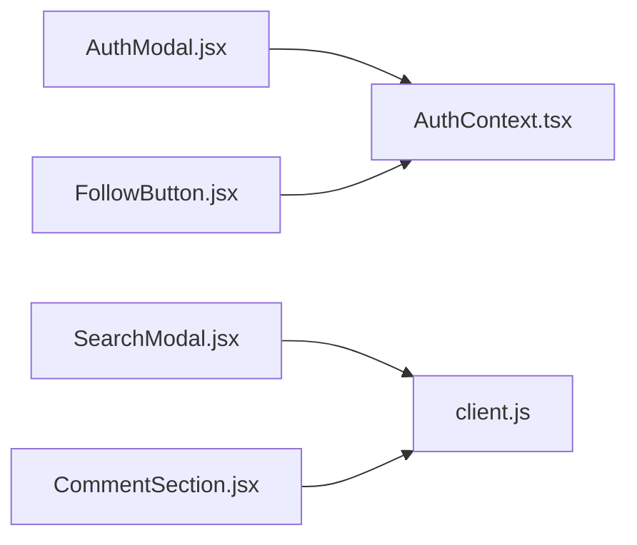

# 交互组件

<cite>
**本文引用的文件**   
- [AuthModal.jsx](file://src/components/AuthModal/AuthModal.jsx)
- [AuthModal.module.css](file://src/components/AuthModal/AuthModal.module.css)
- [SearchModal.jsx](file://src/components/SearchModal/searchmodal.jsx)
- [SearchModal.module.css](file://src/components/SearchModal/SearchModal.module.css)
- [FollowButton.jsx](file://src/components/FollowButton/followbutton.jsx)
- [FollowButton.module.css](file://src/components/FollowButton/FollowButton.module.css)
- [CommentSection.jsx](file://src/components/CommentSection/CommentSection.jsx)
- [CommentSection.module.css](file://src/components/CommentSection/CommentSection.module.css)
- [AuthContext.tsx](file://src/context/AuthContext.tsx)
- [client.js](file://src/api/client.js)
- [layout.jsx](file://src/app/layout.jsx)
- [providers.jsx](file://src/app/providers.jsx)
</cite>

## 目录
1. [简介](#简介)
2. [项目结构](#项目结构)
3. [核心组件](#核心组件)
4. [架构总览](#架构总览)
5. [详细组件分析](#详细组件分析)
6. [依赖关系分析](#依赖关系分析)
7. [性能考虑](#性能考虑)
8. [故障排查指南](#故障排查指南)
9. [结论](#结论)
10. [附录：API 参考](#附录api-参考)

## 简介
本文件聚焦于博客站点的前端交互组件，包括认证模态框、搜索模态框、关注按钮与评论区。文档从用户交互流程、状态管理、表单验证与错误处理入手，提供完整的 API 参考（属性、事件与方法），并给出复杂交互场景的实现建议（如嵌套模态框、实时搜索、评论回复）、状态同步与数据持久化策略，以及用户体验优化与可访问性实现指南。

## 项目结构
交互组件位于 src/components 下，采用“按功能分目录”的组织方式；样式使用 CSS Modules；全局认证上下文在 src/context 中提供；HTTP 客户端封装在 src/api 中；页面布局与 Provider 注入在 src/app 中。

图表来源
- [layout.jsx](file://src/app/layout.jsx)
- [providers.jsx](file://src/app/providers.jsx)
- [AuthContext.tsx](file://src/context/AuthContext.tsx)
- [client.js](file://src/api/client.js)
- [AuthModal.jsx](file://src/components/AuthModal/AuthModal.jsx)
- [SearchModal.jsx](file://src/components/SearchModal/searchmodal.jsx)
- [FollowButton.jsx](file://src/components/FollowButton/followbutton.jsx)
- [CommentSection.jsx](file://src/components/CommentSection/CommentSection.jsx)

章节来源
- [layout.jsx](file://src/app/layout.jsx)
- [providers.jsx](file://src/app/providers.jsx)
- [AuthContext.tsx](file://src/context/AuthContext.tsx)
- [client.js](file://src/api/client.js)

## 核心组件
- 认证模态框(AuthModal)：负责登录/注册切换、表单校验、提交到后端、成功后更新全局认证状态并可关闭其他模态。
- 搜索模态框(SearchModal)：全屏或覆盖式搜索入口，支持关键词输入、实时结果展示、键盘导航与 ESC 关闭。
- 关注按钮(FollowButton)：对目标用户执行关注/取消关注，受全局认证状态控制，显示当前关注状态。
- 评论区(CommentSection)：文章/问答的评论列表、分页加载、新增评论、回复评论、删除评论等。

章节来源
- [AuthModal.jsx](file://src/components/AuthModal/AuthModal.jsx)
- [SearchModal.jsx](file://src/components/SearchModal/searchmodal.jsx)
- [FollowButton.jsx](file://src/components/FollowButton/followbutton.jsx)
- [CommentSection.jsx](file://src/components/CommentSection/CommentSection.jsx)

## 架构总览
交互组件通过全局认证上下文共享登录态，通过 HTTP 客户端与后端通信。页面布局在根节点注入 Provider，使所有子树可消费认证状态。

图表来源
- [AuthModal.jsx](file://src/components/AuthModal/AuthModal.jsx)
- [AuthContext.tsx](file://src/context/AuthContext.tsx)
- [client.js](file://src/api/client.js)

## 详细组件分析

### 认证模态框(AuthModal)
- 交互流程
  - 打开：由父组件或全局菜单触发，传入初始模式（登录/注册）。
  - 表单：用户名/邮箱、密码、确认密码（注册）等字段；本地即时校验与提交前二次校验。
  - 提交：调用认证接口，成功后写入全局上下文，可选择自动关闭或保留以提示操作成功。
  - 关闭：ESC 键、遮罩点击、显式关闭按钮。
- 状态管理
  - 本地状态：表单值、校验错误、提交中、错误消息、当前模式。
  - 全局状态：通过认证上下文读写用户信息。
- 表单验证与错误处理
  - 必填项、格式校验（邮箱/手机号）、密码强度、两次密码一致性。
  - 网络错误、业务错误码映射为友好提示。
- 可访问性
  - role="dialog"、aria-modal="true"、aria-labelledby 指向标题、焦点陷阱、ESC 关闭。
- 典型 API
  - 属性：visible、mode、onClose、onLoginSuccess、initialValues、validateRules、className、style。
  - 事件：onOpen、onClose、onLoginSuccess、onError。
  - 方法：open(mode)、close()、resetForm()、setMode(mode)。

图表来源
- [AuthModal.jsx](file://src/components/AuthModal/AuthModal.jsx)
- [AuthContext.tsx](file://src/context/AuthContext.tsx)
- [client.js](file://src/api/client.js)

章节来源
- [AuthModal.jsx](file://src/components/AuthModal/AuthModal.jsx)
- [AuthModal.module.css](file://src/components/AuthModal/AuthModal.module.css)
- [AuthContext.tsx](file://src/context/AuthContext.tsx)
- [client.js](file://src/api/client.js)

### 搜索模态框(SearchModal)
- 交互流程
  - 快捷键：Ctrl/Cmd + K 打开；ESC 关闭；方向键在结果间移动；Enter 选择。
  - 输入：防抖请求，展示分类/文章/用户等聚合结果。
  - 选择：跳转到对应详情或执行动作后关闭。
- 状态管理
  - 本地状态：query、debouncedQuery、results、loading、error、activeIndex、isOpen。
  - 可选：最近搜索记录（localStorage）。
- 实时搜索与去抖
  - 输入变更时延迟发起请求，避免频繁网络调用。
  - 空查询时不请求或仅返回热门/推荐。
- 可访问性
  - role="dialog"、aria-modal、aria-label、aria-activedescendant、aria-busy 指示加载。
- 典型 API
  - 属性：visible、placeholder、endpoint、params、renderItem、onSelect、className、style。
  - 事件：onOpen、onClose、onSearch、onSelect。
  - 方法：open()、close()、setQuery(q)、focusInput()。

图表来源
- [SearchModal.jsx](file://src/components/SearchModal/searchmodal.jsx)
- [client.js](file://src/api/client.js)

章节来源
- [SearchModal.jsx](file://src/components/SearchModal/searchmodal.jsx)
- [SearchModal.module.css](file://src/components/SearchModal/SearchModal.module.css)
- [client.js](file://src/api/client.js)

### 关注按钮(FollowButton)
- 交互流程
  - 未登录：点击后弹出认证模态框，登录后重试关注。
  - 已登录：根据当前关注状态切换“关注/已关注”，失败回滚状态。
- 状态管理
  - 本地状态：isFollowing、loading、error。
  - 全局状态：从认证上下文读取当前用户，必要时监听用户变化。
- 并发与乐观更新
  - 可先乐观更新 UI，再异步请求；失败则回滚。
- 可访问性
  - aria-pressed 表达选中态，aria-label 描述动作。
- 典型 API
  - 属性：userId、followed、className、style、size、variant。
  - 事件：onToggle、onError、onSuccess。
  - 方法：toggle()、checkStatus()。

图表来源
- [FollowButton.jsx](file://src/components/FollowButton/followbutton.jsx)
- [AuthContext.tsx](file://src/context/AuthContext.tsx)

章节来源
- [FollowButton.jsx](file://src/components/FollowButton/followbutton.jsx)
- [FollowButton.module.css](file://src/components/FollowButton/FollowButton.module.css)
- [AuthContext.tsx](file://src/context/AuthContext.tsx)

### 评论区(CommentSection)
- 交互流程
  - 列表：分页加载、加载更多、排序（最新/最热）。
  - 新增：输入内容、选择@用户、预览、提交。
  - 回复：对某条评论进行回复，形成层级展示。
  - 管理：作者/管理员可删除评论。
- 状态管理
  - 本地状态：comments、page、hasMore、loading、error、replyTo、submitting。
  - 全局状态：当前用户用于权限判断。
- 表单验证与错误处理
  - 非空校验、长度限制、敏感词过滤（可选）。
  - 提交中禁用按钮，失败提示并重试。
- 可访问性
  - 评论条目使用 article 语义，操作按钮 aria-label，加载状态 aria-busy。
- 典型 API
  - 属性：postId、sort、pageSize、canDelete、className、style。
  - 事件：onAdd、onDelete、onReply、onLoadMore、onError。
  - 方法：loadMore()、addComment(text, replyToId)、deleteComment(id)。

图表来源
- [CommentSection.jsx](file://src/components/CommentSection/CommentSection.jsx)
- [client.js](file://src/api/client.js)

章节来源
- [CommentSection.jsx](file://src/components/CommentSection/CommentSection.jsx)
- [CommentSection.module.css](file://src/components/CommentSection/CommentSection.module.css)
- [client.js](file://src/api/client.js)

## 依赖关系分析
- 组件耦合
  - AuthModal 与 AuthContext 强耦合（读写用户状态）。
  - FollowButton 依赖 AuthContext 获取当前用户与登录态。
  - SearchModal 与 CommentSection 依赖 client.js 发起网络请求。
- 外部依赖
  - 后端认证、搜索、关注、评论相关 API。
- 潜在循环依赖
  - 组件之间无直接相互导入，均通过上下文与 API 解耦，风险较低。

图表来源
- [AuthModal.jsx](file://src/components/AuthModal/AuthModal.jsx)
- [FollowButton.jsx](file://src/components/FollowButton/followbutton.jsx)
- [SearchModal.jsx](file://src/components/SearchModal/searchmodal.jsx)
- [CommentSection.jsx](file://src/components/CommentSection/CommentSection.jsx)
- [AuthContext.tsx](file://src/context/AuthContext.tsx)
- [client.js](file://src/api/client.js)

章节来源
- [AuthModal.jsx](file://src/components/AuthModal/AuthModal.jsx)
- [FollowButton.jsx](file://src/components/FollowButton/followbutton.jsx)
- [SearchModal.jsx](file://src/components/SearchModal/searchmodal.jsx)
- [CommentSection.jsx](file://src/components/CommentSection/CommentSection.jsx)
- [AuthContext.tsx](file://src/context/AuthContext.tsx)
- [client.js](file://src/api/client.js)

## 性能考虑
- 搜索防抖与节流：减少无效请求，合理设置延迟时间。
- 列表虚拟滚动：长列表按需渲染，提升滚动性能。
- 图片懒加载与占位图：降低首屏压力。
- 请求合并与缓存：相同参数复用上次结果，避免重复请求。
- 骨架屏与乐观更新：提升感知性能与交互流畅度。

## 故障排查指南
- 认证失败
  - 检查网络连通性与跨域配置；核对后端返回的错误码与前端映射逻辑。
  - 确认 token 存储与上下文同步是否正确。
- 搜索无结果
  - 检查 query 参数拼接与后端路由；确认防抖时间是否过长导致“假死”。
- 关注状态不同步
  - 确认乐观更新回滚逻辑；检查服务端返回的最新状态是否与前端一致。
- 评论提交失败
  - 校验规则是否过于严格；查看错误提示是否清晰；重试机制是否生效。

章节来源
- [AuthModal.jsx](file://src/components/AuthModal/AuthModal.jsx)
- [SearchModal.jsx](file://src/components/SearchModal/searchmodal.jsx)
- [FollowButton.jsx](file://src/components/FollowButton/followbutton.jsx)
- [CommentSection.jsx](file://src/components/CommentSection/CommentSection.jsx)

## 结论
上述四个交互组件覆盖了用户认证、检索、社交互动与内容讨论的核心路径。通过统一的认证上下文与 HTTP 客户端，组件间实现了低耦合与高内聚。结合合理的状态管理、表单验证、错误处理与可访问性实践，可在保证可用性的同时提供良好的用户体验。

## 附录：API 参考

### 认证模态框(AuthModal)
- 属性
  - visible: boolean，是否可见
  - mode: "login" | "register"，初始模式
  - initialValues: object，默认表单值
  - validateRules: object，自定义校验规则
  - className/style: string/object，样式扩展
  - onClose: function，关闭回调
  - onLoginSuccess: function，登录成功回调
  - onOpen: function，打开回调
  - onError: function，错误回调
- 事件
  - onOpen、onClose、onLoginSuccess、onError
- 方法
  - open(mode)：打开并设置模式
  - close()：关闭
  - resetForm()：重置表单
  - setMode(mode)：切换模式

章节来源
- [AuthModal.jsx](file://src/components/AuthModal/AuthModal.jsx)

### 搜索模态框(SearchModal)
- 属性
  - visible: boolean，是否可见
  - placeholder: string，占位文本
  - endpoint: string，搜索接口路径
  - params: object，额外查询参数
  - renderItem: function，自定义结果项渲染
  - onSelect: function，选择回调
  - className/style: string/object，样式扩展
  - onOpen/onClose: function，打开/关闭回调
  - onSearch: function，搜索回调
- 事件
  - onOpen、onClose、onSearch、onSelect
- 方法
  - open()：打开
  - close()：关闭
  - setQuery(q)：设置查询词
  - focusInput()：聚焦输入框

章节来源
- [SearchModal.jsx](file://src/components/SearchModal/searchmodal.jsx)

### 关注按钮(FollowButton)
- 属性
  - userId: string，目标用户 ID
  - followed: boolean，当前是否已关注
  - size: "sm" | "md" | "lg"，尺寸
  - variant: "primary" | "secondary"，风格
  - className/style: string/object，样式扩展
  - onToggle: function，切换回调
  - onSuccess: function，成功回调
  - onError: function，错误回调
- 事件
  - onToggle、onSuccess、onError
- 方法
  - toggle()：切换关注状态
  - checkStatus()：拉取最新关注状态

章节来源
- [FollowButton.jsx](file://src/components/FollowButton/followbutton.jsx)

### 评论区(CommentSection)
- 属性
  - postId: string，关联内容 ID
  - sort: "latest" | "hot"，排序方式
  - pageSize: number，每页条数
  - canDelete: boolean，是否允许删除
  - className/style: string/object，样式扩展
  - onLoadMore: function，加载更多回调
  - onAdd: function，新增回调
  - onDelete: function，删除回调
  - onReply: function，回复回调
  - onError: function，错误回调
- 事件
  - onLoadMore、onAdd、onDelete、onReply、onError
- 方法
  - loadMore()：加载下一页
  - addComment(text, replyToId)：新增评论
  - deleteComment(id)：删除评论

章节来源
- [CommentSection.jsx](file://src/components/CommentSection/CommentSection.jsx)