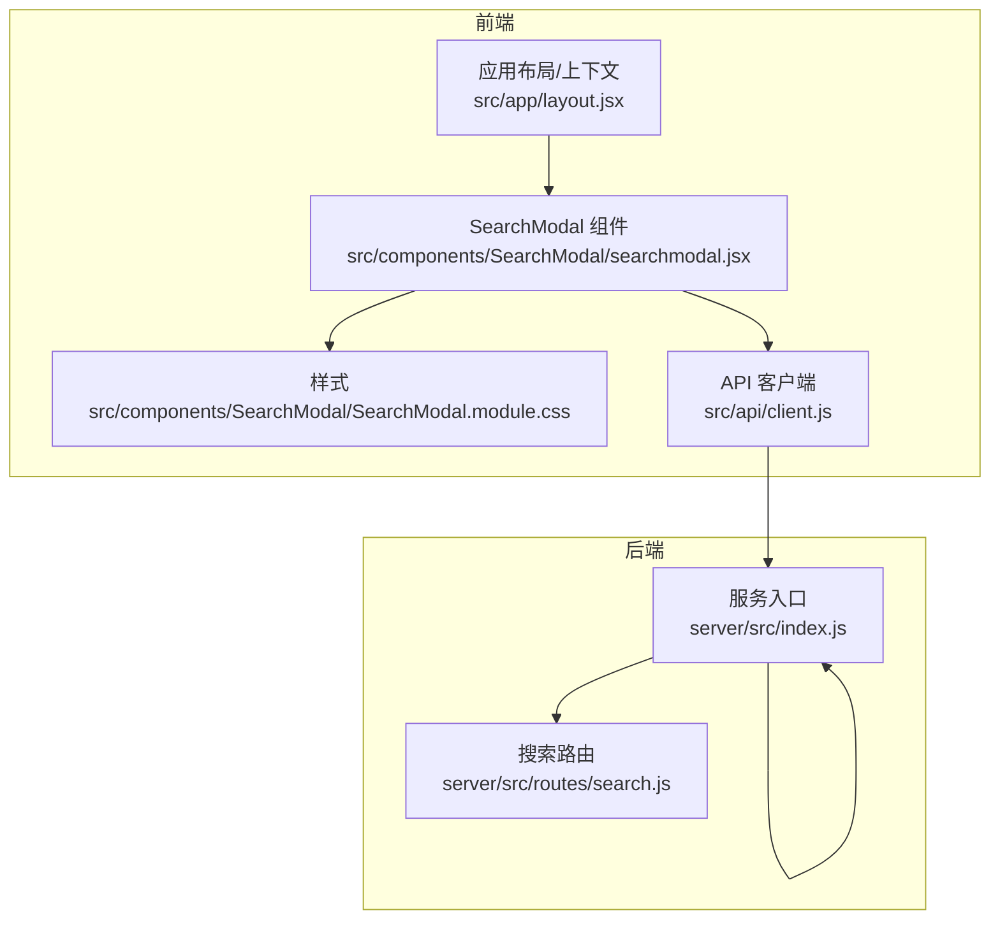
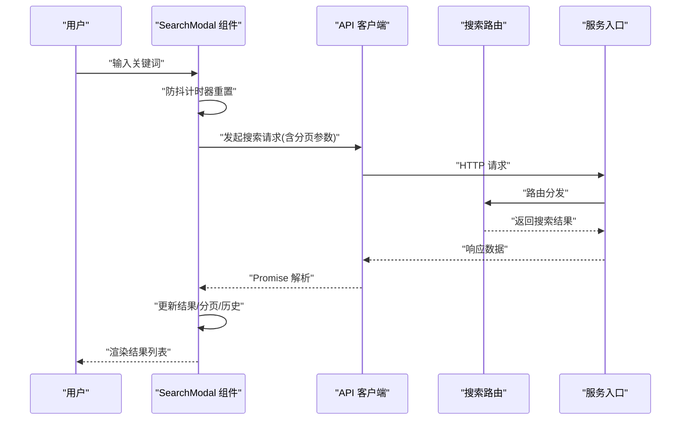
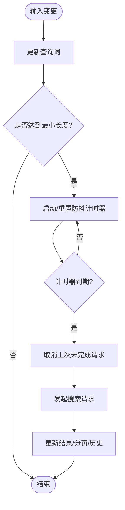
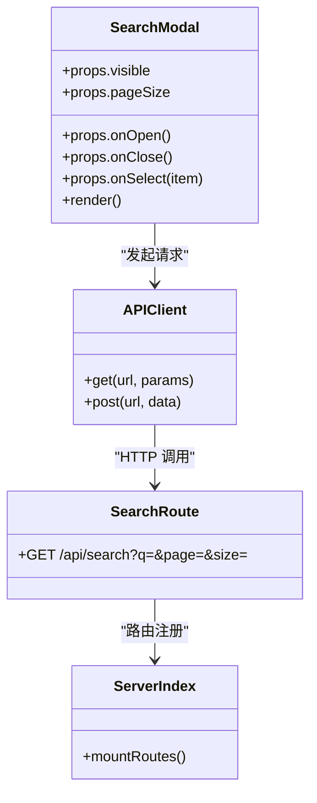
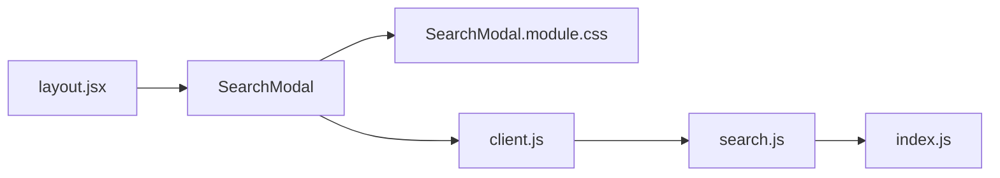

# 搜索模态框

<cite>
**本文引用的文件**   
- [searchmodal.jsx](file://src/components/SearchModal/searchmodal.jsx)
- [SearchModal.module.css](file://src/components/SearchModal/SearchModal.module.css)
- [client.js](file://src/api/client.js)
- [search.js](file://server/src/routes/search.js)
- [index.js](file://server/src/index.js)
- [layout.jsx](file://src/app/layout.jsx)
</cite>

## 目录
1. [简介](#简介)
2. [项目结构](#项目结构)
3. [核心组件](#核心组件)
4. [架构总览](#架构总览)
5. [详细组件分析](#详细组件分析)
6. [依赖分析](#依赖分析)
7. [性能考虑](#性能考虑)
8. [故障排查指南](#故障排查指南)
9. [结论](#结论)
10. [附录：API 参考](#附录api-参考)

## 简介
本文件围绕“搜索模态框”（SearchModal）组件，系统性梳理其搜索能力与交互设计，包括实时搜索、结果展示、历史管理、键盘导航、防抖策略、建议与热门搜索、分页处理、与后端搜索 API 的集成方式以及性能优化与用户体验提升建议。文档同时提供完整的 API 参考，帮助开发者快速接入并扩展该组件。

## 项目结构
搜索功能涉及前端组件、客户端请求封装、服务端路由与入口文件等关键位置。整体组织如下：
- 前端组件层：SearchModal 组件及其样式
- 客户端请求层：统一的 API 客户端封装
- 服务端路由层：搜索接口实现
- 应用入口：服务启动与路由挂载

图表来源
- [searchmodal.jsx](file://src/components/SearchModal/searchmodal.jsx)
- [SearchModal.module.css](file://src/components/SearchModal/SearchModal.module.css)
- [client.js](file://src/api/client.js)
- [search.js](file://server/src/routes/search.js)
- [index.js](file://server/src/index.js)
- [layout.jsx](file://src/app/layout.jsx)

章节来源
- [searchmodal.jsx](file://src/components/SearchModal/searchmodal.jsx)
- [SearchModal.module.css](file://src/components/SearchModal/SearchModal.module.css)
- [client.js](file://src/api/client.js)
- [search.js](file://server/src/routes/search.js)
- [index.js](file://server/src/index.js)
- [layout.jsx](file://src/app/layout.jsx)

## 核心组件
SearchModal 是一个可复用的搜索弹窗组件，负责：
- 打开/关闭控制与焦点管理
- 输入监听与防抖触发搜索
- 搜索结果渲染与分页
- 搜索历史与热门搜索展示
- 键盘导航（方向键、回车、Esc）
- 与后端搜索 API 的异步交互

章节来源
- [searchmodal.jsx](file://src/components/SearchModal/searchmodal.jsx)

## 架构总览
下图展示了从用户输入到后端返回结果的完整调用链，以及组件内部状态流转的关键节点。

图表来源
- [searchmodal.jsx](file://src/components/SearchModal/searchmodal.jsx)
- [client.js](file://src/api/client.js)
- [search.js](file://server/src/routes/search.js)
- [index.js](file://server/src/index.js)

## 详细组件分析

### 组件属性与行为
- 可见性控制：通过外部传入的布尔属性控制模态框显示/隐藏
- 默认聚焦：打开时自动聚焦输入框
- 关闭行为：点击遮罩、按 Esc、点击外部区域均可关闭
- 历史记录：本地存储最近搜索词，支持清空
- 热门搜索：可从配置或后端获取热门词条
- 结果分页：支持页码切换与每页条数设置
- 事件回调：提供打开、关闭、选择结果、加载完成等回调钩子

章节来源
- [searchmodal.jsx](file://src/components/SearchModal/searchmodal.jsx)

### 实时搜索与防抖
- 输入变化时记录当前关键词
- 使用防抖机制避免频繁请求
- 最小查询长度阈值，防止空查询
- 取消上一次未完成的请求，避免竞态

图表来源
- [searchmodal.jsx](file://src/components/SearchModal/searchmodal.jsx)

### 搜索结果展示与分页
- 结果项包含标题、摘要、链接等字段
- 分页控件支持上一页/下一页与页码跳转
- 空状态提示与加载中骨架屏
- 错误状态重试与友好提示

章节来源
- [searchmodal.jsx](file://src/components/SearchModal/searchmodal.jsx)

### 搜索历史管理与热门搜索
- 历史保存至本地存储，限制最大条目数量
- 支持一键清空历史
- 热门搜索可静态配置或动态拉取
- 点击历史或热门词条直接触发搜索

章节来源
- [searchmodal.jsx](file://src/components/SearchModal/searchmodal.jsx)

### 键盘导航与无障碍
- 方向键在结果列表中上下移动高亮
- 回车选中当前高亮项
- Esc 关闭模态框
- Tab 顺序合理，焦点始终可见
- 为关键元素添加语义化标签与 aria 属性

章节来源
- [searchmodal.jsx](file://src/components/SearchModal/searchmodal.jsx)

### 与后端搜索 API 的集成
- 通过统一客户端发起请求，携带关键词、页码、每页大小等参数
- 服务端路由接收参数并返回结构化结果
- 客户端对异常进行捕获与降级处理

图表来源
- [searchmodal.jsx](file://src/components/SearchModal/searchmodal.jsx)
- [client.js](file://src/api/client.js)
- [search.js](file://server/src/routes/search.js)
- [index.js](file://server/src/index.js)

章节来源
- [client.js](file://src/api/client.js)
- [search.js](file://server/src/routes/search.js)
- [index.js](file://server/src/index.js)

### 样式与主题适配
- 使用模块化样式文件，避免全局污染
- 支持暗色模式与不同屏幕尺寸
- 动画过渡用于打开/关闭与结果加载

章节来源
- [SearchModal.module.css](file://src/components/SearchModal/SearchModal.module.css)

## 依赖分析
- 组件依赖：
  - 样式模块：SearchModal.module.css
  - 客户端封装：client.js
  - 应用上下文：layout.jsx（如需要全局状态或主题）
- 后端依赖：
  - 服务入口：index.js
  - 搜索路由：search.js

图表来源
- [searchmodal.jsx](file://src/components/SearchModal/searchmodal.jsx)
- [SearchModal.module.css](file://src/components/SearchModal/SearchModal.module.css)
- [client.js](file://src/api/client.js)
- [search.js](file://server/src/routes/search.js)
- [index.js](file://server/src/index.js)
- [layout.jsx](file://src/app/layout.jsx)

章节来源
- [searchmodal.jsx](file://src/components/SearchModal/searchmodal.jsx)
- [SearchModal.module.css](file://src/components/SearchModal/SearchModal.module.css)
- [client.js](file://src/api/client.js)
- [search.js](file://server/src/routes/search.js)
- [index.js](file://server/src/index.js)
- [layout.jsx](file://src/app/layout.jsx)

## 性能考虑
- 防抖与节流：输入防抖减少无效请求；必要时对滚动加载使用节流
- 请求去重与取消：相同关键词并发请求只保留最新一次
- 分页与虚拟列表：大数据量时使用分页或虚拟滚动
- 缓存策略：对热门搜索与常用关键词做短期缓存
- 图片与富文本：按需懒加载与精简渲染
- 网络优化：压缩、CDN、HTTP/2、合理的超时与重试

[本节为通用指导，不直接分析具体文件]

## 故障排查指南
- 无结果：检查最小查询长度、关键词编码、后端索引状态
- 请求失败：查看网络面板、服务端日志、错误码与重试逻辑
- 键盘不可用：确认焦点管理与 aria 属性是否正确设置
- 历史丢失：检查本地存储权限与容量限制
- 移动端体验差：验证触摸事件、键盘弹出遮挡与视口适配

章节来源
- [searchmodal.jsx](file://src/components/SearchModal/searchmodal.jsx)

## 结论
SearchModal 提供了开箱即用的搜索体验，涵盖实时搜索、历史与热门、分页与键盘导航等关键能力。结合防抖、取消与缓存等策略，可在保证性能的同时提升可用性。通过清晰的 API 与可扩展的事件回调，便于在不同业务场景中复用与定制。

[本节为总结性内容，不直接分析具体文件]

## 附录：API 参考

### 组件属性（Props）
- visible: boolean — 控制模态框显示/隐藏
- defaultVisible?: boolean — 初始可见性
- placeholder?: string — 输入框占位文本
- pageSize?: number — 每页条数
- minQueryLength?: number — 最小查询长度
- debounceMs?: number — 防抖延迟毫秒
- showHistory?: boolean — 是否显示历史
- showHot?: boolean — 是否显示热门
- hotItems?: Array — 热门词条列表
- historyLimit?: number — 历史最大条目数
- emptyText?: string — 空状态文案
- loadingText?: string — 加载中文案
- errorText?: string — 错误状态文案
- onSelect?: (item) => void — 选中结果回调
- onOpen?: () => void — 打开回调
- onClose?: () => void — 关闭回调
- onLoadMore?: (page) => void — 加载更多回调（可选）
- renderResultItem?: (item) => ReactNode — 自定义结果项渲染（可选）

章节来源
- [searchmodal.jsx](file://src/components/SearchModal/searchmodal.jsx)

### 方法（Methods）
- focus(): void — 将焦点移入输入框
- clearHistory(): void — 清空本地历史
- reset(): void — 重置查询与分页状态

章节来源
- [searchmodal.jsx](file://src/components/SearchModal/searchmodal.jsx)

### 事件（Events）
- onChange(query): void — 查询词变化
- onSearch(query, page, size): void — 触发搜索（可用于埋点）
- onResult(items, total, page, size): void — 结果加载完成
- onError(error): void — 请求错误
- onEmpty(): void — 结果为空
- onHistoryChange(history): void — 历史变化

章节来源
- [searchmodal.jsx](file://src/components/SearchModal/searchmodal.jsx)

### 与后端搜索 API 的约定
- 请求路径：/api/search
- 查询参数：
  - q: string — 关键词
  - page: number — 页码（从 1 开始）
  - size: number — 每页条数
- 响应结构（示例字段）：
  - items: Array — 结果列表
  - total: number — 总数
  - page: number — 当前页
  - size: number — 每页条数
- 错误码：
  - 400: 参数非法
  - 500: 服务器内部错误

章节来源
- [client.js](file://src/api/client.js)
- [search.js](file://server/src/routes/search.js)
- [index.js](file://server/src/index.js)

### 使用示例（概念说明）
- 基础用法：在页面中引入组件，绑定 visible 与 onClose
- 受控模式：由父组件维护 visible 与查询词
- 自定义渲染：通过 renderResultItem 定制结果项 UI
- 历史与热门：开启 showHistory/showHot 并传入配置

[本节为概念性说明，不直接分析具体文件]