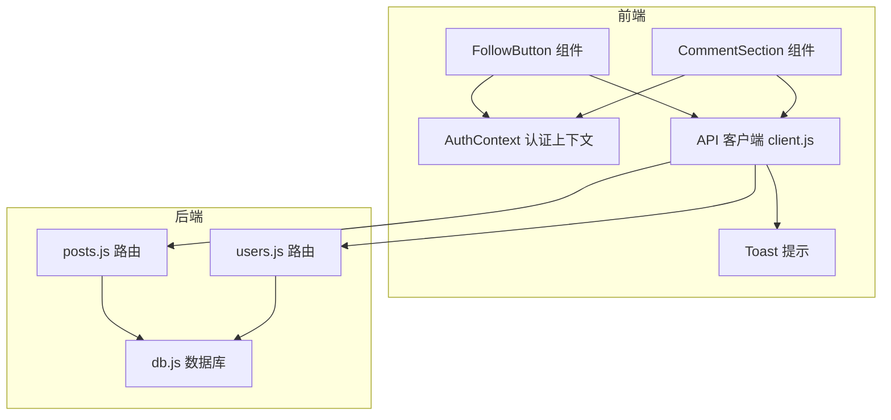
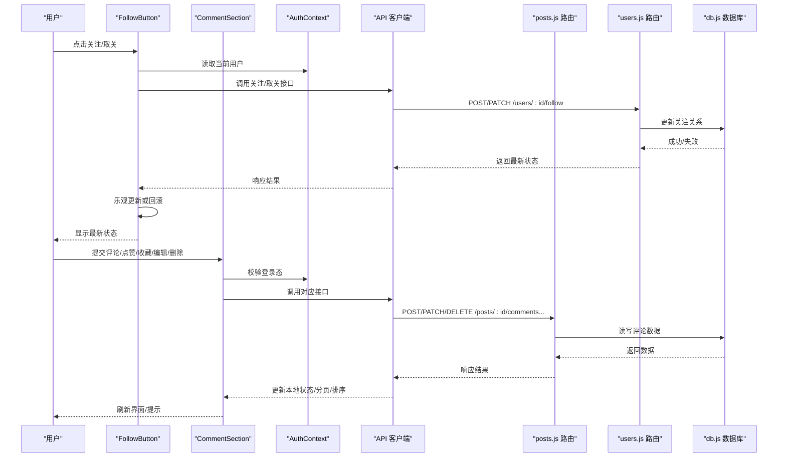
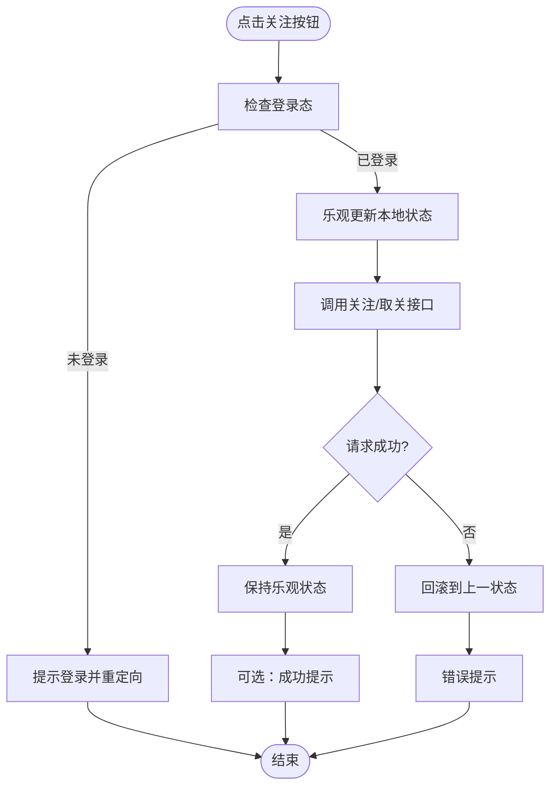
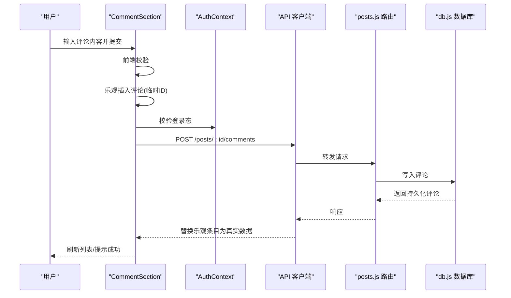
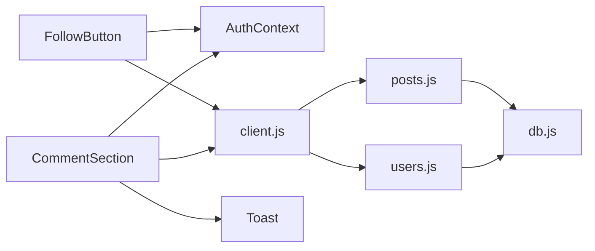

# 社交互动组件

<cite>
**本文引用的文件**   
- [FollowButton.jsx](file://src/components/FollowButton/followbutton.jsx)
- [FollowButton.module.css](file://src/components/FollowButton/FollowButton.module.css)
- [CommentSection.jsx](file://src/components/CommentSection/CommentSection.jsx)
- [CommentSection.module.css](file://src/components/CommentSection/CommentSection.module.css)
- [client.js](file://src/api/client.js)
- [AuthContext.tsx](file://src/context/AuthContext.tsx)
- [Toast.jsx](file://src/components/Toast/Toast.jsx)
- [posts.js](file://server/src/routes/posts.js)
- [users.js](file://server/src/routes/users.js)
- [db.js](file://server/src/db.js)
- [05api接口文档.md](file://docs/05api接口文档.md)
</cite>

## 目录
1. [简介](#简介)
2. [项目结构](#项目结构)
3. [核心组件](#核心组件)
4. [架构总览](#架构总览)
5. [详细组件分析](#详细组件分析)
6. [依赖关系分析](#依赖关系分析)
7. [性能与体验优化](#性能与体验优化)
8. [故障排查指南](#故障排查指南)
9. [结论](#结论)
10. [附录：API参考](#附录api参考)

## 简介
本文件聚焦于社交互动相关的前端组件与后端集成，重点覆盖以下能力：
- 关注按钮（FollowButton）：用户状态管理、权限控制、乐观更新与错误回滚。
- 评论区（CommentSection）：评论发布、嵌套回复、点赞收藏、编辑删除、排序与分页、实时通知。
- 与后端社交API的集成方式与数据同步策略。
- 用户体验优化建议：操作反馈、错误重试、离线支持等。

## 项目结构
与社交互动相关的代码主要分布在以下位置：
- 前端组件
  - src/components/FollowButton：关注按钮组件及其样式
  - src/components/CommentSection：评论区组件及其样式
  - src/components/Toast：全局提示组件
  - src/context/AuthContext.tsx：认证上下文（登录态、用户信息）
  - src/api/client.js：HTTP客户端封装
- 后端路由与数据库
  - server/src/routes/posts.js：文章相关接口（含评论、点赞、收藏等）
  - server/src/routes/users.js：用户相关接口（含关注/取关）
  - server/src/db.js：数据库连接与基础查询封装
- 文档
  - docs/05api接口文档.md：API定义与示例

图表来源
- [followbutton.jsx](file://src/components/FollowButton/followbutton.jsx)
- [CommentSection.jsx](file://src/components/CommentSection/CommentSection.jsx)
- [client.js](file://src/api/client.js)
- [AuthContext.tsx](file://src/context/AuthContext.tsx)
- [posts.js](file://server/src/routes/posts.js)
- [users.js](file://server/src/routes/users.js)
- [db.js](file://server/src/db.js)

章节来源
- [followbutton.jsx](file://src/components/FollowButton/followbutton.jsx)
- [CommentSection.jsx](file://src/components/CommentSection/CommentSection.jsx)
- [client.js](file://src/api/client.js)
- [AuthContext.tsx](file://src/context/AuthContext.tsx)
- [posts.js](file://server/src/routes/posts.js)
- [users.js](file://server/src/routes/users.js)
- [db.js](file://server/src/db.js)

## 核心组件
本节对两个关键社交组件进行概览性说明，后续章节将深入实现细节。

- FollowButton（关注按钮）
  - 职责：展示当前用户对目标用户的关注状态，支持一键关注/取关；在本地进行乐观更新，失败时回滚并提示。
  - 关键交互：点击触发关注/取关请求；根据返回结果更新UI；未登录时引导登录。
  - 状态来源：从认证上下文获取当前用户ID，结合后端返回的关注状态渲染。

- CommentSection（评论区）
  - 职责：承载文章的评论列表、评论表单、嵌套回复、点赞/收藏、编辑/删除、排序与分页。
  - 关键交互：提交新评论、回复某条评论、切换排序、翻页加载、点赞/收藏、编辑/删除（权限校验）。
  - 数据流：通过API客户端调用后端接口，使用本地状态缓存与增量更新，必要时触发Toast提示。

章节来源
- [followbutton.jsx](file://src/components/FollowButton/followbutton.jsx)
- [CommentSection.jsx](file://src/components/CommentSection/CommentSection.jsx)

## 架构总览
前后端交互采用REST风格，前端通过统一的HTTP客户端发起请求，后端路由处理业务逻辑并访问数据库。认证上下文提供登录态和用户信息，用于权限判断与个性化展示。

图表来源
- [followbutton.jsx](file://src/components/FollowButton/followbutton.jsx)
- [CommentSection.jsx](file://src/components/CommentSection/CommentSection.jsx)
- [client.js](file://src/api/client.js)
- [AuthContext.tsx](file://src/context/AuthContext.tsx)
- [posts.js](file://server/src/routes/posts.js)
- [users.js](file://server/src/routes/users.js)
- [db.js](file://server/src/db.js)

## 详细组件分析

### FollowButton（关注按钮）
- 功能要点
  - 状态管理：维护“已关注/未关注”状态，优先使用本地状态进行即时反馈。
  - 权限控制：未登录时阻止操作并引导登录；登录后根据用户ID与目标用户ID决定是否允许操作。
  - 实时更新：成功后立即更新UI；失败时回滚到上一状态并提示。
  - 错误处理：网络异常、服务端错误均捕获并给出友好提示。
- 交互流程
  - 点击 -> 检查登录态 -> 乐观更新 -> 发起请求 -> 成功则保持、失败则回滚 -> Toast提示。
- 关键数据结构
  - 组件属性：目标用户ID、初始关注状态、回调事件（如关注变化通知）。
  - 内部状态：loading、error、isFollowing。
- 与后端集成
  - 调用用户关注接口，携带当前用户标识与目标用户标识。
  - 响应包含最新关注状态，用于同步UI。

图表来源
- [followbutton.jsx](file://src/components/FollowButton/followbutton.jsx)
- [AuthContext.tsx](file://src/context/AuthContext.tsx)
- [users.js](file://server/src/routes/users.js)
- [db.js](file://server/src/db.js)

章节来源
- [followbutton.jsx](file://src/components/FollowButton/followbutton.jsx)
- [AuthContext.tsx](file://src/context/AuthContext.tsx)
- [users.js](file://server/src/routes/users.js)
- [db.js](file://server/src/db.js)

### CommentSection（评论区）
- 功能要点
  - 评论发布：支持文本输入与基本校验，提交后插入列表顶部或指定位置。
  - 嵌套回复：支持对评论进行回复，形成层级结构，可折叠/展开。
  - 点赞/收藏：对单条评论进行点赞与收藏，状态即时反馈。
  - 编辑/删除：仅作者或管理员可编辑/删除，带二次确认。
  - 排序与分页：支持按时间/热度排序，分页加载更多评论。
  - 实时通知：新增评论、点赞/收藏变化时通过Toast提示。
- 数据模型（概念）
  - 评论对象：包含ID、内容、作者、创建时间、父评论ID（用于嵌套）、点赞数、收藏标记、是否可编辑/删除等。
  - 列表状态：comments数组、page/pageSize、total、sortOrder、loading、error。
- 交互流程（以发布评论为例）
  - 输入校验 -> 乐观插入 -> 调用发布接口 -> 成功保留乐观数据、失败移除乐观条目并提示。
- 排序算法（概念）
  - 时间排序：按创建时间倒序。
  - 热度排序：综合点赞数、发布时间衰减等规则计算得分后排序。
- 分页加载
  - 首次加载第一页，滚动到底部或点击“加载更多”拉取下一页，合并去重。
- 与后端集成
  - 调用评论相关接口：新增、更新、删除、点赞、收藏、分页查询、排序参数。

图表来源
- [CommentSection.jsx](file://src/components/CommentSection/CommentSection.jsx)
- [client.js](file://src/api/client.js)
- [AuthContext.tsx](file://src/context/AuthContext.tsx)
- [posts.js](file://server/src/routes/posts.js)
- [db.js](file://server/src/db.js)

章节来源
- [CommentSection.jsx](file://src/components/CommentSection/CommentSection.jsx)
- [client.js](file://src/api/client.js)
- [AuthContext.tsx](file://src/context/AuthContext.tsx)
- [posts.js](file://server/src/routes/posts.js)
- [db.js](file://server/src/db.js)

## 依赖关系分析
- 组件耦合
  - FollowButton依赖认证上下文与用户关注接口。
  - CommentSection依赖认证上下文、评论接口与Toast提示。
- 外部依赖
  - HTTP客户端统一封装，负责请求头、鉴权、错误处理与重试策略。
  - 后端路由与数据库层解耦，便于扩展与维护。
- 潜在循环依赖
  - 组件间无直接相互引用，依赖集中在API客户端与认证上下文，避免循环。

图表来源
- [followbutton.jsx](file://src/components/FollowButton/followbutton.jsx)
- [CommentSection.jsx](file://src/components/CommentSection/CommentSection.jsx)
- [client.js](file://src/api/client.js)
- [AuthContext.tsx](file://src/context/AuthContext.tsx)
- [posts.js](file://server/src/routes/posts.js)
- [users.js](file://server/src/routes/users.js)
- [db.js](file://server/src/db.js)
- [Toast.jsx](file://src/components/Toast/Toast.jsx)

章节来源
- [followbutton.jsx](file://src/components/FollowButton/followbutton.jsx)
- [CommentSection.jsx](file://src/components/CommentSection/CommentSection.jsx)
- [client.js](file://src/api/client.js)
- [AuthContext.tsx](file://src/context/AuthContext.tsx)
- [posts.js](file://server/src/routes/posts.js)
- [users.js](file://server/src/routes/users.js)
- [db.js](file://server/src/db.js)
- [Toast.jsx](file://src/components/Toast/Toast.jsx)

## 性能与体验优化
- 乐观更新与回滚
  - 关注与评论操作先更新UI，再异步请求；失败时回滚并提示，提升感知速度。
- 分页与虚拟滚动
  - 评论列表采用分页加载，大数据量场景可考虑虚拟滚动减少渲染开销。
- 排序与缓存
  - 排序在前端完成，配合后端分页参数；对热点评论可短期缓存以减少重复请求。
- 错误重试与降级
  - 网络抖动时自动重试有限次数；持续失败时降级为只读模式并提示。
- 离线支持
  - 利用浏览器存储暂存待提交的评论草稿；恢复网络后批量同步。
- 操作反馈
  - 使用Toast提示成功/失败；关键操作增加二次确认与加载指示器。

[本节为通用指导，不直接分析具体文件]

## 故障排查指南
- 常见问题
  - 未登录导致操作失败：检查认证上下文是否正确注入，跳转登录流程是否完整。
  - 关注状态不同步：确认后端返回字段与前端期望一致，注意并发操作的幂等性。
  - 评论分页异常：检查分页参数边界条件与去重逻辑，确保不会重复插入。
  - 点赞/收藏状态错乱：确保每个操作都基于最新服务端状态进行合并。
- 定位方法
  - 查看网络请求与响应，核对接口路径、参数与返回结构。
  - 检查组件内部状态变更日志与错误堆栈。
  - 使用Toast记录关键操作的成功/失败信息。

章节来源
- [Toast.jsx](file://src/components/Toast/Toast.jsx)
- [client.js](file://src/api/client.js)
- [AuthContext.tsx](file://src/context/AuthContext.tsx)

## 结论
FollowButton与CommentSection构成了社交互动的核心体验。通过乐观更新、严格权限控制、完善的错误处理与友好的反馈机制，系统在可用性与性能之间取得平衡。结合后端清晰的API设计与数据库层封装，可实现稳定可靠的社交功能。

[本节为总结性内容，不直接分析具体文件]

## 附录：API参考
以下为社交相关API的概念性参考，具体字段与行为以后端实现为准。

- 用户关注
  - 路径：/users/:id/follow
  - 方法：POST/PATCH
  - 鉴权：需要登录
  - 请求体：{ targetUserId }
  - 响应：{ following: boolean, message?: string }
  - 错误码：401未登录、403无权限、404目标不存在、500服务器错误

- 评论列表
  - 路径：/posts/:postId/comments
  - 方法：GET
  - 查询参数：page、pageSize、sort（time/hot）、parentId（可选，用于子评论）
  - 响应：{ comments: [], total, page, pageSize }

- 发布评论
  - 路径：/posts/:postId/comments
  - 方法：POST
  - 鉴权：需要登录
  - 请求体：{ content, parentId? }
  - 响应：{ comment }

- 更新评论
  - 路径：/posts/:postId/comments/:commentId
  - 方法：PATCH
  - 鉴权：作者或管理员
  - 请求体：{ content }
  - 响应：{ comment }

- 删除评论
  - 路径：/posts/:postId/comments/:commentId
  - 方法：DELETE
  - 鉴权：作者或管理员
  - 响应：{ success: true }

- 点赞评论
  - 路径：/posts/:postId/comments/:commentId/like
  - 方法：POST
  - 鉴权：需要登录
  - 响应：{ liked: boolean, likeCount }

- 收藏评论
  - 路径：/posts/:postId/comments/:commentId/favorite
  - 方法：POST
  - 鉴权：需要登录
  - 响应：{ favorited: boolean, favoriteCount }

章节来源
- [05api接口文档.md](file://docs/05api接口文档.md)
- [posts.js](file://server/src/routes/posts.js)
- [users.js](file://server/src/routes/users.js)