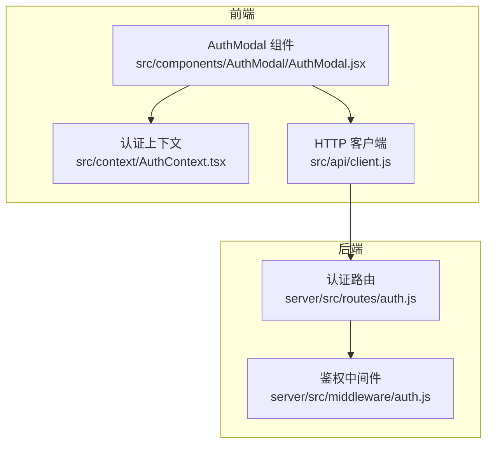
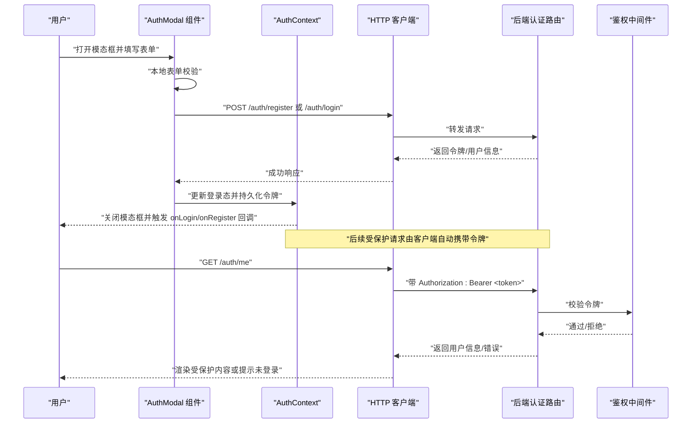
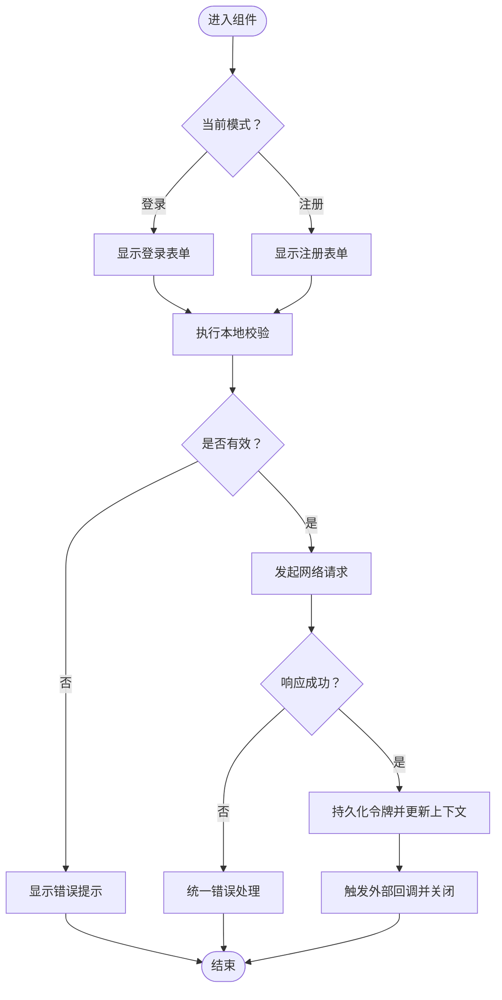
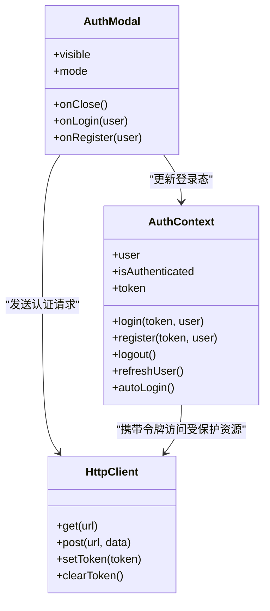
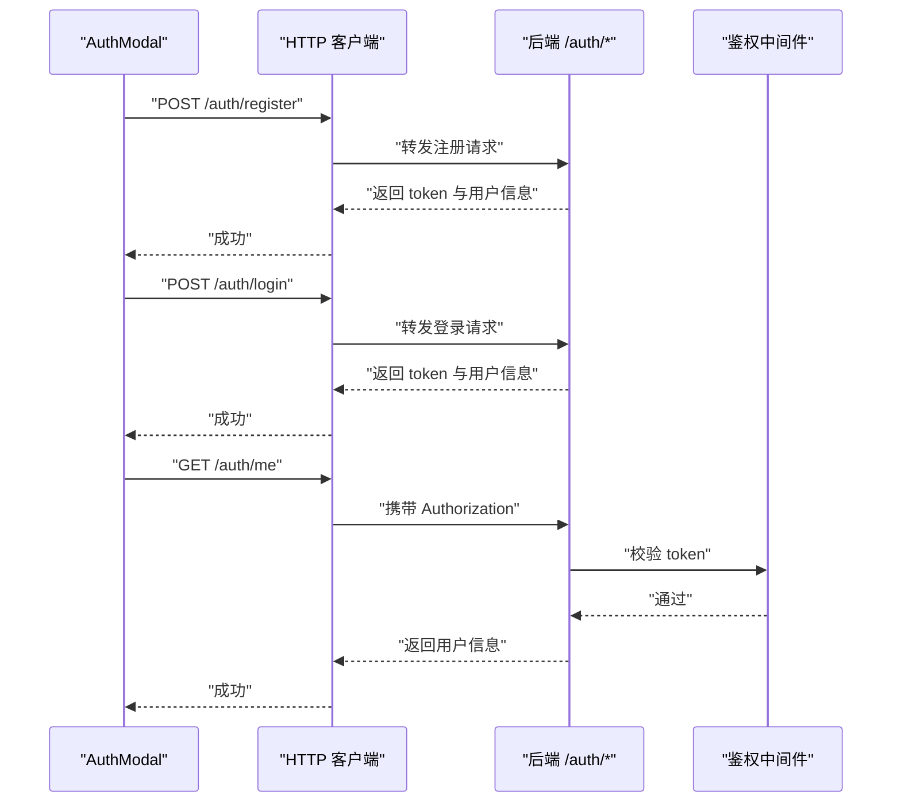
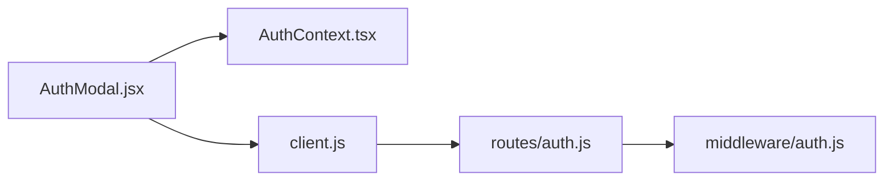

# 认证模态框

<cite>
**本文引用的文件**   
- [AuthModal.jsx](file://src/components/AuthModal/AuthModal.jsx)
- [AuthModal.module.css](file://src/components/AuthModal/AuthModal.module.css)
- [AuthContext.tsx](file://src/context/AuthContext.tsx)
- [client.js](file://src/api/client.js)
- [auth.js（后端路由）](file://server/src/routes/auth.js)
- [auth.js（中间件）](file://server/src/middleware/auth.js)
</cite>

## 目录
1. [简介](#简介)
2. [项目结构](#项目结构)
3. [核心组件](#核心组件)
4. [架构总览](#架构总览)
5. [详细组件分析](#详细组件分析)
6. [依赖关系分析](#依赖关系分析)
7. [性能与体验优化](#性能与体验优化)
8. [故障排查指南](#故障排查指南)
9. [结论](#结论)
10. [附录：API 参考](#附录api-参考)

## 简介
本文件围绕前端认证模态框组件 AuthModal，系统化说明其用户认证流程、表单交互与验证、错误处理与反馈、状态管理、JWT 存储与会话恢复、以及与服务端认证 API 的集成方式。文档同时提供完整的 Props/事件/方法参考，并给出用户体验优化建议，如加载状态、密码可见性切换等。

## 项目结构
认证相关的前端代码主要分布在以下位置：
- 组件层：src/components/AuthModal
- 全局认证上下文：src/context/AuthContext.tsx
- HTTP 客户端封装：src/api/client.js
- 服务端认证路由与鉴权中间件：server/src/routes/auth.js、server/src/middleware/auth.js

图表来源
- [AuthModal.jsx](file://src/components/AuthModal/AuthModal.jsx)
- [AuthContext.tsx](file://src/context/AuthContext.tsx)
- [client.js](file://src/api/client.js)
- [auth.js（后端路由）](file://server/src/routes/auth.js)
- [auth.js（中间件）](file://server/src/middleware/auth.js)

章节来源
- [AuthModal.jsx](file://src/components/AuthModal/AuthModal.jsx)
- [AuthContext.tsx](file://src/context/AuthContext.tsx)
- [client.js](file://src/api/client.js)
- [auth.js（后端路由）](file://server/src/routes/auth.js)
- [auth.js（中间件）](file://server/src/middleware/auth.js)

## 核心组件
- AuthModal：负责登录/注册表单展示、表单校验、提交请求、错误提示、关闭与回调。
- AuthContext：集中管理用户登录态、令牌持久化、自动登录恢复、登出与刷新用户信息。
- client.js：统一封装网络请求，携带 JWT、处理通用错误与响应拦截。
- 后端 auth 路由：提供注册、登录、获取当前用户等接口；鉴权中间件校验 JWT。

章节来源
- [AuthModal.jsx](file://src/components/AuthModal/AuthModal.jsx)
- [AuthContext.tsx](file://src/context/AuthContext.tsx)
- [client.js](file://src/api/client.js)
- [auth.js（后端路由）](file://server/src/routes/auth.js)
- [auth.js（中间件）](file://server/src/middleware/auth.js)

## 架构总览
下图展示了从用户触发到服务端鉴权的完整调用链，包括登录/注册、令牌存储、自动登录恢复与受保护资源访问。

图表来源
- [AuthModal.jsx](file://src/components/AuthModal/AuthModal.jsx)
- [AuthContext.tsx](file://src/context/AuthContext.tsx)
- [client.js](file://src/api/client.js)
- [auth.js（后端路由）](file://server/src/routes/auth.js)
- [auth.js（中间件）](file://server/src/middleware/auth.js)

## 详细组件分析

### 组件职责与数据流
- 表单模式切换：在“登录”和“注册”之间切换，动态显示对应字段与按钮文案。
- 表单校验：对邮箱/用户名、密码、确认密码等进行基础规则校验，并在输入时即时反馈。
- 提交逻辑：根据模式调用不同接口，成功后更新上下文并关闭模态框。
- 错误处理：捕获网络与业务错误，转换为友好提示。
- 用户反馈：使用 Toast 或内联提示展示成功/失败信息。

图表来源
- [AuthModal.jsx](file://src/components/AuthModal/AuthModal.jsx)
- [AuthContext.tsx](file://src/context/AuthContext.tsx)
- [client.js](file://src/api/client.js)

章节来源
- [AuthModal.jsx](file://src/components/AuthModal/AuthModal.jsx)
- [AuthContext.tsx](file://src/context/AuthContext.tsx)
- [client.js](file://src/api/client.js)

### 属性（Props）参考
- visible: boolean，控制模态框显隐。
- mode: 'login' | 'register'，当前表单模式。
- onClose: () => void，关闭回调。
- onLogin: (user) => void，登录成功回调。
- onRegister: (user) => void，注册成功回调。
- initialMode?: 'login' | 'register'，初始模式。
- showPasswordToggle?: boolean，是否显示密码可见性切换。
- loading?: boolean，外部强制加载态（可选）。
- className?: string，自定义样式类名。
- title?: string，标题文案。
- successMessage?: string，成功提示文案。
- errorMessage?: string，默认错误提示文案。

章节来源
- [AuthModal.jsx](file://src/components/AuthModal/AuthModal.jsx)

### 事件与回调
- onOpenChange(visible): 当模态框显隐变化时触发，便于父组件同步状态。
- onSubmit(values, mode): 提交前钩子，可用于埋点或二次校验。
- onError(error): 统一错误回调，便于上层收集日志。
- onAfterSuccess(user): 成功后钩子，常用于跳转或刷新页面数据。

章节来源
- [AuthModal.jsx](file://src/components/AuthModal/AuthModal.jsx)

### 状态管理与会话恢复
- 登录态存储：将 JWT 写入 localStorage/sessionStorage，并在上下文初始化时读取。
- 自动登录：应用启动时尝试从存储中恢复令牌，若有效则拉取当前用户信息并更新上下文。
- 登出：清除本地令牌与上下文用户信息，必要时调用后端登出接口。

图表来源
- [AuthContext.tsx](file://src/context/AuthContext.tsx)
- [AuthModal.jsx](file://src/components/AuthModal/AuthModal.jsx)
- [client.js](file://src/api/client.js)

章节来源
- [AuthContext.tsx](file://src/context/AuthContext.tsx)
- [client.js](file://src/api/client.js)

### 表单验证机制
- 必填项：邮箱/用户名、密码为必填。
- 格式校验：邮箱正则、密码长度与复杂度要求。
- 一致性校验：注册模式下“确认密码”需与“密码”一致。
- 实时反馈：失焦或输入时进行校验并显示错误信息。
- 防重复提交：提交期间禁用按钮并显示加载态。

章节来源
- [AuthModal.jsx](file://src/components/AuthModal/AuthModal.jsx)

### 错误处理与用户反馈
- 网络异常：超时、断网、服务器不可达等统一提示。
- 业务错误：账号已存在、密码错误、验证码错误等映射为用户可读消息。
- 统一错误入口：通过 onError 回调上报至监控或日志系统。
- 成功反馈：成功提示后自动关闭模态框并可触发导航。

章节来源
- [AuthModal.jsx](file://src/components/AuthModal/AuthModal.jsx)
- [client.js](file://src/api/client.js)

### 与后端认证 API 的集成
- 注册：POST /auth/register，提交用户名、邮箱、密码等。
- 登录：POST /auth/login，提交邮箱/用户名与密码。
- 获取当前用户：GET /auth/me，用于自动登录恢复。
- 鉴权：受保护接口需在请求头携带 Authorization: Bearer <token>，由中间件校验。

图表来源
- [AuthModal.jsx](file://src/components/AuthModal/AuthModal.jsx)
- [client.js](file://src/api/client.js)
- [auth.js（后端路由）](file://server/src/routes/auth.js)
- [auth.js（中间件）](file://server/src/middleware/auth.js)

章节来源
- [auth.js（后端路由）](file://server/src/routes/auth.js)
- [auth.js（中间件）](file://server/src/middleware/auth.js)
- [client.js](file://src/api/client.js)

### 用户体验优化建议
- 加载状态：提交期间禁用提交按钮并显示加载指示器。
- 密码可见性：提供“显示/隐藏密码”切换，提升输入效率。
- 键盘支持：回车提交、Esc 关闭、Tab 顺序合理。
- 无障碍：为输入框添加 label 与 aria-* 属性，错误信息可被读屏器朗读。
- 国际化：所有提示文案支持多语言配置。
- 防抖与节流：避免频繁提交与重复请求。
- 错误去重：相同错误短时间内只提示一次。

[本节为通用建议，不直接分析具体文件]

## 依赖关系分析
- 组件耦合：AuthModal 仅依赖 AuthContext 与 HTTP 客户端，保持低耦合。
- 上下文共享：登录态、令牌与用户信息在应用范围内共享，避免重复请求。
- 外部依赖：HTTP 客户端统一处理请求头、错误码与重试策略。
- 潜在循环依赖：确保组件与上下文之间单向依赖，避免双向引用。

图表来源
- [AuthModal.jsx](file://src/components/AuthModal/AuthModal.jsx)
- [AuthContext.tsx](file://src/context/AuthContext.tsx)
- [client.js](file://src/api/client.js)
- [auth.js（后端路由）](file://server/src/routes/auth.js)
- [auth.js（中间件）](file://server/src/middleware/auth.js)

章节来源
- [AuthModal.jsx](file://src/components/AuthModal/AuthModal.jsx)
- [AuthContext.tsx](file://src/context/AuthContext.tsx)
- [client.js](file://src/api/client.js)
- [auth.js（后端路由）](file://server/src/routes/auth.js)
- [auth.js（中间件）](file://server/src/middleware/auth.js)

## 性能与体验优化
- 最小化重渲染：仅在必要状态变更时触发更新，避免整树重渲染。
- 懒加载与按需请求：仅在需要时拉取用户信息，减少首屏压力。
- 缓存策略：对 /auth/me 等轻量接口做短期缓存，结合失效策略。
- 错误快速失败：网络错误立即反馈，避免长时间等待。
- 动画与过渡：使用轻量 CSS 过渡，避免阻塞主线程。

[本节为通用建议，不直接分析具体文件]

## 故障排查指南
- 无法登录/注册
  - 检查后端路由是否正确暴露 /auth/register 与 /auth/login。
  - 查看浏览器控制台与网络面板，确认请求路径、方法与载荷。
  - 核对 CORS 与 Cookie/跨域设置。
- 登录后仍提示未登录
  - 确认令牌是否成功写入存储且请求头正确携带。
  - 检查自动登录逻辑是否在应用启动时执行。
  - 验证 /auth/me 是否返回有效用户信息。
- 鉴权失败
  - 检查中间件对 Authorization 头的解析与签名校验。
  - 确认令牌过期时间与刷新策略。
- 表单校验不生效
  - 检查校验规则与触发时机（onChange/onBlur）。
  - 确认错误信息绑定到对应输入控件。

章节来源
- [AuthModal.jsx](file://src/components/AuthModal/AuthModal.jsx)
- [AuthContext.tsx](file://src/context/AuthContext.tsx)
- [client.js](file://src/api/client.js)
- [auth.js（后端路由）](file://server/src/routes/auth.js)
- [auth.js（中间件）](file://server/src/middleware/auth.js)

## 结论
AuthModal 以清晰的职责边界与良好的状态管理实现了登录/注册的核心流程，配合 AuthContext 与 HTTP 客户端完成令牌持久化与自动登录恢复。通过统一的错误处理与友好的用户反馈，提升了整体认证体验。建议在后续迭代中完善国际化、无障碍与更丰富的安全策略（如刷新令牌、CSRF 防护等）。

[本节为总结性内容，不直接分析具体文件]

## 附录：API 参考

### 组件 Props
- visible: boolean
- mode: 'login' | 'register'
- onClose: () => void
- onLogin: (user) => void
- onRegister: (user) => void
- initialMode?: 'login' | 'register'
- showPasswordToggle?: boolean
- loading?: boolean
- className?: string
- title?: string
- successMessage?: string
- errorMessage?: string

章节来源
- [AuthModal.jsx](file://src/components/AuthModal/AuthModal.jsx)

### 事件与回调
- onOpenChange(visible)
- onSubmit(values, mode)
- onError(error)
- onAfterSuccess(user)

章节来源
- [AuthModal.jsx](file://src/components/AuthModal/AuthModal.jsx)

### 上下文方法（示例）
- login(token, user)
- register(token, user)
- logout()
- refreshUser()
- autoLogin()

章节来源
- [AuthContext.tsx](file://src/context/AuthContext.tsx)

### 客户端方法（示例）
- get(url)
- post(url, data)
- setToken(token)
- clearToken()

章节来源
- [client.js](file://src/api/client.js)

### 后端认证接口（示例）
- POST /auth/register
- POST /auth/login
- GET /auth/me

章节来源
- [auth.js（后端路由）](file://server/src/routes/auth.js)