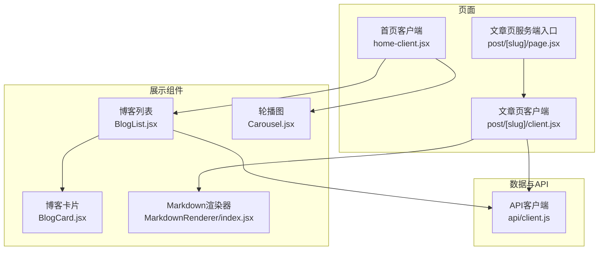
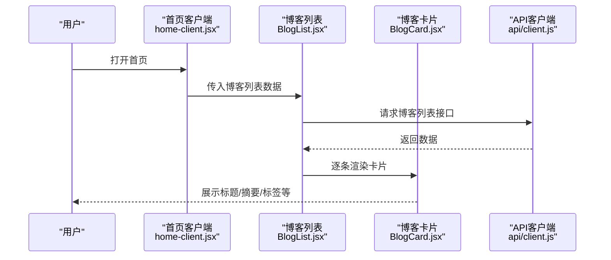
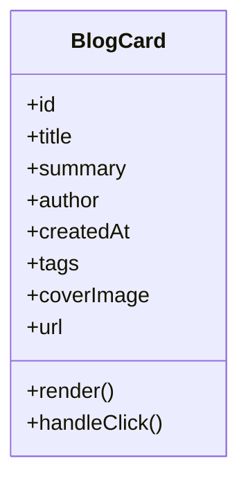
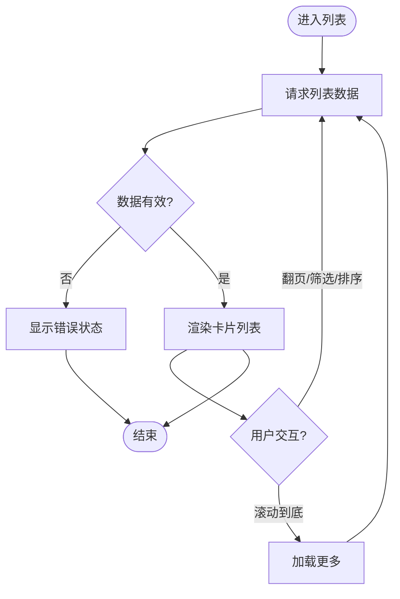
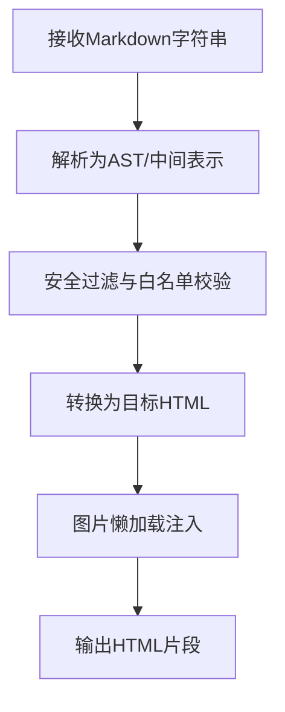
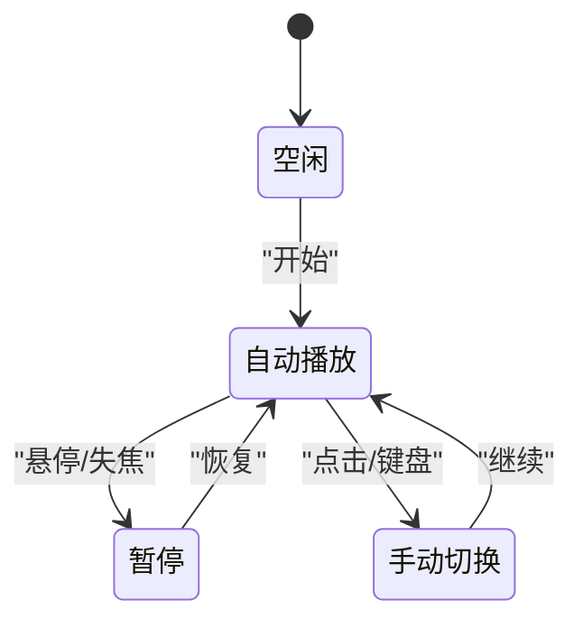
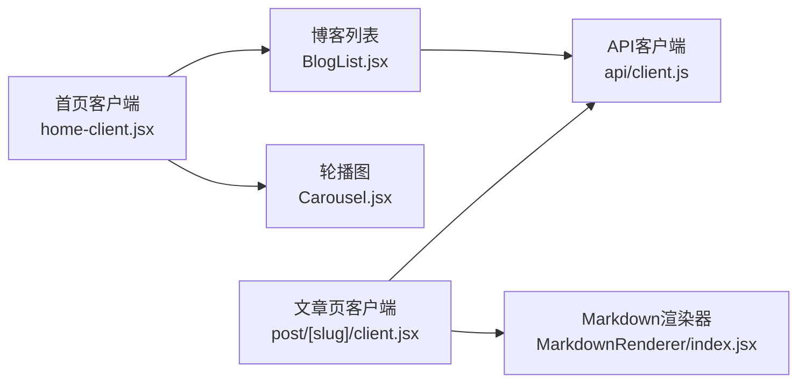

# 内容展示组件

<cite>
**本文引用的文件**
- [BlogCard.jsx](file://src/components/BlogCard/BlogCard.jsx)
- [BlogCard.module.css](file://src/components/BlogCard/BlogCard.module.css)
- [BlogList.jsx](file://src/components/BlogList/BlogList.jsx)
- [BlogList.module.css](file://src/components/BlogList/BlogList.module.css)
- [MarkdownRenderer/index.jsx](file://src/components/MarkdownRenderer/index.jsx)
- [Carousel.jsx](file://src/components/Carousel/Carousel.jsx)
- [Carousel.module.css](file://src/components/Carousel/Carousel.module.css)
- [home-client.jsx](file://src/app/home-client.jsx)
- [post/page.jsx](file://src/app/post/[slug]/page.jsx)
- [post/client.jsx](file://src/app/post/[slug]/client.jsx)
- [api/client.js](file://src/api/client.js)
</cite>

## 目录
1. [简介](#简介)
2. [项目结构](#项目结构)
3. [核心组件](#核心组件)
4. [架构总览](#架构总览)
5. [详细组件分析](#详细组件分析)
6. [依赖关系分析](#依赖关系分析)
7. [性能与懒加载](#性能与懒加载)
8. [可访问性与SEO](#可访问性与seo)
9. [故障排查指南](#故障排查指南)
10. [结论](#结论)

## 简介
本文件面向“内容展示”相关的前端组件，覆盖博客卡片、博客列表、Markdown渲染器与轮播图。文档重点说明：
- 数据绑定方式与字段约定
- 格式化规则（时间、摘要、标签等）
- 交互行为（点击、切换、滚动等）
- 样式定制选项（主题变量、模块CSS）
- Markdown语法支持与安全防护
- 懒加载与性能优化策略
- 可访问性（a11y）与SEO建议

## 项目结构
内容展示组件位于 src/components 下，页面级使用集中在 app 目录中。关键路径如下：
- 组件层：BlogCard、BlogList、MarkdownRenderer、Carousel
- 页面集成：首页客户端 home-client.jsx；文章详情页 post/[slug]/page.jsx 与 client.jsx
- API 客户端：src/api/client.js

图表来源
- [home-client.jsx](file://src/app/home-client.jsx)
- [post/page.jsx](file://src/app/post/[slug]/page.jsx)
- [post/client.jsx](file://src/app/post/[slug]/client.jsx)
- [BlogList.jsx](file://src/components/BlogList/BlogList.jsx)
- [BlogCard.jsx](file://src/components/BlogCard/BlogCard.jsx)
- [Carousel.jsx](file://src/components/Carousel/Carousel.jsx)
- [MarkdownRenderer/index.jsx](file://src/components/MarkdownRenderer/index.jsx)
- [api/client.js](file://src/api/client.js)

章节来源
- [home-client.jsx](file://src/app/home-client.jsx)
- [post/page.jsx](file://src/app/post/[slug]/page.jsx)
- [post/client.jsx](file://src/app/post/[slug]/client.jsx)
- [BlogList.jsx](file://src/components/BlogList/BlogList.jsx)
- [BlogCard.jsx](file://src/components/BlogCard/BlogCard.jsx)
- [Carousel.jsx](file://src/components/Carousel/Carousel.jsx)
- [MarkdownRenderer/index.jsx](file://src/components/MarkdownRenderer/index.jsx)
- [api/client.js](file://src/api/client.js)

## 核心组件
- 博客卡片 BlogCard：用于单条博客的概览展示，包含标题、摘要、作者、时间、标签等。
- 博客列表 BlogList：聚合多条博客卡片，支持分页、筛选、排序与懒加载。
- Markdown渲染器 MarkdownRenderer：将Markdown文本渲染为HTML，并内置安全过滤与图片懒加载。
- 轮播图 Carousel：支持自动播放、手动切换、指示器与键盘导航的图片或内容轮播。

章节来源
- [BlogCard.jsx](file://src/components/BlogCard/BlogCard.jsx)
- [BlogList.jsx](file://src/components/BlogList/BlogList.jsx)
- [MarkdownRenderer/index.jsx](file://src/components/MarkdownRenderer/index.jsx)
- [Carousel.jsx](file://src/components/Carousel/Carousel.jsx)

## 架构总览
整体采用“页面-组件-数据”分层：
- 页面负责获取数据与组装上下文
- 组件专注展示与交互
- API客户端统一封装请求与错误处理

图表来源
- [home-client.jsx](file://src/app/home-client.jsx)
- [BlogList.jsx](file://src/components/BlogList/BlogList.jsx)
- [BlogCard.jsx](file://src/components/BlogCard/BlogCard.jsx)
- [api/client.js](file://src/api/client.js)

## 详细组件分析

### 博客卡片 BlogCard
职责与数据绑定
- 输入数据字段（示例键名，具体以实际实现为准）：
  - id、title、summary、author、createdAt、tags、coverImage、url
- 格式化规则：
  - 时间：相对时间或本地化格式
  - 摘要：截断与省略号处理
  - 标签：数组转标签集合
- 交互行为：
  - 点击跳转至文章详情
  - 悬停高亮与阴影效果
- 样式定制：
  - 通过模块CSS类名覆盖
  - 支持主题变量（颜色、圆角、间距）

图表来源
- [BlogCard.jsx](file://src/components/BlogCard/BlogCard.jsx)
- [BlogCard.module.css](file://src/components/BlogCard/BlogCard.module.css)

章节来源
- [BlogCard.jsx](file://src/components/BlogCard/BlogCard.jsx)
- [BlogCard.module.css](file://src/components/BlogCard/BlogCard.module.css)

### 博客列表 BlogList
职责与数据绑定
- 输入数据：
  - items：博客条目数组
  - pagination：分页信息（当前页、总数、每页数量）
  - filters：筛选条件（分类、标签、关键词）
  - sort：排序规则（时间、热度、评分）
- 交互行为：
  - 切换页码触发重新拉取
  - 筛选/排序变化时刷新列表
  - 滚动到底部触发下一页（可选）
- 性能优化：
  - 虚拟滚动或按需加载
  - 防抖搜索与节流滚动
  - 骨架屏占位

图表来源
- [BlogList.jsx](file://src/components/BlogList/BlogList.jsx)
- [BlogList.module.css](file://src/components/BlogList/BlogList.module.css)
- [api/client.js](file://src/api/client.js)

章节来源
- [BlogList.jsx](file://src/components/BlogList/BlogList.jsx)
- [BlogList.module.css](file://src/components/BlogList/BlogList.module.css)
- [api/client.js](file://src/api/client.js)

### Markdown渲染器 MarkdownRenderer
职责与安全
- 语法支持：
  - 基础Markdown：标题、段落、列表、链接、图片、代码块、表格、引用等
  - 扩展语法（若启用）：数学公式、流程图、任务列表等
- 安全过滤机制：
  - 白名单允许的HTML标签与属性
  - 移除危险协议（如 javascript:）、内联事件处理器
  - 对图片与外链进行安全校验与目标控制
- 图片优化：
  - 懒加载与占位图
  - 尺寸自适应与压缩提示
- 可访问性：
  - 为图片提供alt描述
  - 代码块提供语言标注与复制按钮（可选）

图表来源
- [MarkdownRenderer/index.jsx](file://src/components/MarkdownRenderer/index.jsx)

章节来源
- [MarkdownRenderer/index.jsx](file://src/components/MarkdownRenderer/index.jsx)

### 轮播图 Carousel
职责与交互
- 数据模型：
  - slides：数组项（图片URL、标题、描述、链接）
  - options：自动播放间隔、循环模式、指示器可见性、过渡动画时长
- 交互行为：
  - 自动播放与暂停（鼠标悬停/聚焦）
  - 左右箭头与底部指示器切换
  - 键盘方向键导航
- 样式定制：
  - 容器宽高比、指示器位置与样式
  - 过渡动画与遮罩效果

图表来源
- [Carousel.jsx](file://src/components/Carousel/Carousel.jsx)
- [Carousel.module.css](file://src/components/Carousel/Carousel.module.css)

章节来源
- [Carousel.jsx](file://src/components/Carousel/Carousel.jsx)
- [Carousel.module.css](file://src/components/Carousel/Carousel.module.css)

## 依赖关系分析
- 页面到组件：
  - 首页客户端调用博客列表与轮播图
  - 文章页客户端调用Markdown渲染器
- 组件到API：
  - 博客列表在初始化与分页时调用API客户端
  - 文章页在获取详情时调用API客户端

图表来源
- [home-client.jsx](file://src/app/home-client.jsx)
- [post/client.jsx](file://src/app/post/[slug]/client.jsx)
- [BlogList.jsx](file://src/components/BlogList/BlogList.jsx)
- [Carousel.jsx](file://src/components/Carousel/Carousel.jsx)
- [MarkdownRenderer/index.jsx](file://src/components/MarkdownRenderer/index.jsx)
- [api/client.js](file://src/api/client.js)

章节来源
- [home-client.jsx](file://src/app/home-client.jsx)
- [post/client.jsx](file://src/app/post/[slug]/client.jsx)
- [BlogList.jsx](file://src/components/BlogList/BlogList.jsx)
- [Carousel.jsx](file://src/components/Carousel/Carousel.jsx)
- [MarkdownRenderer/index.jsx](file://src/components/MarkdownRenderer/index.jsx)
- [api/client.js](file://src/api/client.js)

## 性能与懒加载
- 列表与卡片
  - 使用 IntersectionObserver 实现滚动懒加载
  - 图片设置 loading="lazy" 与占位图
  - 列表项虚拟化（大数据量场景）
- 渲染与计算
  - 防抖搜索与节流滚动
  - 避免不必要的重渲染（memo化、稳定key）
- 网络与缓存
  - 请求去重与缓存策略（按查询参数）
  - 失败重试与降级展示
- 资源体积
  - 按需引入Markdown扩展插件
  - 图片CDN与压缩

[本节为通用指导，不直接分析具体文件]

## 可访问性与SEO
- 可访问性（a11y）
  - 所有交互元素具备语义化标签与aria属性
  - 键盘可达与焦点管理（轮播图、弹窗）
  - 图片alt文本与对比度达标
- SEO优化
  - 服务端渲染首屏内容（Next.js App Router）
  - 结构化数据（JSON-LD）与元信息
  - 静态资源预加载与关键CSS内联

[本节为通用指导，不直接分析具体文件]

## 故障排查指南
- 常见问题
  - 列表为空：检查API响应结构与分页参数
  - 图片不显示：确认URL安全协议与跨域策略
  - Markdown渲染异常：检查白名单配置与非法标签
  - 轮播图卡顿：减少同时渲染数量与动画复杂度
- 调试建议
  - 打印数据流与状态变更
  - 使用浏览器开发者工具观察网络与渲染时序
  - 逐步禁用扩展功能定位问题

[本节为通用指导，不直接分析具体文件]

## 结论
内容展示组件围绕“数据-渲染-交互-优化”形成闭环。通过明确的数据契约、严格的安全过滤与完善的可访问性保障，可在保证性能的同时提升用户体验与SEO表现。建议在后续迭代中持续完善虚拟滚动、缓存策略与无障碍测试，确保大规模内容与多端适配下的稳定性。