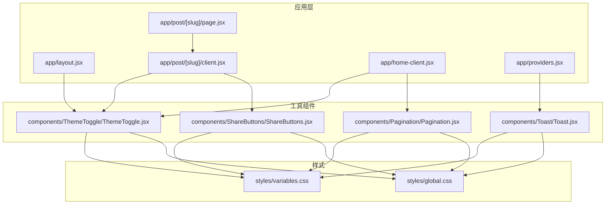
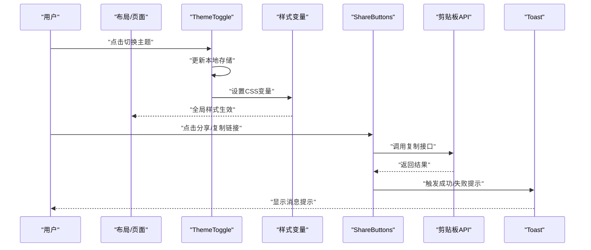
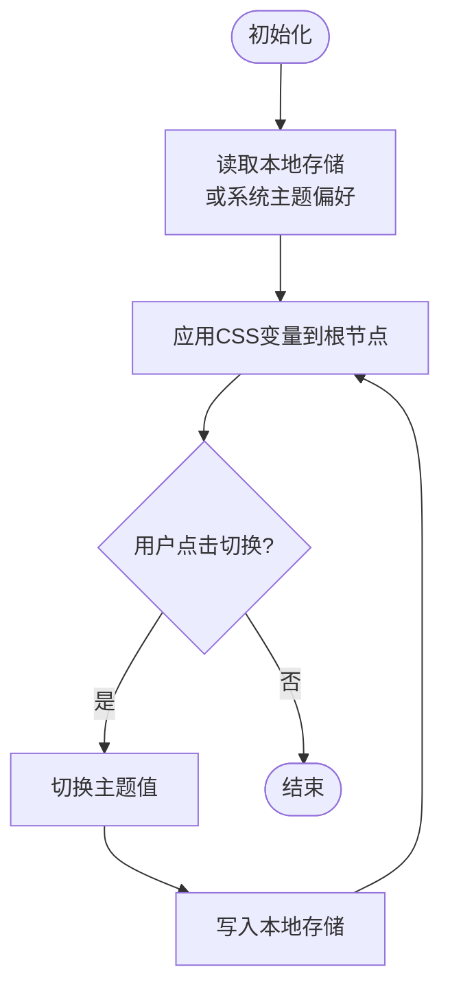
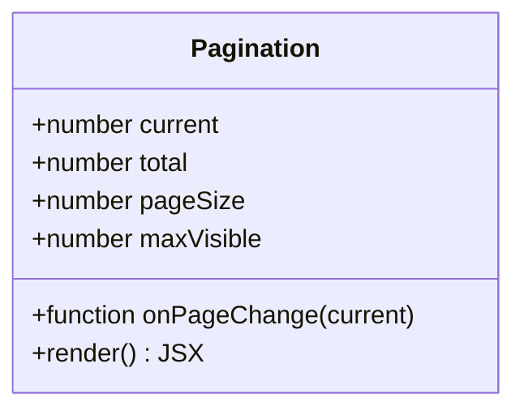
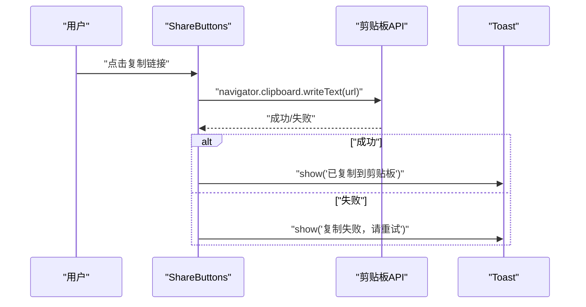
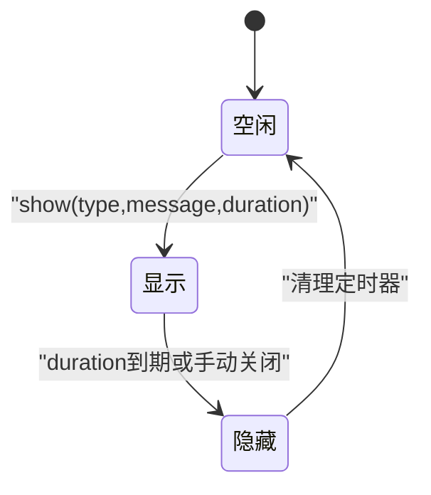
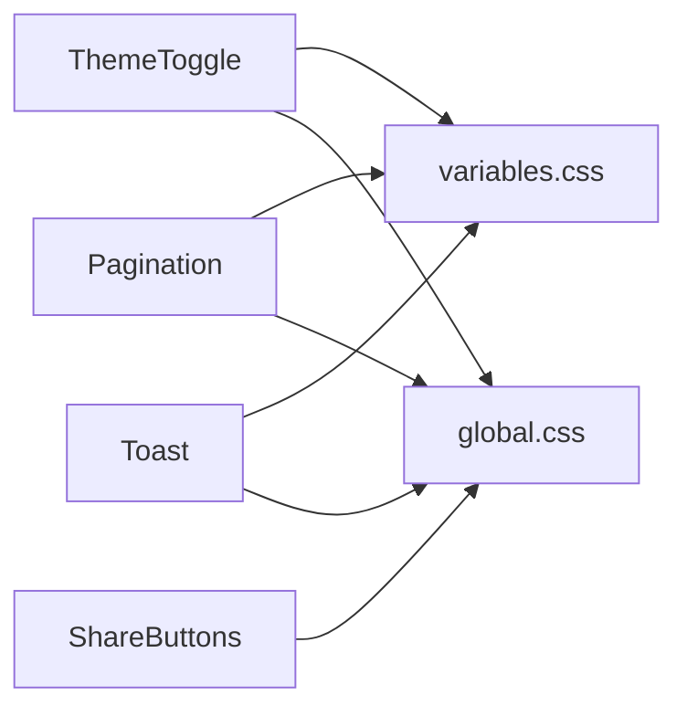

# 工具组件

<cite>
**本文引用的文件**   
- [ThemeToggle.jsx](file://src/components/ThemeToggle/ThemeToggle.jsx)
- [ThemeToggle.module.css](file://src/components/ThemeToggle/ThemeToggle.module.css)
- [Pagination.jsx](file://src/components/Pagination/Pagination.jsx)
- [Pagination.module.css](file://src/components/Pagination/Pagination.module.css)
- [ShareButtons.jsx](file://src/components/ShareButtons/ShareButtons.jsx)
- [ShareButtons.module.css](file://src/components/ShareButtons/ShareButtons.module.css)
- [Toast.jsx](file://src/components/Toast/Toast.jsx)
- [Toast.module.css](file://src/components/Toast/Toast.module.css)
- [layout.jsx](file://src/app/layout.jsx)
- [post/page.jsx](file://src/app/post/[slug]/page.jsx)
- [post/client.jsx](file://src/app/post/[slug]/client.jsx)
- [home-client.jsx](file://src/app/home-client.jsx)
- [providers.jsx](file://src/app/providers.jsx)
- [variables.css](file://src/styles/variables.css)
- [global.css](file://src/styles/global.css)
</cite>

## 目录
1. [简介](#简介)
2. [项目结构](#项目结构)
3. [核心组件](#核心组件)
4. [架构总览](#架构总览)
5. [详细组件分析](#详细组件分析)
6. [依赖关系分析](#依赖关系分析)
7. [性能考虑](#性能考虑)
8. [故障排查指南](#故障排查指南)
9. [结论](#结论)
10. [附录](#附录)

## 简介
本章节面向通用工具组件，聚焦以下四个可复用能力：主题切换器(ThemeToggle)、分页器(Pagination)、分享按钮(ShareButtons)、消息提示(Toast)。文档将说明每个组件的配置项、样式定制与扩展方式，给出集成示例路径、响应式设计与跨浏览器兼容性要点、性能优化策略、测试方法与调试技巧，以及贡献规范与最佳实践。

## 项目结构
工具组件位于 src/components 下，采用“按功能分目录 + 模块级 CSS”的组织方式；页面通过 Next.js App Router 的 layout 和 page 组合使用这些组件。

图表来源
- [layout.jsx](file://src/app/layout.jsx)
- [post/page.jsx](file://src/app/post/[slug]/page.jsx)
- [post/client.jsx](file://src/app/post/[slug]/client.jsx)
- [home-client.jsx](file://src/app/home-client.jsx)
- [providers.jsx](file://src/app/providers.jsx)
- [ThemeToggle.jsx](file://src/components/ThemeToggle/ThemeToggle.jsx)
- [Pagination.jsx](file://src/components/Pagination/Pagination.jsx)
- [ShareButtons.jsx](file://src/components/ShareButtons/ShareButtons.jsx)
- [Toast.jsx](file://src/components/Toast/Toast.jsx)
- [variables.css](file://src/styles/variables.css)
- [global.css](file://src/styles/global.css)

章节来源
- [layout.jsx](file://src/app/layout.jsx)
- [post/page.jsx](file://src/app/post/[slug]/page.jsx)
- [post/client.jsx](file://src/app/post/[slug]/client.jsx)
- [home-client.jsx](file://src/app/home-client.jsx)
- [providers.jsx](file://src/app/providers.jsx)

## 核心组件
本节概述四个工具组件的职责与典型用法位置，便于快速定位与集成。

- 主题切换器(ThemeToggle)
  - 职责：在浅色/深色主题间切换，持久化用户偏好到本地存储，并通过 CSS 变量驱动全局样式。
  - 常见集成：布局或导航区域，如首页客户端组件或文章页客户端组件。
  - 参考路径：[ThemeToggle.jsx](file://src/components/ThemeToggle/ThemeToggle.jsx)、[ThemeToggle.module.css](file://src/components/ThemeToggle/ThemeToggle.module.css)

- 分页器(Pagination)
  - 职责：根据当前页码与总页数渲染页码列表，支持跳转与边界控制。
  - 常见集成：列表页或搜索结果页，如首页客户端组件。
  - 参考路径：[Pagination.jsx](file://src/components/Pagination/Pagination.jsx)、[Pagination.module.css](file://src/components/Pagination/Pagination.module.css)

- 分享按钮(ShareButtons)
  - 职责：提供多平台分享入口（如微信、微博、Twitter/X、Facebook、LinkedIn），并处理复制链接等辅助操作。
  - 常见集成：文章详情页客户端组件。
  - 参考路径：[ShareButtons.jsx](file://src/components/ShareButtons/ShareButtons.jsx)、[ShareButtons.module.css](file://src/components/ShareButtons/ShareButtons.module.css)

- 消息提示(Toast)
  - 职责：以轻量浮层反馈成功、失败、警告等信息，支持自动消失与手动关闭。
  - 常见集成：全局 Provider 或业务逻辑触发处。
  - 参考路径：[Toast.jsx](file://src/components/Toast/Toast.jsx)、[Toast.module.css](file://src/components/Toast/Toast.module.css)

章节来源
- [ThemeToggle.jsx](file://src/components/ThemeToggle/ThemeToggle.jsx)
- [ThemeToggle.module.css](file://src/components/ThemeToggle/ThemeToggle.module.css)
- [Pagination.jsx](file://src/components/Pagination/Pagination.jsx)
- [Pagination.module.css](file://src/components/Pagination/Pagination.module.css)
- [ShareButtons.jsx](file://src/components/ShareButtons/ShareButtons.jsx)
- [ShareButtons.module.css](file://src/components/ShareButtons/ShareButtons.module.css)
- [Toast.jsx](file://src/components/Toast/Toast.jsx)
- [Toast.module.css](file://src/components/Toast/Toast.module.css)

## 架构总览
下图展示工具组件与应用层的交互关系及数据流向。

图表来源
- [ThemeToggle.jsx](file://src/components/ThemeToggle/ThemeToggle.jsx)
- [ShareButtons.jsx](file://src/components/ShareButtons/ShareButtons.jsx)
- [Toast.jsx](file://src/components/Toast/Toast.jsx)
- [variables.css](file://src/styles/variables.css)
- [global.css](file://src/styles/global.css)

## 详细组件分析

### 主题切换器(ThemeToggle)
- 配置选项
  - 是否启用动画过渡
  - 图标主题映射（太阳/月亮）
  - 本地存储键名（默认建议为 theme）
- 样式定制
  - 通过 CSS 变量覆盖颜色、尺寸与圆角
  - 模块级样式类名用于悬停、激活态
- 扩展能力
  - 新增系统主题（如高对比度）
  - 接入第三方主题库或动态加载样式
- 响应式与兼容
  - 基于 prefers-color-scheme 检测初始主题
  - 对不支持 localStorage 的环境降级为内存状态
- 性能考量
  - 避免频繁写入本地存储，合并状态变更
  - 仅更新必要的 CSS 变量，减少重排
- 集成示例
  - 在布局或首页客户端组件中引入并使用
  - 参考路径：[layout.jsx](file://src/app/layout.jsx)、[home-client.jsx](file://src/app/home-client.jsx)

图表来源
- [ThemeToggle.jsx](file://src/components/ThemeToggle/ThemeToggle.jsx)
- [variables.css](file://src/styles/variables.css)
- [global.css](file://src/styles/global.css)

章节来源
- [ThemeToggle.jsx](file://src/components/ThemeToggle/ThemeToggle.jsx)
- [ThemeToggle.module.css](file://src/components/ThemeToggle/ThemeToggle.module.css)
- [layout.jsx](file://src/app/layout.jsx)
- [home-client.jsx](file://src/app/home-client.jsx)
- [variables.css](file://src/styles/variables.css)
- [global.css](file://src/styles/global.css)

### 分页器(Pagination)
- 配置选项
  - 当前页码 current
  - 总页数 total
  - 每页大小 pageSize（可选）
  - 最大可见页码数 maxVisible
  - 是否允许跳转到首尾页
  - 自定义回调 onPageChange(current)
- 样式定制
  - 通过模块样式类名调整间距、字号、选中态
  - 结合 CSS 变量实现主题适配
- 扩展能力
  - 支持 URL 同步（history.pushState）
  - 支持键盘导航与无障碍标签
- 响应式与兼容
  - 在小屏上隐藏中间省略号或简化显示
  - 兼容旧版浏览器的事件绑定
- 性能考量
  - 使用受控模式，避免不必要的重渲染
  - 大总数时惰性计算页码范围
- 集成示例
  - 在首页客户端组件中传入 current 与 total，监听 onPageChange
  - 参考路径：[home-client.jsx](file://src/app/home-client.jsx)

图表来源
- [Pagination.jsx](file://src/components/Pagination/Pagination.jsx)
- [Pagination.module.css](file://src/components/Pagination/Pagination.module.css)

章节来源
- [Pagination.jsx](file://src/components/Pagination/Pagination.jsx)
- [Pagination.module.css](file://src/components/Pagination/Pagination.module.css)
- [home-client.jsx](file://src/app/home-client.jsx)

### 分享按钮(ShareButtons)
- 配置选项
  - 标题 title
  - 链接 url
  - 描述 description（可选）
  - 平台列表 platforms（如 weixin, weibo, twitter, facebook, linkedin）
  - 是否显示复制链接按钮
- 样式定制
  - 各平台图标与颜色可通过模块样式覆盖
  - 支持主题变量切换
- 扩展能力
  - 新增平台分享入口
  - 自定义分享弹窗或原生 Web Share API 回退
- 响应式与兼容
  - 移动端优先使用 Web Share API，桌面端回退到外链
  - 对不支持剪贴板的浏览器进行降级提示
- 性能考量
  - 延迟加载外部脚本或图标资源
  - 避免重复创建分享链接对象
- 集成示例
  - 在文章详情客户端组件中传入文章信息
  - 参考路径：[post/client.jsx](file://src/app/post/[slug]/client.jsx)

图表来源
- [ShareButtons.jsx](file://src/components/ShareButtons/ShareButtons.jsx)
- [Toast.jsx](file://src/components/Toast/Toast.jsx)

章节来源
- [ShareButtons.jsx](file://src/components/ShareButtons/ShareButtons.jsx)
- [ShareButtons.module.css](file://src/components/ShareButtons/ShareButtons.module.css)
- [post/client.jsx](file://src/app/post/[slug]/client.jsx)

### 消息提示(Toast)
- 配置选项
  - 类型 type（success、error、warning、info）
  - 内容 message
  - 持续时间 duration（毫秒）
  - 是否可关闭 closable
  - 位置 position（top-right、bottom-center 等）
- 样式定制
  - 通过模块样式类名与 CSS 变量定制背景、边框、阴影
- 扩展能力
  - 支持队列管理（同时显示多条）
  - 支持国际化文案
- 响应式与兼容
  - 小屏设备调整位置与宽度
  - 对不支持某些 CSS 属性的浏览器提供降级
- 性能考量
  - 使用 requestAnimationFrame 或节流避免频繁重绘
  - 自动销毁定时器需清理，防止内存泄漏
- 集成示例
  - 在全局 Provider 中注入 toast 方法，业务组件直接调用
  - 参考路径：[providers.jsx](file://src/app/providers.jsx)

图表来源
- [Toast.jsx](file://src/components/Toast/Toast.jsx)
- [Toast.module.css](file://src/components/Toast/Toast.module.css)

章节来源
- [Toast.jsx](file://src/components/Toast/Toast.jsx)
- [Toast.module.css](file://src/components/Toast/Toast.module.css)
- [providers.jsx](file://src/app/providers.jsx)

## 依赖关系分析
- 组件内聚性
  - 每个工具组件独立维护自身状态与样式，降低耦合
- 外部依赖
  - 主题切换依赖 CSS 变量与本地存储
  - 分享按钮依赖剪贴板 API 或 Web Share API
  - Toast 依赖 DOM 渲染与定时器
- 可能的循环依赖
  - 当前未见循环引用；若未来引入共享上下文，需注意解耦

图表来源
- [ThemeToggle.jsx](file://src/components/ThemeToggle/ThemeToggle.jsx)
- [Pagination.jsx](file://src/components/Pagination/Pagination.jsx)
- [ShareButtons.jsx](file://src/components/ShareButtons/ShareButtons.jsx)
- [Toast.jsx](file://src/components/Toast/Toast.jsx)
- [variables.css](file://src/styles/variables.css)
- [global.css](file://src/styles/global.css)

章节来源
- [ThemeToggle.jsx](file://src/components/ThemeToggle/ThemeToggle.jsx)
- [Pagination.jsx](file://src/components/Pagination/Pagination.jsx)
- [ShareButtons.jsx](file://src/components/ShareButtons/ShareButtons.jsx)
- [Toast.jsx](file://src/components/Toast/Toast.jsx)
- [variables.css](file://src/styles/variables.css)
- [global.css](file://src/styles/global.css)

## 性能考虑
- 主题切换
  - 批量更新 CSS 变量，避免多次强制回流
  - 仅在主题变化时写入本地存储
- 分页器
  - 使用受控组件，父组件负责数据源与页码计算
  - 大总数场景下只渲染可见页码
- 分享按钮
  - 懒加载平台图标资源
  - 复制操作失败时快速回退，不阻塞主线程
- Toast
  - 使用防抖/节流合并连续提示
  - 确保定时器在卸载时清理，避免内存泄漏

## 故障排查指南
- 主题未生效
  - 检查 CSS 变量是否正确挂载到根节点
  - 确认本地存储键名一致且未被拦截
  - 参考路径：[ThemeToggle.jsx](file://src/components/ThemeToggle/ThemeToggle.jsx)、[variables.css](file://src/styles/variables.css)
- 分页异常
  - 校验 current 与 total 的边界条件
  - 检查 onPageChange 回调是否更新父组件状态
  - 参考路径：[Pagination.jsx](file://src/components/Pagination/Pagination.jsx)
- 分享失败
  - 在非安全上下文（非 HTTPS）下剪贴板 API 不可用，需回退方案
  - 检查分享链接参数编码是否正确
  - 参考路径：[ShareButtons.jsx](file://src/components/ShareButtons/ShareButtons.jsx)
- Toast 不消失或重复出现
  - 检查定时器 ID 管理与清理逻辑
  - 确认同一时刻的提示队列上限
  - 参考路径：[Toast.jsx](file://src/components/Toast/Toast.jsx)

章节来源
- [ThemeToggle.jsx](file://src/components/ThemeToggle/ThemeToggle.jsx)
- [Pagination.jsx](file://src/components/Pagination/Pagination.jsx)
- [ShareButtons.jsx](file://src/components/ShareButtons/ShareButtons.jsx)
- [Toast.jsx](file://src/components/Toast/Toast.jsx)
- [variables.css](file://src/styles/variables.css)

## 结论
这四个工具组件具备清晰的职责边界与良好的可扩展性。通过 CSS 变量与模块样式实现主题与外观定制，结合受控模式与合理的生命周期管理保证性能与稳定性。建议在项目中统一通过 Provider 注入 Toast，并在布局层集中管理主题，以提升一致性与维护性。

## 附录
- 集成步骤建议
  - 在布局或 Providers 中初始化 Toast
  - 在首页或文章页客户端组件中引入 ThemeToggle 与 Pagination
  - 在文章详情客户端组件中引入 ShareButtons
- 贡献规范与最佳实践
  - 组件命名与目录结构保持一致
  - 所有对外属性需提供默认值与类型约束
  - 样式尽量使用 CSS 变量与模块类名，避免全局污染
  - 增加最小可用示例与注释，便于他人理解与复用
  - 提交前运行基础测试与lint检查，确保无控制台错误