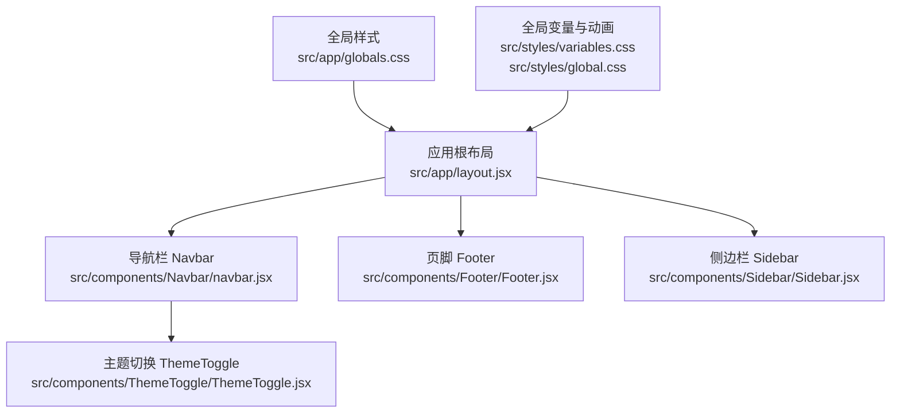
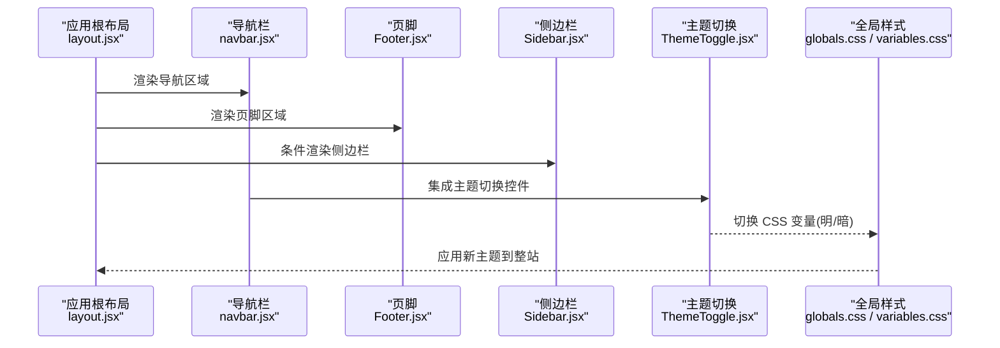
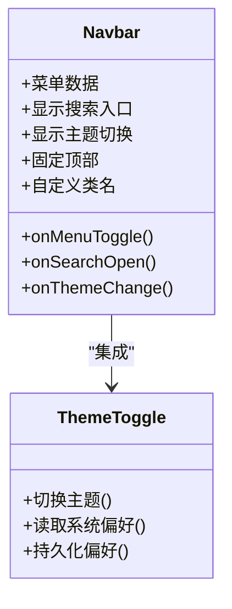
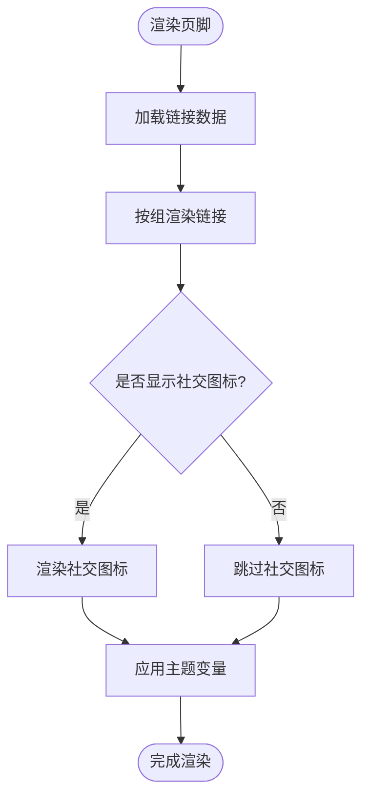
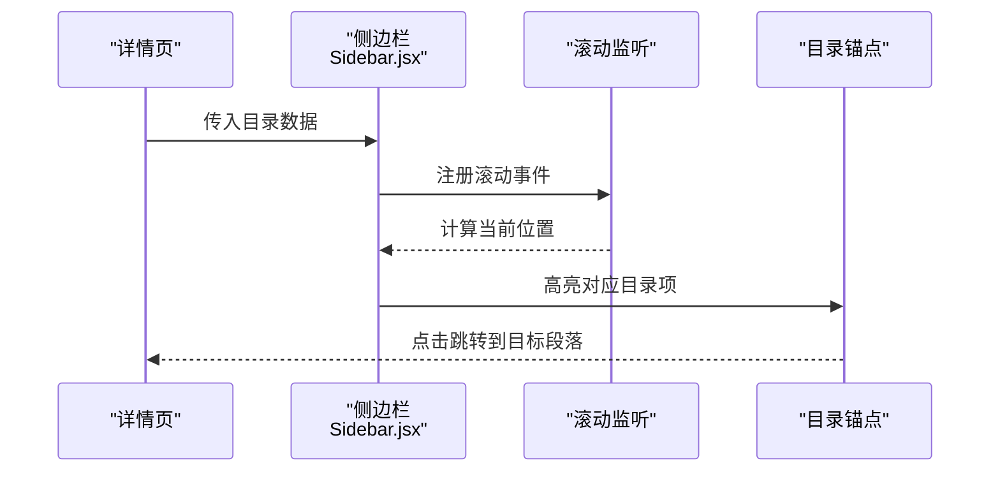
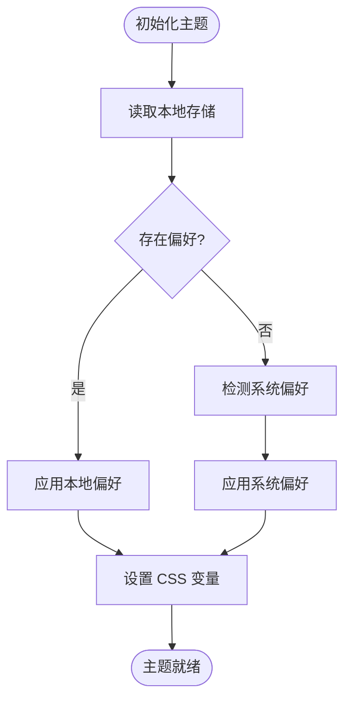
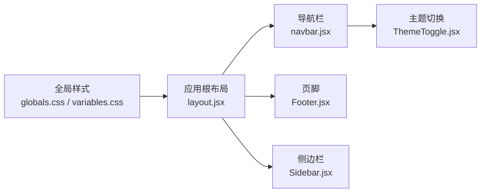

# 布局组件

<cite>
**本文引用的文件**   
- [src/app/layout.jsx](file://src/app/layout.jsx)
- [src/components/Navbar/navbar.jsx](file://src/components/Navbar/navbar.jsx)
- [src/components/Navbar/Navbar.module.css](file://src/components/Navbar/Navbar.module.css)
- [src/components/Footer/Footer.jsx](file://src/components/Footer/Footer.jsx)
- [src/components/Footer/Footer.module.css](file://src/components/Footer/Footer.module.css)
- [src/components/Sidebar/Sidebar.jsx](file://src/components/Sidebar/Sidebar.jsx)
- [src/components/Sidebar/Sidebar.module.css](file://src/components/Sidebar/Sidebar.module.css)
- [src/components/ThemeToggle/ThemeToggle.jsx](file://src/components/ThemeToggle/ThemeToggle.jsx)
- [src/components/ThemeToggle/ThemeToggle.module.css](file://src/components/ThemeToggle/ThemeToggle.module.css)
- [src/styles/global.css](file://src/styles/global.css)
- [src/styles/variables.css](file://src/styles/variables.css)
- [src/app/globals.css](file://src/app/globals.css)
</cite>

## 目录
1. [简介](#简介)
2. [项目结构](#项目结构)
3. [核心组件](#核心组件)
4. [架构总览](#架构总览)
5. [详细组件分析](#详细组件分析)
6. [依赖关系分析](#依赖关系分析)
7. [性能考虑](#性能考虑)
8. [故障排查指南](#故障排查指南)
9. [结论](#结论)
10. [附录](#附录)

## 简介
本章节面向使用与二次开发该项目的开发者，系统化梳理基础布局组件：导航栏（Navbar）、页脚（Footer）、侧边栏（Sidebar）的功能特性、配置项、事件处理、样式定制与响应式策略。同时说明主题支持与暗黑模式切换机制、国际化支持现状与扩展建议，以及布局组件的性能优化策略与最佳实践。文档以“渐进式”的方式组织内容，既适合快速上手，也便于深入查阅实现细节。

## 项目结构
布局相关代码主要分布在以下位置：
- 应用级布局入口：src/app/layout.jsx
- 导航栏：src/components/Navbar/*
- 页脚：src/components/Footer/*
- 侧边栏：src/components/Sidebar/*
- 主题切换：src/components/ThemeToggle/*
- 全局样式与变量：src/styles/* 与 src/app/globals.css

图表来源
- [src/app/layout.jsx](file://src/app/layout.jsx)
- [src/components/Navbar/navbar.jsx](file://src/components/Navbar/navbar.jsx)
- [src/components/Footer/Footer.jsx](file://src/components/Footer/Footer.jsx)
- [src/components/Sidebar/Sidebar.jsx](file://src/components/Sidebar/Sidebar.jsx)
- [src/components/ThemeToggle/ThemeToggle.jsx](file://src/components/ThemeToggle/ThemeToggle.jsx)
- [src/app/globals.css](file://src/app/globals.css)
- [src/styles/variables.css](file://src/styles/variables.css)
- [src/styles/global.css](file://src/styles/global.css)

章节来源
- [src/app/layout.jsx](file://src/app/layout.jsx)
- [src/components/Navbar/navbar.jsx](file://src/components/Navbar/navbar.jsx)
- [src/components/Footer/Footer.jsx](file://src/components/Footer/Footer.jsx)
- [src/components/Sidebar/Sidebar.jsx](file://src/components/Sidebar/Sidebar.jsx)
- [src/components/ThemeToggle/ThemeToggle.jsx](file://src/components/ThemeToggle/ThemeToggle.jsx)
- [src/app/globals.css](file://src/app/globals.css)
- [src/styles/variables.css](file://src/styles/variables.css)
- [src/styles/global.css](file://src/styles/global.css)

## 核心组件
本节概述各布局组件的职责与交互边界，为后续详细分析奠定基础。

- 导航栏（Navbar）
  - 职责：提供站点顶部导航、品牌标识、主菜单、搜索入口、主题切换等。
  - 关键能力：移动端折叠菜单、路由跳转、主题切换集成、可访问性（键盘导航、焦点管理）。
  - 样式：模块级 CSS 类名，支持媒体查询与主题变量。
  - 事件：菜单展开/收起、主题切换回调、搜索触发等。

- 页脚（Footer）
  - 职责：展示版权信息、链接列表、社交图标、版本信息等。
  - 关键能力：多列布局、链接分组、响应式堆叠。
  - 样式：基于 CSS 变量与模块样式，适配暗色主题。
  - 事件：点击链接跳转、外部链接安全打开。

- 侧边栏（Sidebar）
  - 职责：在文章或详情页面提供目录、推荐内容、标签云等辅助导航。
  - 关键能力：吸顶定位、滚动监听高亮、移动端抽屉式展开。
  - 样式：宽度自适应、阴影与分隔线、主题变量驱动。
  - 事件：目录项点击、滚动高亮更新。

- 主题切换（ThemeToggle）
  - 职责：提供明/暗主题切换按钮，持久化用户偏好。
  - 关键能力：读取系统偏好、本地存储持久化、CSS 变量切换。
  - 事件：主题变更回调、状态同步。

章节来源
- [src/components/Navbar/navbar.jsx](file://src/components/Navbar/navbar.jsx)
- [src/components/Navbar/Navbar.module.css](file://src/components/Navbar/Navbar.module.css)
- [src/components/Footer/Footer.jsx](file://src/components/Footer/Footer.jsx)
- [src/components/Footer/Footer.module.css](file://src/components/Footer/Footer.module.css)
- [src/components/Sidebar/Sidebar.jsx](file://src/components/Sidebar/Sidebar.jsx)
- [src/components/Sidebar/Sidebar.module.css](file://src/components/Sidebar/Sidebar.module.css)
- [src/components/ThemeToggle/ThemeToggle.jsx](file://src/components/ThemeToggle/ThemeToggle.jsx)
- [src/components/ThemeToggle/ThemeToggle.module.css](file://src/components/ThemeToggle/ThemeToggle.module.css)

## 架构总览
布局组件通过应用根布局组合，形成稳定的页面骨架。主题系统通过 CSS 变量与主题切换组件联动，全局样式统一注入。

图表来源
- [src/app/layout.jsx](file://src/app/layout.jsx)
- [src/components/Navbar/navbar.jsx](file://src/components/Navbar/navbar.jsx)
- [src/components/Footer/Footer.jsx](file://src/components/Footer/Footer.jsx)
- [src/components/Sidebar/Sidebar.jsx](file://src/components/Sidebar/Sidebar.jsx)
- [src/components/ThemeToggle/ThemeToggle.jsx](file://src/components/ThemeToggle/ThemeToggle.jsx)
- [src/app/globals.css](file://src/app/globals.css)
- [src/styles/variables.css](file://src/styles/variables.css)

## 详细组件分析

### 导航栏（Navbar）
- 功能特性
  - 顶部固定或粘性定位，品牌区与导航菜单分离。
  - 移动端汉堡菜单，点击展开/收起。
  - 与主题切换组件集成，支持一键切换明/暗主题。
  - 支持键盘可达性与屏幕阅读器友好提示。
- 配置选项（props）
  - 菜单数据：用于动态生成导航项。
  - 是否显示搜索入口：控制搜索模态框触发。
  - 是否显示主题切换：控制主题按钮显隐。
  - 是否固定顶部：控制定位行为。
  - 自定义类名：覆盖默认样式。
- 事件处理
  - onMenuToggle：菜单展开/收起回调。
  - onSearchOpen：打开搜索模态框。
  - onThemeChange：主题切换回调（由内部主题组件驱动）。
- 样式定制
  - 使用模块样式类名，结合 CSS 变量实现主题化。
  - 支持媒体查询在不同断点下调整布局与字号。
- 响应式设计
  - 小屏隐藏完整菜单，显示汉堡按钮；大屏显示完整导航。
  - 高度与间距随断点缩放，保证可读性与触控体验。
- 示例用法（路径参考）
  - 在应用根布局中引入并包裹页面内容：[src/app/layout.jsx](file://src/app/layout.jsx)
  - 导航栏组件定义与样式：[src/components/Navbar/navbar.jsx](file://src/components/Navbar/navbar.jsx)、[src/components/Navbar/Navbar.module.css](file://src/components/Navbar/Navbar.module.css)

图表来源
- [src/components/Navbar/navbar.jsx](file://src/components/Navbar/navbar.jsx)
- [src/components/ThemeToggle/ThemeToggle.jsx](file://src/components/ThemeToggle/ThemeToggle.jsx)

章节来源
- [src/components/Navbar/navbar.jsx](file://src/components/Navbar/navbar.jsx)
- [src/components/Navbar/Navbar.module.css](file://src/components/Navbar/Navbar.module.css)
- [src/components/ThemeToggle/ThemeToggle.jsx](file://src/components/ThemeToggle/ThemeToggle.jsx)
- [src/components/ThemeToggle/ThemeToggle.module.css](file://src/components/ThemeToggle/ThemeToggle.module.css)

### 页脚（Footer）
- 功能特性
  - 多列布局，包含站点信息、快速链接、社交图标等。
  - 链接分组清晰，支持外部链接安全打开。
  - 适配暗色主题，保持对比度与可读性。
- 配置选项（props）
  - 链接数据：用于动态渲染链接组。
  - 版权文本：支持多语言占位符（可扩展）。
  - 是否显示社交图标：控制社交区块显隐。
  - 自定义类名：覆盖默认样式。
- 事件处理
  - onClickLink：链接点击回调（可用于埋点或拦截）。
- 样式定制
  - 模块样式类名，配合 CSS 变量实现主题化。
  - 网格布局在不同断点下自动换行与对齐。
- 响应式设计
  - 小屏单列堆叠，中屏两列，大屏三列及以上。
- 示例用法（路径参考）
  - 在应用根布局底部引入：[src/app/layout.jsx](file://src/app/layout.jsx)
  - 页脚组件定义与样式：[src/components/Footer/Footer.jsx](file://src/components/Footer/Footer.jsx)、[src/components/Footer/Footer.module.css](file://src/components/Footer/Footer.module.css)

图表来源
- [src/components/Footer/Footer.jsx](file://src/components/Footer/Footer.jsx)
- [src/components/Footer/Footer.module.css](file://src/components/Footer/Footer.module.css)

章节来源
- [src/components/Footer/Footer.jsx](file://src/components/Footer/Footer.jsx)
- [src/components/Footer/Footer.module.css](file://src/components/Footer/Footer.module.css)

### 侧边栏（Sidebar）
- 功能特性
  - 提供目录导航、推荐内容、标签云等辅助信息。
  - 吸顶定位，滚动时保持可见；移动端以抽屉形式出现。
  - 滚动监听实现当前目录项高亮。
- 配置选项（props）
  - 目录数据：标题与锚点映射。
  - 是否吸顶：控制 sticky 行为。
  - 是否显示推荐内容：控制推荐区块显隐。
  - 自定义类名：覆盖默认样式。
- 事件处理
  - onAnchorClick：目录项点击回调。
  - onScrollUpdate：滚动高亮更新回调。
- 样式定制
  - 模块样式类名，支持阴影、分隔线与主题变量。
  - 宽度与内边距随断点调整。
- 响应式设计
  - 桌面端常驻右侧；平板/手机端默认隐藏，通过按钮触发抽屉。
- 示例用法（路径参考）
  - 在详情页布局中引入：[src/app/layout.jsx](file://src/app/layout.jsx)
  - 侧边栏组件定义与样式：[src/components/Sidebar/Sidebar.jsx](file://src/components/Sidebar/Sidebar.jsx)、[src/components/Sidebar/Sidebar.module.css](file://src/components/Sidebar/Sidebar.module.css)

图表来源
- [src/components/Sidebar/Sidebar.jsx](file://src/components/Sidebar/Sidebar.jsx)

章节来源
- [src/components/Sidebar/Sidebar.jsx](file://src/components/Sidebar/Sidebar.jsx)
- [src/components/Sidebar/Sidebar.module.css](file://src/components/Sidebar/Sidebar.module.css)

### 主题切换（ThemeToggle）
- 功能特性
  - 提供明/暗主题切换按钮，支持系统偏好检测与本地持久化。
  - 通过 CSS 变量切换主题，影响全站样式。
- 配置选项（props）
  - 初始主题：允许强制指定明/暗。
  - 是否启用持久化：控制是否写入本地存储。
  - 自定义类名：覆盖默认样式。
- 事件处理
  - onThemeChange：主题切换回调，供父组件同步状态。
- 样式定制
  - 模块样式类名，按钮外观与图标随主题变化。
- 示例用法（路径参考）
  - 在导航栏中集成：[src/components/Navbar/navbar.jsx](file://src/components/Navbar/navbar.jsx)
  - 主题切换组件定义与样式：[src/components/ThemeToggle/ThemeToggle.jsx](file://src/components/ThemeToggle/ThemeToggle.jsx)、[src/components/ThemeToggle/ThemeToggle.module.css](file://src/components/ThemeToggle/ThemeToggle.module.css)

图表来源
- [src/components/ThemeToggle/ThemeToggle.jsx](file://src/components/ThemeToggle/ThemeToggle.jsx)
- [src/styles/variables.css](file://src/styles/variables.css)

章节来源
- [src/components/ThemeToggle/ThemeToggle.jsx](file://src/components/ThemeToggle/ThemeToggle.jsx)
- [src/components/ThemeToggle/ThemeToggle.module.css](file://src/components/ThemeToggle/ThemeToggle.module.css)
- [src/styles/variables.css](file://src/styles/variables.css)

## 依赖关系分析
布局组件之间的依赖关系如下：
- 应用根布局组合 Navbar、Footer、Sidebar。
- Navbar 集成 ThemeToggle。
- 所有组件均受全局样式与 CSS 变量影响。

图表来源
- [src/app/layout.jsx](file://src/app/layout.jsx)
- [src/components/Navbar/navbar.jsx](file://src/components/Navbar/navbar.jsx)
- [src/components/Footer/Footer.jsx](file://src/components/Footer/Footer.jsx)
- [src/components/Sidebar/Sidebar.jsx](file://src/components/Sidebar/Sidebar.jsx)
- [src/components/ThemeToggle/ThemeToggle.jsx](file://src/components/ThemeToggle/ThemeToggle.jsx)
- [src/app/globals.css](file://src/app/globals.css)
- [src/styles/variables.css](file://src/styles/variables.css)

章节来源
- [src/app/layout.jsx](file://src/app/layout.jsx)
- [src/components/Navbar/navbar.jsx](file://src/components/Navbar/navbar.jsx)
- [src/components/Footer/Footer.jsx](file://src/components/Footer/Footer.jsx)
- [src/components/Sidebar/Sidebar.jsx](file://src/components/Sidebar/Sidebar.jsx)
- [src/components/ThemeToggle/ThemeToggle.jsx](file://src/components/ThemeToggle/ThemeToggle.jsx)
- [src/app/globals.css](file://src/app/globals.css)
- [src/styles/variables.css](file://src/styles/variables.css)

## 性能考虑
- 减少重排与重绘
  - 避免在高频事件中执行昂贵 DOM 操作；对滚动监听进行节流或防抖。
  - 使用 CSS transform 与 opacity 做动画，降低布局抖动。
- 按需渲染
  - 侧边栏在非详情页不渲染；移动端抽屉仅在需要时挂载。
- 样式优化
  - 将主题变量集中管理，减少重复计算；使用模块化 CSS 避免全局污染。
- 资源加载
  - 图标与图片懒加载；第三方脚本异步加载。
- 可访问性与交互
  - 确保键盘可达与焦点顺序合理，提升用户体验与性能感知。

[本节为通用指导，无需具体文件引用]

## 故障排查指南
- 主题未生效
  - 检查 CSS 变量是否正确设置与应用；确认主题切换组件是否成功写入本地存储。
  - 验证全局样式是否被正确引入。
- 导航菜单无法展开
  - 检查移动端媒体查询与汉堡按钮事件绑定；确认 z-index 层级冲突。
- 侧边栏滚动高亮异常
  - 检查目录锚点 ID 与内容区块匹配；确认滚动监听是否被其他事件干扰。
- 链接点击无响应
  - 检查路由配置与链接 href；确认是否有阻止冒泡的逻辑。

章节来源
- [src/components/ThemeToggle/ThemeToggle.jsx](file://src/components/ThemeToggle/ThemeToggle.jsx)
- [src/components/Navbar/navbar.jsx](file://src/components/Navbar/navbar.jsx)
- [src/components/Sidebar/Sidebar.jsx](file://src/components/Sidebar/Sidebar.jsx)
- [src/app/globals.css](file://src/app/globals.css)
- [src/styles/variables.css](file://src/styles/variables.css)

## 结论
本布局体系通过清晰的组件拆分与主题变量驱动，实现了可复用、可定制且响应式的页面骨架。Navbar、Footer、Sidebar 各司其职，ThemeToggle 提供一致的主题体验。建议在业务页面中遵循最小渲染原则与样式隔离策略，以获得更好的性能与可维护性。

[本节为总结性内容，无需具体文件引用]

## 附录
- 组合示例（路径参考）
  - 在应用根布局中组合三大布局组件：[src/app/layout.jsx](file://src/app/layout.jsx)
  - 在详情页中引入侧边栏：[src/app/layout.jsx](file://src/app/layout.jsx)
- 样式与变量
  - 全局样式入口：[src/app/globals.css](file://src/app/globals.css)
  - 主题变量与动画：[src/styles/variables.css](file://src/styles/variables.css)、[src/styles/global.css](file://src/styles/global.css)

章节来源
- [src/app/layout.jsx](file://src/app/layout.jsx)
- [src/app/globals.css](file://src/app/globals.css)
- [src/styles/variables.css](file://src/styles/variables.css)
- [src/styles/global.css](file://src/styles/global.css)