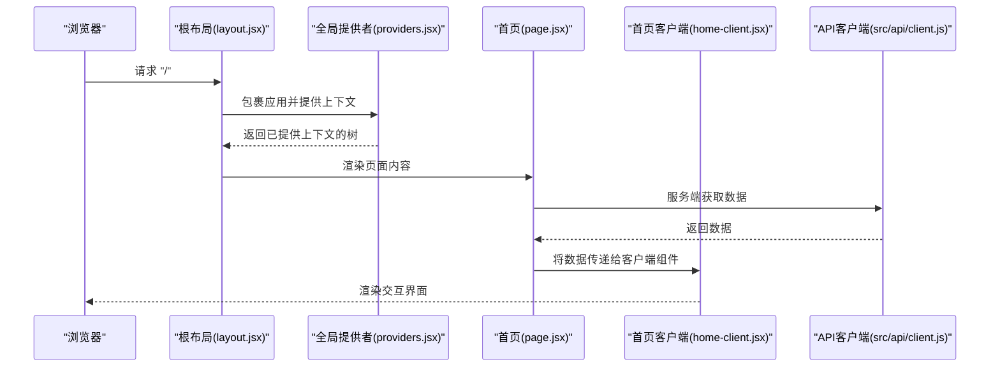
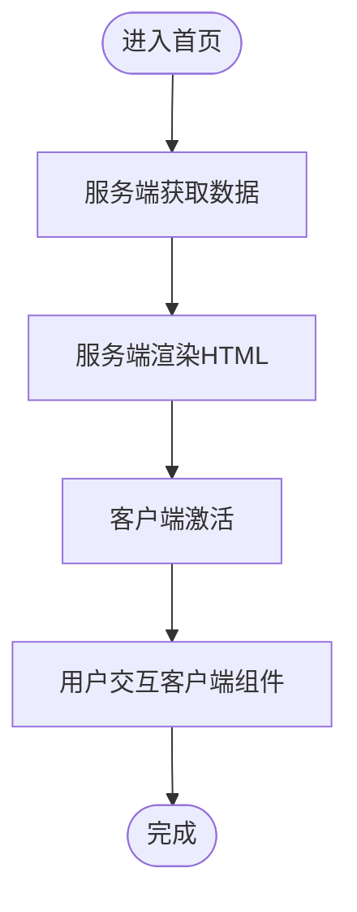
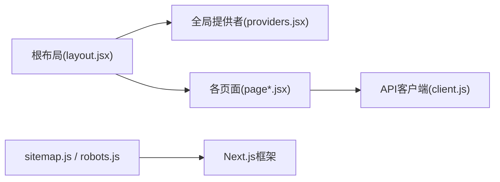

# Next.js应用结构

<cite>
**本文引用的文件**   
- [next.config.mjs](file://next.config.mjs)
- [src/app/layout.jsx](file://src/app/layout.jsx)
- [src/app/page.jsx](file://src/app/page.jsx)
- [src/app/providers.jsx](file://src/app/providers.jsx)
- [src/app/home-client.jsx](file://src/app/home-client.jsx)
- [src/app/about/page.jsx](file://src/app/about/page.jsx)
- [src/app/category/[slug]/page.jsx](file://src/app/category/[slug]/page.jsx)
- [src/app/column/[slug]/page.jsx](file://src/app/column/[slug]/page.jsx)
- [src/app/columns/page.jsx](file://src/app/columns/page.jsx)
- [src/app/page/[pageNum]/page.jsx](file://src/app/page/[pageNum]/page.jsx)
- [src/app/post/[slug]/page.jsx](file://src/app/post/[slug]/page.jsx)
- [src/app/post/[slug]/client.jsx](file://src/app/post/[slug]/client.jsx)
- [src/app/questions/page.jsx](file://src/app/questions/page.jsx)
- [src/app/questions/[id]/page.jsx](file://src/app/questions/[id]/page.jsx)
- [src/app/questions/ask/page.jsx](file://src/app/questions/ask/page.jsx)
- [src/app/rankings/page.jsx](file://src/app/rankings/page.jsx)
- [src/app/rankings/[type]/page.jsx](file://src/app/rankings/[type]/page.jsx)
- [src/app/search/page.jsx](file://src/app/search/page.jsx)
- [src/app/u/[username]/page.jsx](file://src/app/u/[username]/page.jsx)
- [src/app/u/[username]/profile/page.jsx](file://src/app/u/[username]/profile/page.jsx)
- [src/app/u/[username]/write/page.jsx](file://src/app/u/[username]/write/page.jsx)
- [src/app/u/[username]/write/[id]/page.jsx](file://src/app/u/[username]/write/[id]/page.jsx)
- [src/app/not-found.jsx](file://src/app/not-found.jsx)
- [src/app/globals.css](file://src/app/globals.css)
- [src/app/sitemap.js](file://src/app/sitemap.js)
- [src/app/robots.js](file://src/app/robots.js)
- [src/api/client.js](file://src/api/client.js)
</cite>

## 目录
1. [简介](#简介)
2. [项目结构](#项目结构)
3. [核心组件](#核心组件)
4. [架构总览](#架构总览)
5. [详细组件分析](#详细组件分析)
6. [依赖关系分析](#依赖关系分析)
7. [性能考虑](#性能考虑)
8. [故障排查指南](#故障排查指南)
9. [结论](#结论)
10. [附录](#附录)

## 简介
本文件面向基于Next.js App Router的前端工程，系统化解析页面组织方式与路由设计，重点说明根布局、嵌套布局、首页结构与数据获取、全局提供者配置、构建配置（路径别名、中间件、性能优化）、页面生命周期与数据流管理，并给出路由参数处理、动态路由与嵌套路由的最佳实践示例。文档以仓库实际代码为依据，避免臆测。

## 项目结构
本项目采用App Router约定式路由：
- src/app 为应用根目录，每个子目录对应一个路由段；包含 page.jsx 的目录即为可访问页面。
- layout.jsx 作为根布局，包裹所有页面，提供全局UI与上下文。
- providers.jsx 作为全局Provider入口，集中注入状态、主题、国际化等能力。
- globals.css 定义全局样式。
- sitemap.js 与 robots.js 提供SEO相关元信息。
- 各功能模块按目录划分，如 about、category、column、post、questions、rankings、search、u 等。

```mermaid
graph TB
A["src/app"] --> B["layout.jsx<br/>根布局"]
A --> C["providers.jsx<br/>全局提供者"]
A --> D["page.jsx<br/>首页"]
A --> E["about/page.jsx"]
A --> F["category/[slug]/page.jsx"]
A --> G["column/[slug]/page.jsx"]
A --> H["columns/page.jsx"]
A --> I["page/[pageNum]/page.jsx"]
A --> J["post/[slug]/page.jsx"]
A --> K["questions/page.jsx"]
A --> L["questions/[id]/page.jsx"]
A --> M["questions/ask/page.jsx"]
A --> N["rankings/page.jsx"]
A --> O["rankings/[type]/page.jsx"]
A --> P["search/page.jsx"]
A --> Q["u/[username]/page.jsx"]
A --> R["u/[username]/profile/page.jsx"]
A --> S["u/[username]/write/page.jsx"]
A --> T["u/[username]/write/[id]/page.jsx"]
A --> U["not-found.jsx"]
A --> V["globals.css"]
A --> W["sitemap.js"]
A --> X["robots.js"]
```

图表来源
- [src/app/layout.jsx](file://src/app/layout.jsx)
- [src/app/page.jsx](file://src/app/page.jsx)
- [src/app/about/page.jsx](file://src/app/about/page.jsx)
- [src/app/category/[slug]/page.jsx](file://src/app/category/[slug]/page.jsx)
- [src/app/column/[slug]/page.jsx](file://src/app/column/[slug]/page.jsx)
- [src/app/columns/page.jsx](file://src/app/columns/page.jsx)
- [src/app/page/[pageNum]/page.jsx](file://src/app/page/[pageNum]/page.jsx)
- [src/app/post/[slug]/page.jsx](file://src/app/post/[slug]/page.jsx)
- [src/app/questions/page.jsx](file://src/app/questions/page.jsx)
- [src/app/questions/[id]/page.jsx](file://src/app/questions/[id]/page.jsx)
- [src/app/questions/ask/page.jsx](file://src/app/questions/ask/page.jsx)
- [src/app/rankings/page.jsx](file://src/app/rankings/page.jsx)
- [src/app/rankings/[type]/page.jsx](file://src/app/rankings/[type]/page.jsx)
- [src/app/search/page.jsx](file://src/app/search/page.jsx)
- [src/app/u/[username]/page.jsx](file://src/app/u/[username]/page.jsx)
- [src/app/u/[username]/profile/page.jsx](file://src/app/u/[username]/profile/page.jsx)
- [src/app/u/[username]/write/page.jsx](file://src/app/u/[username]/write/page.jsx)
- [src/app/u/[username]/write/[id]/page.jsx](file://src/app/u/[username]/write/[id]/page.jsx)
- [src/app/not-found.jsx](file://src/app/not-found.jsx)
- [src/app/globals.css](file://src/app/globals.css)
- [src/app/sitemap.js](file://src/app/sitemap.js)
- [src/app/robots.js](file://src/app/robots.js)

章节来源
- [src/app/layout.jsx](file://src/app/layout.jsx)
- [src/app/page.jsx](file://src/app/page.jsx)
- [src/app/providers.jsx](file://src/app/providers.jsx)
- [src/app/globals.css](file://src/app/globals.css)
- [src/app/sitemap.js](file://src/app/sitemap.js)
- [src/app/robots.js](file://src/app/robots.js)

## 核心组件
本节聚焦根布局、首页、全局提供者三个关键入口，解释其职责与协作方式。

- 根布局（src/app/layout.jsx）
  - 作用：作为所有页面的共同外壳，负责渲染HTML骨架、引入全局样式、挂载全局Provider、以及统一错误边界或加载态。
  - 关键点：通过children渲染具体页面内容；通常在此处设置全局CSS变量、字体、主题开关等。
  
- 首页（src/app/page.jsx）
  - 作用：站点首页，负责展示文章列表、轮播、推荐等内容。
  - 数据获取：在Server Component中直接调用API客户端获取数据，或使用React Server Components的数据获取模式；若需要交互性，可将交互部分下沉到Client Component（例如home-client.jsx）。
  
- 全局提供者（src/app/providers.jsx）
  - 作用：集中注册全局上下文（如认证、主题、Toast等），供所有页面共享。
  - 使用模式：在根布局中包裹应用，确保所有子树均可消费这些上下文。

图表来源
- [src/app/layout.jsx](file://src/app/layout.jsx)
- [src/app/providers.jsx](file://src/app/providers.jsx)
- [src/app/page.jsx](file://src/app/page.jsx)
- [src/app/home-client.jsx](file://src/app/home-client.jsx)
- [src/api/client.js](file://src/api/client.js)

章节来源
- [src/app/layout.jsx](file://src/app/layout.jsx)
- [src/app/page.jsx](file://src/app/page.jsx)
- [src/app/providers.jsx](file://src/app/providers.jsx)
- [src/app/home-client.jsx](file://src/app/home-client.jsx)
- [src/api/client.js](file://src/api/client.js)

## 架构总览
下图展示了App Router下的页面组织与数据流向，包括静态页面、动态路由、嵌套路由与客户端组件的分工。

```mermaid
graph TB
subgraph "路由层"
Root["根布局(layout.jsx)"]
Home["首页(page.jsx)"]
About["关于页(about/page.jsx)"]
Cat["分类详情(category/[slug]/page.jsx)"]
Col["专栏详情(column/[slug]/page.jsx)"]
ColList["专栏列表(columns/page.jsx)"]
Paginate["分页(page/[pageNum]/page.jsx)"]
Post["文章详情(post/[slug]/page.jsx)"]
QList["问答列表(questions/page.jsx)"]
QDetail["问答详情(questions/[id]/page.jsx)"]
QAsk["提问(questions/ask/page.jsx)"]
RankList["排行榜(rankings/page.jsx)"]
RankType["排行榜类型(rankings/[type]/page.jsx)"]
Search["搜索(search/page.jsx)"]
User["用户主页(u/[username]/page.jsx)"]
UserProfile["用户资料(u/[username]/profile/page.jsx)"]
UserWrite["写文章(u/[username]/write/page.jsx)"]
UserWriteId["编辑文章(u/[username]/write/[id]/page.jsx)"]
NotFound["未找到(not-found.jsx)"]
end
subgraph "数据层"
API["API客户端(src/api/client.js)"]
end
Root --> Home
Root --> About
Root --> Cat
Root --> Col
Root --> ColList
Root --> Paginate
Root --> Post
Root --> QList
Root --> QDetail
Root --> QAsk
Root --> RankList
Root --> RankType
Root --> Search
Root --> User
Root --> UserProfile
Root --> UserWrite
Root --> UserWriteId
Root --> NotFound
Home --> API
Cat --> API
Col --> API
Paginate --> API
Post --> API
QList --> API
QDetail --> API
QAsk --> API
RankList --> API
RankType --> API
Search --> API
User --> API
UserProfile --> API
UserWrite --> API
UserWriteId --> API
```

图表来源
- [src/app/layout.jsx](file://src/app/layout.jsx)
- [src/app/page.jsx](file://src/app/page.jsx)
- [src/app/about/page.jsx](file://src/app/about/page.jsx)
- [src/app/category/[slug]/page.jsx](file://src/app/category/[slug]/page.jsx)
- [src/app/column/[slug]/page.jsx](file://src/app/column/[slug]/page.jsx)
- [src/app/columns/page.jsx](file://src/app/columns/page.jsx)
- [src/app/page/[pageNum]/page.jsx](file://src/app/page/[pageNum]/page.jsx)
- [src/app/post/[slug]/page.jsx](file://src/app/post/[slug]/page.jsx)
- [src/app/questions/page.jsx](file://src/app/questions/page.jsx)
- [src/app/questions/[id]/page.jsx](file://src/app/questions/[id]/page.jsx)
- [src/app/questions/ask/page.jsx](file://src/app/questions/ask/page.jsx)
- [src/app/rankings/page.jsx](file://src/app/rankings/page.jsx)
- [src/app/rankings/[type]/page.jsx](file://src/app/rankings/[type]/page.jsx)
- [src/app/search/page.jsx](file://src/app/search/page.jsx)
- [src/app/u/[username]/page.jsx](file://src/app/u/[username]/page.jsx)
- [src/app/u/[username]/profile/page.jsx](file://src/app/u/[username]/profile/page.jsx)
- [src/app/u/[username]/write/page.jsx](file://src/app/u/[username]/write/page.jsx)
- [src/app/u/[username]/write/[id]/page.jsx](file://src/app/u/[username]/write/[id]/page.jsx)
- [src/app/not-found.jsx](file://src/app/not-found.jsx)
- [src/api/client.js](file://src/api/client.js)

## 详细组件分析

### 根布局（src/app/layout.jsx）
- 职责
  - 提供HTML基础结构（html/body标签、语言、主题变量等）。
  - 引入全局样式（如globals.css）。
  - 挂载全局Provider（如认证、主题、Toast等）。
  - 统一错误边界与加载态（可选）。
- 嵌套布局机制
  - 通过children渲染具体页面，支持多级嵌套布局。
  - 可在任意层级添加新的layout.jsx，实现局部UI复用（如后台管理、用户中心等）。
- 最佳实践
  - 将不随页面变化的UI与逻辑放在布局中，减少重复代码。
  - 谨慎在服务端布局中进行高开销计算，优先在客户端按需执行。

章节来源
- [src/app/layout.jsx](file://src/app/layout.jsx)
- [src/app/globals.css](file://src/app/globals.css)

### 首页（src/app/page.jsx）与客户端组件（src/app/home-client.jsx）
- 职责
  - 首页负责聚合数据与渲染首屏内容。
  - 将需要交互的部分下沉到客户端组件（如轮播、点赞、评论等）。
- 数据获取
  - 在服务端组件中直接调用API客户端获取数据，提高首屏性能与SEO。
  - 将数据以props形式传递给客户端组件，避免重复请求。
- 生命周期与数据流
  - 服务端渲染阶段：获取数据并生成初始HTML。
  - 客户端激活阶段：事件绑定与交互逻辑生效。

章节来源
- [src/app/page.jsx](file://src/app/page.jsx)
- [src/app/home-client.jsx](file://src/app/home-client.jsx)
- [src/api/client.js](file://src/api/client.js)

### 全局提供者（src/app/providers.jsx）
- 职责
  - 集中注册全局上下文（如认证状态、主题、Toast提示等）。
  - 为所有页面提供一致的上下文环境。
- 使用模式
  - 在根布局中包裹应用，确保所有子树可消费上下文。
  - 在页面或组件中使用useContext或自定义Hook读取状态。

章节来源
- [src/app/providers.jsx](file://src/app/providers.jsx)

### 静态与动态路由页面
- 静态路由
  - about/page.jsx：关于页面，通常为纯展示型。
  - columns/page.jsx：专栏列表页。
  - questions/page.jsx：问答列表页。
  - rankings/page.jsx：排行榜列表页。
  - search/page.jsx：搜索页。
- 动态路由
  - category/[slug]/page.jsx：根据分类slug渲染详情。
  - column/[slug]/page.jsx：根据专栏slug渲染详情。
  - page/[pageNum]/page.jsx：分页路由，支持多页浏览。
  - post/[slug]/page.jsx：文章详情页，常结合客户端组件进行交互。
  - questions/[id]/page.jsx：问答详情页。
  - rankings/[type]/page.jsx：按类型筛选的排行榜。
  - u/[username]/page.jsx：用户主页。
  - u/[username]/profile/page.jsx：用户资料页。
  - u/[username]/write/page.jsx：写文章页。
  - u/[username]/write/[id]/page.jsx：编辑文章页。
- 嵌套路由
  - u/[username] 下包含 profile、write 等子路由，体现层级化组织。
- 最佳实践
  - 使用params对象获取路由参数，并进行校验与默认值处理。
  - 对动态路由进行错误处理与404友好提示（可配合not-found.jsx）。
  - 将复杂交互逻辑放入同目录下的client.jsx，保持页面简洁。

章节来源
- [src/app/about/page.jsx](file://src/app/about/page.jsx)
- [src/app/category/[slug]/page.jsx](file://src/app/category/[slug]/page.jsx)
- [src/app/column/[slug]/page.jsx](file://src/app/column/[slug]/page.jsx)
- [src/app/columns/page.jsx](file://src/app/columns/page.jsx)
- [src/app/page/[pageNum]/page.jsx](file://src/app/page/[pageNum]/page.jsx)
- [src/app/post/[slug]/page.jsx](file://src/app/post/[slug]/page.jsx)
- [src/app/post/[slug]/client.jsx](file://src/app/post/[slug]/client.jsx)
- [src/app/questions/page.jsx](file://src/app/questions/page.jsx)
- [src/app/questions/[id]/page.jsx](file://src/app/questions/[id]/page.jsx)
- [src/app/questions/ask/page.jsx](file://src/app/questions/ask/page.jsx)
- [src/app/rankings/page.jsx](file://src/app/rankings/page.jsx)
- [src/app/rankings/[type]/page.jsx](file://src/app/rankings/[type]/page.jsx)
- [src/app/search/page.jsx](file://src/app/search/page.jsx)
- [src/app/u/[username]/page.jsx](file://src/app/u/[username]/page.jsx)
- [src/app/u/[username]/profile/page.jsx](file://src/app/u/[username]/profile/page.jsx)
- [src/app/u/[username]/write/page.jsx](file://src/app/u/[username]/write/page.jsx)
- [src/app/u/[username]/write/[id]/page.jsx](file://src/app/u/[username]/write/[id]/page.jsx)
- [src/app/not-found.jsx](file://src/app/not-found.jsx)

### 未找到页面（src/app/not-found.jsx）
- 作用：当路由无法匹配时显示友好的404页面，提升用户体验。
- 建议：在动态路由中显式抛出未找到异常，以便框架正确渲染该页面。

章节来源
- [src/app/not-found.jsx](file://src/app/not-found.jsx)

## 依赖关系分析
- 页面与API客户端
  - 多数页面在服务端直接调用API客户端获取数据，形成“页面 -> API客户端”的单向依赖。
- 布局与提供者
  - 根布局依赖全局提供者，提供者再被页面与子组件消费。
- SEO与站点地图
  - sitemap.js与robots.js由框架自动集成，用于生成站点地图与爬虫规则。

图表来源
- [src/app/layout.jsx](file://src/app/layout.jsx)
- [src/app/providers.jsx](file://src/app/providers.jsx)
- [src/app/page.jsx](file://src/app/page.jsx)
- [src/app/about/page.jsx](file://src/app/about/page.jsx)
- [src/app/category/[slug]/page.jsx](file://src/app/category/[slug]/page.jsx)
- [src/app/column/[slug]/page.jsx](file://src/app/column/[slug]/page.jsx)
- [src/app/columns/page.jsx](file://src/app/columns/page.jsx)
- [src/app/page/[pageNum]/page.jsx](file://src/app/page/[pageNum]/page.jsx)
- [src/app/post/[slug]/page.jsx](file://src/app/post/[slug]/page.jsx)
- [src/app/questions/page.jsx](file://src/app/questions/page.jsx)
- [src/app/questions/[id]/page.jsx](file://src/app/questions/[id]/page.jsx)
- [src/app/questions/ask/page.jsx](file://src/app/questions/ask/page.jsx)
- [src/app/rankings/page.jsx](file://src/app/rankings/page.jsx)
- [src/app/rankings/[type]/page.jsx](file://src/app/rankings/[type]/page.jsx)
- [src/app/search/page.jsx](file://src/app/search/page.jsx)
- [src/app/u/[username]/page.jsx](file://src/app/u/[username]/page.jsx)
- [src/app/u/[username]/profile/page.jsx](file://src/app/u/[username]/profile/page.jsx)
- [src/app/u/[username]/write/page.jsx](file://src/app/u/[username]/write/page.jsx)
- [src/app/u/[username]/write/[id]/page.jsx](file://src/app/u/[username]/write/[id]/page.jsx)
- [src/api/client.js](file://src/api/client.js)
- [src/app/sitemap.js](file://src/app/sitemap.js)
- [src/app/robots.js](file://src/app/robots.js)

章节来源
- [src/app/layout.jsx](file://src/app/layout.jsx)
- [src/app/providers.jsx](file://src/app/providers.jsx)
- [src/api/client.js](file://src/api/client.js)
- [src/app/sitemap.js](file://src/app/sitemap.js)
- [src/app/robots.js](file://src/app/robots.js)

## 性能考虑
- 服务端渲染与缓存
  - 在服务端组件中直接获取数据，减少客户端请求与渲染时间。
  - 合理使用缓存策略（如HTTP缓存、ISR）以提升首屏性能。
- 客户端组件拆分
  - 将交互密集的逻辑拆分为client.jsx，避免不必要的服务端计算。
- 资源优化
  - 图片懒加载、按需引入样式与脚本，减少包体积。
- 路由级优化
  - 对动态路由进行参数校验与默认值处理，避免无效请求。

[本节为通用指导，无需特定文件引用]

## 故障排查指南
- 404问题
  - 检查动态路由参数是否正确传递与校验。
  - 确认not-found.jsx是否被正确触发。
- 数据获取失败
  - 检查API客户端配置与网络连通性。
  - 在服务端日志中定位错误堆栈。
- 样式与主题异常
  - 确认globals.css与Provider中的主题变量是否正确注入。
- 客户端交互失效
  - 检查client.jsx是否正确使用事件监听与状态更新。

章节来源
- [src/app/not-found.jsx](file://src/app/not-found.jsx)
- [src/api/client.js](file://src/api/client.js)
- [src/app/globals.css](file://src/app/globals.css)
- [src/app/providers.jsx](file://src/app/providers.jsx)

## 结论
本项目的App Router结构清晰，根布局与全局提供者提供了稳定的应用外壳，页面按功能域组织，动态与嵌套路由覆盖常见场景。通过服务端数据获取与客户端组件拆分，兼顾了性能与交互体验。建议在后续迭代中持续完善错误处理、缓存策略与SEO配置，进一步提升整体质量。

[本节为总结性内容，无需特定文件引用]

## 附录

### next.config.mjs 构建配置要点
- 路径别名
  - 可通过webpack或Next内置别名简化导入路径，提升可读性与维护性。
- 中间件配置
  - 如需启用中间件，需在配置中声明中间件入口与匹配规则。
- 性能优化
  - 开启压缩、图片优化、预取策略等选项，提升构建与运行效率。
- 其他
  - 环境变量注入、跨域代理、输出格式等可按需调整。

章节来源
- [next.config.mjs](file://next.config.mjs)