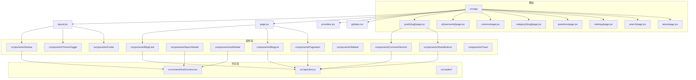
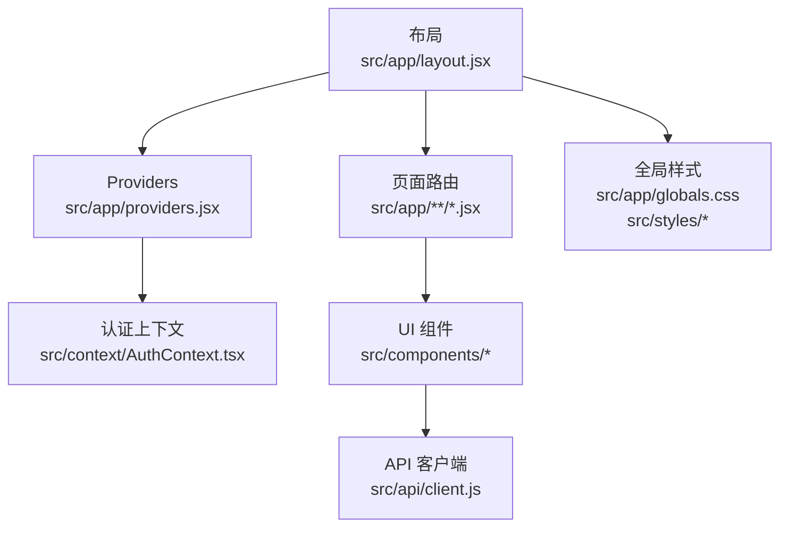
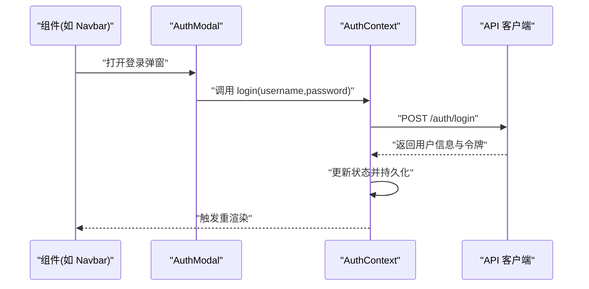
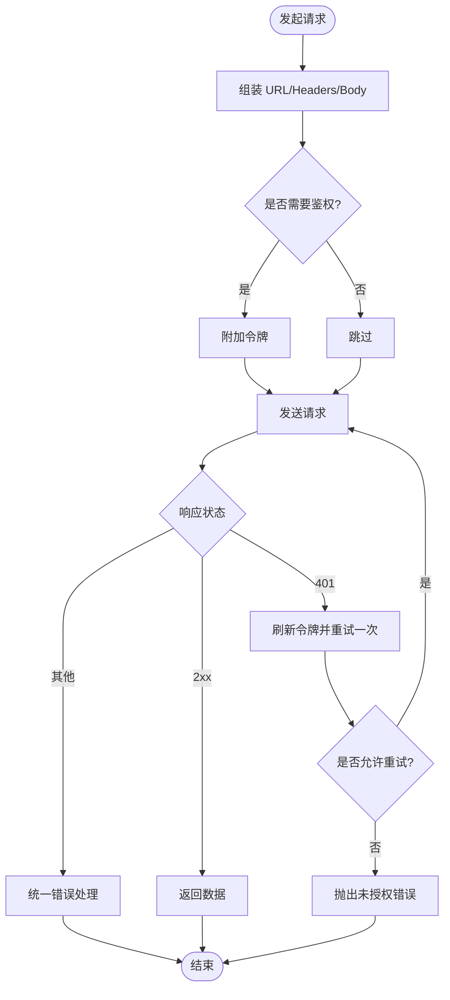
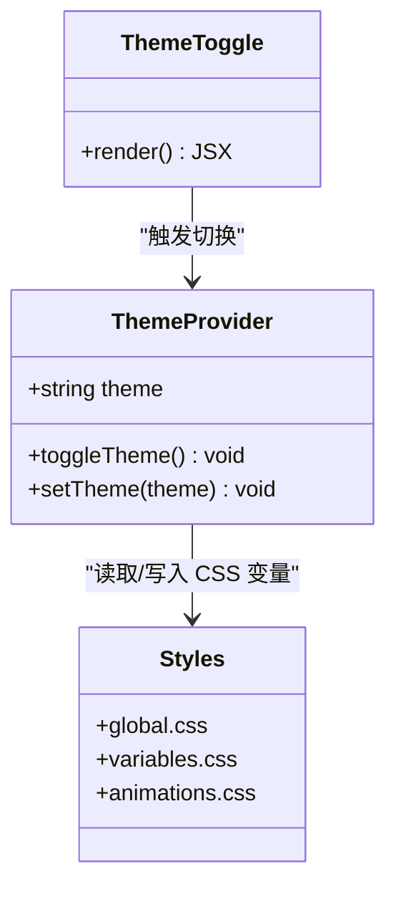
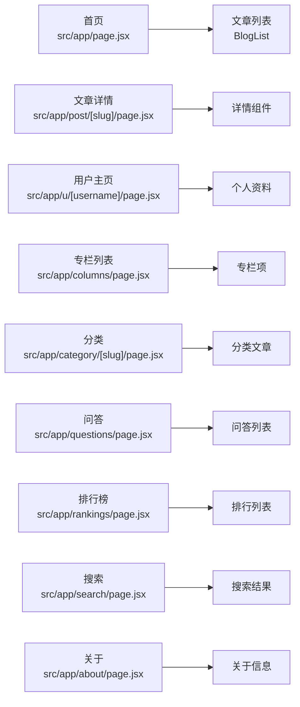
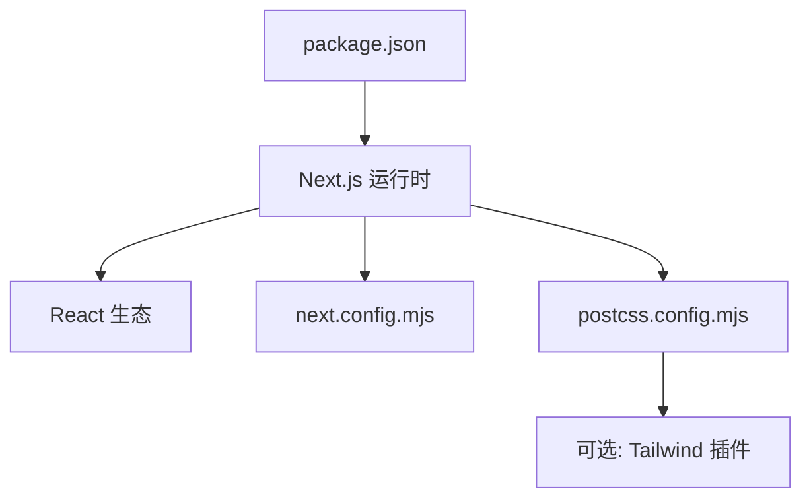

# 前端架构

<cite>
**本文引用的文件**   
- [next.config.mjs](file://next.config.mjs)
- [postcss.config.mjs](file://postcss.config.mjs)
- [package.json](file://package.json)
- [src/app/layout.jsx](file://src/app/layout.jsx)
- [src/app/page.jsx](file://src/app/page.jsx)
- [src/app/providers.jsx](file://src/app/providers.jsx)
- [src/app/globals.css](file://src/app/globals.css)
- [src/context/AuthContext.tsx](file://src/context/AuthContext.tsx)
- [src/api/client.js](file://src/api/client.js)
- [src/components/Navbar/navbar.jsx](file://src/components/Navbar/navbar.jsx)
- [src/components/ThemeToggle/ThemeToggle.jsx](file://src/components/ThemeToggle/ThemeToggle.jsx)
- [src/components/BlogCard/BlogCard.jsx](file://src/components/BlogCard/BlogCard.jsx)
- [src/components/BlogList/BlogList.jsx](file://src/components/BlogList/BlogList.jsx)
- [src/components/Pagination/Pagination.jsx](file://src/components/Pagination/Pagination.jsx)
- [src/components/SearchModal/searchmodal.jsx](file://src/components/SearchModal/searchmodal.jsx)
- [src/components/AuthModal/AuthModal.jsx](file://src/components/AuthModal/AuthModal.jsx)
- [src/components/FollowButton/followbutton.jsx](file://src/components/FollowButton/followbutton.jsx)
- [src/components/Footer/Footer.jsx](file://src/components/Footer/Footer.jsx)
- [src/components/Sidebar/Sidebar.jsx](file://src/components/Sidebar/Sidebar.jsx)
- [src/components/CommentSection/CommentSection.jsx](file://src/components/CommentSection/CommentSection.jsx)
- [src/components/ShareButtons/ShareButtons.jsx](file://src/components/ShareButtons/ShareButtons.jsx)
- [src/components/Toast/Toast.jsx](file://src/components/Toast/Toast.jsx)
- [src/styles/global.css](file://src/styles/global.css)
- [src/styles/variables.css](file://src/styles/variables.css)
- [src/styles/animations.css](file://src/styles/animations.css)
- [src/app/home-client.jsx](file://src/app/home-client.jsx)
- [src/app/post/[slug]/page.jsx](file://src/app/post/[slug]/page.jsx)
- [src/app/u/[username]/page.jsx](file://src/app/u/[username]/page.jsx)
- [src/app/columns/page.jsx](file://src/app/columns/page.jsx)
- [src/app/category/[slug]/page.jsx](file://src/app/category/[slug]/page.jsx)
- [src/app/questions/page.jsx](file://src/app/questions/page.jsx)
- [src/app/rankings/page.jsx](file://src/app/rankings/page.jsx)
- [src/app/search/page.jsx](file://src/app/search/page.jsx)
- [src/app/about/page.jsx](file://src/app/about/page.jsx)
</cite>

## 目录
1. [简介](#简介)
2. [项目结构](#项目结构)
3. [核心组件](#核心组件)
4. [架构总览](#架构总览)
5. [详细组件分析](#详细组件分析)
6. [依赖分析](#依赖分析)
7. [性能考虑](#性能考虑)
8. [故障排查指南](#故障排查指南)
9. [结论](#结论)
10. [附录](#附录)

## 简介
本文件面向基于 Next.js 的 React 应用，系统性梳理前端架构与实现要点，覆盖 App Router 路由组织、页面与布局、组件化设计原则、全局状态管理（AuthContext）、API 客户端封装、样式策略（CSS Modules、主题切换、响应式）、构建优化配置（代码分割、懒加载、图片优化）以及组件开发规范与最佳实践。文档以仓库实际文件为依据，提供可视化图示与“章节来源”以便溯源。

## 项目结构
本项目采用 Next.js App Router 组织路由与页面，结合 components、context、api、styles 等目录进行模块化拆分：
- src/app：App Router 根目录，包含 layout、page、子路由及全局资源
- src/components：可复用 UI 组件，按功能域分目录，配套 CSS Modules
- src/context：全局上下文（如 AuthContext）
- src/api：HTTP 客户端封装
- src/styles：全局样式、变量与动画
- public：静态资源（图标等）
- next.config.mjs / postcss.config.mjs：构建与样式处理配置

图表来源
- [src/app/layout.jsx](file://src/app/layout.jsx)
- [src/app/page.jsx](file://src/app/page.jsx)
- [src/app/providers.jsx](file://src/app/providers.jsx)
- [src/app/globals.css](file://src/app/globals.css)
- [src/context/AuthContext.tsx](file://src/context/AuthContext.tsx)
- [src/api/client.js](file://src/api/client.js)
- [src/components/Navbar/navbar.jsx](file://src/components/Navbar/navbar.jsx)
- [src/components/ThemeToggle/ThemeToggle.jsx](file://src/components/ThemeToggle/ThemeToggle.jsx)
- [src/components/BlogCard/BlogCard.jsx](file://src/components/BlogCard/BlogCard.jsx)
- [src/components/BlogList/BlogList.jsx](file://src/components/BlogList/BlogList.jsx)
- [src/components/Pagination/Pagination.jsx](file://src/components/Pagination/Pagination.jsx)
- [src/components/SearchModal/searchmodal.jsx](file://src/components/SearchModal/searchmodal.jsx)
- [src/components/AuthModal/AuthModal.jsx](file://src/components/AuthModal/AuthModal.jsx)
- [src/components/FollowButton/followbutton.jsx](file://src/components/FollowButton/followbutton.jsx)
- [src/components/Footer/Footer.jsx](file://src/components/Footer/Footer.jsx)
- [src/components/Sidebar/Sidebar.jsx](file://src/components/Sidebar/Sidebar.jsx)
- [src/components/CommentSection/CommentSection.jsx](file://src/components/CommentSection/CommentSection.jsx)
- [src/components/ShareButtons/ShareButtons.jsx](file://src/components/ShareButtons/ShareButtons.jsx)
- [src/components/Toast/Toast.jsx](file://src/components/Toast/Toast.jsx)

章节来源
- [src/app/layout.jsx](file://src/app/layout.jsx)
- [src/app/page.jsx](file://src/app/page.jsx)
- [src/app/providers.jsx](file://src/app/providers.jsx)
- [src/app/globals.css](file://src/app/globals.css)
- [src/context/AuthContext.tsx](file://src/context/AuthContext.tsx)
- [src/api/client.js](file://src/api/client.js)

## 核心组件
- 导航与工具栏
  - Navbar：站点导航入口，承载搜索、登录、主题切换等快捷操作
  - ThemeToggle：主题开关，通过上下文或本地存储驱动主题切换
  - Footer：页脚信息、版权与链接
- 内容展示
  - BlogCard：文章卡片，展示标题、摘要、标签、作者等
  - BlogList：文章列表容器，负责分页与数据聚合
  - Pagination：分页控件，支持页码跳转与数量选择
- 交互与反馈
  - SearchModal：全局搜索弹窗
  - AuthModal：登录/注册弹窗
  - Toast：轻量提示消息
  - FollowButton：关注/取消关注按钮
- 详情与辅助
  - CommentSection：评论区域
  - ShareButtons：分享按钮集合
  - Sidebar：侧边栏（分类、推荐等）

章节来源
- [src/components/Navbar/navbar.jsx](file://src/components/Navbar/navbar.jsx)
- [src/components/ThemeToggle/ThemeToggle.jsx](file://src/components/ThemeToggle/ThemeToggle.jsx)
- [src/components/Footer/Footer.jsx](file://src/components/Footer/Footer.jsx)
- [src/components/BlogCard/BlogCard.jsx](file://src/components/BlogCard/BlogCard.jsx)
- [src/components/BlogList/BlogList.jsx](file://src/components/BlogList/BlogList.jsx)
- [src/components/Pagination/Pagination.jsx](file://src/components/Pagination/Pagination.jsx)
- [src/components/SearchModal/searchmodal.jsx](file://src/components/SearchModal/searchmodal.jsx)
- [src/components/AuthModal/AuthModal.jsx](file://src/components/AuthModal/AuthModal.jsx)
- [src/components/Toast/Toast.jsx](file://src/components/Toast/Toast.jsx)
- [src/components/FollowButton/followbutton.jsx](file://src/components/FollowButton/followbutton.jsx)
- [src/components/CommentSection/CommentSection.jsx](file://src/components/CommentSection/CommentSection.jsx)
- [src/components/ShareButtons/ShareButtons.jsx](file://src/components/ShareButtons/ShareButtons.jsx)
- [src/components/Sidebar/Sidebar.jsx](file://src/components/Sidebar/Sidebar.jsx)

## 架构总览
整体采用“布局 + 页面 + 组件 + 上下文 + API 客户端”的分层模式：
- 布局层：src/app/layout.jsx 定义全局 HTML 骨架、全局样式注入、Provider 包裹
- 页面层：各路由 page.jsx 组合业务组件，按需使用服务端/客户端渲染
- 组件层：src/components 下按功能域拆分的无状态/轻状态 UI 组件
- 状态层：src/context/AuthContext.tsx 提供用户认证相关的全局状态
- 数据层：src/api/client.js 统一封装请求、错误处理与重试

图表来源
- [src/app/layout.jsx](file://src/app/layout.jsx)
- [src/app/providers.jsx](file://src/app/providers.jsx)
- [src/context/AuthContext.tsx](file://src/context/AuthContext.tsx)
- [src/api/client.js](file://src/api/client.js)
- [src/app/globals.css](file://src/app/globals.css)
- [src/styles/global.css](file://src/styles/global.css)
- [src/styles/variables.css](file://src/styles/variables.css)
- [src/styles/animations.css](file://src/styles/animations.css)

## 详细组件分析

### 认证上下文（AuthContext）
- 职责
  - 维护当前用户信息、登录态、权限标识
  - 提供登录、登出、刷新用户信息等动作
  - 在 Provider 中初始化并持久化到本地存储
- 使用方式
  - 在 providers.jsx 中包裹应用根节点
  - 在任意组件内通过 useContext 获取状态与动作
- 典型流程（登录）

图表来源
- [src/context/AuthContext.tsx](file://src/context/AuthContext.tsx)
- [src/components/AuthModal/AuthModal.jsx](file://src/components/AuthModal/AuthModal.jsx)
- [src/components/Navbar/navbar.jsx](file://src/components/Navbar/navbar.jsx)
- [src/api/client.js](file://src/api/client.js)

章节来源
- [src/context/AuthContext.tsx](file://src/context/AuthContext.tsx)
- [src/app/providers.jsx](file://src/app/providers.jsx)
- [src/components/AuthModal/AuthModal.jsx](file://src/components/AuthModal/AuthModal.jsx)
- [src/components/Navbar/navbar.jsx](file://src/components/Navbar/navbar.jsx)

### API 客户端封装
- 能力
  - 统一请求入口，自动附加鉴权头
  - 请求/响应拦截器：记录日志、格式化错误
  - 错误处理：区分网络错误、业务错误、超时
  - 重试机制：对幂等 GET 请求进行有限次重试
  - 取消与防抖：避免重复请求与竞态
- 关键流程（含重试）

图表来源
- [src/api/client.js](file://src/api/client.js)

章节来源
- [src/api/client.js](file://src/api/client.js)

### 主题与样式策略
- 全局样式
  - 在 layout.jsx 中引入全局样式与字体
  - globals.css 定义基础重置、排版、暗色/亮色变量
- CSS Modules
  - 组件级样式隔离，命名空间清晰，便于维护
- 主题切换
  - 通过 Context 或本地存储保存主题偏好
  - ThemeToggle 组件切换 data-theme 属性，配合 CSS 变量生效
- 响应式设计
  - 使用媒体查询与弹性布局适配多端
  - 将常用断点抽离至 variables.css

图表来源
- [src/app/layout.jsx](file://src/app/layout.jsx)
- [src/app/globals.css](file://src/app/globals.css)
- [src/styles/variables.css](file://src/styles/variables.css)
- [src/styles/animations.css](file://src/styles/animations.css)
- [src/components/ThemeToggle/ThemeToggle.jsx](file://src/components/ThemeToggle/ThemeToggle.jsx)

章节来源
- [src/app/layout.jsx](file://src/app/layout.jsx)
- [src/app/globals.css](file://src/app/globals.css)
- [src/styles/variables.css](file://src/styles/variables.css)
- [src/styles/animations.css](file://src/styles/animations.css)
- [src/components/ThemeToggle/ThemeToggle.jsx](file://src/components/ThemeToggle/ThemeToggle.jsx)

### 页面与路由组织（App Router）
- 路由约定
  - 每个目录对应一个路由，index 或 page.jsx 为页面入口
  - 动态段使用 [slug] 或 [id] 表示
- 示例路由
  - 首页：src/app/page.jsx
  - 文章详情：src/app/post/[slug]/page.jsx
  - 用户主页：src/app/u/[username]/page.jsx
  - 专栏列表/详情：src/app/columns/page.jsx、src/app/column/[slug]/page.jsx
  - 分类：src/app/category/[slug]/page.jsx
  - 问答：src/app/questions/page.jsx
  - 排行榜：src/app/rankings/page.jsx
  - 搜索：src/app/search/page.jsx
  - 关于：src/app/about/page.jsx
- 页面组合
  - 页面组件组合业务组件（BlogList、Pagination、Sidebar 等）
  - 需要交互的页面可使用 client 组件（如 home-client.jsx）

图表来源
- [src/app/page.jsx](file://src/app/page.jsx)
- [src/app/post/[slug]/page.jsx](file://src/app/post/[slug]/page.jsx)
- [src/app/u/[username]/page.jsx](file://src/app/u/[username]/page.jsx)
- [src/app/columns/page.jsx](file://src/app/columns/page.jsx)
- [src/app/category/[slug]/page.jsx](file://src/app/category/[slug]/page.jsx)
- [src/app/questions/page.jsx](file://src/app/questions/page.jsx)
- [src/app/rankings/page.jsx](file://src/app/rankings/page.jsx)
- [src/app/search/page.jsx](file://src/app/search/page.jsx)
- [src/app/about/page.jsx](file://src/app/about/page.jsx)

章节来源
- [src/app/page.jsx](file://src/app/page.jsx)
- [src/app/post/[slug]/page.jsx](file://src/app/post/[slug]/page.jsx)
- [src/app/u/[username]/page.jsx](file://src/app/u/[username]/page.jsx)
- [src/app/columns/page.jsx](file://src/app/columns/page.jsx)
- [src/app/category/[slug]/page.jsx](file://src/app/category/[slug]/page.jsx)
- [src/app/questions/page.jsx](file://src/app/questions/page.jsx)
- [src/app/rankings/page.jsx](file://src/app/rankings/page.jsx)
- [src/app/search/page.jsx](file://src/app/search/page.jsx)
- [src/app/about/page.jsx](file://src/app/about/page.jsx)

### 组件开发规范与最佳实践
- 目录组织
  - 每个组件独立目录，包含组件文件与同名 CSS Modules
  - 复杂组件可拆分子组件与 hooks
- 组件设计
  - 优先函数式组件，使用 props 传递数据与回调
  - 保持单一职责，UI 与逻辑分离
  - 对外暴露稳定接口，内部实现可替换
- 状态与副作用
  - 局部状态使用 useState/useReducer
  - 副作用使用 useEffect/useEffect 清理
  - 跨组件状态使用 Context 或状态库
- 样式
  - 使用 CSS Modules 避免冲突
  - 主题变量集中管理，遵循设计系统
- 可访问性
  - 语义化标签、键盘可达、ARIA 属性
- 测试
  - 单元测试覆盖关键逻辑，E2E 覆盖主流程

[本节为通用指导，不直接分析具体文件]

## 依赖分析
- 运行时依赖
  - Next.js 框架与 React 生态
  - 样式处理：PostCSS、Tailwind（若启用）
- 构建与工具
  - next.config.mjs：自定义构建行为（如图片优化、路径别名、中间件等）
  - postcss.config.mjs：样式预处理链
- 包管理
  - package.json：脚本命令、依赖版本锁定

图表来源
- [package.json](file://package.json)
- [next.config.mjs](file://next.config.mjs)
- [postcss.config.mjs](file://postcss.config.mjs)

章节来源
- [package.json](file://package.json)
- [next.config.mjs](file://next.config.mjs)
- [postcss.config.mjs](file://postcss.config.mjs)

## 性能考虑
- 代码分割与懒加载
  - 利用 Next.js 路由级自动分割
  - 大组件使用 dynamic import 按需加载
- 图片优化
  - 使用 next/image 自动压缩、延迟加载、格式转换
  - 合理设置占位与尺寸，减少 CLS
- 缓存与请求优化
  - API 客户端对 GET 请求做缓存与重试
  - 合并请求、去抖节流，避免抖动
- 样式与资源
  - 仅引入必要样式，避免全局污染
  - 字体与图标按需加载
- 首屏优化
  - 关键路径最小化，非关键 JS/CSS 异步加载
  - 预取关键路由资源

[本节为通用指导，不直接分析具体文件]

## 故障排查指南
- 认证问题
  - 检查令牌是否正确附加到请求头
  - 确认 401 时是否触发刷新与重试
- 网络错误
  - 查看客户端拦截器的错误分支与日志
  - 区分网络异常与服务端业务错误
- 样式问题
  - 确认 CSS Modules 类名未被覆盖
  - 检查主题变量是否生效
- 路由问题
  - 校验动态段参数是否与后端一致
  - 确认页面是否存在且导出默认组件
- 构建问题
  - 检查 next.config.mjs 与 postcss.config.mjs 语法
  - 清理 .next 后重新构建

章节来源
- [src/api/client.js](file://src/api/client.js)
- [src/app/globals.css](file://src/app/globals.css)
- [src/styles/variables.css](file://src/styles/variables.css)
- [next.config.mjs](file://next.config.mjs)
- [postcss.config.mjs](file://postcss.config.mjs)

## 结论
本项目以 Next.js App Router 为核心，结合组件化、上下文状态管理与统一的 API 客户端，形成清晰的前端分层与职责边界。通过 CSS Modules 与主题变量实现可维护的样式体系，借助构建配置与运行时优化提升性能。建议持续完善组件规范、错误监控与自动化测试，进一步提升可维护性与稳定性。

## 附录
- 关键入口与提供者
  - 布局与全局样式：src/app/layout.jsx、src/app/globals.css
  - 应用提供者：src/app/providers.jsx
  - 认证上下文：src/context/AuthContext.tsx
  - API 客户端：src/api/client.js
- 常用页面
  - 首页：src/app/page.jsx
  - 文章详情：src/app/post/[slug]/page.jsx
  - 用户主页：src/app/u/[username]/page.jsx
  - 专栏/分类/问答/排行榜/搜索/关于：见“页面与路由组织”

章节来源
- [src/app/layout.jsx](file://src/app/layout.jsx)
- [src/app/providers.jsx](file://src/app/providers.jsx)
- [src/app/globals.css](file://src/app/globals.css)
- [src/context/AuthContext.tsx](file://src/context/AuthContext.tsx)
- [src/api/client.js](file://src/api/client.js)
- [src/app/page.jsx](file://src/app/page.jsx)
- [src/app/post/[slug]/page.jsx](file://src/app/post/[slug]/page.jsx)
- [src/app/u/[username]/page.jsx](file://src/app/u/[username]/page.jsx)
- [src/app/columns/page.jsx](file://src/app/columns/page.jsx)
- [src/app/category/[slug]/page.jsx](file://src/app/category/[slug]/page.jsx)
- [src/app/questions/page.jsx](file://src/app/questions/page.jsx)
- [src/app/rankings/page.jsx](file://src/app/rankings/page.jsx)
- [src/app/search/page.jsx](file://src/app/search/page.jsx)
- [src/app/about/page.jsx](file://src/app/about/page.jsx)