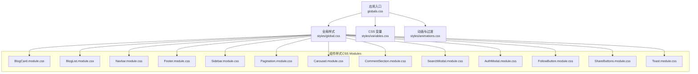
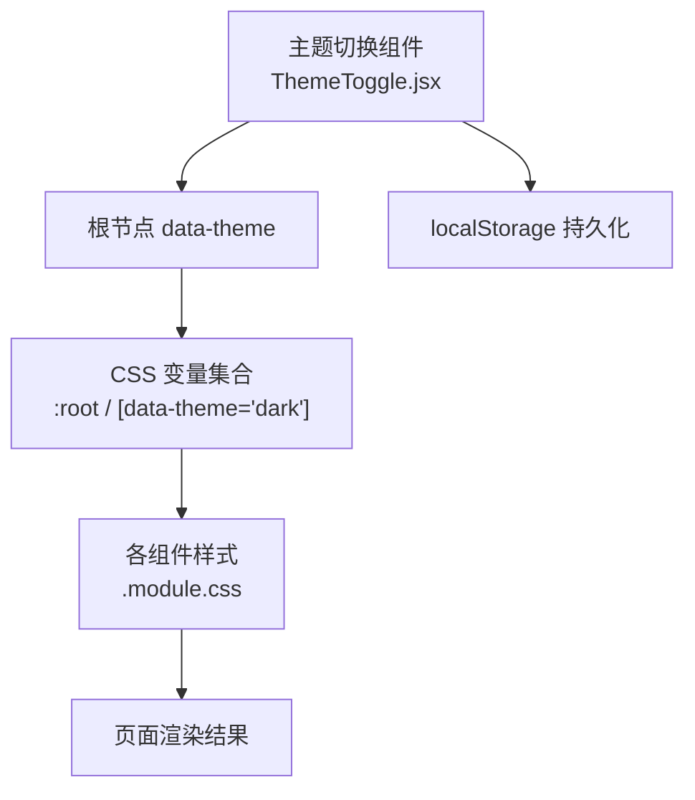
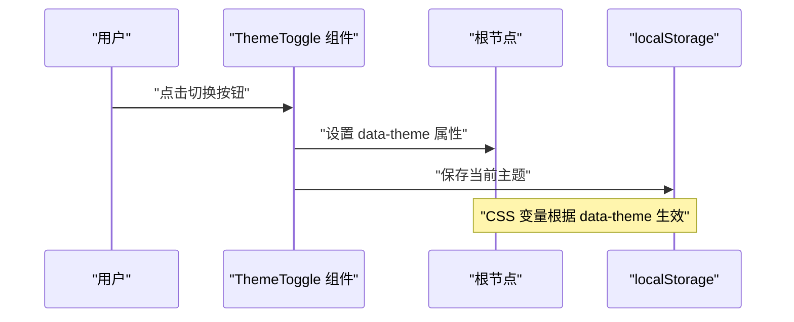
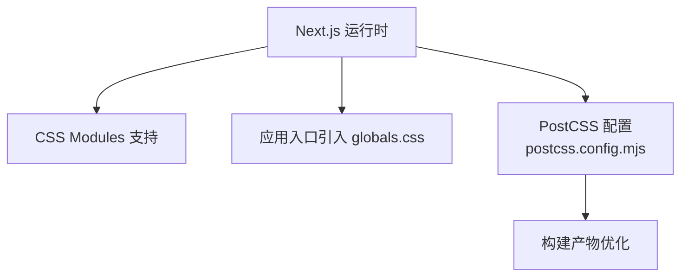

# 样式系统

<cite>
**本文引用的文件**
- [src/app/globals.css](file://src/app/globals.css)
- [src/styles/variables.css](file://src/styles/variables.css)
- [src/styles/global.css](file://src/styles/global.css)
- [src/styles/animations.css](file://src/styles/animations.css)
- [src/components/ThemeToggle/ThemeToggle.jsx](file://src/components/ThemeToggle/ThemeToggle.jsx)
- [src/components/ThemeToggle/ThemeToggle.module.css](file://src/components/ThemeToggle/ThemeToggle.module.css)
- [src/components/BlogCard/BlogCard.jsx](file://src/components/BlogCard/BlogCard.jsx)
- [src/components/BlogCard/BlogCard.module.css](file://src/components/BlogCard/BlogCard.module.css)
- [src/components/BlogList/BlogList.jsx](file://src/components/BlogList/BlogList.jsx)
- [src/components/BlogList/BlogList.module.css](file://src/components/BlogList/BlogList.module.css)
- [src/components/Navbar/navbar.jsx](file://src/components/Navbar/navbar.jsx)
- [src/components/Navbar/Navbar.module.css](file://src/components/Navbar/Navbar.module.css)
- [src/components/Footer/Footer.jsx](file://src/components/Footer/Footer.jsx)
- [src/components/Footer/Footer.module.css](file://src/components/Footer/Footer.module.css)
- [src/components/Sidebar/Sidebar.jsx](file://src/components/Sidebar/Sidebar.jsx)
- [src/components/Sidebar/Sidebar.module.css](file://src/components/Sidebar/Sidebar.module.css)
- [src/components/Pagination/Pagination.jsx](file://src/components/Pagination/Pagination.jsx)
- [src/components/Pagination/Pagination.module.css](file://src/components/Pagination/Pagination.module.css)
- [src/components/Carousel/Carousel.jsx](file://src/components/Carousel/Carousel.jsx)
- [src/components/Carousel/Carousel.module.css](file://src/components/Carousel/Carousel.module.css)
- [src/components/CommentSection/CommentSection.jsx](file://src/components/CommentSection/CommentSection.jsx)
- [src/components/CommentSection/CommentSection.module.css](file://src/components/CommentSection/CommentSection.module.css)
- [src/components/SearchModal/SearchModal.jsx](file://src/components/SearchModal/SearchModal.jsx)
- [src/components/SearchModal/SearchModal.module.css](file://src/components/SearchModal/SearchModal.module.css)
- [src/components/AuthModal/AuthModal.jsx](file://src/components/AuthModal/AuthModal.jsx)
- [src/components/AuthModal/AuthModal.module.css](file://src/components/AuthModal/AuthModal.module.css)
- [src/components/FollowButton/followbutton.jsx](file://src/components/FollowButton/followbutton.jsx)
- [src/components/FollowButton/FollowButton.module.css](file://src/components/FollowButton/FollowButton.module.css)
- [src/components/ShareButtons/ShareButtons.jsx](file://src/components/ShareButtons/ShareButtons.jsx)
- [src/components/ShareButtons/ShareButtons.module.css](file://src/components/ShareButtons/ShareButtons.module.css)
- [src/components/Toast/Toast.jsx](file://src/components/Toast/Toast.jsx)
- [src/components/Toast/Toast.module.css](file://src/components/Toast/Toast.module.css)
- [next.config.mjs](file://next.config.mjs)
- [postcss.config.mjs](file://postcss.config.mjs)
</cite>

## 目录
1. [简介](#简介)
2. [项目结构](#项目结构)
3. [核心组件](#核心组件)
4. [架构总览](#架构总览)
5. [详细组件分析](#详细组件分析)
6. [依赖分析](#依赖分析)
7. [性能考虑](#性能考虑)
8. [故障排查指南](#故障排查指南)
9. [结论](#结论)
10. [附录](#附录)

## 简介
本文件系统化梳理项目的样式体系与设计规范，覆盖以下关键主题：
- CSS Modules 的使用模式与作用域隔离机制
- 主题切换系统（CSS 变量、切换逻辑、深色模式）
- 响应式设计策略（断点、移动端适配、弹性布局）
- 动画系统与过渡效果管理
- 样式组织与命名规范（BEM 方法论）
- 样式性能优化与跨浏览器兼容性方案

## 项目结构
样式资源按“全局 + 模块”分层组织：
- 全局层：定义 CSS 变量、基础重置、通用动画与全局样式
- 组件层：每个组件拥有独立的 .module.css，通过 CSS Modules 实现作用域隔离
- 应用入口：Next.js 应用入口引入全局样式；组件按需引入模块样式

图表来源
- [src/app/globals.css](file://src/app/globals.css)
- [src/styles/global.css](file://src/styles/global.css)
- [src/styles/variables.css](file://src/styles/variables.css)
- [src/styles/animations.css](file://src/styles/animations.css)
- [src/components/BlogCard/BlogCard.module.css](file://src/components/BlogCard/BlogCard.module.css)
- [src/components/BlogList/BlogList.module.css](file://src/components/BlogList/BlogList.module.css)
- [src/components/Navbar/Navbar.module.css](file://src/components/Navbar/Navbar.module.css)
- [src/components/Footer/Footer.module.css](file://src/components/Footer/Footer.module.css)
- [src/components/Sidebar/Sidebar.module.css](file://src/components/Sidebar/Sidebar.module.css)
- [src/components/Pagination/Pagination.module.css](file://src/components/Pagination/Pagination.module.css)
- [src/components/Carousel/Carousel.module.css](file://src/components/Carousel/Carousel.module.css)
- [src/components/CommentSection/CommentSection.module.css](file://src/components/CommentSection/CommentSection.module.css)
- [src/components/SearchModal/SearchModal.module.css](file://src/components/SearchModal/SearchModal.module.css)
- [src/components/AuthModal/AuthModal.module.css](file://src/components/AuthModal/AuthModal.module.css)
- [src/components/FollowButton/FollowButton.module.css](file://src/components/FollowButton/FollowButton.module.css)
- [src/components/ShareButtons/ShareButtons.module.css](file://src/components/ShareButtons/ShareButtons.module.css)
- [src/components/Toast/Toast.module.css](file://src/components/Toast/Toast.module.css)

章节来源
- [src/app/globals.css](file://src/app/globals.css)
- [src/styles/global.css](file://src/styles/global.css)
- [src/styles/variables.css](file://src/styles/variables.css)
- [src/styles/animations.css](file://src/styles/animations.css)

## 核心组件
- 主题切换组件：提供用户交互以切换主题，并持久化到本地存储
- 全局样式与变量：集中管理颜色、间距、字体等设计令牌
- 动画与过渡：统一封装常用动画与过渡类名，供组件复用

章节来源
- [src/components/ThemeToggle/ThemeToggle.jsx](file://src/components/ThemeToggle/ThemeToggle.jsx)
- [src/components/ThemeToggle/ThemeToggle.module.css](file://src/components/ThemeToggle/ThemeToggle.module.css)
- [src/styles/variables.css](file://src/styles/variables.css)
- [src/styles/animations.css](file://src/styles/animations.css)

## 架构总览
样式架构采用“全局变量 + 模块样式”的分层模式。全局层负责设计令牌与基础规则，组件层通过 CSS Modules 获得唯一类名，避免冲突。主题切换通过根节点数据属性驱动 CSS 变量值变化，实现亮色/暗色主题无缝切换。

图表来源
- [src/components/ThemeToggle/ThemeToggle.jsx](file://src/components/ThemeToggle/ThemeToggle.jsx)
- [src/styles/variables.css](file://src/styles/variables.css)

## 详细组件分析

### 主题切换系统
- 变量定义：在变量文件中为亮色和暗色分别声明一组 CSS 变量，并通过根节点或 data-theme 选择器进行覆盖
- 切换逻辑：主题组件监听用户操作，更新根节点 data-theme 属性，并将当前主题写入 localStorage
- 初始化：应用启动时读取本地存储的主题设置，应用到根节点，确保刷新后保持一致
- 深色模式支持：通过媒体查询与变量组合，自动适配系统偏好

图表来源
- [src/components/ThemeToggle/ThemeToggle.jsx](file://src/components/ThemeToggle/ThemeToggle.jsx)
- [src/styles/variables.css](file://src/styles/variables.css)

章节来源
- [src/components/ThemeToggle/ThemeToggle.jsx](file://src/components/ThemeToggle/ThemeToggle.jsx)
- [src/components/ThemeToggle/ThemeToggle.module.css](file://src/components/ThemeToggle/ThemeToggle.module.css)
- [src/styles/variables.css](file://src/styles/variables.css)

### CSS Modules 使用与作用域隔离
- 使用方式：组件内导入同名 .module.css，将返回的类名映射对象用于 className
- 作用域隔离：构建阶段为每个类名生成唯一哈希前缀，避免全局污染
- 组合与条件：结合三元表达式或数组拼接动态组合多个模块类名
- 示例路径参考：
  - [BlogCard 组件与样式](file://src/components/BlogCard/BlogCard.jsx)
  - [BlogCard 模块样式](file://src/components/BlogCard/BlogCard.module.css)
  - [BlogList 组件与样式](file://src/components/BlogList/BlogList.jsx)
  - [BlogList 模块样式](file://src/components/BlogList/BlogList.module.css)
  - [Navbar 组件与样式](file://src/components/Navbar/navbar.jsx)
  - [Navbar 模块样式](file://src/components/Navbar/Navbar.module.css)
  - [Footer 组件与样式](file://src/components/Footer/Footer.jsx)
  - [Footer 模块样式](file://src/components/Footer/Footer.module.css)
  - [Sidebar 组件与样式](file://src/components/Sidebar/Sidebar.jsx)
  - [Sidebar 模块样式](file://src/components/Sidebar/Sidebar.module.css)
  - [Pagination 组件与样式](file://src/components/Pagination/Pagination.jsx)
  - [Pagination 模块样式](file://src/components/Pagination/Pagination.module.css)
  - [Carousel 组件与样式](file://src/components/Carousel/Carousel.jsx)
  - [Carousel 模块样式](file://src/components/Carousel/Carousel.module.css)
  - [CommentSection 组件与样式](file://src/components/CommentSection/CommentSection.jsx)
  - [CommentSection 模块样式](file://src/components/CommentSection/CommentSection.module.css)
  - [SearchModal 组件与样式](file://src/components/SearchModal/SearchModal.jsx)
  - [SearchModal 模块样式](file://src/components/SearchModal/SearchModal.module.css)
  - [AuthModal 组件与样式](file://src/components/AuthModal/AuthModal.jsx)
  - [AuthModal 模块样式](file://src/components/AuthModal/AuthModal.module.css)
  - [FollowButton 组件与样式](file://src/components/FollowButton/followbutton.jsx)
  - [FollowButton 模块样式](file://src/components/FollowButton/FollowButton.module.css)
  - [ShareButtons 组件与样式](file://src/components/ShareButtons/ShareButtons.jsx)
  - [ShareButtons 模块样式](file://src/components/ShareButtons/ShareButtons.module.css)
  - [Toast 组件与样式](file://src/components/Toast/Toast.jsx)
  - [Toast 模块样式](file://src/components/Toast/Toast.module.css)

章节来源
- [src/components/BlogCard/BlogCard.jsx](file://src/components/BlogCard/BlogCard.jsx)
- [src/components/BlogCard/BlogCard.module.css](file://src/components/BlogCard/BlogCard.module.css)
- [src/components/BlogList/BlogList.jsx](file://src/components/BlogList/BlogList.jsx)
- [src/components/BlogList/BlogList.module.css](file://src/components/BlogList/BlogList.module.css)
- [src/components/Navbar/navbar.jsx](file://src/components/Navbar/navbar.jsx)
- [src/components/Navbar/Navbar.module.css](file://src/components/Navbar/Navbar.module.css)
- [src/components/Footer/Footer.jsx](file://src/components/Footer/Footer.jsx)
- [src/components/Footer/Footer.module.css](file://src/components/Footer/Footer.module.css)
- [src/components/Sidebar/Sidebar.jsx](file://src/components/Sidebar/Sidebar.jsx)
- [src/components/Sidebar/Sidebar.module.css](file://src/components/Sidebar/Sidebar.module.css)
- [src/components/Pagination/Pagination.jsx](file://src/components/Pagination/Pagination.jsx)
- [src/components/Pagination/Pagination.module.css](file://src/components/Pagination/Pagination.module.css)
- [src/components/Carousel/Carousel.jsx](file://src/components/Carousel/Carousel.jsx)
- [src/components/Carousel/Carousel.module.css](file://src/components/Carousel/Carousel.module.css)
- [src/components/CommentSection/CommentSection.jsx](file://src/components/CommentSection/CommentSection.jsx)
- [src/components/CommentSection/CommentSection.module.css](file://src/components/CommentSection/CommentSection.module.css)
- [src/components/SearchModal/SearchModal.jsx](file://src/components/SearchModal/SearchModal.jsx)
- [src/components/SearchModal/SearchModal.module.css](file://src/components/SearchModal/SearchModal.module.css)
- [src/components/AuthModal/AuthModal.jsx](file://src/components/AuthModal/AuthModal.jsx)
- [src/components/AuthModal/AuthModal.module.css](file://src/components/AuthModal/AuthModal.module.css)
- [src/components/FollowButton/followbutton.jsx](file://src/components/FollowButton/followbutton.jsx)
- [src/components/FollowButton/FollowButton.module.css](file://src/components/FollowButton/FollowButton.module.css)
- [src/components/ShareButtons/ShareButtons.jsx](file://src/components/ShareButtons/ShareButtons.jsx)
- [src/components/ShareButtons/ShareButtons.module.css](file://src/components/ShareButtons/ShareButtons.module.css)
- [src/components/Toast/Toast.jsx](file://src/components/Toast/Toast.jsx)
- [src/components/Toast/Toast.module.css](file://src/components/Toast/Toast.module.css)

### 响应式设计策略
- 断点定义：在变量或全局样式中统一定义断点常量，便于维护与复用
- 移动端适配：优先使用相对单位与弹性布局，减少固定宽度
- 弹性布局：广泛使用 Flexbox 与 Grid，配合媒体查询在不同屏幕尺寸下调整布局
- 参考实现位置：
  - [全局样式](file://src/styles/global.css)
  - [BlogList 列表布局](file://src/components/BlogList/BlogList.module.css)
  - [Navbar 导航栏布局](file://src/components/Navbar/Navbar.module.css)
  - [Sidebar 侧边栏布局](file://src/components/Sidebar/Sidebar.module.css)
  - [Footer 页脚布局](file://src/components/Footer/Footer.module.css)

章节来源
- [src/styles/global.css](file://src/styles/global.css)
- [src/components/BlogList/BlogList.module.css](file://src/components/BlogList/BlogList.module.css)
- [src/components/Navbar/Navbar.module.css](file://src/components/Navbar/Navbar.module.css)
- [src/components/Sidebar/Sidebar.module.css](file://src/components/Sidebar/Sidebar.module.css)
- [src/components/Footer/Footer.module.css](file://src/components/Footer/Footer.module.css)

### 动画系统与过渡效果
- 统一管理：在 animations.css 中定义统一的动画与过渡类名，组件通过类名引用
- 常见类型：淡入淡出、滑入滑出、缩放、旋转等
- 性能建议：尽量使用 transform 与 opacity 触发 GPU 加速，避免重排重绘
- 参考实现位置：
  - [动画与过渡定义](file://src/styles/animations.css)
  - [Toast 提示动画](file://src/components/Toast/Toast.module.css)
  - [SearchModal 弹窗动画](file://src/components/SearchModal/SearchModal.module.css)
  - [AuthModal 弹窗动画](file://src/components/AuthModal/AuthModal.module.css)
  - [Carousel 轮播动画](file://src/components/Carousel/Carousel.module.css)

章节来源
- [src/styles/animations.css](file://src/styles/animations.css)
- [src/components/Toast/Toast.module.css](file://src/components/Toast/Toast.module.css)
- [src/components/SearchModal/SearchModal.module.css](file://src/components/SearchModal/SearchModal.module.css)
- [src/components/AuthModal/AuthModal.module.css](file://src/components/AuthModal/AuthModal.module.css)
- [src/components/Carousel/Carousel.module.css](file://src/components/Carousel/Carousel.module.css)

### 样式组织与命名规范（BEM）
- Block：组件级块（如 BlogCard、Navbar）
- Element：块内子元素（如 BlogCard__title、BlogCard__image）
- Modifier：状态或变体修饰符（如 BlogCard--featured、Navbar--sticky）
- 实践建议：
  - 在 .module.css 中使用 BEM 命名，保持可读性与可维护性
  - 通过 CSS Modules 的唯一类名避免冲突，同时保留语义化名称
  - 将通用修饰符提取到全局或工具类中，减少重复

章节来源
- [src/components/BlogCard/BlogCard.module.css](file://src/components/BlogCard/BlogCard.module.css)
- [src/components/Navbar/Navbar.module.css](file://src/components/Navbar/Navbar.module.css)
- [src/components/Footer/Footer.module.css](file://src/components/Footer/Footer.module.css)
- [src/components/Sidebar/Sidebar.module.css](file://src/components/Sidebar/Sidebar.module.css)
- [src/components/Pagination/Pagination.module.css](file://src/components/Pagination/Pagination.module.css)
- [src/components/Carousel/Carousel.module.css](file://src/components/Carousel/Carousel.module.css)
- [src/components/CommentSection/CommentSection.module.css](file://src/components/CommentSection/CommentSection.module.css)
- [src/components/SearchModal/SearchModal.module.css](file://src/components/SearchModal/SearchModal.module.css)
- [src/components/AuthModal/AuthModal.module.css](file://src/components/AuthModal/AuthModal.module.css)
- [src/components/FollowButton/FollowButton.module.css](file://src/components/FollowButton/FollowButton.module.css)
- [src/components/ShareButtons/ShareButtons.module.css](file://src/components/ShareButtons/ShareButtons.module.css)
- [src/components/Toast/Toast.module.css](file://src/components/Toast/Toast.module.css)

## 依赖分析
样式相关依赖与配置：
- Next.js 内置 CSS Modules 支持，无需额外插件即可启用
- PostCSS 配置可用于处理兼容性与优化
- 全局样式在应用入口引入，组件样式按需导入

图表来源
- [next.config.mjs](file://next.config.mjs)
- [postcss.config.mjs](file://postcss.config.mjs)
- [src/app/globals.css](file://src/app/globals.css)

章节来源
- [next.config.mjs](file://next.config.mjs)
- [postcss.config.mjs](file://postcss.config.mjs)
- [src/app/globals.css](file://src/app/globals.css)

## 性能考虑
- 最小化样式体积：仅引入必要的模块样式，避免全局大文件
- 合理使用 CSS 变量：减少重复定义，提升主题切换性能
- 动画优化：优先使用 transform 与 opacity，避免触发布局抖动
- 图片与背景：使用合适的格式与尺寸，必要时启用懒加载
- 缓存策略：利用浏览器缓存静态资源，减少重复请求
- 构建优化：借助 PostCSS 与打包工具进行压缩与去重

[本节为通用指导，不直接分析具体文件]

## 故障排查指南
- 主题未生效：检查根节点 data-theme 是否正确设置，确认变量文件中的变量名一致
- 样式冲突：确认是否误用全局类名而非模块类名，或存在同名全局样式覆盖
- 动画卡顿：检查是否使用了高开销属性（如 width/height），改为 transform/opacity
- 移动端错位：核对媒体查询断点与容器宽度，确保弹性布局正确计算
- 构建错误：检查 next.config.mjs 与 postcss.config.mjs 配置是否正确

章节来源
- [src/styles/variables.css](file://src/styles/variables.css)
- [src/styles/global.css](file://src/styles/global.css)
- [src/styles/animations.css](file://src/styles/animations.css)
- [next.config.mjs](file://next.config.mjs)
- [postcss.config.mjs](file://postcss.config.mjs)

## 结论
本项目采用清晰的分层样式架构：全局变量与基础样式集中管理，组件样式通过 CSS Modules 实现作用域隔离；主题切换基于 CSS 变量与 data 属性驱动，具备良好扩展性；响应式设计与动画系统统一规范，兼顾可维护性与性能。遵循 BEM 命名与最佳实践，有助于团队协作与长期演进。

[本节为总结性内容，不直接分析具体文件]

## 附录
- 快速定位样式文件：
  - 全局样式与变量：[src/app/globals.css](file://src/app/globals.css)、[src/styles/variables.css](file://src/styles/variables.css)、[src/styles/global.css](file://src/styles/global.css)、[src/styles/animations.css](file://src/styles/animations.css)
  - 主题切换：[src/components/ThemeToggle/ThemeToggle.jsx](file://src/components/ThemeToggle/ThemeToggle.jsx)、[src/components/ThemeToggle/ThemeToggle.module.css](file://src/components/ThemeToggle/ThemeToggle.module.css)
  - 典型组件样式：见“详细组件分析”中的路径列表

[本节为索引性内容，不直接分析具体文件]