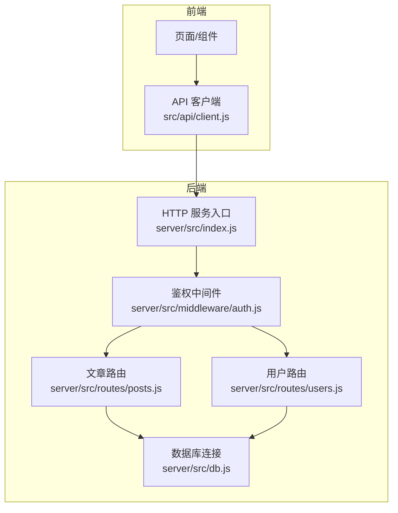
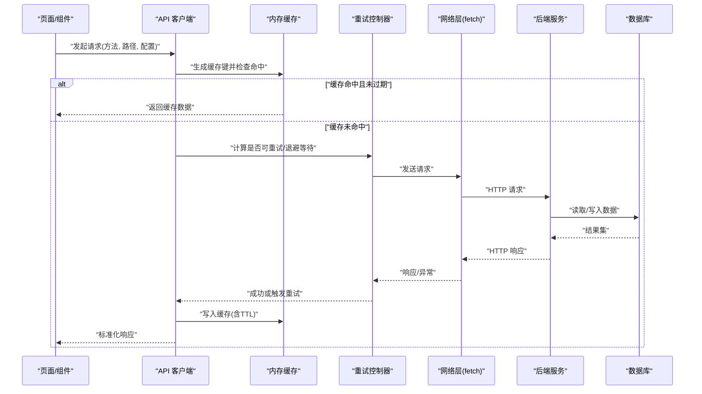
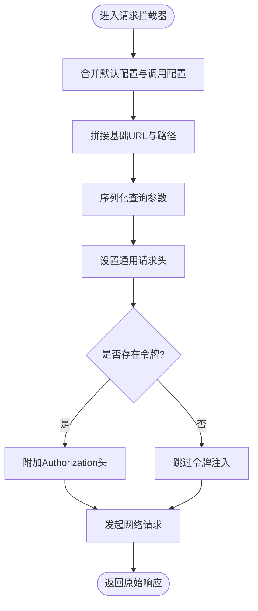
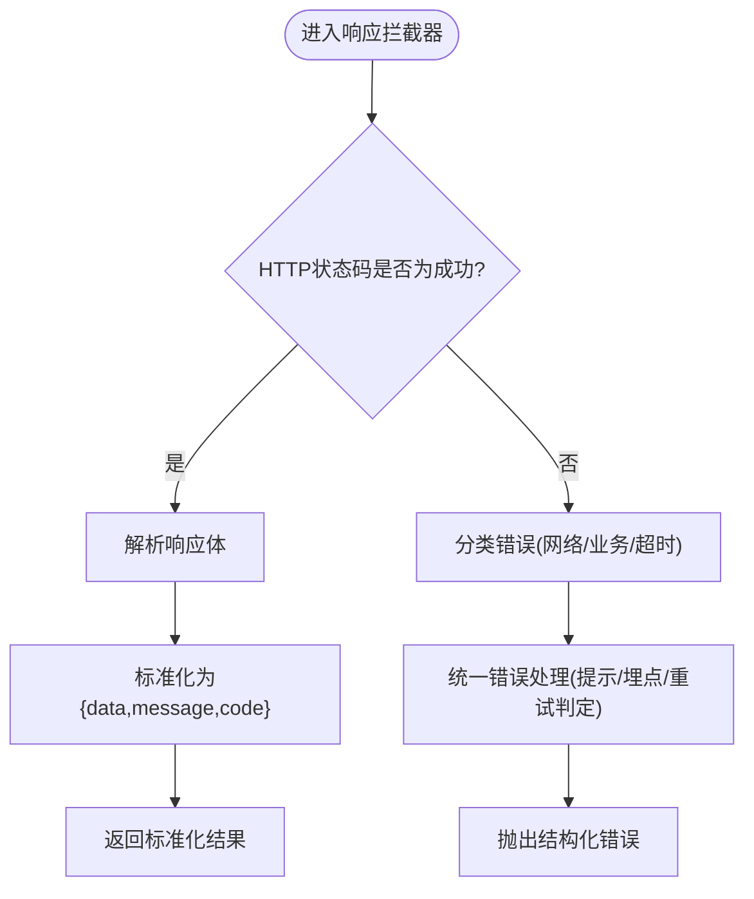
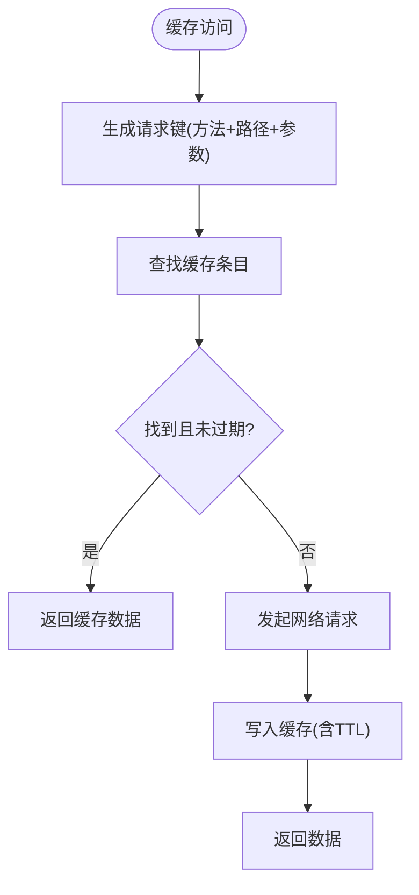
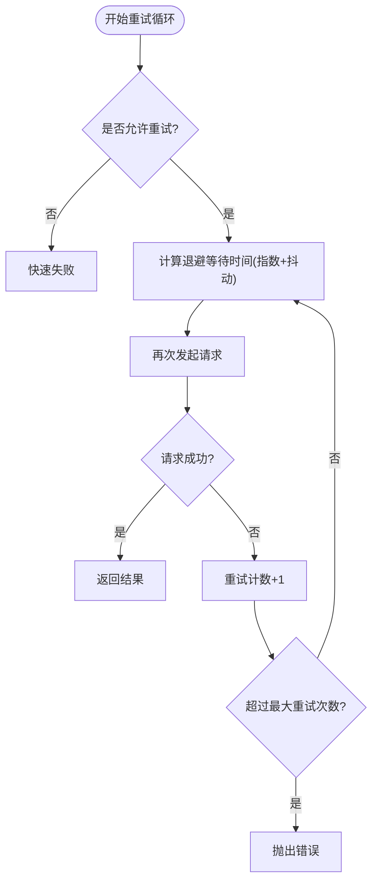
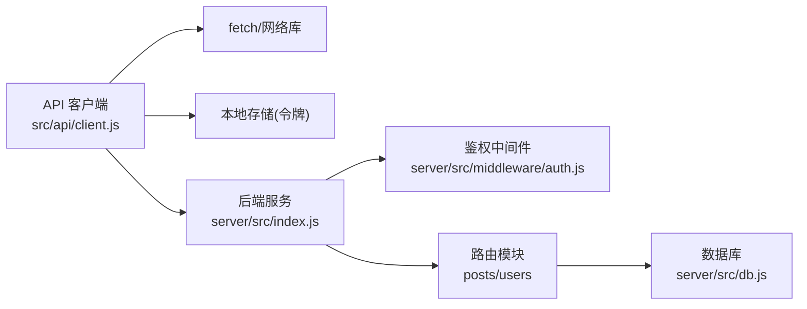

# API客户端封装

<cite>
**本文引用的文件**   
- [src/api/client.js](file://src/api/client.js)
- [server/src/index.js](file://server/src/index.js)
- [server/src/middleware/auth.js](file://server/src/middleware/auth.js)
- [server/src/routes/posts.js](file://server/src/routes/posts.js)
- [server/src/routes/users.js](file://server/src/routes/users.js)
- [server/src/db.js](file://server/src/db.js)
- [API.md](file://API.md)
</cite>

## 目录
1. [简介](#简介)
2. [项目结构](#项目结构)
3. [核心组件](#核心组件)
4. [架构总览](#架构总览)
5. [详细组件分析](#详细组件分析)
6. [依赖分析](#依赖分析)
7. [性能考虑](#性能考虑)
8. [故障排查指南](#故障排查指南)
9. [结论](#结论)
10. [附录](#附录)

## 简介
本文件围绕前端 API 客户端封装进行系统化说明，重点解析统一请求封装的设计与实现，涵盖：
- HTTP 请求拦截器：请求头设置、令牌注入、参数格式化
- 响应拦截器：响应数据标准化、错误处理、状态码判断
- 缓存策略：内存缓存、请求去重、过期时间管理
- 重试机制：指数退避算法、失败重试次数控制
- 错误处理最佳实践：网络错误、业务错误、超时处理的统一方案
- 使用示例与配置选项说明

为保证可追溯性，文中所有实现细节均对应仓库中的具体文件与行号。

## 项目结构
本项目采用前后端分离的 Next.js + Node.js 架构。前端通过统一的 API 客户端发起请求，后端提供 RESTful 接口并包含鉴权中间件。

图表来源
- [src/api/client.js](file://src/api/client.js)
- [server/src/index.js](file://server/src/index.js)
- [server/src/middleware/auth.js](file://server/src/middleware/auth.js)
- [server/src/routes/posts.js](file://server/src/routes/posts.js)
- [server/src/routes/users.js](file://server/src/routes/users.js)
- [server/src/db.js](file://server/src/db.js)

章节来源
- [src/api/client.js](file://src/api/client.js)
- [server/src/index.js](file://server/src/index.js)

## 核心组件
- 统一请求封装（请求拦截器）
  - 负责合并默认配置、设置基础 URL、序列化查询参数、附加通用请求头（如 Content-Type）、在需要时注入认证令牌。
- 统一响应封装（响应拦截器）
  - 负责将不同接口的响应体归一化为统一结构（例如包含 data、message、code），对非 2xx 状态码进行错误分类与提示，对网络异常与超时进行捕获。
- 缓存层
  - 基于内存的对象作为缓存容器，支持按请求键存储、过期时间 TTL、以及相同请求的去重（Promise 级）。
- 重试层
  - 针对幂等 GET 请求或可重试场景，结合指数退避与最大重试次数限制，避免雪崩与重复风暴。
- 错误处理
  - 统一错误类型与消息，区分网络错误、业务错误、超时错误，便于上层展示与埋点。

章节来源
- [src/api/client.js](file://src/api/client.js)

## 架构总览
下图展示了从页面到后端的完整调用链路，包括拦截器、缓存、重试与错误处理的关键节点。

图表来源
- [src/api/client.js](file://src/api/client.js)
- [server/src/index.js](file://server/src/index.js)
- [server/src/db.js](file://server/src/db.js)

## 详细组件分析

### 统一请求封装（请求拦截器）
- 功能要点
  - 合并默认配置与调用方传入的配置
  - 拼接基础 URL 与路径
  - 序列化查询参数（自动处理空值、数组、对象）
  - 设置通用请求头（如 Content-Type、Accept）
  - 注入认证令牌（若存在）
  - 记录请求日志（可选）
- 关键流程
  - 构建最终 URL → 组装 headers → 附加 token → 发起请求

图表来源
- [src/api/client.js](file://src/api/client.js)

章节来源
- [src/api/client.js](file://src/api/client.js)

### 统一响应封装（响应拦截器）
- 功能要点
  - 将后端响应体转换为统一结构（data/message/code）
  - 根据状态码判断成功/失败
  - 对网络异常、超时、服务端错误进行分类处理
  - 触发全局错误回调或抛出结构化错误对象
- 关键流程
  - 接收响应 → 校验状态码 → 解析响应体 → 标准化 → 返回或抛错

图表来源
- [src/api/client.js](file://src/api/client.js)

章节来源
- [src/api/client.js](file://src/api/client.js)

### 缓存策略（内存缓存、请求去重、过期时间）
- 设计目标
  - 减少重复请求，提升首屏与列表加载速度
  - 保证缓存一致性（过期时间、失效策略）
  - 避免并发重复请求（Promise 去重）
- 数据结构
  - 以“请求键”为索引的内存 Map，保存响应数据与过期时间戳
- 行为规则
  - 命中：直接返回缓存数据
  - 未命中：执行请求并将结果写入缓存
  - 过期：视为未命中，重新拉取
  - 去重：同一时刻相同请求只发一次，其余等待 Promise

图表来源
- [src/api/client.js](file://src/api/client.js)

章节来源
- [src/api/client.js](file://src/api/client.js)

### 重试机制（指数退避、失败次数控制）
- 适用场景
  - 仅对幂等请求（如 GET）启用
  - 针对瞬时错误（网络抖动、5xx）进行重试
- 算法要点
  - 指数退避：每次失败等待时间按倍数增长，叠加随机抖动
  - 最大重试次数：超过阈值则放弃并重抛错误
  - 快速失败：对于明确不可重试的错误（如 4xx）立即返回
- 流程图

图表来源
- [src/api/client.js](file://src/api/client.js)

章节来源
- [src/api/client.js](file://src/api/client.js)

### 错误处理最佳实践
- 分类原则
  - 网络错误：断网、DNS 解析失败、连接拒绝等
  - 业务错误：后端返回的业务码非成功（如 401/403/422/自定义业务码）
  - 超时错误：请求超过配置的超时阈值
- 统一方案
  - 在响应拦截器中集中处理，向上抛出结构化错误对象
  - 提供全局错误处理器用于提示、埋点、跳转登录页等
  - 对可重试错误交由重试层处理，避免上层重复逻辑

章节来源
- [src/api/client.js](file://src/api/client.js)

### 使用示例与配置选项
- 基本用法
  - 发起 GET/POST/PUT/DELETE 请求，传入路径与可选参数
  - 通过配置项开启/关闭缓存、重试、超时等特性
- 常用配置项
  - baseURL：后端服务基础地址
  - timeout：请求超时毫秒数
  - withCredentials：是否携带凭证（跨域场景）
  - cache：是否启用缓存及 TTL
  - retry：是否启用重试及最大重试次数
  - headers：默认请求头
  - tokenProvider：动态获取令牌的函数
- 典型调用方式
  - 列表查询：GET /posts?category=...&page=...
  - 详情获取：GET /posts/:id
  - 创建文章：POST /posts
  - 更新文章：PUT /posts/:id
  - 删除文章：DELETE /posts/:id
  - 用户信息：GET /users/me
  - 登录注册：POST /auth/login, POST /auth/register

章节来源
- [src/api/client.js](file://src/api/client.js)
- [API.md](file://API.md)

## 依赖分析
- 前端依赖
  - API 客户端依赖浏览器原生 fetch 或同构网络库
  - 依赖本地存储（localStorage/sessionStorage）用于持久化令牌
- 后端依赖
  - Express/Koa 等 Web 框架
  - 鉴权中间件验证令牌有效性
  - 数据库驱动（SQLite/MySQL/PostgreSQL 等）

图表来源
- [src/api/client.js](file://src/api/client.js)
- [server/src/index.js](file://server/src/index.js)
- [server/src/middleware/auth.js](file://server/src/middleware/auth.js)
- [server/src/routes/posts.js](file://server/src/routes/posts.js)
- [server/src/routes/users.js](file://server/src/routes/users.js)
- [server/src/db.js](file://server/src/db.js)

章节来源
- [server/src/index.js](file://server/src/index.js)
- [server/src/middleware/auth.js](file://server/src/middleware/auth.js)
- [server/src/routes/posts.js](file://server/src/routes/posts.js)
- [server/src/routes/users.js](file://server/src/routes/users.js)
- [server/src/db.js](file://server/src/db.js)

## 性能考虑
- 合理设置缓存 TTL，避免频繁刷新导致雪崩
- 对热点接口启用请求去重，降低并发压力
- 谨慎启用重试，避免放大后端负载
- 对大列表分页加载，结合虚拟滚动与增量渲染
- 压缩与懒加载资源，减少首屏体积

[本节为通用指导，不直接分析具体文件]

## 故障排查指南
- 常见问题定位
  - 401/403：检查令牌是否过期或缺失，确认 tokenProvider 是否正确返回
  - 404：核对路径与后端路由是否一致
  - 5xx：查看后端日志，关注数据库连接与中间件异常
  - 超时：调整 timeout 或优化后端响应时间
- 调试建议
  - 打开请求/响应日志，记录关键字段（URL、headers、status、body）
  - 使用浏览器 Network 面板与后端访问日志交叉比对
  - 对缓存问题，清空缓存并复现，观察是否命中

章节来源
- [server/src/middleware/auth.js](file://server/src/middleware/auth.js)
- [server/src/index.js](file://server/src/index.js)

## 结论
通过统一的请求与响应封装、完善的缓存与重试策略、以及规范化的错误处理，API 客户端显著提升了前端的健壮性与可维护性。配合清晰的后端鉴权与路由设计，整体系统具备良好的扩展性与稳定性。

[本节为总结性内容，不直接分析具体文件]

## 附录
- 参考文档
  - API 接口定义与示例见 [API.md](file://API.md)
- 相关实现文件
  - 前端客户端：[src/api/client.js](file://src/api/client.js)
  - 后端入口与鉴权：[server/src/index.js](file://server/src/index.js)、[server/src/middleware/auth.js](file://server/src/middleware/auth.js)
  - 路由与数据层：[server/src/routes/posts.js](file://server/src/routes/posts.js)、[server/src/routes/users.js](file://server/src/routes/users.js)、[server/src/db.js](file://server/src/db.js)