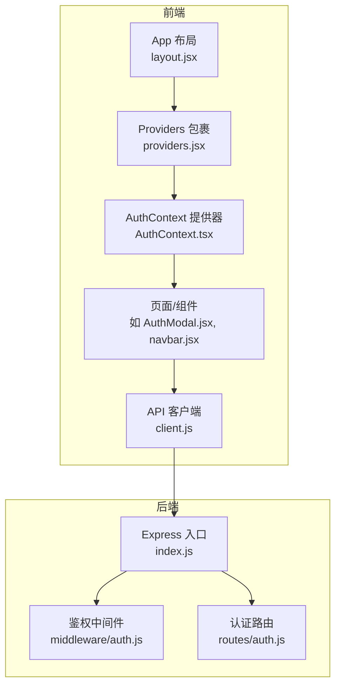
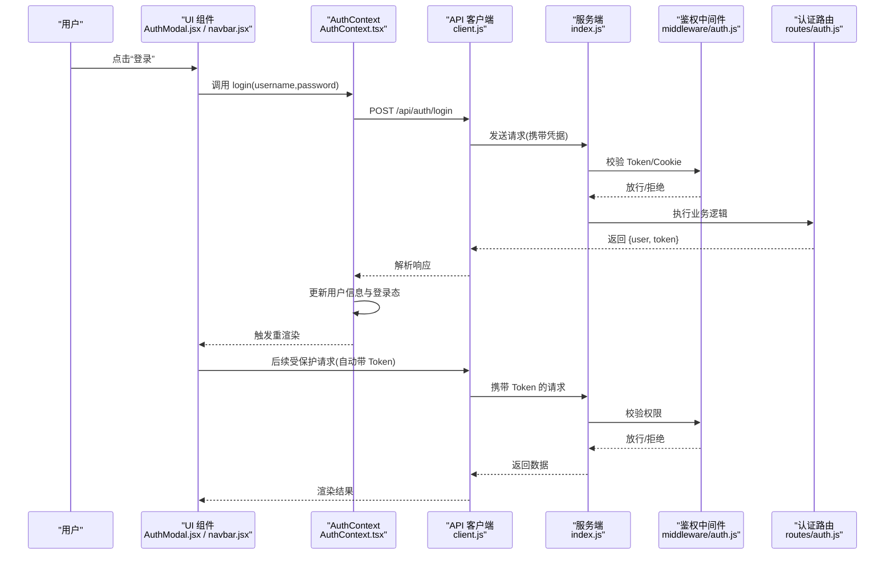
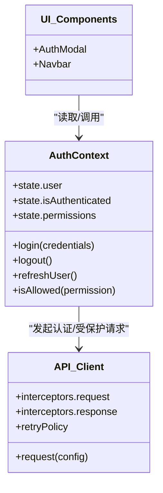
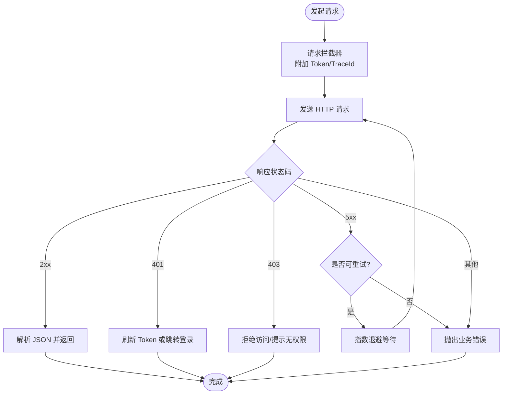
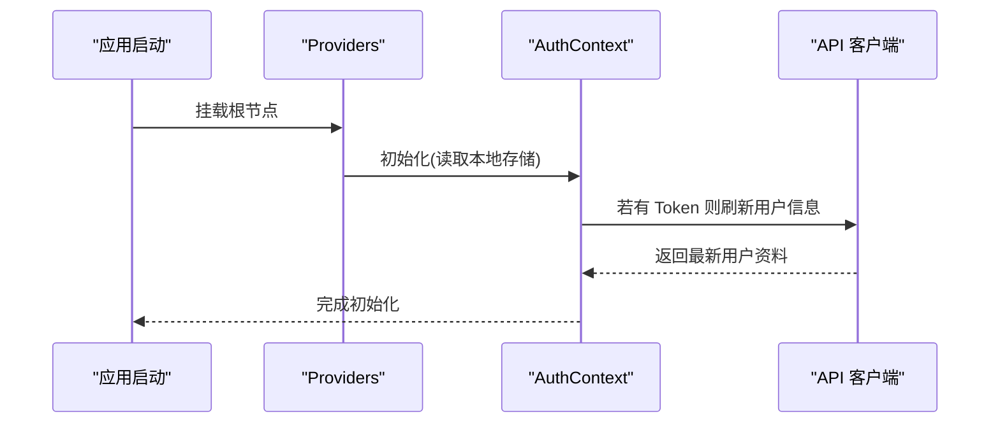
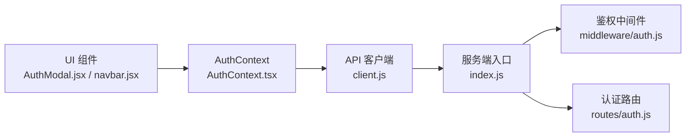

# 状态管理方案

<cite>
**本文引用的文件**   
- [AuthContext.tsx](file://src/context/AuthContext.tsx)
- [client.js](file://src/api/client.js)
- [providers.jsx](file://src/app/providers.jsx)
- [layout.jsx](file://src/app/layout.jsx)
- [AuthModal.jsx](file://src/components/AuthModal/AuthModal.jsx)
- [navbar.jsx](file://src/components/Navbar/navbar.jsx)
- [index.js](file://server/src/index.js)
- [auth.js](file://server/src/middleware/auth.js)
- [auth.js](file://server/src/routes/auth.js)
</cite>

## 目录
1. [简介](#简介)
2. [项目结构](#项目结构)
3. [核心组件](#核心组件)
4. [架构总览](#架构总览)
5. [详细组件分析](#详细组件分析)
6. [依赖关系分析](#依赖关系分析)
7. [性能考虑](#性能考虑)
8. [故障排查指南](#故障排查指南)
9. [结论](#结论)
10. [附录](#附录)

## 简介
本文件面向前端与全栈开发者，系统化阐述本项目中的状态管理方案。重点覆盖：
- React Context 全局状态管理的设计与落地
- AuthContext 认证状态（用户信息、登录态、权限）的建模与使用
- API 客户端封装（请求/响应拦截器、错误处理、重试机制）
- 客户端与服务端状态同步策略
- 缓存策略与性能优化（预取、懒加载、内存管理）
- 状态调试工具与开发最佳实践

## 项目结构
围绕状态管理与网络层的关键位置如下：
- 上下文与提供者：src/context/AuthContext.tsx、src/app/providers.jsx、src/app/layout.jsx
- 业务组件消费上下文：src/components/AuthModal/AuthModal.jsx、src/components/Navbar/navbar.jsx
- API 客户端：src/api/client.js
- 服务端鉴权中间件与路由：server/src/middleware/auth.js、server/src/routes/auth.js、server/src/index.js

图表来源
- [layout.jsx](file://src/app/layout.jsx)
- [providers.jsx](file://src/app/providers.jsx)
- [AuthContext.tsx](file://src/context/AuthContext.tsx)
- [AuthModal.jsx](file://src/components/AuthModal/AuthModal.jsx)
- [navbar.jsx](file://src/components/Navbar/navbar.jsx)
- [client.js](file://src/api/client.js)
- [index.js](file://server/src/index.js)
- [auth.js](file://server/src/middleware/auth.js)
- [auth.js](file://server/src/routes/auth.js)

章节来源
- [layout.jsx](file://src/app/layout.jsx)
- [providers.jsx](file://src/app/providers.jsx)
- [AuthContext.tsx](file://src/context/AuthContext.tsx)
- [client.js](file://src/api/client.js)
- [index.js](file://server/src/index.js)
- [auth.js](file://server/src/middleware/auth.js)
- [auth.js](file://server/src/routes/auth.js)

## 核心组件
- AuthContext：集中管理用户信息、登录态、权限等全局状态，并提供登录/登出、刷新用户信息等动作。
- API 客户端：统一封装 fetch/axios 调用，内置请求/响应拦截器、错误处理与可选重试。
- Providers/Layout：在应用启动时注入全局上下文，确保所有子树可访问认证状态。
- 业务组件：通过上下文或 hooks 读取状态并触发操作（如打开登录弹窗、导航到受保护页面）。

章节来源
- [AuthContext.tsx](file://src/context/AuthContext.tsx)
- [client.js](file://src/api/client.js)
- [providers.jsx](file://src/app/providers.jsx)
- [layout.jsx](file://src/app/layout.jsx)

## 架构总览
下图展示从 UI 到后端的完整认证流程，以及状态在前后端的流转。

图表来源
- [AuthModal.jsx](file://src/components/AuthModal/AuthModal.jsx)
- [navbar.jsx](file://src/components/Navbar/navbar.jsx)
- [AuthContext.tsx](file://src/context/AuthContext.tsx)
- [client.js](file://src/api/client.js)
- [index.js](file://server/src/index.js)
- [auth.js](file://server/src/middleware/auth.js)
- [auth.js](file://server/src/routes/auth.js)

## 详细组件分析

### AuthContext 认证状态设计
- 状态模型
  - 用户信息：包含基础资料、角色/权限标识等
  - 登录态：是否已登录、Token 有效期
  - 权限控制：基于角色的功能开关与路由守卫
- 关键动作
  - 登录：提交凭据，成功后持久化 Token 并更新用户信息
  - 登出：清除本地凭证与用户信息
  - 刷新用户信息：根据当前 Token 拉取最新用户资料
  - 权限判断：提供 isAllowed(role/permission) 类方法
- 典型用法
  - 在受保护页面中读取用户信息并做条件渲染
  - 在导航栏显示登录/退出按钮与用户菜单
  - 在表单提交前检查权限

图表来源
- [AuthContext.tsx](file://src/context/AuthContext.tsx)
- [client.js](file://src/api/client.js)
- [AuthModal.jsx](file://src/components/AuthModal/AuthModal.jsx)
- [navbar.jsx](file://src/components/Navbar/navbar.jsx)

章节来源
- [AuthContext.tsx](file://src/context/AuthContext.tsx)
- [AuthModal.jsx](file://src/components/AuthModal/AuthModal.jsx)
- [navbar.jsx](file://src/components/Navbar/navbar.jsx)

### API 客户端封装
- 请求拦截器
  - 自动附加 Authorization 头（从上下文或本地存储获取）
  - 为调试目的添加请求 ID、时间戳等元信息
- 响应拦截器
  - 统一解析成功响应体
  - 对 401/403 进行特殊处理（跳转登录、刷新 Token）
  - 将业务错误码转换为标准异常对象
- 错误处理
  - 网络异常、超时、JSON 解析失败等兜底
  - 错误上报与用户提示（Toast）
- 重试机制
  - 针对幂等 GET 请求实现指数退避重试
  - 可配置最大重试次数与退避间隔
  - 区分服务端 5xx 与客户端错误，避免无意义重试

图表来源
- [client.js](file://src/api/client.js)

章节来源
- [client.js](file://src/api/client.js)

### 状态同步策略
- 首次加载
  - 应用启动时 providers 初始化 AuthContext，尝试从本地存储恢复会话
  - 若存在有效 Token，则调用“刷新用户信息”接口以补齐用户资料
- 登录/登出
  - 登录成功后写入本地存储并更新上下文；登出时清理
- 变更同步
  - 用户资料变更后主动刷新上下文
  - 跨标签页共享：监听 storage 事件保持多标签一致性
- 乐观更新与回滚
  - 写操作先乐观更新 UI，失败时回滚并提示
- 冲突解决
  - 服务端权威：任何不一致以服务端为准，必要时强制刷新

图表来源
- [providers.jsx](file://src/app/providers.jsx)
- [AuthContext.tsx](file://src/context/AuthContext.tsx)
- [client.js](file://src/api/client.js)

章节来源
- [providers.jsx](file://src/app/providers.jsx)
- [AuthContext.tsx](file://src/context/AuthContext.tsx)
- [client.js](file://src/api/client.js)

### 缓存策略与性能优化
- 数据预取
  - 在路由切换前或空闲时机预取高频数据，减少首屏等待
- 懒加载
  - 按需加载大组件与第三方库，降低初始包体积
- 内存管理
  - 及时释放不再使用的订阅与定时器
  - 对长列表采用虚拟滚动与分页
- 请求去抖/节流
  - 搜索输入防抖、窗口 resize 节流
- 缓存层
  - 对只读数据实施短期内存缓存与过期策略
  - 结合浏览器缓存与 Service Worker（可选）

[本节为通用指导，不直接分析具体文件]

### 状态调试工具与开发最佳实践
- 调试建议
  - 在开发环境开启日志输出（请求/响应、上下文变更）
  - 使用浏览器扩展查看网络与本地存储
  - 为关键状态增加快照对比（登录态、用户信息）
- 最佳实践
  - 单一事实来源：用户信息仅由 AuthContext 维护
  - 不可变更新：避免直接修改 state，使用函数式更新
  - 错误边界：对可能崩溃的组件包裹错误边界
  - 权限最小化：默认拒绝，显式授权
  - 可观测性：为关键路径埋点与指标采集

[本节为通用指导，不直接分析具体文件]

## 依赖关系分析
- 组件依赖
  - 页面/组件依赖 AuthContext 提供的状态与方法
  - AuthContext 依赖 API 客户端发起认证与受保护请求
- 前后端耦合
  - 前端通过 client.js 与 Express 服务通信
  - 服务端通过鉴权中间件校验 Token，路由处理认证逻辑

图表来源
- [AuthModal.jsx](file://src/components/AuthModal/AuthModal.jsx)
- [navbar.jsx](file://src/components/Navbar/navbar.jsx)
- [AuthContext.tsx](file://src/context/AuthContext.tsx)
- [client.js](file://src/api/client.js)
- [index.js](file://server/src/index.js)
- [auth.js](file://server/src/middleware/auth.js)
- [auth.js](file://server/src/routes/auth.js)

章节来源
- [AuthModal.jsx](file://src/components/AuthModal/AuthModal.jsx)
- [navbar.jsx](file://src/components/Navbar/navbar.jsx)
- [AuthContext.tsx](file://src/context/AuthContext.tsx)
- [client.js](file://src/api/client.js)
- [index.js](file://server/src/index.js)
- [auth.js](file://server/src/middleware/auth.js)
- [auth.js](file://server/src/routes/auth.js)

## 性能考虑
- 减少不必要的重渲染：拆分细粒度上下文或使用选择器
- 合并状态更新：批量更新避免多次渲染
- 合理设置缓存 TTL：平衡一致性与性能
- 控制并发请求：限制并行度，避免雪崩
- 资源优化：图片压缩、代码分割、Tree Shaking

[本节为通用指导，不直接分析具体文件]

## 故障排查指南
- 常见问题
  - 401 未登录：检查 Token 是否存在且未过期，确认请求拦截器是否正确附加
  - 403 无权限：核对用户角色与权限标识，确认服务端权限判定
  - 网络异常：检查超时、CORS、代理配置
  - 状态不同步：确认刷新用户信息时机与 storage 事件监听
- 定位步骤
  - 查看网络面板请求/响应
  - 打印上下文状态快照
  - 在服务端日志中检索对应 TraceId
- 恢复策略
  - 自动重试（仅限幂等请求）
  - 引导用户重新登录
  - 降级到离线/缓存数据

章节来源
- [client.js](file://src/api/client.js)
- [AuthContext.tsx](file://src/context/AuthContext.tsx)
- [auth.js](file://server/src/middleware/auth.js)

## 结论
本方案以 React Context 为核心，结合统一的 API 客户端封装，实现了清晰的前端认证状态管理与健壮的网络层。通过明确的同步策略、缓存与性能优化手段，以及完善的调试与排障指引，可在保证一致性的同时提升用户体验与可维护性。

## 附录
- 术语
  - 上下文：React Context 提供的全局状态容器
  - 拦截器：在请求发出前与响应返回后执行的钩子
  - 幂等：重复执行不会产生额外副作用的操作（如 GET）
- 参考文件
  - 前端：AuthContext.tsx、client.js、providers.jsx、layout.jsx、AuthModal.jsx、navbar.jsx
  - 后端：index.js、middleware/auth.js、routes/auth.js