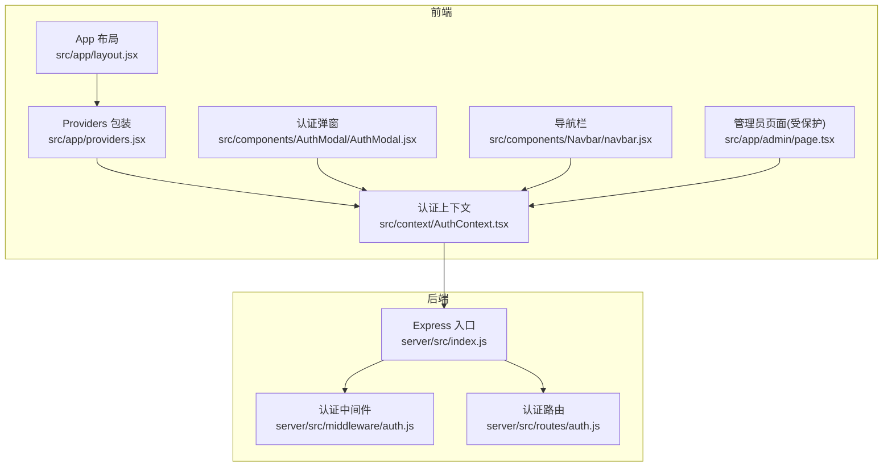
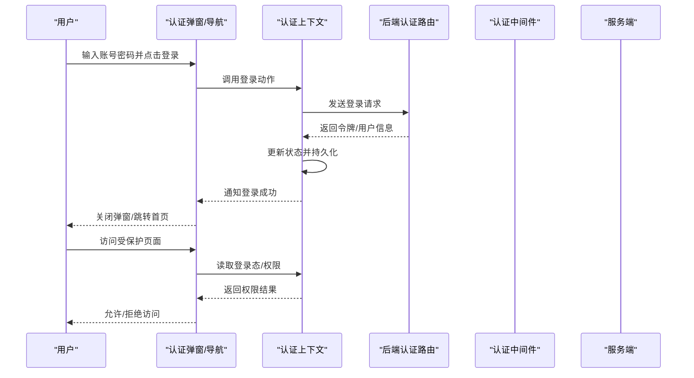
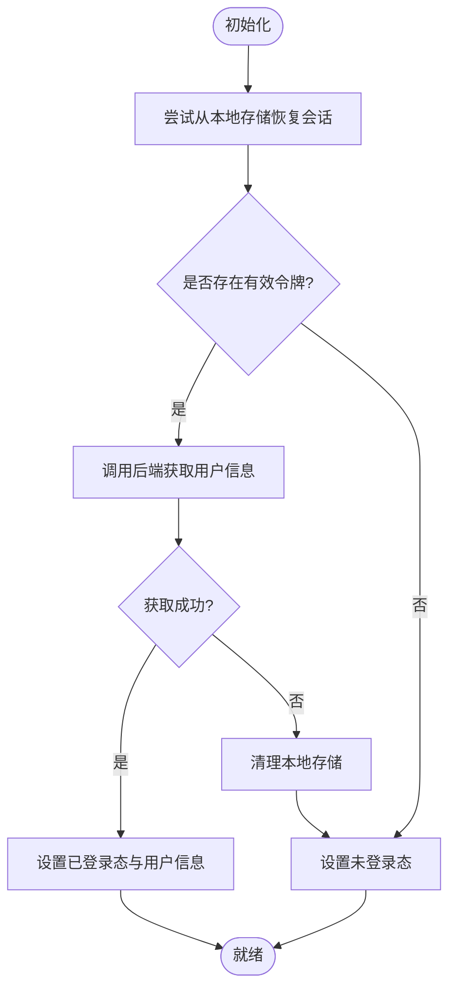
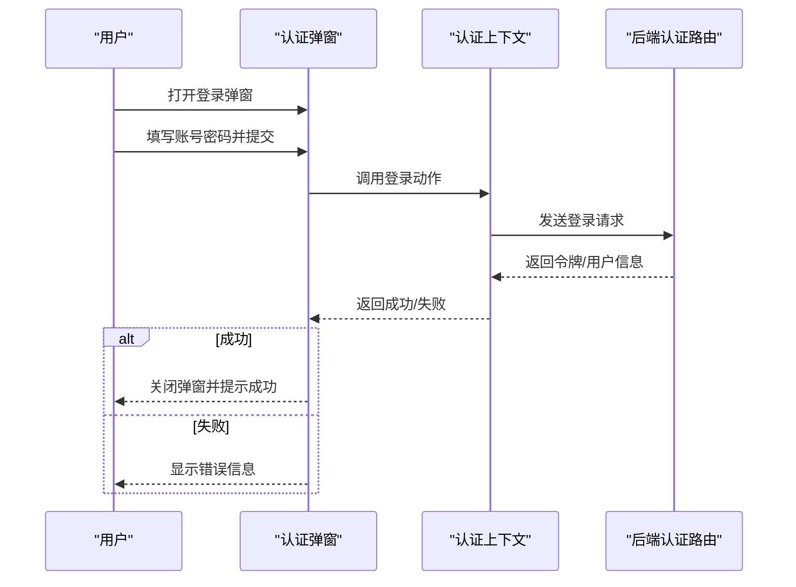
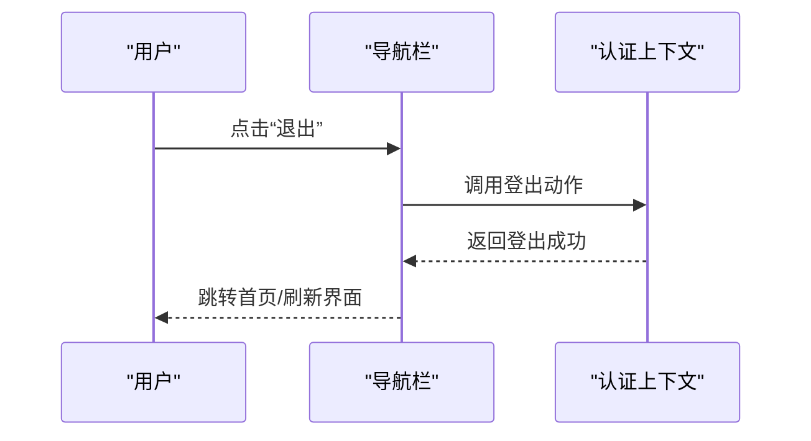
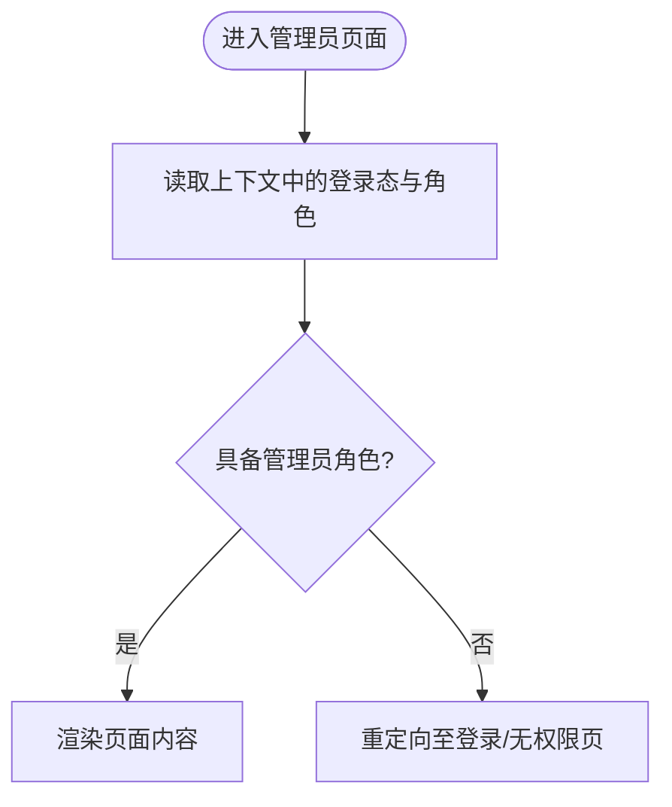
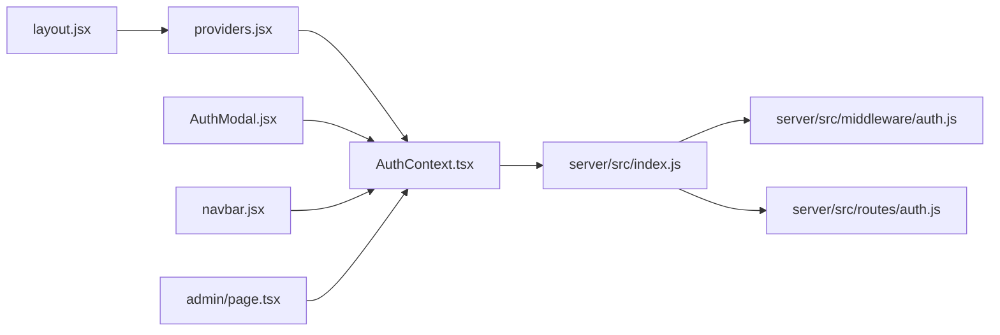

# 认证状态管理

<cite>
**本文引用的文件**   
- [AuthContext.tsx](file://src/context/AuthContext.tsx)
- [providers.jsx](file://src/app/providers.jsx)
- [layout.jsx](file://src/app/layout.jsx)
- [AuthModal.jsx](file://src/components/AuthModal/AuthModal.jsx)
- [navbar.jsx](file://src/components/Navbar/navbar.jsx)
- [page.tsx](file://src/app/admin/page.tsx)
- [index.js](file://server/src/index.js)
- [auth.js](file://server/src/middleware/auth.js)
- [auth.js](file://server/src/routes/auth.js)
</cite>

## 目录
1. [简介](#简介)
2. [项目结构](#项目结构)
3. [核心组件](#核心组件)
4. [架构总览](#架构总览)
5. [详细组件分析](#详细组件分析)
6. [依赖关系分析](#依赖关系分析)
7. [性能考虑](#性能考虑)
8. [故障排查指南](#故障排查指南)
9. [结论](#结论)
10. [附录](#附录)

## 简介
本文件围绕前端认证状态管理展开，聚焦于 AuthContext 的实现原理与使用模式，系统梳理用户信息状态、登录态、权限控制的状态设计；解释 useState 与 useReducer 的使用场景与取舍；描述从登录到登出的完整状态生命周期；说明角色判断与路由守卫的实现思路；并给出状态持久化、错误处理与安全实践建议。文档同时提供在组件中消费认证状态的示例路径，帮助读者快速落地。

## 项目结构
认证相关的前端代码主要位于以下位置：
- 上下文与提供者：src/context/AuthContext.tsx、src/app/providers.jsx、src/app/layout.jsx
- 认证交互组件：src/components/AuthModal/AuthModal.jsx
- 导航栏集成：src/components/Navbar/navbar.jsx
- 受保护页面（示例）：src/app/admin/page.tsx
- 后端鉴权中间件与路由：server/src/middleware/auth.js、server/src/routes/auth.js、server/src/index.js

图表来源
- [layout.jsx](file://src/app/layout.jsx)
- [providers.jsx](file://src/app/providers.jsx)
- [AuthContext.tsx](file://src/context/AuthContext.tsx)
- [AuthModal.jsx](file://src/components/AuthModal/AuthModal.jsx)
- [navbar.jsx](file://src/components/Navbar/navbar.jsx)
- [page.tsx](file://src/app/admin/page.tsx)
- [index.js](file://server/src/index.js)
- [auth.js](file://server/src/middleware/auth.js)
- [auth.js](file://server/src/routes/auth.js)

章节来源
- [AuthContext.tsx](file://src/context/AuthContext.tsx)
- [providers.jsx](file://src/app/providers.jsx)
- [layout.jsx](file://src/app/layout.jsx)
- [AuthModal.jsx](file://src/components/AuthModal/AuthModal.jsx)
- [navbar.jsx](file://src/components/Navbar/navbar.jsx)
- [page.tsx](file://src/app/admin/page.tsx)
- [index.js](file://server/src/index.js)
- [auth.js](file://server/src/middleware/auth.js)
- [auth.js](file://server/src/routes/auth.js)

## 核心组件
- 认证上下文（AuthContext）
  - 职责：集中管理登录态、用户信息、权限能力，暴露登录/登出/刷新等动作，供全应用订阅与消费。
  - 典型状态字段：是否已登录、用户基本信息、角色/权限集合、加载态、错误信息等。
  - 典型动作：登录、登出、刷新用户信息、更新本地存储、设置错误等。
  - 实现要点：结合 React Context 提供全局访问；根据复杂度选择 useState 或 useReducer；封装副作用逻辑（如网络请求、持久化）。
- 认证弹窗（AuthModal）
  - 职责：触发登录/注册流程，提交凭证，接收上下文提供的登录结果反馈。
  - 与上下文交互：调用登录动作，监听登录成功/失败，关闭弹窗并提示。
- 导航栏（Navbar）
  - 职责：根据登录态展示不同菜单项（如“登录/个人中心/退出”），点击触发上下文动作。
- 受保护页面（admin）
  - 职责：在页面渲染前检查权限，未授权时跳转或提示。

章节来源
- [AuthContext.tsx](file://src/context/AuthContext.tsx)
- [AuthModal.jsx](file://src/components/AuthModal/AuthModal.jsx)
- [navbar.jsx](file://src/components/Navbar/navbar.jsx)
- [page.tsx](file://src/app/admin/page.tsx)

## 架构总览
认证体系由“前端状态 + 后端鉴权”两部分组成：
- 前端：通过 AuthContext 维护会话与用户信息，组件以 Hook 形式消费；导航与页面级进行权限校验。
- 后端：Express 入口挂载认证中间件，对需要鉴权的接口进行 Token 校验与角色判定。

图表来源
- [AuthModal.jsx](file://src/components/AuthModal/AuthModal.jsx)
- [AuthContext.tsx](file://src/context/AuthContext.tsx)
- [navbar.jsx](file://src/components/Navbar/navbar.jsx)
- [page.tsx](file://src/app/admin/page.tsx)
- [auth.js](file://server/src/routes/auth.js)
- [auth.js](file://server/src/middleware/auth.js)
- [index.js](file://server/src/index.js)

## 详细组件分析

### 认证上下文（AuthContext）
- 状态设计
  - 登录态：布尔值，表示当前是否持有有效会话。
  - 用户信息：包含基础资料与角色/权限集合。
  - 加载态：用于登录/刷新过程中的阻塞与防抖。
  - 错误信息：记录最近一次操作错误，便于 UI 提示。
- 动作设计
  - 登录：提交凭据，成功后写入状态与持久化存储。
  - 登出：清除状态与持久化存储，重置为未登录态。
  - 刷新：根据本地令牌拉取最新用户信息，修复跨标签页不一致问题。
  - 设置错误/清理错误：统一错误展示与恢复。
- useState vs useReducer
  - 当状态简单且动作少时，useState 更直观。
  - 当状态复杂、动作多且存在组合逻辑时，useReducer 能更好地组织状态转移与副作用，避免深层嵌套的回调。
- 持久化策略
  - 将关键令牌与必要用户信息写入 localStorage/sessionStorage，并在初始化时恢复。
  - 注意敏感数据最小化原则，避免在本地存储过多隐私信息。
- 错误处理
  - 区分网络错误、业务错误与权限错误，分别映射到用户可理解的提示。
  - 在登出后自动清理错误状态，避免残留提示干扰后续操作。

图表来源
- [AuthContext.tsx](file://src/context/AuthContext.tsx)

章节来源
- [AuthContext.tsx](file://src/context/AuthContext.tsx)

### 认证弹窗（AuthModal）
- 交互流程
  - 打开弹窗：显示登录表单。
  - 提交登录：调用上下文的登录动作，等待结果。
  - 成功：关闭弹窗，必要时跳转到目标页面。
  - 失败：展示错误信息，保持弹窗打开以便重试。
- 与上下文协作
  - 通过上下文提供的登录函数与错误状态完成端到端体验。
  - 支持取消/关闭时的状态回滚。

图表来源
- [AuthModal.jsx](file://src/components/AuthModal/AuthModal.jsx)
- [AuthContext.tsx](file://src/context/AuthContext.tsx)
- [auth.js](file://server/src/routes/auth.js)

章节来源
- [AuthModal.jsx](file://src/components/AuthModal/AuthModal.jsx)
- [AuthContext.tsx](file://src/context/AuthContext.tsx)
- [auth.js](file://server/src/routes/auth.js)

### 导航栏（Navbar）
- 行为
  - 根据登录态切换“登录/个人中心/退出”按钮。
  - 点击“退出”时调用上下文登出动作，并刷新页面或跳转首页。
- 与上下文协作
  - 直接消费上下文中的登录态与登出方法，无需关心具体实现细节。

图表来源
- [navbar.jsx](file://src/components/Navbar/navbar.jsx)
- [AuthContext.tsx](file://src/context/AuthContext.tsx)

章节来源
- [navbar.jsx](file://src/components/Navbar/navbar.jsx)
- [AuthContext.tsx](file://src/context/AuthContext.tsx)

### 受保护页面（管理员）
- 权限校验
  - 在进入页面时检查上下文中的角色/权限。
  - 未满足条件则重定向至登录或无权限提示页。
- 与上下文协作
  - 仅依赖上下文暴露的权限判断方法，不直接访问底层存储。

图表来源
- [page.tsx](file://src/app/admin/page.tsx)
- [AuthContext.tsx](file://src/context/AuthContext.tsx)

章节来源
- [page.tsx](file://src/app/admin/page.tsx)
- [AuthContext.tsx](file://src/context/AuthContext.tsx)

## 依赖关系分析
- 前端依赖
  - layout 包裹 providers，providers 注入 AuthContext，使子树均可消费认证状态。
  - 认证弹窗与导航栏作为 UI 层，依赖上下文提供的动作与状态。
  - 受保护页面在渲染前依赖上下文进行权限判断。
- 后端依赖
  - Express 入口挂载认证中间件，认证路由负责签发/验证令牌。
  - 中间件对需要鉴权的接口进行拦截，基于令牌解析用户身份与角色。

图表来源
- [layout.jsx](file://src/app/layout.jsx)
- [providers.jsx](file://src/app/providers.jsx)
- [AuthContext.tsx](file://src/context/AuthContext.tsx)
- [AuthModal.jsx](file://src/components/AuthModal/AuthModal.jsx)
- [navbar.jsx](file://src/components/Navbar/navbar.jsx)
- [page.tsx](file://src/app/admin/page.tsx)
- [index.js](file://server/src/index.js)
- [auth.js](file://server/src/middleware/auth.js)
- [auth.js](file://server/src/routes/auth.js)

章节来源
- [layout.jsx](file://src/app/layout.jsx)
- [providers.jsx](file://src/app/providers.jsx)
- [AuthContext.tsx](file://src/context/AuthContext.tsx)
- [AuthModal.jsx](file://src/components/AuthModal/AuthModal.jsx)
- [navbar.jsx](file://src/components/Navbar/navbar.jsx)
- [page.tsx](file://src/app/admin/page.tsx)
- [index.js](file://server/src/index.js)
- [auth.js](file://server/src/middleware/auth.js)
- [auth.js](file://server/src/routes/auth.js)

## 性能考虑
- 减少不必要的重渲染
  - 将认证状态拆分为细粒度 context 或使用 memo 包裹消费者，避免整棵树频繁更新。
  - 仅在登录态变化时触发 UI 更新，用户信息变更按需刷新。
- 异步与并发
  - 登录/刷新采用去抖与幂等设计，避免重复请求。
  - 对长耗时操作增加加载态，提升用户体验。
- 持久化开销
  - 本地存储读写尽量合并，避免每次状态更新都落盘。
  - 只在关键节点（登录成功、登出、令牌刷新）写入。

[本节为通用指导，不涉及具体文件]

## 故障排查指南
- 登录后仍显示未登录
  - 检查初始化阶段是否正确从本地存储恢复会话。
  - 确认令牌格式与有效期是否符合后端要求。
- 刷新页面后丢失登录态
  - 确认持久化键名与取值逻辑一致。
  - 检查浏览器存储是否被清空或受限。
- 权限不足但可访问受保护页面
  - 检查页面级权限判断逻辑是否覆盖所有分支。
  - 确认后端中间件是否正确拦截并返回 403/401。
- 登出后仍有敏感信息残留
  - 确保登出动作清除了本地存储与内存中的用户信息。
  - 检查是否有其他模块缓存了用户数据。

章节来源
- [AuthContext.tsx](file://src/context/AuthContext.tsx)
- [auth.js](file://server/src/middleware/auth.js)
- [auth.js](file://server/src/routes/auth.js)

## 结论
通过 AuthContext 统一管理认证状态，配合弹窗与导航栏的交互以及页面级权限校验，形成了清晰的前端认证闭环。后端中间件与路由进一步保障接口安全。建议在复杂场景中优先使用 useReducer 组织状态转移，并结合持久化与完善的错误处理，构建健壮的用户认证体验。

[本节为总结性内容，不涉及具体文件]

## 附录

### 在组件中消费认证状态的示例路径
- 在弹窗组件中调用登录动作并处理结果
  - [AuthModal.jsx](file://src/components/AuthModal/AuthModal.jsx)
- 在导航栏中根据登录态切换菜单与执行登出
  - [navbar.jsx](file://src/components/Navbar/navbar.jsx)
- 在受保护页面中进行权限判断与重定向
  - [page.tsx](file://src/app/admin/page.tsx)
- 在应用根布局中注入认证上下文
  - [layout.jsx](file://src/app/layout.jsx)
  - [providers.jsx](file://src/app/providers.jsx)

### 最佳实践清单
- 状态持久化
  - 仅持久化必要的最小信息（令牌与基础用户标识）。
  - 使用安全的存储策略，避免 XSS 风险。
- 错误处理
  - 统一错误码映射与用户提示。
  - 在网络异常时提供重试机制。
- 安全考虑
  - 令牌传输使用 HTTPS。
  - 合理设置令牌过期时间与刷新策略。
  - 避免在日志中输出敏感信息。
- 可测试性
  - 将认证逻辑抽象为可复用的 Hook/服务，便于单元测试与集成测试。

[本节为通用指导，不涉及具体文件]