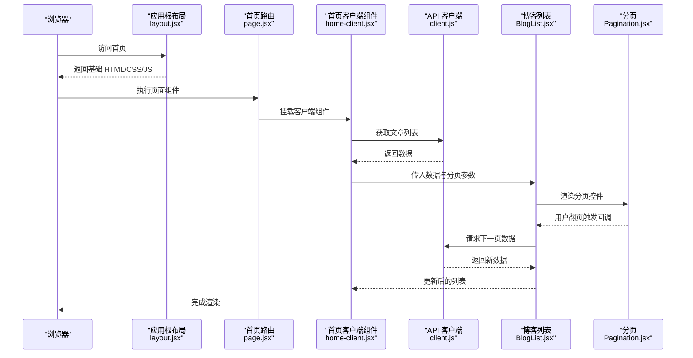
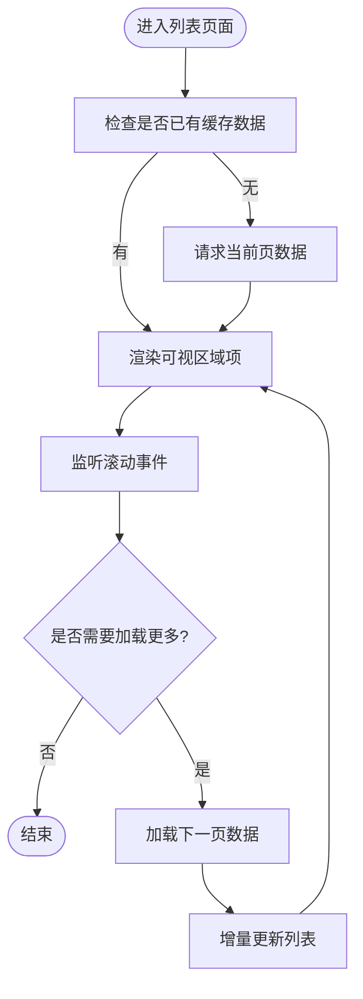
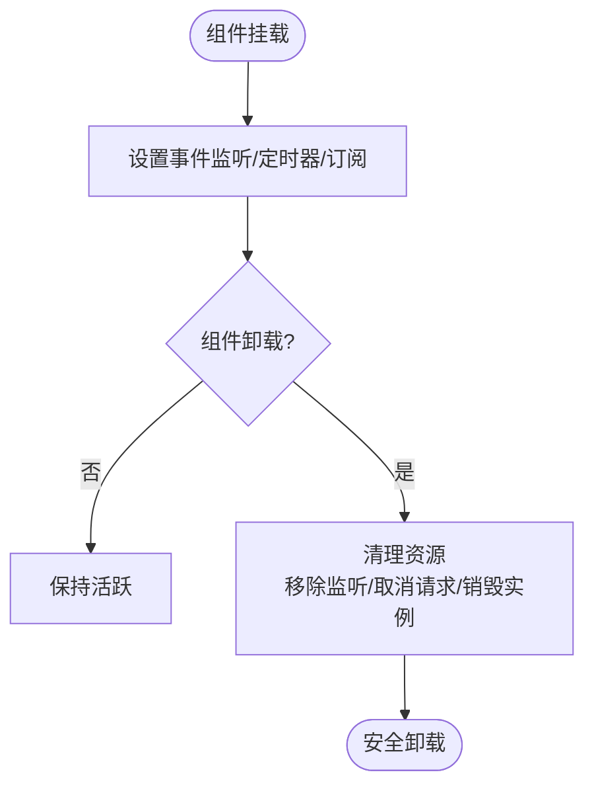
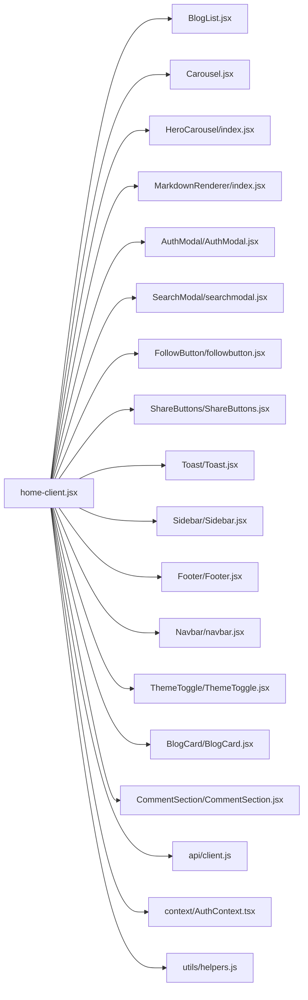

# 组件性能优化

<cite>
**本文引用的文件**   
- [next.config.mjs](file://next.config.mjs)
- [package.json](file://package.json)
- [src/app/layout.jsx](file://src/app/layout.jsx)
- [src/app/page.jsx](file://src/app/page.jsx)
- [src/app/home-client.jsx](file://src/app/home-client.jsx)
- [src/components/BlogList/BlogList.jsx](file://src/components/BlogList/BlogList.jsx)
- [src/components/Pagination/Pagination.jsx](file://src/components/Pagination/Pagination.jsx)
- [src/components/Carousel/Carousel.jsx](file://src/components/Carousel/Carousel.jsx)
- [src/components/HeroCarousel/index.jsx](file://src/components/HeroCarousel/index.jsx)
- [src/components/MarkdownRenderer/index.jsx](file://src/components/MarkdownRenderer/index.jsx)
- [src/components/AuthModal/AuthModal.jsx](file://src/components/AuthModal/AuthModal.jsx)
- [src/components/SearchModal/searchmodal.jsx](file://src/components/SearchModal/searchmodal.jsx)
- [src/components/FollowButton/followbutton.jsx](file://src/components/FollowButton/followbutton.jsx)
- [src/components/ShareButtons/ShareButtons.jsx](file://src/components/ShareButtons/ShareButtons.jsx)
- [src/components/Toast/Toast.jsx](file://src/components/Toast/Toast.jsx)
- [src/components/Sidebar/Sidebar.jsx](file://src/components/Sidebar/Sidebar.jsx)
- [src/components/Footer/Footer.jsx](file://src/components/Footer/Footer.jsx)
- [src/components/Navbar/navbar.jsx](file://src/components/Navbar/navbar.jsx)
- [src/components/ThemeToggle/ThemeToggle.jsx](file://src/components/ThemeToggle/ThemeToggle.jsx)
- [src/components/BlogCard/BlogCard.jsx](file://src/components/BlogCard/BlogCard.jsx)
- [src/components/CommentSection/CommentSection.jsx](file://src/components/CommentSection/CommentSection.jsx)
- [src/api/client.js](file://src/api/client.js)
- [src/context/AuthContext.tsx](file://src/context/AuthContext.tsx)
- [src/utils/helpers.js](file://src/utils/helpers.js)
</cite>

## 目录
1. [简介](#简介)
2. [项目结构](#项目结构)
3. [核心组件](#核心组件)
4. [架构总览](#架构总览)
5. [详细组件分析](#详细组件分析)
6. [依赖分析](#依赖分析)
7. [性能考量](#性能考量)
8. [故障排查指南](#故障排查指南)
9. [结论](#结论)
10. [附录](#附录)

## 简介
本文件聚焦于基于 Next.js 的前端项目中 React 组件的性能优化策略与实践，覆盖渲染优化、懒加载与代码分割、大型列表与复杂 UI 优化、内存泄漏预防与资源清理、浏览器性能监控与瓶颈定位，以及可落地的优化案例与基准测试方法。文档以仓库中的实际组件为切入点，给出面向工程化的优化建议与可视化流程图，帮助读者在不改变业务语义的前提下提升首屏与交互性能。

## 项目结构
本项目采用 Next.js App Router 组织页面与布局，通用 UI 组件集中在 src/components，API 客户端位于 src/api，上下文状态在 src/context，工具函数在 src/utils。关键入口包括：
- 应用根布局与全局样式注入
- 首页与客户端组件的拆分
- 列表与分页组件的组合
- 轮播、模态框等交互型组件
- Markdown 渲染器与分享、评论等富内容组件

```mermaid
graph TB
A["应用根布局<br/>src/app/layout.jsx"] --> B["首页路由<br/>src/app/page.jsx"]
B --> C["首页客户端组件<br/>src/app/home-client.jsx"]
C --> D["博客列表组件<br/>src/components/BlogList/BlogList.jsx"]
D --> E["分页组件<br/>src/components/Pagination/Pagination.jsx"]
C --> F["轮播组件<br/>src/components/Carousel/Carousel.jsx"]
C --> G["Hero 轮播入口<br/>src/components/HeroCarousel/index.jsx"]
C --> H["Markdown 渲染器<br/>src/components/MarkdownRenderer/index.jsx"]
C --> I["认证弹窗<br/>src/components/AuthModal/AuthModal.jsx"]
C --> J["搜索弹窗<br/>src/components/SearchModal/searchmodal.jsx"]
C --> K["关注按钮<br/>src/components/FollowButton/followbutton.jsx"]
C --> L["分享按钮<br/>src/components/ShareButtons/ShareButtons.jsx"]
C --> M["Toast 提示<br/>src/components/Toast/Toast.jsx"]
C --> N["侧边栏<br/>src/components/Sidebar/Sidebar.jsx"]
C --> O["页脚<br/>src/components/Footer/Footer.jsx"]
C --> P["导航栏<br/>src/components/Navbar/navbar.jsx"]
C --> Q["主题切换<br/>src/components/ThemeToggle/ThemeToggle.jsx"]
C --> R["文章卡片<br/>src/components/BlogCard/BlogCard.jsx"]
C --> S["评论区<br/>src/components/CommentSection/CommentSection.jsx"]
C --> T["API 客户端<br/>src/api/client.js"]
C --> U["认证上下文<br/>src/context/AuthContext.tsx"]
C --> V["工具函数<br/>src/utils/helpers.js"]
```

图表来源
- [src/app/layout.jsx](file://src/app/layout.jsx)
- [src/app/page.jsx](file://src/app/page.jsx)
- [src/app/home-client.jsx](file://src/app/home-client.jsx)
- [src/components/BlogList/BlogList.jsx](file://src/components/BlogList/BlogList.jsx)
- [src/components/Pagination/Pagination.jsx](file://src/components/Pagination/Pagination.jsx)
- [src/components/Carousel/Carousel.jsx](file://src/components/Carousel/Carousel.jsx)
- [src/components/HeroCarousel/index.jsx](file://src/components/HeroCarousel/index.jsx)
- [src/components/MarkdownRenderer/index.jsx](file://src/components/MarkdownRenderer/index.jsx)
- [src/components/AuthModal/AuthModal.jsx](file://src/components/AuthModal/AuthModal.jsx)
- [src/components/SearchModal/searchmodal.jsx](file://src/components/SearchModal/searchmodal.jsx)
- [src/components/FollowButton/followbutton.jsx](file://src/components/FollowButton/followbutton.jsx)
- [src/components/ShareButtons/ShareButtons.jsx](file://src/components/ShareButtons/ShareButtons.jsx)
- [src/components/Toast/Toast.jsx](file://src/components/Toast/Toast.jsx)
- [src/components/Sidebar/Sidebar.jsx](file://src/components/Sidebar/Sidebar.jsx)
- [src/components/Footer/Footer.jsx](file://src/components/Footer/Footer.jsx)
- [src/components/Navbar/navbar.jsx](file://src/components/Navbar/navbar.jsx)
- [src/components/ThemeToggle/ThemeToggle.jsx](file://src/components/ThemeToggle/ThemeToggle.jsx)
- [src/components/BlogCard/BlogCard.jsx](file://src/components/BlogCard/BlogCard.jsx)
- [src/components/CommentSection/CommentSection.jsx](file://src/components/CommentSection/CommentSection.jsx)
- [src/api/client.js](file://src/api/client.js)
- [src/context/AuthContext.tsx](file://src/context/AuthContext.tsx)
- [src/utils/helpers.js](file://src/utils/helpers.js)

章节来源
- [src/app/layout.jsx](file://src/app/layout.jsx)
- [src/app/page.jsx](file://src/app/page.jsx)
- [src/app/home-client.jsx](file://src/app/home-client.jsx)
- [next.config.mjs](file://next.config.mjs)
- [package.json](file://package.json)

## 核心组件
围绕首页数据流与渲染路径，以下组件是性能优化的重点：
- 首页客户端组件：承载主要交互与数据获取逻辑
- 博客列表与分页：大数据量渲染与滚动体验
- 轮播与 Hero 轮播：动画与图片加载优化
- Markdown 渲染器：富文本渲染成本与惰性处理
- 认证与搜索弹窗：按需加载与事件监听清理
- 分享、关注、Toast、侧边栏、页脚、导航、主题切换：轻量组件的 memo 化与状态隔离

章节来源
- [src/app/home-client.jsx](file://src/app/home-client.jsx)
- [src/components/BlogList/BlogList.jsx](file://src/components/BlogList/BlogList.jsx)
- [src/components/Pagination/Pagination.jsx](file://src/components/Pagination/Pagination.jsx)
- [src/components/Carousel/Carousel.jsx](file://src/components/Carousel/Carousel.jsx)
- [src/components/HeroCarousel/index.jsx](file://src/components/HeroCarousel/index.jsx)
- [src/components/MarkdownRenderer/index.jsx](file://src/components/MarkdownRenderer/index.jsx)
- [src/components/AuthModal/AuthModal.jsx](file://src/components/AuthModal/AuthModal.jsx)
- [src/components/SearchModal/searchmodal.jsx](file://src/components/SearchModal/searchmodal.jsx)
- [src/components/FollowButton/followbutton.jsx](file://src/components/FollowButton/followbutton.jsx)
- [src/components/ShareButtons/ShareButtons.jsx](file://src/components/ShareButtons/ShareButtons.jsx)
- [src/components/Toast/Toast.jsx](file://src/components/Toast/Toast.jsx)
- [src/components/Sidebar/Sidebar.jsx](file://src/components/Sidebar/Sidebar.jsx)
- [src/components/Footer/Footer.jsx](file://src/components/Footer/Footer.jsx)
- [src/components/Navbar/navbar.jsx](file://src/components/Navbar/navbar.jsx)
- [src/components/ThemeToggle/ThemeToggle.jsx](file://src/components/ThemeToggle/ThemeToggle.jsx)
- [src/components/BlogCard/BlogCard.jsx](file://src/components/BlogCard/BlogCard.jsx)
- [src/components/CommentSection/CommentSection.jsx](file://src/components/CommentSection/CommentSection.jsx)
- [src/api/client.js](file://src/api/client.js)
- [src/context/AuthContext.tsx](file://src/context/AuthContext.tsx)
- [src/utils/helpers.js](file://src/utils/helpers.js)

## 架构总览
从“请求到渲染”的关键路径如下：
- 服务端渲染布局与页面壳
- 进入客户端组件后发起 API 请求
- 列表渲染与分页控制
- 富内容与交互组件按需加载与缓存

图表来源
- [src/app/layout.jsx](file://src/app/layout.jsx)
- [src/app/page.jsx](file://src/app/page.jsx)
- [src/app/home-client.jsx](file://src/app/home-client.jsx)
- [src/api/client.js](file://src/api/client.js)
- [src/components/BlogList/BlogList.jsx](file://src/components/BlogList/BlogList.jsx)
- [src/components/Pagination/Pagination.jsx](file://src/components/Pagination/Pagination.jsx)

## 详细组件分析

### 渲染优化：React.memo 与 shouldComponentUpdate
- 适用场景
  - 纯展示型组件（如页脚、导航、主题切换）适合使用 React.memo 避免不必要的重渲染
  - 类组件可使用 shouldComponentUpdate 进行浅比较或自定义判断
- 注意事项
  - props 对象引用变化会导致 memo 失效，需稳定引用或使用 useMemo/useCallback
  - 过度 memo 化会增加比较开销，应结合 Profiler 评估收益
- 实践建议
  - 对频繁更新的父组件传递的静态子组件进行 memo 化
  - 将大对象拆分为更细粒度的 props，减少比较范围

章节来源
- [src/components/Footer/Footer.jsx](file://src/components/Footer/Footer.jsx)
- [src/components/Navbar/navbar.jsx](file://src/components/Navbar/navbar.jsx)
- [src/components/ThemeToggle/ThemeToggle.jsx](file://src/components/ThemeToggle/ThemeToggle.jsx)

### 懒加载与代码分割
- 动态导入
  - 对非首屏模块（如 Markdown 渲染器、轮播、弹窗）使用动态 import() 实现按需加载
  - 配合 Suspense 提供加载占位，提升感知性能
- 路由级代码分割
  - Next.js 默认按路由分割，可在 next.config.mjs 中调整打包策略（如 webpack 配置）
- 图片懒加载
  - 使用原生 loading="lazy" 或 IntersectionObserver 实现视口内加载
- 实践建议
  - 将重型库（如 Markdown 解析、轮播动画）延迟加载
  - 对弹窗与抽屉类组件使用条件渲染 + 动态导入

章节来源
- [src/components/MarkdownRenderer/index.jsx](file://src/components/MarkdownRenderer/index.jsx)
- [src/components/Carousel/Carousel.jsx](file://src/components/Carousel/Carousel.jsx)
- [src/components/HeroCarousel/index.jsx](file://src/components/HeroCarousel/index.jsx)
- [src/components/AuthModal/AuthModal.jsx](file://src/components/AuthModal/AuthModal.jsx)
- [src/components/SearchModal/searchmodal.jsx](file://src/components/SearchModal/searchmodal.jsx)
- [next.config.mjs](file://next.config.mjs)

### 大型列表与复杂 UI 优化
- 虚拟滚动
  - 仅渲染可视区域项，显著降低 DOM 节点数量与布局计算
  - 适用于长列表（文章列表、问答列表）
- 分页加载
  - 通过 Pagination 组件控制每页大小与页码，减少单次渲染压力
- 图片懒加载与缩略图
  - 先显示低清缩略图，再加载高清原图
- 复杂 UI 优化
  - 将复杂子树 memo 化，避免整棵子树重复渲染
  - 使用 requestIdleCallback 或 Web Worker 处理耗时计算

图表来源
- [src/components/BlogList/BlogList.jsx](file://src/components/BlogList/BlogList.jsx)
- [src/components/Pagination/Pagination.jsx](file://src/components/Pagination/Pagination.jsx)
- [src/api/client.js](file://src/api/client.js)

章节来源
- [src/components/BlogList/BlogList.jsx](file://src/components/BlogList/BlogList.jsx)
- [src/components/Pagination/Pagination.jsx](file://src/components/Pagination/Pagination.jsx)

### 内存泄漏预防与资源清理
- 事件监听与定时器
  - 在 useEffect 返回清理函数移除事件监听、取消定时器
- 网络请求
  - 使用 AbortController 取消未完成的请求，避免状态更新在卸载组件后发生
- 第三方库
  - 轮播、弹窗等组件需在卸载时销毁实例，释放内部资源
- 上下文与订阅
  - 确保在组件卸载时注销订阅，防止闭包持有引用导致泄漏

图表来源
- [src/components/Carousel/Carousel.jsx](file://src/components/Carousel/Carousel.jsx)
- [src/components/AuthModal/AuthModal.jsx](file://src/components/AuthModal/AuthModal.jsx)
- [src/components/SearchModal/searchmodal.jsx](file://src/components/SearchModal/searchmodal.jsx)
- [src/api/client.js](file://src/api/client.js)

章节来源
- [src/components/Carousel/Carousel.jsx](file://src/components/Carousel/Carousel.jsx)
- [src/components/AuthModal/AuthModal.jsx](file://src/components/AuthModal/AuthModal.jsx)
- [src/components/SearchModal/searchmodal.jsx](file://src/components/SearchModal/searchmodal.jsx)
- [src/api/client.js](file://src/api/client.js)

### 浏览器性能监控与瓶颈定位
- Chrome DevTools
  - Performance 面板录制时间线，识别长任务与重排重绘热点
  - Memory 面板检测堆快照与内存增长趋势
  - Network 面板分析资源体积与请求时序
- Lighthouse
  - 生成性能报告，定位可优化项（如图片压缩、代码分割、缓存策略）
- React DevTools Profiler
  - 记录渲染火焰图，定位高成本组件与多余渲染
- 指标建议
  - 首屏：FCP/LCP
  - 交互：INP/TTFB
  - 稳定性：CLS

章节来源
- [package.json](file://package.json)

### 实战案例与基准测试方法
- 案例一：博客列表分页与虚拟滚动
  - 优化前：一次性渲染大量条目，滚动卡顿
  - 优化后：分页加载 + 可视区渲染，FPS 提升，滚动流畅
- 案例二：Markdown 渲染器懒加载
  - 优化前：首屏即加载重型解析库
  - 优化后：按需动态导入，首屏体积下降，LCP 改善
- 案例三：轮播组件资源清理
  - 优化前：切换页面后仍有定时器运行，内存缓慢增长
  - 优化后：卸载时清理定时器与事件，内存稳定
- 基准测试步骤
  - 使用 Lighthouse 对比优化前后得分
  - 使用 Performance 面板测量关键路径时长
  - 使用 React Profiler 统计组件渲染次数与耗时
  - 使用 Network 面板观察资源体积与并发

章节来源
- [src/components/BlogList/BlogList.jsx](file://src/components/BlogList/BlogList.jsx)
- [src/components/MarkdownRenderer/index.jsx](file://src/components/MarkdownRenderer/index.jsx)
- [src/components/Carousel/Carousel.jsx](file://src/components/Carousel/Carousel.jsx)
- [package.json](file://package.json)

## 依赖分析
组件间依赖关系清晰，遵循单向数据流与职责分离原则。以下为关键依赖图：

图表来源
- [src/app/home-client.jsx](file://src/app/home-client.jsx)
- [src/components/BlogList/BlogList.jsx](file://src/components/BlogList/BlogList.jsx)
- [src/components/Carousel/Carousel.jsx](file://src/components/Carousel/Carousel.jsx)
- [src/components/HeroCarousel/index.jsx](file://src/components/HeroCarousel/index.jsx)
- [src/components/MarkdownRenderer/index.jsx](file://src/components/MarkdownRenderer/index.jsx)
- [src/components/AuthModal/AuthModal.jsx](file://src/components/AuthModal/AuthModal.jsx)
- [src/components/SearchModal/searchmodal.jsx](file://src/components/SearchModal/searchmodal.jsx)
- [src/components/FollowButton/followbutton.jsx](file://src/components/FollowButton/followbutton.jsx)
- [src/components/ShareButtons/ShareButtons.jsx](file://src/components/ShareButtons/ShareButtons.jsx)
- [src/components/Toast/Toast.jsx](file://src/components/Toast/Toast.jsx)
- [src/components/Sidebar/Sidebar.jsx](file://src/components/Sidebar/Sidebar.jsx)
- [src/components/Footer/Footer.jsx](file://src/components/Footer/Footer.jsx)
- [src/components/Navbar/navbar.jsx](file://src/components/Navbar/navbar.jsx)
- [src/components/ThemeToggle/ThemeToggle.jsx](file://src/components/ThemeToggle/ThemeToggle.jsx)
- [src/components/BlogCard/BlogCard.jsx](file://src/components/BlogCard/BlogCard.jsx)
- [src/components/CommentSection/CommentSection.jsx](file://src/components/CommentSection/CommentSection.jsx)
- [src/api/client.js](file://src/api/client.js)
- [src/context/AuthContext.tsx](file://src/context/AuthContext.tsx)
- [src/utils/helpers.js](file://src/utils/helpers.js)

章节来源
- [src/app/home-client.jsx](file://src/app/home-client.jsx)
- [src/api/client.js](file://src/api/client.js)
- [src/context/AuthContext.tsx](file://src/context/AuthContext.tsx)
- [src/utils/helpers.js](file://src/utils/helpers.js)

## 性能考量
- 渲染层面
  - 合理使用 React.memo 与 useMemo/useCallback 稳定引用
  - 避免在 render 中创建新对象/函数
- 资源层面
  - 图片压缩与格式选择（WebP/AVIF），启用 CDN 与缓存
  - 字体与图标按需加载
- 网络层面
  - 合并请求、合理分页、预取关键资源
  - 使用 AbortController 取消过期请求
- 交互层面
  - 节流/防抖高频事件（滚动、输入）
  - 使用 requestIdleCallback 调度低优先级任务
- 构建层面
  - 利用 Next.js 路由级代码分割与自动优化
  - 在 next.config.mjs 中调整打包策略与外部依赖

[本节为通用指导，不直接分析具体文件]

## 故障排查指南
- 常见症状
  - 页面卡顿、滚动掉帧、内存持续增长
  - 切换路由后仍有后台任务运行
- 排查步骤
  - 使用 Performance 面板定位长任务与重排重绘热点
  - 使用 Memory 面板抓取堆快照，查找未释放引用
  - 使用 React Profiler 查看组件渲染次数与耗时
  - 使用 Network 面板检查资源体积与请求失败重试
- 修复要点
  - 为高频更新组件添加 memo 化与稳定 props 引用
  - 在卸载时清理事件监听、定时器与订阅
  - 对重型模块实施懒加载与缓存策略

章节来源
- [src/components/Carousel/Carousel.jsx](file://src/components/Carousel/Carousel.jsx)
- [src/components/AuthModal/AuthModal.jsx](file://src/components/AuthModal/AuthModal.jsx)
- [src/components/SearchModal/searchmodal.jsx](file://src/components/SearchModal/searchmodal.jsx)
- [src/api/client.js](file://src/api/client.js)

## 结论
通过对渲染优化、懒加载与代码分割、大型列表与复杂 UI 优化、内存泄漏预防与资源清理、性能监控与瓶颈定位的系统性实践，可以在不牺牲用户体验的前提下显著提升前端性能。建议以数据驱动的方式持续度量与验证优化效果，结合 Lighthouse、Performance 与 React Profiler 形成闭环优化流程。

## 附录
- 术语说明
  - LCP：最大内容绘制
  - INP：交互到下一次绘制
  - CLS：累积布局偏移
- 推荐工具
  - Chrome DevTools、Lighthouse、React DevTools Profiler
- 参考配置
  - next.config.mjs 中的构建与打包策略
  - package.json 中的脚本与依赖版本

章节来源
- [next.config.mjs](file://next.config.mjs)
- [package.json](file://package.json)