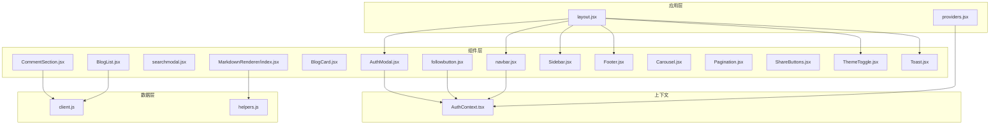
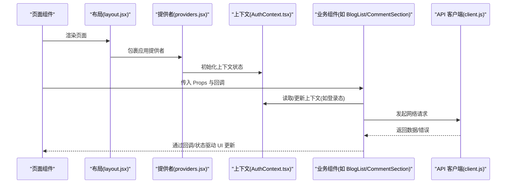
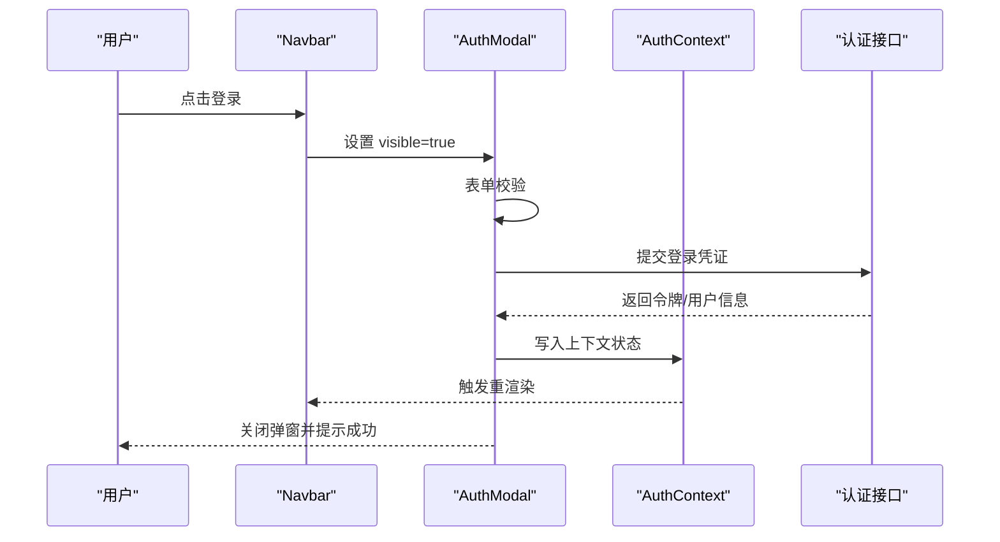
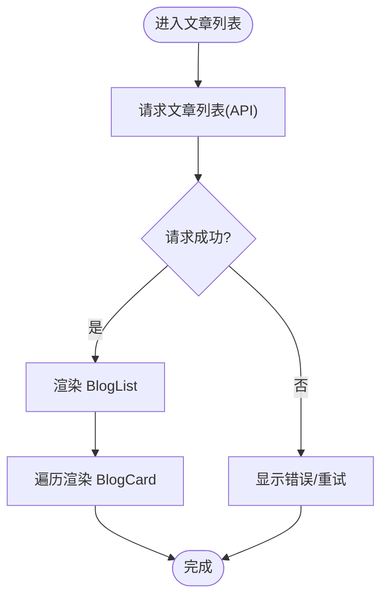
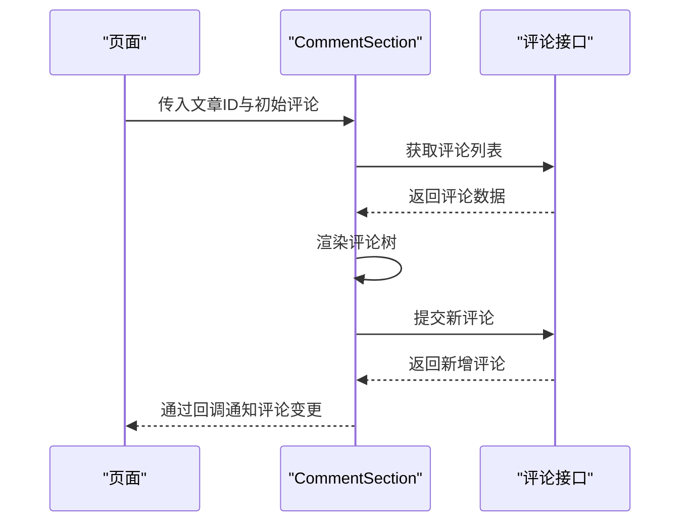
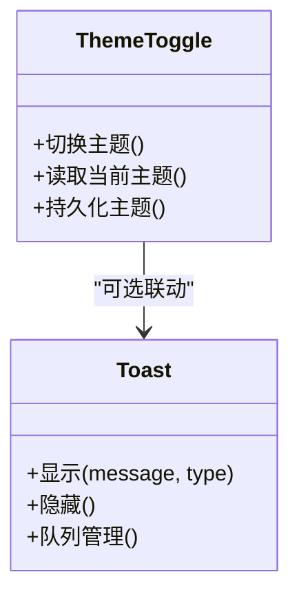
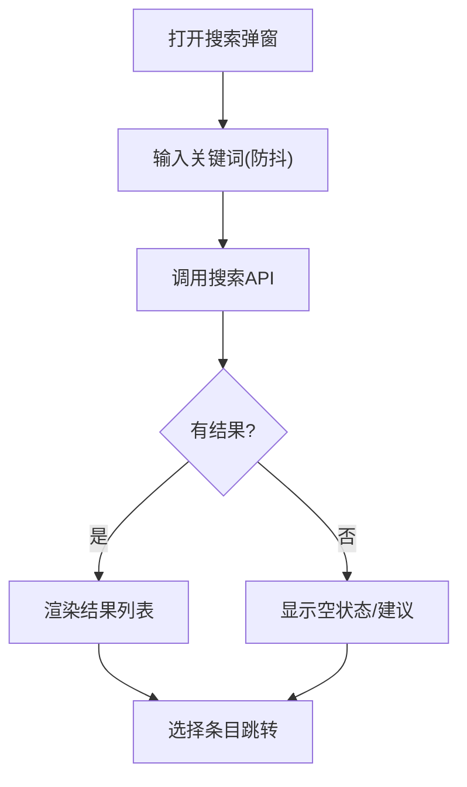
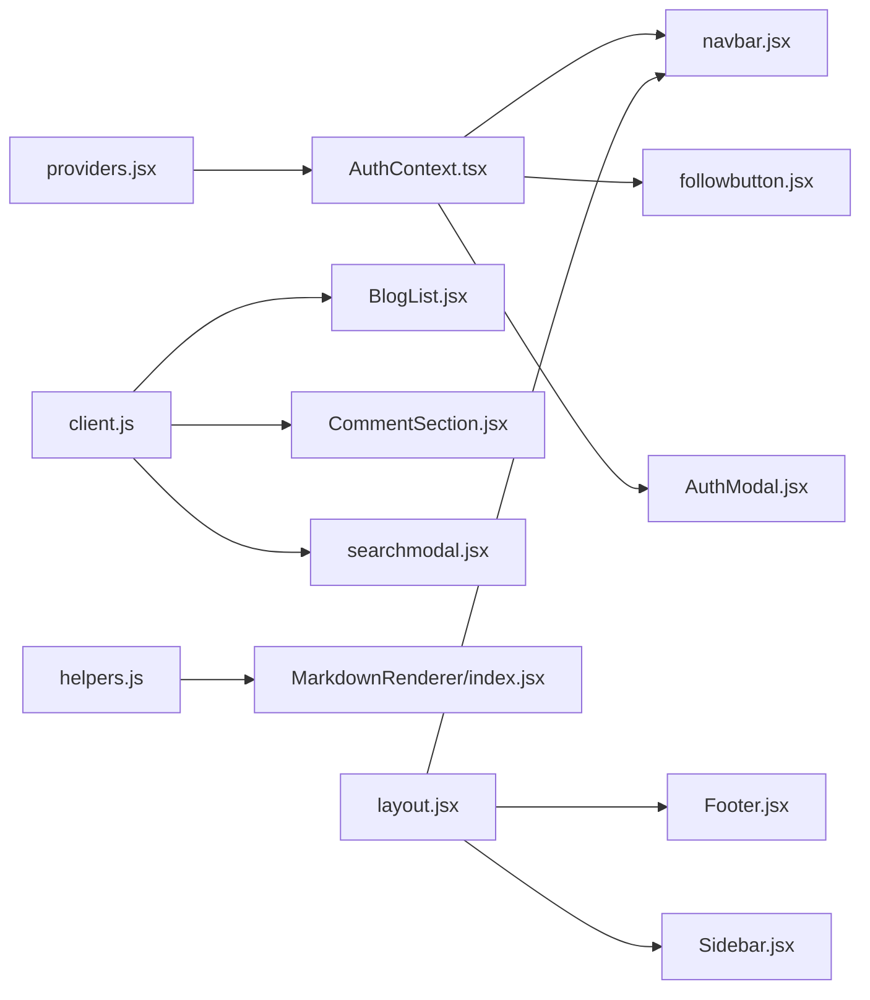

# 组件架构设计

<cite>
**本文引用的文件**   
- [src/app/layout.jsx](file://src/app/layout.jsx)
- [src/app/providers.jsx](file://src/app/providers.jsx)
- [src/context/AuthContext.tsx](file://src/context/AuthContext.tsx)
- [src/components/AuthModal/AuthModal.jsx](file://src/components/AuthModal/AuthModal.jsx)
- [src/components/BlogCard/BlogCard.jsx](file://src/components/BlogCard/BlogCard.jsx)
- [src/components/BlogList/BlogList.jsx](file://src/components/BlogList/BlogList.jsx)
- [src/components/Carousel/Carousel.jsx](file://src/components/Carousel/Carousel.jsx)
- [src/components/CommentSection/CommentSection.jsx](file://src/components/CommentSection/CommentSection.jsx)
- [src/components/FollowButton/followbutton.jsx](file://src/components/FollowButton/followbutton.jsx)
- [src/components/Footer/Footer.jsx](file://src/components/Footer/Footer.jsx)
- [src/components/MarkdownRenderer/index.jsx](file://src/components/MarkdownRenderer/index.jsx)
- [src/components/Navbar/navbar.jsx](file://src/components/Navbar/navbar.jsx)
- [src/components/Pagination/Pagination.jsx](file://src/components/Pagination/Pagination.jsx)
- [src/components/SearchModal/searchmodal.jsx](file://src/components/SearchModal/searchmodal.jsx)
- [src/components/ShareButtons/ShareButtons.jsx](file://src/components/ShareButtons/ShareButtons.jsx)
- [src/components/Sidebar/Sidebar.jsx](file://src/components/Sidebar/Sidebar.jsx)
- [src/components/ThemeToggle/ThemeToggle.jsx](file://src/components/ThemeToggle/ThemeToggle.jsx)
- [src/components/Toast/Toast.jsx](file://src/components/Toast/Toast.jsx)
- [src/api/client.js](file://src/api/client.js)
- [src/utils/helpers.js](file://src/utils/helpers.js)
</cite>

## 目录
1. [引言](#引言)
2. [项目结构](#项目结构)
3. [核心组件](#核心组件)
4. [架构总览](#架构总览)
5. [详细组件分析](#详细组件分析)
6. [依赖关系分析](#依赖关系分析)
7. [性能考虑](#性能考虑)
8. [故障排查指南](#故障排查指南)
9. [结论](#结论)
10. [附录](#附录)

## 引言
本文件聚焦于前端 React 组件的架构设计与组织原则，结合 Next.js App Router 的项目结构，系统阐述功能组件与展示组件的分离、Props 传递模式、事件处理机制、组件间通信方式（含上下文与事件总线）、高阶组件与自定义 Hooks 的使用场景与实现模式、可复用性设计（配置化、插槽模式、组合模式）、状态管理策略（本地状态、上下文状态、服务端状态协调），以及测试策略与性能优化技巧。目标是帮助读者快速理解并落地一套高内聚、低耦合、可扩展的前端组件体系。

## 项目结构
本项目采用 Next.js App Router 的组织方式：页面级路由位于 src/app，全局布局与提供者位于 src/app，业务组件集中于 src/components，跨组件共享状态通过 src/context 提供，API 客户端集中在 src/api，通用工具函数在 src/utils。

图表来源
- [src/app/layout.jsx](file://src/app/layout.jsx)
- [src/app/providers.jsx](file://src/app/providers.jsx)
- [src/context/AuthContext.tsx](file://src/context/AuthContext.tsx)
- [src/components/Navbar/navbar.jsx](file://src/components/Navbar/navbar.jsx)
- [src/components/FollowButton/followbutton.jsx](file://src/components/FollowButton/followbutton.jsx)
- [src/components/SearchModal/searchmodal.jsx](file://src/components/SearchModal/searchmodal.jsx)
- [src/components/AuthModal/AuthModal.jsx](file://src/components/AuthModal/AuthModal.jsx)
- [src/components/BlogList/BlogList.jsx](file://src/components/BlogList/BlogList.jsx)
- [src/components/CommentSection/CommentSection.jsx](file://src/components/CommentSection/CommentSection.jsx)
- [src/components/MarkdownRenderer/index.jsx](file://src/components/MarkdownRenderer/index.jsx)
- [src/api/client.js](file://src/api/client.js)
- [src/utils/helpers.js](file://src/utils/helpers.js)

章节来源
- [src/app/layout.jsx](file://src/app/layout.jsx)
- [src/app/providers.jsx](file://src/app/providers.jsx)
- [src/context/AuthContext.tsx](file://src/context/AuthContext.tsx)
- [src/components/Navbar/navbar.jsx](file://src/components/Navbar/navbar.jsx)
- [src/components/FollowButton/followbutton.jsx](file://src/components/FollowButton/followbutton.jsx)
- [src/components/SearchModal/searchmodal.jsx](file://src/components/SearchModal/searchmodal.jsx)
- [src/components/AuthModal/AuthModal.jsx](file://src/components/AuthModal/AuthModal.jsx)
- [src/components/BlogList/BlogList.jsx](file://src/components/BlogList/BlogList.jsx)
- [src/components/CommentSection/CommentSection.jsx](file://src/components/CommentSection/CommentSection.jsx)
- [src/components/MarkdownRenderer/index.jsx](file://src/components/MarkdownRenderer/index.jsx)
- [src/api/client.js](file://src/api/client.js)
- [src/utils/helpers.js](file://src/utils/helpers.js)

## 核心组件
- 导航与布局
  - Navbar：负责顶部导航、搜索入口、主题切换等；通常从 AuthContext 读取登录态以显示不同菜单项。
  - Sidebar：侧边栏聚合分类、标签或推荐内容，常作为页面骨架的一部分。
  - Footer：站点底部信息、版权与链接。
- 认证与用户交互
  - AuthModal：登录/注册弹窗，触发后由父页面控制显隐；内部调用认证相关 API。
  - FollowButton：关注/取消关注按钮，根据当前用户身份与目标对象状态进行交互。
  - ThemeToggle：切换主题，通常将主题写入 localStorage 并通过 Context 广播。
- 内容与展示
  - BlogList/BlogCard：列表与卡片展示，BlogList 负责分页与数据获取，BlogCard 专注渲染单条文章摘要。
  - CommentSection：评论区域，支持加载、提交、点赞等交互。
  - MarkdownRenderer：将 Markdown 文本渲染为 HTML，并可注入安全过滤与自定义规则。
  - Carousel：轮播图组件，支持自动播放、指示器与手势。
  - ShareButtons：分享按钮集合，支持多平台分享链接生成。
  - Pagination：分页控件，与上层数据源解耦。
  - Toast：轻量提示消息，常用于操作反馈。
- 辅助与全局
  - SearchModal：全局搜索弹窗，集中搜索逻辑与结果展示。
  - providers：应用级 Provider 容器，挂载 AuthContext、主题等上下文。
  - layout：根布局，统一注入头部、侧边栏、底部、全局弹窗与样式。

章节来源
- [src/components/Navbar/navbar.jsx](file://src/components/Navbar/navbar.jsx)
- [src/components/Sidebar/Sidebar.jsx](file://src/components/Sidebar/Sidebar.jsx)
- [src/components/Footer/Footer.jsx](file://src/components/Footer/Footer.jsx)
- [src/components/AuthModal/AuthModal.jsx](file://src/components/AuthModal/AuthModal.jsx)
- [src/components/FollowButton/followbutton.jsx](file://src/components/FollowButton/followbutton.jsx)
- [src/components/ThemeToggle/ThemeToggle.jsx](file://src/components/ThemeToggle/ThemeToggle.jsx)
- [src/components/BlogList/BlogList.jsx](file://src/components/BlogList/BlogList.jsx)
- [src/components/BlogCard/BlogCard.jsx](file://src/components/BlogCard/BlogCard.jsx)
- [src/components/CommentSection/CommentSection.jsx](file://src/components/CommentSection/CommentSection.jsx)
- [src/components/MarkdownRenderer/index.jsx](file://src/components/MarkdownRenderer/index.jsx)
- [src/components/Carousel/Carousel.jsx](file://src/components/Carousel/Carousel.jsx)
- [src/components/ShareButtons/ShareButtons.jsx](file://src/components/ShareButtons/ShareButtons.jsx)
- [src/components/Pagination/Pagination.jsx](file://src/components/Pagination/Pagination.jsx)
- [src/components/Toast/Toast.jsx](file://src/components/Toast/Toast.jsx)
- [src/components/SearchModal/searchmodal.jsx](file://src/components/SearchModal/searchmodal.jsx)
- [src/app/providers.jsx](file://src/app/providers.jsx)
- [src/app/layout.jsx](file://src/app/layout.jsx)

## 架构总览
整体采用“页面组合 + 上下文共享 + 组件库”的分层架构：
- 页面层（App Router）：组合布局与业务组件，负责路由与数据流入口。
- 布局与提供者：layout 统一包裹全局 UI 元素，providers 注入上下文。
- 组件层：按职责拆分为展示型与功能型，遵循单一职责与可组合原则。
- 数据层：API 客户端封装请求与错误处理，工具函数提供通用能力。

图表来源
- [src/app/layout.jsx](file://src/app/layout.jsx)
- [src/app/providers.jsx](file://src/app/providers.jsx)
- [src/context/AuthContext.tsx](file://src/context/AuthContext.tsx)
- [src/components/BlogList/BlogList.jsx](file://src/components/BlogList/BlogList.jsx)
- [src/components/CommentSection/CommentSection.jsx](file://src/components/CommentSection/CommentSection.jsx)
- [src/api/client.js](file://src/api/client.js)

## 详细组件分析

### 认证上下文与认证弹窗
- 设计要点
  - AuthContext 集中管理用户登录态、权限与常用方法（登录、登出、刷新）。
  - AuthModal 作为受控弹窗，由父页面控制显隐，内部完成表单校验与 API 调用。
  - 登录成功后通过上下文广播，触发全局 UI 更新（如导航菜单变化）。
- 关键流程
  - 用户点击登录 -> 打开弹窗 -> 填写表单 -> 提交 -> 调用认证接口 -> 更新上下文 -> 关闭弹窗并刷新 UI。

图表来源
- [src/components/Navbar/navbar.jsx](file://src/components/Navbar/navbar.jsx)
- [src/components/AuthModal/AuthModal.jsx](file://src/components/AuthModal/AuthModal.jsx)
- [src/context/AuthContext.tsx](file://src/context/AuthContext.tsx)

章节来源
- [src/context/AuthContext.tsx](file://src/context/AuthContext.tsx)
- [src/components/AuthModal/AuthModal.jsx](file://src/components/AuthModal/AuthModal.jsx)
- [src/components/Navbar/navbar.jsx](file://src/components/Navbar/navbar.jsx)

### 文章列表与详情渲染
- 设计要点
  - BlogList 负责分页、筛选与数据拉取，BlogCard 仅负责单项渲染。
  - 列表页通过 props 向子组件传递数据与回调，避免直接访问上下文。
  - MarkdownRenderer 用于文章内容渲染，可注入安全策略与扩展语法。
- 数据流
  - 页面 -> BlogList -> API -> 数据缓存/状态 -> 渲染 BlogCard 列表。

图表来源
- [src/components/BlogList/BlogList.jsx](file://src/components/BlogList/BlogList.jsx)
- [src/components/BlogCard/BlogCard.jsx](file://src/components/BlogCard/BlogCard.jsx)
- [src/components/MarkdownRenderer/index.jsx](file://src/components/MarkdownRenderer/index.jsx)
- [src/api/client.js](file://src/api/client.js)

章节来源
- [src/components/BlogList/BlogList.jsx](file://src/components/BlogList/BlogList.jsx)
- [src/components/BlogCard/BlogCard.jsx](file://src/components/BlogCard/BlogCard.jsx)
- [src/components/MarkdownRenderer/index.jsx](file://src/components/MarkdownRenderer/index.jsx)
- [src/api/client.js](file://src/api/client.js)

### 评论模块
- 设计要点
  - CommentSection 维护本地评论列表与加载状态，提交时调用 API 并乐观更新。
  - 支持嵌套回复、点赞、删除等操作，通过回调向上通知父组件。
- 交互流程
  - 加载评论 -> 用户输入 -> 提交 -> 更新本地列表 -> 同步后端 -> 失败回滚。

图表来源
- [src/components/CommentSection/CommentSection.jsx](file://src/components/CommentSection/CommentSection.jsx)
- [src/api/client.js](file://src/api/client.js)

章节来源
- [src/components/CommentSection/CommentSection.jsx](file://src/components/CommentSection/CommentSection.jsx)
- [src/api/client.js](file://src/api/client.js)

### 主题与全局提示
- 主题切换
  - ThemeToggle 读取/写入主题到 localStorage，并通过上下文或 DOM 属性切换主题类名。
- 全局提示
  - Toast 作为全局提示组件，由任意子组件触发，统一在布局中渲染。

图表来源
- [src/components/ThemeToggle/ThemeToggle.jsx](file://src/components/ThemeToggle/ThemeToggle.jsx)
- [src/components/Toast/Toast.jsx](file://src/components/Toast/Toast.jsx)

章节来源
- [src/components/ThemeToggle/ThemeToggle.jsx](file://src/components/ThemeToggle/ThemeToggle.jsx)
- [src/components/Toast/Toast.jsx](file://src/components/Toast/Toast.jsx)

### 搜索与轮播
- 搜索弹窗
  - SearchModal 集中搜索输入、历史与结果展示，支持键盘快捷键与防抖。
- 轮播图
  - Carousel 支持自动播放、手动切换、响应式适配与懒加载图片。

图表来源
- [src/components/SearchModal/searchmodal.jsx](file://src/components/SearchModal/searchmodal.jsx)
- [src/api/client.js](file://src/api/client.js)

章节来源
- [src/components/SearchModal/searchmodal.jsx](file://src/components/SearchModal/searchmodal.jsx)
- [src/api/client.js](file://src/api/client.js)

## 依赖关系分析
- 组件对上下文的依赖
  - Navbar、FollowButton、AuthModal 等需要读取/更新 AuthContext，以实现登录态驱动的 UI 差异。
- 组件对 API 的依赖
  - BlogList、CommentSection、SearchModal 等通过 client.js 发起请求，utils/helpers.js 提供通用工具。
- 布局与提供者
  - layout 统一注入全局组件与样式，providers 集中挂载上下文，降低页面耦合度。

图表来源
- [src/context/AuthContext.tsx](file://src/context/AuthContext.tsx)
- [src/components/Navbar/navbar.jsx](file://src/components/Navbar/navbar.jsx)
- [src/components/FollowButton/followbutton.jsx](file://src/components/FollowButton/followbutton.jsx)
- [src/components/AuthModal/AuthModal.jsx](file://src/components/AuthModal/AuthModal.jsx)
- [src/api/client.js](file://src/api/client.js)
- [src/components/BlogList/BlogList.jsx](file://src/components/BlogList/BlogList.jsx)
- [src/components/CommentSection/CommentSection.jsx](file://src/components/CommentSection/CommentSection.jsx)
- [src/components/SearchModal/searchmodal.jsx](file://src/components/SearchModal/searchmodal.jsx)
- [src/utils/helpers.js](file://src/utils/helpers.js)
- [src/components/MarkdownRenderer/index.jsx](file://src/components/MarkdownRenderer/index.jsx)
- [src/app/layout.jsx](file://src/app/layout.jsx)
- [src/app/providers.jsx](file://src/app/providers.jsx)

章节来源
- [src/context/AuthContext.tsx](file://src/context/AuthContext.tsx)
- [src/components/Navbar/navbar.jsx](file://src/components/Navbar/navbar.jsx)
- [src/components/FollowButton/followbutton.jsx](file://src/components/FollowButton/followbutton.jsx)
- [src/components/AuthModal/AuthModal.jsx](file://src/components/AuthModal/AuthModal.jsx)
- [src/api/client.js](file://src/api/client.js)
- [src/components/BlogList/BlogList.jsx](file://src/components/BlogList/BlogList.jsx)
- [src/components/CommentSection/CommentSection.jsx](file://src/components/CommentSection/CommentSection.jsx)
- [src/components/SearchModal/searchmodal.jsx](file://src/components/SearchModal/searchmodal.jsx)
- [src/utils/helpers.js](file://src/utils/helpers.js)
- [src/components/MarkdownRenderer/index.jsx](file://src/components/MarkdownRenderer/index.jsx)
- [src/app/layout.jsx](file://src/app/layout.jsx)
- [src/app/providers.jsx](file://src/app/providers.jsx)

## 性能考虑
- 渲染优化
  - 使用 React.memo 包裹纯展示组件（如 BlogCard、ShareButtons），减少不必要的重渲染。
  - 列表渲染使用稳定 key，避免频繁插入/删除导致的重排。
- 数据获取
  - 列表与搜索接口增加分页与节流/防抖，避免高频请求。
  - 对热点数据做简单缓存（内存或 localStorage），提升二次访问速度。
- 资源与样式
  - 图片懒加载与占位图，按需加载大体积资源。
  - 样式模块化（CSS Modules）避免全局污染，减小 CSS 体积。
- 交互体验
  - 长列表虚拟滚动（当条目较多时）。
  - 异步操作使用乐观更新与错误回滚，提升感知性能。

[本节为通用指导，不直接分析具体文件]

## 故障排查指南
- 常见问题定位
  - 登录态异常：检查 AuthContext 初始化与持久化逻辑，确认 token 存储与过期处理。
  - 网络请求失败：查看 client.js 的错误拦截与重试策略，确认接口地址与鉴权头。
  - 渲染错乱：检查组件 props 类型与默认值，确保必要字段存在。
- 调试建议
  - 在关键组件打印 props 与状态变化，或使用浏览器开发者工具的 React DevTools。
  - 对复杂交互添加日志埋点，记录用户操作序列与网络请求时序。

章节来源
- [src/context/AuthContext.tsx](file://src/context/AuthContext.tsx)
- [src/api/client.js](file://src/api/client.js)

## 结论
本方案以清晰的层次划分与明确的职责边界为基础，通过上下文共享与组件组合实现高内聚、低耦合的前端架构。配合合理的状态管理、可复用的组件设计与完善的测试与性能优化策略，能够支撑博客网站在功能扩展与维护上的长期演进。

[本节为总结性内容，不直接分析具体文件]

## 附录
- 命名规范
  - 组件目录采用 PascalCase，文件名与目录名保持一致，便于导入与查找。
  - 展示型组件以名词命名（如 BlogCard），功能型组件以动词或动宾短语命名（如 FollowButton）。
- 组件拆分原则
  - 单一职责：每个组件只做一件事，尽量保持小而精。
  - 组合优先：通过 props 与 children 组合复杂 UI，避免深层继承。
  - 可控与不可控：对外暴露可控接口（visible、value 等），内部维护默认行为。
- 事件与通信
  - 父子通信：props 向下传，回调向上传。
  - 兄弟通信：提升到共同父组件或通过上下文。
  - 跨层级通信：使用 Context 或轻量事件总线。
- 高阶组件与自定义 Hooks
  - HOC：用于横切逻辑（如权限校验、日志埋点）。
  - 自定义 Hooks：封装可复用状态与副作用（如 useAuth、useFetch、useDebounce）。
- 可复用性设计
  - 配置化：通过 props 暴露主题、文案、行为开关。
  - 插槽模式：通过 children 或具名插槽（render props）注入内容。
  - 组合模式：将复杂 UI 拆分为多个小组件组合而成。
- 状态管理策略
  - 本地状态：useState/useReducer 管理组件内短期状态。
  - 上下文状态：AuthContext 等跨组件共享状态。
  - 服务端状态：通过 API 客户端统一管理，结合缓存与乐观更新。
- 测试策略
  - 单元测试：对工具函数与纯组件进行断言。
  - 集成测试：对关键业务流程（登录、发布、评论）进行端到端验证。
  - 快照测试：对展示型组件输出进行稳定性保障。
- 性能优化清单
  - 代码分割与懒加载
  - 图片与字体资源优化
  - 首屏关键路径最小化
  - 避免不必要的全局重绘

[本节为通用指导，不直接分析具体文件]