# 组件生命周期与Hooks

<cite>
**本文引用的文件**   
- [src/app/layout.jsx](file://src/app/layout.jsx)
- [src/app/providers.jsx](file://src/app/providers.jsx)
- [src/context/AuthContext.tsx](file://src/context/AuthContext.tsx)
- [src/components/Navbar/navbar.jsx](file://src/components/Navbar/navbar.jsx)
- [src/components/ThemeToggle/ThemeToggle.jsx](file://src/components/ThemeToggle/ThemeToggle.jsx)
- [src/components/BlogList/BlogList.jsx](file://src/components/BlogList/BlogList.jsx)
- [src/components/Pagination/Pagination.jsx](file://src/components/Pagination/Pagination.jsx)
- [src/components/SearchModal/searchmodal.jsx](file://src/components/SearchModal/searchmodal.jsx)
- [src/components/FollowButton/followbutton.jsx](file://src/components/FollowButton/followbutton.jsx)
- [src/components/Toast/Toast.jsx](file://src/components/Toast/Toast.jsx)
- [src/components/Carousel/Carousel.jsx](file://src/components/Carousel/Carousel.jsx)
- [src/components/MarkdownRenderer/index.jsx](file://src/components/MarkdownRenderer/index.jsx)
- [src/api/client.js](file://src/api/client.js)
- [src/utils/helpers.js](file://src/utils/helpers.js)
</cite>

## 目录
1. [简介](#简介)
2. [项目结构](#项目结构)
3. [核心组件](#核心组件)
4. [架构总览](#架构总览)
5. [详细组件分析](#详细组件分析)
6. [依赖关系分析](#依赖关系分析)
7. [性能考量](#性能考量)
8. [故障排查指南](#故障排查指南)
9. [结论](#结论)
10. [附录](#附录)

## 简介
本文件聚焦于React组件的生命周期管理与Hooks使用模式，结合项目中实际组件与上下文的使用方式，系统阐述：
- 类组件生命周期在函数组件中的Hooks替代方案（useState、useEffect、useContext等）
- 自定义Hooks的设计与实现模式（数据获取、表单处理、动画效果等）
- 挂载、更新、卸载时的资源管理与清理策略
- 基于useMemo、useCallback的性能优化技巧与适用场景
- 实战示例与最佳实践建议

## 项目结构
本项目采用Next.js App Router组织页面与组件。与生命周期和Hooks密切相关的代码主要分布在以下位置：
- 应用布局与提供者：src/app/layout.jsx、src/app/providers.jsx
- 全局状态上下文：src/context/AuthContext.tsx
- 通用UI组件：Navbar、ThemeToggle、BlogList、Pagination、SearchModal、FollowButton、Toast、Carousel、MarkdownRenderer
- API客户端与工具：src/api/client.js、src/utils/helpers.js

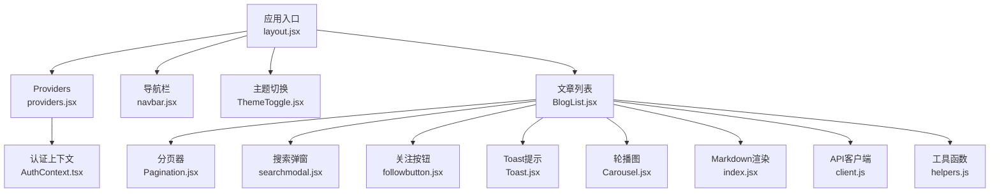

图表来源
- [src/app/layout.jsx](file://src/app/layout.jsx)
- [src/app/providers.jsx](file://src/app/providers.jsx)
- [src/context/AuthContext.tsx](file://src/context/AuthContext.tsx)
- [src/components/Navbar/navbar.jsx](file://src/components/Navbar/navbar.jsx)
- [src/components/ThemeToggle/ThemeToggle.jsx](file://src/components/ThemeToggle/ThemeToggle.jsx)
- [src/components/BlogList/BlogList.jsx](file://src/components/BlogList/BlogList.jsx)
- [src/components/Pagination/Pagination.jsx](file://src/components/Pagination/Pagination.jsx)
- [src/components/SearchModal/searchmodal.jsx](file://src/components/SearchModal/searchmodal.jsx)
- [src/components/FollowButton/followbutton.jsx](file://src/components/FollowButton/followbutton.jsx)
- [src/components/Toast/Toast.jsx](file://src/components/Toast/Toast.jsx)
- [src/components/Carousel/Carousel.jsx](file://src/components/Carousel/Carousel.jsx)
- [src/components/MarkdownRenderer/index.jsx](file://src/components/MarkdownRenderer/index.jsx)
- [src/api/client.js](file://src/api/client.js)
- [src/utils/helpers.js](file://src/utils/helpers.js)

章节来源
- [src/app/layout.jsx](file://src/app/layout.jsx)
- [src/app/providers.jsx](file://src/app/providers.jsx)
- [src/context/AuthContext.tsx](file://src/context/AuthContext.tsx)
- [src/components/Navbar/navbar.jsx](file://src/components/Navbar/navbar.jsx)
- [src/components/ThemeToggle/ThemeToggle.jsx](file://src/components/ThemeToggle/ThemeToggle.jsx)
- [src/components/BlogList/BlogList.jsx](file://src/components/BlogList/BlogList.jsx)
- [src/components/Pagination/Pagination.jsx](file://src/components/Pagination/Pagination.jsx)
- [src/components/SearchModal/searchmodal.jsx](file://src/components/SearchModal/searchmodal.jsx)
- [src/components/FollowButton/followbutton.jsx](file://src/components/FollowButton/followbutton.jsx)
- [src/components/Toast/Toast.jsx](file://src/components/Toast/Toast.jsx)
- [src/components/Carousel/Carousel.jsx](file://src/components/Carousel/Carousel.jsx)
- [src/components/MarkdownRenderer/index.jsx](file://src/components/MarkdownRenderer/index.jsx)
- [src/api/client.js](file://src/api/client.js)
- [src/utils/helpers.js](file://src/utils/helpers.js)

## 核心组件
本节从“生命周期与Hooks”的视角，梳理关键组件的职责与交互方式，并说明它们在挂载、更新、卸载阶段的典型行为。

- 应用布局与提供者
  - layout.jsx：作为根布局，负责注入全局Provider，确保子树可访问上下文。
  - providers.jsx：集中提供上下文或第三方服务，便于在组件中通过useContext或自定义Hook消费。

- 认证上下文
  - AuthContext.tsx：封装用户登录态、权限信息及相关操作，供各组件通过useContext或自定义Hook读取与更新。

- 导航栏与主题切换
  - navbar.jsx：可能监听路由变化、维护展开/收起状态、管理用户菜单等。
  - ThemeToggle.jsx：切换主题时读写本地存储或CSS变量，并在挂载时初始化主题。

- 文章列表与相关子组件
  - BlogList.jsx：发起数据请求、维护加载与错误状态、分页参数、搜索条件等。
  - Pagination.jsx：根据当前页码与总数计算分页范围，响应页码变更事件。
  - SearchModal/searchmodal.jsx：控制弹窗显隐、搜索词输入、提交搜索。
  - FollowButton/followbutton.jsx：关注/取消关注操作，处理乐观更新与失败回滚。
  - Toast/Toast.jsx：消息提示的显示与自动关闭。
  - Carousel/Carousel.jsx：轮播图的自动播放、手动切换、定时器管理。
  - MarkdownRenderer/index.jsx：将Markdown文本渲染为HTML，必要时进行安全过滤。

章节来源
- [src/app/layout.jsx](file://src/app/layout.jsx)
- [src/app/providers.jsx](file://src/app/providers.jsx)
- [src/context/AuthContext.tsx](file://src/context/AuthContext.tsx)
- [src/components/Navbar/navbar.jsx](file://src/components/Navbar/navbar.jsx)
- [src/components/ThemeToggle/ThemeToggle.jsx](file://src/components/ThemeToggle/ThemeToggle.jsx)
- [src/components/BlogList/BlogList.jsx](file://src/components/BlogList/BlogList.jsx)
- [src/components/Pagination/Pagination.jsx](file://src/components/Pagination/Pagination.jsx)
- [src/components/SearchModal/searchmodal.jsx](file://src/components/SearchModal/searchmodal.jsx)
- [src/components/FollowButton/followbutton.jsx](file://src/components/FollowButton/followbutton.jsx)
- [src/components/Toast/Toast.jsx](file://src/components/Toast/Toast.jsx)
- [src/components/Carousel/Carousel.jsx](file://src/components/Carousel/Carousel.jsx)
- [src/components/MarkdownRenderer/index.jsx](file://src/components/MarkdownRenderer/index.jsx)

## 架构总览
下图展示了从布局到具体业务组件的调用关系，以及上下文与API客户端的协作方式。

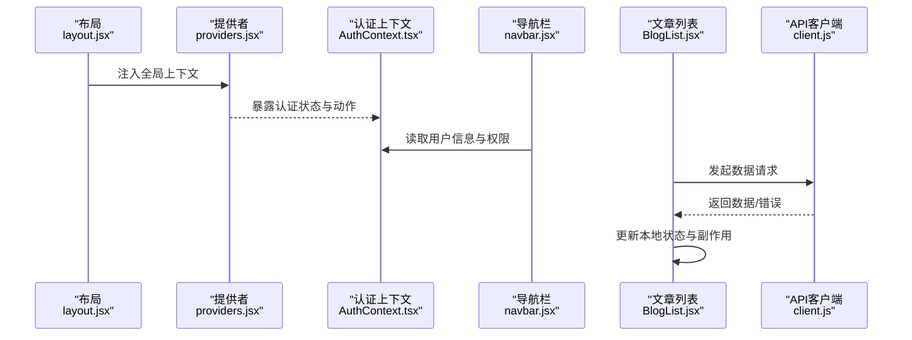

图表来源
- [src/app/layout.jsx](file://src/app/layout.jsx)
- [src/app/providers.jsx](file://src/app/providers.jsx)
- [src/context/AuthContext.tsx](file://src/context/AuthContext.tsx)
- [src/components/Navbar/navbar.jsx](file://src/components/Navbar/navbar.jsx)
- [src/components/BlogList/BlogList.jsx](file://src/components/BlogList/BlogList.jsx)
- [src/api/client.js](file://src/api/client.js)

## 详细组件分析

### 认证上下文（AuthContext）
- 职责
  - 维护用户登录态、角色与权限
  - 提供登录、登出、刷新用户信息等动作
  - 在组件中以useContext或自定义Hook消费
- 生命周期映射
  - 挂载：初始化用户信息（如从本地存储恢复会话）
  - 更新：用户信息变更后触发重渲染
  - 卸载：清理敏感缓存或注销令牌
- 设计要点
  - 避免在渲染期间执行副作用
  - 对异步操作进行错误处理与重试策略
  - 提供类型安全的接口（TypeScript）

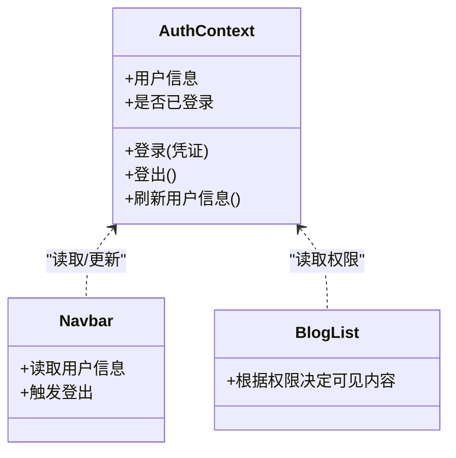

图表来源
- [src/context/AuthContext.tsx](file://src/context/AuthContext.tsx)
- [src/components/Navbar/navbar.jsx](file://src/components/Navbar/navbar.jsx)
- [src/components/BlogList/BlogList.jsx](file://src/components/BlogList/BlogList.jsx)

章节来源
- [src/context/AuthContext.tsx](file://src/context/AuthContext.tsx)
- [src/components/Navbar/navbar.jsx](file://src/components/Navbar/navbar.jsx)
- [src/components/BlogList/BlogList.jsx](file://src/components/BlogList/BlogList.jsx)

### 主题切换（ThemeToggle）
- 职责
  - 切换主题并持久化到本地存储
  - 在挂载时读取并应用主题
- 生命周期映射
  - 挂载：读取本地存储的主题值并应用到DOM/CSS变量
  - 更新：主题变化时同步到DOM
  - 卸载：无需特殊清理
- Hooks模式
  - useState：保存当前主题
  - useEffect：监听主题变化并写入本地存储；或在挂载时初始化
  - useCallback：稳定切换主题的回调引用，避免不必要的重渲染

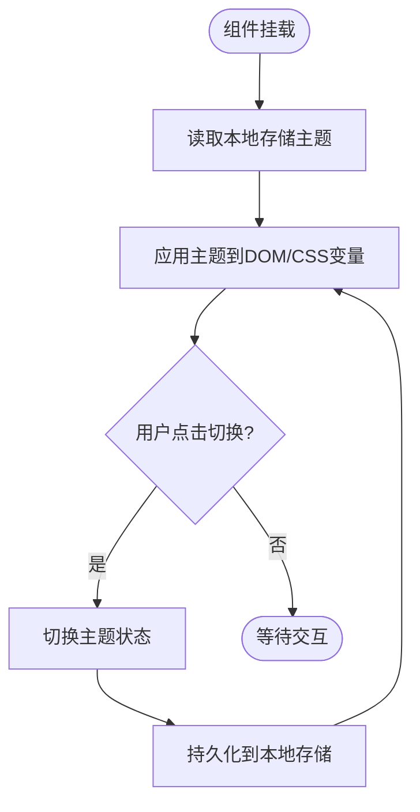

图表来源
- [src/components/ThemeToggle/ThemeToggle.jsx](file://src/components/ThemeToggle/ThemeToggle.jsx)

章节来源
- [src/components/ThemeToggle/ThemeToggle.jsx](file://src/components/ThemeToggle/ThemeToggle.jsx)

### 文章列表（BlogList）
- 职责
  - 管理分页、搜索、排序等查询参数
  - 发起数据请求并处理加载与错误状态
  - 组合子组件（分页、搜索弹窗、关注按钮、Toast等）
- 生命周期映射
  - 挂载：根据初始参数发起首次请求
  - 更新：当查询参数变化时重新请求
  - 卸载：取消未完成的请求（防竞态）
- Hooks模式
  - useState：列表数据、加载状态、错误状态、分页参数、搜索条件
  - useEffect：监听依赖项变化，触发数据获取；在清理函数中取消请求
  - useMemo：对列表数据进行筛选/排序/分页计算
  - useCallback：稳定事件处理器引用，减少子组件重渲染
  - useContext：读取认证上下文以决定是否显示关注按钮或编辑入口

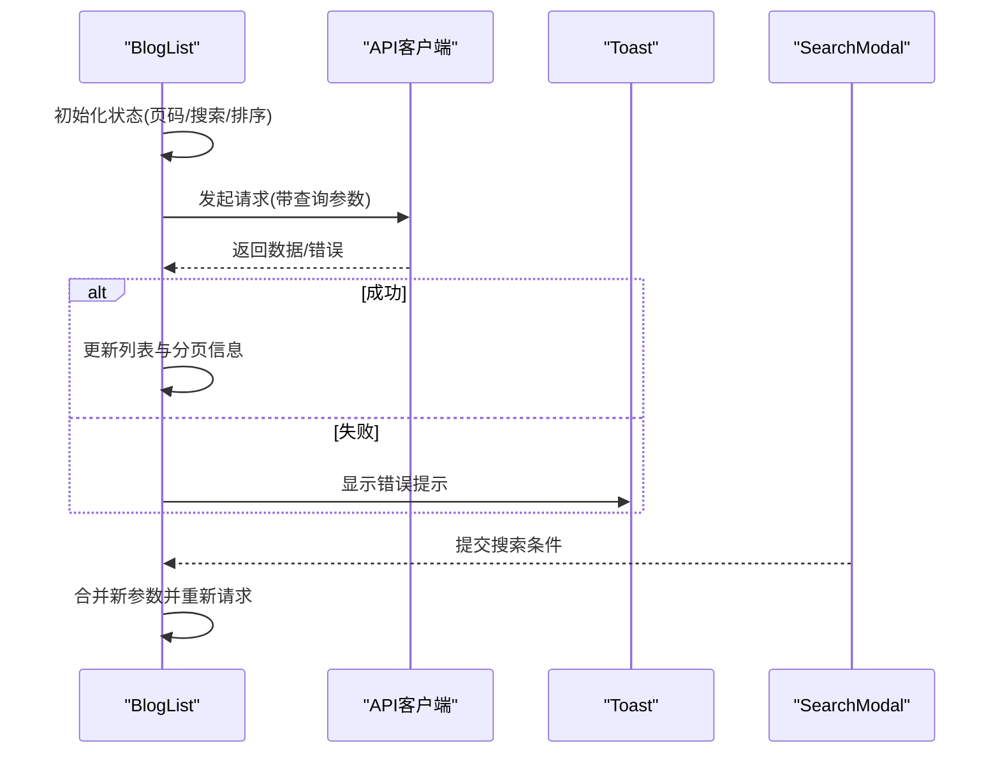

图表来源
- [src/components/BlogList/BlogList.jsx](file://src/components/BlogList/BlogList.jsx)
- [src/api/client.js](file://src/api/client.js)
- [src/components/Toast/Toast.jsx](file://src/components/Toast/Toast.jsx)
- [src/components/SearchModal/searchmodal.jsx](file://src/components/SearchModal/searchmodal.jsx)

章节来源
- [src/components/BlogList/BlogList.jsx](file://src/components/BlogList/BlogList.jsx)
- [src/api/client.js](file://src/api/client.js)
- [src/components/Toast/Toast.jsx](file://src/components/Toast/Toast.jsx)
- [src/components/SearchModal/searchmodal.jsx](file://src/components/SearchModal/searchmodal.jsx)

### 分页器（Pagination）
- 职责
  - 根据总页数与当前页码渲染页码按钮
  - 处理页码变更事件
- Hooks模式
  - useState：当前页码
  - useCallback：生成页码数组与处理点击事件
  - useMemo：计算页码范围与禁用状态

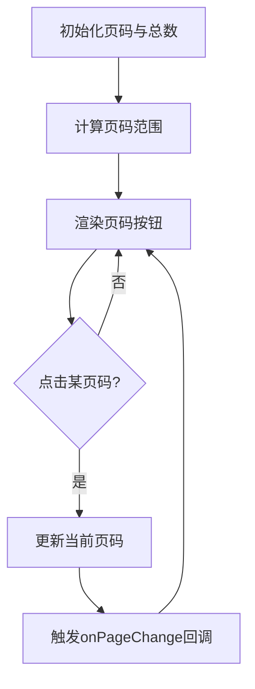

图表来源
- [src/components/Pagination/Pagination.jsx](file://src/components/Pagination/Pagination.jsx)

章节来源
- [src/components/Pagination/Pagination.jsx](file://src/components/Pagination/Pagination.jsx)

### 搜索弹窗（SearchModal）
- 职责
  - 控制弹窗显隐
  - 管理搜索词输入与提交
- Hooks模式
  - useState：弹窗可见性、搜索词
  - useEffect：监听键盘事件（如Esc关闭）、聚焦输入框
  - useCallback：稳定提交与关闭回调

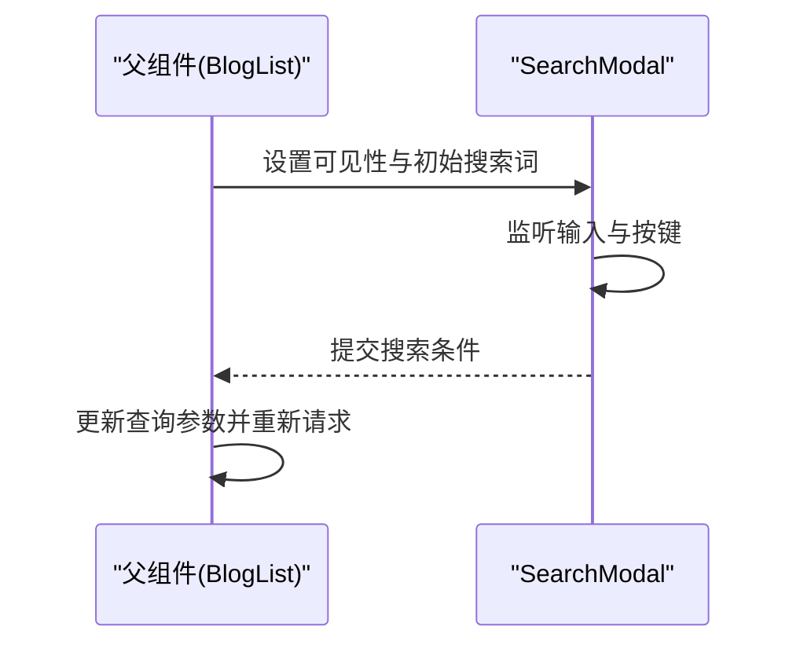

图表来源
- [src/components/SearchModal/searchmodal.jsx](file://src/components/SearchModal/searchmodal.jsx)
- [src/components/BlogList/BlogList.jsx](file://src/components/BlogList/BlogList.jsx)

章节来源
- [src/components/SearchModal/searchmodal.jsx](file://src/components/SearchModal/searchmodal.jsx)
- [src/components/BlogList/BlogList.jsx](file://src/components/BlogList/BlogList.jsx)

### 关注按钮（FollowButton）
- 职责
  - 关注/取消关注操作
  - 乐观更新与失败回滚
- Hooks模式
  - useState：关注状态、加载状态
  - useEffect：监听用户ID或文章ID变化，拉取最新关注状态
  - useCallback：稳定点击回调
  - useContext：读取认证信息判断是否允许关注

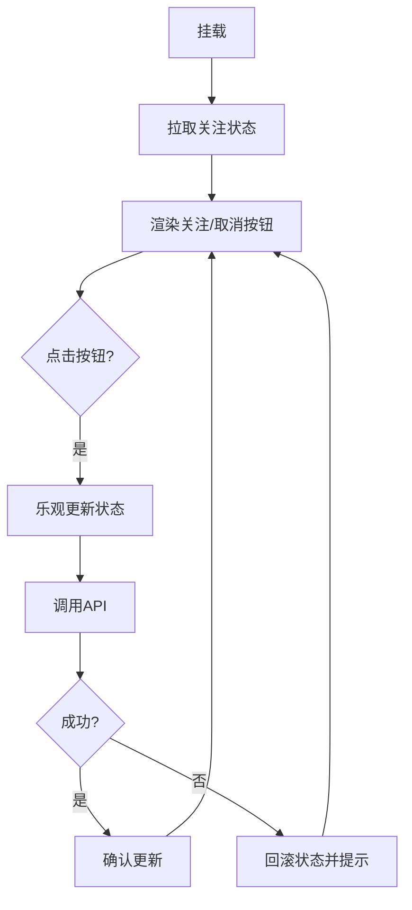

图表来源
- [src/components/FollowButton/followbutton.jsx](file://src/components/FollowButton/followbutton.jsx)
- [src/context/AuthContext.tsx](file://src/context/AuthContext.tsx)

章节来源
- [src/components/FollowButton/followbutton.jsx](file://src/components/FollowButton/followbutton.jsx)
- [src/context/AuthContext.tsx](file://src/context/AuthContext.tsx)

### 轮播图（Carousel）
- 职责
  - 自动播放与手动切换
  - 处理定时器与边界情况
- Hooks模式
  - useState：当前索引、是否暂停
  - useEffect：启动/停止定时器；在卸载时清理
  - useCallback：稳定切换方法引用

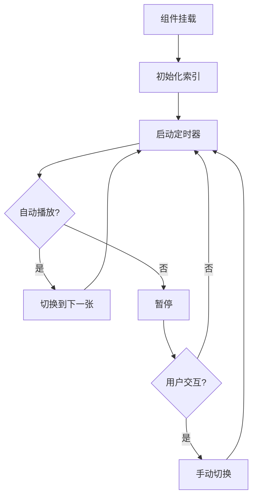

图表来源
- [src/components/Carousel/Carousel.jsx](file://src/components/Carousel/Carousel.jsx)

章节来源
- [src/components/Carousel/Carousel.jsx](file://src/components/Carousel/Carousel.jsx)

### Markdown渲染器（MarkdownRenderer）
- 职责
  - 将Markdown转换为HTML
  - 可选的安全过滤与样式注入
- Hooks模式
  - useState：渲染结果
  - useEffect：在依赖变化时重新渲染
  - useMemo：缓存转换结果以避免重复计算

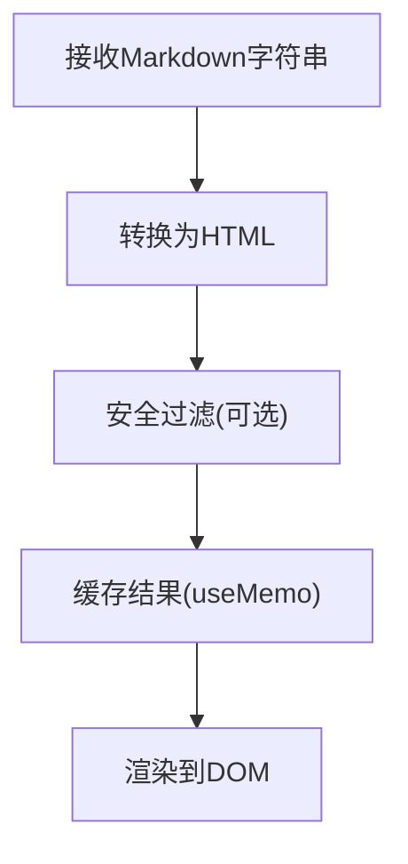

图表来源
- [src/components/MarkdownRenderer/index.jsx](file://src/components/MarkdownRenderer/index.jsx)

章节来源
- [src/components/MarkdownRenderer/index.jsx](file://src/components/MarkdownRenderer/index.jsx)

### 导航栏（Navbar）
- 职责
  - 展示站点导航、用户菜单、搜索入口
  - 可能与认证上下文联动显示不同菜单项
- Hooks模式
  - useState：移动端菜单展开状态
  - useEffect：监听窗口尺寸变化以适配布局
  - useContext：读取用户信息

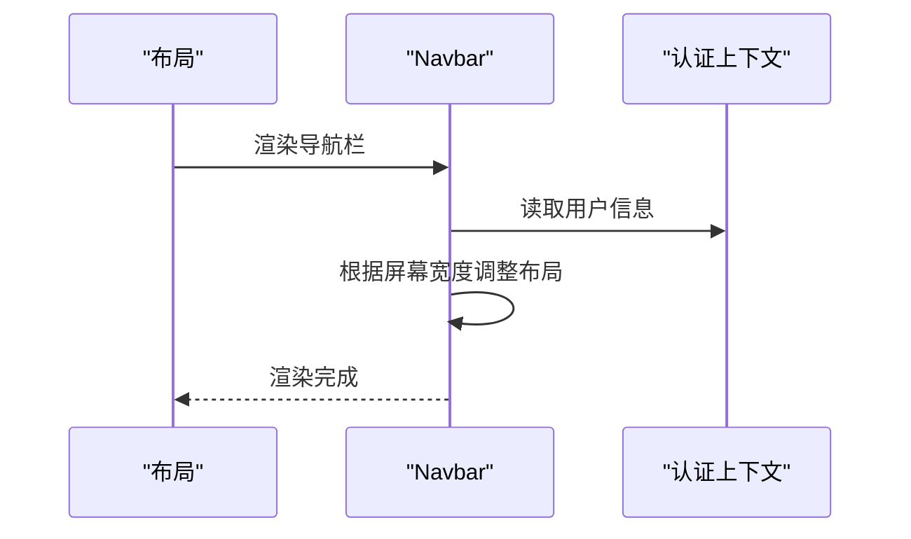

图表来源
- [src/components/Navbar/navbar.jsx](file://src/components/Navbar/navbar.jsx)
- [src/context/AuthContext.tsx](file://src/context/AuthContext.tsx)

章节来源
- [src/components/Navbar/navbar.jsx](file://src/components/Navbar/navbar.jsx)
- [src/context/AuthContext.tsx](file://src/context/AuthContext.tsx)

### 工具与API客户端
- API客户端（client.js）
  - 统一封装HTTP请求、拦截器、错误处理、重试策略
  - 与组件侧的useEffect配合，保证请求生命周期可控
- 工具函数（helpers.js）
  - 提供日期格式化、URL构建、防抖节流等常用逻辑
  - 可在自定义Hook中复用

章节来源
- [src/api/client.js](file://src/api/client.js)
- [src/utils/helpers.js](file://src/utils/helpers.js)

## 依赖关系分析
- 组件耦合
  - BlogList聚合多个子组件（Pagination、SearchModal、FollowButton、Toast、Carousel、MarkdownRenderer），形成高内聚的业务单元
  - Navbar与AuthContext存在弱耦合，仅读取必要信息
- 外部依赖
  - API客户端作为唯一网络层，降低组件直接依赖fetch/axios的复杂度
  - 工具函数被多处复用，提升一致性

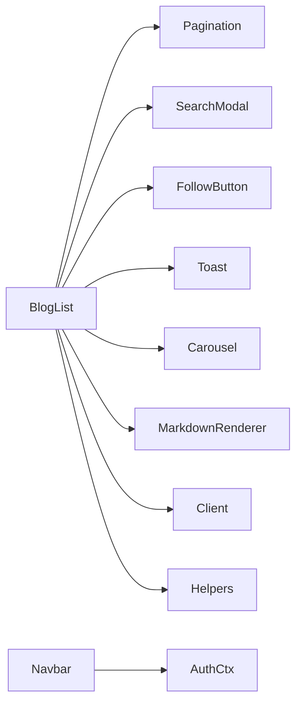

图表来源
- [src/components/BlogList/BlogList.jsx](file://src/components/BlogList/BlogList.jsx)
- [src/components/Pagination/Pagination.jsx](file://src/components/Pagination/Pagination.jsx)
- [src/components/SearchModal/searchmodal.jsx](file://src/components/SearchModal/searchmodal.jsx)
- [src/components/FollowButton/followbutton.jsx](file://src/components/FollowButton/followbutton.jsx)
- [src/components/Toast/Toast.jsx](file://src/components/Toast/Toast.jsx)
- [src/components/Carousel/Carousel.jsx](file://src/components/Carousel/Carousel.jsx)
- [src/components/MarkdownRenderer/index.jsx](file://src/components/MarkdownRenderer/index.jsx)
- [src/api/client.js](file://src/api/client.js)
- [src/utils/helpers.js](file://src/utils/helpers.js)
- [src/components/Navbar/navbar.jsx](file://src/components/Navbar/navbar.jsx)
- [src/context/AuthContext.tsx](file://src/context/AuthContext.tsx)

## 性能考量
- 合理使用useMemo
  - 对昂贵计算（如列表筛选、排序、分页范围计算）的结果进行缓存
  - 注意依赖项粒度，避免过度缓存导致内存占用
- 合理使用useCallback
  - 为传递给子组件的事件处理器提供稳定引用，减少子组件无谓重渲染
  - 避免滥用，仅在确有必要时使用
- 避免在渲染阶段执行副作用
  - 所有副作用（网络请求、订阅、定时器）放入useEffect
- 清理工作
  - 在useEffect的清理函数中取消请求、移除事件监听、清除定时器
- 拆分与懒加载
  - 将大组件拆分为更小的子组件，按需加载以提升首屏性能

[本节为通用指导，不直接分析具体文件]

## 故障排查指南
- 常见问题
  - 请求竞态：当依赖快速变化时，旧请求可能覆盖新请求。解决方案：在清理函数中取消旧请求或使用AbortController
  - 状态不一致：乐观更新失败后需回滚。解决方案：捕获错误并恢复状态，同时提示用户
  - 定时器泄漏：组件卸载后仍执行定时器。解决方案：在清理函数中clearInterval/clearTimeout
  - 无限循环：useEffect依赖不当导致频繁触发。解决方案：检查依赖数组，必要时使用useRef或拆分副作用
- 调试建议
  - 打印关键状态与副作用触发时机
  - 使用浏览器开发者工具的Performance面板分析重渲染热点
  - 对复杂逻辑抽取为自定义Hook，提高可测试性

章节来源
- [src/components/BlogList/BlogList.jsx](file://src/components/BlogList/BlogList.jsx)
- [src/components/Carousel/Carousel.jsx](file://src/components/Carousel/Carousel.jsx)
- [src/components/FollowButton/followbutton.jsx](file://src/components/FollowButton/followbutton.jsx)
- [src/components/SearchModal/searchmodal.jsx](file://src/components/SearchModal/searchmodal.jsx)
- [src/api/client.js](file://src/api/client.js)

## 结论
通过将类组件生命周期映射到Hooks模式，并结合上下文与API客户端的合理组织，可以在保持代码可读性的同时获得良好的性能与维护性。建议在项目中：
- 明确每个组件的职责与生命周期阶段
- 将副作用集中在useEffect中，并确保清理工作完善
- 谨慎使用useMemo与useCallback，只在确有收益时启用
- 抽取可复用的自定义Hook，提升一致性与可测试性

[本节为总结性内容，不直接分析具体文件]

## 附录
- 常见Hooks对照表（概念性）
  - componentDidMount → useEffect(() => {...}, [])
  - componentDidUpdate → useEffect(() => {...}, [deps])
  - componentWillUnmount → useEffect(() => {...}, []).return
  - this.state → useState
  - this.context → useContext
  - 复杂状态逻辑 → useReducer
  - 性能优化 → useMemo、useCallback
- 自定义Hook设计模式
  - 数据获取：封装请求、错误处理、重试、取消
  - 表单处理：字段校验、提交、重置、防抖
  - 动画效果：过渡状态、定时器、清理

[本节为概念性内容，不直接分析具体文件]