# 组件设计模式

<cite>
**本文引用的文件**   
- [src/components/BlogCard/BlogCard.jsx](file://src/components/BlogCard/BlogCard.jsx)
- [src/components/BlogList/BlogList.jsx](file://src/components/BlogList/BlogList.jsx)
- [src/components/Navbar/navbar.jsx](file://src/components/Navbar/navbar.jsx)
- [src/components/AuthModal/AuthModal.jsx](file://src/components/AuthModal/AuthModal.jsx)
- [src/components/SearchModal/searchmodal.jsx](file://src/components/SearchModal/searchmodal.jsx)
- [src/components/FollowButton/followbutton.jsx](file://src/components/FollowButton/followbutton.jsx)
- [src/components/Pagination/Pagination.jsx](file://src/components/Pagination/Pagination.jsx)
- [src/components/CommentSection/CommentSection.jsx](file://src/components/CommentSection/CommentSection.jsx)
- [src/components/ThemeToggle/ThemeToggle.jsx](file://src/components/ThemeToggle/ThemeToggle.jsx)
- [src/components/Footer/Footer.jsx](file://src/components/Footer/Footer.jsx)
- [src/components/Sidebar/Sidebar.jsx](file://src/components/Sidebar/Sidebar.jsx)
- [src/app/providers.jsx](file://src/app/providers.jsx)
- [src/context/AuthContext.tsx](file://src/context/AuthContext.tsx)
- [src/api/client.js](file://src/api/client.js)
- [src/app/post/[slug]/client.jsx](file://src/app/post/[slug]/client.jsx)
- [src/app/u/[username]/write/page.jsx](file://src/app/u/[username]/write/page.jsx)
</cite>

## 目录
1. [简介](#简介)
2. [项目结构](#项目结构)
3. [核心组件](#核心组件)
4. [架构总览](#架构总览)
5. [详细组件分析](#详细组件分析)
6. [依赖分析](#依赖分析)
7. [性能考虑](#性能考虑)
8. [故障排查指南](#故障排查指南)
9. [结论](#结论)
10. [附录](#附录)

## 简介
本文件聚焦于项目中使用的 React 组件设计模式与最佳实践，围绕以下主题展开：
- 功能组件与展示组件的分离原则（Presentational Components 与 Container Components）
- Props 传递模式、事件处理机制与组件间通信方式
- 高阶组件（HOC）的使用场景与实现模式
- 自定义 Hooks 的设计与应用
- 组件的可复用性设计：配置化组件、插槽模式、组合模式
- 结合仓库中的具体组件给出可落地的示例路径与调用流程说明

## 项目结构
前端采用 Next.js App Router 组织页面，业务组件集中在 src/components 下，状态与上下文在 src/context，API 客户端在 src/api。页面层（app 目录）承担容器职责，负责数据获取、状态管理与路由参数解析；组件层（components 目录）以展示为主，通过 props 接收数据与回调，保持无副作用与纯渲染特性。

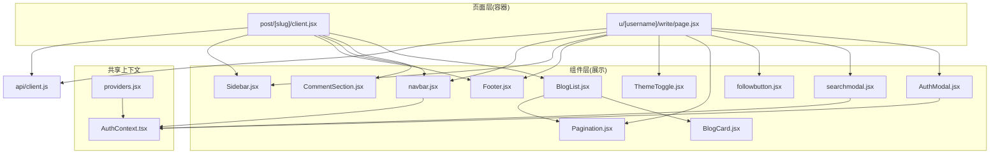

图示来源
- [src/app/post/[slug]/client.jsx](file://src/app/post/[slug]/client.jsx)
- [src/app/u/[username]/write/page.jsx](file://src/app/u/[username]/write/page.jsx)
- [src/components/BlogList/BlogList.jsx](file://src/components/BlogList/BlogList.jsx)
- [src/components/BlogCard/BlogCard.jsx](file://src/components/BlogCard/BlogCard.jsx)
- [src/components/Pagination/Pagination.jsx](file://src/components/Pagination/Pagination.jsx)
- [src/components/CommentSection/CommentSection.jsx](file://src/components/CommentSection/CommentSection.jsx)
- [src/components/Navbar/navbar.jsx](file://src/components/Navbar/navbar.jsx)
- [src/components/AuthModal/AuthModal.jsx](file://src/components/AuthModal/AuthModal.jsx)
- [src/components/SearchModal/searchmodal.jsx](file://src/components/SearchModal/searchmodal.jsx)
- [src/components/FollowButton/followbutton.jsx](file://src/components/FollowButton/followbutton.jsx)
- [src/components/ThemeToggle/ThemeToggle.jsx](file://src/components/ThemeToggle/ThemeToggle.jsx)
- [src/components/Footer/Footer.jsx](file://src/components/Footer/Footer.jsx)
- [src/components/Sidebar/Sidebar.jsx](file://src/components/Sidebar/Sidebar.jsx)
- [src/context/AuthContext.tsx](file://src/context/AuthContext.tsx)
- [src/app/providers.jsx](file://src/app/providers.jsx)
- [src/api/client.js](file://src/api/client.js)

章节来源
- [src/app/post/[slug]/client.jsx](file://src/app/post/[slug]/client.jsx)
- [src/app/u/[username]/write/page.jsx](file://src/app/u/[username]/write/page.jsx)
- [src/components/BlogList/BlogList.jsx](file://src/components/BlogList/BlogList.jsx)
- [src/components/BlogCard/BlogCard.jsx](file://src/components/BlogCard/BlogCard.jsx)
- [src/components/Pagination/Pagination.jsx](file://src/components/Pagination/Pagination.jsx)
- [src/components/CommentSection/CommentSection.jsx](file://src/components/CommentSection/CommentSection.jsx)
- [src/components/Navbar/navbar.jsx](file://src/components/Navbar/navbar.jsx)
- [src/components/AuthModal/AuthModal.jsx](file://src/components/AuthModal/AuthModal.jsx)
- [src/components/SearchModal/searchmodal.jsx](file://src/components/SearchModal/searchmodal.jsx)
- [src/components/FollowButton/followbutton.jsx](file://src/components/FollowButton/followbutton.jsx)
- [src/components/ThemeToggle/ThemeToggle.jsx](file://src/components/ThemeToggle/ThemeToggle.jsx)
- [src/components/Footer/Footer.jsx](file://src/components/Footer/Footer.jsx)
- [src/components/Sidebar/Sidebar.jsx](file://src/components/Sidebar/Sidebar.jsx)
- [src/context/AuthContext.tsx](file://src/context/AuthContext.tsx)
- [src/app/providers.jsx](file://src/app/providers.jsx)
- [src/api/client.js](file://src/api/client.js)

## 核心组件
- 展示型组件（Presentational）
  - BlogCard：文章卡片展示，仅接收数据与回调，不关心数据来源与副作用。
  - BlogList：列表聚合与分页控制，将数据与分页状态上抛给容器页。
  - Pagination：通用分页控件，提供页码变更回调。
  - CommentSection：评论区域展示与交互，通过回调通知上层更新。
  - Navbar、Footer、Sidebar：布局与导航展示，读取全局上下文进行登录态显示。
  - ThemeToggle：主题切换按钮，触发主题变更回调或写入上下文。
  - AuthModal、SearchModal：弹窗展示与用户输入收集，通过回调向容器反馈结果。
  - FollowButton：关注/取消关注按钮，根据当前用户与目标关系展示不同状态。

- 容器型组件（Container）
  - post/[slug]/client.jsx：负责文章详情数据获取、评论提交等副作用，将数据与回调传递给展示组件。
  - u/[username]/write/page.jsx：写文章页面容器，管理编辑器状态、草稿保存、发布流程，并协调各展示组件。

章节来源
- [src/components/BlogCard/BlogCard.jsx](file://src/components/BlogCard/BlogCard.jsx)
- [src/components/BlogList/BlogList.jsx](file://src/components/BlogList/BlogList.jsx)
- [src/components/Pagination/Pagination.jsx](file://src/components/Pagination/Pagination.jsx)
- [src/components/CommentSection/CommentSection.jsx](file://src/components/CommentSection/CommentSection.jsx)
- [src/components/Navbar/navbar.jsx](file://src/components/Navbar/navbar.jsx)
- [src/components/Footer/Footer.jsx](file://src/components/Footer/Footer.jsx)
- [src/components/Sidebar/Sidebar.jsx](file://src/components/Sidebar/Sidebar.jsx)
- [src/components/ThemeToggle/ThemeToggle.jsx](file://src/components/ThemeToggle/ThemeToggle.jsx)
- [src/components/AuthModal/AuthModal.jsx](file://src/components/AuthModal/AuthModal.jsx)
- [src/components/SearchModal/searchmodal.jsx](file://src/components/SearchModal/searchmodal.jsx)
- [src/components/FollowButton/followbutton.jsx](file://src/components/FollowButton/followbutton.jsx)
- [src/app/post/[slug]/client.jsx](file://src/app/post/[slug]/client.jsx)
- [src/app/u/[username]/write/page.jsx](file://src/app/u/[username]/write/page.jsx)

## 架构总览
下图展示了“容器-展示”分层、上下文与 API 客户端的协作关系。页面作为容器负责数据流与副作用，组件专注于渲染与交互回调。

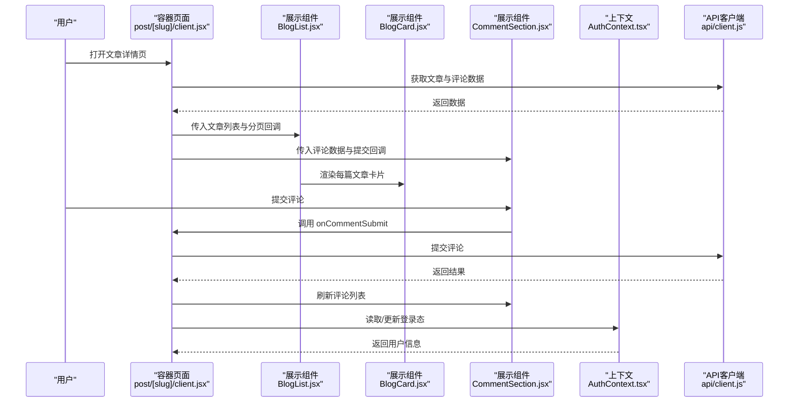

图示来源
- [src/app/post/[slug]/client.jsx](file://src/app/post/[slug]/client.jsx)
- [src/components/BlogList/BlogList.jsx](file://src/components/BlogList/BlogList.jsx)
- [src/components/BlogCard/BlogCard.jsx](file://src/components/BlogCard/BlogCard.jsx)
- [src/components/CommentSection/CommentSection.jsx](file://src/components/CommentSection/CommentSection.jsx)
- [src/context/AuthContext.tsx](file://src/context/AuthContext.tsx)
- [src/api/client.js](file://src/api/client.js)

## 详细组件分析

### 展示型组件：BlogCard
- 职责：渲染单篇文章的关键信息（标题、摘要、标签等），不包含数据获取逻辑。
- Props 约定：文章对象、点击回调、收藏/点赞回调等。
- 事件处理：将用户操作转换为回调函数调用，由容器处理副作用。
- 可复用性：通过 props 配置内容，支持多种布局变体。

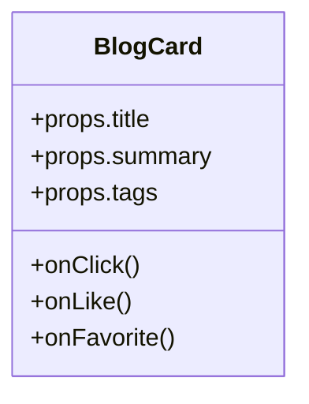

图示来源
- [src/components/BlogCard/BlogCard.jsx](file://src/components/BlogCard/BlogCard.jsx)

章节来源
- [src/components/BlogCard/BlogCard.jsx](file://src/components/BlogCard/BlogCard.jsx)

### 展示型组件：BlogList 与 Pagination
- 职责：聚合文章列表与分页控件，将分页变化回调给容器。
- Props 约定：文章数组、当前页、总页数、页码变更回调。
- 事件处理：点击页码时调用 onPageChange。
- 组合模式：内部组合 BlogCard 与 Pagination，体现“组合优于继承”。

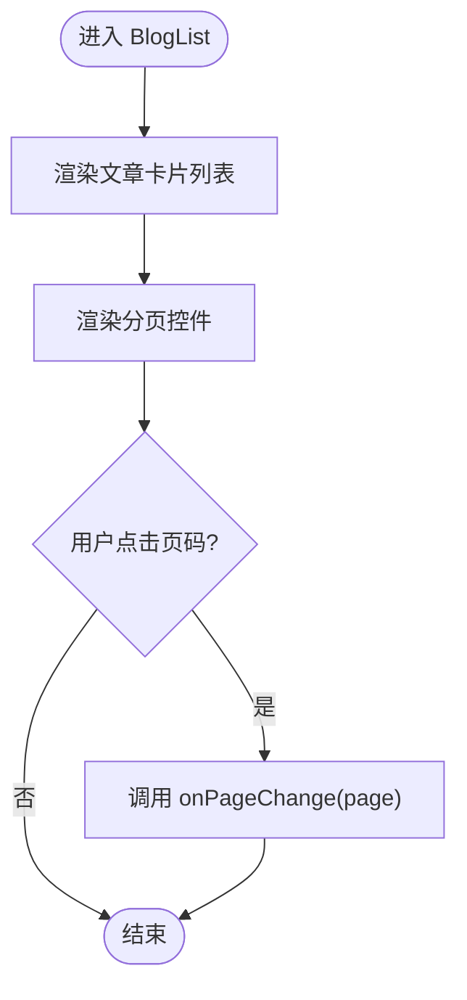

图示来源
- [src/components/BlogList/BlogList.jsx](file://src/components/BlogList/BlogList.jsx)
- [src/components/Pagination/Pagination.jsx](file://src/components/Pagination/Pagination.jsx)

章节来源
- [src/components/BlogList/BlogList.jsx](file://src/components/BlogList/BlogList.jsx)
- [src/components/Pagination/Pagination.jsx](file://src/components/Pagination/Pagination.jsx)

### 展示型组件：CommentSection
- 职责：展示评论列表与评论表单，提交评论后通过回调通知容器刷新。
- Props 约定：评论列表、提交回调、加载状态等。
- 事件处理：表单提交、删除评论等操作均通过回调上报。

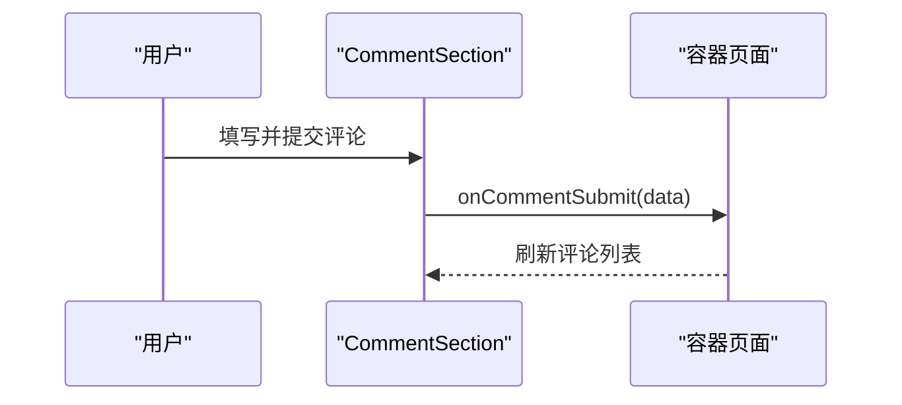

图示来源
- [src/components/CommentSection/CommentSection.jsx](file://src/components/CommentSection/CommentSection.jsx)
- [src/app/post/[slug]/client.jsx](file://src/app/post/[slug]/client.jsx)

章节来源
- [src/components/CommentSection/CommentSection.jsx](file://src/components/CommentSection/CommentSection.jsx)
- [src/app/post/[slug]/client.jsx](file://src/app/post/[slug]/client.jsx)

### 展示型组件：Navbar、Footer、Sidebar
- 职责：导航、页脚、侧边栏的展示与基础交互。
- 上下文使用：从 AuthContext 读取登录态与用户信息，决定菜单项与入口。
- 事件处理：跳转、搜索、主题切换等通过回调或上下文完成。

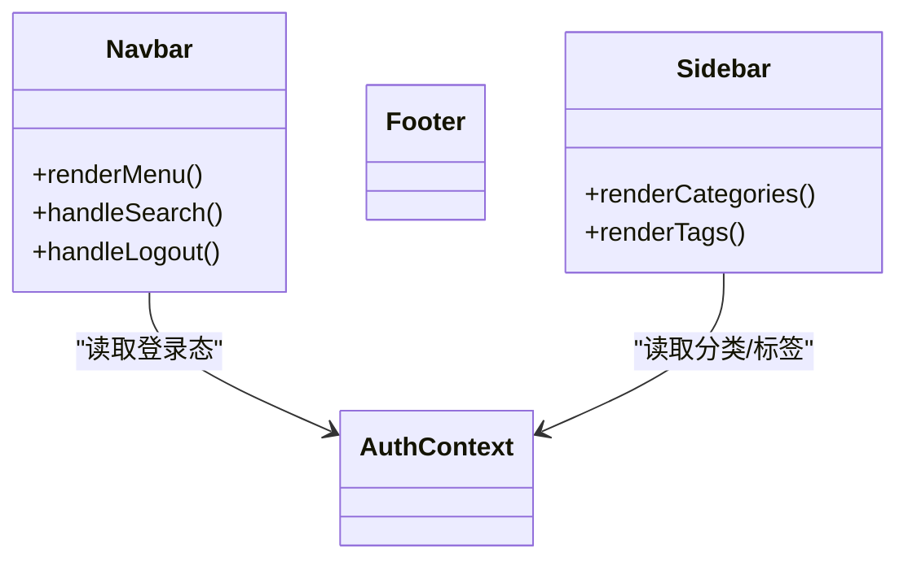

图示来源
- [src/components/Navbar/navbar.jsx](file://src/components/Navbar/navbar.jsx)
- [src/components/Footer/Footer.jsx](file://src/components/Footer/Footer.jsx)
- [src/components/Sidebar/Sidebar.jsx](file://src/components/Sidebar/Sidebar.jsx)
- [src/context/AuthContext.tsx](file://src/context/AuthContext.tsx)

章节来源
- [src/components/Navbar/navbar.jsx](file://src/components/Navbar/navbar.jsx)
- [src/components/Footer/Footer.jsx](file://src/components/Footer/Footer.jsx)
- [src/components/Sidebar/Sidebar.jsx](file://src/components/Sidebar/Sidebar.jsx)
- [src/context/AuthContext.tsx](file://src/context/AuthContext.tsx)

### 展示型组件：AuthModal、SearchModal
- 职责：模态框展示与用户输入收集，通过回调将结果回传给容器。
- 事件处理：关闭、确认、搜索关键词等。
- 组合模式：可作为通用弹窗基座，在不同页面复用。

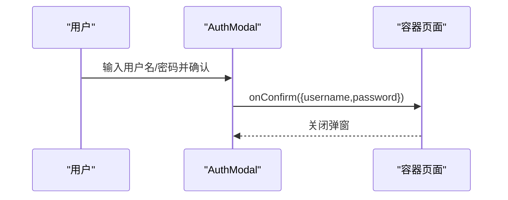

图示来源
- [src/components/AuthModal/AuthModal.jsx](file://src/components/AuthModal/AuthModal.jsx)
- [src/components/SearchModal/searchmodal.jsx](file://src/components/SearchModal/searchmodal.jsx)

章节来源
- [src/components/AuthModal/AuthModal.jsx](file://src/components/AuthModal/AuthModal.jsx)
- [src/components/SearchModal/searchmodal.jsx](file://src/components/SearchModal/searchmodal.jsx)

### 展示型组件：FollowButton、ThemeToggle
- FollowButton：根据当前用户与目标关系展示“关注/已关注”，点击触发关注/取消关注回调。
- ThemeToggle：切换主题，可通过回调或上下文更新主题状态。

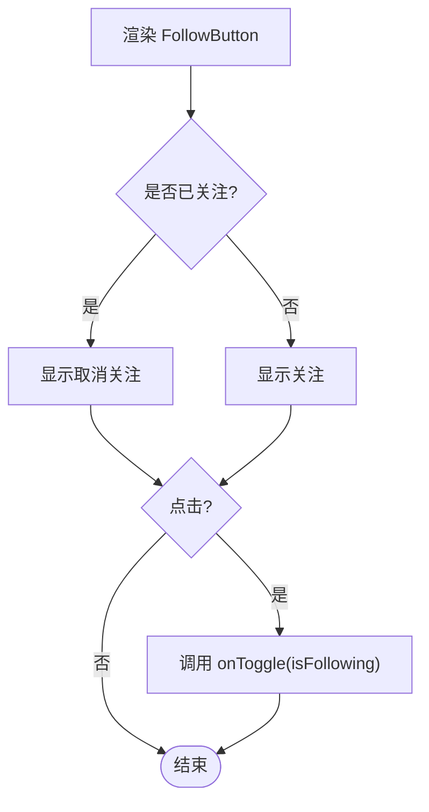

图示来源
- [src/components/FollowButton/followbutton.jsx](file://src/components/FollowButton/followbutton.jsx)
- [src/components/ThemeToggle/ThemeToggle.jsx](file://src/components/ThemeToggle/ThemeToggle.jsx)

章节来源
- [src/components/FollowButton/followbutton.jsx](file://src/components/FollowButton/followbutton.jsx)
- [src/components/ThemeToggle/ThemeToggle.jsx](file://src/components/ThemeToggle/ThemeToggle.jsx)

### 容器型组件：post/[slug]/client.jsx
- 职责：文章详情数据获取、评论提交、错误处理与状态管理。
- 数据流：从 API 客户端拉取数据，封装为 props 传递给展示组件。
- 事件流：接收展示组件回调，执行副作用（如提交评论），再刷新数据。

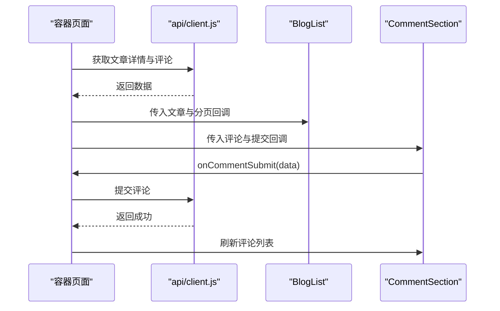

图示来源
- [src/app/post/[slug]/client.jsx](file://src/app/post/[slug]/client.jsx)
- [src/api/client.js](file://src/api/client.js)
- [src/components/BlogList/BlogList.jsx](file://src/components/BlogList/BlogList.jsx)
- [src/components/CommentSection/CommentSection.jsx](file://src/components/CommentSection/CommentSection.jsx)

章节来源
- [src/app/post/[slug]/client.jsx](file://src/app/post/[slug]/client.jsx)
- [src/api/client.js](file://src/api/client.js)

### 容器型组件：u/[username]/write/page.jsx
- 职责：写文章页面的状态管理（编辑器内容、草稿保存、发布）、权限校验与错误提示。
- 组件协作：协调 AuthModal、SearchModal、FollowButton、Pagination、ThemeToggle、Footer、Sidebar 等展示组件。
- 事件流：将用户操作转化为 API 调用与状态更新，再将最新状态下发给展示组件。

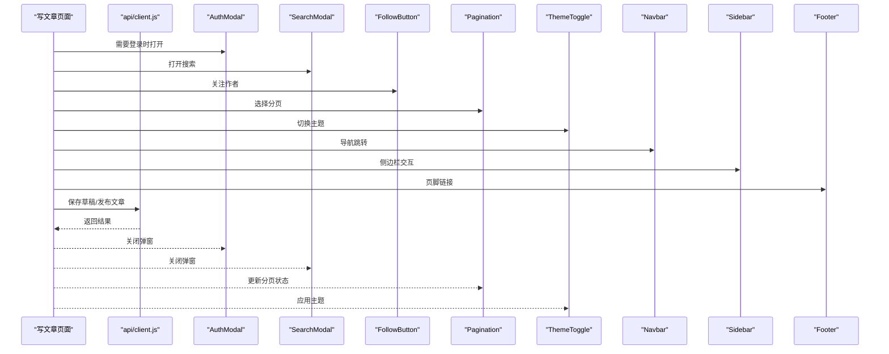

图示来源
- [src/app/u/[username]/write/page.jsx](file://src/app/u/[username]/write/page.jsx)
- [src/components/AuthModal/AuthModal.jsx](file://src/components/AuthModal/AuthModal.jsx)
- [src/components/SearchModal/searchmodal.jsx](file://src/components/SearchModal/searchmodal.jsx)
- [src/components/FollowButton/followbutton.jsx](file://src/components/FollowButton/followbutton.jsx)
- [src/components/Pagination/Pagination.jsx](file://src/components/Pagination/Pagination.jsx)
- [src/components/ThemeToggle/ThemeToggle.jsx](file://src/components/ThemeToggle/ThemeToggle.jsx)
- [src/components/Navbar/navbar.jsx](file://src/components/Navbar/navbar.jsx)
- [src/components/Sidebar/Sidebar.jsx](file://src/components/Sidebar/Sidebar.jsx)
- [src/components/Footer/Footer.jsx](file://src/components/Footer/Footer.jsx)
- [src/api/client.js](file://src/api/client.js)

章节来源
- [src/app/u/[username]/write/page.jsx](file://src/app/u/[username]/write/page.jsx)
- [src/components/AuthModal/AuthModal.jsx](file://src/components/AuthModal/AuthModal.jsx)
- [src/components/SearchModal/searchmodal.jsx](file://src/components/SearchModal/searchmodal.jsx)
- [src/components/FollowButton/followbutton.jsx](file://src/components/FollowButton/followbutton.jsx)
- [src/components/Pagination/Pagination.jsx](file://src/components/Pagination/Pagination.jsx)
- [src/components/ThemeToggle/ThemeToggle.jsx](file://src/components/ThemeToggle/ThemeToggle.jsx)
- [src/components/Navbar/navbar.jsx](file://src/components/Navbar/navbar.jsx)
- [src/components/Sidebar/Sidebar.jsx](file://src/components/Sidebar/Sidebar.jsx)
- [src/components/Footer/Footer.jsx](file://src/components/Footer/Footer.jsx)
- [src/api/client.js](file://src/api/client.js)

### 上下文与提供者：AuthContext 与 providers
- 职责：集中管理认证状态与用户信息，提供登录/登出方法。
- 使用方式：通过 providers 包裹应用根节点，子树内任意组件均可消费上下文。
- 典型用法：Navbar 读取登录态，AuthModal 触发登录流程，写文章页面校验权限。

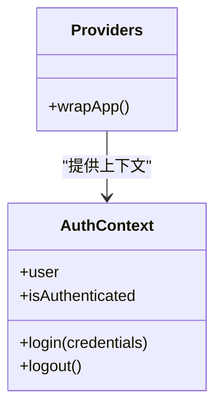

图示来源
- [src/context/AuthContext.tsx](file://src/context/AuthContext.tsx)
- [src/app/providers.jsx](file://src/app/providers.jsx)

章节来源
- [src/context/AuthContext.tsx](file://src/context/AuthContext.tsx)
- [src/app/providers.jsx](file://src/app/providers.jsx)

### API 客户端：api/client.js
- 职责：统一封装 HTTP 请求、错误处理、拦截器（如鉴权头）。
- 使用方式：容器组件调用 API 客户端获取/提交数据，展示组件不直接访问网络。

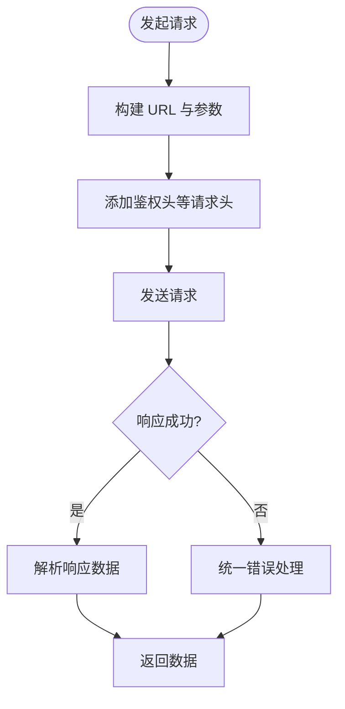

图示来源
- [src/api/client.js](file://src/api/client.js)

章节来源
- [src/api/client.js](file://src/api/client.js)

## 依赖分析
- 组件耦合度
  - 展示组件与容器解耦：展示组件只依赖 props 与回调，不感知数据来源与副作用。
  - 上下文依赖：Navbar、AuthModal 等组件依赖 AuthContext，但通过 Context 抽象了具体实现。
  - API 依赖：容器组件依赖 api/client.js，展示组件不直接依赖网络层。
- 外部依赖
  - Next.js 路由与页面生命周期用于数据获取与副作用编排。
  - CSS Modules 用于样式隔离，提升组件可复用性。

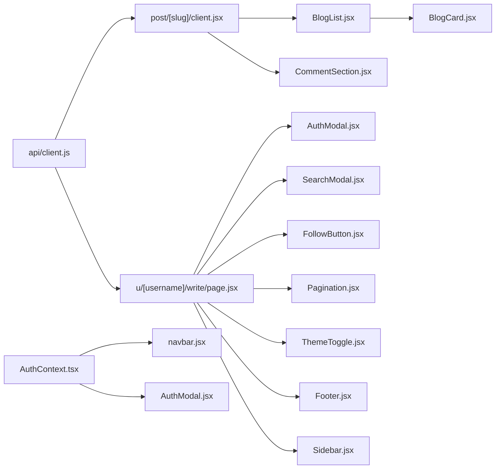

图示来源
- [src/api/client.js](file://src/api/client.js)
- [src/app/post/[slug]/client.jsx](file://src/app/post/[slug]/client.jsx)
- [src/app/u/[username]/write/page.jsx](file://src/app/u/[username]/write/page.jsx)
- [src/context/AuthContext.tsx](file://src/context/AuthContext.tsx)
- [src/components/Navbar/navbar.jsx](file://src/components/Navbar/navbar.jsx)
- [src/components/AuthModal/AuthModal.jsx](file://src/components/AuthModal/AuthModal.jsx)
- [src/components/BlogList/BlogList.jsx](file://src/components/BlogList/BlogList.jsx)
- [src/components/BlogCard/BlogCard.jsx](file://src/components/BlogCard/BlogCard.jsx)
- [src/components/CommentSection/CommentSection.jsx](file://src/components/CommentSection/CommentSection.jsx)
- [src/components/SearchModal/searchmodal.jsx](file://src/components/SearchModal/searchmodal.jsx)
- [src/components/FollowButton/followbutton.jsx](file://src/components/FollowButton/followbutton.jsx)
- [src/components/Pagination/Pagination.jsx](file://src/components/Pagination/Pagination.jsx)
- [src/components/ThemeToggle/ThemeToggle.jsx](file://src/components/ThemeToggle/ThemeToggle.jsx)
- [src/components/Footer/Footer.jsx](file://src/components/Footer/Footer.jsx)
- [src/components/Sidebar/Sidebar.jsx](file://src/components/Sidebar/Sidebar.jsx)

章节来源
- [src/api/client.js](file://src/api/client.js)
- [src/app/post/[slug]/client.jsx](file://src/app/post/[slug]/client.jsx)
- [src/app/u/[username]/write/page.jsx](file://src/app/u/[username]/write/page.jsx)
- [src/context/AuthContext.tsx](file://src/context/AuthContext.tsx)
- [src/components/Navbar/navbar.jsx](file://src/components/Navbar/navbar.jsx)
- [src/components/AuthModal/AuthModal.jsx](file://src/components/AuthModal/AuthModal.jsx)
- [src/components/BlogList/BlogList.jsx](file://src/components/BlogList/BlogList.jsx)
- [src/components/BlogCard/BlogCard.jsx](file://src/components/BlogCard/BlogCard.jsx)
- [src/components/CommentSection/CommentSection.jsx](file://src/components/CommentSection/CommentSection.jsx)
- [src/components/SearchModal/searchmodal.jsx](file://src/components/SearchModal/searchmodal.jsx)
- [src/components/FollowButton/followbutton.jsx](file://src/components/FollowButton/followbutton.jsx)
- [src/components/Pagination/Pagination.jsx](file://src/components/Pagination/Pagination.jsx)
- [src/components/ThemeToggle/ThemeToggle.jsx](file://src/components/ThemeToggle/ThemeToggle.jsx)
- [src/components/Footer/Footer.jsx](file://src/components/Footer/Footer.jsx)
- [src/components/Sidebar/Sidebar.jsx](file://src/components/Sidebar/Sidebar.jsx)

## 性能考虑
- 展示组件尽量保持纯渲染，避免在渲染过程中产生副作用。
- 列表渲染优化：对长列表使用稳定 key，必要时对单项进行 memo 化。
- 分页与虚拟滚动：大数据量场景优先分页，必要时引入虚拟滚动。
- 上下文使用：仅在必要处订阅上下文，避免不必要的重渲染。
- API 请求合并与缓存：在容器层做请求去抖与缓存，减少重复请求。

[本节为通用指导，无需源码引用]

## 故障排查指南
- 常见问题
  - 未正确传递回调导致展示组件无法触发更新：检查容器到展示的 props 绑定。
  - 上下文未包裹导致读取失败：确认 providers 是否正确包裹应用根节点。
  - API 请求失败未统一处理：检查 api/client.js 的错误分支与提示逻辑。
- 定位步骤
  - 在容器组件中打印关键 state 与 props，确认数据流向。
  - 在展示组件中打印 props，确认值是否符合预期。
  - 查看浏览器控制台与网络面板，核对请求与响应。

章节来源
- [src/app/providers.jsx](file://src/app/providers.jsx)
- [src/context/AuthContext.tsx](file://src/context/AuthContext.tsx)
- [src/api/client.js](file://src/api/client.js)

## 结论
本项目遵循清晰的“容器-展示”分层，展示组件专注渲染与交互回调，容器组件负责数据与副作用，配合上下文与 API 客户端形成稳定的数据流。通过配置化 props、组合模式与统一的上下文管理，组件具备良好的可复用性与可维护性。后续可在列表渲染、请求缓存与错误边界方面进一步优化。

[本节为总结，无需源码引用]

## 附录
- 设计模式清单
  - Presentational vs Container：见 BlogCard、BlogList、post/[slug]/client.jsx、u/[username]/write/page.jsx
  - Props 传递与回调：见所有展示组件与其容器
  - 事件处理机制：见 CommentSection、FollowButton、Pagination
  - 组件间通信：上下文（AuthContext）与回调
  - 高阶组件（HOC）：建议在需要横切逻辑（如权限、日志）时使用 HOC 包装容器或展示组件
  - 自定义 Hooks：建议抽取 useAuth、useApi、usePagination 等，简化容器逻辑
  - 可复用性：配置化组件（BlogCard）、组合模式（BlogList 组合 BlogCard 与 Pagination）、插槽模式（Modal 的 children 插槽）

[本节为概念性补充，无需源码引用]