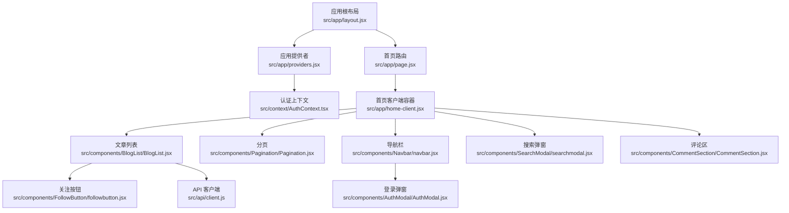
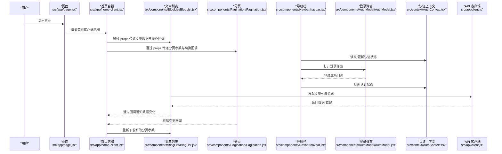
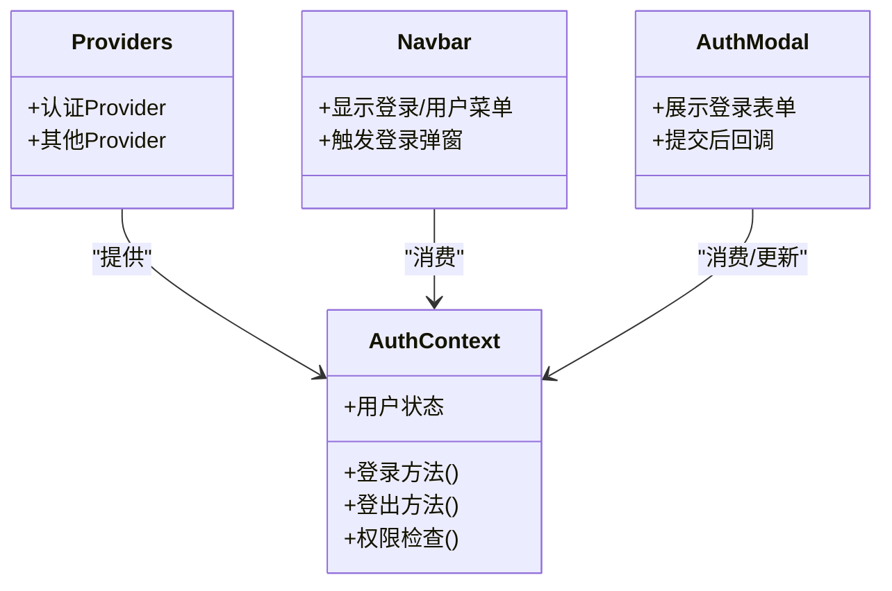
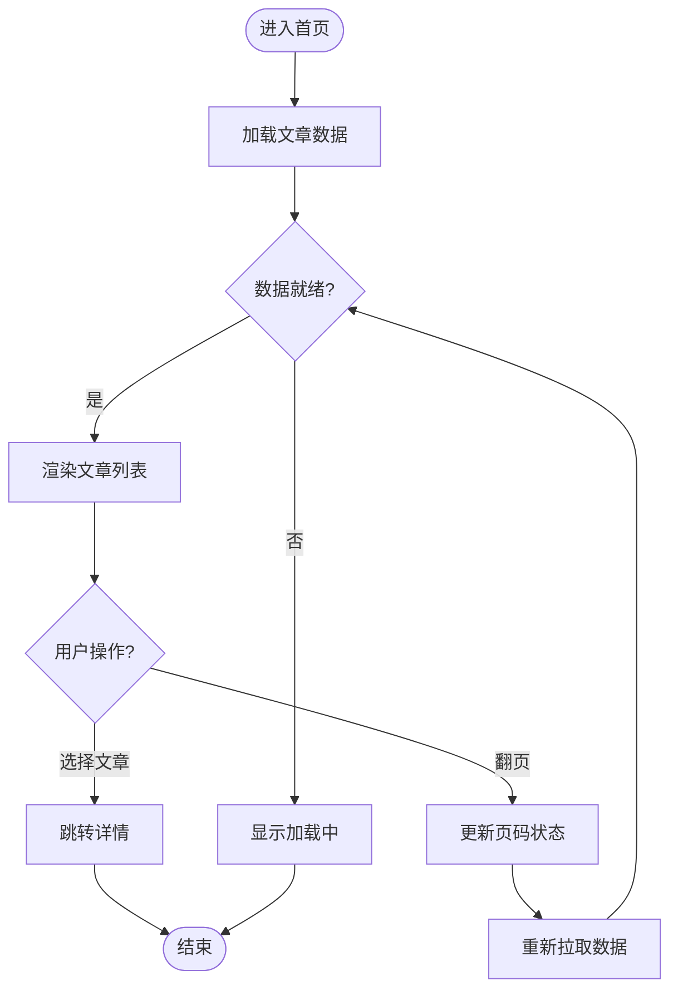
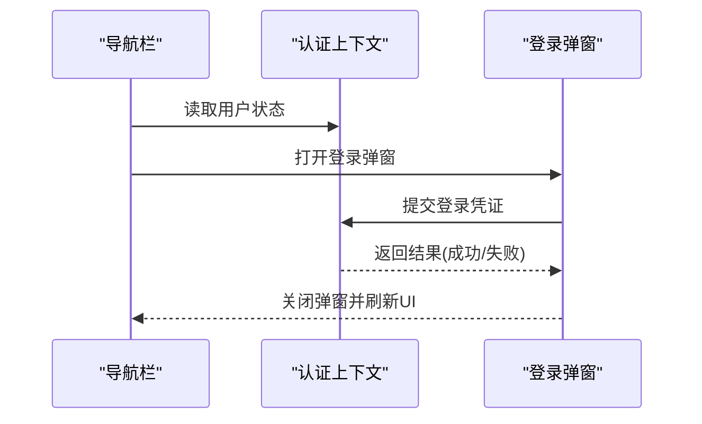
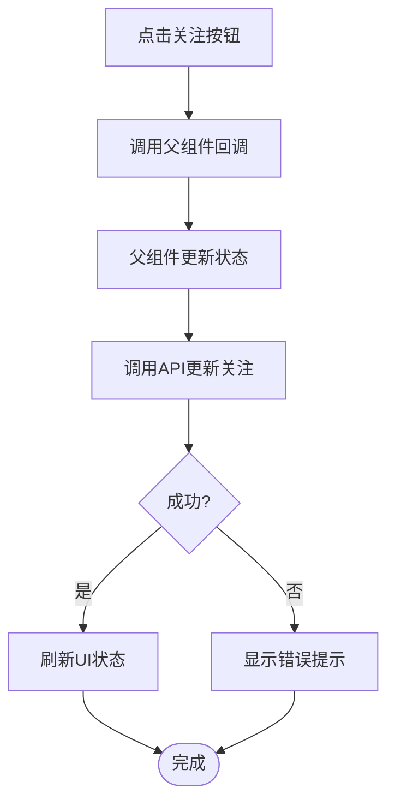
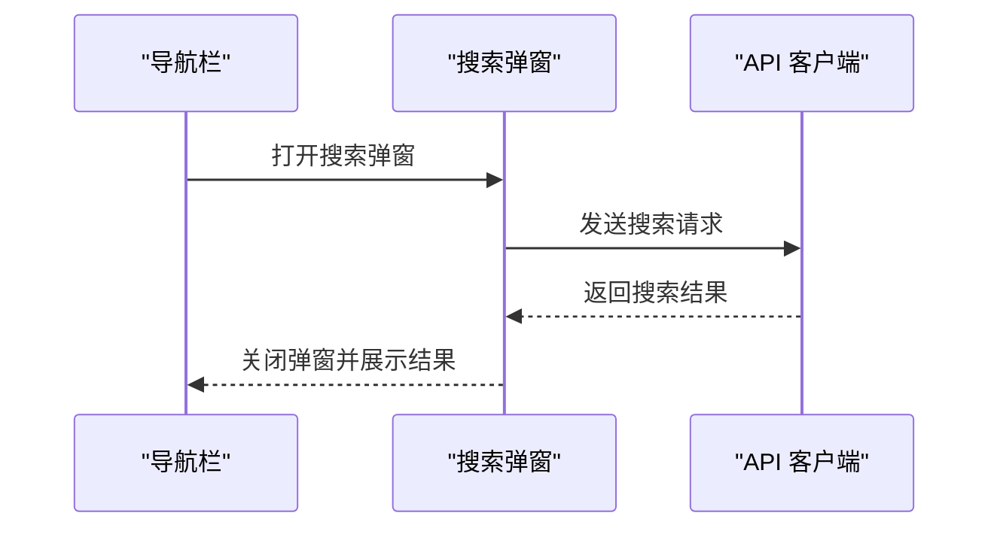
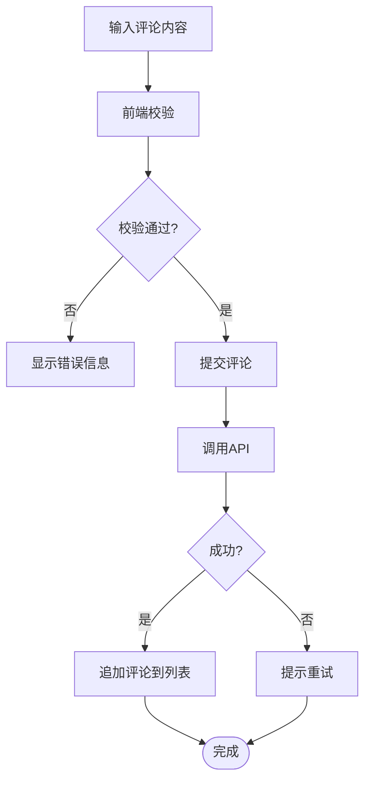
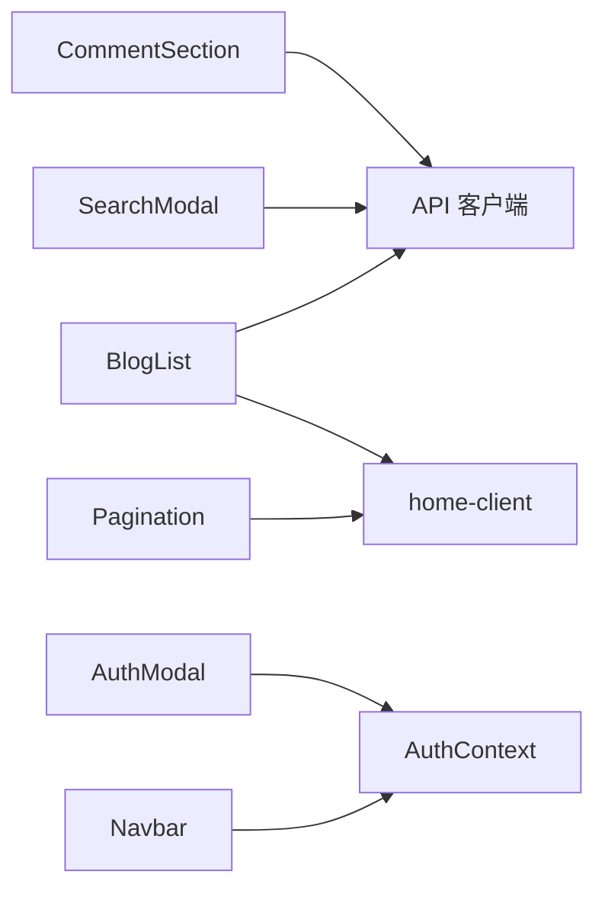

# 组件通信机制

<cite>
**本文引用的文件**   
- [src/app/providers.jsx](file://src/app/providers.jsx)
- [src/context/AuthContext.tsx](file://src/context/AuthContext.tsx)
- [src/api/client.js](file://src/api/client.js)
- [src/components/Navbar/navbar.jsx](file://src/components/Navbar/navbar.jsx)
- [src/components/AuthModal/AuthModal.jsx](file://src/components/AuthModal/AuthModal.jsx)
- [src/components/FollowButton/followbutton.jsx](file://src/components/FollowButton/followbutton.jsx)
- [src/components/BlogList/BlogList.jsx](file://src/components/BlogList/BlogList.jsx)
- [src/components/Pagination/Pagination.jsx](file://src/components/Pagination/Pagination.jsx)
- [src/components/SearchModal/searchmodal.jsx](file://src/components/SearchModal/searchmodal.jsx)
- [src/components/CommentSection/CommentSection.jsx](file://src/components/CommentSection/CommentSection.jsx)
- [src/app/home-client.jsx](file://src/app/home-client.jsx)
- [src/app/page.jsx](file://src/app/page.jsx)
</cite>

## 目录
1. [简介](#简介)
2. [项目结构](#项目结构)
3. [核心组件与通信要点](#核心组件与通信要点)
4. [架构总览](#架构总览)
5. [详细组件分析](#详细组件分析)
6. [依赖关系分析](#依赖关系分析)
7. [性能考虑](#性能考虑)
8. [故障排查指南](#故障排查指南)
9. [结论](#结论)
10. [附录：通信模式速查](#附录通信模式速查)

## 简介
本文件聚焦于项目中“组件通信机制”的设计与实践，覆盖父子、兄弟、跨层级通信，全局状态管理（React Context）、Provider 模式、订阅发布模式，以及异步数据获取与状态同步策略。文档以实际源码为依据，结合图示说明数据流与控制流，帮助读者快速理解并落地最佳实践。

## 项目结构
本项目采用 Next.js App Router 组织页面与布局，组件按功能域拆分在 src/components 下，全局上下文位于 src/context，API 客户端集中于 src/api。关键入口与 Provider 挂载点如下：
- 应用级 Provider 挂载：src/app/providers.jsx
- 认证上下文定义：src/context/AuthContext.tsx
- API 客户端封装：src/api/client.js
- 典型页面组合：src/app/page.jsx 与 src/app/home-client.jsx
- 常用 UI 组件：导航栏、登录弹窗、关注按钮、文章列表、分页、搜索弹窗、评论区等

图表来源
- [src/app/providers.jsx](file://src/app/providers.jsx)
- [src/context/AuthContext.tsx](file://src/context/AuthContext.tsx)
- [src/app/page.jsx](file://src/app/page.jsx)
- [src/app/home-client.jsx](file://src/app/home-client.jsx)
- [src/components/BlogList/BlogList.jsx](file://src/components/BlogList/BlogList.jsx)
- [src/components/Pagination/Pagination.jsx](file://src/components/Pagination/Pagination.jsx)
- [src/components/Navbar/navbar.jsx](file://src/components/Navbar/navbar.jsx)
- [src/components/AuthModal/AuthModal.jsx](file://src/components/AuthModal/AuthModal.jsx)
- [src/components/SearchModal/searchmodal.jsx](file://src/components/SearchModal/searchmodal.jsx)
- [src/components/CommentSection/CommentSection.jsx](file://src/components/CommentSection/CommentSection.jsx)
- [src/components/FollowButton/followbutton.jsx](file://src/components/FollowButton/followbutton.jsx)
- [src/api/client.js](file://src/api/client.js)

章节来源
- [src/app/providers.jsx](file://src/app/providers.jsx)
- [src/context/AuthContext.tsx](file://src/context/AuthContext.tsx)
- [src/app/page.jsx](file://src/app/page.jsx)
- [src/app/home-client.jsx](file://src/app/home-client.jsx)

## 核心组件与通信要点
- 父子通信
  - Props 传递：父组件将数据与方法作为属性传入子组件，子组件通过 props 访问与回调触发更新。
  - 回调函数：子组件通过 props 中的回调向父组件上报事件或变更，父组件负责状态提升与持久化。
- 兄弟通信
  - 状态提升：将共享状态提升到最近的共同父组件，由父组件统一维护并通过 props 下发给兄弟组件。
  - 事件总线：对于深层级或跨树通信，可使用轻量事件总线进行解耦（在本项目中更推荐 Context 或状态提升）。
- 全局状态管理
  - React Context：用于跨层级共享如用户认证、主题、搜索条件等；配合 Provider 注入，避免逐层透传。
  - Provider 模式：在应用根节点提供上下文，确保任意深度子组件均可消费。
- 异步数据与状态同步
  - API 客户端：集中封装请求、错误处理与重试策略，供业务组件调用。
  - 加载与错误状态：在组件内使用本地状态管理 loading/error/data，保证 UI 反馈一致。
  - 服务端渲染与客户端水合：Next.js 中合理分配 SSR/CSR 职责，减少首屏阻塞。

章节来源
- [src/app/providers.jsx](file://src/app/providers.jsx)
- [src/context/AuthContext.tsx](file://src/context/AuthContext.tsx)
- [src/api/client.js](file://src/api/client.js)
- [src/components/BlogList/BlogList.jsx](file://src/components/BlogList/BlogList.jsx)
- [src/components/Pagination/Pagination.jsx](file://src/components/Pagination/Pagination.jsx)
- [src/components/Navbar/navbar.jsx](file://src/components/Navbar/navbar.jsx)
- [src/components/AuthModal/AuthModal.jsx](file://src/components/AuthModal/AuthModal.jsx)
- [src/components/SearchModal/searchmodal.jsx](file://src/components/SearchModal/searchmodal.jsx)
- [src/components/CommentSection/CommentSection.jsx](file://src/components/CommentSection/CommentSection.jsx)
- [src/components/FollowButton/followbutton.jsx](file://src/components/FollowButton/followbutton.jsx)
- [src/app/home-client.jsx](file://src/app/home-client.jsx)
- [src/app/page.jsx](file://src/app/page.jsx)

## 架构总览
下图展示了从页面到组件再到 API 的完整通信链路，包括认证上下文、Provider 注入、父子与兄弟通信路径，以及异步数据流。

图表来源
- [src/app/page.jsx](file://src/app/page.jsx)
- [src/app/home-client.jsx](file://src/app/home-client.jsx)
- [src/components/BlogList/BlogList.jsx](file://src/components/BlogList/BlogList.jsx)
- [src/components/Pagination/Pagination.jsx](file://src/components/Pagination/Pagination.jsx)
- [src/components/Navbar/navbar.jsx](file://src/components/Navbar/navbar.jsx)
- [src/components/AuthModal/AuthModal.jsx](file://src/components/AuthModal/AuthModal.jsx)
- [src/context/AuthContext.tsx](file://src/context/AuthContext.tsx)
- [src/api/client.js](file://src/api/client.js)

## 详细组件分析

### 认证上下文与 Provider 模式
- 角色与职责
  - AuthContext：定义认证状态与操作方法，供全应用消费。
  - providers.jsx：在应用根节点包裹认证上下文 Provider，使任意子组件可访问认证信息。
- 通信方式
  - 跨层级：Navbar、AuthModal 等通过 useContext 消费认证状态与动作。
  - 事件驱动：登录成功后，Navbar 触发状态刷新，弹窗关闭。
- 最佳实践
  - 将敏感逻辑（如鉴权判断）集中在上下文或受保护路由中。
  - 避免在 Provider 中放置过多无关状态，保持上下文精简。

图表来源
- [src/context/AuthContext.tsx](file://src/context/AuthContext.tsx)
- [src/app/providers.jsx](file://src/app/providers.jsx)
- [src/components/Navbar/navbar.jsx](file://src/components/Navbar/navbar.jsx)
- [src/components/AuthModal/AuthModal.jsx](file://src/components/AuthModal/AuthModal.jsx)

章节来源
- [src/context/AuthContext.tsx](file://src/context/AuthContext.tsx)
- [src/app/providers.jsx](file://src/app/providers.jsx)
- [src/components/Navbar/navbar.jsx](file://src/components/Navbar/navbar.jsx)
- [src/components/AuthModal/AuthModal.jsx](file://src/components/AuthModal/AuthModal.jsx)

### 文章列表与分页（父子与兄弟通信）
- 父子通信
  - home-client.jsx 作为父容器，持有文章数据与分页状态，通过 props 下发给 BlogList 与 Pagination。
  - 子组件通过回调函数向上报告交互（如点击文章、切换页码），父组件更新状态并重新下发。
- 兄弟通信
  - BlogList 与 Pagination 为兄弟组件，通过共同父组件 home-client.jsx 的状态提升实现联动。
- 异步数据流
  - BlogList 内部或父容器调用 API 客户端获取数据，管理 loading/error 状态，并在数据就绪后渲染。

图表来源
- [src/app/home-client.jsx](file://src/app/home-client.jsx)
- [src/components/BlogList/BlogList.jsx](file://src/components/BlogList/BlogList.jsx)
- [src/components/Pagination/Pagination.jsx](file://src/components/Pagination/Pagination.jsx)
- [src/api/client.js](file://src/api/client.js)

章节来源
- [src/app/home-client.jsx](file://src/app/home-client.jsx)
- [src/components/BlogList/BlogList.jsx](file://src/components/BlogList/BlogList.jsx)
- [src/components/Pagination/Pagination.jsx](file://src/components/Pagination/Pagination.jsx)
- [src/api/client.js](file://src/api/client.js)

### 导航栏与登录弹窗（跨层级与事件驱动）
- 跨层级通信
  - Navbar 通过认证上下文读取当前用户状态，决定显示“登录”或“用户菜单”。
- 事件驱动
  - 点击“登录”时打开 AuthModal，登录成功后通过上下文刷新状态并关闭弹窗。
- 错误处理
  - 登录失败时提示错误信息，保持弹窗打开以便重试。

图表来源
- [src/components/Navbar/navbar.jsx](file://src/components/Navbar/navbar.jsx)
- [src/components/AuthModal/AuthModal.jsx](file://src/components/AuthModal/AuthModal.jsx)
- [src/context/AuthContext.tsx](file://src/context/AuthContext.tsx)

章节来源
- [src/components/Navbar/navbar.jsx](file://src/components/Navbar/navbar.jsx)
- [src/components/AuthModal/AuthModal.jsx](file://src/components/AuthModal/AuthModal.jsx)
- [src/context/AuthContext.tsx](file://src/context/AuthContext.tsx)

### 关注按钮（子组件回调与副作用）
- 通信方式
  - FollowButton 通过 props 接收文章标识与当前关注状态，点击后调用父组件提供的回调。
  - 父组件更新本地状态或触发 API 请求，随后回写新状态。
- 错误与加载
  - 在请求期间禁用按钮并显示加载态，失败时给出友好提示。

图表来源
- [src/components/FollowButton/followbutton.jsx](file://src/components/FollowButton/followbutton.jsx)
- [src/api/client.js](file://src/api/client.js)

章节来源
- [src/components/FollowButton/followbutton.jsx](file://src/components/FollowButton/followbutton.jsx)
- [src/api/client.js](file://src/api/client.js)

### 搜索弹窗（模态框与外部触发）
- 触发与关闭
  - 导航栏或其他组件通过状态控制搜索弹窗的显隐。
- 数据流
  - 输入关键词后，弹窗内部或父容器发起搜索请求，并将结果回传给相关列表组件。
- 注意事项
  - 避免在弹窗内直接修改非自身状态，应通过回调或上下文进行状态提升。

图表来源
- [src/components/SearchModal/searchmodal.jsx](file://src/components/SearchModal/searchmodal.jsx)
- [src/components/Navbar/navbar.jsx](file://src/components/Navbar/navbar.jsx)
- [src/api/client.js](file://src/api/client.js)

章节来源
- [src/components/SearchModal/searchmodal.jsx](file://src/components/SearchModal/searchmodal.jsx)
- [src/components/Navbar/navbar.jsx](file://src/components/Navbar/navbar.jsx)
- [src/api/client.js](file://src/api/client.js)

### 评论区（复杂表单与状态同步）
- 状态管理
  - 评论列表与新增评论表单可能由父容器统一管理，子组件仅负责展示与事件上报。
- 异步同步
  - 提交评论后，父容器更新本地列表或重新拉取，确保多组件视图一致。
- 错误处理
  - 网络异常或校验失败时，及时提示并保持表单可用。

图表来源
- [src/components/CommentSection/CommentSection.jsx](file://src/components/CommentSection/CommentSection.jsx)
- [src/api/client.js](file://src/api/client.js)

章节来源
- [src/components/CommentSection/CommentSection.jsx](file://src/components/CommentSection/CommentSection.jsx)
- [src/api/client.js](file://src/api/client.js)

## 依赖关系分析
- 组件耦合
  - 父子组件通过 props 与回调紧密耦合，但职责清晰，易于测试与维护。
  - 兄弟组件通过状态提升解耦，避免直接引用。
- 上下文依赖
  - 认证上下文被多个组件消费，形成一对多的依赖关系；建议按需拆分上下文以降低重渲染范围。
- API 客户端
  - 各业务组件通过统一的 API 客户端访问后端，便于统一拦截、错误处理与缓存策略。

图表来源
- [src/components/BlogList/BlogList.jsx](file://src/components/BlogList/BlogList.jsx)
- [src/components/Pagination/Pagination.jsx](file://src/components/Pagination/Pagination.jsx)
- [src/app/home-client.jsx](file://src/app/home-client.jsx)
- [src/components/Navbar/navbar.jsx](file://src/components/Navbar/navbar.jsx)
- [src/components/AuthModal/AuthModal.jsx](file://src/components/AuthModal/AuthModal.jsx)
- [src/context/AuthContext.tsx](file://src/context/AuthContext.tsx)
- [src/components/SearchModal/searchmodal.jsx](file://src/components/SearchModal/searchmodal.jsx)
- [src/components/CommentSection/CommentSection.jsx](file://src/components/CommentSection/CommentSection.jsx)
- [src/api/client.js](file://src/api/client.js)

章节来源
- [src/components/BlogList/BlogList.jsx](file://src/components/BlogList/BlogList.jsx)
- [src/components/Pagination/Pagination.jsx](file://src/components/Pagination/Pagination.jsx)
- [src/app/home-client.jsx](file://src/app/home-client.jsx)
- [src/components/Navbar/navbar.jsx](file://src/components/Navbar/navbar.jsx)
- [src/components/AuthModal/AuthModal.jsx](file://src/components/AuthModal/AuthModal.jsx)
- [src/context/AuthContext.tsx](file://src/context/AuthContext.tsx)
- [src/components/SearchModal/searchmodal.jsx](file://src/components/SearchModal/searchmodal.jsx)
- [src/components/CommentSection/CommentSection.jsx](file://src/components/CommentSection/CommentSection.jsx)
- [src/api/client.js](file://src/api/client.js)

## 性能考虑
- 最小化重渲染
  - 使用 React.memo 包裹纯展示型子组件，避免不必要的渲染。
  - 将频繁变化的状态拆分为独立上下文或局部状态，缩小 Provider 影响范围。
- 数据获取优化
  - 对列表类接口实施分页与增量更新，避免一次性加载大量数据。
  - 合理使用缓存策略（如内存缓存或浏览器缓存），减少重复请求。
- 事件节流与防抖
  - 搜索输入、滚动加载等高频事件需做节流/防抖处理。
- 代码分割与懒加载
  - 对大型弹窗或次级页面使用动态导入，降低首屏体积。

[本节为通用指导，不直接分析具体文件]

## 故障排查指南
- 常见问题定位
  - 认证状态不同步：检查 Provider 是否包裹正确，确认上下文消费位置是否正确。
  - 列表未更新：确认父组件状态是否真正更新，回调是否被触发，API 响应是否到达。
  - 弹窗无法关闭：检查显隐状态是否在正确作用域内，回调是否被调用。
- 日志与断点
  - 在 API 客户端添加请求/响应日志，便于追踪网络问题。
  - 在关键回调处增加断点，验证数据流向是否符合预期。
- 错误边界
  - 为重要模块添加错误边界，捕获渲染期错误，避免整页崩溃。

章节来源
- [src/context/AuthContext.tsx](file://src/context/AuthContext.tsx)
- [src/api/client.js](file://src/api/client.js)
- [src/components/AuthModal/AuthModal.jsx](file://src/components/AuthModal/AuthModal.jsx)
- [src/components/BlogList/BlogList.jsx](file://src/components/BlogList/BlogList.jsx)

## 结论
本项目通过清晰的父子通信、状态提升与 React Context 实现了稳定高效的组件通信体系。Provider 模式确保了跨层级数据的便捷访问，API 客户端的统一封装提升了错误处理与可维护性。遵循本文的最佳实践与性能建议，可在保持代码可读性的同时获得良好的用户体验。

[本节为总结性内容，不直接分析具体文件]

## 附录：通信模式速查
- 父子通信
  - 使用 props 传递数据与回调，子组件通过回调上报变更。
- 兄弟通信
  - 状态提升至最近公共父组件，通过 props 分发。
- 跨层级通信
  - 使用 React Context + Provider，避免层层透传。
- 订阅发布
  - 对深层级或跨树通信，可采用轻量事件总线（谨慎使用，避免过度耦合）。
- 异步数据
  - 在组件内管理 loading/error/data，API 客户端统一封装请求与错误处理。

[本节为概念性总结，不直接分析具体文件]