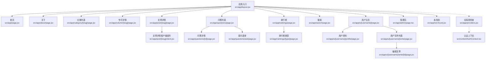
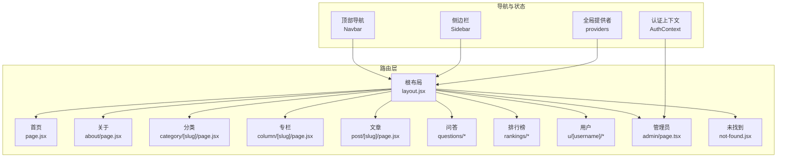
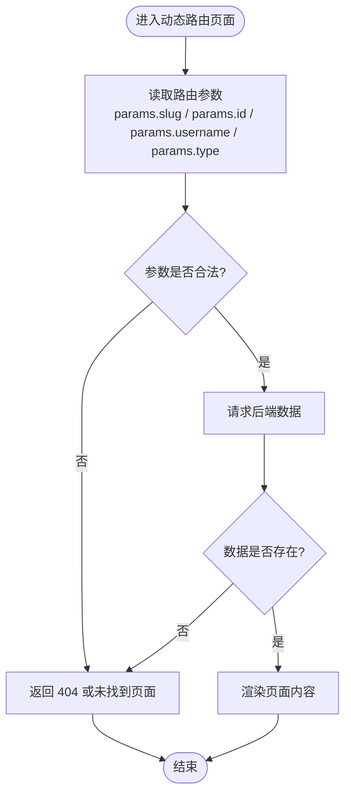
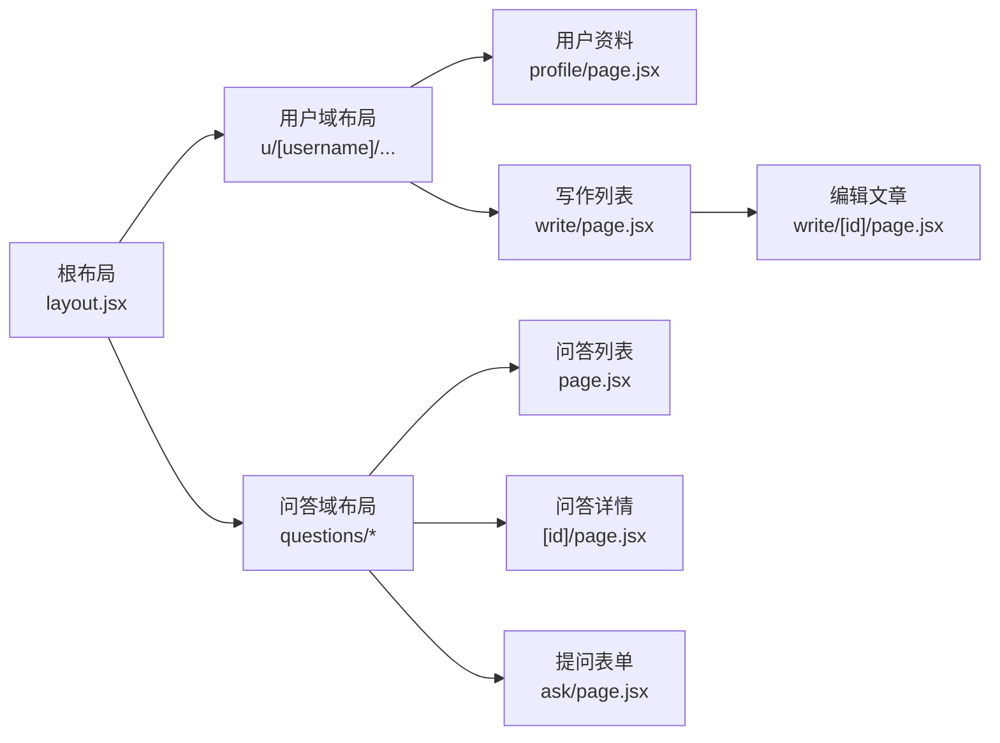
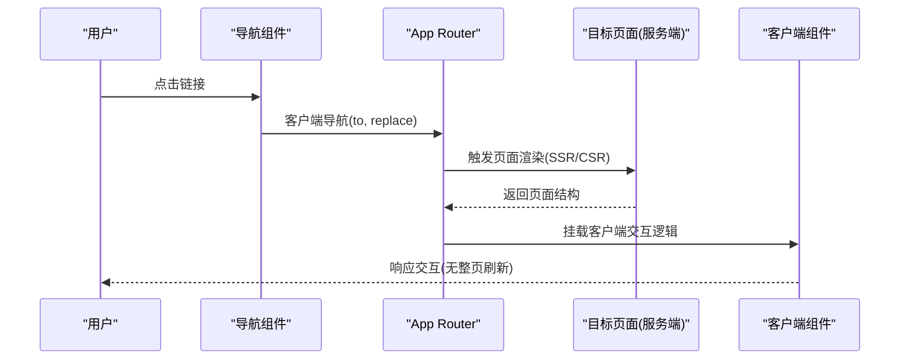
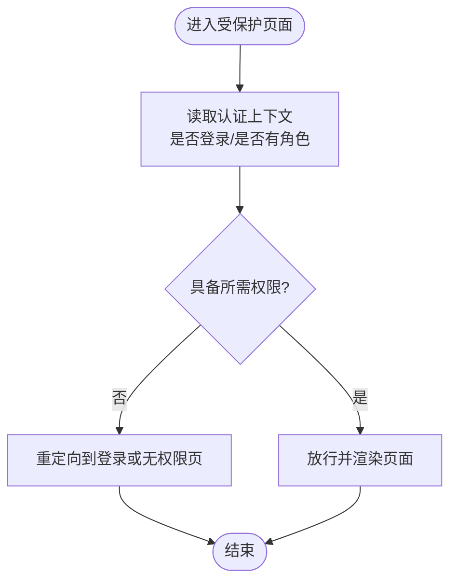
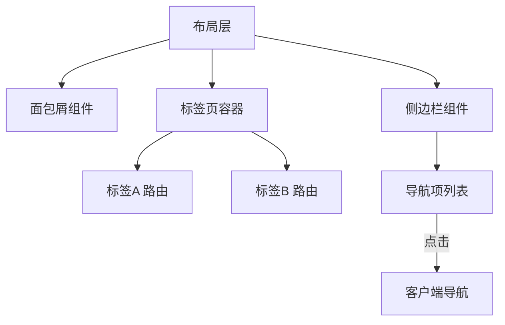
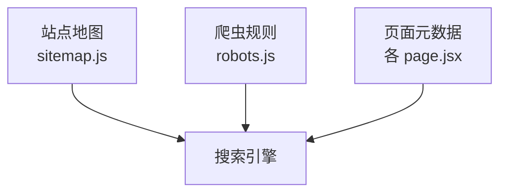
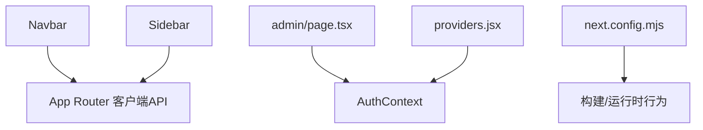

# 路由导航系统

<cite>
**本文引用的文件**   
- [src/app/layout.jsx](file://src/app/layout.jsx)
- [src/app/page.jsx](file://src/app/page.jsx)
- [src/app/about/page.jsx](file://src/app/about/page.jsx)
- [src/app/admin/page.tsx](file://src/app/admin/page.tsx)
- [src/app/category/[slug]/page.jsx](file://src/app/category/[slug]/page.jsx)
- [src/app/column/[slug]/page.jsx](file://src/app/column/[slug]/page.jsx)
- [src/app/columns/page.jsx](file://src/app/columns/page.jsx)
- [src/app/post/[slug]/page.jsx](file://src/app/post/[slug]/page.jsx)
- [src/app/post/[slug]/client.jsx](file://src/app/post/[slug]/client.jsx)
- [src/app/questions/[id]/page.jsx](file://src/app/questions/[id]/page.jsx)
- [src/app/questions/ask/page.jsx](file://src/app/questions/ask/page.jsx)
- [src/app/questions/page.jsx](file://src/app/questions/page.jsx)
- [src/app/rankings/[type]/page.jsx](file://src/app/rankings/[type]/page.jsx)
- [src/app/rankings/page.jsx](file://src/app/rankings/page.jsx)
- [src/app/search/page.jsx](file://src/app/search/page.jsx)
- [src/app/u/[username]/page.jsx](file://src/app/u/[username]/page.jsx)
- [src/app/u/[username]/profile/page.jsx](file://src/app/u/[username]/profile/page.jsx)
- [src/app/u/[username]/write/page.jsx](file://src/app/u/[username]/write/page.jsx)
- [src/app/u/[username]/write/[id]/page.jsx](file://src/app/u/[username]/write/[id]/page.jsx)
- [src/app/not-found.jsx](file://src/app/not-found.jsx)
- [src/app/providers.jsx](file://src/app/providers.jsx)
- [src/app/home-client.jsx](file://src/app/home-client.jsx)
- [src/app/robots.js](file://src/app/robots.js)
- [src/app/sitemap.js](file://src/app/sitemap.js)
- [src/components/Navbar/navbar.jsx](file://src/components/Navbar/navbar.jsx)
- [src/components/Sidebar/Sidebar.jsx](file://src/components/Sidebar/Sidebar.jsx)
- [src/context/AuthContext.tsx](file://src/context/AuthContext.tsx)
- [next.config.mjs](file://next.config.mjs)
</cite>

## 目录
1. [简介](#简介)
2. [项目结构](#项目结构)
3. [核心组件](#核心组件)
4. [架构总览](#架构总览)
5. [详细组件分析](#详细组件分析)
6. [依赖分析](#依赖分析)
7. [性能考虑](#性能考虑)
8. [故障排查指南](#故障排查指南)
9. [结论](#结论)
10. [附录](#附录)

## 简介
本文件聚焦于基于 Next.js App Router 的路由与导航系统设计，覆盖以下主题：
- 动态路由参数处理与校验策略
- 嵌套路由与布局路由的组织方式
- 客户端导航与服务端渲染在路由层面的差异
- 路由守卫与权限控制实现思路
- 面包屑、侧边栏、标签页等导航模式
- SEO 优化与元数据管理
- 路由性能优化与代码分割最佳实践

## 项目结构
本项目采用 App Router 的目录即路由约定。根布局位于 src/app/layout.jsx，页面按功能模块组织在 src/app 下，包含静态路由（如 about）、动态路由（如 post/[slug]、u/[username]）以及多级嵌套（如 u/[username]/write/[id]）。全局上下文 providers 通过 src/app/providers.jsx 注入，认证状态由 src/context/AuthContext.tsx 提供。

图表来源
- [src/app/layout.jsx](file://src/app/layout.jsx)
- [src/app/page.jsx](file://src/app/page.jsx)
- [src/app/about/page.jsx](file://src/app/about/page.jsx)
- [src/app/category/[slug]/page.jsx](file://src/app/category/[slug]/page.jsx)
- [src/app/column/[slug]/page.jsx](file://src/app/column/[slug]/page.jsx)
- [src/app/post/[slug]/page.jsx](file://src/app/post/[slug]/page.jsx)
- [src/app/post/[slug]/client.jsx](file://src/app/post/[slug]/client.jsx)
- [src/app/questions/page.jsx](file://src/app/questions/page.jsx)
- [src/app/questions/[id]/page.jsx](file://src/app/questions/[id]/page.jsx)
- [src/app/questions/ask/page.jsx](file://src/app/questions/ask/page.jsx)
- [src/app/rankings/page.jsx](file://src/app/rankings/page.jsx)
- [src/app/rankings/[type]/page.jsx](file://src/app/rankings/[type]/page.jsx)
- [src/app/search/page.jsx](file://src/app/search/page.jsx)
- [src/app/u/[username]/page.jsx](file://src/app/u/[username]/page.jsx)
- [src/app/u/[username]/profile/page.jsx](file://src/app/u/[username]/profile/page.jsx)
- [src/app/u/[username]/write/page.jsx](file://src/app/u/[username]/write/page.jsx)
- [src/app/u/[username]/write/[id]/page.jsx](file://src/app/u/[username]/write/[id]/page.jsx)
- [src/app/admin/page.tsx](file://src/app/admin/page.tsx)
- [src/app/not-found.jsx](file://src/app/not-found.jsx)
- [src/app/providers.jsx](file://src/app/providers.jsx)
- [src/context/AuthContext.tsx](file://src/context/AuthContext.tsx)

章节来源
- [src/app/layout.jsx](file://src/app/layout.jsx)
- [src/app/page.jsx](file://src/app/page.jsx)
- [src/app/providers.jsx](file://src/app/providers.jsx)
- [src/context/AuthContext.tsx](file://src/context/AuthContext.tsx)

## 核心组件
- 全局布局与提供者
  - 根布局负责包裹所有页面，可承载站点级导航、SEO 元信息、主题与国际化等。
  - 全局提供者用于挂载认证上下文、UI 库 Provider 等，确保子树共享状态。
- 导航组件
  - 顶部导航与侧边栏作为通用导航入口，内部使用 App Router 的客户端导航 API 进行跳转。
- 认证上下文
  - 集中管理登录态、角色与权限，供路由守卫与受保护页面消费。

章节来源
- [src/app/layout.jsx](file://src/app/layout.jsx)
- [src/app/providers.jsx](file://src/app/providers.jsx)
- [src/components/Navbar/navbar.jsx](file://src/components/Navbar/navbar.jsx)
- [src/components/Sidebar/Sidebar.jsx](file://src/components/Sidebar/Sidebar.jsx)
- [src/context/AuthContext.tsx](file://src/context/AuthContext.tsx)

## 架构总览
App Router 将“目录结构”映射为“URL 路径”，每个 page 对应一个路由段；layout 定义共享 UI 与数据流；not-found 处理未匹配路由；sitemap/robots 支持 SEO。

图表来源
- [src/app/layout.jsx](file://src/app/layout.jsx)
- [src/app/page.jsx](file://src/app/page.jsx)
- [src/app/about/page.jsx](file://src/app/about/page.jsx)
- [src/app/category/[slug]/page.jsx](file://src/app/category/[slug]/page.jsx)
- [src/app/column/[slug]/page.jsx](file://src/app/column/[slug]/page.jsx)
- [src/app/post/[slug]/page.jsx](file://src/app/post/[slug]/page.jsx)
- [src/app/questions/page.jsx](file://src/app/questions/page.jsx)
- [src/app/questions/[id]/page.jsx](file://src/app/questions/[id]/page.jsx)
- [src/app/questions/ask/page.jsx](file://src/app/questions/ask/page.jsx)
- [src/app/rankings/page.jsx](file://src/app/rankings/page.jsx)
- [src/app/rankings/[type]/page.jsx](file://src/app/rankings/[type]/page.jsx)
- [src/app/u/[username]/page.jsx](file://src/app/u/[username]/page.jsx)
- [src/app/u/[username]/profile/page.jsx](file://src/app/u/[username]/profile/page.jsx)
- [src/app/u/[username]/write/page.jsx](file://src/app/u/[username]/write/page.jsx)
- [src/app/u/[username]/write/[id]/page.jsx](file://src/app/u/[username]/write/[id]/page.jsx)
- [src/app/admin/page.tsx](file://src/app/admin/page.tsx)
- [src/app/not-found.jsx](file://src/app/not-found.jsx)
- [src/components/Navbar/navbar.jsx](file://src/components/Navbar/navbar.jsx)
- [src/components/Sidebar/Sidebar.jsx](file://src/components/Sidebar/Sidebar.jsx)
- [src/app/providers.jsx](file://src/app/providers.jsx)
- [src/context/AuthContext.tsx](file://src/context/AuthContext.tsx)

## 详细组件分析

### 动态路由参数处理与验证
- 参数获取
  - 通过 URL 段占位符（如 [slug]、[id]、[username]、[type]）声明动态段，Next.js 会在服务端渲染时向页面组件传入 params。
  - 常见用法包括根据 slug 拉取文章详情、根据 username 加载用户资料、根据 type 筛选排行榜等。
- 参数校验建议
  - 在服务端对 params 做基础校验（非空、格式），失败时返回 404 或重定向到合适页面。
  - 对于复杂业务规则（如用户名唯一性、ID 存在性），应在数据层二次校验并统一错误处理。
- 典型场景
  - 文章详情：post/[slug]
  - 用户相关：u/[username]、u/[username]/write/[id]
  - 分类与专栏：category/[slug]、column/[slug]
  - 问答与排行：questions/[id]、rankings/[type]

图表来源
- [src/app/post/[slug]/page.jsx](file://src/app/post/[slug]/page.jsx)
- [src/app/u/[username]/page.jsx](file://src/app/u/[username]/page.jsx)
- [src/app/u/[username]/write/[id]/page.jsx](file://src/app/u/[username]/write/[id]/page.jsx)
- [src/app/category/[slug]/page.jsx](file://src/app/category/[slug]/page.jsx)
- [src/app/column/[slug]/page.jsx](file://src/app/column/[slug]/page.jsx)
- [src/app/questions/[id]/page.jsx](file://src/app/questions/[id]/page.jsx)
- [src/app/rankings/[type]/page.jsx](file://src/app/rankings/[type]/page.jsx)
- [src/app/not-found.jsx](file://src/app/not-found.jsx)

章节来源
- [src/app/post/[slug]/page.jsx](file://src/app/post/[slug]/page.jsx)
- [src/app/u/[username]/page.jsx](file://src/app/u/[username]/page.jsx)
- [src/app/u/[username]/write/[id]/page.jsx](file://src/app/u/[username]/write/[id]/page.jsx)
- [src/app/category/[slug]/page.jsx](file://src/app/category/[slug]/page.jsx)
- [src/app/column/[slug]/page.jsx](file://src/app/column/[slug]/page.jsx)
- [src/app/questions/[id]/page.jsx](file://src/app/questions/[id]/page.jsx)
- [src/app/rankings/[type]/page.jsx](file://src/app/rankings/[type]/page.jsx)
- [src/app/not-found.jsx](file://src/app/not-found.jsx)

### 嵌套路由与布局路由
- 嵌套路由
  - 通过目录层级表达父子关系，例如 u/[username]/profile 与 u/[username]/write 均继承父级布局。
  - 同级多个页面（如 questions 与其子路由）共享同一布局片段。
- 布局路由
  - 根 layout 包裹全站公共区域（导航、侧边栏、页脚等）。
  - 可按需创建局部 layout 以复用特定区域的 UI 与数据逻辑。
- 未匹配路由
  - not-found 用于捕获无效路径，提升用户体验。

图表来源
- [src/app/layout.jsx](file://src/app/layout.jsx)
- [src/app/u/[username]/page.jsx](file://src/app/u/[username]/page.jsx)
- [src/app/u/[username]/profile/page.jsx](file://src/app/u/[username]/profile/page.jsx)
- [src/app/u/[username]/write/page.jsx](file://src/app/u/[username]/write/page.jsx)
- [src/app/u/[username]/write/[id]/page.jsx](file://src/app/u/[username]/write/[id]/page.jsx)
- [src/app/questions/page.jsx](file://src/app/questions/page.jsx)
- [src/app/questions/[id]/page.jsx](file://src/app/questions/[id]/page.jsx)
- [src/app/questions/ask/page.jsx](file://src/app/questions/ask/page.jsx)

章节来源
- [src/app/layout.jsx](file://src/app/layout.jsx)
- [src/app/u/[username]/page.jsx](file://src/app/u/[username]/page.jsx)
- [src/app/u/[username]/profile/page.jsx](file://src/app/u/[username]/profile/page.jsx)
- [src/app/u/[username]/write/page.jsx](file://src/app/u/[username]/write/page.jsx)
- [src/app/u/[username]/write/[id]/page.jsx](file://src/app/u/[username]/write/[id]/page.jsx)
- [src/app/questions/page.jsx](file://src/app/questions/page.jsx)
- [src/app/questions/[id]/page.jsx](file://src/app/questions/[id]/page.jsx)
- [src/app/questions/ask/page.jsx](file://src/app/questions/ask/page.jsx)

### 客户端导航与服务端渲染的差异
- 服务端渲染（SSR）
  - 首次访问由服务器生成 HTML，利于 SEO 与首屏性能。
  - 动态路由参数在服务端解析，适合需要服务端数据的页面（如文章详情、用户资料）。
- 客户端导航
  - 使用 App Router 的客户端导航 API 在已加载应用中切换路由，避免整页刷新。
  - 适用于高频交互页面（如搜索、分页、列表过滤）。
- 混合模式
  - 页面主体 SSR，关键交互下沉到客户端组件（如 post/[slug]/client.jsx），兼顾 SEO 与体验。

图表来源
- [src/components/Navbar/navbar.jsx](file://src/components/Navbar/navbar.jsx)
- [src/app/post/[slug]/page.jsx](file://src/app/post/[slug]/page.jsx)
- [src/app/post/[slug]/client.jsx](file://src/app/post/[slug]/client.jsx)

章节来源
- [src/components/Navbar/navbar.jsx](file://src/components/Navbar/navbar.jsx)
- [src/app/post/[slug]/page.jsx](file://src/app/post/[slug]/page.jsx)
- [src/app/post/[slug]/client.jsx](file://src/app/post/[slug]/client.jsx)

### 路由守卫与权限控制
- 设计要点
  - 在受保护页面或服务端渲染阶段检查认证上下文中的身份与角色。
  - 未授权时重定向至登录页或展示受限提示。
- 实现位置
  - 可在页面组件内直接判断，也可封装高阶组件/布局层统一拦截。
  - 管理员页面（admin）通常要求更高权限。

图表来源
- [src/app/admin/page.tsx](file://src/app/admin/page.tsx)
- [src/context/AuthContext.tsx](file://src/context/AuthContext.tsx)

章节来源
- [src/app/admin/page.tsx](file://src/app/admin/page.tsx)
- [src/context/AuthContext.tsx](file://src/context/AuthContext.tsx)

### 导航模式实现
- 面包屑导航
  - 依据当前路由层级构建面包屑数组，结合动态段名称（如“文章详情 > 正文”）展示。
  - 建议在布局中统一计算与渲染，便于跨页面复用。
- 侧边栏导航
  - 使用 Sidebar 组件维护菜单结构与高亮状态，配合客户端导航更新选中项。
- 标签页导航
  - 在同一布局内通过客户端导航切换不同子路由，保持布局稳定，仅替换内容区。

图表来源
- [src/components/Sidebar/Sidebar.jsx](file://src/components/Sidebar/Sidebar.jsx)
- [src/app/layout.jsx](file://src/app/layout.jsx)

章节来源
- [src/components/Sidebar/Sidebar.jsx](file://src/components/Sidebar/Sidebar.jsx)
- [src/app/layout.jsx](file://src/app/layout.jsx)

### SEO 优化与元数据管理
- 站点地图与爬虫
  - sitemap.js 与 robots.js 提供站点索引与爬取策略，有助于搜索引擎收录。
- 页面级元数据
  - 各页面可根据动态参数设置标题、描述、关键词、Open Graph 信息等。
- 结构化数据
  - 针对文章、问答等实体添加 JSON-LD，提升搜索结果丰富度。

图表来源
- [src/app/sitemap.js](file://src/app/sitemap.js)
- [src/app/robots.js](file://src/app/robots.js)
- [src/app/post/[slug]/page.jsx](file://src/app/post/[slug]/page.jsx)
- [src/app/u/[username]/page.jsx](file://src/app/u/[username]/page.jsx)

章节来源
- [src/app/sitemap.js](file://src/app/sitemap.js)
- [src/app/robots.js](file://src/app/robots.js)
- [src/app/post/[slug]/page.jsx](file://src/app/post/[slug]/page.jsx)
- [src/app/u/[username]/page.jsx](file://src/app/u/[username]/page.jsx)

## 依赖分析
- 组件耦合
  - Navbar 与 Sidebar 作为导航入口，依赖 App Router 的客户端导航能力。
  - AuthContext 被受保护页面与布局层消费，形成单向依赖。
- 外部依赖
  - next.config.mjs 可能包含路由相关的构建与运行时配置（如压缩、缓存、代理等）。

图表来源
- [src/components/Navbar/navbar.jsx](file://src/components/Navbar/navbar.jsx)
- [src/components/Sidebar/Sidebar.jsx](file://src/components/Sidebar/Sidebar.jsx)
- [src/app/admin/page.tsx](file://src/app/admin/page.tsx)
- [src/context/AuthContext.tsx](file://src/context/AuthContext.tsx)
- [src/app/providers.jsx](file://src/app/providers.jsx)
- [next.config.mjs](file://next.config.mjs)

章节来源
- [src/components/Navbar/navbar.jsx](file://src/components/Navbar/navbar.jsx)
- [src/components/Sidebar/Sidebar.jsx](file://src/components/Sidebar/Sidebar.jsx)
- [src/app/admin/page.tsx](file://src/app/admin/page.tsx)
- [src/context/AuthContext.tsx](file://src/context/AuthContext.tsx)
- [src/app/providers.jsx](file://src/app/providers.jsx)
- [next.config.mjs](file://next.config.mjs)

## 性能考虑
- 代码分割与懒加载
  - 将大型客户端组件（如编辑器、富文本渲染）拆分为独立模块，按需加载。
  - 利用 App Router 的客户端组件边界，减少首屏体积。
- 预取与缓存
  - 对常用路由使用预取策略，缩短导航延迟。
  - 合理设置 HTTP 缓存头与浏览器缓存策略。
- 资源优化
  - 图片与静态资源启用压缩与懒加载。
  - 字体与第三方脚本按需引入。
- 构建与运行配置
  - 通过 next.config.mjs 调整打包策略、输出格式与缓存行为。

[本节为通用指导，不直接分析具体文件]

## 故障排查指南
- 动态路由 404
  - 检查占位符命名是否与 URL 一致，确认服务端参数校验逻辑是否正确返回未找到页面。
- 权限问题
  - 确认认证上下文初始化时机与状态同步，检查受保护页面的权限判断分支。
- 导航无响应
  - 检查客户端导航调用是否在客户端上下文中执行，避免在服务端渲染阶段调用客户端 API。
- SEO 异常
  - 核对 sitemap 与 robots 配置，确认页面元数据是否正确生成。

章节来源
- [src/app/not-found.jsx](file://src/app/not-found.jsx)
- [src/app/admin/page.tsx](file://src/app/admin/page.tsx)
- [src/context/AuthContext.tsx](file://src/context/AuthContext.tsx)
- [src/app/sitemap.js](file://src/app/sitemap.js)
- [src/app/robots.js](file://src/app/robots.js)

## 结论
本项目基于 Next.js App Router 实现了清晰的路由分层与导航体系：通过目录结构表达路由语义，借助布局与提供者复用全局能力，结合客户端导航与 SSR 平衡 SEO 与交互体验。动态路由参数在服务端解析并在必要时进行校验，权限控制集中在认证上下文与受保护页面。SEO 方面通过 sitemap 与 robots 完善索引策略。后续可继续推进代码分割、预取与缓存优化，进一步提升性能与可维护性。

## 附录
- 关键路由清单
  - 首页：src/app/page.jsx
  - 关于：src/app/about/page.jsx
  - 分类：src/app/category/[slug]/page.jsx
  - 专栏：src/app/column/[slug]/page.jsx
  - 文章：src/app/post/[slug]/page.jsx
  - 问答：src/app/questions/page.jsx、src/app/questions/[id]/page.jsx、src/app/questions/ask/page.jsx
  - 排行榜：src/app/rankings/page.jsx、src/app/rankings/[type]/page.jsx
  - 用户：src/app/u/[username]/page.jsx、src/app/u/[username]/profile/page.jsx、src/app/u/[username]/write/page.jsx、src/app/u/[username]/write/[id]/page.jsx
  - 管理员：src/app/admin/page.tsx
  - 未找到：src/app/not-found.jsx
  - 全局提供者：src/app/providers.jsx
  - 认证上下文：src/context/AuthContext.tsx
  - 导航组件：src/components/Navbar/navbar.jsx、src/components/Sidebar/Sidebar.jsx
  - SEO：src/app/sitemap.js、src/app/robots.js
  - 构建配置：next.config.mjs