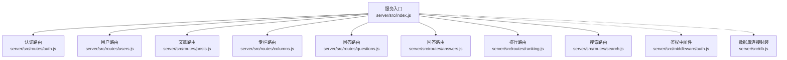
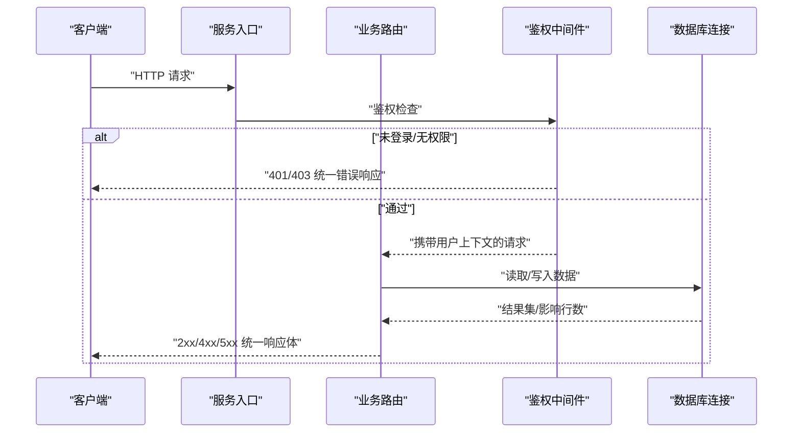
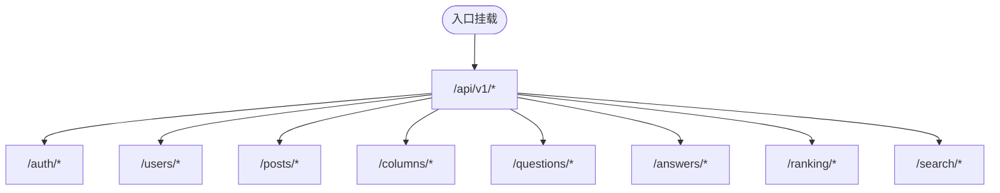
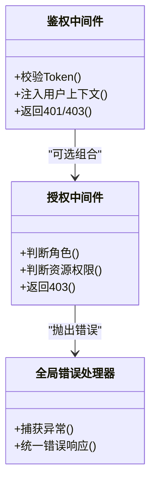
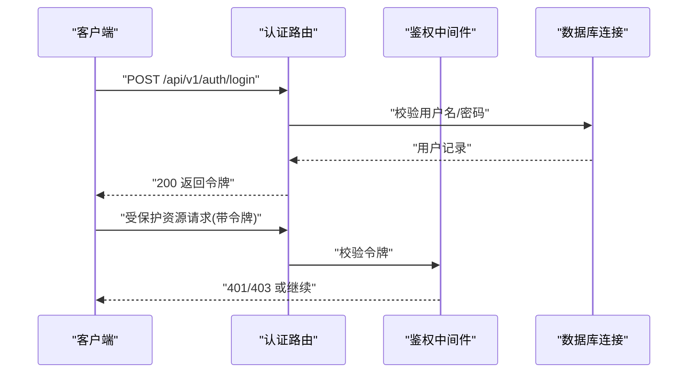
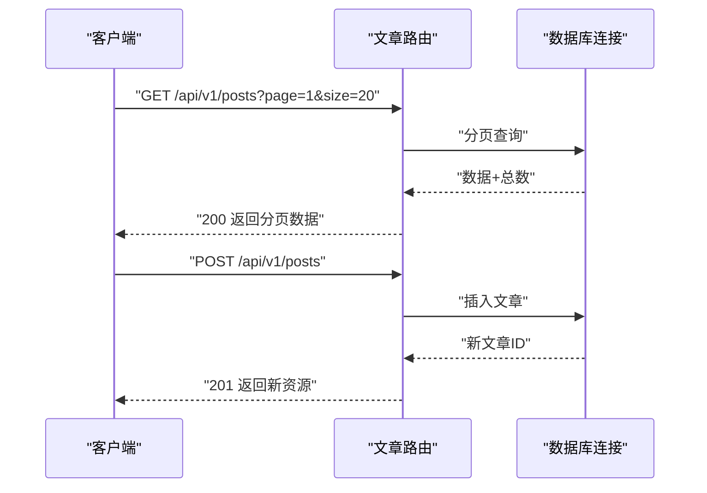
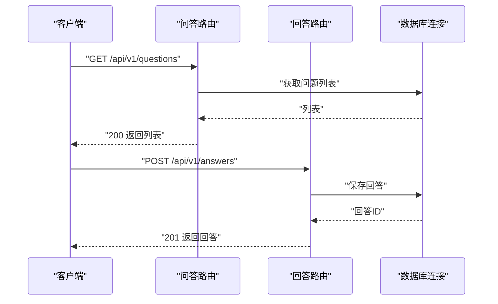
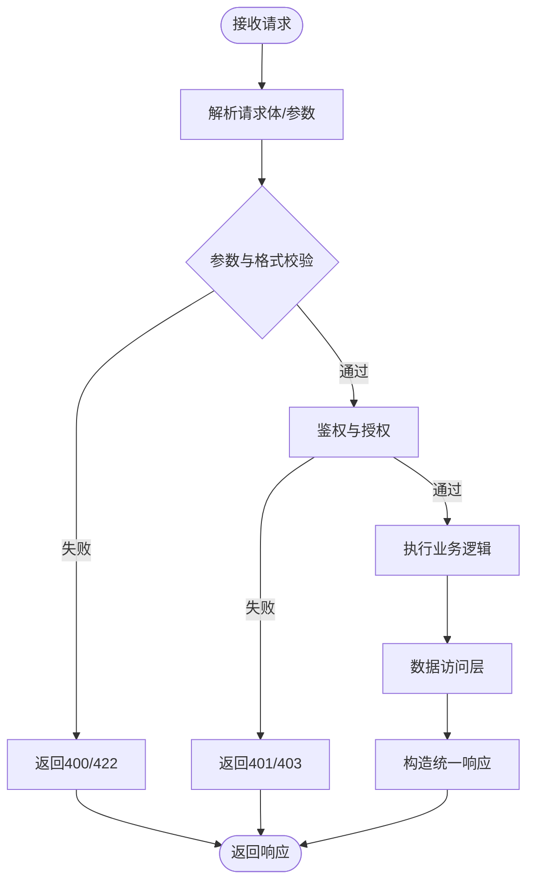
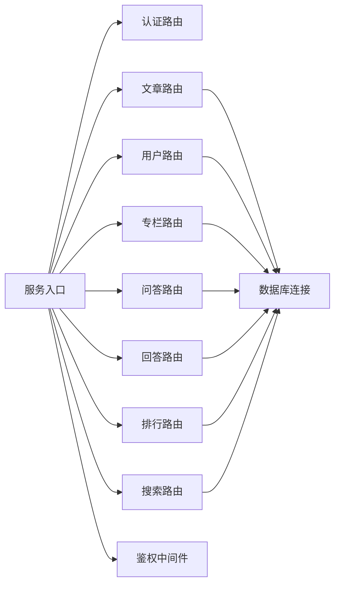

# API路由设计

<cite>
**本文引用的文件**   
- [server/src/index.js](file://server/src/index.js)
- [server/src/routes/auth.js](file://server/src/routes/auth.js)
- [server/src/routes/users.js](file://server/src/routes/users.js)
- [server/src/routes/posts.js](file://server/src/routes/posts.js)
- [server/src/routes/columns.js](file://server/src/routes/columns.js)
- [server/src/routes/questions.js](file://server/src/routes/questions.js)
- [server/src/routes/answers.js](file://server/src/routes/answers.js)
- [server/src/routes/ranking.js](file://server/src/routes/ranking.js)
- [server/src/routes/search.js](file://server/src/routes/search.js)
- [server/src/middleware/auth.js](file://server/src/middleware/auth.js)
- [server/src/db.js](file://server/src/db.js)
- [API.md](file://API.md)
</cite>

## 目录
1. [简介](#简介)
2. [项目结构](#项目结构)
3. [核心组件](#核心组件)
4. [架构总览](#架构总览)
5. [详细组件分析](#详细组件分析)
6. [依赖关系分析](#依赖关系分析)
7. [性能考虑](#性能考虑)
8. [故障排查指南](#故障排查指南)
9. [结论](#结论)
10. [附录](#附录)

## 简介
本文件聚焦于后端RESTful API的路由设计与实现，围绕URL命名约定、HTTP方法使用、状态码规范、模块化路由组织、参数与请求体验证、统一响应格式、版本控制策略、中间件组合与自定义、最佳实践与性能优化、测试与文档生成等方面展开。目标是帮助开发者快速理解并遵循该项目的API设计规范，提升可维护性与可扩展性。

## 项目结构
后端采用Express风格的服务入口与按业务域划分的路由模块：
- 服务入口负责注册全局中间件、挂载各业务路由、启动监听端口。
- 路由模块按领域拆分（认证、用户、文章、专栏、问答、排行、搜索），每个模块暴露独立的Router实例并在入口集中挂载。
- 中间件位于独立目录，提供鉴权等通用能力，供路由按需组合使用。
- 数据访问层通过数据库连接封装，供路由或业务逻辑调用。

图示来源
- [server/src/index.js](file://server/src/index.js)
- [server/src/routes/auth.js](file://server/src/routes/auth.js)
- [server/src/routes/users.js](file://server/src/routes/users.js)
- [server/src/routes/posts.js](file://server/src/routes/posts.js)
- [server/src/routes/columns.js](file://server/src/routes/columns.js)
- [server/src/routes/questions.js](file://server/src/routes/questions.js)
- [server/src/routes/answers.js](file://server/src/routes/answers.js)
- [server/src/routes/ranking.js](file://server/src/routes/ranking.js)
- [server/src/routes/search.js](file://server/src/routes/search.js)
- [server/src/middleware/auth.js](file://server/src/middleware/auth.js)
- [server/src/db.js](file://server/src/db.js)

章节来源
- [server/src/index.js](file://server/src/index.js)

## 核心组件
- 服务入口
  - 职责：加载配置、注册全局中间件（如JSON解析、CORS、日志等）、挂载各业务路由、统一错误处理、启动HTTP服务。
  - 关键点：路由前缀与版本化路径的集中管理；全局异常捕获与统一响应包装。
- 路由模块
  - 职责：定义资源级REST接口，处理请求参数校验、调用业务逻辑、返回统一响应。
  - 关键点：按资源名词复数形式组织URL；严格区分GET/POST/PUT/PATCH/DELETE语义；对敏感操作启用鉴权中间件。
- 鉴权中间件
  - 职责：校验Token/Session、注入当前用户上下文、权限判定。
  - 关键点：失败时返回标准401/403；成功时将用户信息挂载到请求对象供后续处理器使用。
- 数据访问层
  - 职责：封装数据库连接、事务、查询构建与结果映射。
  - 关键点：为路由提供稳定、幂等的CRUD能力；对SQL执行进行错误归一化。

章节来源
- [server/src/index.js](file://server/src/index.js)
- [server/src/middleware/auth.js](file://server/src/middleware/auth.js)
- [server/src/db.js](file://server/src/db.js)

## 架构总览
下图展示了从客户端请求到路由处理、中间件校验、数据访问与统一响应的完整流程。

图示来源
- [server/src/index.js](file://server/src/index.js)
- [server/src/middleware/auth.js](file://server/src/middleware/auth.js)
- [server/src/db.js](file://server/src/db.js)

## 详细组件分析

### RESTful URL命名与HTTP方法规范
- URL命名约定
  - 使用小写英文单词与连字符分隔，资源名使用复数名词，例如“posts”、“users”、“columns”。
  - 层级关系通过路径表达，如“/api/v1/posts/:id/comments”。
  - 查询参数用于过滤、排序、分页，如“?page=1&size=20&sort=-createdAt”。
- HTTP方法使用
  - GET：安全且幂等，仅用于读取资源。
  - POST：创建资源或触发非幂等操作。
  - PUT：全量更新资源，要求幂等。
  - PATCH：部分更新资源，要求幂等。
  - DELETE：删除资源，要求幂等。
- 状态码规范
  - 2xx：成功（200/201/204）。
  - 4xx：客户端错误（400参数错误、401未认证、403无权限、404不存在、422验证失败）。
  - 5xx：服务端错误（500内部错误、503服务不可用）。

章节来源
- [server/src/routes/posts.js](file://server/src/routes/posts.js)
- [server/src/routes/users.js](file://server/src/routes/users.js)
- [server/src/routes/columns.js](file://server/src/routes/columns.js)
- [server/src/routes/questions.js](file://server/src/routes/questions.js)
- [server/src/routes/answers.js](file://server/src/routes/answers.js)
- [server/src/routes/ranking.js](file://server/src/routes/ranking.js)
- [server/src/routes/search.js](file://server/src/routes/search.js)

### 模块化路由组织方式
- 按业务域拆分路由文件，便于独立演进与维护。
- 在入口集中挂载路由，支持统一前缀与版本化路径。
- 路由内再按子资源细分，保持单一职责。

图示来源
- [server/src/index.js](file://server/src/index.js)
- [server/src/routes/auth.js](file://server/src/routes/auth.js)
- [server/src/routes/users.js](file://server/src/routes/users.js)
- [server/src/routes/posts.js](file://server/src/routes/posts.js)
- [server/src/routes/columns.js](file://server/src/routes/columns.js)
- [server/src/routes/questions.js](file://server/src/routes/questions.js)
- [server/src/routes/answers.js](file://server/src/routes/answers.js)
- [server/src/routes/ranking.js](file://server/src/routes/ranking.js)
- [server/src/routes/search.js](file://server/src/routes/search.js)

章节来源
- [server/src/index.js](file://server/src/index.js)

### 路由参数处理与请求体验证
- 参数来源
  - 路径参数：/:id、/:slug等，需做类型转换与存在性校验。
  - 查询参数：分页、过滤、排序，需做范围与枚举校验。
  - 请求体：JSON表单字段，需做必填、长度、格式、白名单校验。
- 验证策略
  - 分层校验：基础类型与格式校验优先，业务规则校验在后。
  - 错误聚合：将多条校验错误汇总返回，便于前端一次性修复。
  - 输入清洗：去除空白、转义特殊字符、限制大小写。
- 典型场景
  - 分页：page>=1、size在合理区间、默认值兜底。
  - 排序：限定允许字段与方向，防止注入。
  - 文件上传：类型、大小、白名单校验。

章节来源
- [server/src/routes/posts.js](file://server/src/routes/posts.js)
- [server/src/routes/users.js](file://server/src/routes/users.js)
- [server/src/routes/columns.js](file://server/src/routes/columns.js)
- [server/src/routes/questions.js](file://server/src/routes/questions.js)
- [server/src/routes/answers.js](file://server/src/routes/answers.js)
- [server/src/routes/search.js](file://server/src/routes/search.js)

### 统一响应格式设计
- 成功响应
  - 结构包含：状态码、消息提示、数据体、时间戳。
  - 列表数据包含：总数、页码、每页数量、数据数组。
- 错误响应
  - 结构包含：错误码、错误消息、可选的错误详情（字段级错误）。
  - 针对401/403/404/422等常见错误给出明确语义。
- 分页数据结构
  - 字段建议：total、page、size、pages、items。
  - 边界条件：空集合返回空数组而非null；越界page自动修正或返回空。

章节来源
- [server/src/routes/posts.js](file://server/src/routes/posts.js)
- [server/src/routes/users.js](file://server/src/routes/users.js)
- [server/src/routes/columns.js](file://server/src/routes/columns.js)
- [server/src/routes/questions.js](file://server/src/routes/questions.js)
- [server/src/routes/answers.js](file://server/src/routes/answers.js)
- [server/src/routes/ranking.js](file://server/src/routes/ranking.js)
- [server/src/routes/search.js](file://server/src/routes/search.js)

### API版本控制策略与向后兼容
- 版本化方案
  - URL前缀版本化：/api/v1、/api/v2，便于并行演进与灰度发布。
  - 头部协商：Accept-Version（可选）作为补充策略。
- 兼容性原则
  - 新增字段为非破坏性变更，旧客户端忽略未知字段。
  - 废弃字段保留一段时间并提供弃用告警。
  - 破坏性变更必须升级主版本号，并通过迁移指南说明。

章节来源
- [server/src/index.js](file://server/src/index.js)

### 路由中间件的组合与自定义
- 内置中间件
  - JSON解析、CORS、速率限制、请求日志、压缩等。
- 鉴权中间件
  - 校验Token/Session，失败返回401/403；成功则注入用户上下文。
- 授权中间件
  - 基于角色或资源的细粒度权限控制。
- 自定义中间件开发要点
  - 单一职责、可插拔、可测试；避免副作用；错误向上抛出并由全局错误处理器统一处理。

图示来源
- [server/src/middleware/auth.js](file://server/src/middleware/auth.js)
- [server/src/index.js](file://server/src/index.js)

章节来源
- [server/src/middleware/auth.js](file://server/src/middleware/auth.js)
- [server/src/index.js](file://server/src/index.js)

### 关键路由示例与调用序列

#### 认证流程

图示来源
- [server/src/routes/auth.js](file://server/src/routes/auth.js)
- [server/src/middleware/auth.js](file://server/src/middleware/auth.js)
- [server/src/db.js](file://server/src/db.js)

章节来源
- [server/src/routes/auth.js](file://server/src/routes/auth.js)
- [server/src/middleware/auth.js](file://server/src/middleware/auth.js)

#### 文章CRUD与分页

图示来源
- [server/src/routes/posts.js](file://server/src/routes/posts.js)
- [server/src/db.js](file://server/src/db.js)

章节来源
- [server/src/routes/posts.js](file://server/src/routes/posts.js)

#### 问答与回答

图示来源
- [server/src/routes/questions.js](file://server/src/routes/questions.js)
- [server/src/routes/answers.js](file://server/src/routes/answers.js)
- [server/src/db.js](file://server/src/db.js)

章节来源
- [server/src/routes/questions.js](file://server/src/routes/questions.js)
- [server/src/routes/answers.js](file://server/src/routes/answers.js)

### 概念性概览
以下流程图展示通用的请求处理生命周期，适用于所有路由模块。

[此图为概念性流程，不直接对应具体源码文件]

## 依赖关系分析
- 入口依赖各路由模块与中间件，形成松耦合的组合式架构。
- 路由模块依赖数据访问层，避免直接操作数据库细节。
- 鉴权中间件被多个受保护路由复用，减少重复代码。

图示来源
- [server/src/index.js](file://server/src/index.js)
- [server/src/routes/auth.js](file://server/src/routes/auth.js)
- [server/src/routes/users.js](file://server/src/routes/users.js)
- [server/src/routes/posts.js](file://server/src/routes/posts.js)
- [server/src/routes/columns.js](file://server/src/routes/columns.js)
- [server/src/routes/questions.js](file://server/src/routes/questions.js)
- [server/src/routes/answers.js](file://server/src/routes/answers.js)
- [server/src/routes/ranking.js](file://server/src/routes/ranking.js)
- [server/src/routes/search.js](file://server/src/routes/search.js)
- [server/src/db.js](file://server/src/db.js)

章节来源
- [server/src/index.js](file://server/src/index.js)

## 性能考虑
- 分页与限流
  - 强制分页与上限限制，避免大结果集拖垮服务。
  - 对高频接口实施速率限制，保护后端资源。
- 缓存策略
  - 读多写少接口使用缓存（内存/Redis），设置合理的TTL与失效策略。
  - 热点数据二级缓存，降低数据库压力。
- 数据库优化
  - 合理使用索引，避免N+1查询，批量操作代替循环单条。
  - 只选择必要字段，减少网络传输体积。
- 序列化与压缩
  - 启用Gzip/Brotli压缩，减少带宽占用。
  - 避免过度嵌套的响应结构，扁平化数据以提升解析效率。

[本节为通用指导，不直接分析具体文件]

## 故障排查指南
- 常见问题定位
  - 401/403：检查鉴权中间件是否生效、Token是否过期、权限是否足够。
  - 400/422：核对请求体结构与校验规则，关注字段类型与必填项。
  - 404：确认资源是否存在、路径是否正确、软删除逻辑是否导致隐藏。
  - 500：查看服务端日志与堆栈，定位数据库错误或未捕获异常。
- 日志与追踪
  - 记录请求ID、耗时、关键步骤日志，便于链路追踪。
  - 对慢查询与异常进行告警与采样。
- 错误归一化
  - 统一错误响应结构，包含错误码与可读消息。
  - 对外屏蔽敏感信息，对内保留详细上下文。

章节来源
- [server/src/middleware/auth.js](file://server/src/middleware/auth.js)
- [server/src/index.js](file://server/src/index.js)

## 结论
本项目采用清晰的模块化路由组织与统一的响应格式，结合鉴权中间件与数据访问封装，形成了高内聚、低耦合的后端API体系。通过严格的RESTful规范、版本化策略与完善的错误处理，提升了系统的可维护性与扩展性。建议在后续迭代中持续完善参数校验、缓存与监控指标，进一步提升稳定性与性能。

[本节为总结性内容，不直接分析具体文件]

## 附录
- API文档参考
  - 项目根目录下的API文档可作为接口清单与使用说明的权威来源。
- 测试与文档生成建议
  - 使用自动化测试框架覆盖核心接口，包括正常路径与异常分支。
  - 基于OpenAPI/Swagger生成在线文档，确保与实现同步。
  - 引入契约测试，保障前后端协作一致性。

章节来源
- [API.md](file://API.md)