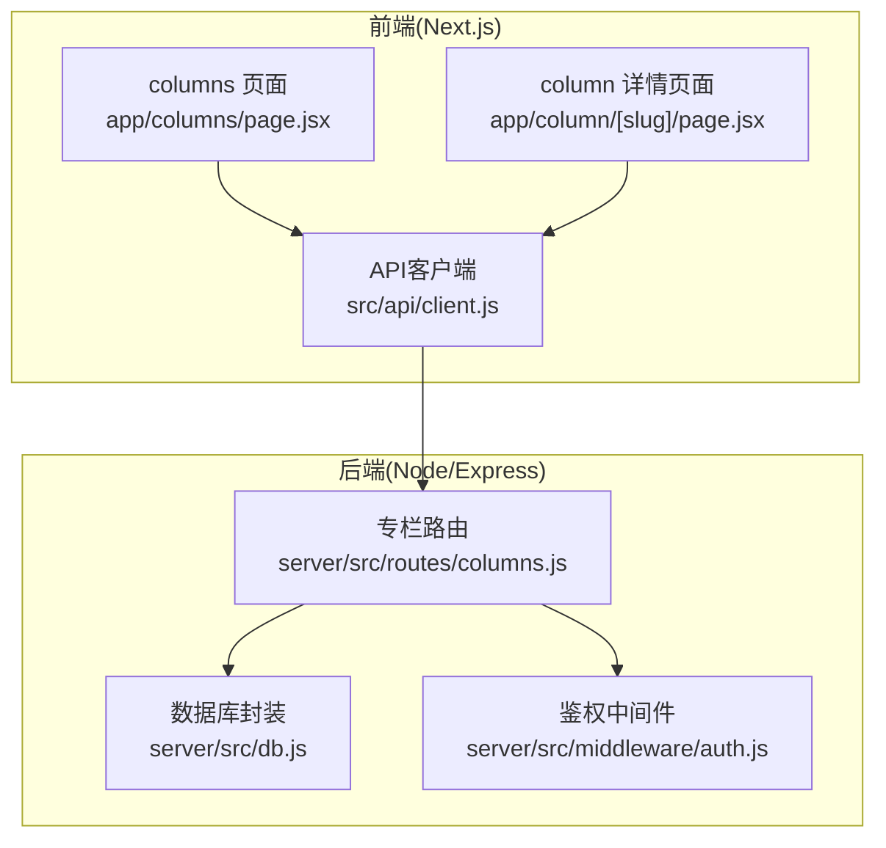
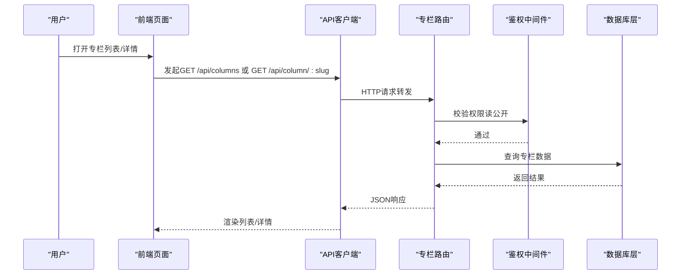
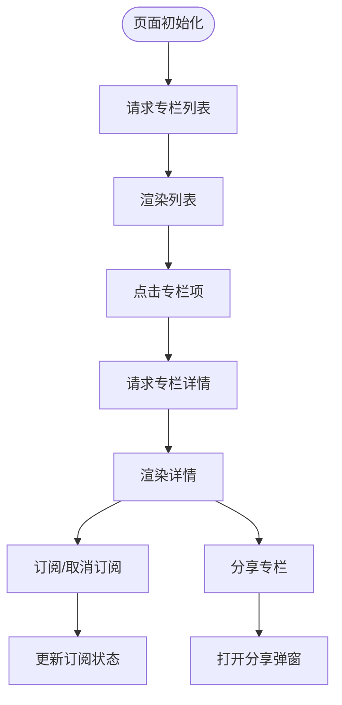
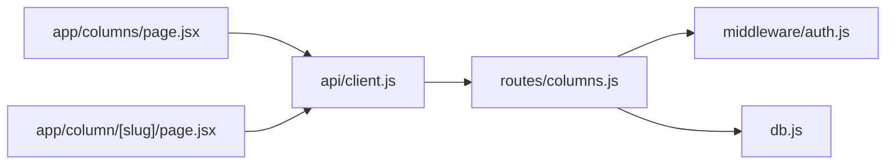

# 专栏管理API

<cite>
**本文引用的文件**   
- [server/src/routes/columns.js](file://server/src/routes/columns.js)
- [server/src/db.js](file://server/src/db.js)
- [server/src/middleware/auth.js](file://server/src/middleware/auth.js)
- [src/app/column/[slug]/page.jsx](file://src/app/column/[slug]/page.jsx)
- [src/app/columns/page.jsx](file://src/app/columns/page.jsx)
- [src/api/client.js](file://src/api/client.js)
- [server/package.json](file://server/package.json)
</cite>

## 目录
1. [简介](#简介)
2. [项目结构](#项目结构)
3. [核心组件](#核心组件)
4. [架构总览](#架构总览)
5. [详细组件分析](#详细组件分析)
6. [依赖关系分析](#依赖关系分析)
7. [性能考虑](#性能考虑)
8. [故障排查指南](#故障排查指南)
9. [结论](#结论)
10. [附录](#附录)

## 简介
本文件面向“专栏管理”的后端与前端集成，提供完整的RESTful API文档与实践指导。内容覆盖：
- 专栏的创建、编辑、删除、获取列表与详情接口
- 专栏与文章的关联关系、分类体系与标签管理
- 权限控制、订阅机制与分享功能
- 内容组织方式、目录结构与导航生成
- SEO优化、静态资源管理与缓存策略
- 完整API调用示例、数据流转图与最佳实践

## 项目结构
后端采用Express路由分层，专栏相关逻辑集中在 routes/columns.js；数据库访问通过 db.js 封装；鉴权中间件位于 middleware/auth.js。前端Next.js应用通过 src/api/client.js 统一发起HTTP请求，并在 app/columns 与 app/column/[slug] 页面消费专栏数据。

图表来源
- [server/src/routes/columns.js](file://server/src/routes/columns.js)
- [server/src/db.js](file://server/src/db.js)
- [server/src/middleware/auth.js](file://server/src/middleware/auth.js)
- [src/app/column/[slug]/page.jsx](file://src/app/column/[slug]/page.jsx)
- [src/app/columns/page.jsx](file://src/app/columns/page.jsx)
- [src/api/client.js](file://src/api/client.js)

章节来源
- [server/src/routes/columns.js](file://server/src/routes/columns.js)
- [server/src/db.js](file://server/src/db.js)
- [server/src/middleware/auth.js](file://server/src/middleware/auth.js)
- [src/app/column/[slug]/page.jsx](file://src/app/column/[slug]/page.jsx)
- [src/app/columns/page.jsx](file://src/app/columns/page.jsx)
- [src/api/client.js](file://src/api/client.js)

## 核心组件
- 专栏路由层：定义所有专栏相关的REST接口，处理参数校验、权限检查、业务编排与响应格式。
- 数据库层：封装SQL执行、事务、连接池等能力，为上层提供稳定一致的CRUD操作。
- 鉴权中间件：基于Token或会话进行身份识别与权限判定，保护写操作与管理操作。
- 前端API客户端：统一封装请求头、错误处理、重试与缓存策略，供各页面调用。
- 前端页面：专栏列表页与专栏详情页负责渲染与交互，并驱动API调用。

章节来源
- [server/src/routes/columns.js](file://server/src/routes/columns.js)
- [server/src/db.js](file://server/src/db.js)
- [server/src/middleware/auth.js](file://server/src/middleware/auth.js)
- [src/api/client.js](file://src/api/client.js)
- [src/app/columns/page.jsx](file://src/app/columns/page.jsx)
- [src/app/column/[slug]/page.jsx](file://src/app/column/[slug]/page.jsx)

## 架构总览
整体采用前后端分离架构：前端通过统一的API客户端向后端发起REST请求，后端在路由层完成鉴权与业务编排，最终通过数据库层持久化数据。

图表来源
- [server/src/routes/columns.js](file://server/src/routes/columns.js)
- [server/src/middleware/auth.js](file://server/src/middleware/auth.js)
- [server/src/db.js](file://server/src/db.js)
- [src/app/columns/page.jsx](file://src/app/columns/page.jsx)
- [src/app/column/[slug]/page.jsx](file://src/app/column/[slug]/page.jsx)
- [src/api/client.js](file://src/api/client.js)

## 详细组件分析

### 专栏API设计
以下列出专栏管理的核心REST接口。实际字段以服务端实现为准，此处给出通用约定与示例。

- 获取专栏列表
  - 方法: GET
  - 路径: /api/columns
  - 查询参数: page, size, category, tag, keyword, sort
  - 成功响应: { code, data: { items, total, page, size } }
  - 失败响应: { code, message }

- 获取专栏详情
  - 方法: GET
  - 路径: /api/column/:slug
  - 成功响应: { code, data: { id, slug, title, description, cover, category, tags, author, stats, createdAt, updatedAt } }
  - 失败响应: { code, message }

- 创建专栏（需管理员或作者权限）
  - 方法: POST
  - 路径: /api/columns
  - 请求体: { title, description, cover, category, tags, status }
  - 成功响应: { code, data: { id, slug, ... } }
  - 失败响应: { code, message }

- 更新专栏（需作者或管理员权限）
  - 方法: PUT
  - 路径: /api/columns/:id
  - 请求体: { title?, description?, cover?, category?, tags?, status? }
  - 成功响应: { code, data: { id, slug, ... } }
  - 失败响应: { code, message }

- 删除专栏（需管理员权限）
  - 方法: DELETE
  - 路径: /api/columns/:id
  - 成功响应: { code, data: { success: true } }
  - 失败响应: { code, message }

- 订阅/取消订阅专栏
  - 方法: POST /api/columns/:id/subscribe
  - 方法: DELETE /api/columns/:id/subscribe
  - 成功响应: { code, data: { subscribed: boolean } }
  - 失败响应: { code, message }

- 分享专栏（生成分享链接或二维码信息）
  - 方法: GET /api/columns/:id/share
  - 成功响应: { code, data: { shareUrl, qrCodeData } }
  - 失败响应: { code, message }

- 获取专栏文章列表
  - 方法: GET /api/columns/:id/posts
  - 查询参数: page, size, status
  - 成功响应: { code, data: { items, total } }
  - 失败响应: { code, message }

- 获取专栏分类列表
  - 方法: GET /api/columns/categories
  - 成功响应: { code, data: { categories: [{ id, name, count }] } }
  - 失败响应: { code, message }

- 获取专栏标签列表
  - 方法: GET /api/columns/tags
  - 成功响应: { code, data: { tags: [{ id, name, count }] } }
  - 失败响应: { code, message }

章节来源
- [server/src/routes/columns.js](file://server/src/routes/columns.js)

### 专栏与文章关联关系
- 一对多关系：一个专栏包含多篇专栏文章，文章通过外键或关联表指向所属专栏。
- 状态同步：专栏状态变更时，可级联影响其下文章可见性（如专栏下架则隐藏文章）。
- 排序与置顶：支持专栏内文章排序字段与置顶标记。

章节来源
- [server/src/routes/columns.js](file://server/src/routes/columns.js)
- [server/src/db.js](file://server/src/db.js)

### 专栏分类体系与标签管理
- 分类：用于对专栏进行粗粒度组织，支持层级或扁平结构，按名称去重统计数量。
- 标签：细粒度描述专栏主题，支持多标签组合检索与聚合统计。
- 一致性：新增分类/标签时需保证幂等与唯一性约束。

章节来源
- [server/src/routes/columns.js](file://server/src/routes/columns.js)
- [server/src/db.js](file://server/src/db.js)

### 权限控制
- 读权限：公开专栏无需登录；私有专栏仅订阅者或作者可见。
- 写权限：创建/更新/删除需要作者或管理员角色。
- 鉴权流程：由鉴权中间件解析Token/会话，注入当前用户上下文至路由处理器。

章节来源
- [server/src/middleware/auth.js](file://server/src/middleware/auth.js)
- [server/src/routes/columns.js](file://server/src/routes/columns.js)

### 订阅机制
- 订阅：用户关注专栏后，可在个人中心查看订阅列表，并可接收更新通知（可选）。
- 取消订阅：解除关注关系，不再推送更新。
- 防抖与幂等：重复订阅应返回已订阅状态而非报错。

章节来源
- [server/src/routes/columns.js](file://server/src/routes/columns.js)

### 分享功能
- 分享链接：基于专栏slug生成短链或带参数的长链，便于社交传播。
- 二维码：返回二维码数据或图片URL，方便移动端扫码访问。
- 访问统计：记录分享点击次数与来源渠道（可选）。

章节来源
- [server/src/routes/columns.js](file://server/src/routes/columns.js)

### 内容组织、目录结构与导航生成
- 目录结构：建议按功能域划分，如 routes、services、models、middleware、utils。
- 导航生成：根据分类与标签聚合数据，构建侧边栏与面包屑导航。
- 分页与筛选：列表接口支持分页、关键词搜索、分类过滤与标签过滤。

章节来源
- [server/src/routes/columns.js](file://server/src/routes/columns.js)
- [src/app/columns/page.jsx](file://src/app/columns/page.jsx)
- [src/app/column/[slug]/page.jsx](file://src/app/column/[slug]/page.jsx)

### SEO优化、静态资源管理与缓存策略
- SEO：为专栏详情页提供meta标题、描述、OpenGraph与结构化数据（JSON-LD）。
- 静态资源：封面图、图标等资源放置于public目录，使用CDN加速与版本化命名。
- 缓存：
  - 浏览器缓存：为静态资源设置长期缓存与强缓存策略。
  - CDN缓存：对列表与详情接口启用ETag/Last-Modified。
  - 服务端缓存：热点数据使用内存缓存或Redis，降低数据库压力。

章节来源
- [server/src/routes/columns.js](file://server/src/routes/columns.js)
- [server/package.json](file://server/package.json)

### 前端集成与数据流
- API客户端：统一封装基础URL、请求拦截器、错误码映射与重试策略。
- 页面消费：
  - 专栏列表页：分页加载、筛选条件联动、骨架屏与错误提示。
  - 专栏详情页：按需加载文章列表、订阅按钮状态同步、分享弹窗。

图表来源
- [src/app/columns/page.jsx](file://src/app/columns/page.jsx)
- [src/app/column/[slug]/page.jsx](file://src/app/column/[slug]/page.jsx)
- [src/api/client.js](file://src/api/client.js)

章节来源
- [src/app/columns/page.jsx](file://src/app/columns/page.jsx)
- [src/app/column/[slug]/page.jsx](file://src/app/column/[slug]/page.jsx)
- [src/api/client.js](file://src/api/client.js)

## 依赖关系分析
- 模块耦合：
  - 路由层依赖鉴权中间件与数据库层，职责清晰、耦合度低。
  - 前端API客户端与页面解耦，便于替换网络库或增加拦截器。
- 外部依赖：
  - Express框架、数据库驱动、鉴权库（如JWT）、缓存库（如Redis）。
- 潜在循环依赖：
  - 避免在db.js中引入routes或middleware，保持单向依赖。

图表来源
- [server/src/routes/columns.js](file://server/src/routes/columns.js)
- [server/src/middleware/auth.js](file://server/src/middleware/auth.js)
- [server/src/db.js](file://server/src/db.js)
- [src/api/client.js](file://src/api/client.js)
- [src/app/columns/page.jsx](file://src/app/columns/page.jsx)
- [src/app/column/[slug]/page.jsx](file://src/app/column/[slug]/page.jsx)

章节来源
- [server/src/routes/columns.js](file://server/src/routes/columns.js)
- [server/src/middleware/auth.js](file://server/src/middleware/auth.js)
- [server/src/db.js](file://server/src/db.js)
- [src/api/client.js](file://src/api/client.js)
- [src/app/columns/page.jsx](file://src/app/columns/page.jsx)
- [src/app/column/[slug]/page.jsx](file://src/app/column/[slug]/page.jsx)

## 性能考虑
- 数据库：
  - 为常用查询字段建立索引（slug、category、status、createdAt）。
  - 使用分页与只读副本提升读取性能。
- 缓存：
  - 列表与详情接口启用ETag/Last-Modified，减少带宽与计算开销。
  - 热点专栏数据加入内存缓存或Redis，TTL合理配置。
- 前端：
  - 列表懒加载与虚拟滚动，减少首屏渲染压力。
  - 图片懒加载与WebP格式，结合CDN压缩。
- 并发：
  - 连接池大小与超时时间调优，避免雪崩。

[本节为通用性能建议，不直接分析具体文件]

## 故障排查指南
- 鉴权失败：
  - 检查Token是否过期、签名是否正确、中间件是否生效。
- 数据不一致：
  - 核对事务边界与回滚逻辑，确保写入原子性。
- 性能问题：
  - 定位慢查询，补充索引；检查缓存命中率与TTL。
- 前端错误：
  - 统一错误码映射，打印请求ID与堆栈，便于追踪。

章节来源
- [server/src/middleware/auth.js](file://server/src/middleware/auth.js)
- [server/src/routes/columns.js](file://server/src/routes/columns.js)
- [server/src/db.js](file://server/src/db.js)

## 结论
本专栏管理API遵循RESTful规范，围绕“读公开、写受控”的原则设计，配合分类与标签体系、订阅与分享能力，形成完整的内容运营闭环。通过合理的缓存与SEO策略，兼顾性能与可发现性。建议在后续迭代中完善审计日志、灰度发布与监控告警，进一步提升系统稳定性与可观测性。

[本节为总结性内容，不直接分析具体文件]

## 附录

### API调用示例（文字版）
- 获取专栏列表
  - 请求: GET /api/columns?page=1&size=20&category=技术&tag=前端
  - 响应: { code: 0, data: { items: [...], total: 120, page: 1, size: 20 } }
- 获取专栏详情
  - 请求: GET /api/column/my-first-column
  - 响应: { code: 0, data: { id, slug, title, description, cover, category, tags, author, stats, createdAt, updatedAt } }
- 创建专栏（需权限）
  - 请求: POST /api/columns
  - 请求体: { title: "新专栏", description: "介绍...", category: "技术", tags: ["前端"], status: "published" }
  - 响应: { code: 0, data: { id, slug, ... } }
- 更新专栏（需权限）
  - 请求: PUT /api/columns/:id
  - 请求体: { title: "更新后的标题", status: "draft" }
  - 响应: { code: 0, data: { id, slug, ... } }
- 删除专栏（需管理员）
  - 请求: DELETE /api/columns/:id
  - 响应: { code: 0, data: { success: true } }
- 订阅专栏
  - 请求: POST /api/columns/:id/subscribe
  - 响应: { code: 0, data: { subscribed: true } }
- 取消订阅
  - 请求: DELETE /api/columns/:id/subscribe
  - 响应: { code: 0, data: { subscribed: false } }
- 分享专栏
  - 请求: GET /api/columns/:id/share
  - 响应: { code: 0, data: { shareUrl, qrCodeData } }
- 获取专栏文章列表
  - 请求: GET /api/columns/:id/posts?page=1&size=10&status=published
  - 响应: { code: 0, data: { items: [...], total: 50 } }
- 获取分类列表
  - 请求: GET /api/columns/categories
  - 响应: { code: 0, data: { categories: [{ id, name, count }] } }
- 获取标签列表
  - 请求: GET /api/columns/tags
  - 响应: { code: 0, data: { tags: [{ id, name, count }] } }

[本节为通用示例，不直接分析具体文件]

### 最佳实践
- 接口设计：
  - 统一响应结构，明确code/message/data语义。
  - 严格参数校验与输入清洗，防止注入与越权。
- 数据安全：
  - 敏感字段脱敏输出，权限最小化原则。
  - 软删除与审计日志，便于恢复与追溯。
- 可维护性：
  - 路由与业务逻辑分层，单元测试覆盖关键路径。
  - 错误码字典与国际化文案集中管理。
- 可观测性：
  - 接入APM与日志采集，关键指标埋点（QPS、延迟、错误率）。

[本节为通用实践，不直接分析具体文件]