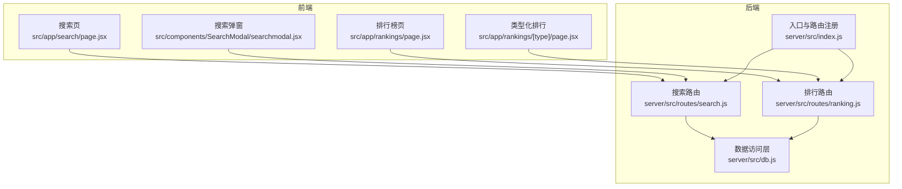
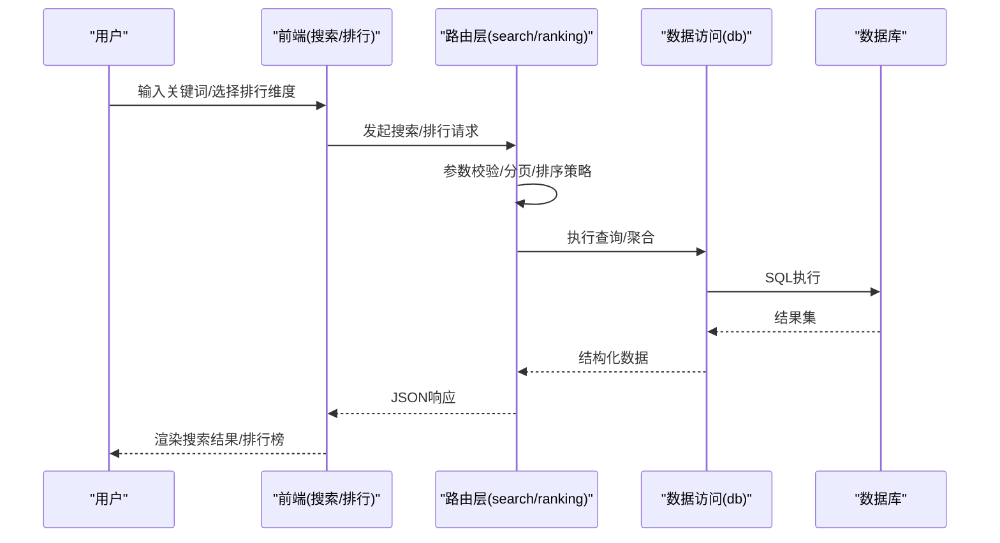
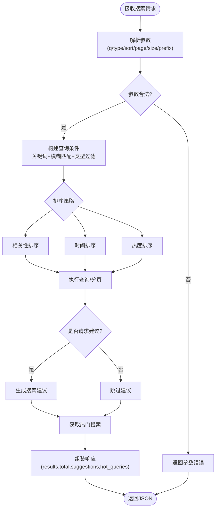
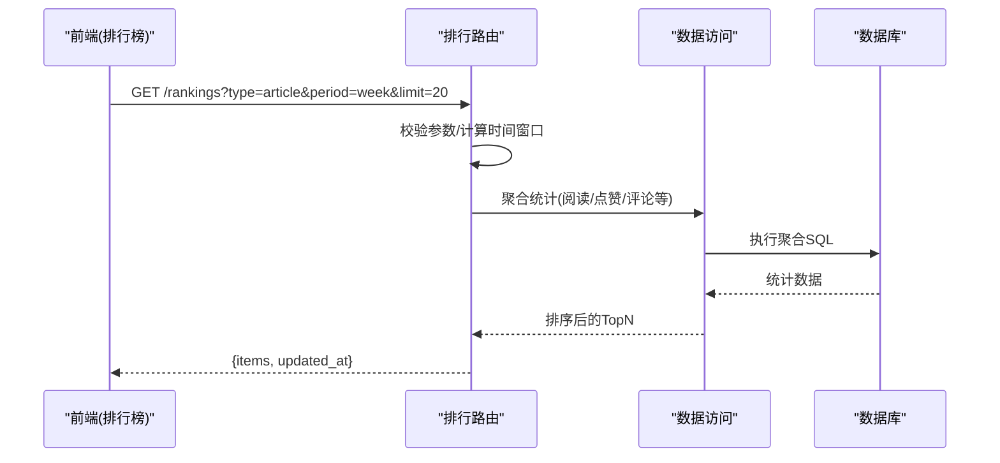
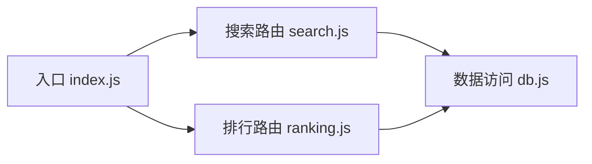

# 搜索与排行API

<cite>
**本文引用的文件**   
- [server/src/routes/search.js](file://server/src/routes/search.js)
- [server/src/routes/ranking.js](file://server/src/routes/ranking.js)
- [server/src/db.js](file://server/src/db.js)
- [server/src/index.js](file://server/src/index.js)
- [src/app/search/page.jsx](file://src/app/search/page.jsx)
- [src/components/SearchModal/searchmodal.jsx](file://src/components/SearchModal/searchmodal.jsx)
- [src/app/rankings/page.jsx](file://src/app/rankings/page.jsx)
- [src/app/rankings/[type]/page.jsx](file://src/app/rankings/[type]/page.jsx)
</cite>

## 目录
1. [简介](#简介)
2. [项目结构](#项目结构)
3. [核心组件](#核心组件)
4. [架构总览](#架构总览)
5. [详细组件分析](#详细组件分析)
6. [依赖分析](#依赖分析)
7. [性能考虑](#性能考虑)
8. [故障排查指南](#故障排查指南)
9. [结论](#结论)
10. [附录](#附录)

## 简介
本文件聚焦于“搜索与排行”相关API的设计与实现，覆盖全文搜索、模糊匹配、排序策略、排行榜算法（热门内容/用户/问答）、实时搜索与搜索建议、热门搜索、缓存与性能优化、负载均衡等主题。文档同时提供API调用示例、搜索语法说明与调优指南，帮助开发者快速集成并高效使用。

## 项目结构
后端采用Node.js服务，路由层按功能拆分，搜索与排行分别位于独立的路由文件中；数据库访问通过统一的数据源模块进行封装；前端Next.js应用包含搜索页、搜索弹窗以及排行榜页面。

图表来源
- [server/src/index.js](file://server/src/index.js)
- [server/src/routes/search.js](file://server/src/routes/search.js)
- [server/src/routes/ranking.js](file://server/src/routes/ranking.js)
- [server/src/db.js](file://server/src/db.js)
- [src/app/search/page.jsx](file://src/app/search/page.jsx)
- [src/components/SearchModal/searchmodal.jsx](file://src/components/SearchModal/searchmodal.jsx)
- [src/app/rankings/page.jsx](file://src/app/rankings/page.jsx)
- [src/app/rankings/[type]/page.jsx](file://src/app/rankings/[type]/page.jsx)

章节来源
- [server/src/index.js](file://server/src/index.js)
- [server/src/routes/search.js](file://server/src/routes/search.js)
- [server/src/routes/ranking.js](file://server/src/routes/ranking.js)
- [server/src/db.js](file://server/src/db.js)
- [src/app/search/page.jsx](file://src/app/search/page.jsx)
- [src/components/SearchModal/searchmodal.jsx](file://src/components/SearchModal/searchmodal.jsx)
- [src/app/rankings/page.jsx](file://src/app/rankings/page.jsx)
- [src/app/rankings/[type]/page.jsx](file://src/app/rankings/[type]/page.jsx)

## 核心组件
- 搜索路由：提供关键词检索、模糊匹配、分页、排序、搜索建议与热门搜索能力。
- 排行路由：提供多维度排行榜（文章、用户、问答）的聚合计算与返回。
- 数据访问层：封装数据库连接与查询执行，为上层路由提供稳定接口。
- 前端交互：搜索页与搜索弹窗负责发起请求与展示结果；排行榜页负责拉取并按维度渲染。

章节来源
- [server/src/routes/search.js](file://server/src/routes/search.js)
- [server/src/routes/ranking.js](file://server/src/routes/ranking.js)
- [server/src/db.js](file://server/src/db.js)
- [src/app/search/page.jsx](file://src/app/search/page.jsx)
- [src/components/SearchModal/searchmodal.jsx](file://src/components/SearchModal/searchmodal.jsx)
- [src/app/rankings/page.jsx](file://src/app/rankings/page.jsx)
- [src/app/rankings/[type]/page.jsx](file://src/app/rankings/[type]/page.jsx)

## 架构总览
搜索与排行系统遵循“前端UI -> 路由控制器 -> 数据访问层 -> 数据库”的分层架构。搜索路由负责解析查询参数、构建SQL或调用索引逻辑、执行排序与分页；排行路由负责聚合统计与排序输出。

图表来源
- [server/src/routes/search.js](file://server/src/routes/search.js)
- [server/src/routes/ranking.js](file://server/src/routes/ranking.js)
- [server/src/db.js](file://server/src/db.js)

## 详细组件分析

### 搜索API
- 功能范围
  - 关键词搜索：支持标题、正文等多字段检索。
  - 模糊匹配：基于通配符或前缀匹配提升容错性。
  - 排序：支持相关性、时间、热度等排序策略。
  - 分页：支持页码与每页条数控制。
  - 搜索建议：根据前缀返回候选词。
  - 热门搜索：返回近期高频搜索词。
- 典型请求参数
  - q: 关键词
  - type: 资源类型过滤（如文章/问答/用户）
  - sort: 排序策略（如 relevance/time/hot）
  - page, size: 分页参数
  - prefix: 用于搜索建议的前缀
- 响应结构
  - results: 结果列表
  - total: 总数
  - suggestions: 搜索建议
  - hot_queries: 热门搜索词
- 错误处理
  - 参数缺失/非法时返回明确错误信息
  - 数据库异常时返回通用错误码与提示

图表来源
- [server/src/routes/search.js](file://server/src/routes/search.js)
- [server/src/db.js](file://server/src/db.js)

章节来源
- [server/src/routes/search.js](file://server/src/routes/search.js)
- [server/src/db.js](file://server/src/db.js)

### 排行API
- 维度定义
  - 热门文章：按阅读量、点赞数、评论数等指标加权计算。
  - 热门用户：按关注数、发布数量、互动量等综合评分。
  - 热门问答：按回答数、采纳数、投票得分等排序。
- 典型请求参数
  - type: 排行维度（如 article/user/question）
  - period: 时间窗口（如 day/week/month/all）
  - limit: 返回条数
- 响应结构
  - items: 排行条目列表（含ID、名称、分数等）
  - updated_at: 最近更新时间
- 更新策略
  - 定时任务或事件触发更新热点计数
  - 增量更新与全量重建结合，保障时效性与一致性

图表来源
- [server/src/routes/ranking.js](file://server/src/routes/ranking.js)
- [server/src/db.js](file://server/src/db.js)

章节来源
- [server/src/routes/ranking.js](file://server/src/routes/ranking.js)
- [server/src/db.js](file://server/src/db.js)

### 搜索引擎实现原理
- 索引构建策略
  - 文本分词：对标题与正文进行分词，建立倒排索引（可基于数据库全文索引或外部搜索引擎）。
  - 增量更新：内容变更时仅更新受影响词条，降低重建成本。
  - 去噪与停用词：过滤无意义词汇，提升召回质量。
- 查询优化技术
  - 前缀匹配与模糊匹配：利用LIKE或全文索引的匹配模式。
  - 多字段权重：标题权重高于正文，提高相关性。
  - 预聚合与缓存：对热门搜索与常用过滤条件进行缓存。
- 实时搜索
  - 基于事件驱动的索引更新，保证近实时可见性。
  - 前端防抖与节流，减少重复请求。

章节来源
- [server/src/routes/search.js](file://server/src/routes/search.js)
- [server/src/db.js](file://server/src/db.js)

### 搜索建议与热门搜索
- 搜索建议
  - 基于前缀匹配与历史搜索频次，返回TopN候选词。
  - 支持按类型过滤（如仅文章/问答）。
- 热门搜索
  - 统计最近N小时/天的搜索词频次，返回TopN。
  - 定期清理过期热词，避免内存膨胀。

章节来源
- [server/src/routes/search.js](file://server/src/routes/search.js)

### 前端集成要点
- 搜索页
  - 提交关键词后调用搜索API，展示分页结果与排序选项。
- 搜索弹窗
  - 监听输入变化，触发搜索建议；点击建议项直接跳转。
- 排行榜页
  - 切换维度与时间窗口，动态刷新排行列表。

章节来源
- [src/app/search/page.jsx](file://src/app/search/page.jsx)
- [src/components/SearchModal/searchmodal.jsx](file://src/components/SearchModal/searchmodal.jsx)
- [src/app/rankings/page.jsx](file://src/app/rankings/page.jsx)
- [src/app/rankings/[type]/page.jsx](file://src/app/rankings/[type]/page.jsx)

## 依赖分析
- 路由依赖
  - 搜索与排行路由均依赖数据访问层进行数据库操作。
  - 入口文件负责挂载路由，形成统一的HTTP服务。
- 耦合与内聚
  - 路由层专注参数校验、策略选择与响应组装，内聚度高。
  - 数据访问层屏蔽底层差异，便于替换存储引擎或引入缓存。

图表来源
- [server/src/index.js](file://server/src/index.js)
- [server/src/routes/search.js](file://server/src/routes/search.js)
- [server/src/routes/ranking.js](file://server/src/routes/ranking.js)
- [server/src/db.js](file://server/src/db.js)

章节来源
- [server/src/index.js](file://server/src/index.js)
- [server/src/routes/search.js](file://server/src/routes/search.js)
- [server/src/routes/ranking.js](file://server/src/routes/ranking.js)
- [server/src/db.js](file://server/src/db.js)

## 性能考虑
- 索引与查询
  - 为高频检索字段建立合适索引，避免全表扫描。
  - 合理使用全文索引与正则/LIKE，注意性能代价。
- 缓存策略
  - 对热门搜索与常见过滤组合设置短期缓存，降低数据库压力。
  - 排行榜结果按周期缓存，减少频繁聚合计算。
- 分页与限流
  - 限制最大页大小，防止大结果集拖慢响应。
  - 对搜索与建议接口实施限流，保护后端稳定性。
- 负载均衡
  - 多实例部署时，将热点数据缓存至共享缓存层（如Redis），确保一致性与低延迟。
  - 读写分离：搜索读多写少场景下，优先从只读副本读取。

[本节为通用指导，不直接分析具体文件]

## 故障排查指南
- 常见问题
  - 参数缺失或非法：检查q、type、sort、page、size等必填与取值范围。
  - 超时或慢查询：确认索引是否命中，是否存在全表扫描。
  - 建议为空：检查前缀长度与热词库是否更新。
  - 排行榜不准：核对聚合指标与时间窗口配置。
- 定位步骤
  - 查看后端日志中的请求参数与耗时。
  - 复现SQL并分析执行计划，必要时补充索引。
  - 检查缓存命中率与失效策略。

章节来源
- [server/src/routes/search.js](file://server/src/routes/search.js)
- [server/src/routes/ranking.js](file://server/src/routes/ranking.js)
- [server/src/db.js](file://server/src/db.js)

## 结论
搜索与排行API以清晰的分层架构与可扩展的策略设计，支撑了关键词检索、模糊匹配、多维排序与排行榜聚合。通过合理的索引、缓存与限流策略，可在高并发场景下保持稳定与高性能。建议在生产环境持续监控关键指标，并结合业务特性优化排序权重与缓存粒度。

[本节为总结性内容，不直接分析具体文件]

## 附录

### API调用示例
- 关键词搜索
  - 方法：GET
  - 路径：/api/search
  - 参数：q=关键词&type=article&sort=relevance&page=1&size=20
  - 响应：{results:[], total:number}
- 搜索建议
  - 方法：GET
  - 路径：/api/search/suggestions
  - 参数：prefix=前缀&type=article
  - 响应：{suggestions:[string]}
- 热门搜索
  - 方法：GET
  - 路径：/api/search/hot
  - 参数：limit=10
  - 响应：{hot_queries:[string]}
- 排行榜
  - 方法：GET
  - 路径：/api/rankings
  - 参数：type=article&period=week&limit=20
  - 响应：{items:[], updated_at:string}

[本节为概念性示例，不直接分析具体文件]

### 搜索语法说明
- 基本匹配：q=关键词
- 前缀匹配：q=前缀*
- 多字段权重：默认标题权重高于正文
- 类型过滤：type=article|question|user
- 排序策略：sort=relevance|time|hot

[本节为概念性说明，不直接分析具体文件]

### 性能调优指南
- 数据库层面
  - 为标题、正文关键字段建立合适的索引。
  - 使用分页游标替代深分页，避免OFFSET过大。
- 应用层面
  - 对热门搜索与常见过滤组合启用短期缓存。
  - 对排行榜结果按周期缓存，缩短聚合计算时间。
- 前端层面
  - 输入防抖与节流，减少无效请求。
  - 结果懒加载与虚拟滚动，提升渲染性能。

[本节为通用指导，不直接分析具体文件]