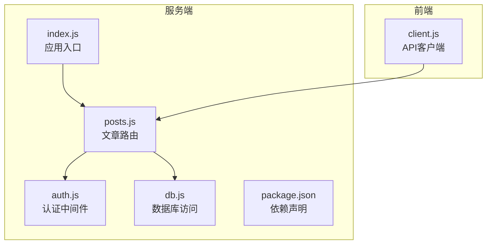
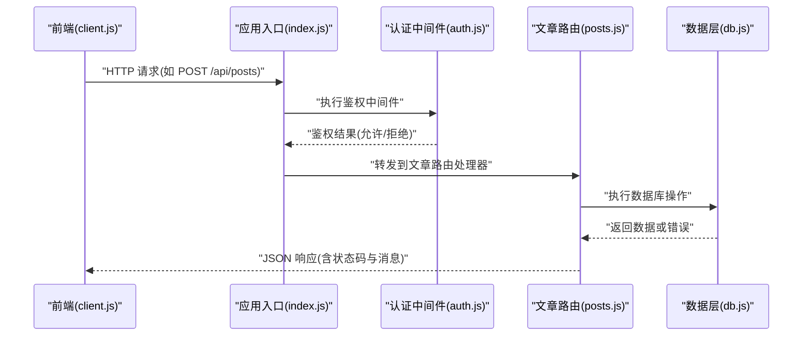
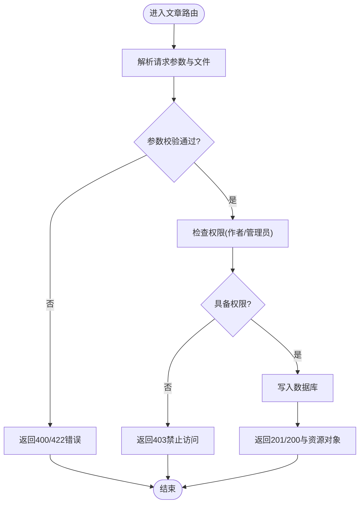
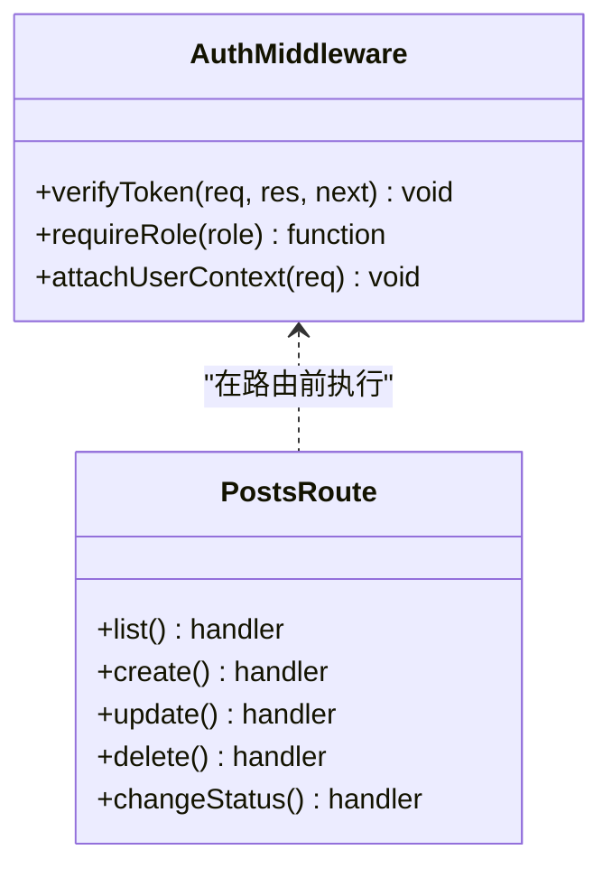
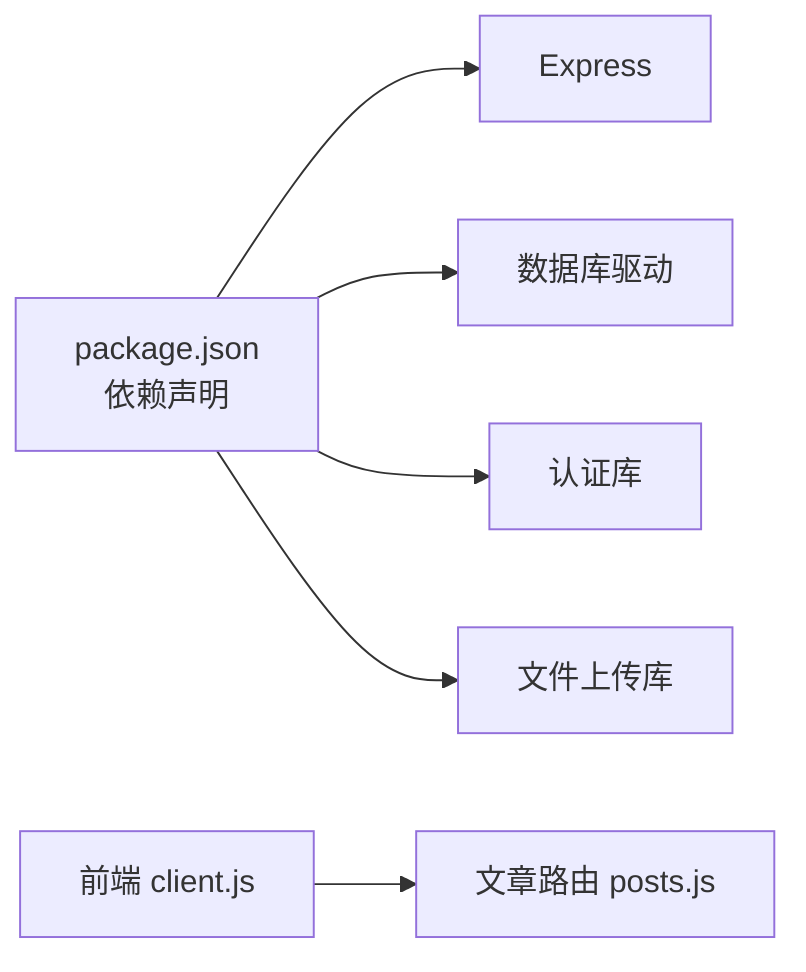

# 文章管理API

<cite>
**本文引用的文件**   
- [server/src/routes/posts.js](file://server/src/routes/posts.js)
- [server/src/middleware/auth.js](file://server/src/middleware/auth.js)
- [server/src/db.js](file://server/src/db.js)
- [server/src/index.js](file://server/src/index.js)
- [server/package.json](file://server/package.json)
- [src/api/client.js](file://src/api/client.js)
- [docs/05api接口文档.md](file://docs/05api接口文档.md)
</cite>

## 目录
1. [简介](#简介)
2. [项目结构](#项目结构)
3. [核心组件](#核心组件)
4. [架构总览](#架构总览)
5. [详细组件分析](#详细组件分析)
6. [依赖分析](#依赖分析)
7. [性能考虑](#性能考虑)
8. [故障排查指南](#故障排查指南)
9. [结论](#结论)
10. [附录](#附录)

## 简介
本文面向后端与前端开发者，系统化梳理“文章管理”相关RESTful API的设计与实现，覆盖文章的创建、读取、更新、删除（CRUD）、状态管理（草稿/已发布/已归档）、权限控制、文件上传处理、分页查询、搜索过滤与排序等能力。文档同时给出请求参数校验规则、响应数据格式、错误处理机制，并提供常见使用场景与最佳实践建议。

## 项目结构
本项目的文章管理API位于服务端路由模块中，并通过认证中间件进行权限控制；数据库访问通过统一的数据层封装；服务启动入口负责挂载路由与中间件。

图表来源
- [server/src/index.js](file://server/src/index.js)
- [server/src/routes/posts.js](file://server/src/routes/posts.js)
- [server/src/middleware/auth.js](file://server/src/middleware/auth.js)
- [server/src/db.js](file://server/src/db.js)
- [server/package.json](file://server/package.json)
- [src/api/client.js](file://src/api/client.js)

章节来源
- [server/src/index.js](file://server/src/index.js)
- [server/src/routes/posts.js](file://server/src/routes/posts.js)
- [server/src/middleware/auth.js](file://server/src/middleware/auth.js)
- [server/src/db.js](file://server/src/db.js)
- [server/package.json](file://server/package.json)
- [src/api/client.js](file://src/api/client.js)

## 核心组件
- 文章路由：提供文章相关的REST接口，包括列表、详情、创建、更新、删除、状态变更等。
- 认证中间件：校验登录态与角色权限，保护需要鉴权的接口。
- 数据层：封装数据库连接与常用查询方法，供路由调用。
- 应用入口：注册中间件与路由，启动HTTP服务。
- 前端API客户端：封装对后端的请求调用，统一处理基础URL、头部与错误。

章节来源
- [server/src/routes/posts.js](file://server/src/routes/posts.js)
- [server/src/middleware/auth.js](file://server/src/middleware/auth.js)
- [server/src/db.js](file://server/src/db.js)
- [server/src/index.js](file://server/src/index.js)
- [src/api/client.js](file://src/api/client.js)

## 架构总览
文章管理API采用分层设计：前端通过API客户端发起HTTP请求，进入后端Express应用，由认证中间件完成鉴权，随后交由文章路由处理业务逻辑，最终通过数据层访问持久化存储。

图表来源
- [server/src/index.js](file://server/src/index.js)
- [server/src/middleware/auth.js](file://server/src/middleware/auth.js)
- [server/src/routes/posts.js](file://server/src/routes/posts.js)
- [server/src/db.js](file://server/src/db.js)

## 详细组件分析

### 文章路由（POSTS）
- 职责
  - 定义并实现文章相关的REST接口：列表、详情、创建、更新、删除、状态变更等。
  - 解析请求参数，执行输入校验，调用数据层完成持久化操作。
  - 根据认证结果决定可访问的资源范围与操作权限。
- 关键能力
  - 列表与分页：支持页码、每页数量、可选的筛选条件（如作者、分类、标签）。
  - 搜索与过滤：支持关键词匹配、按字段过滤（如状态、时间范围）。
  - 排序：支持按发布时间、更新时间、热度等维度排序。
  - 状态管理：支持将文章设置为草稿、已发布、已归档等状态。
  - 文件上传：支持图片等多媒体附件上传，返回可访问的URL。
  - 权限控制：仅作者或管理员可修改或删除文章；公开接口用于浏览已发布内容。
- 典型流程（以创建文章为例）
  - 前端携带令牌与表单数据调用创建接口。
  - 认证中间件校验令牌与角色。
  - 路由解析并校验请求体字段。
  - 数据层插入记录并返回新文章对象。
  - 返回成功响应。

图表来源
- [server/src/routes/posts.js](file://server/src/routes/posts.js)
- [server/src/middleware/auth.js](file://server/src/middleware/auth.js)
- [server/src/db.js](file://server/src/db.js)

章节来源
- [server/src/routes/posts.js](file://server/src/routes/posts.js)
- [server/src/middleware/auth.js](file://server/src/middleware/auth.js)
- [server/src/db.js](file://server/src/db.js)

### 认证中间件（AUTH）
- 职责
  - 校验请求中的身份令牌（如JWT），解析用户信息。
  - 基于角色判断是否允许访问受保护资源。
  - 为后续路由处理器注入当前用户上下文。
- 关键点
  - 未携带令牌或令牌无效时返回401。
  - 无相应权限时返回403。
  - 对公开接口（如获取已发布文章列表）不强制鉴权。

图表来源
- [server/src/middleware/auth.js](file://server/src/middleware/auth.js)
- [server/src/routes/posts.js](file://server/src/routes/posts.js)

章节来源
- [server/src/middleware/auth.js](file://server/src/middleware/auth.js)
- [server/src/routes/posts.js](file://server/src/routes/posts.js)

### 数据层（DB）
- 职责
  - 维护数据库连接与事务。
  - 提供统一的增删改查方法，供路由层调用。
- 关注点
  - 错误传播：将底层异常转换为上层可识别的错误对象。
  - 性能优化：合理使用索引与分页查询，避免全表扫描。

章节来源
- [server/src/db.js](file://server/src/db.js)

### 应用入口（INDEX）
- 职责
  - 初始化中间件（如CORS、BodyParser、认证中间件）。
  - 挂载各功能路由（文章、用户、问答等）。
  - 启动HTTP服务监听端口。

章节来源
- [server/src/index.js](file://server/src/index.js)

### 前端API客户端（CLIENT）
- 职责
  - 封装对后端的HTTP调用，统一设置基础URL、请求头（如Authorization）。
  - 统一处理网络错误与业务错误提示。
- 使用建议
  - 在请求拦截器中附加令牌。
  - 对401/403进行跳转登录或提示。

章节来源
- [src/api/client.js](file://src/api/client.js)

## 依赖分析
- 运行时依赖
  - Express：HTTP框架，承载路由与中间件。
  - 数据库驱动：根据配置连接SQLite或其他数据库。
  - 认证库：用于签发与验证令牌。
  - 文件上传：用于处理multipart/form-data。
- 前后端契约
  - 前端通过API客户端调用后端REST接口，遵循统一的请求/响应约定。

图表来源
- [server/package.json](file://server/package.json)
- [src/api/client.js](file://src/api/client.js)
- [server/src/routes/posts.js](file://server/src/routes/posts.js)

章节来源
- [server/package.json](file://server/package.json)
- [src/api/client.js](file://src/api/client.js)
- [server/src/routes/posts.js](file://server/src/routes/posts.js)

## 性能考虑
- 分页与索引
  - 列表接口应默认分页，避免一次性返回大量数据。
  - 针对高频查询字段建立索引（如作者ID、状态、发布时间）。
- 缓存策略
  - 对只读且变化不频繁的数据（如已发布文章列表）引入缓存层。
- 文件上传
  - 限制文件大小与类型，异步生成缩略图，避免阻塞主线程。
- 连接池
  - 合理配置数据库连接池大小，避免连接耗尽。

[本节为通用指导，无需代码引用]

## 故障排查指南
- 常见问题
  - 401 未授权：检查令牌是否正确携带与有效期。
  - 403 禁止访问：确认当前用户是否为文章作者或管理员。
  - 404 资源不存在：确认文章ID是否存在且未被删除。
  - 422 参数校验失败：检查必填字段、类型与长度限制。
  - 500 服务器错误：查看服务端日志，定位数据库或第三方服务异常。
- 调试建议
  - 开启详细日志，记录请求路径、入参、出参与耗时。
  - 对文件上传接口单独打印上传元信息与存储路径。

章节来源
- [server/src/middleware/auth.js](file://server/src/middleware/auth.js)
- [server/src/routes/posts.js](file://server/src/routes/posts.js)

## 结论
本文从系统架构、组件关系、数据流与处理逻辑等方面，全面梳理了文章管理API的设计与实现要点。通过合理的权限控制、完善的参数校验与错误处理、以及良好的分页与索引策略，能够保障文章管理的稳定性与可扩展性。建议在实际部署中结合监控与日志体系，持续优化性能与用户体验。

[本节为总结性内容，无需代码引用]

## 附录

### RESTful 接口清单（示例）
- 列表与分页
  - GET /api/posts?page=1&limit=20&status=published&author_id=...
- 详情
  - GET /api/posts/:id
- 创建
  - POST /api/posts (application/json 或 multipart/form-data)
- 更新
  - PUT /api/posts/:id (application/json 或 multipart/form-data)
- 删除
  - DELETE /api/posts/:id
- 状态变更
  - PATCH /api/posts/:id/status (body: { status: "draft"|"published"|"archived" })

说明
- 上述路径为约定式命名，具体实现以服务端路由为准。
- 所有受保护接口需在请求头中携带有效的身份令牌。

章节来源
- [server/src/routes/posts.js](file://server/src/routes/posts.js)
- [docs/05api接口文档.md](file://docs/05api接口文档.md)

### 请求参数校验规则（摘要）
- 标题
  - 必填，字符串，长度限制（例如1-200字符）。
- 正文
  - 必填，字符串，最小长度限制（例如10字符）。
- 状态
  - 枚举值：draft/published/archived。
- 作者
  - 自动从令牌解析，不允许客户端传入。
- 封面图/附件
  - 可选，文件类型与大小限制，返回可访问URL。

章节来源
- [server/src/routes/posts.js](file://server/src/routes/posts.js)

### 响应数据格式（摘要）
- 成功
  - 状态码：200/201
  - 响应体包含资源对象与可选的消息字段。
- 错误
  - 状态码：400/401/403/404/422/500
  - 响应体包含错误码与人类可读消息，便于前端提示。

章节来源
- [server/src/routes/posts.js](file://server/src/routes/posts.js)

### 权限控制逻辑（摘要）
- 公开接口：获取已发布文章列表、文章详情（可选）。
- 受保护接口：创建、更新、删除、状态变更需登录。
- 资源级权限：仅作者或管理员可修改或删除其文章。

章节来源
- [server/src/middleware/auth.js](file://server/src/middleware/auth.js)
- [server/src/routes/posts.js](file://server/src/routes/posts.js)

### 文件上传处理（摘要）
- 支持多文件上传，限制类型与大小。
- 返回文件的访问URL与元信息。
- 建议对图片生成缩略图并异步处理。

章节来源
- [server/src/routes/posts.js](file://server/src/routes/posts.js)

### 分页、搜索与排序（摘要）
- 分页：page、limit，返回总数与页码信息。
- 搜索：关键词模糊匹配标题/正文。
- 排序：按发布时间、更新时间、热度等字段排序。

章节来源
- [server/src/routes/posts.js](file://server/src/routes/posts.js)

### 常见使用场景与最佳实践
- 写稿与草稿保存
  - 先创建草稿，逐步完善内容，最后发布。
- 批量更新
  - 谨慎使用批量更新，确保权限校验与审计日志。
- 敏感操作
  - 删除与状态变更需二次确认与操作日志。
- 前端体验
  - 加载态与错误提示清晰，支持重试与回退。

章节来源
- [src/api/client.js](file://src/api/client.js)
- [server/src/routes/posts.js](file://server/src/routes/posts.js)