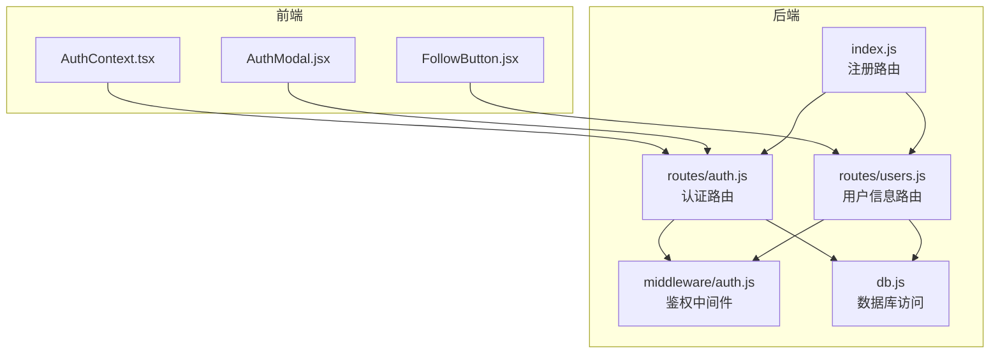
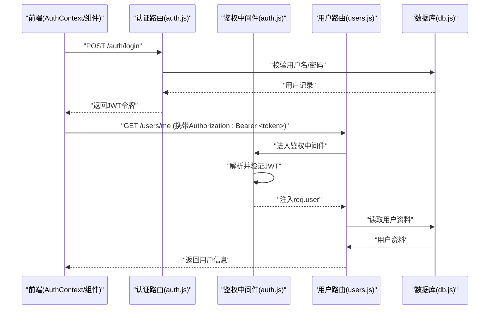
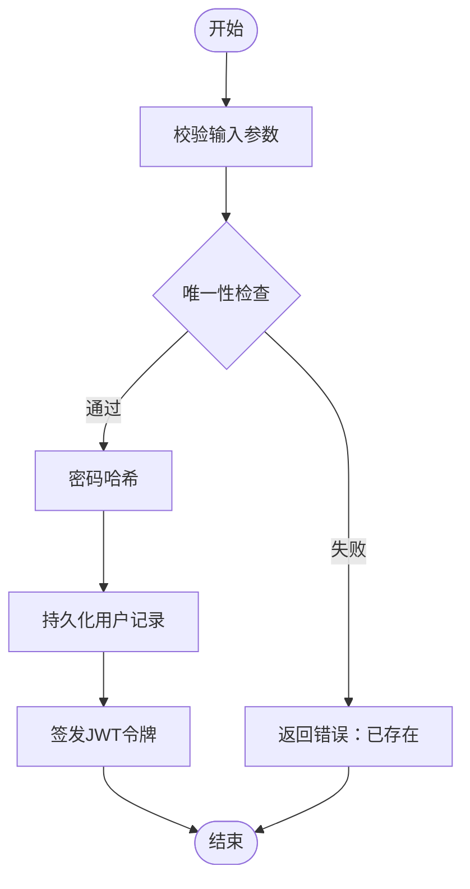
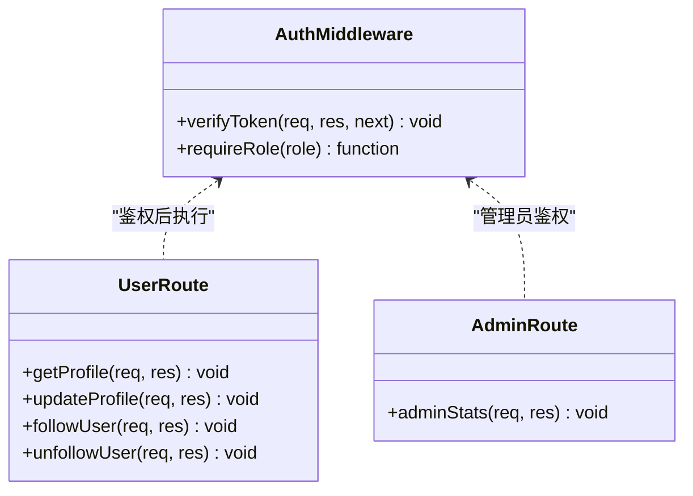
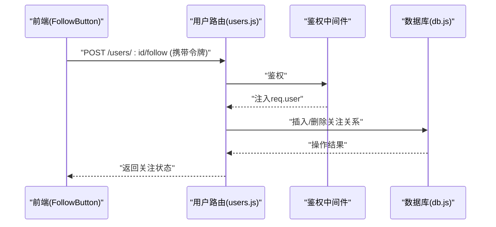
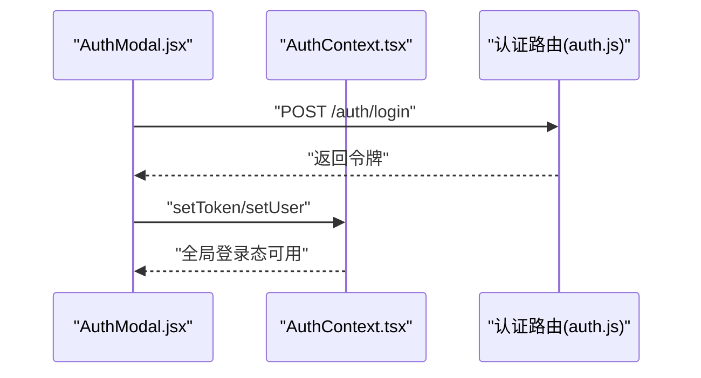
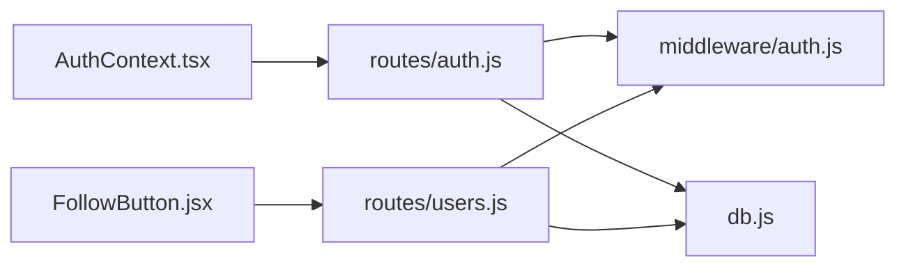

# 用户管理API

<cite>
**本文引用的文件**   
- [server/src/routes/auth.js](file://server/src/routes/auth.js)
- [server/src/routes/users.js](file://server/src/routes/users.js)
- [server/src/middleware/auth.js](file://server/src/middleware/auth.js)
- [server/src/db.js](file://server/src/db.js)
- [server/src/index.js](file://server/src/index.js)
- [src/context/AuthContext.tsx](file://src/context/AuthContext.tsx)
- [src/components/AuthModal/AuthModal.jsx](file://src/components/AuthModal/AuthModal.jsx)
- [src/components/FollowButton/followbutton.jsx](file://src/components/FollowButton/followbutton.jsx)
- [docs/05api接口文档.md](file://docs/05api接口文档.md)
</cite>

## 目录
1. [简介](#简介)
2. [项目结构](#项目结构)
3. [核心组件](#核心组件)
4. [架构总览](#架构总览)
5. [详细组件分析](#详细组件分析)
6. [依赖关系分析](#依赖关系分析)
7. [性能与安全考虑](#性能与安全考虑)
8. [故障排查指南](#故障排查指南)
9. [结论](#结论)
10. [附录：API参考与示例](#附录api参考与示例)

## 简介
本文件面向“用户管理”相关API，覆盖认证与授权、会话与令牌、权限控制、个人信息维护、关注/取关等能力。重点说明JWT令牌机制、角色权限（普通用户/管理员）实现、安全策略（密码加密、防暴力破解）、以及前后端交互流程与错误处理建议。

## 项目结构
后端采用Express路由分层，认证与鉴权通过中间件统一拦截；数据库访问封装在db模块中；前端通过React上下文与组件调用API并维护登录态。

图表来源
- [server/src/index.js](file://server/src/index.js)
- [server/src/routes/auth.js](file://server/src/routes/auth.js)
- [server/src/routes/users.js](file://server/src/routes/users.js)
- [server/src/middleware/auth.js](file://server/src/middleware/auth.js)
- [server/src/db.js](file://server/src/db.js)
- [src/context/AuthContext.tsx](file://src/context/AuthContext.tsx)
- [src/components/AuthModal/AuthModal.jsx](file://src/components/AuthModal/AuthModal.jsx)
- [src/components/FollowButton/followbutton.jsx](file://src/components/FollowButton/followbutton.jsx)

章节来源
- [server/src/index.js](file://server/src/index.js)
- [server/src/routes/auth.js](file://server/src/routes/auth.js)
- [server/src/routes/users.js](file://server/src/routes/users.js)
- [server/src/middleware/auth.js](file://server/src/middleware/auth.js)
- [server/src/db.js](file://server/src/db.js)
- [src/context/AuthContext.tsx](file://src/context/AuthContext.tsx)
- [src/components/AuthModal/AuthModal.jsx](file://src/components/AuthModal/AuthModal.jsx)
- [src/components/FollowButton/followbutton.jsx](file://src/components/FollowButton/followbutton.jsx)

## 核心组件
- 认证路由（注册、登录、登出、密码重置）：负责校验请求、生成/验证JWT、更新用户状态或密码。
- 鉴权中间件：解析请求头中的令牌，注入当前用户上下文，支持基于角色的访问控制。
- 用户信息路由：提供个人资料查询与修改、头像上传、关注/取关等能力。
- 数据库层：封装SQLite读写操作，保证事务与一致性。
- 前端上下文与组件：维护登录态、携带令牌、触发认证与用户操作。

章节来源
- [server/src/routes/auth.js](file://server/src/routes/auth.js)
- [server/src/middleware/auth.js](file://server/src/middleware/auth.js)
- [server/src/routes/users.js](file://server/src/routes/users.js)
- [server/src/db.js](file://server/src/db.js)
- [src/context/AuthContext.tsx](file://src/context/AuthContext.tsx)
- [src/components/AuthModal/AuthModal.jsx](file://src/components/AuthModal/AuthModal.jsx)

## 架构总览
下图展示一次受保护的用户信息查询的端到端流程，包括令牌签发、鉴权与数据返回。

图表来源
- [server/src/routes/auth.js](file://server/src/routes/auth.js)
- [server/src/middleware/auth.js](file://server/src/middleware/auth.js)
- [server/src/routes/users.js](file://server/src/routes/users.js)
- [server/src/db.js](file://server/src/db.js)

## 详细组件分析

### 认证与授权（注册/登录/登出/密码重置）
- 注册
  - 输入：用户名、邮箱、密码等
  - 处理：参数校验、唯一性检查、密码哈希存储
  - 输出：成功返回用户基本信息或令牌
- 登录
  - 输入：用户名/邮箱、密码
  - 处理：校验凭据、签发JWT（含过期时间、角色）
  - 输出：返回令牌及必要用户信息
- 登出
  - 无状态方案：客户端删除本地令牌即可；服务端可记录黑名单（可选）
- 密码重置
  - 流程：发送重置链接/验证码 -> 校验令牌 -> 设置新密码（哈希存储）

图表来源
- [server/src/routes/auth.js](file://server/src/routes/auth.js)
- [server/src/db.js](file://server/src/db.js)

章节来源
- [server/src/routes/auth.js](file://server/src/routes/auth.js)
- [server/src/db.js](file://server/src/db.js)

### 鉴权中间件与角色权限
- 令牌解析：从请求头提取Bearer令牌，解码并验签
- 上下文注入：将用户标识与角色写入请求对象
- 角色控制：对特定路由要求管理员角色，否则拒绝访问

图表来源
- [server/src/middleware/auth.js](file://server/src/middleware/auth.js)
- [server/src/routes/users.js](file://server/src/routes/users.js)

章节来源
- [server/src/middleware/auth.js](file://server/src/middleware/auth.js)
- [server/src/routes/users.js](file://server/src/routes/users.js)

### 用户信息管理（个人资料/头像/关注）
- 个人资料
  - 查询：获取当前用户资料
  - 修改：更新昵称、简介等字段（需鉴权）
- 头像上传
  - 接收multipart表单，保存至服务器或对象存储，更新用户头像URL
- 关注/取关
  - 建立/解除用户间关注关系，避免重复关注与自关注

图表来源
- [server/src/routes/users.js](file://server/src/routes/users.js)
- [server/src/middleware/auth.js](file://server/src/middleware/auth.js)
- [server/src/db.js](file://server/src/db.js)

章节来源
- [server/src/routes/users.js](file://server/src/routes/users.js)
- [server/src/middleware/auth.js](file://server/src/middleware/auth.js)
- [server/src/db.js](file://server/src/db.js)

### 前端登录态与会话维护
- 登录态上下文：集中管理令牌、用户信息、登录/登出动作
- 组件集成：登录弹窗组件发起认证请求，成功后更新上下文
- 受保护页面：根据上下文决定是否渲染内容或跳转登录

图表来源
- [src/components/AuthModal/AuthModal.jsx](file://src/components/AuthModal/AuthModal.jsx)
- [src/context/AuthContext.tsx](file://src/context/AuthContext.tsx)
- [server/src/routes/auth.js](file://server/src/routes/auth.js)

章节来源
- [src/components/AuthModal/AuthModal.jsx](file://src/components/AuthModal/AuthModal.jsx)
- [src/context/AuthContext.tsx](file://src/context/AuthContext.tsx)
- [server/src/routes/auth.js](file://server/src/routes/auth.js)

## 依赖关系分析
- 路由层依赖鉴权中间件进行统一鉴权
- 所有业务路由依赖数据库层进行数据存取
- 前端依赖认证上下文与组件完成登录态与用户操作

图表来源
- [server/src/routes/auth.js](file://server/src/routes/auth.js)
- [server/src/routes/users.js](file://server/src/routes/users.js)
- [server/src/middleware/auth.js](file://server/src/middleware/auth.js)
- [server/src/db.js](file://server/src/db.js)
- [src/context/AuthContext.tsx](file://src/context/AuthContext.tsx)
- [src/components/FollowButton/followbutton.jsx](file://src/components/FollowButton/followbutton.jsx)

章节来源
- [server/src/routes/auth.js](file://server/src/routes/auth.js)
- [server/src/routes/users.js](file://server/src/routes/users.js)
- [server/src/middleware/auth.js](file://server/src/middleware/auth.js)
- [server/src/db.js](file://server/src/db.js)
- [src/context/AuthContext.tsx](file://src/context/AuthContext.tsx)
- [src/components/FollowButton/followbutton.jsx](file://src/components/FollowButton/followbutton.jsx)

## 性能与安全考虑
- JWT优化
  - 合理设置过期时间，结合刷新令牌机制减少频繁登录
  - 最小化载荷，仅包含必要字段
- 密码安全
  - 使用强哈希算法（如bcrypt）加盐存储
  - 禁止明文日志记录密码
- 防暴力破解
  - 登录接口限流与冷却（IP/用户维度）
  - 验证码或二次确认用于敏感操作
- 传输安全
  - 全站HTTPS，防止中间人攻击
  - 敏感字段不落盘，必要时脱敏
- 输入校验与越权防护
  - 严格校验请求体与路径参数
  - 资源级鉴权（只能修改自己的资料）
- 错误处理
  - 统一错误码与消息，避免泄露内部细节
  - 记录审计日志，便于追踪异常行为

[本节为通用指导，不直接分析具体文件]

## 故障排查指南
- 常见错误码
  - 400：参数缺失或格式错误
  - 401：未认证或令牌无效/过期
  - 403：权限不足（非管理员访问管理员接口）
  - 404：资源不存在
  - 409：冲突（如用户名/邮箱已存在）
  - 429：请求过于频繁
  - 500：服务器内部错误
- 定位步骤
  - 检查请求头是否携带正确的Authorization令牌
  - 核对JWT签名与过期时间配置
  - 查看数据库连接与表结构是否正确初始化
  - 审查中间件是否按顺序挂载且未提前终止响应
- 日志与监控
  - 记录关键操作的审计日志（登录、登出、密码重置、关注/取关）
  - 监控异常率与延迟指标，快速发现瓶颈

章节来源
- [server/src/middleware/auth.js](file://server/src/middleware/auth.js)
- [server/src/routes/auth.js](file://server/src/routes/auth.js)
- [server/src/routes/users.js](file://server/src/routes/users.js)
- [server/src/db.js](file://server/src/db.js)

## 结论
本用户管理API围绕JWT无状态认证与中间件鉴权构建，实现了注册、登录、登出、密码重置、个人信息管理与关注/取关等核心能力。通过严格的输入校验、密码哈希、限流与HTTPS等安全措施，保障系统的安全性与稳定性。后续可引入刷新令牌、细粒度权限模型与更完善的审计体系以进一步提升体验与安全性。

## 附录：API参考与示例
以下为常用接口的概览与示例（方法、路径、说明），实际字段与返回值以后端实现为准。

- 认证
  - POST /auth/register
    - 说明：用户注册
    - 请求体：用户名、邮箱、密码
    - 响应：用户基本信息或令牌
  - POST /auth/login
    - 说明：用户登录
    - 请求体：用户名/邮箱、密码
    - 响应：令牌与用户信息
  - POST /auth/logout
    - 说明：登出（客户端删除令牌）
  - POST /auth/password-reset/request
    - 说明：申请密码重置（发送验证码/链接）
  - POST /auth/password-reset/confirm
    - 说明：确认重置（提交验证码与新密码）

- 用户信息
  - GET /users/me
    - 说明：获取当前用户资料（需鉴权）
  - PUT /users/me
    - 说明：修改个人资料（需鉴权）
  - POST /users/avatar/upload
    - 说明：上传头像（multipart/form-data，需鉴权）
  - POST /users/:id/follow
    - 说明：关注指定用户（需鉴权）
  - DELETE /users/:id/follow
    - 说明：取消关注（需鉴权）

- 管理员
  - GET /admin/stats
    - 说明：管理员统计（需管理员角色）

- 错误处理示例
  - 401：未认证或令牌无效
  - 403：权限不足
  - 409：用户名/邮箱已存在
  - 429：请求过于频繁

章节来源
- [docs/05api接口文档.md](file://docs/05api接口文档.md)
- [server/src/routes/auth.js](file://server/src/routes/auth.js)
- [server/src/routes/users.js](file://server/src/routes/users.js)
- [server/src/middleware/auth.js](file://server/src/middleware/auth.js)