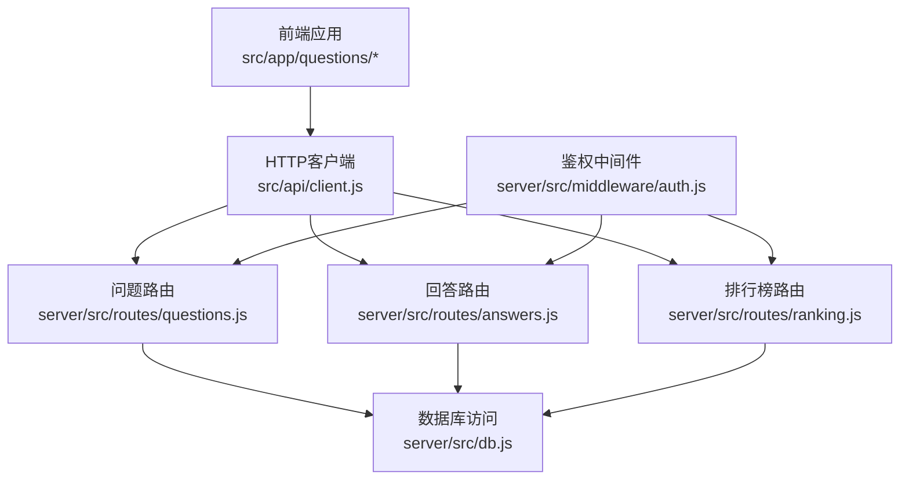
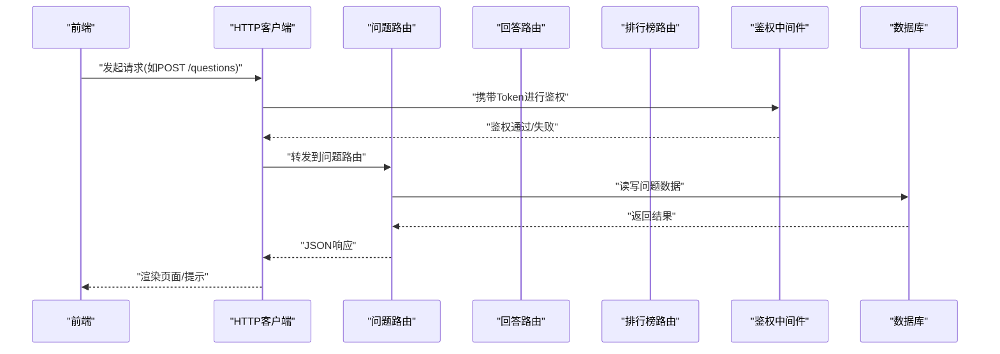
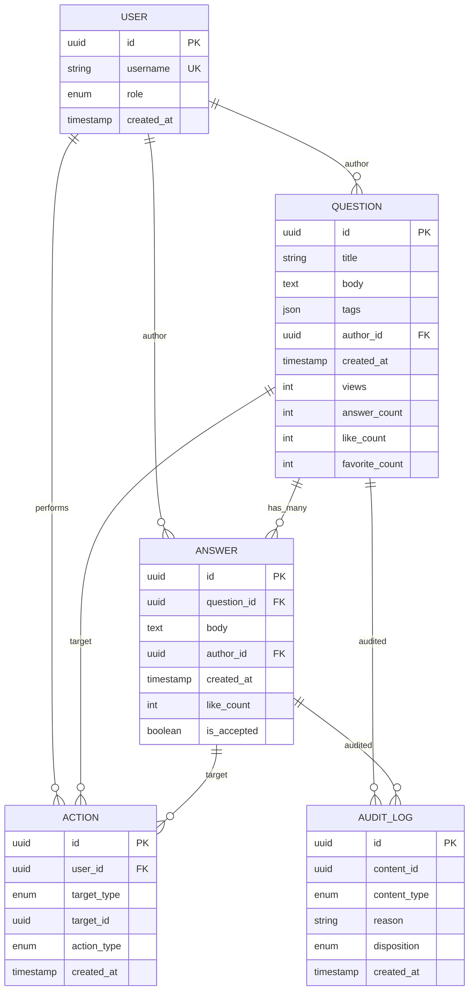
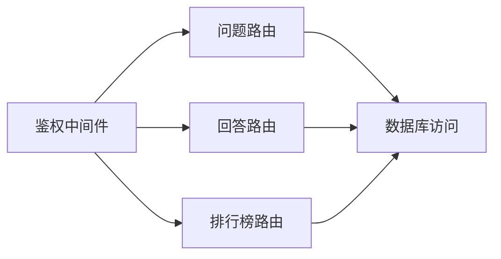

# 问答系统API

<cite>
**本文引用的文件**   
- [server/src/routes/questions.js](file://server/src/routes/questions.js)
- [server/src/routes/answers.js](file://server/src/routes/answers.js)
- [server/src/routes/ranking.js](file://server/src/routes/ranking.js)
- [server/src/db.js](file://server/src/db.js)
- [server/src/middleware/auth.js](file://server/src/middleware/auth.js)
- [src/api/client.js](file://src/api/client.js)
- [server/package.json](file://server/package.json)
</cite>

## 目录
1. [简介](#简介)
2. [项目结构](#项目结构)
3. [核心组件](#核心组件)
4. [架构总览](#架构总览)
5. [详细组件分析](#详细组件分析)
6. [依赖分析](#依赖分析)
7. [性能考虑](#性能考虑)
8. [故障排查指南](#故障排查指南)
9. [结论](#结论)
10. [附录](#附录)

## 简介
本文件面向后端与前端开发者，系统化梳理问答模块的RESTful API设计，覆盖问题发布、回答提交、投票排序、点赞收藏举报等互动能力，并说明内容审核与敏感词过滤策略、排行榜算法与推荐逻辑。文档提供数据模型定义、接口调用示例与性能优化建议，帮助快速集成与扩展。

## 项目结构
问答相关功能主要位于服务端路由层与数据库访问层：
- 路由层：问题、回答、排行榜等REST接口
- 中间件：鉴权与权限控制
- 数据层：SQLite数据库连接与查询封装
- 前端客户端：统一HTTP客户端封装

图表来源
- [server/src/routes/questions.js](file://server/src/routes/questions.js)
- [server/src/routes/answers.js](file://server/src/routes/answers.js)
- [server/src/routes/ranking.js](file://server/src/routes/ranking.js)
- [server/src/db.js](file://server/src/db.js)
- [server/src/middleware/auth.js](file://server/src/middleware/auth.js)
- [src/api/client.js](file://src/api/client.js)

章节来源
- [server/src/routes/questions.js](file://server/src/routes/questions.js)
- [server/src/routes/answers.js](file://server/src/routes/answers.js)
- [server/src/routes/ranking.js](file://server/src/routes/ranking.js)
- [server/src/db.js](file://server/src/db.js)
- [server/src/middleware/auth.js](file://server/src/middleware/auth.js)
- [src/api/client.js](file://src/api/client.js)

## 核心组件
- 问题管理：创建、获取详情、列表分页、更新、删除、标签关联
- 回答管理：按问题ID获取、创建回答、更新、删除
- 互动行为：点赞（支持问题/回答）、收藏、举报
- 排序与排行：按热度/最新/高分排序；排行榜聚合
- 安全与审核：鉴权、敏感词过滤、内容安全策略
- 数据模型：问题、回答、用户、互动记录、审核日志

章节来源
- [server/src/routes/questions.js](file://server/src/routes/questions.js)
- [server/src/routes/answers.js](file://server/src/routes/answers.js)
- [server/src/routes/ranking.js](file://server/src/routes/ranking.js)
- [server/src/db.js](file://server/src/db.js)
- [server/src/middleware/auth.js](file://server/src/middleware/auth.js)

## 架构总览
问答系统采用前后端分离架构，前端通过统一HTTP客户端调用后端REST接口，后端路由层负责业务编排，中间件完成鉴权与权限校验，数据层基于SQLite进行持久化。

图表来源
- [server/src/routes/questions.js](file://server/src/routes/questions.js)
- [server/src/routes/answers.js](file://server/src/routes/answers.js)
- [server/src/routes/ranking.js](file://server/src/routes/ranking.js)
- [server/src/middleware/auth.js](file://server/src/middleware/auth.js)
- [server/src/db.js](file://server/src/db.js)
- [src/api/client.js](file://src/api/client.js)

## 详细组件分析

### 问题管理API
- 功能范围
  - 创建问题：标题、正文、标签、作者信息
  - 获取问题详情：包含基础信息与统计字段
  - 问题列表：分页、筛选（标签、状态）、排序（最新/热度/高分）
  - 更新与删除：仅作者或管理员可操作
- 数据结构要点
  - 问题对象包含：标识、标题、正文、标签数组、作者信息、时间戳、统计（浏览量、回答数、点赞数、收藏数）
  - 嵌套关系：问题与回答一对多，列表可包含最近回答摘要
- 安全与审核
  - 鉴权：创建/更新/删除需登录态
  - 敏感词过滤：对标题与正文进行过滤与替换/拒绝
  - 内容安全：违规内容标记与下架流程
- 典型调用示例
  - POST /api/questions：创建问题，请求体包含标题、正文、标签
  - GET /api/questions/:id：获取问题详情
  - GET /api/questions?tag=xxx&page=1&size=20&sort=newest：分页列表
  - PUT /api/questions/:id：更新问题
  - DELETE /api/questions/:id：删除问题

章节来源
- [server/src/routes/questions.js](file://server/src/routes/questions.js)
- [server/src/middleware/auth.js](file://server/src/middleware/auth.js)
- [server/src/db.js](file://server/src/db.js)

### 回答管理API
- 功能范围
  - 按问题ID获取回答列表：分页、排序（最新/高分）
  - 创建回答：关联问题ID、正文、作者信息
  - 更新与删除：仅作者或管理员可操作
- 数据结构要点
  - 回答对象包含：标识、问题ID、正文、作者信息、时间戳、统计（点赞数、采纳标记）
  - 嵌套关系：回答属于问题，可被采纳为最佳答案
- 安全与审核
  - 鉴权：创建/更新/删除需登录态
  - 敏感词过滤：对回答正文进行过滤
  - 内容安全：违规内容标记与处理
- 典型调用示例
  - GET /api/questions/:id/answers?page=1&size=20&sort=newest：获取回答列表
  - POST /api/questions/:id/answers：提交回答
  - PUT /api/answers/:id：更新回答
  - DELETE /api/answers/:id：删除回答

章节来源
- [server/src/routes/answers.js](file://server/src/routes/answers.js)
- [server/src/middleware/auth.js](file://server/src/middleware/auth.js)
- [server/src/db.js](file://server/src/db.js)

### 互动功能API（点赞、收藏、举报）
- 功能范围
  - 点赞：支持对问题与回答分别点赞，去重与幂等
  - 收藏：用户对问题或回答进行收藏，支持取消
  - 举报：提交举报原因与描述，进入审核队列
- 数据结构要点
  - 互动记录包含：用户ID、目标类型（问题/回答）、目标ID、动作类型（赞/收藏/举报）、时间戳
  - 统计字段：问题/回答的点赞数、收藏数实时更新
- 安全与审核
  - 鉴权：所有互动需登录态
  - 防刷：同一用户对同一目标的动作限制
  - 举报审核：后台审核与处置流程
- 典型调用示例
  - POST /api/actions/like?type=question&id={id}：点赞问题
  - POST /api/actions/like?type=answer&id={id}：点赞回答
  - POST /api/actions/favorite?type=question&id={id}：收藏问题
  - POST /api/actions/report?type=question&id={id}&reason=...&desc=...：举报问题

章节来源
- [server/src/routes/questions.js](file://server/src/routes/questions.js)
- [server/src/routes/answers.js](file://server/src/routes/answers.js)
- [server/src/middleware/auth.js](file://server/src/middleware/auth.js)
- [server/src/db.js](file://server/src/db.js)

### 排序与排行榜API
- 功能范围
  - 排序：支持按最新、热度、高分排序
  - 排行榜：综合热度、回答质量、活跃度生成榜单
- 算法与计算
  - 热度计算：结合浏览量、回答数、点赞数、时间衰减因子
  - 高分排序：基于点赞数与采纳标记加权
  - 推荐逻辑：基于标签相似度与用户历史偏好
- 典型调用示例
  - GET /api/questions?sort=hot：按热度排序
  - GET /api/questions?sort=top：按高分排序
  - GET /api/rankings?type=hot&limit=20：热门排行榜
  - GET /api/rankings?type=top&limit=20：高分排行榜

章节来源
- [server/src/routes/questions.js](file://server/src/routes/questions.js)
- [server/src/routes/ranking.js](file://server/src/routes/ranking.js)
- [server/src/db.js](file://server/src/db.js)

### 内容审核与安全策略
- 敏感词过滤
  - 规则库：维护敏感词集合，支持动态更新
  - 处理策略：替换为占位符或直接拒绝提交
- 内容安全
  - 审核队列：违规内容进入待审状态，管理员处置
  - 自动拦截：高风险内容直接屏蔽并记录审计日志
- 鉴权与权限
  - 角色控制：普通用户、作者、管理员不同权限
  - Token校验：请求头携带JWT，中间件校验有效期与签名

章节来源
- [server/src/middleware/auth.js](file://server/src/middleware/auth.js)
- [server/src/routes/questions.js](file://server/src/routes/questions.js)
- [server/src/routes/answers.js](file://server/src/routes/answers.js)

### 数据模型定义
- 实体关系
  - 用户：标识、用户名、角色、时间戳
  - 问题：标识、标题、正文、标签数组、作者ID、时间戳、统计字段
  - 回答：标识、问题ID、正文、作者ID、时间戳、统计字段、采纳标记
  - 互动记录：用户ID、目标类型、目标ID、动作类型、时间戳
  - 审核日志：内容ID、类型、原因、处置结果、时间戳
- 关系图

图表来源
- [server/src/db.js](file://server/src/db.js)
- [server/src/routes/questions.js](file://server/src/routes/questions.js)
- [server/src/routes/answers.js](file://server/src/routes/answers.js)

## 依赖分析
- 组件耦合
  - 路由层依赖鉴权中间件与数据库访问层
  - 排行榜路由依赖问题与回答统计数据
- 外部依赖
  - SQLite作为持久化存储
  - JWT用于鉴权
- 潜在循环依赖
  - 当前路由与数据层单向依赖，无循环引用

图表来源
- [server/src/middleware/auth.js](file://server/src/middleware/auth.js)
- [server/src/routes/questions.js](file://server/src/routes/questions.js)
- [server/src/routes/answers.js](file://server/src/routes/answers.js)
- [server/src/routes/ranking.js](file://server/src/routes/ranking.js)
- [server/src/db.js](file://server/src/db.js)

章节来源
- [server/package.json](file://server/package.json)
- [server/src/middleware/auth.js](file://server/src/middleware/auth.js)
- [server/src/db.js](file://server/src/db.js)

## 性能考虑
- 数据库优化
  - 索引：问题与回答的时间戳、标签、作者ID建立索引
  - 分页：使用游标或偏移量分页，避免深分页
  - 统计缓存：热点问题的统计字段缓存至内存或Redis
- 接口优化
  - 限流：对高频接口设置速率限制
  - 压缩：启用Gzip压缩减少传输体积
  - 缓存：静态资源与排行榜结果短期缓存
- 前端优化
  - 懒加载：按需加载回答与评论
  - 去抖：搜索与筛选输入去抖
  - 错误重试：网络异常时指数退避重试

[本节为通用性能建议，不直接分析具体文件]

## 故障排查指南
- 鉴权失败
  - 检查Token是否过期或签名无效
  - 确认请求头是否正确携带Authorization
- 数据不一致
  - 核对数据库事务与并发写入冲突
  - 检查统计字段更新是否幂等
- 敏感词拦截
  - 查看审核日志定位触发规则
  - 调整规则库与阈值
- 排行榜异常
  - 验证热度计算公式与权重配置
  - 检查数据源完整性与时间衰减参数

章节来源
- [server/src/middleware/auth.js](file://server/src/middleware/auth.js)
- [server/src/db.js](file://server/src/db.js)
- [server/src/routes/ranking.js](file://server/src/routes/ranking.js)

## 结论
问答系统API围绕问题与回答的核心实体构建，提供完整的CRUD、互动与排序能力，并通过鉴权中间件与内容安全策略保障平台秩序。通过合理的索引与缓存策略，可在保证一致性的同时提升性能与用户体验。

[本节为总结性内容，不直接分析具体文件]

## 附录

### RESTful接口清单
- 问题
  - POST /api/questions：创建问题
  - GET /api/questions/:id：获取问题详情
  - GET /api/questions：问题列表（分页、筛选、排序）
  - PUT /api/questions/:id：更新问题
  - DELETE /api/questions/:id：删除问题
- 回答
  - GET /api/questions/:id/answers：获取回答列表
  - POST /api/questions/:id/answers：提交回答
  - PUT /api/answers/:id：更新回答
  - DELETE /api/answers/:id：删除回答
- 互动
  - POST /api/actions/like：点赞（type=question|answer）
  - POST /api/actions/favorite：收藏（type=question|answer）
  - POST /api/actions/report：举报（type=question|answer）
- 排行榜
  - GET /api/rankings?type=hot|top&limit=20

章节来源
- [server/src/routes/questions.js](file://server/src/routes/questions.js)
- [server/src/routes/answers.js](file://server/src/routes/answers.js)
- [server/src/routes/ranking.js](file://server/src/routes/ranking.js)

### 前端调用示例（路径参考）
- HTTP客户端封装：src/api/client.js
- 页面调用位置：src/app/questions/* 与 src/css_pages/questiondetail.jsx、src/css_pages/questions.jsx

章节来源
- [src/api/client.js](file://src/api/client.js)