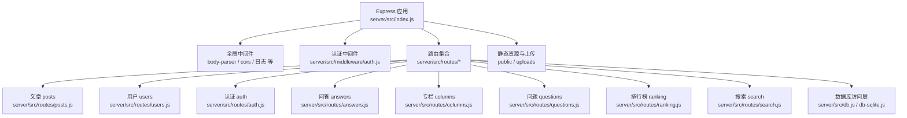
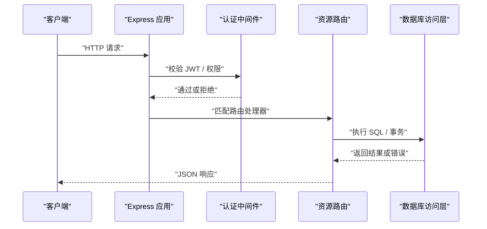
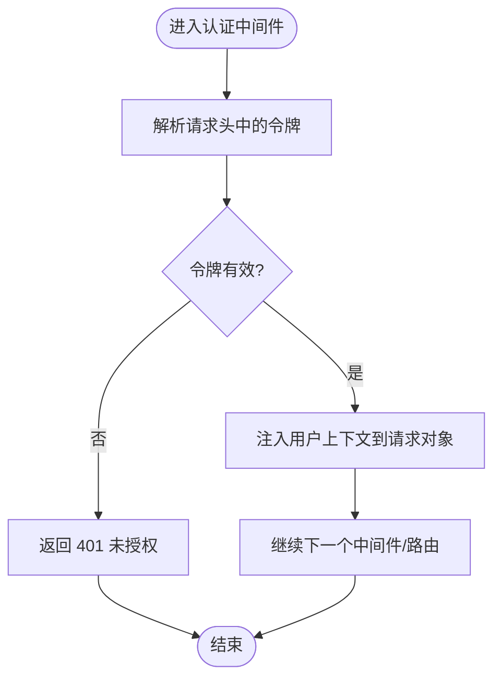
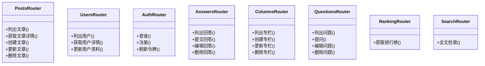
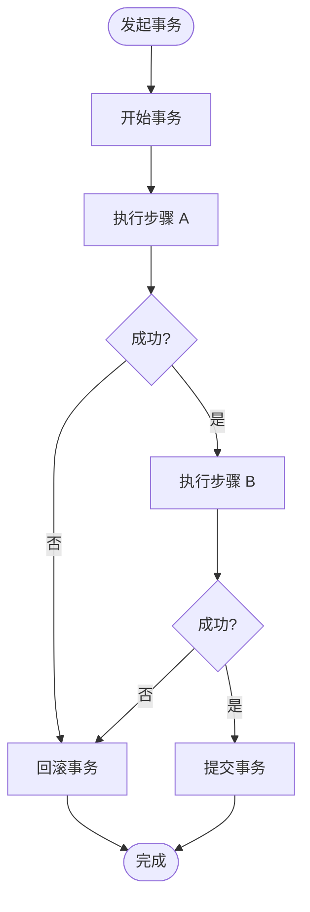
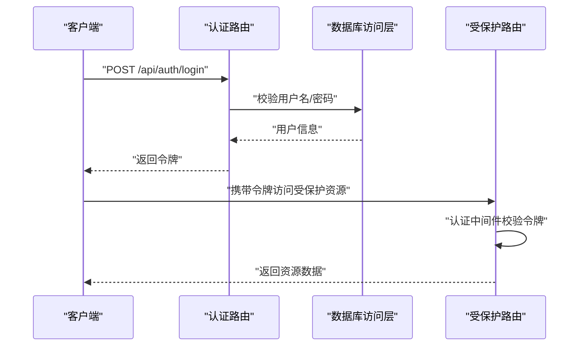
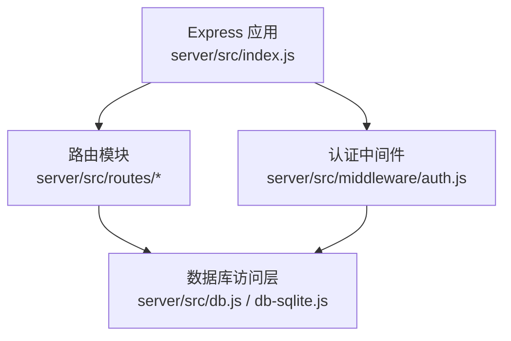

# 后端架构

<cite>
**本文引用的文件**   
- [server/src/index.js](file://server/src/index.js)
- [server/src/middleware/auth.js](file://server/src/middleware/auth.js)
- [server/src/routes/posts.js](file://server/src/routes/posts.js)
- [server/src/routes/users.js](file://server/src/routes/users.js)
- [server/src/routes/auth.js](file://server/src/routes/auth.js)
- [server/src/routes/answers.js](file://server/src/routes/answers.js)
- [server/src/routes/columns.js](file://server/src/routes/columns.js)
- [server/src/routes/questions.js](file://server/src/routes/questions.js)
- [server/src/routes/ranking.js](file://server/src/routes/ranking.js)
- [server/src/routes/search.js](file://server/src/routes/search.js)
- [server/src/db.js](file://server/src/db.js)
- [server/src/db-sqlite.js](file://server/src/db-sqlite.js)
- [server/package.json](file://server/package.json)
</cite>

## 目录
1. [简介](#简介)
2. [项目结构](#项目结构)
3. [核心组件](#核心组件)
4. [架构总览](#架构总览)
5. [详细组件分析](#详细组件分析)
6. [依赖分析](#依赖分析)
7. [性能考虑](#性能考虑)
8. [故障排查指南](#故障排查指南)
9. [结论](#结论)
10. [附录](#附录)

## 简介
本文件面向后端服务，系统性解析基于 Node.js 与 Express 的服务端架构。内容覆盖应用初始化、中间件注册机制、模块化路由设计（RESTful API 规范与资源组织）、数据库层（SQLite 连接管理、查询封装、事务处理）、认证与安全（JWT 验证、权限检查、会话管理）、错误处理策略（统一错误格式、日志记录、异常捕获）、基础设施（文件上传、静态资源服务），以及 API 开发规范与最佳实践。文档以代码级事实为依据，辅以可视化图示帮助理解。

## 项目结构
后端位于 server 目录，采用“按功能域划分”的模块化组织方式：
- 入口与配置：应用启动、全局中间件、端口监听等
- 中间件：认证鉴权、请求校验、错误处理等
- 路由：按资源划分的 RESTful 路由模块
- 数据访问：数据库连接、SQL 执行封装、迁移与种子脚本
- 静态资源与上传：静态文件托管、文件上传存储目录

图表来源
- [server/src/index.js](file://server/src/index.js)
- [server/src/middleware/auth.js](file://server/src/middleware/auth.js)
- [server/src/routes/posts.js](file://server/src/routes/posts.js)
- [server/src/routes/users.js](file://server/src/routes/users.js)
- [server/src/routes/auth.js](file://server/src/routes/auth.js)
- [server/src/routes/answers.js](file://server/src/routes/answers.js)
- [server/src/routes/columns.js](file://server/src/routes/columns.js)
- [server/src/routes/questions.js](file://server/src/routes/questions.js)
- [server/src/routes/ranking.js](file://server/src/routes/ranking.js)
- [server/src/routes/search.js](file://server/src/routes/search.js)
- [server/src/db.js](file://server/src/db.js)
- [server/src/db-sqlite.js](file://server/src/db-sqlite.js)

章节来源
- [server/src/index.js](file://server/src/index.js)
- [server/package.json](file://server/package.json)

## 核心组件
- 应用初始化与中间件注册
  - 在入口文件中创建 Express 实例，注册通用中间件（如请求体解析、跨域、安全头、日志等），挂载静态资源目录与上传目录，最后注册各业务路由并启动 HTTP 服务。
  - 关键路径参考：[server/src/index.js](file://server/src/index.js)

- 认证中间件
  - 提供 JWT 令牌解析与校验逻辑，将已认证用户信息注入到请求上下文，供后续路由使用；支持可选的权限角色检查。
  - 关键路径参考：[server/src/middleware/auth.js](file://server/src/middleware/auth.js)

- 模块化路由
  - 每个资源一个路由文件，遵循 RESTful 风格，集中定义该资源的增删改查接口，并在入口中统一挂载。
  - 关键路径参考：
    - [server/src/routes/posts.js](file://server/src/routes/posts.js)
    - [server/src/routes/users.js](file://server/src/routes/users.js)
    - [server/src/routes/auth.js](file://server/src/routes/auth.js)
    - [server/src/routes/answers.js](file://server/src/routes/answers.js)
    - [server/src/routes/columns.js](file://server/src/routes/columns.js)
    - [server/src/routes/questions.js](file://server/src/routes/questions.js)
    - [server/src/routes/ranking.js](file://server/src/routes/ranking.js)
    - [server/src/routes/search.js](file://server/src/routes/search.js)

- 数据库层
  - 提供 SQLite 连接管理与 SQL 执行封装，包含基础 CRUD、参数化查询、事务封装等能力，供路由层调用。
  - 关键路径参考：
    - [server/src/db.js](file://server/src/db.js)
    - [server/src/db-sqlite.js](file://server/src/db-sqlite.js)

章节来源
- [server/src/index.js](file://server/src/index.js)
- [server/src/middleware/auth.js](file://server/src/middleware/auth.js)
- [server/src/routes/posts.js](file://server/src/routes/posts.js)
- [server/src/routes/users.js](file://server/src/routes/users.js)
- [server/src/routes/auth.js](file://server/src/routes/auth.js)
- [server/src/routes/answers.js](file://server/src/routes/answers.js)
- [server/src/routes/columns.js](file://server/src/routes/columns.js)
- [server/src/routes/questions.js](file://server/src/routes/questions.js)
- [server/src/routes/ranking.js](file://server/src/routes/ranking.js)
- [server/src/routes/search.js](file://server/src/routes/search.js)
- [server/src/db.js](file://server/src/db.js)
- [server/src/db-sqlite.js](file://server/src/db-sqlite.js)

## 架构总览
下图展示了从客户端请求到数据库访问的整体流程，包括认证中间件、路由分发、数据库访问层及错误处理。

图表来源
- [server/src/index.js](file://server/src/index.js)
- [server/src/middleware/auth.js](file://server/src/middleware/auth.js)
- [server/src/routes/posts.js](file://server/src/routes/posts.js)
- [server/src/db.js](file://server/src/db.js)
- [server/src/db-sqlite.js](file://server/src/db-sqlite.js)

## 详细组件分析

### 应用初始化与中间件注册
- 职责
  - 创建 Express 实例
  - 注册全局中间件（请求体解析、跨域、安全头、日志等）
  - 挂载静态资源与上传目录
  - 注册各业务路由
  - 启动 HTTP 服务
- 关键点
  - 中间件顺序决定处理链路，认证应在路由之前
  - 静态资源与上传目录需明确路径与权限
- 参考实现位置
  - [server/src/index.js](file://server/src/index.js)

章节来源
- [server/src/index.js](file://server/src/index.js)

### 认证中间件（JWT 与权限）
- 职责
  - 解析请求头中的令牌
  - 校验令牌有效性并提取用户信息
  - 将用户上下文注入到请求对象
  - 可选：基于角色的权限检查
- 关键点
  - 未携带或无效令牌应返回标准错误响应
  - 敏感操作需结合路由级权限控制
- 参考实现位置
  - [server/src/middleware/auth.js](file://server/src/middleware/auth.js)

图表来源
- [server/src/middleware/auth.js](file://server/src/middleware/auth.js)

章节来源
- [server/src/middleware/auth.js](file://server/src/middleware/auth.js)

### 模块化路由与 RESTful 设计
- 资源与路由组织
  - 文章：posts
  - 用户：users
  - 认证：auth
  - 问答：answers
  - 专栏：columns
  - 问题：questions
  - 排行榜：ranking
  - 搜索：search
- RESTful 规范建议
  - 使用名词复数表示资源集合，单数表示单个资源
  - 使用标准 HTTP 方法表达意图：GET/POST/PUT/PATCH/DELETE
  - 状态码语义清晰：200/201/204/400/401/403/404/500
  - 分页、排序、过滤通过查询参数传递
- 参考实现位置
  - [server/src/routes/posts.js](file://server/src/routes/posts.js)
  - [server/src/routes/users.js](file://server/src/routes/users.js)
  - [server/src/routes/auth.js](file://server/src/routes/auth.js)
  - [server/src/routes/answers.js](file://server/src/routes/answers.js)
  - [server/src/routes/columns.js](file://server/src/routes/columns.js)
  - [server/src/routes/questions.js](file://server/src/routes/questions.js)
  - [server/src/routes/ranking.js](file://server/src/routes/ranking.js)
  - [server/src/routes/search.js](file://server/src/routes/search.js)

图表来源
- [server/src/routes/posts.js](file://server/src/routes/posts.js)
- [server/src/routes/users.js](file://server/src/routes/users.js)
- [server/src/routes/auth.js](file://server/src/routes/auth.js)
- [server/src/routes/answers.js](file://server/src/routes/answers.js)
- [server/src/routes/columns.js](file://server/src/routes/columns.js)
- [server/src/routes/questions.js](file://server/src/routes/questions.js)
- [server/src/routes/ranking.js](file://server/src/routes/ranking.js)
- [server/src/routes/search.js](file://server/src/routes/search.js)

章节来源
- [server/src/routes/posts.js](file://server/src/routes/posts.js)
- [server/src/routes/users.js](file://server/src/routes/users.js)
- [server/src/routes/auth.js](file://server/src/routes/auth.js)
- [server/src/routes/answers.js](file://server/src/routes/answers.js)
- [server/src/routes/columns.js](file://server/src/routes/columns.js)
- [server/src/routes/questions.js](file://server/src/routes/questions.js)
- [server/src/routes/ranking.js](file://server/src/routes/ranking.js)
- [server/src/routes/search.js](file://server/src/routes/search.js)

### 数据库层（SQLite 连接、查询封装、事务）
- 职责
  - 管理 SQLite 连接生命周期
  - 提供参数化查询封装，避免 SQL 注入
  - 封装事务执行流程，保证一致性
  - 暴露统一的查询接口供路由层调用
- 关键点
  - 连接池或单例连接的选择与复用
  - 错误传播与重试策略
  - 事务边界与回滚处理
- 参考实现位置
  - [server/src/db.js](file://server/src/db.js)
  - [server/src/db-sqlite.js](file://server/src/db-sqlite.js)

图表来源
- [server/src/db.js](file://server/src/db.js)
- [server/src/db-sqlite.js](file://server/src/db-sqlite.js)

章节来源
- [server/src/db.js](file://server/src/db.js)
- [server/src/db-sqlite.js](file://server/src/db-sqlite.js)

### 错误处理策略
- 目标
  - 统一错误响应格式
  - 集中式异常捕获
  - 结构化日志记录
- 建议模式
  - 全局错误处理中间件，拦截未捕获异常与显式抛出的业务错误
  - 标准化错误对象（code、message、details）
  - 生产环境隐藏敏感堆栈，保留必要上下文
- 参考实现位置
  - 全局错误处理通常在入口文件中注册
  - 参考：[server/src/index.js](file://server/src/index.js)

章节来源
- [server/src/index.js](file://server/src/index.js)

### 文件上传与静态资源服务
- 静态资源
  - 通过 Express 静态中间件托管 public 目录
- 文件上传
  - 使用 multipart 解析器（如 multer）接收文件
  - 将文件写入 uploads 目录，返回可访问的 URL 或元信息
- 参考实现位置
  - 静态资源与上传目录由入口文件挂载
  - 参考：[server/src/index.js](file://server/src/index.js)

章节来源
- [server/src/index.js](file://server/src/index.js)

### 认证流程时序（登录与受保护资源访问）

图表来源
- [server/src/routes/auth.js](file://server/src/routes/auth.js)
- [server/src/middleware/auth.js](file://server/src/middleware/auth.js)
- [server/src/db.js](file://server/src/db.js)
- [server/src/db-sqlite.js](file://server/src/db-sqlite.js)

章节来源
- [server/src/routes/auth.js](file://server/src/routes/auth.js)
- [server/src/middleware/auth.js](file://server/src/middleware/auth.js)
- [server/src/db.js](file://server/src/db.js)
- [server/src/db-sqlite.js](file://server/src/db-sqlite.js)

## 依赖分析
- 运行时依赖
  - Express：Web 框架
  - SQLite 驱动：用于本地数据库访问
  - JSON Web Token：用于身份认证
  - 其他：请求体解析、跨域、日志等
- 依赖关系图

图表来源
- [server/src/index.js](file://server/src/index.js)
- [server/src/middleware/auth.js](file://server/src/middleware/auth.js)
- [server/src/routes/posts.js](file://server/src/routes/posts.js)
- [server/src/db.js](file://server/src/db.js)
- [server/src/db-sqlite.js](file://server/src/db-sqlite.js)

章节来源
- [server/package.json](file://server/package.json)
- [server/src/index.js](file://server/src/index.js)

## 性能考虑
- 数据库
  - 合理使用索引，避免全表扫描
  - 批量操作与分页查询，减少单次负载
  - 连接复用与事务合并，降低开销
- 应用层
  - 缓存热点数据（如排行榜、搜索结果）
  - 压缩响应体，启用静态资源缓存
  - 限流与防抖，防止滥用
- 上传与静态资源
  - 大文件分片上传与断点续传
  - 静态资源 CDN 加速

## 故障排查指南
- 常见问题
  - 401/403：令牌缺失或权限不足，检查认证中间件与路由守卫
  - 404：路由未注册或路径不匹配，检查入口挂载与路由定义
  - 500：数据库错误或未捕获异常，查看全局错误处理与日志
- 定位手段
  - 开启请求日志，记录方法、路径、耗时、状态码
  - 对关键 SQL 添加慢查询日志
  - 使用结构化错误对象，便于前端展示与后端追踪

章节来源
- [server/src/index.js](file://server/src/index.js)
- [server/src/middleware/auth.js](file://server/src/middleware/auth.js)
- [server/src/db.js](file://server/src/db.js)
- [server/src/db-sqlite.js](file://server/src/db-sqlite.js)

## 结论
本后端采用清晰的模块化与分层设计：入口负责装配与启动，中间件提供横切关注点，路由按资源组织，数据库层抽象连接与事务。通过统一的错误处理与日志体系，提升可观测性与可维护性。建议在后续迭代中持续完善缓存、监控与测试体系，进一步提升稳定性与性能。

## 附录
- API 开发规范与最佳实践
  - 命名与版本化：使用 /api/v1 前缀，保持向后兼容
  - 请求/响应格式：统一 JSON，字段命名一致，错误码规范
  - 输入校验：服务端严格校验，最小权限原则
  - 安全：HTTPS、CORS 白名单、CSRF/XSS 防护、敏感信息脱敏
  - 幂等与重试：写操作尽量幂等，客户端合理重试
  - 文档：OpenAPI/Swagger 同步更新，自动化测试覆盖关键路径