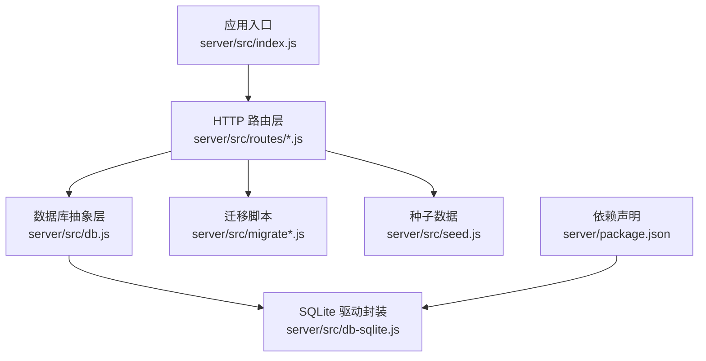
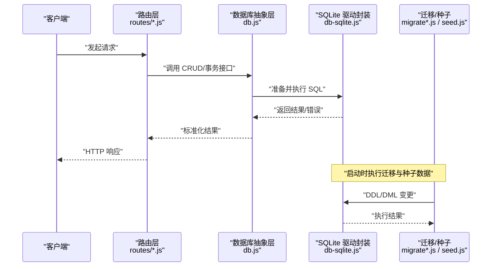
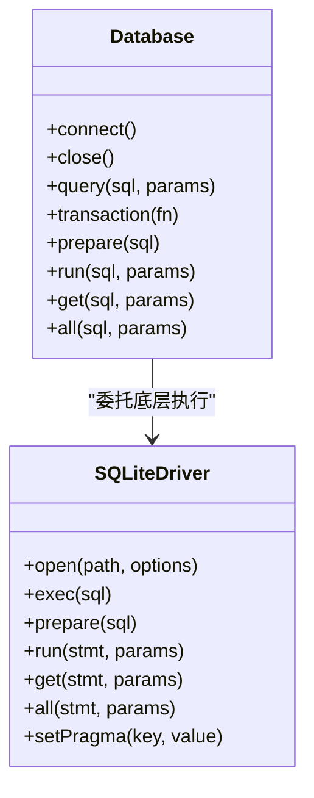
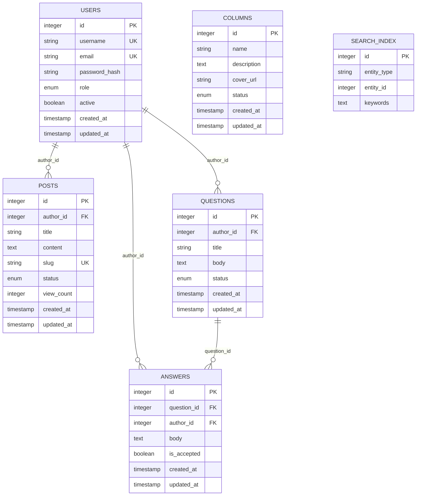
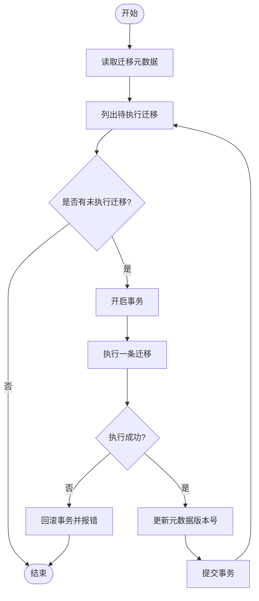
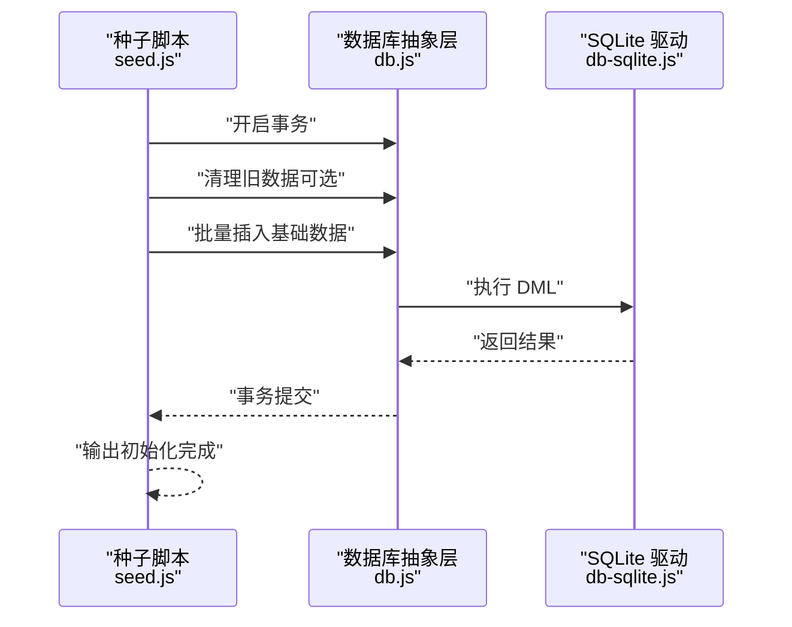
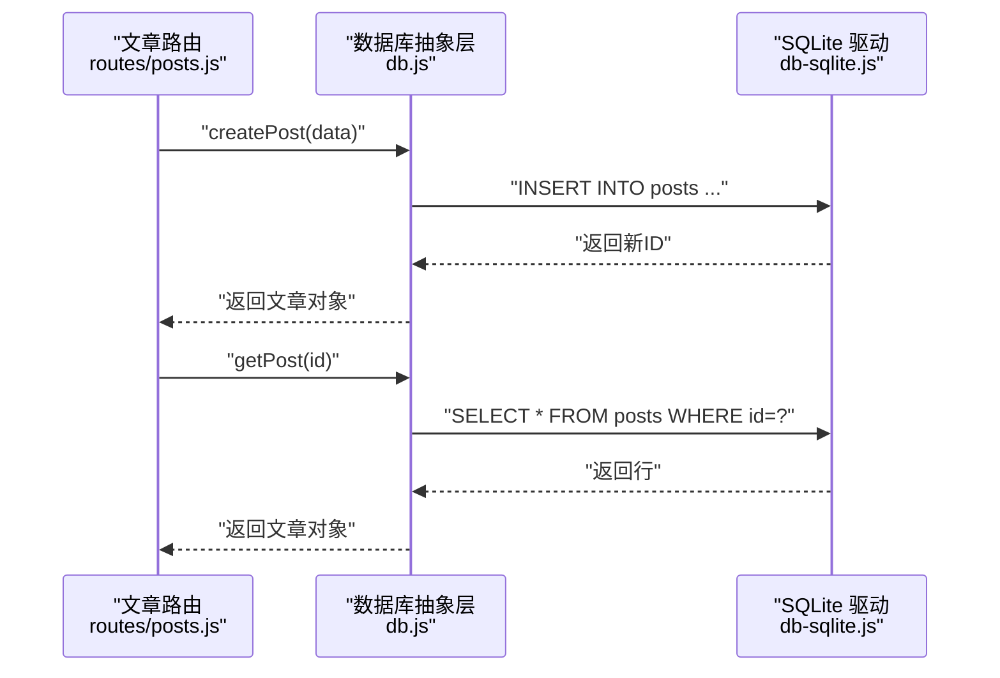
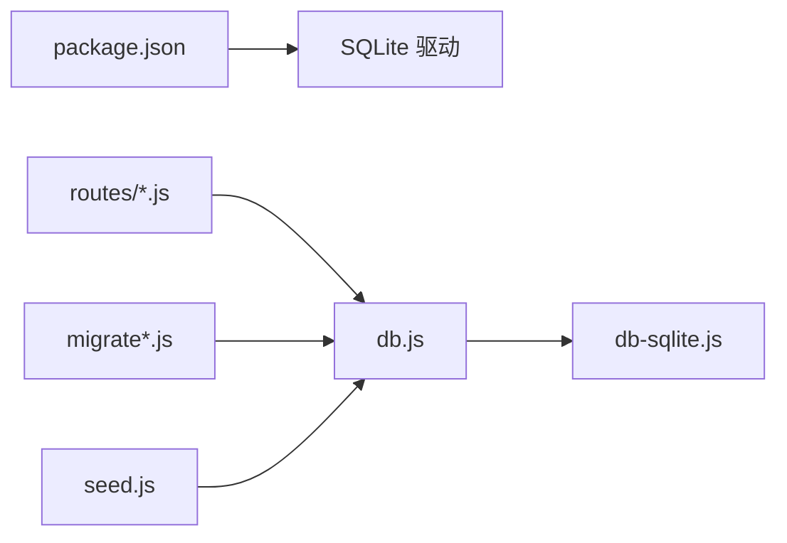

# 数据库层设计

<cite>
**本文引用的文件**   
- [server/src/db.js](file://server/src/db.js)
- [server/src/db-sqlite.js](file://server/src/db-sqlite.js)
- [server/src/migrate.js](file://server/src/migrate.js)
- [server/src/migrate-v3.js](file://server/src/migrate-v3.js)
- [server/src/migrate-draft.js](file://server/src/migrate-draft.js)
- [server/src/seed.js](file://server/src/seed.js)
- [server/src/routes/posts.js](file://server/src/routes/posts.js)
- [server/src/routes/users.js](file://server/src/routes/users.js)
- [server/src/routes/columns.js](file://server/src/routes/columns.js)
- [server/src/routes/questions.js](file://server/src/routes/questions.js)
- [server/src/routes/answers.js](file://server/src/routes/answers.js)
- [server/src/routes/ranking.js](file://server/src/routes/ranking.js)
- [server/src/routes/search.js](file://server/src/routes/search.js)
- [server/src/index.js](file://server/src/index.js)
- [server/package.json](file://server/package.json)
</cite>

## 目录
1. [简介](#简介)
2. [项目结构](#项目结构)
3. [核心组件](#核心组件)
4. [架构总览](#架构总览)
5. [详细组件分析](#详细组件分析)
6. [依赖分析](#依赖分析)
7. [性能考虑](#性能考虑)
8. [故障排查指南](#故障排查指南)
9. [结论](#结论)
10. [附录](#附录)

## 简介
本文件聚焦于后端数据库层的设计与实现，围绕 SQLite 连接管理、数据模型定义、迁移机制、种子数据、查询封装模式以及性能优化策略展开。目标是帮助开发者快速理解并高效维护数据库相关代码，同时提供可操作的排障建议与最佳实践。

## 项目结构
后端数据库相关代码集中在 server 目录下，关键文件包括：
- 数据库连接与驱动封装：db.js、db-sqlite.js
- 迁移脚本：migrate.js、migrate-v3.js、migrate-draft.js
- 种子数据：seed.js
- 路由层对数据的访问：routes/*.js
- 应用入口：index.js
- 依赖声明：package.json

图表来源
- [server/src/index.js](file://server/src/index.js)
- [server/src/db.js](file://server/src/db.js)
- [server/src/db-sqlite.js](file://server/src/db-sqlite.js)
- [server/src/migrate.js](file://server/src/migrate.js)
- [server/src/migrate-v3.js](file://server/src/migrate-v3.js)
- [server/src/migrate-draft.js](file://server/src/migrate-draft.js)
- [server/src/seed.js](file://server/src/seed.js)
- [server/package.json](file://server/package.json)

章节来源
- [server/src/index.js](file://server/src/index.js)
- [server/src/db.js](file://server/src/db.js)
- [server/src/db-sqlite.js](file://server/src/db-sqlite.js)
- [server/src/migrate.js](file://server/src/migrate.js)
- [server/src/migrate-v3.js](file://server/src/migrate-v3.js)
- [server/src/migrate-draft.js](file://server/src/migrate-draft.js)
- [server/src/seed.js](file://server/src/seed.js)
- [server/package.json](file://server/package.json)

## 核心组件
- 数据库抽象层（db.js）
  - 职责：统一对外暴露数据库操作接口，屏蔽底层驱动差异；提供事务、批量执行、错误处理等通用能力。
  - 关键点：连接生命周期管理、SQL 参数化、结果集标准化、异常包装。
- SQLite 驱动封装（db-sqlite.js）
  - 职责：基于 sqlite3 或 better-sqlite3 的轻量封装；负责连接建立、配置（如 WAL、PRAGMA）、语句准备与执行。
  - 关键点：连接池/单连接策略、并发安全、WAL 模式、超时与重试。
- 迁移系统（migrate*.js）
  - 职责：版本化数据库结构变更；支持增量更新与回滚；记录已执行迁移。
  - 关键点：迁移版本号、幂等性、失败回滚、跨环境一致性。
- 种子数据（seed.js）
  - 职责：为开发/测试环境生成初始数据；保证可重复初始化。
  - 关键点：幂等插入、清理策略、数据一致性校验。
- 路由层数据访问（routes/*.js）
  - 职责：将 HTTP 请求转换为数据访问调用；组织复杂查询与事务边界。
  - 关键点：输入校验、分页/排序、权限控制、错误响应。

章节来源
- [server/src/db.js](file://server/src/db.js)
- [server/src/db-sqlite.js](file://server/src/db-sqlite.js)
- [server/src/migrate.js](file://server/src/migrate.js)
- [server/src/migrate-v3.js](file://server/src/migrate-v3.js)
- [server/src/migrate-draft.js](file://server/src/migrate-draft.js)
- [server/src/seed.js](file://server/src/seed.js)
- [server/src/routes/posts.js](file://server/src/routes/posts.js)
- [server/src/routes/users.js](file://server/src/routes/users.js)
- [server/src/routes/columns.js](file://server/src/routes/columns.js)
- [server/src/routes/questions.js](file://server/src/routes/questions.js)
- [server/src/routes/answers.js](file://server/src/routes/answers.js)
- [server/src/routes/ranking.js](file://server/src/routes/ranking.js)
- [server/src/routes/search.js](file://server/src/routes/search.js)

## 架构总览
下图展示了从 HTTP 请求到数据库层的调用链路与关键组件交互。

图表来源
- [server/src/routes/posts.js](file://server/src/routes/posts.js)
- [server/src/routes/users.js](file://server/src/routes/users.js)
- [server/src/routes/columns.js](file://server/src/routes/columns.js)
- [server/src/routes/questions.js](file://server/src/routes/questions.js)
- [server/src/routes/answers.js](file://server/src/routes/answers.js)
- [server/src/routes/ranking.js](file://server/src/routes/ranking.js)
- [server/src/routes/search.js](file://server/src/routes/search.js)
- [server/src/db.js](file://server/src/db.js)
- [server/src/db-sqlite.js](file://server/src/db-sqlite.js)
- [server/src/migrate.js](file://server/src/migrate.js)
- [server/src/migrate-v3.js](file://server/src/migrate-v3.js)
- [server/src/migrate-draft.js](file://server/src/migrate-draft.js)
- [server/src/seed.js](file://server/src/seed.js)

## 详细组件分析

### 数据库连接管理与连接池配置（db.js、db-sqlite.js）
- 连接策略
  - 单进程内使用单个连接对象或轻量连接池，避免频繁创建销毁开销。
  - 通过 PRAGMA 开启 WAL 模式提升并发读性能。
- 配置项
  - 数据库路径、是否启用 WAL、日志开关、超时时间、最大重试次数。
- 错误处理
  - 统一捕获 SQLite 错误码，映射为业务错误类型；在事务中自动回滚。
- 资源释放
  - 应用退出时关闭连接，确保文件句柄释放。

图表来源
- [server/src/db.js](file://server/src/db.js)
- [server/src/db-sqlite.js](file://server/src/db-sqlite.js)

章节来源
- [server/src/db.js](file://server/src/db.js)
- [server/src/db-sqlite.js](file://server/src/db-sqlite.js)

### 数据模型定义（表结构、字段类型、约束与索引）
- 实体概览
  - 用户（users）：账号、认证信息、角色、状态、时间戳。
  - 文章（posts）：标题、内容、分类、作者、状态、统计、时间戳。
  - 专栏（columns）：名称、描述、封面、状态、时间戳。
  - 问答（questions、answers）：问题、答案、点赞/采纳、时间戳。
  - 搜索索引（search_index）：分词或关键词索引，用于全文检索。
- 字段类型与约束
  - 主键：自增整数或 UUID。
  - 外键：关联用户/文章/专栏等实体。
  - 唯一约束：用户名、邮箱、文章 slug 等。
  - 非空约束：关键字段必填。
  - 默认值：状态、计数、时间戳。
- 索引设计
  - 高频查询列建立索引（如作者ID、分类、状态、更新时间）。
  - 复合索引覆盖常见过滤+排序组合。
  - 全文检索采用虚拟表或辅助表（FTS5）以提升搜索性能。

图表来源
- [server/src/migrate.js](file://server/src/migrate.js)
- [server/src/migrate-v3.js](file://server/src/migrate-v3.js)
- [server/src/migrate-draft.js](file://server/src/migrate-draft.js)

章节来源
- [server/src/migrate.js](file://server/src/migrate.js)
- [server/src/migrate-v3.js](file://server/src/migrate-v3.js)
- [server/src/migrate-draft.js](file://server/src/migrate-draft.js)

### 数据库迁移机制（版本控制、增量更新、回滚）
- 版本控制
  - 每个迁移文件包含版本号与描述；按顺序执行。
  - 维护一个元数据表记录已执行迁移的版本号。
- 增量更新
  - 新增表/字段/索引/视图；保持幂等（IF NOT EXISTS）。
- 回滚策略
  - 提供反向迁移脚本；在失败时自动回滚当前事务。
- 执行流程

图表来源
- [server/src/migrate.js](file://server/src/migrate.js)
- [server/src/migrate-v3.js](file://server/src/migrate-v3.js)
- [server/src/migrate-draft.js](file://server/src/migrate-draft.js)

章节来源
- [server/src/migrate.js](file://server/src/migrate.js)
- [server/src/migrate-v3.js](file://server/src/migrate-v3.js)
- [server/src/migrate-draft.js](file://server/src/migrate-draft.js)

### 种子数据（开发与测试环境初始化）
- 目标
  - 快速构建一致的开发/测试数据集；支持幂等重建。
- 策略
  - 先清空或检测已有数据，再批量插入。
  - 使用事务保证一致性；失败则整体回滚。
- 典型步骤

图表来源
- [server/src/seed.js](file://server/src/seed.js)
- [server/src/db.js](file://server/src/db.js)
- [server/src/db-sqlite.js](file://server/src/db-sqlite.js)

章节来源
- [server/src/seed.js](file://server/src/seed.js)

### 查询封装模式（CRUD、复杂查询、事务）
- 通用 CRUD
  - create/get/all/update/delete 方法封装参数化查询与结果标准化。
- 复杂查询
  - 动态条件拼接、分页、排序、聚合统计；避免字符串拼接注入风险。
- 事务处理
  - 多步写入包裹在事务中；异常自动回滚；提供回调式 API。
- 示例调用序列（以文章为例）

图表来源
- [server/src/routes/posts.js](file://server/src/routes/posts.js)
- [server/src/db.js](file://server/src/db.js)
- [server/src/db-sqlite.js](file://server/src/db-sqlite.js)

章节来源
- [server/src/routes/posts.js](file://server/src/routes/posts.js)
- [server/src/db.js](file://server/src/db.js)
- [server/src/db-sqlite.js](file://server/src/db-sqlite.js)

### 数据访问层抽象设计与最佳实践
- 分层清晰
  - 路由层只关注请求/响应与业务编排；数据访问由 db.js 统一提供。
- 参数化与校验
  - 所有外部输入必须参数化；在服务端进行类型与范围校验。
- 错误与日志
  - 统一错误码与消息；记录关键 SQL 与耗时（仅开发环境）。
- 事务边界
  - 写操作尽量短事务；长事务拆分为多个小事务。
- 可测试性
  - 通过注入 mock 数据库实例进行单元测试。

章节来源
- [server/src/db.js](file://server/src/db.js)
- [server/src/db-sqlite.js](file://server/src/db-sqlite.js)
- [server/src/routes/users.js](file://server/src/routes/users.js)
- [server/src/routes/columns.js](file://server/src/routes/columns.js)
- [server/src/routes/questions.js](file://server/src/routes/questions.js)
- [server/src/routes/answers.js](file://server/src/routes/answers.js)
- [server/src/routes/ranking.js](file://server/src/routes/ranking.js)
- [server/src/routes/search.js](file://server/src/routes/search.js)

## 依赖分析
- 运行时依赖
  - SQLite 驱动（sqlite3 或 better-sqlite3），在 package.json 中声明。
- 模块耦合
  - routes 依赖 db.js；db.js 依赖 db-sqlite.js；迁移与种子脚本直接调用 db.js。
- 潜在循环依赖
  - 避免在 db.js 中引入 routes；保持单向依赖。

图表来源
- [server/package.json](file://server/package.json)
- [server/src/db.js](file://server/src/db.js)
- [server/src/db-sqlite.js](file://server/src/db-sqlite.js)
- [server/src/migrate.js](file://server/src/migrate.js)
- [server/src/migrate-v3.js](file://server/src/migrate-v3.js)
- [server/src/migrate-draft.js](file://server/src/migrate-draft.js)
- [server/src/seed.js](file://server/src/seed.js)
- [server/src/routes/posts.js](file://server/src/routes/posts.js)
- [server/src/routes/users.js](file://server/src/routes/users.js)
- [server/src/routes/columns.js](file://server/src/routes/columns.js)
- [server/src/routes/questions.js](file://server/src/routes/questions.js)
- [server/src/routes/answers.js](file://server/src/routes/answers.js)
- [server/src/routes/ranking.js](file://server/src/routes/ranking.js)
- [server/src/routes/search.js](file://server/src/routes/search.js)

章节来源
- [server/package.json](file://server/package.json)
- [server/src/db.js](file://server/src/db.js)
- [server/src/db-sqlite.js](file://server/src/db-sqlite.js)
- [server/src/migrate.js](file://server/src/migrate.js)
- [server/src/migrate-v3.js](file://server/src/migrate-v3.js)
- [server/src/migrate-draft.js](file://server/src/migrate-draft.js)
- [server/src/seed.js](file://server/src/seed.js)
- [server/src/routes/posts.js](file://server/src/routes/posts.js)
- [server/src/routes/users.js](file://server/src/routes/users.js)
- [server/src/routes/columns.js](file://server/src/routes/columns.js)
- [server/src/routes/questions.js](file://server/src/routes/questions.js)
- [server/src/routes/answers.js](file://server/src/routes/answers.js)
- [server/src/routes/ranking.js](file://server/src/routes/ranking.js)
- [server/src/routes/search.js](file://server/src/routes/search.js)

## 性能考虑
- 连接与并发
  - 使用 WAL 模式提高并发读性能；合理设置 PRAGMA（如 journal_mode=WAL、synchronous=NORMAL）。
  - 避免长事务；将大事务拆分为多个小事务。
- 索引与查询
  - 为高频过滤/排序列建立索引；使用 EXPLAIN ANALYZE 验证执行计划。
  - 避免 SELECT *，按需选择字段；合理使用 LIMIT/OFFSET 或游标分页。
- I/O 与磁盘
  - 将数据库文件置于 SSD；生产环境考虑独立存储卷。
  - 定期 VACUUM 与 REINDEX 维护碎片。
- 序列化与缓存
  - 热点数据加入内存缓存（如 Redis）；减少重复查询。
- 监控与诊断
  - 记录慢查询日志；结合指标监控 QPS、延迟与错误率。

[本节为通用指导，不直接分析具体文件]

## 故障排查指南
- 常见问题
  - 数据库锁定：检查是否存在长事务或未正确关闭连接；确认 WAL 模式。
  - 迁移失败：查看迁移元数据表；定位失败版本并修复后重新执行。
  - 种子数据不一致：确认幂等逻辑与事务回滚；必要时重建数据库。
  - 查询缓慢：检查缺失索引、全表扫描、N+1 查询问题。
- 定位步骤
  - 启用详细日志（仅开发环境）；打印关键 SQL 与参数。
  - 使用 EXPLAIN/EXPLAIN QUERY PLAN 分析执行计划。
  - 复现最小用例，隔离网络与外部依赖。
- 恢复策略
  - 备份数据库文件；回滚到上一个稳定版本；逐步重放迁移。

章节来源
- [server/src/migrate.js](file://server/src/migrate.js)
- [server/src/migrate-v3.js](file://server/src/migrate-v3.js)
- [server/src/migrate-draft.js](file://server/src/migrate-draft.js)
- [server/src/seed.js](file://server/src/seed.js)
- [server/src/db.js](file://server/src/db.js)
- [server/src/db-sqlite.js](file://server/src/db-sqlite.js)

## 结论
本数据库层以简洁清晰的抽象为核心，围绕 SQLite 提供了稳定的连接管理、完善的迁移与种子机制，并通过统一的查询封装提升了可维护性与可测试性。配合合理的索引与事务策略，可在中小规模场景下获得良好的性能与稳定性。建议在后续迭代中持续完善监控与慢查询治理，逐步引入缓存与读写分离方案以支撑更高负载。

## 附录
- 环境变量与配置
  - 数据库路径、WAL 开关、日志级别、迁移开关等可通过配置文件或环境变量注入。
- 运行命令参考
  - 启动服务前执行迁移与种子数据；生产环境谨慎执行种子数据。
- 扩展建议
  - 引入连接池库（如 bunyan/sqlite-pool）；增加健康检查与优雅停机。

[本节为补充说明，不直接分析具体文件]