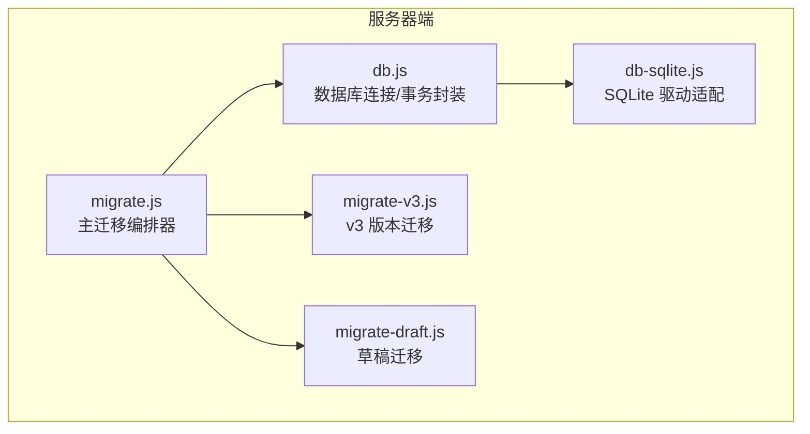
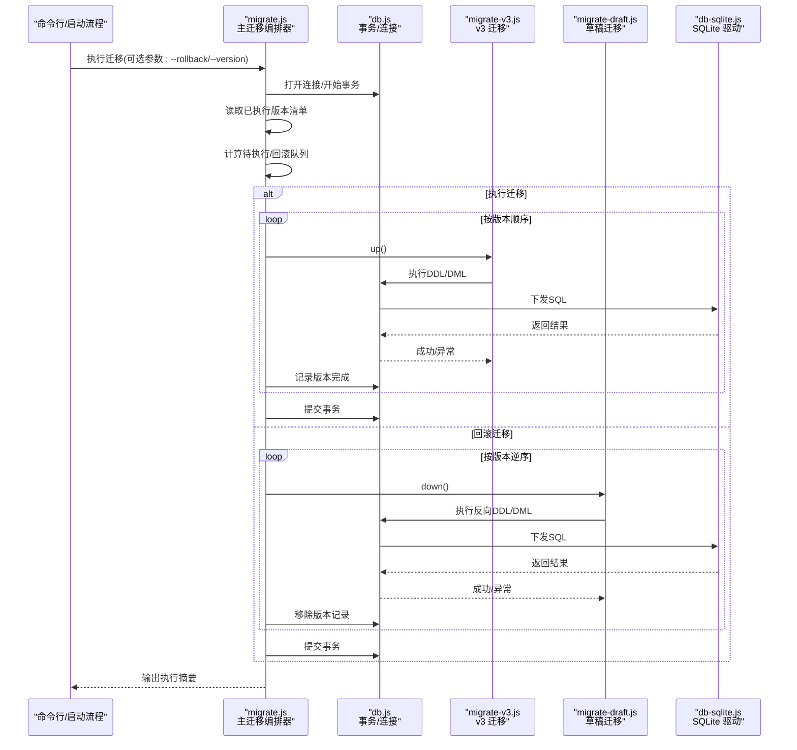
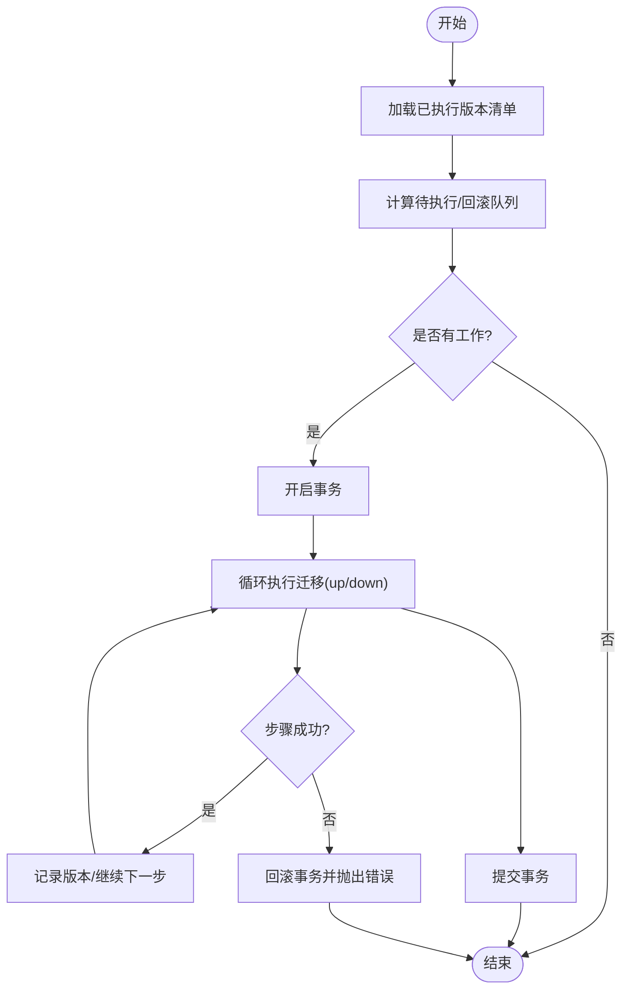
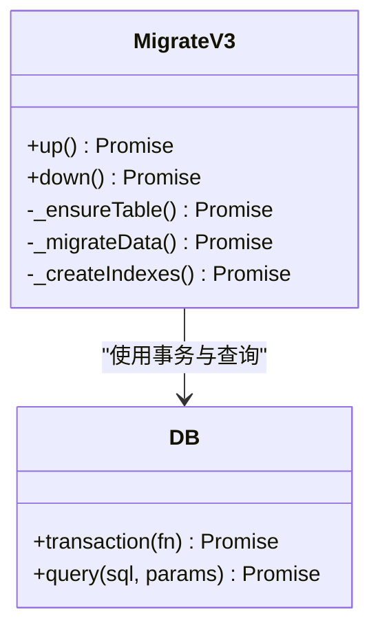
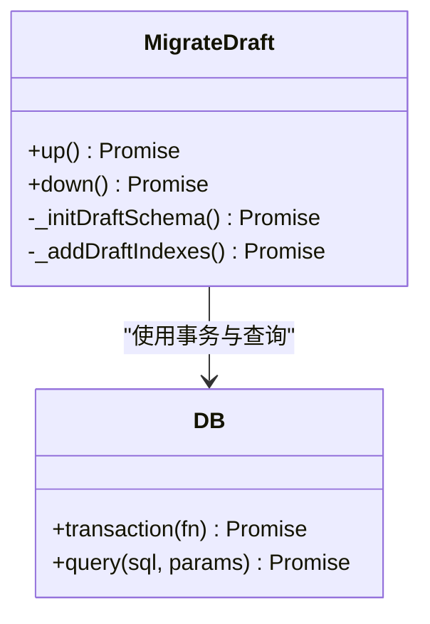
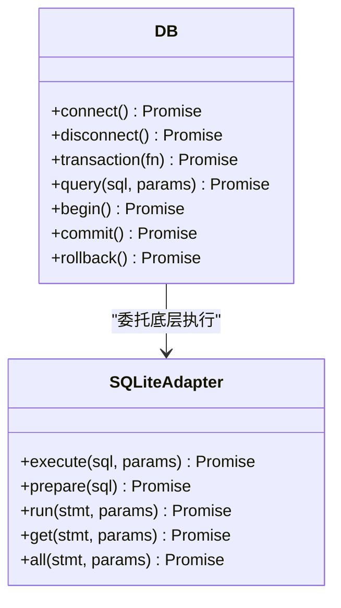
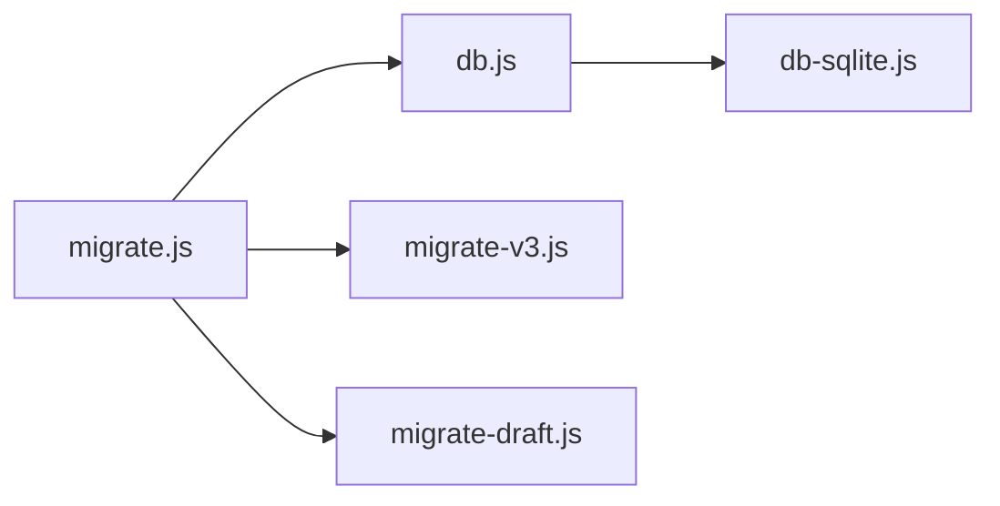

# 数据库迁移系统

<cite>
**本文引用的文件**   
- [server/src/migrate.js](file://server/src/migrate.js)
- [server/src/migrate-v3.js](file://server/src/migrate-v3.js)
- [server/src/migrate-draft.js](file://server/src/migrate-draft.js)
- [server/src/db.js](file://server/src/db.js)
- [server/src/db-sqlite.js](file://server/src/db-sqlite.js)
- [server/package.json](file://server/package.json)
</cite>

## 目录
1. [简介](#简介)
2. [项目结构](#项目结构)
3. [核心组件](#核心组件)
4. [架构总览](#架构总览)
5. [详细组件分析](#详细组件分析)
6. [依赖关系分析](#依赖关系分析)
7. [性能考虑](#性能考虑)
8. [故障排查指南](#故障排查指南)
9. [结论](#结论)
10. [附录](#附录)

## 简介
本文件面向数据库迁移子系统，系统性阐述其架构设计、版本控制机制、增量更新策略与回滚能力。重点解析主迁移脚本 migrate.js 的工作流程，说明如何按版本顺序执行变更；深入解读 v3 迁移与草稿迁移的实现要点，包括历史数据兼容性与数据结构演进策略；并提供迁移脚本编写规范、测试方法与部署流程，以及失败处理与恢复方案。

## 项目结构
迁移相关代码集中在 server/src 目录下，包含：
- 主迁移编排器：migrate.js
- 具体版本迁移：migrate-v3.js、migrate-draft.js
- 数据库连接与驱动封装：db.js、db-sqlite.js
- 服务包配置：package.json（用于定义运行命令）

图表来源
- [server/src/migrate.js](file://server/src/migrate.js)
- [server/src/migrate-v3.js](file://server/src/migrate-v3.js)
- [server/src/migrate-draft.js](file://server/src/migrate-draft.js)
- [server/src/db.js](file://server/src/db.js)
- [server/src/db-sqlite.js](file://server/src/db-sqlite.js)

章节来源
- [server/src/migrate.js](file://server/src/migrate.js)
- [server/src/migrate-v3.js](file://server/src/migrate-v3.js)
- [server/src/migrate-draft.js](file://server/src/migrate-draft.js)
- [server/src/db.js](file://server/src/db.js)
- [server/src/db-sqlite.js](file://server/src/db-sqlite.js)
- [server/package.json](file://server/package.json)

## 核心组件
- 主迁移编排器（migrate.js）
  - 负责发现并排序待执行的迁移脚本
  - 维护迁移元数据（如已执行版本清单）
  - 在事务中依次执行每个迁移，确保原子性
  - 提供回滚入口，支持按版本反向操作
- 版本迁移脚本（migrate-v3.js、migrate-draft.js）
  - 每个脚本对应一次具体的结构或数据变更
  - 实现 up() 与 down() 方法，分别表示正向升级与反向降级
  - 保证幂等与可重入，避免重复执行造成副作用
- 数据库层（db.js、db-sqlite.js）
  - 统一连接管理、事务边界、错误传播
  - 对底层驱动（SQLite）进行适配，屏蔽差异

章节来源
- [server/src/migrate.js](file://server/src/migrate.js)
- [server/src/migrate-v3.js](file://server/src/migrate-v3.js)
- [server/src/migrate-draft.js](file://server/src/migrate-draft.js)
- [server/src/db.js](file://server/src/db.js)
- [server/src/db-sqlite.js](file://server/src/db-sqlite.js)

## 架构总览
迁移系统的整体调用链如下：命令行或启动流程触发主迁移器，主迁移器加载并排序迁移脚本，逐个在事务内执行 up()；若需要回滚，则按逆序执行 down()。所有 I/O 通过 db.js 抽象到 db-sqlite.js 的 SQLite 驱动。

图表来源
- [server/src/migrate.js](file://server/src/migrate.js)
- [server/src/migrate-v3.js](file://server/src/migrate-v3.js)
- [server/src/migrate-draft.js](file://server/src/migrate-draft.js)
- [server/src/db.js](file://server/src/db.js)
- [server/src/db-sqlite.js](file://server/src/db-sqlite.js)

## 详细组件分析

### 主迁移编排器（migrate.js）
职责与流程
- 版本发现与排序：扫描迁移脚本集合，依据版本号升序确定执行顺序
- 状态管理：维护“已执行版本”集合，避免重复执行
- 事务保障：将多个迁移包裹在一个事务中，任一失败整体回滚
- 回滚策略：根据目标版本或最近一次版本，逆序执行 down()
- 日志与诊断：输出每步执行结果与错误堆栈，便于定位问题

关键设计点
- 幂等性：up()/down() 需具备幂等特性，允许安全重试
- 隔离性：迁移期间尽量降低锁竞争，必要时分批次提交大表变更
- 兼容性：新增字段默认值、索引重建等需考虑在线场景

图表来源
- [server/src/migrate.js](file://server/src/migrate.js)

章节来源
- [server/src/migrate.js](file://server/src/migrate.js)

### v3 迁移（migrate-v3.js）
目标
- 引入 v3 版本的数据库结构变更（例如新增表、字段、索引或约束）
- 保证从旧版本平滑升级到 v3，同时保留历史数据

实现要点
- up()：创建新对象/列、迁移既有数据、建立索引与约束
- down()：撤销新增结构、还原数据形态（尽可能保持可逆）
- 数据兼容：为新增字段设置合理默认值，避免空值导致业务异常
- 性能优化：大批量数据迁移时采用分批处理，减少长事务锁

图表来源
- [server/src/migrate-v3.js](file://server/src/migrate-v3.js)
- [server/src/db.js](file://server/src/db.js)

章节来源
- [server/src/migrate-v3.js](file://server/src/migrate-v3.js)
- [server/src/db.js](file://server/src/db.js)

### 草稿迁移（migrate-draft.js）
目标
- 为草稿功能引入必要的结构变更（例如草稿表、关联字段、索引）
- 确保与现有文章/问答等实体保持一致的数据模型约定

实现要点
- up()：创建草稿表或添加草稿相关字段，建立必要索引
- down()：清理草稿相关结构，注意外键与索引的删除顺序
- 数据一致性：草稿与发布态数据的转换规则需在应用层配合迁移脚本共同保证

图表来源
- [server/src/migrate-draft.js](file://server/src/migrate-draft.js)
- [server/src/db.js](file://server/src/db.js)

章节来源
- [server/src/migrate-draft.js](file://server/src/migrate-draft.js)
- [server/src/db.js](file://server/src/db.js)

### 数据库层（db.js 与 db-sqlite.js）
职责
- db.js：对外暴露统一的数据库接口，封装事务、批量执行、错误包装
- db-sqlite.js：针对 SQLite 的具体实现，处理连接、语句准备与结果集映射

设计原则
- 事务优先：迁移必须通过事务执行，保证原子性
- 错误透传：将底层错误转换为统一错误类型，附带上下文信息
- 驱动解耦：上层迁移逻辑不感知具体驱动细节

图表来源
- [server/src/db.js](file://server/src/db.js)
- [server/src/db-sqlite.js](file://server/src/db-sqlite.js)

章节来源
- [server/src/db.js](file://server/src/db.js)
- [server/src/db-sqlite.js](file://server/src/db-sqlite.js)

## 依赖关系分析
迁移系统内部依赖清晰，主编排器依赖数据库抽象层与各版本迁移脚本；各迁移脚本仅依赖数据库抽象层，避免相互耦合。

图表来源
- [server/src/migrate.js](file://server/src/migrate.js)
- [server/src/migrate-v3.js](file://server/src/migrate-v3.js)
- [server/src/migrate-draft.js](file://server/src/migrate-draft.js)
- [server/src/db.js](file://server/src/db.js)
- [server/src/db-sqlite.js](file://server/src/db-sqlite.js)

章节来源
- [server/src/migrate.js](file://server/src/migrate.js)
- [server/src/migrate-v3.js](file://server/src/migrate-v3.js)
- [server/src/migrate-draft.js](file://server/src/migrate-draft.js)
- [server/src/db.js](file://server/src/db.js)
- [server/src/db-sqlite.js](file://server/src/db-sqlite.js)

## 性能考虑
- 分批迁移：对大表增删改操作采用分批提交，避免长事务导致的锁等待与内存占用
- 索引策略：先建表后建索引，必要时在低峰期执行耗时索引构建
- 并发控制：迁移期间限制写入流量，防止与业务请求争用资源
- 监控指标：记录每步执行时长、影响行数与错误率，便于容量规划与回归分析

[本节为通用指导，无需源码引用]

## 故障排查指南
常见问题与定位思路
- 迁移未生效
  - 检查已执行版本清单是否被正确记录
  - 确认迁移脚本命名与版本排序是否符合预期
- 事务回滚
  - 查看最后一步 SQL 的错误堆栈，定位语法或约束冲突
  - 验证数据是否符合新增约束（唯一、非空、外键）
- 性能退化
  - 评估是否存在全表扫描或缺失索引
  - 检查是否因长事务导致锁竞争
- 回滚失败
  - 确认 down() 是否覆盖所有 up() 变更
  - 核对依赖删除顺序（索引→约束→列→表）

建议的诊断手段
- 启用详细日志，记录每条 SQL 与执行时间
- 在预生产环境复现线上数据规模，观察慢查询与锁等待
- 对关键迁移编写单元测试，覆盖 up/down 双向路径

章节来源
- [server/src/migrate.js](file://server/src/migrate.js)
- [server/src/db.js](file://server/src/db.js)

## 结论
本迁移系统以主编排器为核心，结合版本化迁移脚本与事务化数据库抽象，实现了可靠的增量升级与回滚能力。通过幂等设计、分批执行与完善的错误处理，能够在复杂数据演进场景中保持稳定与可恢复性。后续可在自动化流水线中集成迁移校验与灰度发布策略，进一步提升交付质量与风险控制。

[本节为总结性内容，无需源码引用]

## 附录

### 迁移脚本编写规范
- 命名与版本
  - 使用语义化版本号或递增序号，确保严格升序
  - 文件名应体现迁移主题与版本，便于检索
- 函数契约
  - 每个迁移脚本需提供 up() 与 down()，均返回 Promise
  - up() 描述从上一版本到当前版本的变更；down() 描述反向操作
- 幂等与可重入
  - 使用 IF NOT EXISTS / DROP IF EXISTS 等条件语句
  - 避免重复插入或重复创建索引
- 事务与批处理
  - 所有变更置于事务中；大数据量操作分批提交
- 数据兼容
  - 新增字段设置合理默认值
  - 对历史数据进行清洗与填充，保证业务可用性
- 文档与注释
  - 在脚本头部注明目的、影响范围与注意事项
  - 记录已知风险与回滚前提

[本节为通用规范，无需源码引用]

### 测试方法
- 单元级测试
  - 对每个迁移脚本的 up()/down() 进行独立测试
  - 构造最小数据集，验证结构与数据一致性
- 集成级测试
  - 在临时数据库中执行完整迁移序列，再回滚至初始状态
  - 模拟并发访问，验证锁与性能表现
- 回归测试
  - 基于真实数据快照，验证迁移前后查询结果一致
- 工具建议
  - 使用轻量数据库容器快速搭建测试环境
  - 借助断言库对比 schema 与数据快照

[本节为通用方法，无需源码引用]

### 部署流程
- 本地验证
  - 在开发/测试环境执行迁移，确认无报错且业务正常
- 预生产演练
  - 使用接近生产的数据规模进行演练，评估耗时与资源占用
- 灰度发布
  - 先在单节点执行迁移，观察指标稳定后再全量滚动
- 回滚预案
  - 提前准备 down() 脚本与备份策略
  - 明确回滚触发条件与审批流程
- 上线后监控
  - 关注错误率、慢查询与锁等待指标
  - 收集用户反馈，必要时热修复

[本节为通用流程，无需源码引用]

### 失败处理与恢复方案
- 自动回滚
  - 任何一步失败立即回滚事务，确保数据库处于一致状态
- 部分成功恢复
  - 若出现中断，重新执行迁移编排器，利用幂等性安全重试
- 人工干预
  - 对于不可逆变更，优先恢复备份，再修正迁移脚本后重试
- 审计与追踪
  - 记录每次迁移的执行时间、受影响对象与错误详情
  - 将审计日志纳入集中式日志平台，便于追溯

[本节为通用方案，无需源码引用]