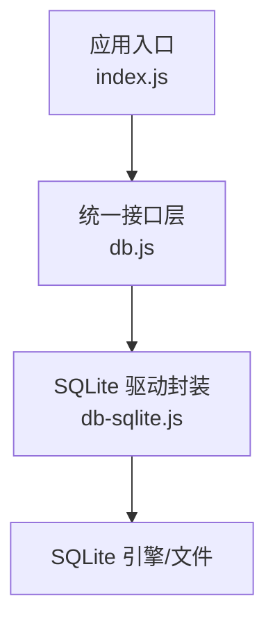
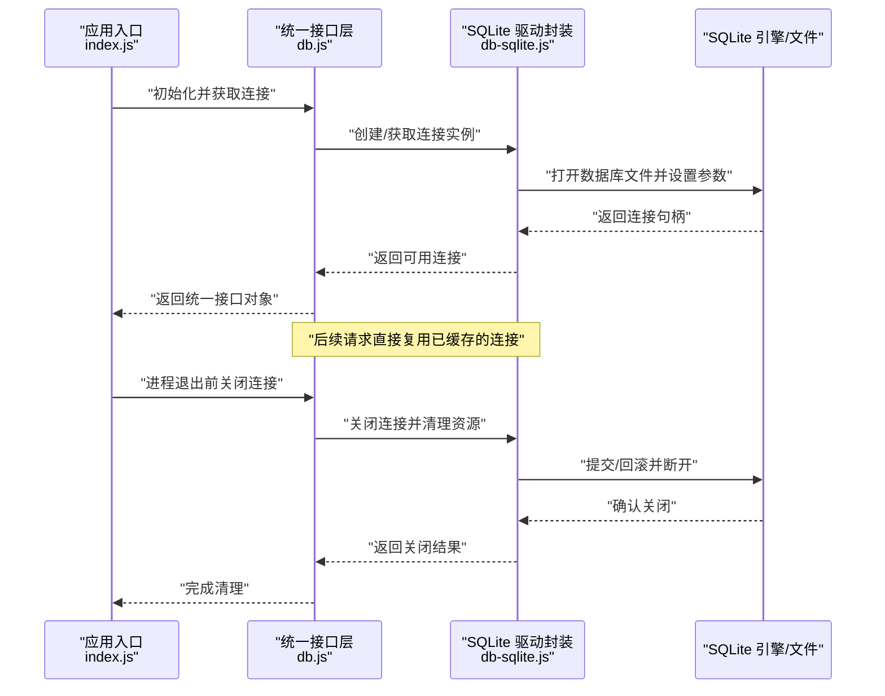
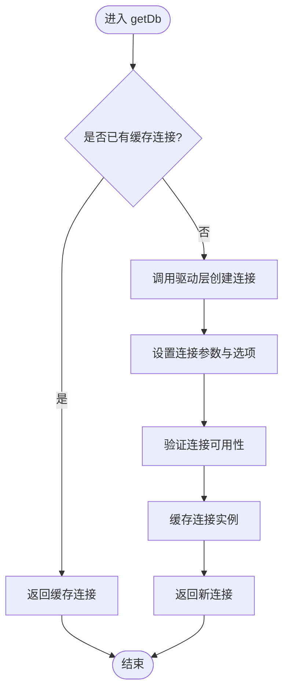
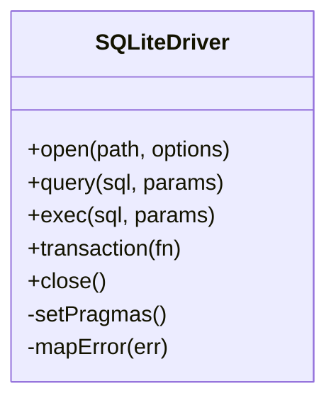
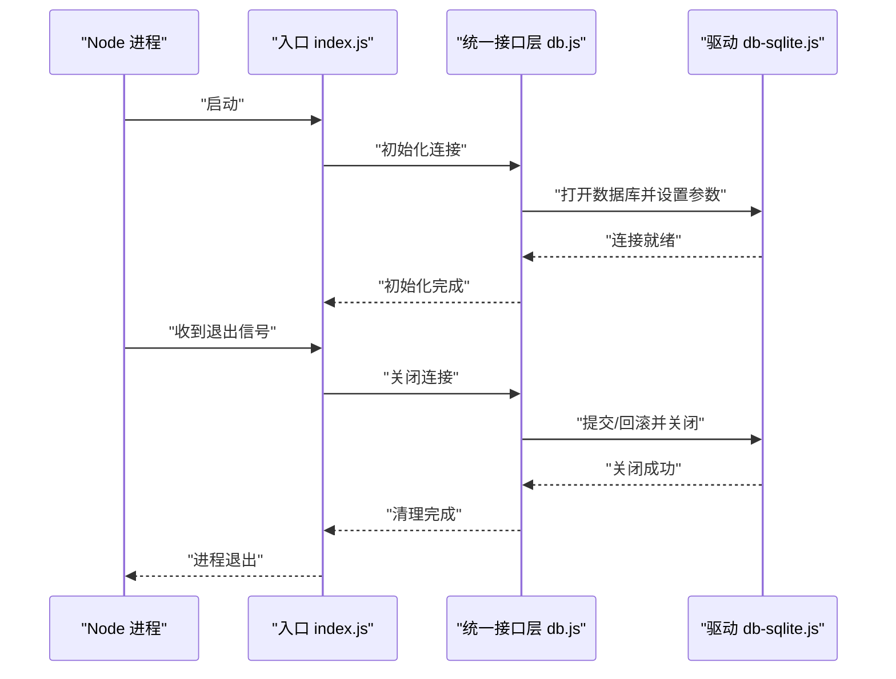

# 数据库连接管理

<cite>
**本文引用的文件**   
- [server/src/db.js](file://server/src/db.js)
- [server/src/db-sqlite.js](file://server/src/db-sqlite.js)
- [server/src/index.js](file://server/src/index.js)
</cite>

## 目录
1. [简介](#简介)
2. [项目结构](#项目结构)
3. [核心组件](#核心组件)
4. [架构总览](#架构总览)
5. [详细组件分析](#详细组件分析)
6. [依赖关系分析](#依赖关系分析)
7. [性能考虑](#性能考虑)
8. [故障排查指南](#故障排查指南)
9. [结论](#结论)
10. [附录：使用示例与最佳实践](#附录使用示例与最佳实践)

## 简介
本文件聚焦于后端数据库连接管理，围绕 SQLite 的连接配置、初始化、错误处理与连接复用机制展开。文档重点解析 server/src/db.js 与 server/src/db-sqlite.js 的职责分工，说明连接生命周期（建立、维护、关闭）以及性能优化策略，并提供常见问题的解决方案与正确使用方式。

## 项目结构
与本主题相关的核心文件位于 server/src 目录下：
- db.js：对外暴露统一的数据库访问接口，负责连接实例的获取、缓存与复用。
- db-sqlite.js：SQLite 驱动封装，负责具体连接的创建、参数设置与底层操作。
- index.js：应用入口，负责在进程启动时初始化数据库连接并在退出时优雅关闭。

图表来源
- [server/src/index.js](file://server/src/index.js)
- [server/src/db.js](file://server/src/db.js)
- [server/src/db-sqlite.js](file://server/src/db-sqlite.js)

章节来源
- [server/src/index.js](file://server/src/index.js)
- [server/src/db.js](file://server/src/db.js)
- [server/src/db-sqlite.js](file://server/src/db-sqlite.js)

## 核心组件
- 统一接口层（db.js）
  - 职责：提供 getDb() 等统一方法，屏蔽底层驱动差异；实现连接实例的单例化与复用；集中处理连接状态与错误。
  - 关键点：懒加载、单例缓存、异常捕获与重试提示、对外只暴露稳定 API。
- SQLite 驱动封装（db-sqlite.js）
  - 职责：基于 sqlite3 或兼容库创建连接；设置 WAL 模式、超时、并发控制等参数；封装常用查询与事务操作。
  - 关键点：连接参数校验、WAL 写入模式、busy 处理、错误码映射。
- 应用入口（index.js）
  - 职责：在进程启动阶段调用初始化函数完成连接建立；监听进程退出信号，执行关闭流程释放资源。

章节来源
- [server/src/db.js](file://server/src/db.js)
- [server/src/db-sqlite.js](file://server/src/db-sqlite.js)
- [server/src/index.js](file://server/src/index.js)

## 架构总览
下图展示了从应用入口到 SQLite 的数据通路与控制流，强调连接复用与生命周期管理。

图表来源
- [server/src/index.js](file://server/src/index.js)
- [server/src/db.js](file://server/src/db.js)
- [server/src/db-sqlite.js](file://server/src/db-sqlite.js)

## 详细组件分析

### 统一接口层（db.js）
- 设计要点
  - 单例与缓存：首次调用时创建连接并缓存，后续调用直接返回同一实例，避免重复打开文件句柄。
  - 懒加载：按需初始化，减少冷启动开销。
  - 错误隔离：对底层异常进行包装，向上抛出更友好的错误信息，便于上层统一处理。
  - 对外 API：仅暴露稳定的方法（如查询、事务），隐藏内部连接细节。
- 关键流程
  - 获取连接：检查缓存是否存在，不存在则委托驱动层创建。
  - 健康检查：可选地执行轻量查询验证连接可用性。
  - 关闭连接：触发驱动层关闭并清空缓存，确保进程退出后无残留句柄。

图表来源
- [server/src/db.js](file://server/src/db.js)

章节来源
- [server/src/db.js](file://server/src/db.js)

### SQLite 驱动封装（db-sqlite.js）
- 设计要点
  - 连接参数：包括数据库路径、WAL 模式、同步策略、超时与 busy 处理等。
  - 错误处理：将底层错误码转换为统一错误类型，记录上下文以便定位问题。
  - 事务支持：封装 begin/commit/rollback 流程，保证一致性。
  - 资源清理：确保 close 后不再被复用，防止“连接已关闭”类错误。
- 关键流程
  - 打开数据库：根据路径创建连接，设置 PRAGMA 参数。
  - 执行语句：提供 query/exec 等方法，统一错误捕获与日志输出。
  - 关闭连接：提交未决事务，释放句柄并标记不可用。

图表来源
- [server/src/db-sqlite.js](file://server/src/db-sqlite.js)

章节来源
- [server/src/db-sqlite.js](file://server/src/db-sqlite.js)

### 应用入口（index.js）
- 设计要点
  - 启动阶段：调用统一接口的初始化方法，确保连接就绪后再启动服务。
  - 优雅关闭：监听 SIGINT/SIGTERM，按顺序关闭数据库连接并等待完成。
  - 错误上报：在关闭失败时记录日志，辅助运维排障。
- 关键流程
  - 初始化：加载配置、创建连接、预热必要索引或表结构。
  - 运行期：业务模块通过统一接口访问数据库。
  - 退出：触发关闭流程，确保数据落盘与资源释放。

图表来源
- [server/src/index.js](file://server/src/index.js)
- [server/src/db.js](file://server/src/db.js)
- [server/src/db-sqlite.js](file://server/src/db-sqlite.js)

章节来源
- [server/src/index.js](file://server/src/index.js)

## 依赖关系分析
- 耦合关系
  - index.js 依赖 db.js 提供的统一接口，不直接感知底层驱动。
  - db.js 依赖 db-sqlite.js 的具体实现，但通过抽象方法解耦。
- 外部依赖
  - SQLite 驱动库（sqlite3 或兼容实现）。
  - Node.js 事件循环与进程信号处理。
- 潜在风险
  - 若 db.js 未正确缓存连接，可能导致频繁打开/关闭文件句柄，引发性能退化。
  - 若未设置 WAL 或 busy 处理不当，在高并发写场景下可能出现锁竞争。

图表来源
- [server/src/index.js](file://server/src/index.js)
- [server/src/db.js](file://server/src/db.js)
- [server/src/db-sqlite.js](file://server/src/db-sqlite.js)

章节来源
- [server/src/index.js](file://server/src/index.js)
- [server/src/db.js](file://server/src/db.js)
- [server/src/db-sqlite.js](file://server/src/db-sqlite.js)

## 性能考虑
- 连接复用
  - 通过单例缓存避免重复创建连接，降低系统调用与文件句柄开销。
- WAL 模式
  - 启用 WAL 可提升并发读性能，减少写阻塞，适合博客问答类读写混合负载。
- Busy 与超时
  - 合理设置 busy timeout 与锁等待策略，避免瞬时高并发导致的失败。
- 批量与事务
  - 将多条写入合并为事务，减少磁盘同步次数，提高吞吐。
- 预热与索引
  - 启动阶段预建必要索引，缩短首请求延迟。

[本节为通用性能建议，不直接分析具体文件]

## 故障排查指南
- 常见问题
  - 连接已关闭：检查是否在关闭后仍复用连接实例，确保关闭后清空缓存。
  - 数据库锁定：调整 busy timeout 与 WAL 设置，避免长时间持有写锁。
  - 权限不足：确认数据库文件路径与进程用户权限。
  - 路径错误：校验相对/绝对路径与环境变量配置。
- 定位步骤
  - 在驱动层增加错误码与 SQL 上下文日志。
  - 在统一接口层记录连接状态变化（创建、复用、关闭）。
  - 使用进程信号钩子打印关闭阶段的堆栈与耗时。

章节来源
- [server/src/db.js](file://server/src/db.js)
- [server/src/db-sqlite.js](file://server/src/db-sqlite.js)
- [server/src/index.js](file://server/src/index.js)

## 结论
通过将连接管理与驱动封装分层，本项目实现了清晰的职责边界与良好的可维护性。db.js 负责连接复用与对外契约，db-sqlite.js 专注 SQLite 特性与参数调优，index.js 保障生命周期管理。配合 WAL、事务与合理的超时策略，可在单机 SQLite 场景下获得稳定且高效的数据库访问能力。

[本节为总结性内容，不直接分析具体文件]

## 附录：使用示例与最佳实践
- 基本用法
  - 在应用启动时初始化连接，随后在各路由或服务中通过统一接口获取连接进行查询与写入。
  - 在进程退出时显式关闭连接，确保资源释放。
- 配置建议
  - 数据库路径：优先使用绝对路径，避免跨平台差异。
  - WAL 模式：开启以提升并发读性能。
  - 超时与忙等待：根据业务 QPS 与写入比例调优。
- 代码片段路径参考
  - 获取连接与复用：参见 [server/src/db.js](file://server/src/db.js)
  - 驱动封装与参数设置：参见 [server/src/db-sqlite.js](file://server/src/db-sqlite.js)
  - 启动与关闭流程：参见 [server/src/index.js](file://server/src/index.js)

章节来源
- [server/src/db.js](file://server/src/db.js)
- [server/src/db-sqlite.js](file://server/src/db-sqlite.js)
- [server/src/index.js](file://server/src/index.js)