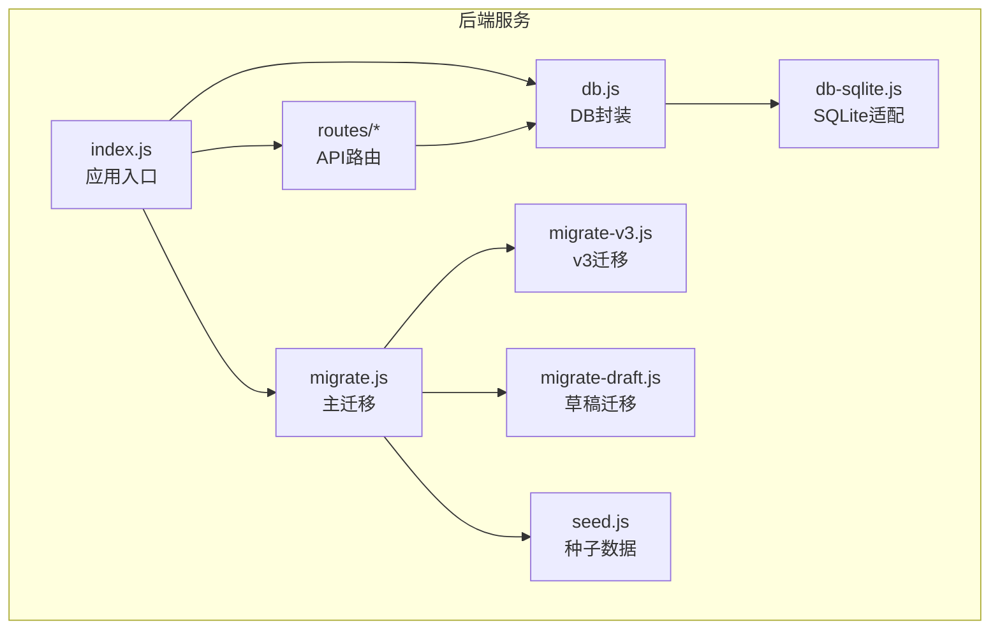
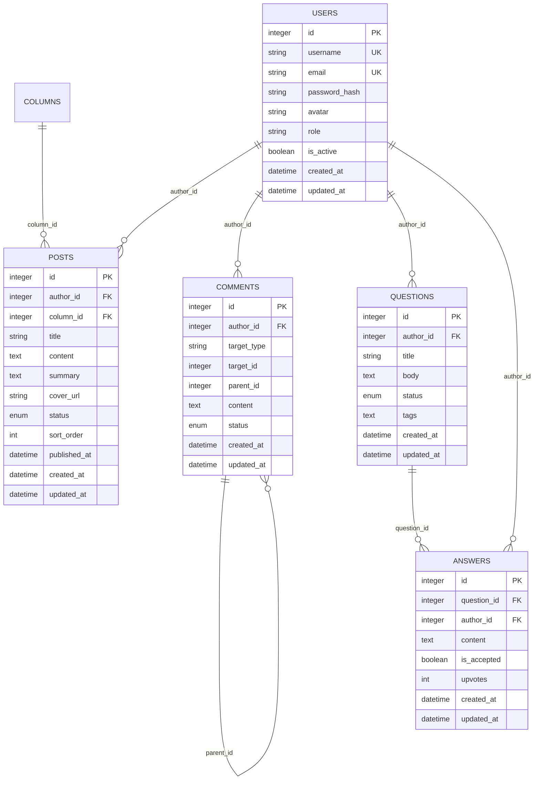
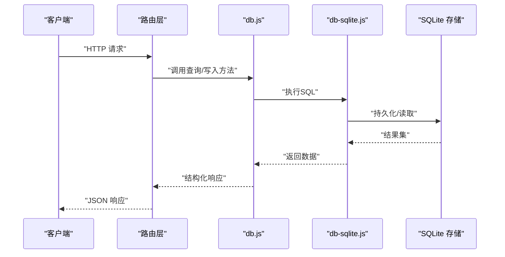
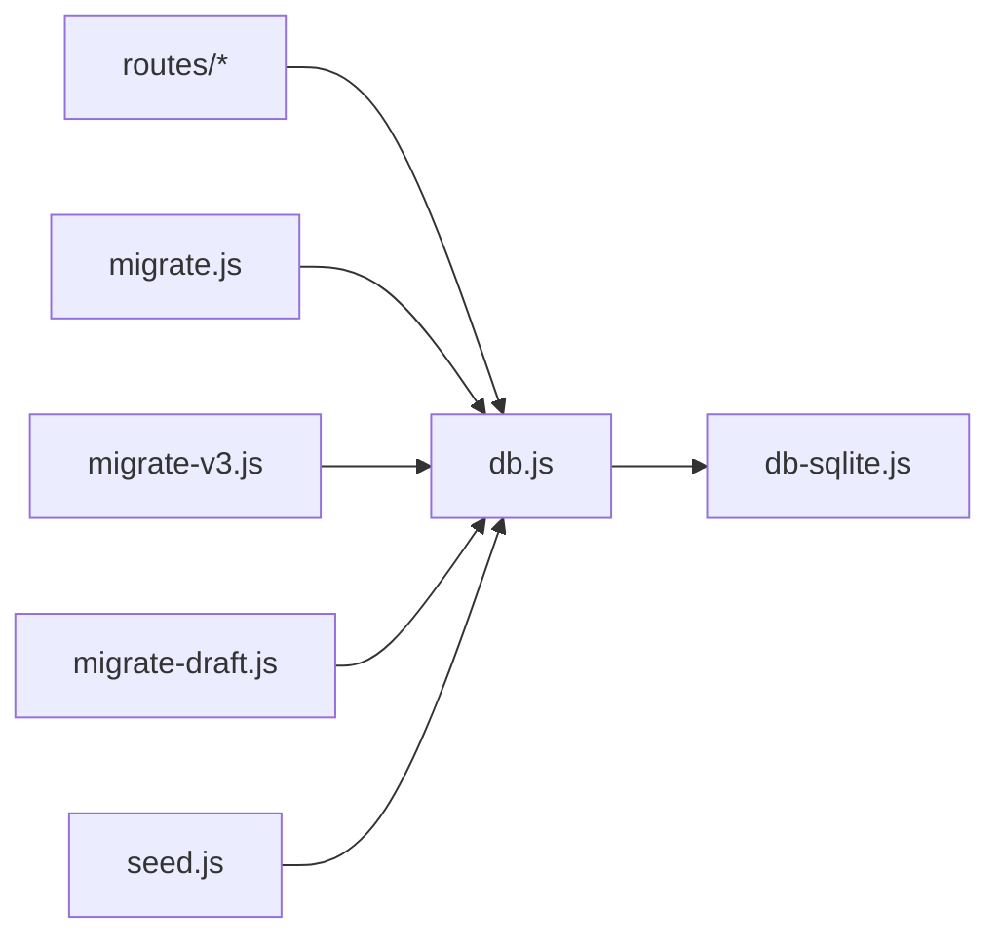
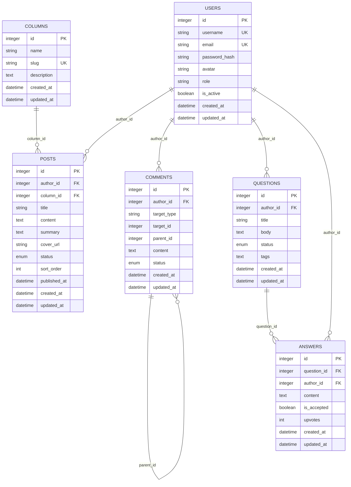

# 数据模型设计

<cite>
**本文引用的文件**   
- [server/src/db.js](file://server/src/db.js)
- [server/src/db-sqlite.js](file://server/src/db-sqlite.js)
- [server/src/migrate.js](file://server/src/migrate.js)
- [server/src/migrate-v3.js](file://server/src/migrate-v3.js)
- [server/src/migrate-draft.js](file://server/src/migrate-draft.js)
- [server/src/seed.js](file://server/src/seed.js)
- [server/src/check-users.js](file://server/src/check-users.js)
- [server/src/add_column.js](file://server/src/add_column.js)
- [server/src/check_schema.js](file://server/src/check_schema.js)
- [server/src/routes/users.js](file://server/src/routes/users.js)
- [server/src/routes/posts.js](file://server/src/routes/posts.js)
- [server/src/routes/columns.js](file://server/src/routes/columns.js)
- [server/src/routes/questions.js](file://server/src/routes/questions.js)
- [server/src/routes/answers.js](file://server/src/routes/answers.js)
- [server/src/routes/ranking.js](file://server/src/routes/ranking.js)
- [server/src/routes/search.js](file://server/src/routes/search.js)
- [server/src/index.js](file://server/src/index.js)
</cite>

## 目录
1. [简介](#简介)
2. [项目结构](#项目结构)
3. [核心组件](#核心组件)
4. [架构总览](#架构总览)
5. [详细组件分析](#详细组件分析)
6. [依赖关系分析](#依赖关系分析)
7. [性能考虑](#性能考虑)
8. [故障排查指南](#故障排查指南)
9. [结论](#结论)
10. [附录](#附录)

## 简介
本文件聚焦于系统的数据模型设计与实现，覆盖用户、文章、评论、问答等核心实体的表结构设计、字段定义、约束与索引策略、表间关系与关联查询优化、数据验证规则与业务约束，并提供ER图、SQL建表语句建议以及数据迁移脚本的编写规范与版本管理策略。文档基于后端代码中的数据库初始化、迁移与路由层对数据的读写行为进行归纳总结，确保读者既能理解整体架构，也能落地到具体实现细节。

## 项目结构
后端采用 Node.js + SQLite（默认）作为数据存储方案，数据库初始化与迁移逻辑集中在 server/src 目录下：
- 数据库连接与封装：db.js、db-sqlite.js
- 迁移脚本：migrate.js、migrate-v3.js、migrate-draft.js
- 种子数据：seed.js
- 校验与辅助工具：check-users.js、add_column.js、check_schema.js
- 路由层：routes/* 中各模块负责用户、文章、专栏、问答、答案、排行、搜索等接口

图表来源
- [server/src/index.js](file://server/src/index.js)
- [server/src/db.js](file://server/src/db.js)
- [server/src/db-sqlite.js](file://server/src/db-sqlite.js)
- [server/src/migrate.js](file://server/src/migrate.js)
- [server/src/migrate-v3.js](file://server/src/migrate-v3.js)
- [server/src/migrate-draft.js](file://server/src/migrate-draft.js)
- [server/src/seed.js](file://server/src/seed.js)
- [server/src/routes/users.js](file://server/src/routes/users.js)
- [server/src/routes/posts.js](file://server/src/routes/posts.js)
- [server/src/routes/columns.js](file://server/src/routes/columns.js)
- [server/src/routes/questions.js](file://server/src/routes/questions.js)
- [server/src/routes/answers.js](file://server/src/routes/answers.js)
- [server/src/routes/ranking.js](file://server/src/routes/ranking.js)
- [server/src/routes/search.js](file://server/src/routes/search.js)

章节来源
- [server/src/index.js](file://server/src/index.js)
- [server/src/db.js](file://server/src/db.js)
- [server/src/db-sqlite.js](file://server/src/db-sqlite.js)
- [server/src/migrate.js](file://server/src/migrate.js)
- [server/src/migrate-v3.js](file://server/src/migrate-v3.js)
- [server/src/migrate-draft.js](file://server/src/migrate-draft.js)
- [server/src/seed.js](file://server/src/seed.js)
- [server/src/routes/users.js](file://server/src/routes/users.js)
- [server/src/routes/posts.js](file://server/src/routes/posts.js)
- [server/src/routes/columns.js](file://server/src/routes/columns.js)
- [server/src/routes/questions.js](file://server/src/routes/questions.js)
- [server/src/routes/answers.js](file://server/src/routes/answers.js)
- [server/src/routes/ranking.js](file://server/src/routes/ranking.js)
- [server/src/routes/search.js](file://server/src/routes/search.js)

## 核心组件
本节从数据模型视角梳理核心实体与关系，并给出ER图与关键索引策略说明。

- 用户（users）
  - 作用：系统用户身份与基础信息
  - 关键字段：id、用户名、邮箱、密码哈希、头像、角色、状态、时间戳等
  - 约束与索引：id为主键；用户名唯一；邮箱唯一；常用查询字段建立索引（如用户名、邮箱、状态）
- 文章（posts）
  - 作用：博客文章主体内容
  - 关键字段：id、标题、正文、摘要、封面、分类/专栏、作者、状态（草稿/已发布）、排序、时间戳等
  - 约束与索引：id为主键；作者外键指向 users.id；分类/专栏外键指向 columns.id；状态、发布时间、作者等建立索引以支持列表与筛选
- 评论（comments）
  - 作用：用户对文章或问答的评论
  - 关键字段：id、内容、作者、目标类型（文章/问答）、目标ID、父评论ID（用于嵌套）、状态、时间戳等
  - 约束与索引：id为主键；作者外键指向 users.id；目标类型+目标ID联合索引；父评论自引用索引
- 问答（questions）
  - 作用：社区问答主题
  - 关键字段：id、标题、正文、作者、状态、标签、时间戳等
  - 约束与索引：id为主键；作者外键指向 users.id；状态、标签等建立索引
- 答案（answers）
  - 作用：对问答的回答
  - 关键字段：id、内容、作者、问题ID、是否采纳、点赞数、时间戳等
  - 约束与索引：id为主键；作者外键指向 users.id；问题ID外键指向 questions.id；采纳标记与点赞数参与排序与统计

图表来源
- [server/src/db.js](file://server/src/db.js)
- [server/src/db-sqlite.js](file://server/src/db-sqlite.js)
- [server/src/migrate.js](file://server/src/migrate.js)
- [server/src/migrate-v3.js](file://server/src/migrate-v3.js)
- [server/src/migrate-draft.js](file://server/src/migrate-draft.js)
- [server/src/routes/users.js](file://server/src/routes/users.js)
- [server/src/routes/posts.js](file://server/src/routes/posts.js)
- [server/src/routes/columns.js](file://server/src/routes/columns.js)
- [server/src/routes/questions.js](file://server/src/routes/questions.js)
- [server/src/routes/answers.js](file://server/src/routes/answers.js)

章节来源
- [server/src/db.js](file://server/src/db.js)
- [server/src/db-sqlite.js](file://server/src/db-sqlite.js)
- [server/src/migrate.js](file://server/src/migrate.js)
- [server/src/migrate-v3.js](file://server/src/migrate-v3.js)
- [server/src/migrate-draft.js](file://server/src/migrate-draft.js)
- [server/src/routes/users.js](file://server/src/routes/users.js)
- [server/src/routes/posts.js](file://server/src/routes/posts.js)
- [server/src/routes/columns.js](file://server/src/routes/columns.js)
- [server/src/routes/questions.js](file://server/src/routes/questions.js)
- [server/src/routes/answers.js](file://server/src/routes/answers.js)

## 架构总览
数据访问层通过 db.js 统一封装 SQL 执行与事务能力，db-sqlite.js 提供 SQLite 驱动适配。迁移脚本在启动时按序执行，保证数据库结构与版本一致。路由层根据请求调用数据访问层完成 CRUD 操作。

图表来源
- [server/src/index.js](file://server/src/index.js)
- [server/src/db.js](file://server/src/db.js)
- [server/src/db-sqlite.js](file://server/src/db-sqlite.js)
- [server/src/routes/users.js](file://server/src/routes/users.js)
- [server/src/routes/posts.js](file://server/src/routes/posts.js)
- [server/src/routes/columns.js](file://server/src/routes/columns.js)
- [server/src/routes/questions.js](file://server/src/routes/questions.js)
- [server/src/routes/answers.js](file://server/src/routes/answers.js)

## 详细组件分析

### 用户表（users）
- 字段定义与约束
  - id：整型主键，自增
  - username：字符串，非空且唯一
  - email：字符串，非空且唯一
  - password_hash：字符串，非空
  - avatar：字符串，可选
  - role：字符串，默认普通用户
  - is_active：布尔，默认启用
  - created_at / updated_at：时间戳，默认当前时间
- 索引策略
  - 主键索引：id
  - 唯一索引：username、email
  - 查询索引：is_active、updated_at（用于列表与活跃用户筛选）
- 数据验证与业务约束
  - 用户名与邮箱格式校验（前端+后端双重校验）
  - 密码需使用安全哈希算法存储
  - 禁用/启用状态控制登录与权限
- 典型查询
  - 按用户名/邮箱查找用户
  - 获取活跃用户列表
  - 更新用户资料与时间戳

章节来源
- [server/src/routes/users.js](file://server/src/routes/users.js)
- [server/src/check-users.js](file://server/src/check-users.js)
- [server/src/db.js](file://server/src/db.js)

### 文章表（posts）
- 字段定义与约束
  - id：整型主键，自增
  - author_id：整型，外键指向 users.id
  - column_id：整型，外键指向 columns.id（专栏）
  - title：字符串，非空
  - content：文本，非空
  - summary：文本，可选
  - cover_url：字符串，可选
  - status：枚举（草稿/已发布），默认草稿
  - sort_order：整数，默认0
  - published_at：时间戳，可选
  - created_at / updated_at：时间戳
- 索引策略
  - 主键索引：id
  - 外键索引：author_id、column_id
  - 查询索引：status、published_at、sort_order、author_id
- 数据验证与业务约束
  - 仅作者或管理员可修改/删除
  - 发布前需具备完整标题与正文
  - 发布后更新时间戳与发布时间
- 典型查询
  - 分页列出已发布文章（按时间/排序）
  - 按作者/专栏筛选
  - 获取文章详情（含作者与专栏信息）

章节来源
- [server/src/routes/posts.js](file://server/src/routes/posts.js)
- [server/src/routes/columns.js](file://server/src/routes/columns.js)
- [server/src/migrate.js](file://server/src/migrate.js)
- [server/src/migrate-v3.js](file://server/src/migrate-v3.js)
- [server/src/db.js](file://server/src/db.js)

### 评论表（comments）
- 字段定义与约束
  - id：整型主键，自增
  - author_id：整型，外键指向 users.id
  - target_type：字符串（post/question），标识评论目标类型
  - target_id：整型，对应目标记录的主键
  - parent_id：整型，自引用，表示父评论（用于嵌套）
  - content：文本，非空
  - status：枚举（正常/隐藏/删除），默认正常
  - created_at / updated_at：时间戳
- 索引策略
  - 主键索引：id
  - 外键索引：author_id、parent_id
  - 复合索引：(target_type, target_id) 用于快速定位目标评论列表
- 数据验证与业务约束
  - 评论必须属于有效目标（文章或问答）
  - 支持层级回复（parent_id 不为空）
  - 管理员可隐藏或删除评论
- 典型查询
  - 获取文章/问答下的评论树
  - 按时间倒序展示最新评论

章节来源
- [server/src/routes/posts.js](file://server/src/routes/posts.js)
- [server/src/routes/questions.js](file://server/src/routes/questions.js)
- [server/src/db.js](file://server/src/db.js)

### 问答表（questions）
- 字段定义与约束
  - id：整型主键，自增
  - author_id：整型，外键指向 users.id
  - title：字符串，非空
  - body：文本，非空
  - status：枚举（开放/关闭/已解决），默认开放
  - tags：文本（逗号分隔或JSON），可选
  - created_at / updated_at：时间戳
- 索引策略
  - 主键索引：id
  - 外键索引：author_id
  - 查询索引：status、updated_at、tags（全文检索可扩展）
- 数据验证与业务约束
  - 提问需具备标题与正文
  - 仅作者或管理员可关闭/删除
  - 标签用于筛选与推荐
- 典型查询
  - 分页列出问答（按热度/时间）
  - 按标签筛选
  - 获取问答详情（含作者信息）

章节来源
- [server/src/routes/questions.js](file://server/src/routes/questions.js)
- [server/src/routes/ranking.js](file://server/src/routes/ranking.js)
- [server/src/db.js](file://server/src/db.js)

### 答案表（answers）
- 字段定义与约束
  - id：整型主键，自增
  - question_id：整型，外键指向 questions.id
  - author_id：整型，外键指向 users.id
  - content：文本，非空
  - is_accepted：布尔，默认否
  - upvotes：整数，默认0
  - created_at / updated_at：时间戳
- 索引策略
  - 主键索引：id
  - 外键索引：question_id、author_id
  - 查询索引：is_accepted、upvotes、created_at（用于排序与统计）
- 数据验证与业务约束
  - 仅作者或管理员可采纳答案
  - 同一问题可有多答案，但仅一个被采纳
  - 点赞数参与排行榜计算
- 典型查询
  - 获取问题下所有答案（按采纳/点赞排序）
  - 统计答案数量与采纳率

章节来源
- [server/src/routes/answers.js](file://server/src/routes/answers.js)
- [server/src/routes/ranking.js](file://server/src/routes/ranking.js)
- [server/src/db.js](file://server/src/db.js)

### 专栏表（columns）
- 字段定义与约束
  - id：整型主键，自增
  - name：字符串，非空
  - slug：字符串，唯一（用于URL）
  - description：文本，可选
  - created_at / updated_at：时间戳
- 索引策略
  - 主键索引：id
  - 唯一索引：slug
  - 查询索引：name、updated_at
- 数据验证与业务约束
  - slug 唯一且可读
  - 管理员维护专栏元信息
- 典型查询
  - 列出所有专栏
  - 按 slug 获取专栏详情及文章列表

章节来源
- [server/src/routes/columns.js](file://server/src/routes/columns.js)
- [server/src/db.js](file://server/src/db.js)

### 搜索与排行
- 搜索（search）
  - 针对文章标题、正文、问答标题、正文进行关键词匹配
  - 可使用 LIKE 或全文索引（视数据规模与性能需求）
  - 索引策略：为高频搜索字段建立索引或使用 FTS 扩展
- 排行（ranking）
  - 基于点赞数、回答数、浏览量等指标生成榜单
  - 定时任务或触发器维护排名缓存表以提升查询性能

章节来源
- [server/src/routes/search.js](file://server/src/routes/search.js)
- [server/src/routes/ranking.js](file://server/src/routes/ranking.js)
- [server/src/db.js](file://server/src/db.js)

## 依赖关系分析
- 模块耦合
  - 路由层依赖 db.js 提供的查询与写入方法
  - db.js 依赖 db-sqlite.js 的驱动实现
  - 迁移脚本在应用启动阶段执行，确保 schema 与代码一致
- 外部依赖
  - SQLite 作为嵌入式数据库，适合中小规模场景
  - 如需高并发与复杂查询，可考虑迁移至 PostgreSQL/MySQL

图表来源
- [server/src/index.js](file://server/src/index.js)
- [server/src/db.js](file://server/src/db.js)
- [server/src/db-sqlite.js](file://server/src/db-sqlite.js)
- [server/src/migrate.js](file://server/src/migrate.js)
- [server/src/migrate-v3.js](file://server/src/migrate-v3.js)
- [server/src/migrate-draft.js](file://server/src/migrate-draft.js)
- [server/src/seed.js](file://server/src/seed.js)

章节来源
- [server/src/index.js](file://server/src/index.js)
- [server/src/db.js](file://server/src/db.js)
- [server/src/db-sqlite.js](file://server/src/db-sqlite.js)
- [server/src/migrate.js](file://server/src/migrate.js)
- [server/src/migrate-v3.js](file://server/src/migrate-v3.js)
- [server/src/migrate-draft.js](file://server/src/migrate-draft.js)
- [server/src/seed.js](file://server/src/seed.js)

## 性能考虑
- 索引优化
  - 对外键与常用过滤字段建立索引（author_id、status、published_at、tags、is_accepted、upvotes）
  - 复合索引用于多条件查询（如 (status, published_at)）
- 查询优化
  - 避免 SELECT *，按需选择字段
  - 分页查询使用 LIMIT/OFFSET 或游标式分页
  - 热点数据使用缓存（内存或Redis）
- 写入优化
  - 批量插入减少往返开销
  - 事务合并相关写操作（如创建文章与初始评论）
- 存储引擎
  - SQLite 适合单机与中小流量；高并发场景建议迁移至关系型数据库并引入连接池

[本节为通用性能指导，不直接分析具体文件]

## 故障排查指南
- 常见问题
  - 迁移失败：检查 migrate.js 与 v3/draft 迁移脚本顺序与幂等性
  - 外键约束错误：确认外键字段存在且类型一致
  - 唯一约束冲突：检查 username/email/slug 的唯一性
  - 索引缺失导致慢查询：使用 EXPLAIN 分析并补充索引
- 诊断工具
  - check-schema.js：校验现有表结构与预期一致性
  - add-column.js：动态添加列（谨慎使用，需评估影响）
  - check-users.js：校验用户数据完整性
- 处理流程
  - 回滚迁移：记录版本号，按逆序执行回滚脚本
  - 修复数据：在事务中修正不一致数据，确保原子性
  - 重新运行迁移：清理脏数据后重试

章节来源
- [server/src/check_schema.js](file://server/src/check_schema.js)
- [server/src/add_column.js](file://server/src/add_column.js)
- [server/src/check-users.js](file://server/src/check-users.js)
- [server/src/migrate.js](file://server/src/migrate.js)
- [server/src/migrate-v3.js](file://server/src/migrate-v3.js)
- [server/src/migrate-draft.js](file://server/src/migrate-draft.js)

## 结论
本数据模型围绕用户、文章、评论、问答、答案与专栏构建，采用 SQLite 作为默认存储，并通过迁移脚本保障结构演进的一致性。合理的索引与查询优化可有效提升性能，结合事务与幂等迁移策略，确保数据一致性与可维护性。未来可根据业务增长逐步引入更强大的数据库与缓存体系。

[本节为总结性内容，不直接分析具体文件]

## 附录

### ER 图（代码级映射）

图表来源
- [server/src/db.js](file://server/src/db.js)
- [server/src/db-sqlite.js](file://server/src/db-sqlite.js)
- [server/src/migrate.js](file://server/src/migrate.js)
- [server/src/migrate-v3.js](file://server/src/migrate-v3.js)
- [server/src/migrate-draft.js](file://server/src/migrate-draft.js)
- [server/src/routes/users.js](file://server/src/routes/users.js)
- [server/src/routes/posts.js](file://server/src/routes/posts.js)
- [server/src/routes/columns.js](file://server/src/routes/columns.js)
- [server/src/routes/questions.js](file://server/src/routes/questions.js)
- [server/src/routes/answers.js](file://server/src/routes/answers.js)

### SQL 建表语句（参考）
以下为基于上述模型的参考建表语句，实际字段与约束请以迁移脚本为准：
- 用户表
  - CREATE TABLE users (id INTEGER PRIMARY KEY AUTOINCREMENT, username TEXT NOT NULL UNIQUE, email TEXT NOT NULL UNIQUE, password_hash TEXT NOT NULL, avatar TEXT, role TEXT DEFAULT 'user', is_active BOOLEAN DEFAULT 1, created_at TIMESTAMP DEFAULT CURRENT_TIMESTAMP, updated_at TIMESTAMP DEFAULT CURRENT_TIMESTAMP);
- 专栏表
  - CREATE TABLE columns (id INTEGER PRIMARY KEY AUTOINCREMENT, name TEXT NOT NULL, slug TEXT NOT NULL UNIQUE, description TEXT, created_at TIMESTAMP DEFAULT CURRENT_TIMESTAMP, updated_at TIMESTAMP DEFAULT CURRENT_TIMESTAMP);
- 文章表
  - CREATE TABLE posts (id INTEGER PRIMARY KEY AUTOINCREMENT, author_id INTEGER NOT NULL, column_id INTEGER, title TEXT NOT NULL, content TEXT NOT NULL, summary TEXT, cover_url TEXT, status TEXT DEFAULT 'draft', sort_order INTEGER DEFAULT 0, published_at TIMESTAMP, created_at TIMESTAMP DEFAULT CURRENT_TIMESTAMP, updated_at TIMESTAMP DEFAULT CURRENT_TIMESTAMP, FOREIGN KEY(author_id) REFERENCES users(id), FOREIGN KEY(column_id) REFERENCES columns(id));
- 评论表
  - CREATE TABLE comments (id INTEGER PRIMARY KEY AUTOINCREMENT, author_id INTEGER NOT NULL, target_type TEXT NOT NULL, target_id INTEGER NOT NULL, parent_id INTEGER, content TEXT NOT NULL, status TEXT DEFAULT 'normal', created_at TIMESTAMP DEFAULT CURRENT_TIMESTAMP, updated_at TIMESTAMP DEFAULT CURRENT_TIMESTAMP, FOREIGN KEY(author_id) REFERENCES users(id), FOREIGN KEY(parent_id) REFERENCES comments(id));
- 问答表
  - CREATE TABLE questions (id INTEGER PRIMARY KEY AUTOINCREMENT, author_id INTEGER NOT NULL, title TEXT NOT NULL, body TEXT NOT NULL, status TEXT DEFAULT 'open', tags TEXT, created_at TIMESTAMP DEFAULT CURRENT_TIMESTAMP, updated_at TIMESTAMP DEFAULT CURRENT_TIMESTAMP, FOREIGN KEY(author_id) REFERENCES users(id));
- 答案表
  - CREATE TABLE answers (id INTEGER PRIMARY KEY AUTOINCREMENT, question_id INTEGER NOT NULL, author_id INTEGER NOT NULL, content TEXT NOT NULL, is_accepted BOOLEAN DEFAULT 0, upvotes INTEGER DEFAULT 0, created_at TIMESTAMP DEFAULT CURRENT_TIMESTAMP, updated_at TIMESTAMP DEFAULT CURRENT_TIMESTAMP, FOREIGN KEY(question_id) REFERENCES questions(id), FOREIGN KEY(author_id) REFERENCES users(id));

章节来源
- [server/src/migrate.js](file://server/src/migrate.js)
- [server/src/migrate-v3.js](file://server/src/migrate-v3.js)
- [server/src/migrate-draft.js](file://server/src/migrate-draft.js)

### 数据迁移脚本编写规范与版本管理策略
- 命名与顺序
  - 使用语义化版本号（如 v1、v2、v3），按数字递增顺序执行
  - 每个迁移脚本只包含一次变更，保持幂等与可回滚
- 内容要求
  - 明确描述变更目的与影响范围
  - 包含正向迁移与反向回滚逻辑
  - 对新增字段设置合理默认值，避免破坏现有数据
- 执行时机
  - 应用启动时自动执行未应用的迁移
  - 生产环境迁移前备份数据库
- 版本管理
  - 将迁移脚本纳入版本控制系统，提交时附带变更说明
  - 记录每次迁移的执行日志与结果

章节来源
- [server/src/migrate.js](file://server/src/migrate.js)
- [server/src/migrate-v3.js](file://server/src/migrate-v3.js)
- [server/src/migrate-draft.js](file://server/src/migrate-draft.js)