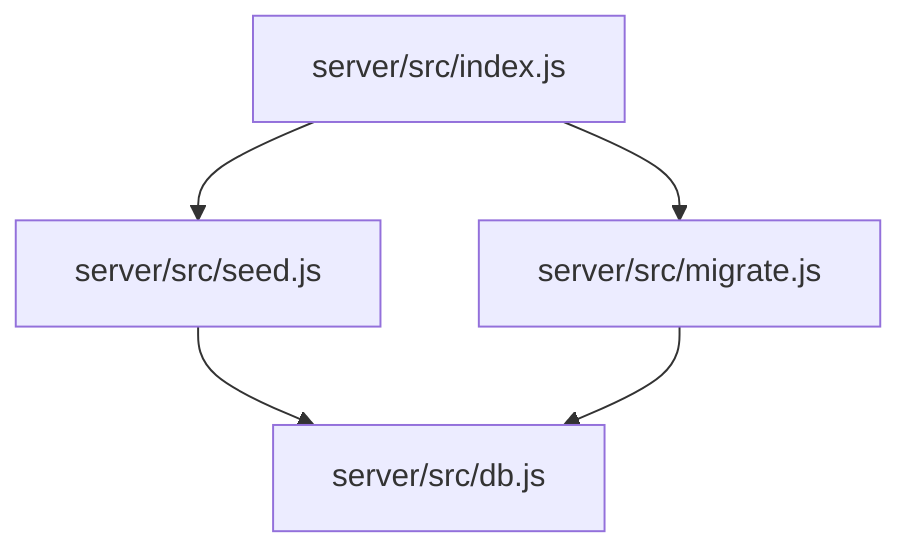
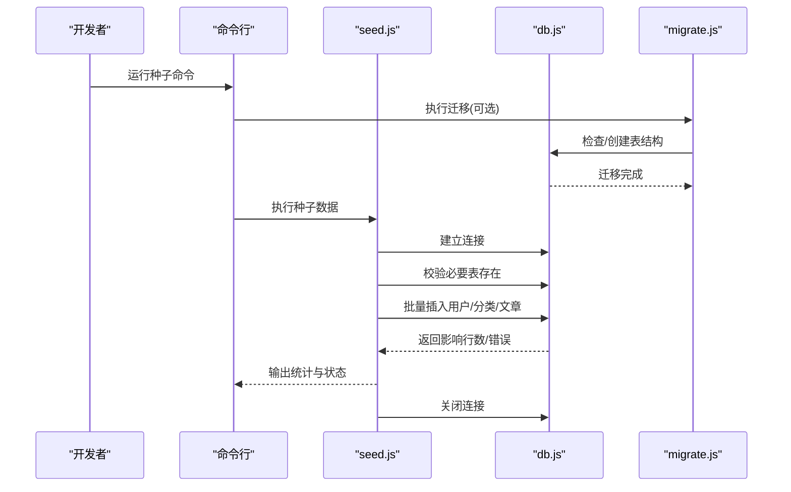
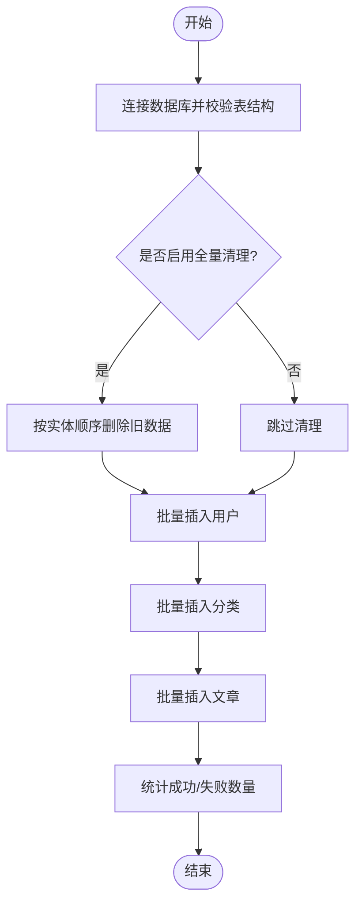
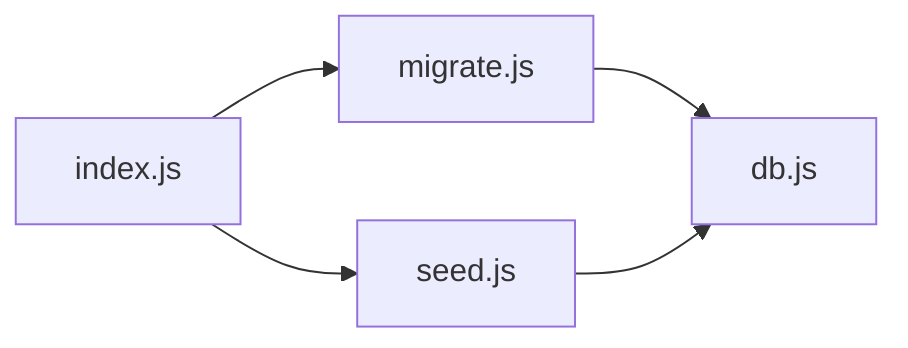

# 种子数据管理

<cite>
**本文引用的文件**
- [seed.js](file://server/src/seed.js)
- [db.js](file://server/src/db.js)
- [migrate.js](file://server/src/migrate.js)
- [index.js](file://server/src/index.js)
</cite>

## 目录
1. [简介](#简介)
2. [项目结构](#项目结构)
3. [核心组件](#核心组件)
4. [架构总览](#架构总览)
5. [详细组件分析](#详细组件分析)
6. [依赖关系分析](#依赖关系分析)
7. [性能考虑](#性能考虑)
8. [故障排查指南](#故障排查指南)
9. [结论](#结论)
10. [附录](#附录)

## 简介
本文件面向“种子数据管理”，聚焦于后端脚本 seed.js 的实现原理与使用方法，解释种子数据的结构与组织方式（用户、文章、分类等），说明版本管理与更新策略，确保开发环境与测试环境的数据一致性。同时提供扩展自定义种子数据的最佳实践，以及导入性能优化与错误处理机制的实操建议。

## 项目结构
与种子数据相关的代码位于 server 子项目中：
- server/src/seed.js：种子数据生成器入口，负责初始化并批量插入基础数据
- server/src/db.js：数据库连接与通用 SQL 执行封装
- server/src/migrate.js：数据库迁移脚本，保证表结构与约束一致
- server/src/index.js：服务启动入口，通常用于在开发时联动迁移与种子数据

图表来源
- [index.js](file://server/src/index.js)
- [migrate.js](file://server/src/migrate.js)
- [seed.js](file://server/src/seed.js)
- [db.js](file://server/src/db.js)

章节来源
- [seed.js](file://server/src/seed.js)
- [db.js](file://server/src/db.js)
- [migrate.js](file://server/src/migrate.js)
- [index.js](file://server/src/index.js)

## 核心组件
- 种子数据生成器（seed.js）
  - 职责：定义基础数据模型（用户、文章、分类等），按依赖顺序创建或更新记录，支持幂等与批量写入
  - 关键流程：连接数据库 → 校验表结构 → 清理或跳过脏数据 → 批量插入 → 统计结果 → 关闭连接
- 数据库封装（db.js）
  - 职责：提供统一的连接获取、事务控制、SQL 执行与错误返回
- 迁移脚本（migrate.js）
  - 职责：确保目标库存在所需表与字段，避免种子数据因结构不一致而失败
- 服务入口（index.js）
  - 职责：在应用启动阶段按需触发迁移与种子数据初始化

章节来源
- [seed.js](file://server/src/seed.js)
- [db.js](file://server/src/db.js)
- [migrate.js](file://server/src/migrate.js)
- [index.js](file://server/src/index.js)

## 架构总览
种子数据导入的整体时序如下：

图表来源
- [seed.js](file://server/src/seed.js)
- [db.js](file://server/src/db.js)
- [migrate.js](file://server/src/migrate.js)

## 详细组件分析

### 种子数据生成器（seed.js）
- 设计要点
  - 幂等性：通过唯一键或条件判断避免重复插入；对已存在记录采用“存在则跳过”的策略
  - 依赖顺序：先插入分类，再插入用户，最后插入文章，保证外键约束满足
  - 批量写入：将同类型数据合并为批量语句，减少往返次数
  - 可配置化：通过环境变量或参数控制是否清空旧数据、是否仅增量更新
- 数据结构与组织
  - 用户数据：包含用户名、邮箱、密码哈希、角色、头像等字段
  - 分类数据：包含分类名称、slug、描述、排序等字段
  - 文章数据：包含标题、正文、摘要、作者ID、分类ID、状态、时间戳等字段
- 初始化与批量插入
  - 使用事务包裹多步操作，任一失败整体回滚
  - 对每个实体集合构建批量插入语句，统一提交
- 版本管理与更新策略
  - 与迁移脚本协同：每次表结构变更由 migrate.js 管理，seed.js 只关注数据
  - 版本号：可在种子数据中维护一个“种子版本”标记，便于识别是否需要重新运行
  - 增量更新：根据业务需要实现“新增为主，必要时覆盖”的策略
- 环境一致性
  - 开发/测试环境：默认启用“先清后插”模式，保证每次运行结果一致
  - 预发/生产环境：默认禁用全量清理，仅做增量更新，避免破坏真实数据
- 扩展方法
  - 新增实体：在 seed.js 中追加新的数据块，遵循“定义→去重→批量插入”的模式
  - 抽取工厂函数：将复杂对象构造逻辑抽离为独立函数，提升可读性与复用性
- 错误处理
  - 捕获数据库异常并输出详细上下文（如当前批次、失败行号）
  - 遇到不可恢复错误立即中止，保留事务回滚，避免半写状态
- 性能优化
  - 批量大小可调：根据数据库限制与内存占用调整每批数量
  - 索引与约束：在导入前临时禁用非必要索引，导入后再重建（谨慎使用）
  - 并行度控制：同一进程内串行写入，避免锁竞争

图表来源
- [seed.js](file://server/src/seed.js)

章节来源
- [seed.js](file://server/src/seed.js)

### 数据库封装（db.js）
- 职责
  - 提供连接池或单连接管理
  - 封装事务 begin/commit/rollback
  - 统一执行 SQL 并返回结构化结果
- 与种子数据的关系
  - seed.js 通过 db.js 进行所有数据访问，屏蔽底层差异
  - 错误信息标准化，便于上层统一处理

章节来源
- [db.js](file://server/src/db.js)

### 迁移脚本（migrate.js）
- 职责
  - 检测并创建必要的表与字段
  - 保证约束与索引符合预期
- 与种子数据的关系
  - 在 seed.js 之前执行，确保数据层结构就绪
  - 若结构不兼容，种子数据应拒绝运行并提示修复

章节来源
- [migrate.js](file://server/src/migrate.js)

### 服务入口（index.js）
- 职责
  - 在开发模式下自动执行迁移与种子数据
  - 在生产模式下提供手动触发的入口或钩子
- 与种子数据的关系
  - 作为统一入口，协调迁移与种子数据执行的顺序与条件

章节来源
- [index.js](file://server/src/index.js)

## 依赖关系分析
- 直接依赖
  - seed.js 依赖 db.js 进行数据读写
  - migrate.js 依赖 db.js 进行结构变更
  - index.js 依赖 migrate.js 与 seed.js 编排执行顺序
- 间接依赖
  - 环境变量与配置文件影响种子行为（如是否清理、批量大小）
- 潜在循环依赖
  - 保持模块单向依赖：入口 → 迁移/种子 → 数据库封装

图表来源
- [index.js](file://server/src/index.js)
- [migrate.js](file://server/src/migrate.js)
- [seed.js](file://server/src/seed.js)
- [db.js](file://server/src/db.js)

章节来源
- [index.js](file://server/src/index.js)
- [migrate.js](file://server/src/migrate.js)
- [seed.js](file://server/src/seed.js)
- [db.js](file://server/src/db.js)

## 性能考虑
- 批量大小调优
  - 根据数据库引擎与服务器资源调整每批插入数量，平衡吞吐与内存占用
- 事务粒度
  - 以实体为单位划分事务，避免长事务导致锁等待
- 索引策略
  - 大批量导入时可暂时禁用非唯一索引，导入完成后重建
- 并发控制
  - 单进程串行写入优先，避免死锁与竞争
- 日志与监控
  - 记录每批次的耗时与影响行数，便于定位瓶颈

[本节为通用指导，无需特定文件引用]

## 故障排查指南
- 常见错误
  - 表结构缺失或字段不匹配：优先运行迁移脚本，确认结构一致
  - 唯一键冲突：检查幂等逻辑是否正确，必要时开启清理模式
  - 事务回滚：查看最近一次失败的批次与错误堆栈，定位具体 SQL
- 诊断步骤
  - 确认数据库连接与权限
  - 逐步执行迁移与种子数据，观察中间结果
  - 降低批量大小，缩小问题范围
- 恢复策略
  - 使用事务回滚保证一致性
  - 在测试环境复现并验证修复方案

章节来源
- [seed.js](file://server/src/seed.js)
- [db.js](file://server/src/db.js)
- [migrate.js](file://server/src/migrate.js)

## 结论
通过迁移脚本与种子数据生成器的协作，系统能够在不同环境中快速构建一致的基础数据。遵循幂等、依赖顺序与批量写入的原则，既能保障正确性，也能获得良好的导入性能。结合完善的错误处理与可扩展的设计，种子数据管理可以稳定支撑开发与测试工作流。

[本节为总结性内容，无需特定文件引用]

## 附录
- 常用命令
  - 执行迁移：参考服务入口或包脚本中的迁移命令
  - 执行种子数据：参考服务入口或包脚本中的种子命令
- 环境变量
  - 控制是否清理旧数据、批量大小、日志级别等
- 扩展清单
  - 新增实体：定义数据模板 → 编写去重逻辑 → 加入批量插入流程 → 更新统计输出

[本节为补充信息，无需特定文件引用]