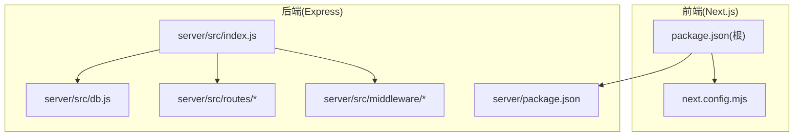
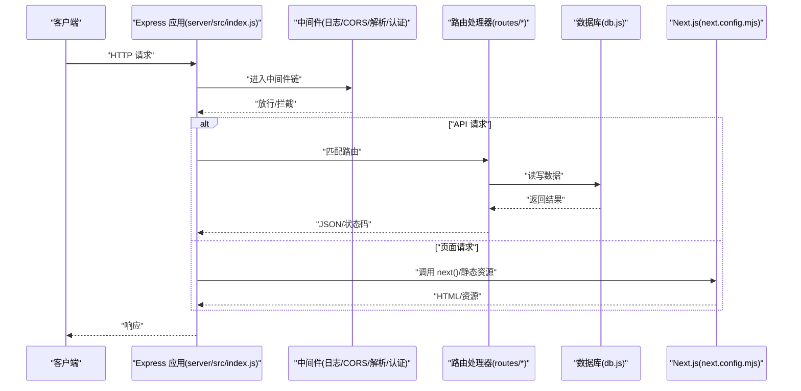
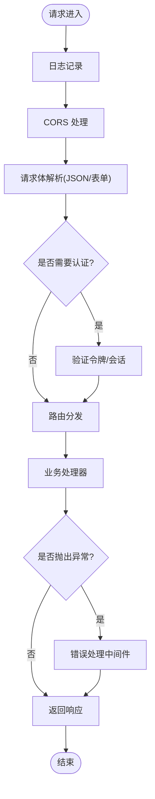
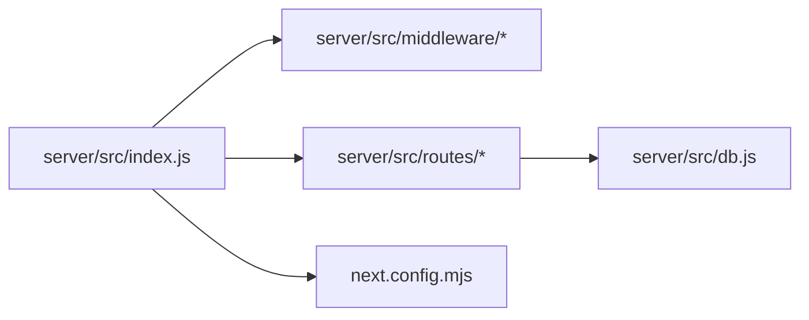

# 服务初始化与配置

<cite>
**本文引用的文件**   
- [server/src/index.js](file://server/src/index.js)
- [server/package.json](file://server/package.json)
- [next.config.mjs](file://next.config.mjs)
- [package.json](file://package.json)
- [server/src/middleware/auth.js](file://server/src/middleware/auth.js)
- [server/src/routes/posts.js](file://server/src/routes/posts.js)
- [server/src/routes/users.js](file://server/src/routes/users.js)
- [server/src/db.js](file://server/src/db.js)
</cite>

## 目录
1. [简介](#简介)
2. [项目结构](#项目结构)
3. [核心组件](#核心组件)
4. [架构总览](#架构总览)
5. [详细组件分析](#详细组件分析)
6. [依赖关系分析](#依赖关系分析)
7. [性能考虑](#性能考虑)
8. [故障排查指南](#故障排查指南)
9. [结论](#结论)
10. [附录](#附录)

## 简介
本文件聚焦于服务的启动流程与配置，涵盖 Express 应用初始化、端口与跨域（CORS）设置、静态资源服务、环境变量管理、配置文件结构与部署相关设置。同时说明中间件注册机制与加载顺序（日志、请求解析、错误处理等），并解释 Next.js 与 Express 的集成方式（API 路由代理与构建产物服务）。最后提供开发/生产环境差异化配置建议以及常见问题排查方案。

## 项目结构
本项目采用前后端同仓或分仓混合模式：前端基于 Next.js，后端为独立的 Express 服务（位于 server 目录）。根目录包含 Next.js 配置与脚本，server 目录包含 Express 入口、路由、中间件与数据库连接等。

图表来源
- [server/src/index.js](file://server/src/index.js)
- [server/package.json](file://server/package.json)
- [next.config.mjs](file://next.config.mjs)
- [package.json](file://package.json)

章节来源
- [server/src/index.js](file://server/src/index.js)
- [server/package.json](file://server/package.json)
- [next.config.mjs](file://next.config.mjs)
- [package.json](file://package.json)

## 核心组件
- Express 应用入口：负责创建 Express 实例、挂载中间件、注册路由、启动 HTTP 服务器并监听端口。
- 中间件层：包括日志记录、请求体解析、CORS、认证鉴权、错误处理等。
- 路由层：按功能模块划分 API 路由，如文章、用户、问答等。
- 数据库连接：封装 SQLite/其他数据库的连接与初始化逻辑。
- Next.js 集成：通过 next() 渲染页面或作为反向代理转发到 Next 构建产物。

章节来源
- [server/src/index.js](file://server/src/index.js)
- [server/src/middleware/auth.js](file://server/src/middleware/auth.js)
- [server/src/routes/posts.js](file://server/src/routes/posts.js)
- [server/src/routes/users.js](file://server/src/routes/users.js)
- [server/src/db.js](file://server/src/db.js)

## 架构总览
下图展示了从客户端请求到服务端处理的完整链路，包括中间件链、路由分发、数据库访问以及 Next.js 页面的渲染/代理。

图表来源
- [server/src/index.js](file://server/src/index.js)
- [server/src/middleware/auth.js](file://server/src/middleware/auth.js)
- [server/src/routes/posts.js](file://server/src/routes/posts.js)
- [server/src/routes/users.js](file://server/src/routes/users.js)
- [server/src/db.js](file://server/src/db.js)
- [next.config.mjs](file://next.config.mjs)

## 详细组件分析

### Express 应用入口与启动流程
- 应用初始化：创建 Express 实例，统一配置 JSON/表单请求体解析、CORS、安全头、压缩等。
- 中间件注册顺序：通常遵循“全局中间件 → 路由中间件 → 业务路由 → 错误处理”的顺序。
- 静态资源服务：将 public 或上传目录映射为静态路径，便于浏览器直接获取资源。
- 端口与环境变量：从环境变量读取端口、数据库路径、JWT 密钥等；未设置时使用默认值。
- Next.js 集成：在非 API 路径下调用 next() 以渲染 Next 页面，或将 /api 前缀交由 Express 处理。
- 优雅关闭：监听进程信号，关闭数据库连接与 HTTP 服务器，确保资源释放。

章节来源
- [server/src/index.js](file://server/src/index.js)

### 中间件注册机制与加载顺序
- 日志中间件：记录请求方法、URL、耗时、状态码等，便于问题定位。
- CORS 中间件：允许指定来源、方法与头部，支持凭证与预检请求。
- 请求体解析：启用 JSON 与 URL-encoded 解析，限制大小防止滥用。
- 认证中间件：校验 JWT/Session，注入用户上下文至 req.user。
- 错误处理中间件：捕获异常、格式化错误响应、输出堆栈（仅开发环境）。

图表来源
- [server/src/index.js](file://server/src/index.js)
- [server/src/middleware/auth.js](file://server/src/middleware/auth.js)

章节来源
- [server/src/index.js](file://server/src/index.js)
- [server/src/middleware/auth.js](file://server/src/middleware/auth.js)

### 路由与 API 设计
- 模块化路由：按领域拆分路由文件，集中注册到 Express 应用。
- 典型路由示例：文章 CRUD、用户信息、问答列表等。
- 权限控制：在路由级或控制器内使用认证中间件进行鉴权。
- 输入校验：对请求参数与主体进行基础校验，返回明确错误信息。

章节来源
- [server/src/routes/posts.js](file://server/src/routes/posts.js)
- [server/src/routes/users.js](file://server/src/routes/users.js)

### 数据库连接与迁移
- 连接管理：根据环境变量选择数据库类型与连接参数，建立连接池或单例连接。
- 初始化与迁移：在应用启动时执行必要的表结构检查与数据迁移。
- 错误处理：连接失败时给出清晰提示并中止启动，避免运行期崩溃。

章节来源
- [server/src/db.js](file://server/src/db.js)

### Next.js 与 Express 集成
- 页面渲染：非 API 请求委托给 next()，由 Next.js 渲染页面。
- 静态资源：Next 构建产物（.next/static）自动被托管，无需额外配置。
- API 路由：Express 接管 /api 前缀，Next 可保留其 API 路由或完全交由 Express。
- 代理策略：若需要反向代理到外部服务，可在 Express 中配置代理中间件。

章节来源
- [server/src/index.js](file://server/src/index.js)
- [next.config.mjs](file://next.config.mjs)

### 环境变量管理与配置文件结构
- 环境变量：用于配置端口、数据库路径、JWT 密钥、CORS 白名单、日志级别等。
- 配置文件：可按环境拆分为 .env.development/.env.production，或在运行时通过命令行覆盖。
- 默认值：关键配置项应提供合理默认值，提升本地开发体验。
- 敏感信息：密钥与凭据不应提交到版本库，建议使用密钥管理服务或容器编排注入。

章节来源
- [server/src/index.js](file://server/src/index.js)
- [server/package.json](file://server/package.json)
- [package.json](file://package.json)

### 部署相关设置
- 进程管理：推荐使用 PM2 或系统服务管理器，实现自动重启与健康检查。
- 反向代理：使用 Nginx/Traefik 暴露 80/443 端口，开启 HTTPS 与缓存。
- 构建产物：先构建 Next.js 应用，再启动 Express，确保 .next 目录存在。
- 健康检查：提供 /health 或 /ready 接口，供负载均衡器探测。

章节来源
- [server/package.json](file://server/package.json)
- [package.json](file://package.json)

## 依赖关系分析
- 应用入口依赖中间件与路由模块，形成松耦合的分层结构。
- 路由模块依赖数据库连接，保持业务逻辑与数据访问分离。
- Next.js 配置独立，便于前端构建与部署流程解耦。

图表来源
- [server/src/index.js](file://server/src/index.js)
- [server/src/middleware/auth.js](file://server/src/middleware/auth.js)
- [server/src/routes/posts.js](file://server/src/routes/posts.js)
- [server/src/routes/users.js](file://server/src/routes/users.js)
- [server/src/db.js](file://server/src/db.js)
- [next.config.mjs](file://next.config.mjs)

章节来源
- [server/src/index.js](file://server/src/index.js)
- [server/src/middleware/auth.js](file://server/src/middleware/auth.js)
- [server/src/routes/posts.js](file://server/src/routes/posts.js)
- [server/src/routes/users.js](file://server/src/routes/users.js)
- [server/src/db.js](file://server/src/db.js)
- [next.config.mjs](file://next.config.mjs)

## 性能考虑
- 中间件最小化：仅在必要时启用，避免过多字符串处理与正则匹配。
- 请求体大小限制：合理设置上限，防止大体积负载导致内存压力。
- 静态资源缓存：利用浏览器缓存与 CDN 加速静态资源。
- 数据库连接池：在高并发场景下复用连接，减少握手开销。
- 压缩传输：启用 gzip/br 压缩，降低带宽占用。
- 日志采样：生产环境对高频日志进行采样，避免 I/O 瓶颈。

[本节为通用指导，不直接分析具体文件]

## 故障排查指南
- 端口冲突：确认环境变量中的端口未被占用，或更换端口后重启服务。
- CORS 报错：检查允许的源、方法与头部，确保预检请求正确返回。
- 静态资源 404：确认静态目录映射路径与构建产物位置一致。
- 认证失败：核对 JWT 签名算法与时钟同步，检查令牌过期时间。
- 数据库连接失败：验证连接参数与网络可达性，查看迁移脚本是否成功执行。
- 日志缺失：确认日志中间件已注册且写入路径有写权限。

章节来源
- [server/src/index.js](file://server/src/index.js)
- [server/src/middleware/auth.js](file://server/src/middleware/auth.js)
- [server/src/db.js](file://server/src/db.js)

## 结论
通过对 Express 应用入口、中间件链、路由与数据库连接的梳理，结合 Next.js 的集成方式，可以构建出稳定、可扩展的服务端架构。合理的配置与环境隔离、清晰的中间件顺序与错误处理，是保障服务可用性与可维护性的关键。

[本节为总结性内容，不直接分析具体文件]

## 附录
- 常用环境变量清单（示例）
  - PORT：服务监听端口
  - DATABASE_URL：数据库连接串或路径
  - JWT_SECRET：JWT 签名密钥
  - CORS_ORIGIN：允许的跨域来源
  - LOG_LEVEL：日志级别
- 启动命令参考
  - 开发：安装依赖、构建 Next.js、启动 Express
  - 生产：构建产物、设置环境变量、使用进程管理器启动

章节来源
- [server/package.json](file://server/package.json)
- [package.json](file://package.json)