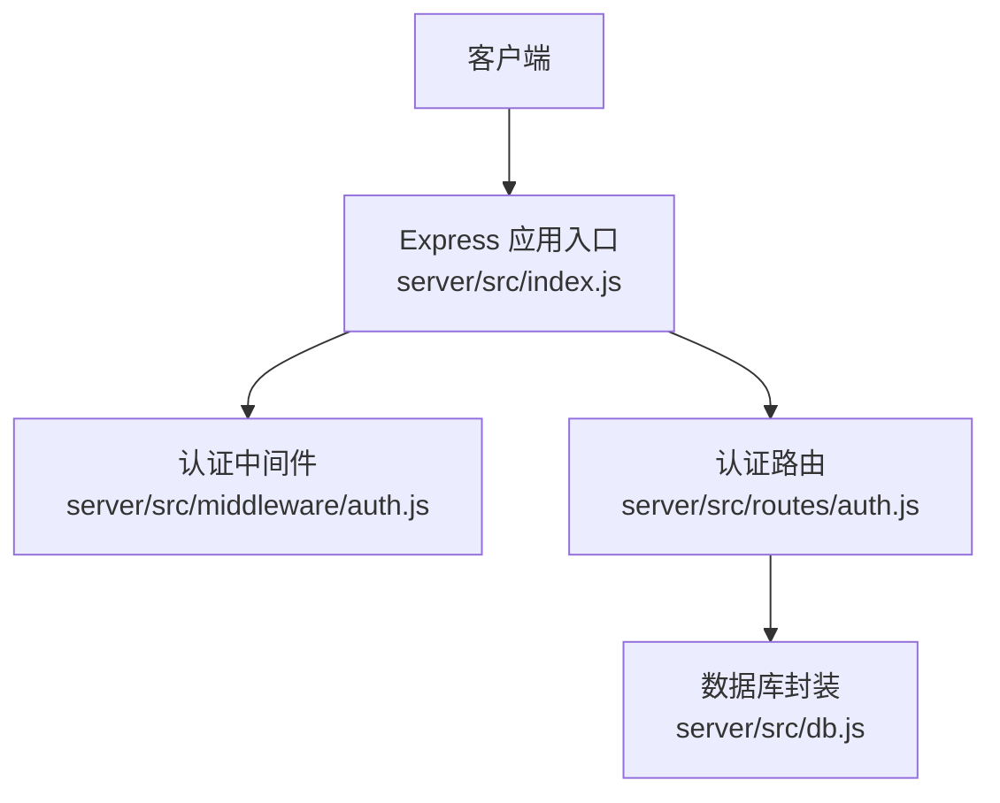
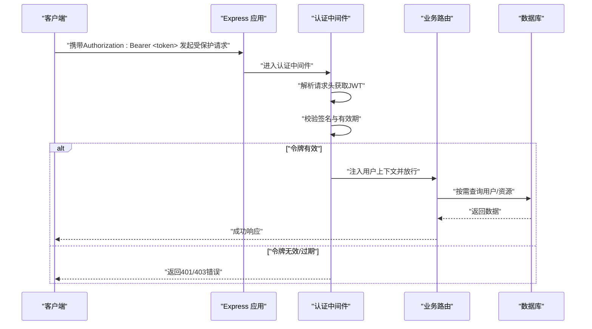
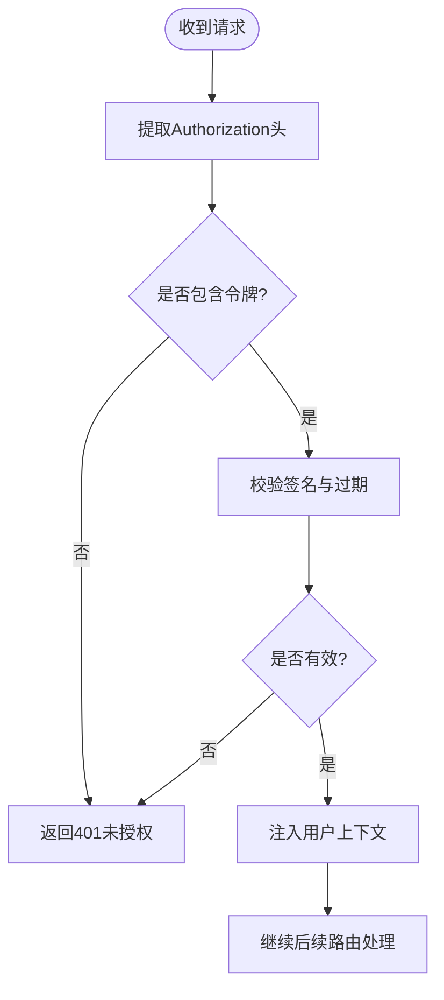
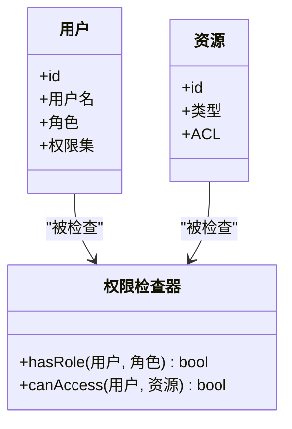
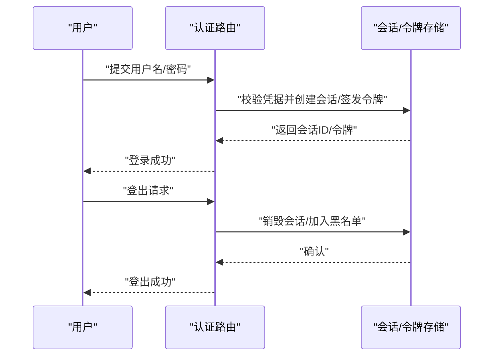
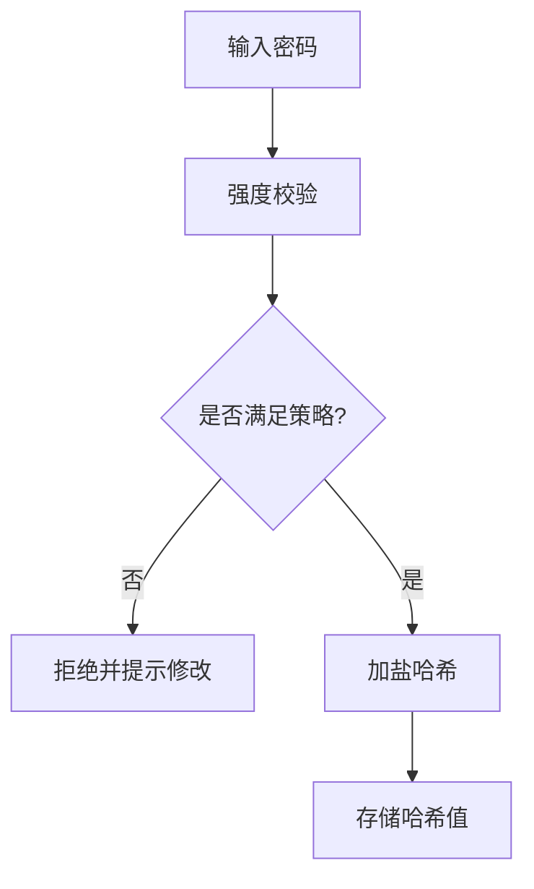
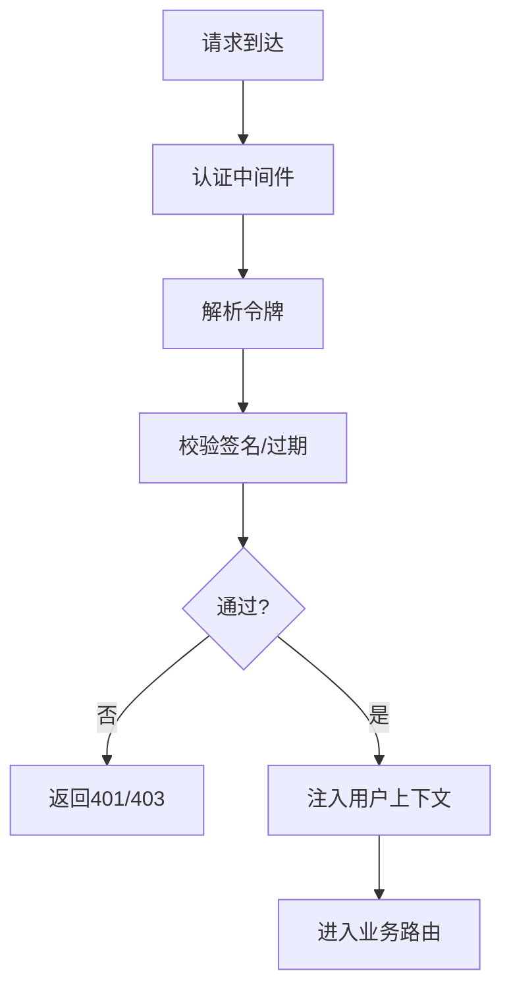
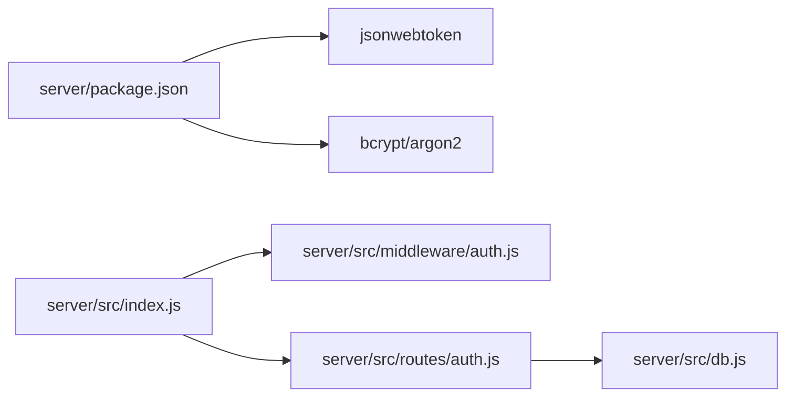

# 认证中间件

<cite>
**本文引用的文件**   
- [server/src/middleware/auth.js](file://server/src/middleware/auth.js)
- [server/src/routes/auth.js](file://server/src/routes/auth.js)
- [server/src/db.js](file://server/src/db.js)
- [server/src/index.js](file://server/src/index.js)
- [server/package.json](file://server/package.json)
</cite>

## 目录
1. [简介](#简介)
2. [项目结构](#项目结构)
3. [核心组件](#核心组件)
4. [架构总览](#架构总览)
5. [详细组件分析](#详细组件分析)
6. [依赖分析](#依赖分析)
7. [性能考虑](#性能考虑)
8. [故障排查指南](#故障排查指南)
9. [结论](#结论)
10. [附录](#附录)

## 简介
本文件围绕后端认证中间件与相关路由，系统性解析基于JWT的令牌认证机制、用户权限控制、会话管理、密码安全策略、中间件执行流程与错误处理，并提供最佳实践、漏洞防护以及调试监控建议。目标是帮助开发者快速理解并安全地扩展该项目的认证体系。

## 项目结构
本项目采用前后端分离架构，认证逻辑集中在后端：
- 中间件层：统一鉴权入口，负责校验JWT、注入用户上下文等
- 路由层：登录/注册、刷新令牌、登出等业务接口
- 数据层：数据库访问封装，用于查询用户信息、持久化会话或黑名单（可选）
- 应用入口：挂载中间件与路由，初始化服务

图表来源
- [server/src/index.js](file://server/src/index.js)
- [server/src/middleware/auth.js](file://server/src/middleware/auth.js)
- [server/src/routes/auth.js](file://server/src/routes/auth.js)
- [server/src/db.js](file://server/src/db.js)

章节来源
- [server/src/index.js](file://server/src/index.js)
- [server/src/middleware/auth.js](file://server/src/middleware/auth.js)
- [server/src/routes/auth.js](file://server/src/routes/auth.js)
- [server/src/db.js](file://server/src/db.js)

## 核心组件
- 认证中间件：从请求头提取JWT，验证签名与过期时间，将用户信息注入到请求对象，供后续路由使用
- 认证路由：提供登录、注册、刷新令牌、登出等接口；在登录成功后签发JWT，并在需要时维护会话状态
- 数据库封装：提供用户查询、写入等操作，支撑密码校验、角色读取、黑名单/会话存储等

章节来源
- [server/src/middleware/auth.js](file://server/src/middleware/auth.js)
- [server/src/routes/auth.js](file://server/src/routes/auth.js)
- [server/src/db.js](file://server/src/db.js)

## 架构总览
下图展示了典型请求在认证中间件中的流转过程，包括令牌校验、权限检查与错误返回。

图表来源
- [server/src/middleware/auth.js](file://server/src/middleware/auth.js)
- [server/src/routes/auth.js](file://server/src/routes/auth.js)
- [server/src/db.js](file://server/src/db.js)

## 详细组件分析

### JWT 令牌认证机制
- 令牌生成
  - 登录成功后，服务端根据用户标识与必要声明签发JWT
  - 设置合理的过期时间，避免长生命周期带来的安全风险
- 令牌验证
  - 中间件从请求头提取令牌，校验签名与过期时间
  - 校验失败则拒绝访问并返回相应错误码
- 令牌刷新
  - 提供刷新接口，使用短期访问令牌换取新的访问令牌
  - 可结合刷新令牌与黑名单实现细粒度控制
- 过期处理
  - 对即将过期的令牌可在前端提示重新登录
  - 服务端可对过期令牌进行统计与告警

图表来源
- [server/src/middleware/auth.js](file://server/src/middleware/auth.js)

章节来源
- [server/src/middleware/auth.js](file://server/src/middleware/auth.js)
- [server/src/routes/auth.js](file://server/src/routes/auth.js)

### 用户权限控制系统
- 角色定义
  - 常见角色：访客、普通用户、作者、管理员
  - 角色信息通常随JWT下发或在服务端缓存中读取
- 权限检查
  - 基于角色的访问控制（RBAC）：在路由或控制器层判断角色是否具备操作权限
  - 基于资源的访问控制（ABAC）：结合资源属性与用户属性做更细粒度判断
- 访问控制列表（ACL）
  - 为敏感资源维护ACL，记录允许访问的用户/角色集合
  - 在业务路由中加载ACL并与当前用户上下文比对

图表来源
- [server/src/middleware/auth.js](file://server/src/middleware/auth.js)
- [server/src/routes/auth.js](file://server/src/routes/auth.js)

章节来源
- [server/src/middleware/auth.js](file://server/src/middleware/auth.js)
- [server/src/routes/auth.js](file://server/src/routes/auth.js)

### 会话管理机制
- 登录状态维护
  - 无状态方案：仅依赖JWT，适合水平扩展
  - 有状态方案：在服务端维护会话表或缓存，支持强制下线与并发限制
- 登出处理
  - 无状态：客户端删除本地令牌；服务端可通过黑名单使旧令牌失效
  - 有状态：服务端销毁会话记录
- 并发登录控制
  - 通过会话表或令牌黑名单限制同一用户的最大并发会话数
  - 新登录时可踢出旧会话或要求二次验证

图表来源
- [server/src/routes/auth.js](file://server/src/routes/auth.js)
- [server/src/db.js](file://server/src/db.js)

章节来源
- [server/src/routes/auth.js](file://server/src/routes/auth.js)
- [server/src/db.js](file://server/src/db.js)

### 密码安全策略
- 哈希算法
  - 使用强哈希算法（如bcrypt、argon2）对用户密码进行单向哈希
- 盐值生成
  - 每次哈希均生成随机盐值，确保相同密码在不同用户下具有不同哈希结果
- 密码强度验证
  - 前端与后端双重校验：长度、复杂度、禁止常见弱口令
  - 定期提示用户更新密码

图表来源
- [server/src/routes/auth.js](file://server/src/routes/auth.js)
- [server/src/db.js](file://server/src/db.js)

章节来源
- [server/src/routes/auth.js](file://server/src/routes/auth.js)
- [server/src/db.js](file://server/src/db.js)

### 中间件执行流程与错误处理
- 执行流程
  - 请求进入后先经过认证中间件，再进入具体路由
  - 中间件负责解析令牌、校验签名与过期、注入用户上下文
- 错误处理
  - 令牌缺失或格式错误：返回401
  - 令牌签名错误或已过期：返回401或403
  - 权限不足：返回403
  - 统一错误格式，便于前端处理与日志采集

图表来源
- [server/src/middleware/auth.js](file://server/src/middleware/auth.js)

章节来源
- [server/src/middleware/auth.js](file://server/src/middleware/auth.js)

## 依赖分析
- 外部依赖
  - JSON Web Token 库：用于签发与校验JWT
  - 加密哈希库：用于密码哈希与盐值生成
- 内部依赖
  - 数据库封装：用于用户查询与会话/黑名单持久化
  - 应用入口：挂载中间件与路由

图表来源
- [server/package.json](file://server/package.json)
- [server/src/index.js](file://server/src/index.js)
- [server/src/middleware/auth.js](file://server/src/middleware/auth.js)
- [server/src/routes/auth.js](file://server/src/routes/auth.js)
- [server/src/db.js](file://server/src/db.js)

章节来源
- [server/package.json](file://server/package.json)
- [server/src/index.js](file://server/src/index.js)
- [server/src/middleware/auth.js](file://server/src/middleware/auth.js)
- [server/src/routes/auth.js](file://server/src/routes/auth.js)
- [server/src/db.js](file://server/src/db.js)

## 性能考虑
- 令牌体积最小化：仅包含必要声明，减少网络开销
- 校验成本优化：优先使用内存缓存用户角色/权限，降低数据库压力
- 刷新令牌批量化：批量刷新时复用会话/令牌校验结果
- 限流与防抖：对登录、刷新接口实施速率限制，防止暴力破解与重放攻击

[本节为通用指导，不直接分析具体文件]

## 故障排查指南
- 常见问题定位
  - 401未授权：检查Authorization头是否正确携带、令牌是否过期、签名密钥是否一致
  - 403权限不足：检查用户角色与资源ACL配置
  - 登录失败：检查密码哈希算法与盐值策略是否与存储一致
- 日志与监控
  - 记录关键事件：登录成功/失败、令牌签发/刷新/吊销、权限拒绝
  - 指标上报：失败率、平均耗时、异常分布
  - 审计追踪：关联用户ID、IP、UA、时间戳，便于溯源

章节来源
- [server/src/middleware/auth.js](file://server/src/middleware/auth.js)
- [server/src/routes/auth.js](file://server/src/routes/auth.js)

## 结论
本项目在后端实现了以JWT为核心的认证机制，并通过中间件统一校验与注入用户上下文。配合路由层的权限检查与数据库封装，能够支撑多角色与细粒度访问控制。建议在现有基础上完善刷新令牌与黑名单机制、强化密码策略与速率限制，并建立完善的日志与监控体系，以提升安全性与可观测性。

[本节为总结性内容，不直接分析具体文件]

## 附录
- 最佳实践清单
  - 使用短生命周期访问令牌与安全的刷新令牌
  - 严格校验签名与过期时间，拒绝未知算法
  - 最小化JWT载荷，敏感信息不入令牌
  - 对所有写操作进行服务端权限校验，不信任前端
  - 启用HTTPS，避免令牌泄露
  - 对登录与刷新接口实施速率限制与验证码
  - 定期轮换密钥，建立密钥版本管理
- 常见漏洞防护
  - 防重放：引入nonce或时间戳窗口
  - 防CSRF：针对表单提交使用同源策略与双因子校验
  - 防XSS：输出编码与CSP策略
  - 防暴力破解：账户锁定与异常检测

[本节为通用指导，不直接分析具体文件]