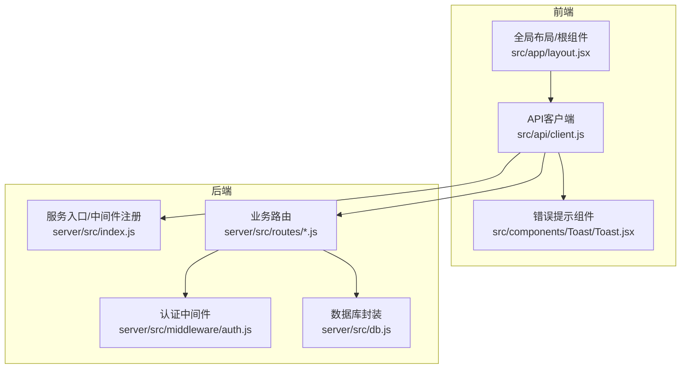
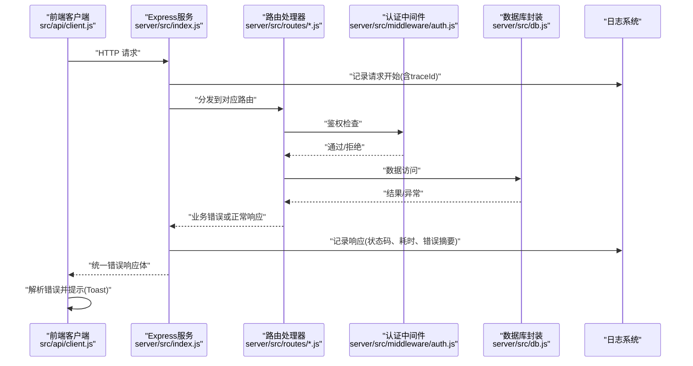
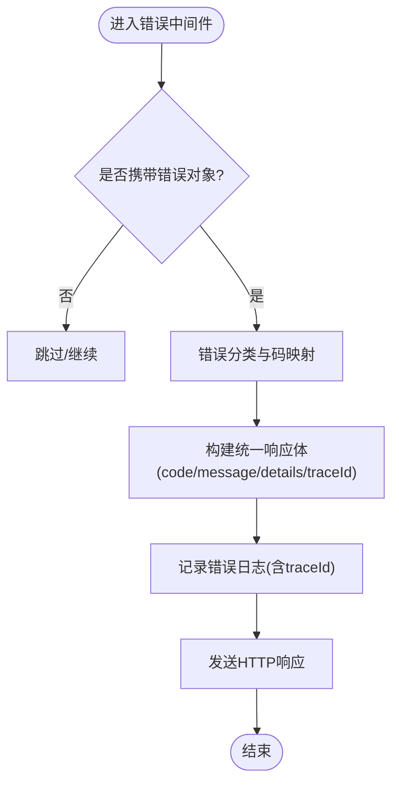
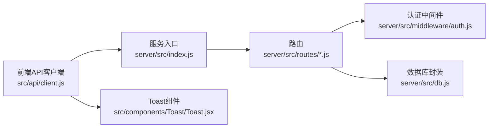

# 错误处理与日志

<cite>
**本文引用的文件**   
- [server/src/index.js](file://server/src/index.js)
- [server/src/middleware/auth.js](file://server/src/middleware/auth.js)
- [server/src/routes/posts.js](file://server/src/routes/posts.js)
- [server/src/routes/users.js](file://server/src/routes/users.js)
- [server/src/db.js](file://server/src/db.js)
- [server/package.json](file://server/package.json)
- [src/api/client.js](file://src/api/client.js)
- [src/app/layout.jsx](file://src/app/layout.jsx)
- [src/components/Toast/Toast.jsx](file://src/components/Toast/Toast.jsx)
</cite>

## 目录
1. [简介](#简介)
2. [项目结构](#项目结构)
3. [核心组件](#核心组件)
4. [架构总览](#架构总览)
5. [详细组件分析](#详细组件分析)
6. [依赖关系分析](#依赖关系分析)
7. [性能考虑](#性能考虑)
8. [故障排查指南](#故障排查指南)
9. [结论](#结论)
10. [附录](#附录)

## 简介
本文件聚焦于后端统一错误处理机制与日志系统的实现与最佳实践，覆盖全局异常捕获、错误分类与错误码定义、标准化错误响应格式、日志级别与输出、文件轮转与结构化日志、开发/生产环境差异化配置、性能监控与错误追踪集成、常见错误诊断与调试技巧，以及自动化测试策略。目标是确保前后端错误信息一致、可观测性强、可维护性高。

## 项目结构
本项目采用前后端分离：
- 后端基于 Node.js（Express），入口位于 server/src/index.js，路由按功能拆分在 server/src/routes/*，认证中间件位于 server/src/middleware/auth.js，数据库连接封装在 server/src/db.js。
- 前端 Next.js 应用通过 src/api/client.js 调用后端 API，并在 UI 层使用 Toast 组件进行用户提示。

图表来源
- [server/src/index.js](file://server/src/index.js)
- [server/src/routes/posts.js](file://server/src/routes/posts.js)
- [server/src/middleware/auth.js](file://server/src/middleware/auth.js)
- [server/src/db.js](file://server/src/db.js)
- [src/api/client.js](file://src/api/client.js)
- [src/components/Toast/Toast.jsx](file://src/components/Toast/Toast.jsx)
- [src/app/layout.jsx](file://src/app/layout.jsx)

章节来源
- [server/src/index.js](file://server/src/index.js)
- [server/src/routes/posts.js](file://server/src/routes/posts.js)
- [server/src/middleware/auth.js](file://server/src/middleware/auth.js)
- [server/src/db.js](file://server/src/db.js)
- [src/api/client.js](file://src/api/client.js)
- [src/components/Toast/Toast.jsx](file://src/components/Toast/Toast.jsx)
- [src/app/layout.jsx](file://src/app/layout.jsx)

## 核心组件
- 统一错误响应体
  - 建议字段：code（业务错误码）、message（面向用户的消息）、details（可选，调试细节）、traceId（请求追踪标识）。
  - 该约定贯穿后端所有错误返回与前端解析逻辑，保证一致性。
- 全局异常捕获与错误中间件
  - 在服务入口集中注册错误中间件，捕获未处理异常与显式抛出的业务错误，统一转换为标准响应体。
- 错误分类与错误码
  - 分类维度：参数校验失败、权限不足、资源不存在、业务规则冲突、系统内部错误等。
  - 错误码建议：HTTP 状态码 + 业务错误码双轨制，便于前端快速识别与展示。
- 日志系统
  - 日志级别：debug、info、warn、error。
  - 输出格式：JSON 结构化日志，包含时间戳、级别、模块、traceId、请求摘要等。
  - 文件轮转：按大小或日期切分，保留最近 N 天，避免磁盘爆满。
  - 环境变量控制：根据 NODE_ENV 切换日志级别与输出目标（控制台/文件/远程收集）。
- 前端错误处理
  - API 客户端统一拦截错误，将后端标准错误体映射为前端友好提示。
  - 使用 Toast 组件进行非阻塞提示，区分成功、警告、错误三类。

章节来源
- [server/src/index.js](file://server/src/index.js)
- [server/src/routes/posts.js](file://server/src/routes/posts.js)
- [server/src/middleware/auth.js](file://server/src/middleware/auth.js)
- [server/src/db.js](file://server/src/db.js)
- [src/api/client.js](file://src/api/client.js)
- [src/components/Toast/Toast.jsx](file://src/components/Toast/Toast.jsx)

## 架构总览
下图展示了从前端发起请求到后端错误处理与日志记录的完整链路。

图表来源
- [server/src/index.js](file://server/src/index.js)
- [server/src/routes/posts.js](file://server/src/routes/posts.js)
- [server/src/middleware/auth.js](file://server/src/middleware/auth.js)
- [server/src/db.js](file://server/src/db.js)
- [src/api/client.js](file://src/api/client.js)
- [src/components/Toast/Toast.jsx](file://src/components/Toast/Toast.jsx)

## 详细组件分析

### 全局异常捕获与错误中间件
- 职责
  - 捕获未处理的同步/异步异常。
  - 将业务错误对象转换为标准响应体。
  - 记录错误上下文（请求ID、路径、方法、用户代理、堆栈摘要）。
- 关键点
  - 错误中间件必须放在所有路由之后。
  - 对未知错误返回通用安全消息，避免泄露敏感信息。
  - 为每个请求生成 traceId，贯穿日志与错误上下文。

图表来源
- [server/src/index.js](file://server/src/index.js)

章节来源
- [server/src/index.js](file://server/src/index.js)

### 错误分类与错误码定义
- 分类建议
  - 参数类：400（如缺少必填字段、类型不匹配）
  - 认证类：401（未登录/令牌无效）
  - 授权类：403（无权限）
  - 资源类：404（不存在）
  - 业务类：4xx（如重复提交、配额超限）
  - 服务端类：5xx（数据库异常、第三方服务不可用）
- 错误码设计
  - 使用“模块前缀+序号”的字符串编码，例如 AUTH_001、POST_002、DB_001。
  - 保持 HTTP 状态码与业务错误码的一致性映射，便于前端分支处理。
- 示例位置
  - 可在路由或中间件中集中抛出带 code 的错误对象，由全局错误中间件统一转换。

章节来源
- [server/src/middleware/auth.js](file://server/src/middleware/auth.js)
- [server/src/routes/posts.js](file://server/src/routes/posts.js)

### 标准化错误响应格式
- 字段说明
  - code：业务错误码（字符串）
  - message：面向用户的消息（短文本）
  - details：可选，调试信息（开发环境可见）
  - traceId：请求追踪标识（用于跨层关联日志）
- 前端解析
  - API 客户端统一拦截响应，提取上述字段并触发 Toast 提示。
  - 对于 401/403 等特定状态码，可跳转登录或显示受限提示。

章节来源
- [src/api/client.js](file://src/api/client.js)
- [src/components/Toast/Toast.jsx](file://src/components/Toast/Toast.jsx)

### 日志系统实现
- 日志级别
  - debug：仅开发环境启用，打印详细上下文。
  - info：关键流程与业务事件。
  - warn：潜在问题与降级行为。
  - error：异常与失败路径。
- 格式化输出
  - JSON 结构化日志，包含 timestamp、level、module、traceId、msg、meta 等字段。
- 文件轮转
  - 按大小或日期滚动，保留最近 N 天，自动清理旧日志。
- 环境变量
  - 通过 NODE_ENV 控制日志级别与输出目标（控制台/文件/远程收集）。
- 集成点
  - 在请求进入时记录开始日志，在错误中间件记录错误日志，在数据库访问层记录慢查询与异常。

章节来源
- [server/src/index.js](file://server/src/index.js)
- [server/src/db.js](file://server/src/db.js)
- [server/package.json](file://server/package.json)

### 开发环境与生产环境的差异化配置
- 开发环境
  - 日志级别：debug
  - 输出：控制台 + 本地文件
  - 开启详细错误详情（details）
- 生产环境
  - 日志级别：info/warn/error
  - 输出：文件轮转 + 可选远程收集
  - 隐藏敏感信息与堆栈，仅保留必要上下文
- 配置方式
  - 通过环境变量注入不同配置，服务启动时加载。

章节来源
- [server/package.json](file://server/package.json)
- [server/src/index.js](file://server/src/index.js)

### 性能监控与错误追踪集成方案
- 指标采集
  - 请求耗时、错误率、P95/P99 延迟、数据库慢查询。
- 错误追踪
  - 使用 traceId 串联请求全链路日志，便于定位问题。
- 集成建议
  - 在 Express 层添加性能中间件，记录耗时与状态码分布。
  - 将错误上报至 APM 或日志平台，结合告警阈值。

章节来源
- [server/src/index.js](file://server/src/index.js)
- [server/src/db.js](file://server/src/db.js)

### 前端错误处理与用户体验
- API 客户端
  - 统一拦截错误，解析标准错误体，映射为用户可读消息。
  - 针对网络错误、超时、服务端 5xx 提供重试或降级策略。
- 用户提示
  - 使用 Toast 组件进行轻量提示，避免阻断主流程。
  - 区分错误类型：参数错误、权限错误、系统错误等。

章节来源
- [src/api/client.js](file://src/api/client.js)
- [src/components/Toast/Toast.jsx](file://src/components/Toast/Toast.jsx)
- [src/app/layout.jsx](file://src/app/layout.jsx)

## 依赖关系分析
- 模块耦合
  - 路由依赖认证中间件与数据库封装。
  - 服务入口集中管理中间件与错误处理。
  - 前端 API 客户端与后端错误响应强约定。
- 外部依赖
  - 日志库、可能的 APM/监控 SDK 通过 package.json 声明。

图表来源
- [server/src/index.js](file://server/src/index.js)
- [server/src/routes/posts.js](file://server/src/routes/posts.js)
- [server/src/middleware/auth.js](file://server/src/middleware/auth.js)
- [server/src/db.js](file://server/src/db.js)
- [src/api/client.js](file://src/api/client.js)
- [src/components/Toast/Toast.jsx](file://src/components/Toast/Toast.jsx)

章节来源
- [server/package.json](file://server/package.json)
- [server/src/index.js](file://server/src/index.js)

## 性能考虑
- 减少错误日志中的大对象序列化开销，仅保留必要字段。
- 对高频接口设置采样日志，避免 I/O 瓶颈。
- 数据库层记录慢查询阈值，配合索引优化。
- 前端错误提示去抖与合并，避免频繁渲染。

[本节为通用指导，无需代码引用]

## 故障排查指南
- 常见问题
  - 401/403：检查认证中间件的 token 校验与权限判断。
  - 404：确认路由路径与参数是否正确。
  - 400：核对请求体字段与类型约束。
  - 5xx：查看错误日志中的 traceId 与堆栈摘要，定位数据库或第三方服务异常。
- 调试技巧
  - 使用 traceId 在日志中检索完整请求链路。
  - 开发环境开启 debug 日志，观察输入输出与中间件执行顺序。
  - 在前端打开网络面板，对比后端错误响应体与前端提示。
- 自动化测试策略
  - 单元测试：验证错误分类与错误码映射逻辑。
  - 集成测试：模拟数据库异常与第三方服务超时，断言统一错误响应。
  - E2E 测试：覆盖登录失败、权限不足、参数缺失等场景，断言前端 Toast 提示。

章节来源
- [server/src/middleware/auth.js](file://server/src/middleware/auth.js)
- [server/src/db.js](file://server/src/db.js)
- [server/src/index.js](file://server/src/index.js)
- [src/api/client.js](file://src/api/client.js)
- [src/components/Toast/Toast.jsx](file://src/components/Toast/Toast.jsx)

## 结论
通过统一错误响应体、全局异常捕获、结构化日志与环境差异化配置，项目实现了前后端一致的错误体验与强大的可观测性。结合性能监控与错误追踪，能够快速定位与修复问题；完善的自动化测试策略保障了错误处理逻辑的稳定性与可回归性。

[本节为总结性内容，无需代码引用]

## 附录
- 建议的错误码命名规范
  - 模块前缀：AUTH、USER、POST、COMMENT、DB、SYS
  - 编号三位数：001、002、...
  - 示例：AUTH_001（令牌无效）、POST_002（标题为空）、DB_001（写入失败）
- 日志字段清单
  - timestamp、level、module、traceId、method、path、status、duration_ms、msg、meta
- 环境变量清单
  - NODE_ENV、LOG_LEVEL、LOG_FILE_PATH、LOG_MAX_SIZE、LOG_KEEP_DAYS、TRACE_ENABLED

[本节为补充说明，无需代码引用]