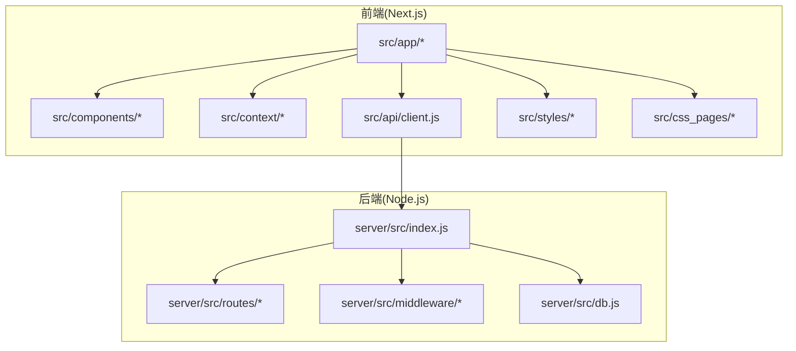
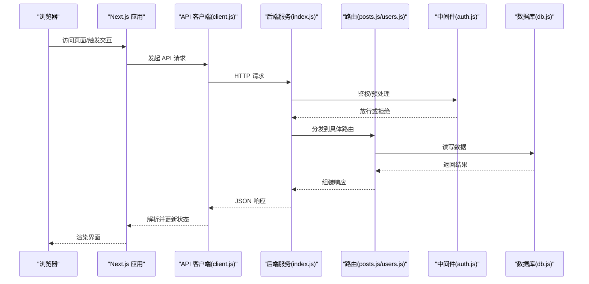
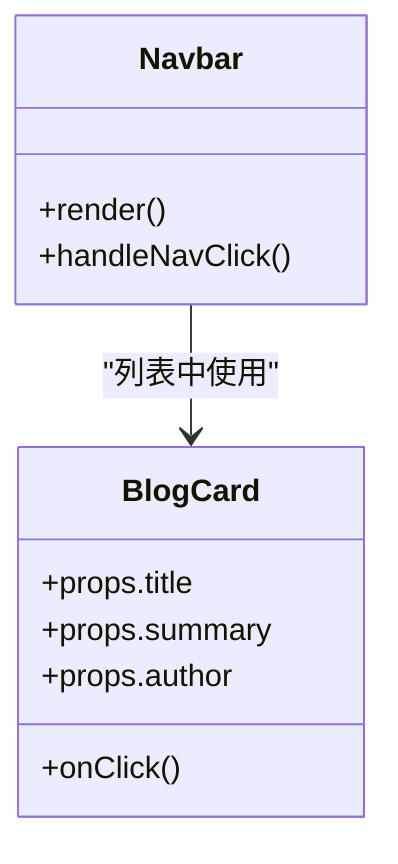
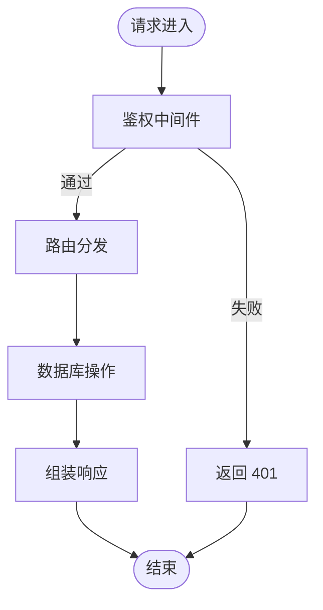
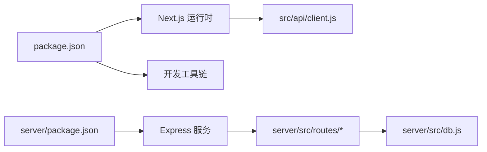

# 开发指南

<cite>
**本文引用的文件**
- [README.md](file://README.md)
- [package.json](file://package.json)
- [next.config.mjs](file://next.config.mjs)
- [postcss.config.mjs](file://postcss.config.mjs)
- [tsconfig.json](file://tsconfig.json)
- [jsconfig.json](file://jsconfig.json)
- [server/package.json](file://server/package.json)
- [server/src/index.js](file://server/src/index.js)
- [server/src/db.js](file://server/src/db.js)
- [server/src/middleware/auth.js](file://server/src/middleware/auth.js)
- [server/src/routes/posts.js](file://server/src/routes/posts.js)
- [server/src/routes/users.js](file://server/src/routes/users.js)
- [src/app/layout.jsx](file://src/app/layout.jsx)
- [src/app/page.jsx](file://src/app/page.jsx)
- [src/app/providers.jsx](file://src/app/providers.jsx)
- [src/app/globals.css](file://src/app/globals.css)
- [src/components/Navbar/navbar.jsx](file://src/components/Navbar/navbar.jsx)
- [src/components/BlogCard/BlogCard.jsx](file://src/components/BlogCard/BlogCard.jsx)
- [src/context/AuthContext.tsx](file://src/context/AuthContext.tsx)
- [src/api/client.js](file://src/api/client.js)
- [scripts/generate-icons.js](file://scripts/generate-icons.js)
</cite>

## 目录
1. [简介](#简介)
2. [项目结构](#项目结构)
3. [核心组件](#核心组件)
4. [架构总览](#架构总览)
5. [详细组件分析](#详细组件分析)
6. [依赖分析](#依赖分析)
7. [性能考虑](#性能考虑)
8. [故障排查指南](#故障排查指南)
9. [结论](#结论)
10. [附录](#附录)

## 简介
本指南面向贡献者，提供从环境搭建、工具配置到编码规范、Git 工作流、新功能开发流程、代码审查标准、性能优化与调试方法、文档编写规范的完整说明。目标是让新成员快速上手并高效协作。

## 项目结构
本项目采用前后端同仓（monorepo）组织方式：
- 前端基于 Next.js App Router，使用 React、TypeScript/JavaScript、CSS Modules 与全局样式。
- 后端为独立 Node.js 服务，位于 server 目录，提供 REST API。
- 脚本与测试资源位于 scripts 与 e2e 等目录。

图表来源
- [src/app/layout.jsx:1-200](file://src/app/layout.jsx#L1-L200)
- [src/app/page.jsx:1-200](file://src/app/page.jsx#L1-L200)
- [src/components/Navbar/navbar.jsx:1-200](file://src/components/Navbar/navbar.jsx#L1-L200)
- [src/components/BlogCard/BlogCard.jsx:1-200](file://src/components/BlogCard/BlogCard.jsx#L1-L200)
- [src/context/AuthContext.tsx:1-200](file://src/context/AuthContext.tsx#L1-L200)
- [src/api/client.js:1-200](file://src/api/client.js#L1-L200)
- [server/src/index.js:1-200](file://server/src/index.js#L1-L200)
- [server/src/db.js:1-200](file://server/src/db.js#L1-L200)
- [server/src/middleware/auth.js:1-200](file://server/src/middleware/auth.js#L1-L200)
- [server/src/routes/posts.js:1-200](file://server/src/routes/posts.js#L1-L200)
- [server/src/routes/users.js:1-200](file://server/src/routes/users.js#L1-L200)

章节来源
- [README.md:1-200](file://README.md#L1-L200)
- [package.json:1-200](file://package.json#L1-L200)
- [next.config.mjs:1-200](file://next.config.mjs#L1-L200)
- [postcss.config.mjs:1-200](file://postcss.config.mjs#L1-L200)
- [tsconfig.json:1-200](file://tsconfig.json#L1-L200)
- [jsconfig.json:1-200](file://jsconfig.json#L1-L200)
- [server/package.json:1-200](file://server/package.json#L1-L200)

## 核心组件
- 应用外壳与布局
  - 根布局与页面入口位于 src/app 下，负责全局样式注入、主题与上下文提供者挂载。
- 组件库
  - 通用 UI 组件集中在 src/components，按功能域划分，配合 CSS Modules 实现样式隔离。
- 状态与认证
  - 认证上下文在 src/context/AuthContext.tsx，统一处理登录态与用户信息。
- API 客户端
  - 统一的 HTTP 请求封装在 src/api/client.js，集中管理基础地址、拦截器与错误处理。
- 后端服务
  - server/src/index.js 启动 Express 服务，注册路由与中间件；db.js 管理数据库连接；middleware/auth.js 提供鉴权逻辑；routes 下按领域拆分接口。

章节来源
- [src/app/layout.jsx:1-200](file://src/app/layout.jsx#L1-L200)
- [src/app/page.jsx:1-200](file://src/app/page.jsx#L1-L200)
- [src/app/providers.jsx:1-200](file://src/app/providers.jsx#L1-L200)
- [src/components/Navbar/navbar.jsx:1-200](file://src/components/Navbar/navbar.jsx#L1-L200)
- [src/components/BlogCard/BlogCard.jsx:1-200](file://src/components/BlogCard/BlogCard.jsx#L1-L200)
- [src/context/AuthContext.tsx:1-200](file://src/context/AuthContext.tsx#L1-L200)
- [src/api/client.js:1-200](file://src/api/client.js#L1-L200)
- [server/src/index.js:1-200](file://server/src/index.js#L1-L200)
- [server/src/db.js:1-200](file://server/src/db.js#L1-L200)
- [server/src/middleware/auth.js:1-200](file://server/src/middleware/auth.js#L1-L200)
- [server/src/routes/posts.js:1-200](file://server/src/routes/posts.js#L1-L200)
- [server/src/routes/users.js:1-200](file://server/src/routes/users.js#L1-L200)

## 架构总览
前后端通过 HTTP 通信，前端通过 API 客户端调用后端接口；后端以 Express 提供服务，结合中间件进行鉴权与日志，数据层由 db.js 抽象。

图表来源
- [src/api/client.js:1-200](file://src/api/client.js#L1-L200)
- [server/src/index.js:1-200](file://server/src/index.js#L1-L200)
- [server/src/middleware/auth.js:1-200](file://server/src/middleware/auth.js#L1-L200)
- [server/src/routes/posts.js:1-200](file://server/src/routes/posts.js#L1-L200)
- [server/src/routes/users.js:1-200](file://server/src/routes/users.js#L1-L200)
- [server/src/db.js:1-200](file://server/src/db.js#L1-L200)

## 详细组件分析

### 前端应用外壳与布局
- 职责
  - 定义全局 HTML 结构、字体与主题变量、全局样式注入。
  - 挂载 Provider（如认证上下文），确保子树可访问共享状态。
- 关键点
  - 使用 App Router 的 layout 作为根容器，page 作为首页入口。
  - 全局样式建议优先使用 CSS Modules，必要时引入全局样式。

章节来源
- [src/app/layout.jsx:1-200](file://src/app/layout.jsx#L1-L200)
- [src/app/page.jsx:1-200](file://src/app/page.jsx#L1-L200)
- [src/app/providers.jsx:1-200](file://src/app/providers.jsx#L1-L200)
- [src/app/globals.css:1-200](file://src/app/globals.css#L1-L200)

### 导航与卡片组件
- 导航栏
  - 负责顶部导航、菜单项与移动端适配。
- 文章卡片
  - 展示文章摘要、分类、作者等信息，支持点击跳转详情。

图表来源
- [src/components/Navbar/navbar.jsx:1-200](file://src/components/Navbar/navbar.jsx#L1-L200)
- [src/components/BlogCard/BlogCard.jsx:1-200](file://src/components/BlogCard/BlogCard.jsx#L1-L200)

章节来源
- [src/components/Navbar/navbar.jsx:1-200](file://src/components/Navbar/navbar.jsx#L1-L200)
- [src/components/BlogCard/BlogCard.jsx:1-200](file://src/components/BlogCard/BlogCard.jsx#L1-L200)

### 认证上下文
- 职责
  - 维护用户登录态、用户信息、登录/登出操作。
  - 为受保护页面提供鉴权守卫。
- 关键点
  - 建议在 API 客户端中统一附加 token，并在响应拦截器中处理未授权跳转。

章节来源
- [src/context/AuthContext.tsx:1-200](file://src/context/AuthContext.tsx#L1-L200)

### API 客户端
- 职责
  - 封装 fetch/axios 调用，设置 baseURL、超时、重试策略。
  - 统一错误处理与业务码转换。
- 关键点
  - 对敏感接口增加鉴权头；对网络异常做降级提示。

章节来源
- [src/api/client.js:1-200](file://src/api/client.js#L1-L200)

### 后端服务与路由
- 服务入口
  - 初始化 Express、加载中间件、注册路由、监听端口。
- 路由
  - 按领域拆分 posts、users 等路由，保持单一职责。
- 中间件
  - auth 中间件校验令牌、权限控制。
- 数据层
  - db.js 封装数据库连接与查询方法。

图表来源
- [server/src/index.js:1-200](file://server/src/index.js#L1-L200)
- [server/src/middleware/auth.js:1-200](file://server/src/middleware/auth.js#L1-L200)
- [server/src/routes/posts.js:1-200](file://server/src/routes/posts.js#L1-L200)
- [server/src/routes/users.js:1-200](file://server/src/routes/users.js#L1-L200)
- [server/src/db.js:1-200](file://server/src/db.js#L1-L200)

章节来源
- [server/src/index.js:1-200](file://server/src/index.js#L1-L200)
- [server/src/middleware/auth.js:1-200](file://server/src/middleware/auth.js#L1-L200)
- [server/src/routes/posts.js:1-200](file://server/src/routes/posts.js#L1-L200)
- [server/src/routes/users.js:1-200](file://server/src/routes/users.js#L1-L200)
- [server/src/db.js:1-200](file://server/src/db.js#L1-L200)

## 依赖分析
- 前端依赖
  - Next.js、React、TypeScript/JS 配置、PostCSS、Tailwind（若启用）。
- 后端依赖
  - Express、数据库驱动（根据 db.js 实现）、JWT 或其他鉴权库（根据 auth.js 实现）。
- 构建与脚本
  - package.json 中定义 dev/build/start 等命令；scripts 目录包含辅助脚本。

图表来源
- [package.json:1-200](file://package.json#L1-L200)
- [server/package.json:1-200](file://server/package.json#L1-L200)
- [src/api/client.js:1-200](file://src/api/client.js#L1-L200)
- [server/src/index.js:1-200](file://server/src/index.js#L1-L200)
- [server/src/db.js:1-200](file://server/src/db.js#L1-L200)

章节来源
- [package.json:1-200](file://package.json#L1-L200)
- [server/package.json:1-200](file://server/package.json#L1-L200)
- [next.config.mjs:1-200](file://next.config.mjs#L1-L200)
- [postcss.config.mjs:1-200](file://postcss.config.mjs#L1-L200)
- [tsconfig.json:1-200](file://tsconfig.json#L1-L200)
- [jsconfig.json:1-200](file://jsconfig.json#L1-L200)

## 性能考虑
- 前端
  - 合理使用 Next.js 的静态生成与增量再生成，减少首屏时间。
  - 图片与图标按需加载，避免打包体积过大。
  - 组件懒加载与代码分割，降低主包大小。
  - 使用 CSS Modules 避免样式冲突与冗余。
- 后端
  - 接口幂等设计，避免重复写入。
  - 数据库查询加索引，避免全表扫描。
  - 合理缓存热点数据，减轻数据库压力。
- 监控与度量
  - 关键路径埋点，记录耗时与错误率。
  - 使用浏览器 Performance 面板与后端日志定位瓶颈。

[本节为通用指导，不直接分析具体文件]

## 故障排查指南
- 常见问题
  - 端口占用：修改 next.config 或后端端口配置后重启。
  - 跨域问题：检查 API 客户端 baseURL 与后端 CORS 配置。
  - 鉴权失败：确认 token 是否携带、过期时间与刷新策略。
  - 数据库连接失败：检查环境变量与连接参数。
- 调试建议
  - 前端：浏览器开发者工具 Network/Console/Performance。
  - 后端：打印结构化日志，关注错误堆栈与请求 ID。
  - 端到端：使用 e2e 用例复现问题，保留截图与上下文。

章节来源
- [src/api/client.js:1-200](file://src/api/client.js#L1-L200)
- [server/src/index.js:1-200](file://server/src/index.js#L1-L200)
- [server/src/middleware/auth.js:1-200](file://server/src/middleware/auth.js#L1-L200)
- [server/src/db.js:1-200](file://server/src/db.js#L1-L200)

## 结论
遵循本指南的环境配置、编码规范与工作流程，可显著提升团队协作效率与代码质量。建议在新功能开发与迭代中持续完善自动化测试与文档，保障系统稳定性与可维护性。

[本节为总结，不直接分析具体文件]

## 附录

### 开发环境配置与推荐工具
- 运行环境
  - Node.js LTS 版本；建议使用 nvm 管理多版本。
- IDE 与插件
  - VS Code：ESLint、Prettier、Tailwind CSS（若启用）、TypeScript、GraphQL（可选）、Error Lens、GitLens。
  - 编辑器设置：保存时自动格式化；开启 TS 类型检查；禁用行尾多余空格。
- 调试配置
  - 前端：Chrome DevTools 断点调试；Next.js 内置 Source Map。
  - 后端：Node.js 调试器或 IDE 远程调试；结构化日志输出。
- 本地开发
  - 安装依赖后分别启动前端与后端服务；确保环境变量正确。

章节来源
- [package.json:1-200](file://package.json#L1-L200)
- [server/package.json:1-200](file://server/package.json#L1-L200)
- [next.config.mjs:1-200](file://next.config.mjs#L1-L200)
- [postcss.config.mjs:1-200](file://postcss.config.mjs#L1-L200)
- [tsconfig.json:1-200](file://tsconfig.json#L1-L200)
- [jsconfig.json:1-200](file://jsconfig.json#L1-L200)

### 代码规范与风格指南
- JavaScript/TypeScript
  - 使用 ESLint + Prettier 统一风格；函数式与声明式优先；避免深层嵌套。
  - 命名：模块小驼峰，组件大驼峰，常量全大写；文件与目录语义化。
  - 类型：优先 TypeScript；对外部数据严格类型约束。
- React 组件
  - 组件职责单一；Props 明确且最小化；副作用使用 useEffect/useEffect 清理。
  - 状态提升与组合优于继承；避免不必要的重渲染。
- CSS 样式
  - 优先 CSS Modules；变量集中管理；避免全局污染。
  - 响应式与主题变量统一管理；动画与过渡谨慎使用。
- 提交信息
  - 遵循约定式提交：feat/fix/docs/style/refactor/perf/test/build/ci/chore/revert。
  - 描述清晰，关联 Issue 编号。

章节来源
- [src/components/Navbar/navbar.jsx:1-200](file://src/components/Navbar/navbar.jsx#L1-L200)
- [src/components/BlogCard/BlogCard.jsx:1-200](file://src/components/BlogCard/BlogCard.jsx#L1-L200)
- [src/app/globals.css:1-200](file://src/app/globals.css#L1-L200)
- [postcss.config.mjs:1-200](file://postcss.config.mjs#L1-L200)

### Git 工作流与分支管理
- 分支模型
  - main：稳定发布分支；develop：集成开发分支；feature/*：功能分支；hotfix/*：紧急修复。
- 提交流程
  - 从 develop 拉取最新；创建 feature 分支；完成自测后推送；发起 Pull Request。
- 合并策略
  - PR 需至少一名 Reviewer 批准；CI 通过后合并至 develop；定期打 tag 发布。

[本节为通用实践，不直接分析具体文件]

### 新功能开发全流程
- 需求分析
  - 明确目标、范围与验收标准；评估风险与依赖。
- 设计与评审
  - 输出技术方案与接口契约；团队评审通过后实施。
- 开发实现
  - 遵循编码规范；编写单元测试与必要文档。
- 联调与测试
  - 前后端联调；E2E 覆盖关键路径；性能与安全扫描。
- 发布与回滚
  - 灰度发布；监控指标；准备回滚预案。

[本节为通用流程，不直接分析具体文件]

### 代码审查标准与流程
- 审查要点
  - 可读性与可维护性；安全性与健壮性；性能影响；测试覆盖率。
- 流程
  - 提交 PR 附带变更说明；Reviewer 给出意见；作者逐项回复与修改；达成一致后合并。

[本节为通用流程，不直接分析具体文件]

### 文档编写规范与更新流程
- 规范
  - 标题层级清晰；术语一致；配图与示例准确；链接有效。
- 流程
  - 新增/变更同步更新 docs 目录；PR 中注明文档变更；发布前复核。

章节来源
- [docs/01系统架构.md:1-200](file://docs/01系统架构.md#L1-L200)
- [docs/02数据模型.md:1-200](file://docs/02数据模型.md#L1-L200)
- [docs/03前端架构.md:1-200](file://docs/03前端架构.md#L1-L200)
- [docs/04后端架构.md:1-200](file://docs/04后端架构.md#L1-L200)
- [docs/05api接口文档.md:1-200](file://docs/05api接口文档.md#L1-L200)

### 常用脚本与工具
- 图标生成
  - 使用 scripts/generate-icons.js 批量生成站点图标与元数据。
- 构建与部署
  - 参考 package.json 中的脚本命令；生产构建前执行 lint 与测试。

章节来源
- [scripts/generate-icons.js:1-200](file://scripts/generate-icons.js#L1-L200)
- [package.json:1-200](file://package.json#L1-L200)